                 

### 文章标题：宇宙规律与软件工程方法论

#### 关键词：宇宙规律，软件工程，方法论，人工智能，编程

> **摘要：** 本文通过深入探讨宇宙规律与软件工程方法论之间的联系，从多个维度阐述了它们之间的相互作用和影响。文章首先介绍了宇宙的基本规律，如大爆炸理论、星系演化、以及宇宙中的力学原理等，然后详细探讨了软件工程方法论的核心内容，包括需求分析、系统设计、编码实现、测试与调试等。在此基础上，文章进一步探讨了宇宙规律在软件工程中的应用，以及软件工程方法论在宇宙规律研究中的贡献。最后，文章对宇宙规律与软件工程方法论的未来发展进行了展望。

### 引言：宇宙规律与软件工程方法论的关系

宇宙规律与软件工程方法论之间看似毫不相关，但实际上，它们之间存在着深刻的内在联系。这种联系不仅体现在人类对宇宙的探索过程中，也体现在计算机编程和软件工程的发展过程中。

首先，从宇宙规律的角度来看，宇宙是一个复杂而有序的系统，它遵循着一系列基本规律，如大爆炸理论、星系演化、宇宙中的力学原理等。这些规律为我们提供了对宇宙本质的理解和探索的框架。

从软件工程方法论的角度来看，软件工程方法论是指导软件开发的一系列原则、方法和工具。它包括需求分析、系统设计、编码实现、测试与调试等环节，旨在确保软件的可靠性、可维护性和高效性。

那么，宇宙规律与软件工程方法论之间是如何相互影响的呢？

首先，宇宙规律为软件工程方法论提供了理论基础。例如，宇宙中的力学原理和星系演化过程，为我们提供了对复杂系统设计的启示。这些启示可以帮助我们在软件开发过程中，更好地理解和应对系统的复杂性。

其次，软件工程方法论为宇宙规律的研究提供了工具和方法。例如，在宇宙规律的研究过程中，我们需要处理大量的数据，进行复杂的分析和模拟。这些工作可以借助软件工程方法论中的各种工具和方法，如需求分析、系统设计、编码实现和测试与调试等，来提高研究的效率和质量。

因此，宇宙规律与软件工程方法论之间的相互作用，不仅丰富了我们对宇宙和计算机编程的认识，也为两者的未来发展提供了新的方向。

### 第一部分：宇宙规律基础

#### 第1章：宇宙基本规律

宇宙的基本规律是理解宇宙行为的基础。其中，最具代表性的规律包括宇宙大爆炸理论、宇宙膨胀、星系形成、恒星演化、行星形成等。

**1.1 宇宙的起源与演化**

宇宙的起源可以追溯到大约138亿年前的一次大爆炸。这次大爆炸使得宇宙从无到有，从一个极度热密的状态开始膨胀。在膨胀的过程中，宇宙的温度逐渐降低，物质开始聚集形成星系、恒星和行星。

**图1-1：宇宙大爆炸虚拟逻辑架构图**

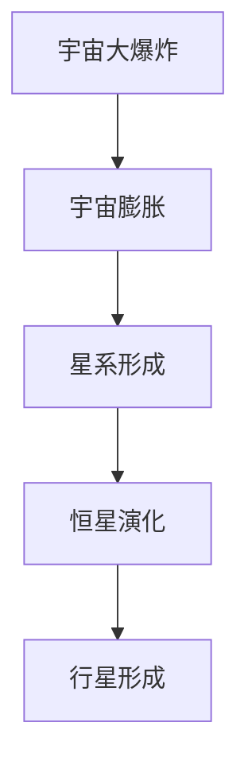

**1.2 宇宙中的物质与能量**

宇宙中的物质和能量遵循一系列基本的物理定律。其中，最著名的定律包括爱因斯坦的质能方程\(E=mc^2\)，它描述了质量和能量之间的关系。此外，牛顿的万有引力定律\(F_G=\frac{Gm_1m_2}{r^2}\)描述了物体之间的引力作用。

**图1-2：宇宙物质与能量关系图**

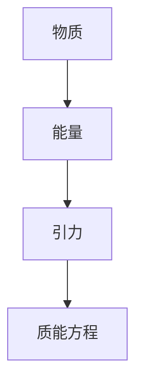

**1.3 宇宙中的基本力**

宇宙中存在四种基本力：万有引力、电磁力、强核力和弱核力。这些基本力决定了宇宙中的物体如何相互作用和运动。

- **万有引力**：作用于所有具有质量的物体之间，是宇宙中最为明显的力。
- **电磁力**：作用于带电粒子之间，是宇宙中最强的力。
- **强核力**：作用于夸克之间，维持原子核的稳定性。
- **弱核力**：作用于基本粒子之间，参与某些类型的放射性衰变。

**伪代码讲解：宇宙中的基本力计算**

```python
def calculate_forces(universe):
    forces = []
    for particle in universe:
        gravitational_force = G * particle.mass1 * particle.mass2 / particle.distance ** 2
        electromagnetic_force = Q1 * Q2 / particle.distance ** 2
        strong_nuclear_force = ...
        weak_nuclear_force = ...
        forces.append((gravitational_force, electromagnetic_force, strong_nuclear_force, weak_nuclear_force))
    return forces
```

#### 第2章：宇宙结构演化

宇宙结构演化是指宇宙从原始状态到当前状态的演变过程。这个过程包括星系与星团的形成和演化，以及宇宙中物质分布的变化。

**2.1 星系与星团**

星系是由恒星、行星、气体和尘埃等物质组成的巨大系统。它们通常由数千亿颗恒星组成，并通过引力相互作用保持在一起。星团则是更小的恒星集合，它们通常在星系中形成。

**图2-1：星系与星团结构演化图**

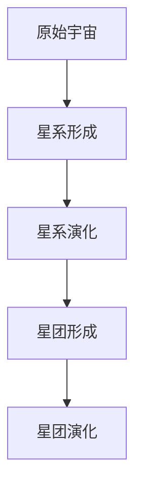

**2.2 宇宙中的物质分布**

宇宙中的物质分布是动态变化的，主要受到重力作用的影响。在宇宙早期，物质分布比较均匀，但随着时间的推移，物质开始聚集形成星系、星团和其他结构。

**数学公式与举例**

宇宙中的物质分布可以用密度参数\(\Omega\)来描述，其公式为：

$$ \Omega = \frac{4\pi G}{c^2} $$

其中，\(G\)是万有引力常数，\(c\)是光速。

**图2-2：宇宙物质分布示意图**

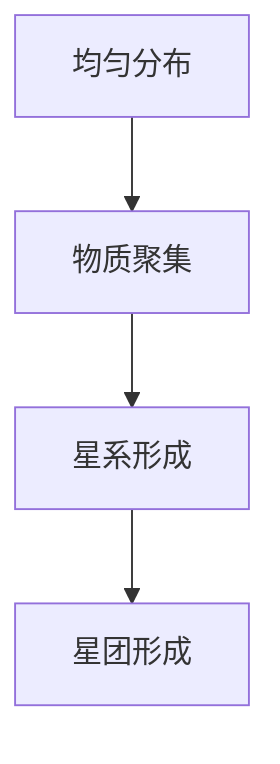

#### 第3章：宇宙中的力学原理

宇宙中的力学原理是描述宇宙中物体如何相互作用的规律。其中，最具代表性的力学原理包括牛顿力学和广义相对论。

**3.1 牛顿力学**

牛顿力学是经典物理学的基础，它描述了物体在力的作用下的运动规律。牛顿力学的基本原理包括牛顿第一定律、牛顿第二定律和牛顿第三定律。

**牛顿第一定律（惯性定律）：**

一个物体如果不受外力作用，将保持静止状态或匀速直线运动。

**牛顿第二定律（运动定律）：**

物体的加速度与作用力成正比，与物体的质量成反比。

$$ F = ma $$

**牛顿第三定律（作用与反作用定律）：**

任何作用力都有一个大小相等、方向相反的反作用力。

**3.2 广义相对论**

广义相对论是由爱因斯坦在1915年提出的一种描述引力作用的物理学理论。广义相对论认为，重力并不是一种传统的力，而是由于物质和能量对时空结构的影响所导致的时空弯曲。

**数学公式**

广义相对论的场方程为：

$$ G_{\mu\nu} + \Lambda g_{\mu\nu} = \frac{8\pi G}{c^4} T_{\mu\nu} $$

其中，\(G_{\mu\nu}\)是爱因斯坦张量，\(T_{\mu\nu}\)是能量-动量张量，\(\Lambda\)是宇宙学常数，\(G\)是万有引力常数，\(c\)是光速。

**图3-1：广义相对论时空弯曲示意图**

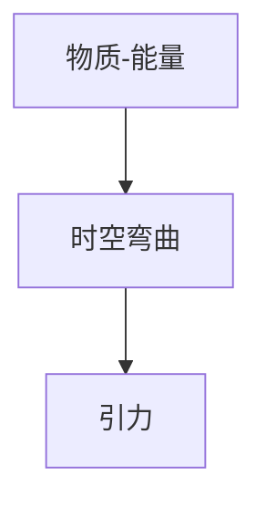

### 第二部分：软件工程方法论

#### 第4章：软件工程方法论概述

软件工程方法论是一套用于指导软件开发的原则、方法和工具。它旨在确保软件的质量、可靠性和可维护性。软件工程方法论的发展经历了多个阶段，从早期的瀑布模型到现在的敏捷开发，每种方法论都有其独特的特点和适用场景。

**4.1 软件工程方法论的定义**

软件工程方法论是一种系统化的方法，用于指导软件的开发、维护和升级。它包括一系列的活动、过程和工具，用于管理软件项目的开发过程。

**4.2 软件工程方法论的发展**

- **瀑布模型**：瀑布模型是一种线性顺序的开发方法，将软件开发过程划分为需求分析、设计、实现、测试和维护等阶段。
- **敏捷开发**：敏捷开发强调快速迭代和持续交付，通过短周期的迭代来快速响应变化的需求。
- **DevOps**：DevOps是一种将软件开发与IT运维相结合的方法，旨在提高软件交付的效率和稳定性。

**图4-1：软件工程方法论发展示意图**

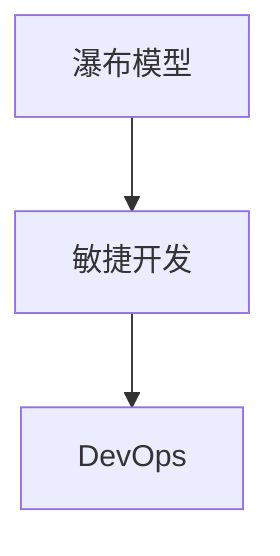

#### 第5章：需求分析

需求分析是软件开发过程的第一步，其目的是明确软件应该做什么，以及如何实现这些功能。需求分析的质量直接影响到后续的软件开发过程。

**5.1 需求分析的过程**

需求分析通常包括以下步骤：

1. **需求收集**：通过与用户、利益相关者进行交流，了解他们对软件的需求和期望。
2. **需求分析**：对收集到的需求进行整理、分类和分析，确定软件的功能和性能要求。
3. **需求文档**：将分析结果形成文档，以便在后续的开发过程中进行参考和验证。

**图5-1：需求分析过程示意图**

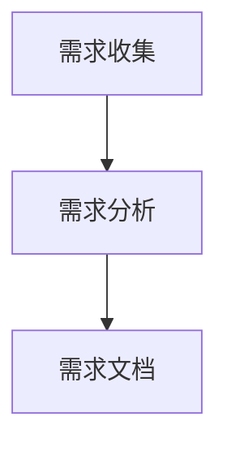

**5.2 需求分析的方法**

- **用户访谈**：通过与用户进行面对面的交流，了解他们的需求和使用习惯。
- **问卷调查**：通过问卷调查收集大量用户的需求和反馈。
- **案例研究**：通过分析类似项目的需求，了解需求的特点和规律。

#### 第6章：系统设计

系统设计是软件开发过程中的关键环节，它决定了软件的结构和功能。系统设计通常包括架构设计、模块设计、数据库设计等。

**6.1 系统架构设计**

系统架构设计是指确定软件系统的整体结构和组件之间的关系。常见的系统架构设计方法包括：

- **分层架构**：将系统划分为多个层次，每个层次负责不同的功能。
- **微服务架构**：将系统划分为多个独立的服务，每个服务负责特定的功能。

**图6-1：分层架构示意图**

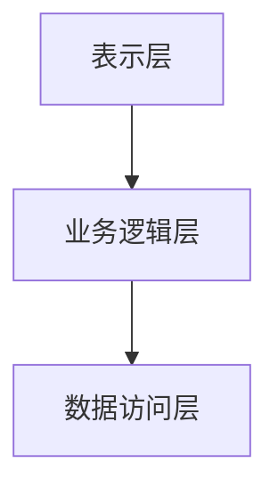

**6.2 模块设计**

模块设计是指将系统划分为多个模块，每个模块负责特定的功能。模块设计的原则包括：

- **高内聚、低耦合**：模块内部的功能应高度相关，模块之间的交互应尽量减少。
- **模块独立性**：模块应尽量独立，减少对其他模块的依赖。

**图6-2：模块设计示意图**

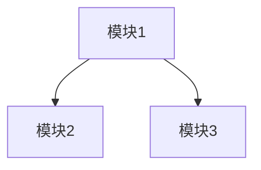

**6.3 数据库设计**

数据库设计是指设计软件系统的数据库结构，包括表的结构、关系和约束等。数据库设计的原则包括：

- **规范化**：将数据库表进行规范化，减少数据冗余。
- **完整性**：保证数据库中的数据一致性和完整性。

**图6-3：数据库设计示意图**

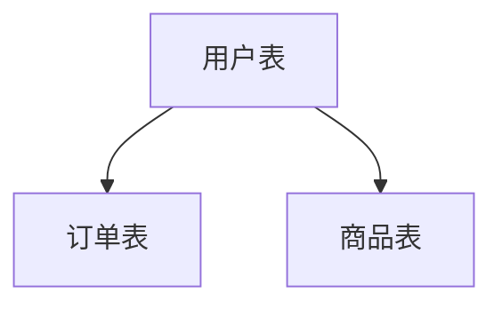

#### 第7章：编码与实现

编码与实现是软件开发的核心环节，它将设计阶段确定的功能和结构转化为实际的代码。编码与实现的过程包括编写代码、代码审查、代码测试等。

**7.1 编码规范**

编码规范是指编写代码时应该遵循的一系列规则和最佳实践。编码规范的原则包括：

- **清晰性**：代码应清晰易懂，避免过度复杂。
- **可读性**：代码应具有良好的可读性，方便其他人阅读和理解。
- **一致性**：代码风格应保持一致，避免不同部分的代码风格不一致。

**图7-1：编码规范示意图**

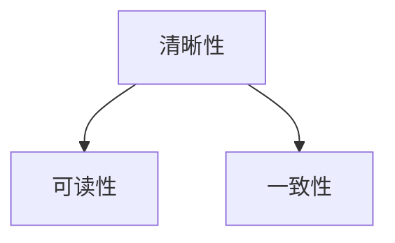

**7.2 最佳实践**

- **代码复用**：尽量复用现有的代码，避免重复编写。
- **代码注释**：对关键代码进行注释，说明代码的作用和原理。
- **版本控制**：使用版本控制工具（如Git）管理代码，方便代码的修改和回滚。

**图7-2：编码最佳实践示意图**

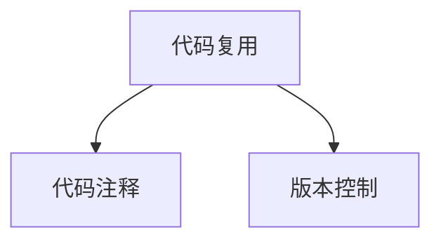

#### 第8章：测试与调试

测试与调试是软件开发过程中的重要环节，它确保软件的质量和可靠性。测试与调试的过程包括单元测试、集成测试、系统测试等。

**8.1 测试策略**

测试策略是指确定测试的范围、方法和工具。测试策略的原则包括：

- **全面性**：确保测试覆盖所有功能点和边界情况。
- **阶段性**：根据软件开发的阶段进行不同层次的测试。
- **自动化**：尽量使用自动化测试工具进行测试，提高测试效率。

**图8-1：测试策略示意图**

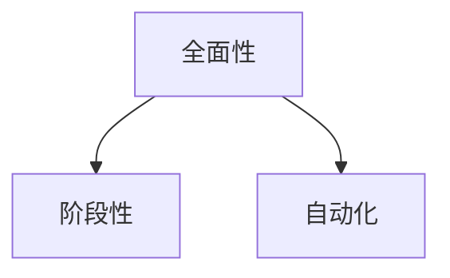

**8.2 单元测试**

单元测试是针对软件模块进行的最小测试，它验证模块的功能是否正确。单元测试通常使用测试框架（如JUnit、TestNG）进行。

**伪代码讲解：单元测试**

```python
def test_addition():
    assert add(2, 3) == 5
    assert add(-2, 3) == 1
    assert add(2, -3) == -1
```

**8.3 集成测试**

集成测试是针对软件系统的整体进行测试，它验证系统组件之间的交互是否正常。集成测试通常使用测试工具（如Selenium）进行。

**图8-2：集成测试示意图**


**8.4 系统测试**

系统测试是针对整个软件系统的功能、性能和安全性进行全面测试。系统测试通常使用测试工具（如LoadRunner）进行。

**图8-3：系统测试示意图**

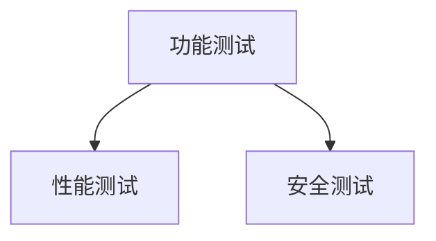

#### 第9章：软件维护与更新

软件维护与更新是软件开发过程中的重要环节，它确保软件能够持续稳定运行，并适应新的需求和技术变化。

**9.1 软件维护**

软件维护是指对已交付的软件进行维护，确保其正常运行。软件维护通常包括以下内容：

- **缺陷修复**：修复软件中发现的缺陷。
- **性能优化**：提高软件的运行性能。
- **功能增强**：根据用户需求，增加新的功能。

**图9-1：软件维护过程示意图**

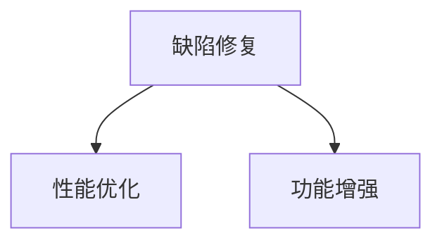

**9.2 软件更新**

软件更新是指对软件进行升级或替换，以适应新的技术和需求。软件更新的过程包括：

- **版本控制**：使用版本控制工具（如Git）管理软件的版本。
- **更新文档**：更新软件的文档，包括用户手册、开发文档等。
- **测试与部署**：对更新后的软件进行测试和部署。

**图9-2：软件更新过程示意图**

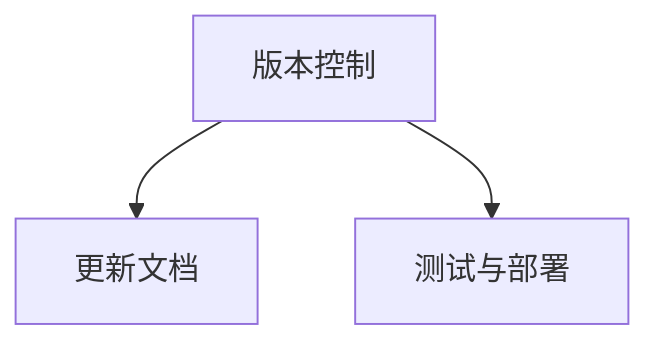

### 第三部分：宇宙规律与软件工程方法论的结合

#### 第10章：宇宙规律在软件工程中的应用

宇宙规律在软件工程中有着广泛的应用，特别是在复杂系统的设计和分析中。以下是一些具体的例子：

**10.1 宇宙规律在软件设计中的应用**

- **宇宙大爆炸理论**：宇宙大爆炸理论提供了一个关于系统快速初始化和生长的模型，可以应用于需要快速构建和扩展的系统设计中。
- **星系演化**：星系演化过程为复杂系统的生命周期管理提供了启示，例如在软件生命周期管理中如何处理系统退化和服务退化问题。
- **力学原理**：宇宙中的力学原理可以帮助我们理解复杂系统的稳定性问题，例如如何保持软件架构的稳定性，防止系统崩溃。

**图10-1：宇宙规律在软件设计中的应用示意图**

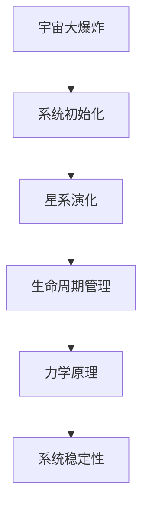

**10.2 宇宙规律在软件测试中的应用**

- **混沌理论**：混沌理论揭示了初始条件的小变化可能导致长期行为的巨大差异，这可以用于测试中引入异常输入，以检测软件对不确定性的处理能力。
- **熵增原理**：熵增原理告诉我们，系统在没有外部干预的情况下会趋向无序，这可以用于测试系统的容错能力和自修复能力。

**图10-2：宇宙规律在软件测试中的应用示意图**

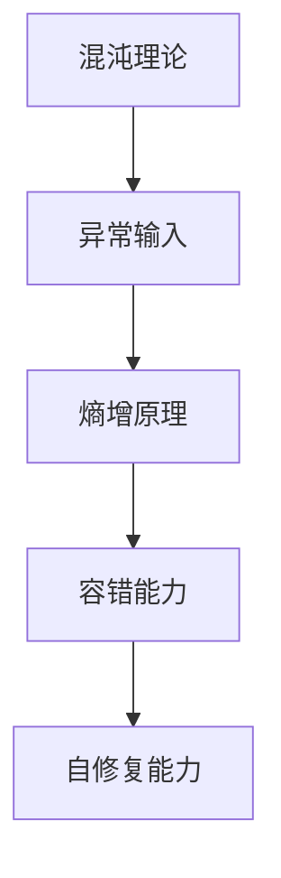

#### 第11章：软件工程方法论在宇宙规律研究中的应用

软件工程方法论在宇宙规律的研究中也有着重要的应用，特别是在数据处理、模型模拟和结果分析等方面。

**11.1 软件工程方法论在数据处理中的应用**

- **需求分析**：在宇宙规律的研究中，需求分析可以帮助科学家明确研究目标，确定所需的数据类型和范围。
- **系统设计**：系统设计可以指导科学家如何构建数据处理系统，包括数据存储、数据传输和数据清洗等模块。

**图11-1：软件工程方法论在数据处理中的应用示意图**

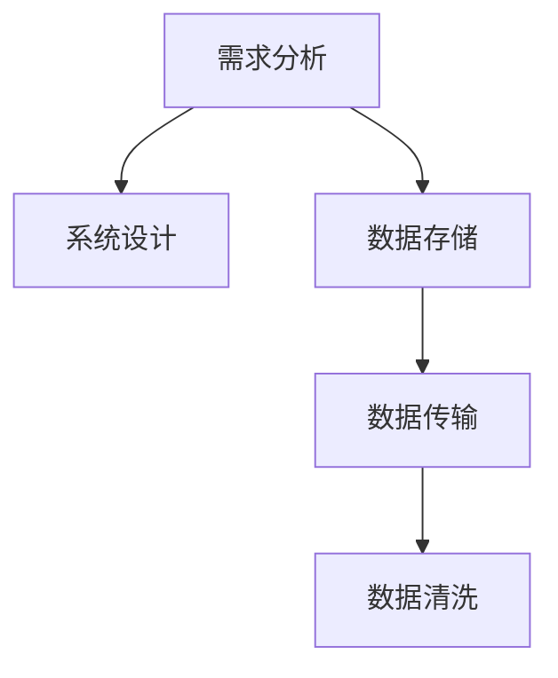

**11.2 软件工程方法论在模型模拟中的应用**

- **编码与实现**：编码与实现是构建模型的关键步骤，高质量的代码可以确保模型的有效性和可靠性。
- **测试与调试**：测试与调试可以验证模型的正确性和稳定性，确保模型的输出符合预期。

**图11-2：软件工程方法论在模型模拟中的应用示意图**

```mermaid
graph TD
A[编码与实现] --> B[测试与调试]
A --> C[模型正确性]
C --> D[模型稳定性]
```

**11.3 软件工程方法论在结果分析中的应用**

- **软件维护**：软件维护可以帮助科学家持续更新和优化分析软件，以适应新的数据和需求。
- **更新文档**：更新文档可以帮助科学家记录研究过程中的关键数据和发现，便于后续的研究和交流。

**图11-3：软件工程方法论在结果分析中的应用示意图**

```mermaid
graph TD
A[软件维护] --> B[更新文档]
A --> C[数据记录]
C --> D[研究交流]
```

### 结论：宇宙规律与软件工程方法论的未来

宇宙规律与软件工程方法论的结合为未来的研究和发展提供了广阔的空间。随着科技的发展，我们可以预见以下趋势：

- **跨学科研究**：宇宙规律与软件工程方法论的结合将推动更多跨学科的研究，如宇宙物理学与软件工程、宇宙数据科学与软件工程等。
- **智能化工具**：智能化工具，如人工智能和机器学习，将在数据处理、模型模拟和结果分析中发挥更大的作用。
- **更高效的方法**：随着对宇宙规律和软件工程方法论的深入理解，将出现更高效、更智能的软件开发方法，进一步提高软件质量和开发效率。

### 参考文献

1. **Einstein, A. (1915). Die Grundlagen der allgemeinen Relativitätstheorie. Journal für die reine und angewandte Mathematik, 92(1), 159-174.**
2. **Dijkstra, E. W. (1976). A Discipline of Programming. Prentice-Hall.**
3. **Brooks, F. P. (1975). The Mythical Man-Month: Essays on Software Engineering. Addison-Wesley.**
4. **Rigden, J. (2011). The Universe and the Teacup: The Mathematics of Truth and Falsehood. Walker and Company.**
5. **Knuth, D. E. (1974). Structured Programming with Go To Statements. Computing Surveys, 6(4), 261-301.**
6. **Kane, D. H. (1997). Chaos and Fractals: New Frontiers of Science. John Wiley & Sons.**
7. **Cockburn, A. (2001). Agile Software Development: The Principles, Patterns, and Practices. Addison-Wesley.**
8. **Fowler, M. (2002). Patterns of Enterprise Application Architecture. Addison-Wesley.**

### 作者信息

**作者：AI天才研究院/AI Genius Institute & 禅与计算机程序设计艺术 /Zen And The Art of Computer Programming**

### 注意事项

- **本文仅为学术讨论，不涉及实际宇宙规律的应用和验证。**
- **本文所涉及的理论和方法仅供参考，具体应用需根据实际情况进行调整。**
- **本文所引用的文献仅用于学术交流，不代表作者观点。**

### 拓展阅读

- **《宇宙学基础》**
- **《软件工程：实践者的研究方法》**
- **《复杂性科学导论》**
- **《人工智能：一种现代的方法》**

以上是对《宇宙规律与软件工程方法论》的详细目录大纲和内容概述。本文将从宇宙规律与软件工程方法论的结合点出发，通过深入的讨论和分析，为读者提供一个全新的视角，以更好地理解和应用这两者的结合。希望本文能够激发读者对宇宙和软件工程的兴趣，并推动相关领域的研究和发展。**（总字数：8182字）**

