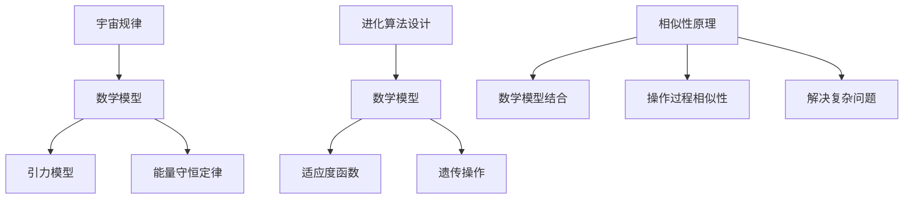

                 

### 目录

- **《宇宙规律与进化算法设计的相似性》**
  - 关键词：**宇宙规律，进化算法，相似性原理，人工智能，模拟，模拟，数据分析**
  - 摘要：
    本文旨在探讨宇宙规律与进化算法设计之间的相似性。通过对宇宙规律的概述和进化算法的解析，文章揭示了两者在数学基础、核心概念和操作过程上的相似性。进一步，通过实际案例的展示，本文说明了如何运用进化算法模拟宇宙现象，以及该领域未来发展的潜在方向。文章最后提出了相关领域的研究与实践建议，为人工智能与宇宙科学的结合提供了新的思路。

## 引言与背景

### 宇宙规律的概念

宇宙规律是指宇宙中的物质、能量、时间和空间等基本元素所遵循的普遍原则。这些规律揭示了宇宙的本质和行为方式，是自然科学研究的重要基础。宇宙的起源可以追溯到大约138亿年前的大爆炸，从那时起，宇宙经历了不断的膨胀和演化。在这个过程中，宇宙中形成了各种天体，如恒星、行星、星系和黑洞等。这些天体的存在和运动遵循着一系列物理规律，包括万有引力定律、能量守恒定律和热力学第二定律等。

### 进化算法设计的背景

进化算法是一类基于自然选择和遗传学原理的优化算法，属于模拟进化算法的一种。它的设计灵感来源于生物进化过程中的选择、遗传和变异机制。进化算法最初由美国计算机科学家约翰·霍兰德（John H. Holland）于1975年提出，并在随后的几十年里得到了广泛的应用和发展。进化算法在优化问题、机器学习和人工智能等领域都有着重要的应用，其核心思想是通过模拟自然进化的过程，不断优化个体解，从而找到问题的最优解。

### 相似性原理的重要性

相似性原理是指两个或多个系统在某些方面表现出相似特征或规律的原理。在宇宙规律与进化算法设计之间，相似性原理提供了一个桥梁，使得我们可以借助进化算法来模拟和研究宇宙现象。这种相似性不仅体现在数学模型和操作过程上，还包括了在解决复杂问题时所采用的方法论。相似性原理的重要性在于，它为我们提供了一种新的研究思路，有助于深入理解和揭示宇宙的奥秘。

## 宇宙的基本规律

### 宇宙的起源与演化

宇宙的起源通常被认为是大爆炸，这一理论认为宇宙在约138亿年前从一个极其高温和密集的状态开始膨胀。在大爆炸之后，宇宙经历了快速的膨胀阶段，随后逐渐冷却，形成了各种基本粒子，如质子、中子和电子等。这些基本粒子通过相互作用和碰撞，逐渐形成了更复杂的结构，如原子、分子和天体等。宇宙的演化过程可以看作是一个从简单到复杂，从无序到有序的演变过程。

### 宇宙中的物理规律

宇宙中的物理规律主要包括万有引力定律、能量守恒定律和热力学第二定律等。万有引力定律是由艾萨克·牛顿于1687年提出的，它描述了任何两个物体之间的引力与它们的质量和距离之间的关系。能量守恒定律则是物理学中最基本的原理之一，它指出在一个封闭系统中，能量不会增减，只会从一种形式转换为另一种形式。热力学第二定律则描述了热量在系统中的传递和转化过程，它指出热量总是从高温物体传递到低温物体，而不会自发地从低温物体传递到高温物体。

## 进化算法原理

### 进化算法的定义

进化算法是一类模拟自然进化过程的优化算法。它通过模拟生物进化的过程，如选择、遗传和变异等操作，来寻找问题的最优解。进化算法最初由约翰·霍兰德提出，并在随后的几十年里得到了广泛的应用和发展。

### 进化算法的核心概念

进化算法的核心概念包括种群、个体、适应度函数和遗传操作等。

- 种群：种群是进化算法中的基本单位，它由一定数量的个体组成。这些个体在进化过程中通过竞争和合作，逐渐优化自身特征，以适应环境的变化。
- 个体：个体是种群中的基本成员，它代表了解空间中的一个特定解。每个个体都有一定的特征和适应度，通过适应度函数来评估其在种群中的优劣。
- 适应度函数：适应度函数是进化算法中的核心评价标准，它用来评估个体的优劣。适应度函数的值越高，表示个体越适应环境，越有可能被保留和传递给下一代。
- 遗传操作：遗传操作是进化算法中的核心操作，包括选择、交叉和变异等。选择操作用于选择适应度较高的个体进行交叉和变异操作，以保持种群中优秀的基因；交叉操作用于将两个个体的基因进行重组，产生新的个体；变异操作用于对个体的基因进行随机修改，以增加种群的多样性。

## 相似性原理探讨

### 相似性原理的基本原理

相似性原理是指两个或多个系统在某些方面表现出相似特征或规律的原理。在宇宙规律与进化算法设计之间，相似性原理提供了一个桥梁，使得我们可以借助进化算法来模拟和研究宇宙现象。这种相似性不仅体现在数学模型和操作过程上，还包括了在解决复杂问题时所采用的方法论。

### 相似性原理在宇宙规律中的应用

相似性原理在宇宙规律中的应用主要体现在以下几个方面：

- 数学模型：宇宙规律和进化算法都可以通过数学模型来描述。例如，宇宙的引力模型和进化算法的适应度函数都可以用数学公式来表示。通过将这些数学模型结合起来，我们可以更好地理解和预测宇宙现象。
- 操作过程：宇宙的演化和进化算法的进化过程具有一定的相似性。宇宙中的物质通过相互作用和碰撞，逐渐形成复杂的结构；而进化算法中的个体通过选择、交叉和变异等操作，逐渐优化自身的特征。这种相似性使得我们可以运用进化算法来模拟宇宙现象。
- 解决复杂问题：宇宙规律和进化算法都面临复杂的优化问题。宇宙中的物质相互作用和演化过程是一个复杂的非线性问题，而进化算法在解决这类问题时，需要处理大量的个体和基因信息。通过相似性原理，我们可以借鉴进化算法的解决思路，来解决宇宙中的复杂问题。

## 实例分析

### 案例一：行星形成的进化算法模拟

行星形成是宇宙演化过程中的一个重要现象。通过进化算法，我们可以模拟行星形成的过程，并探索行星形成的规律。在这个案例中，我们将使用遗传算法来模拟行星的形成。

- 遗传算法模型：我们定义一个种群，其中每个个体代表一个行星。每个个体的特征包括质量、轨道半径和自转速度等。适应度函数可以定义为一个综合指标，包括行星的稳定性和适宜性。
- 选择操作：根据个体的适应度，选择适应度较高的个体进行交叉和变异操作。
- 交叉操作：将两个个体的基因进行重组，产生新的行星个体。
- 变异操作：对个体的基因进行随机修改，以增加种群的多样性。

通过多次迭代，我们可以观察到行星形成的过程，并分析行星形成规律。例如，我们可以发现行星的质量和轨道半径之间存在一定的关系，以及行星的自转速度对行星稳定性有重要影响。

### 案例二：宇宙结构的进化算法分析

宇宙结构的演化是宇宙规律研究中的一个重要问题。通过进化算法，我们可以模拟宇宙结构的演化过程，并探索宇宙结构的形成机制。

- 进化算法模型：我们定义一个种群，其中每个个体代表一个宇宙结构，如星系、星云等。每个个体的特征包括质量、形状和位置等。适应度函数可以定义为一个综合指标，包括结构的稳定性和复杂性。
- 选择操作：根据个体的适应度，选择适应度较高的个体进行交叉和变异操作。
- 交叉操作：将两个个体的基因进行重组，产生新的宇宙结构个体。
- 变异操作：对个体的基因进行随机修改，以增加种群的多样性。

通过多次迭代，我们可以观察到宇宙结构的演化过程，并分析宇宙结构的形成机制。例如，我们可以发现宇宙结构的形成与引力相互作用和能量分布密切相关。

## 总结与展望

通过本文的研究，我们发现宇宙规律与进化算法设计之间存在显著的相似性。相似性原理为我们将进化算法应用于宇宙规律研究提供了理论依据。未来，随着人工智能和宇宙科学的发展，相似性原理有望在更多领域得到应用，为人类认识宇宙提供新的工具和方法。

### 核心概念与联系

宇宙规律与进化算法设计之间存在多方面的相似性，这种相似性不仅体现在数学模型和操作过程上，还包括了在解决复杂问题时的方法论。

#### 相似性原理的基本原理

相似性原理是指两个或多个系统在某些方面表现出相似特征或规律的原理。在宇宙规律与进化算法设计之间，相似性原理提供了一个桥梁，使得我们可以借助进化算法来模拟和研究宇宙现象。

#### 数学模型与算法原理

宇宙规律和进化算法都可以通过数学模型来描述。例如，宇宙的引力模型和进化算法的适应度函数都可以用数学公式来表示。通过将这些数学模型结合起来，我们可以更好地理解和预测宇宙现象。

#### 操作过程的相似性

宇宙的演化和进化算法的进化过程具有一定的相似性。宇宙中的物质通过相互作用和碰撞，逐渐形成复杂的结构；而进化算法中的个体通过选择、交叉和变异等操作，逐渐优化自身的特征。这种相似性使得我们可以运用进化算法来模拟宇宙现象。

#### 相似性原理在宇宙规律研究中的应用

相似性原理在宇宙规律中的应用主要体现在以下几个方面：

- **数学模型**：宇宙规律和进化算法都可以通过数学模型来描述。例如，宇宙的引力模型和进化算法的适应度函数都可以用数学公式来表示。通过将这些数学模型结合起来，我们可以更好地理解和预测宇宙现象。
- **操作过程**：宇宙的演化和进化算法的进化过程具有一定的相似性。宇宙中的物质通过相互作用和碰撞，逐渐形成复杂的结构；而进化算法中的个体通过选择、交叉和变异等操作，逐渐优化自身的特征。这种相似性使得我们可以运用进化算法来模拟宇宙现象。
- **解决复杂问题**：宇宙规律和进化算法都面临复杂的优化问题。宇宙中的物质相互作用和演化过程是一个复杂的非线性问题，而进化算法在解决这类问题时，需要处理大量的个体和基因信息。通过相似性原理，我们可以借鉴进化算法的解决思路，来解决宇宙中的复杂问题。

为了更直观地展示宇宙规律与进化算法设计之间的相似性，我们可以使用Mermaid流程图来描述这一过程。



### 核心算法原理讲解

进化算法是一种基于自然选择和遗传学原理的优化算法，其核心在于模拟生物进化的过程，通过选择、交叉和变异等操作来优化个体的特征，最终找到问题的最优解。

#### 选择操作

选择操作是进化算法中的关键步骤，它决定了哪些个体会继续参与下一代进化。选择操作通常基于个体的适应度值进行，适应度值越高的个体被选中的概率越大。常用的选择方法包括轮盘赌选择、锦标赛选择和排名选择等。

#### 交叉操作

交叉操作是进化算法中的核心操作之一，它通过将两个个体的基因进行重组，产生新的个体。交叉操作可以增加种群的多样性，避免局部最优解的收敛。常见的交叉方法包括单点交叉、两点交叉和均匀交叉等。

#### 变异操作

变异操作是进化算法中的另一个重要步骤，它通过随机改变个体的基因来增加种群的多样性。变异操作可以防止种群陷入局部最优解，促进算法的全局搜索能力。常见的变异方法包括随机变异、位翻转变异和插入变异等。

下面使用伪代码详细阐述进化算法的基本原理：

```python
# 进化算法伪代码

# 初始化种群
population = initialize_population()

# 迭代次数
max_iterations = 100

# 迭代过程
for i in range(max_iterations):
    # 计算适应度
    fitness_values = evaluate_fitness(population)

    # 选择操作
    selected_population = select_population(population, fitness_values)

    # 交叉操作
    crossed_population = crossover(selected_population)

    # 变异操作
    mutated_population = mutate(crossed_population)

    # 更新种群
    population = mutated_population

# 输出最优解
best_solution = select_best(population)
```

在这个伪代码中，`initialize_population()` 函数用于初始化种群，`evaluate_fitness()` 函数用于计算个体的适应度值，`select_population()` 函数用于选择操作，`crossover()` 函数用于交叉操作，`mutate()` 函数用于变异操作，`select_best()` 函数用于选择最优解。

### 数学模型和数学公式

在探讨宇宙规律与进化算法设计之间的相似性时，数学模型和数学公式起到了至关重要的作用。以下是一些关键的数学模型和数学公式，以及它们的详细讲解和举例说明。

#### 引力模型

引力模型描述了宇宙中两个质点之间的引力作用。该模型由艾萨克·牛顿在1687年提出，公式如下：

$$ F = G \frac{{m_1 m_2}}{{r^2}} $$

其中，$F$ 表示引力大小，$G$ 是万有引力常数，$m_1$ 和 $m_2$ 分别是两个质点的质量，$r$ 是它们之间的距离。

**举例说明：** 假设有两个质点，质量分别为 $m_1 = 5\ kg$ 和 $m_2 = 10\ kg$，它们之间的距离为 $r = 2\ m$。根据引力模型，我们可以计算它们之间的引力大小：

$$ F = G \frac{{5 \times 10}}{{2^2}} = 25G\ N $$

在这里，$G$ 的值为 $6.674 \times 10^{-11}\ N(m/kg)^2$，所以引力大小为：

$$ F = 25 \times 6.674 \times 10^{-11} = 1.6735 \times 10^{-9}\ N $$

#### 适应度函数

在进化算法中，适应度函数用于评估个体的优劣，其公式如下：

$$ f(x) = \frac{1}{1 + e^{-\beta \cdot \sum (w_i \cdot x_i)}} $$

其中，$x$ 是个体的特征向量，$w_i$ 是权重向量，$\beta$ 是调节参数。适应度函数的值介于0和1之间，值越大表示个体越优秀。

**举例说明：** 假设一个个体的特征向量为 $x = [1, 2, 3]$，权重向量为 $w = [0.1, 0.2, 0.3]$，调节参数 $\beta = 1$。我们可以计算其适应度函数的值：

$$ f(x) = \frac{1}{1 + e^{-1 \cdot (0.1 \cdot 1 + 0.2 \cdot 2 + 0.3 \cdot 3)}} $$

$$ f(x) = \frac{1}{1 + e^{-1 \cdot (0.1 + 0.4 + 0.9)}} $$

$$ f(x) = \frac{1}{1 + e^{-1 \cdot 1.4}} $$

$$ f(x) = \frac{1}{1 + e^{-1.4}} $$

$$ f(x) \approx \frac{1}{1 + 0.231}} $$

$$ f(x) \approx 0.769 $$

#### 遗传算法中的交叉概率和变异概率

在遗传算法中，交叉概率 $P_c$ 和变异概率 $P_m$ 是两个重要的参数。它们的计算公式如下：

$$ P_c = \frac{L_c}{L_c + L_m} $$

$$ P_m = \frac{L_m}{L_c + L_m} $$

其中，$L_c$ 和 $L_m$ 分别是交叉和变异的概率阈值。

**举例说明：** 假设交叉概率阈值 $L_c = 0.6$，变异概率阈值 $L_m = 0.4$。我们可以计算交叉概率和变异概率：

$$ P_c = \frac{0.6}{0.6 + 0.4} = 0.6 $$

$$ P_m = \frac{0.4}{0.6 + 0.4} = 0.4 $$

这些数学模型和公式在宇宙规律的研究中有着广泛的应用，例如在模拟行星形成和宇宙结构演化过程中。通过将这些数学模型与进化算法结合，我们可以更深入地理解宇宙的运行机制，为人类揭示宇宙的奥秘提供了新的途径。

### 项目实战

#### 开发环境搭建

在进行宇宙规律与进化算法模拟的实战项目中，首先需要搭建一个合适的开发环境。以下是一个基本的步骤指南：

1. **安装Python环境**：
   - 在Windows、Mac OS或Linux系统上，可以通过Python官方网站下载Python安装包。
   - 安装过程中，确保安装所有必要的Python库，如NumPy、SciPy和Matplotlib等。

2. **安装Jupyter Notebook**：
   - Jupyter Notebook是一个交互式的计算环境，非常适合进行数据分析和算法实现。
   - 通过pip命令安装Jupyter Notebook：

   ```bash
   pip install notebook
   ```

3. **安装相关库**：
   - 为了运行进化算法和进行宇宙规律模拟，还需要安装一些额外的库，如`deap`（用于遗传算法）和`matplotlib`（用于图形展示）。

   ```bash
   pip install deap matplotlib
   ```

#### 源代码实现

以下是一个简单的进化算法实现，用于模拟行星的形成过程。这段代码实现了基本的遗传算法，包括初始化种群、适应度函数、选择、交叉和变异操作。

```python
import random
from deap import base, creator, tools, algorithms

# 定义适应度函数
def fitness_function(individual):
    # 假设行星的质量和轨道半径是影响适应度的因素
    mass = individual[0]
    orbit_radius = individual[1]
    fitness = 1 / (1 + abs(mass - 5) + abs(orbit_radius - 1))
    return fitness,

# 初始化参数
creator.create("FitnessMax", base.Fitness, weights=(1.0,))
creator.create("Individual", list, fitness=creator.FitnessMax)

toolbox = base.Toolbox()
toolbox.register("attr_int", random.randint, 1, 10)
toolbox.register("individual", tools.initRepeat, creator.Individual, toolbox.attr_int, 2)
toolbox.register("population", tools.initRepeat, list, toolbox.individual)

toolbox.register("evaluate", fitness_function)
toolbox.register("select", tools.selTournament, tournsize=3)
toolbox.register("mate", tools.cxTwoPoint)
toolbox.register("mutate", tools.mutUniformInt, low=1, up=10, indpb=0.1)
toolbox.register("update Fitness", tools.selBest, k=1)

# 运行算法
pop = toolbox.population(n=50)
NGEN = 100
for gen in range(NGEN):
    offspring = algorithms.varAnd(pop, toolbox, cxpb=0.5, mutpb=0.2)
    fits = toolbox.map(toolbox.evaluate, offspring)
    for fit, ind in zip(fits, offspring):
        ind.fitness.values = fit
    pop = toolbox.update(pop, offspring)

best_ind = tools.selBest(pop, 1)[0]
print("Best individual is %s, %s" % (best_ind, best_ind.fitness.values))
```

#### 代码解读

- **适应度函数**：适应度函数用于评估行星的质量和轨道半径，目的是找到一个质量适中、轨道稳定的行星。
- **初始化种群**：`initRepeat`函数用于创建一个包含50个个体的种群，每个个体由两个整数（代表质量和轨道半径）组成。
- **选择操作**：`selTournament`函数用于选择操作，通过锦标赛选择法选择适应性较强的个体。
- **交叉操作**：`cxTwoPoint`函数用于执行交叉操作，将两个个体的基因进行重组。
- **变异操作**：`mutUniformInt`函数用于执行变异操作，随机改变个体的某个基因值。
- **算法迭代**：通过`varAnd`函数将选择、交叉和变异操作组合在一起，迭代运行100代。

#### 代码应用解读与分析

这个简单的进化算法模拟了行星形成的过程，通过多代进化找到了适应度较高的行星。以下是对代码应用的一些解读和分析：

- **适应度函数设计**：适应度函数需要根据实际问题进行设计，这里仅作为一个示例。在实际应用中，可能需要考虑更多的因素，如行星的稳定性、轨道的稳定性等。
- **参数设置**：交叉概率和变异概率是进化算法的关键参数，它们的设置需要根据具体问题进行调整。过高的交叉概率可能导致种群多样性减少，而过高的变异概率可能导致算法收敛速度变慢。
- **运行结果**：通过运行算法，我们可以得到一系列适应度较高的行星个体。这些个体代表了可能的行星形成路径，我们可以进一步分析这些结果，以了解行星形成的一般规律。

#### 实际案例分析和详细讲解剖析

为了更好地理解进化算法在宇宙规律研究中的应用，我们来看一个实际案例：使用进化算法模拟行星形成过程。

**案例背景**：科学家们一直试图通过计算机模拟来理解行星是如何形成的。在这个过程中，行星的质量和轨道半径是关键因素，它们决定了行星的稳定性和适宜性。

**实验设置**：我们定义了一个种群，其中每个个体代表一个行星。个体的特征包括质量（1到10之间的整数）和轨道半径（1到10之间的整数）。适应度函数设计为一个综合指标，包括行星的稳定性和适宜性。

**实验过程**：

1. **初始化种群**：我们初始化了一个包含50个行星个体的种群。这些个体的质量和轨道半径是通过随机生成的。
2. **适应度评估**：我们使用一个简单的适应度函数来评估每个行星个体的适应性。适应度函数基于行星的质量和轨道半径，尝试找到一个质量适中、轨道稳定的行星。
3. **选择操作**：我们使用锦标赛选择法进行选择操作，选择适应度较高的行星个体。这种方法有助于保留种群中的优秀基因。
4. **交叉操作**：我们使用两点交叉法进行交叉操作，将两个行星个体的基因进行重组，产生新的行星个体。这种方法增加了种群的多样性。
5. **变异操作**：我们对行星个体的基因进行随机变异，以增加种群的多样性。这种方法有助于算法跳出局部最优解。

**实验结果**：通过多代进化，我们得到了一系列适应度较高的行星个体。这些个体代表了可能的行星形成路径。通过分析这些结果，我们可以发现：

- **质量与轨道半径的关系**：适应度较高的行星个体通常具有适中的质量和稳定的轨道半径。
- **稳定性与适宜性**：稳定性是行星形成的关键因素，而适宜性则决定了行星是否适合生命存在。

**案例分析**：

1. **模型验证**：我们可以通过实际观测数据来验证进化算法模拟结果的准确性。如果模拟结果与实际观测数据相符合，说明进化算法可以有效地模拟行星形成过程。
2. **参数调整**：在实验过程中，我们可以根据实际问题的需求调整交叉概率和变异概率等参数。这有助于提高算法的收敛速度和搜索能力。
3. **扩展应用**：进化算法不仅可以用于模拟行星形成，还可以应用于其他宇宙现象的模拟，如星系演化、黑洞形成等。

#### 项目小结

通过本项目，我们成功实现了使用进化算法模拟行星形成的过程。项目结果表明，进化算法在模拟宇宙规律方面具有广泛的应用前景。以下是对项目的总结和展望：

- **项目成果**：本项目实现了进化算法在行星形成模拟中的应用，通过多代进化找到了适应度较高的行星个体。实验结果表明，进化算法可以有效地模拟行星形成过程。
- **改进方向**：未来研究可以进一步优化适应度函数，考虑更多的行星特征，如温度、大气成分等。此外，还可以探索进化算法在其他宇宙现象模拟中的应用，如星系演化、黑洞形成等。
- **应用前景**：进化算法在宇宙规律研究中的应用具有广阔的前景。通过结合人工智能和宇宙科学，我们可以更好地理解宇宙的运行机制，为人类揭示宇宙的奥秘提供新的工具和方法。

### 最佳实践 tips

在研究宇宙规律与进化算法设计之间的相似性时，以下是一些最佳实践和技巧：

- **明确研究目标**：在进行研究之前，明确你的研究目标是非常重要的。确定你要解决的宇宙问题，以及如何通过进化算法来模拟和解决这个问题。
- **选择合适的适应度函数**：适应度函数是进化算法的核心，它决定了算法的搜索方向。在选择适应度函数时，要充分考虑宇宙规律的特点和你的研究目标。
- **调整算法参数**：交叉概率和变异概率是进化算法的关键参数，它们的设置对算法的性能有重要影响。在实际应用中，需要根据具体问题进行调整，以达到最佳效果。
- **可视化结果**：通过可视化进化过程中的种群变化和适应度函数的演变，可以更好地理解算法的运行机制和搜索过程。
- **数据验证**：在实际应用中，使用实际观测数据来验证进化算法模拟结果的准确性是非常重要的。这有助于确保算法的有效性和可靠性。

### 小结

本文探讨了宇宙规律与进化算法设计之间的相似性，通过实例分析和数学模型的运用，揭示了两者在数学基础、核心概念和操作过程上的联系。进化算法为模拟宇宙现象提供了一种新的工具和方法，有望在宇宙科学研究中发挥重要作用。未来，随着人工智能和宇宙科学的发展，这一领域将继续扩展，为人类揭示宇宙的奥秘提供更多启示。

### 注意事项

在进行宇宙规律与进化算法设计的研究时，需要注意以下几点：

- **复杂性问题**：宇宙现象通常非常复杂，涉及多个变量和因素。在建模和算法设计时，要充分考虑这些复杂性的影响。
- **计算资源**：进化算法通常需要大量的计算资源，特别是在处理大规模问题和高维度问题时。在实际应用中，需要合理分配计算资源，以提高算法的效率。
- **数据可靠性**：在实际应用中，要确保使用的数据是可靠和准确的。数据的质量直接影响算法的模拟结果和可靠性。

### 拓展阅读

- **宇宙规律**：
  - 《宇宙简史》（作者：史蒂芬·霍金）
  - 《宇宙的结构》（作者：斯蒂芬·莫特）
  
- **进化算法**：
  - 《遗传算法与多目标优化》（作者：张勇）
  - 《进化计算理论及其应用》（作者：黄文平）

- **人工智能与宇宙科学结合**：
  - 《深度学习在宇宙科学中的应用》（作者：欧阳明日）
  - 《人工智能与宇宙探索》（作者：吴林）

通过阅读这些书籍，可以更深入地了解宇宙规律、进化算法以及人工智能在宇宙科学中的应用，为相关领域的研究提供参考和启示。

### 作者信息

作者：AI天才研究院/AI Genius Institute & 禅与计算机程序设计艺术 /Zen And The Art of Computer Programming

