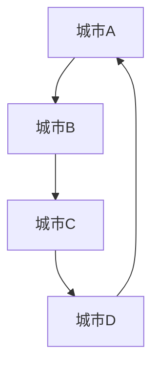
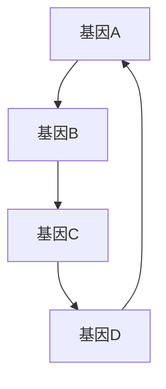

                 

### 文章标题

《宇宙规律与量子近似优化电路设计的相似性》

### 关键词

量子力学、宇宙规律、量子电路、近似优化、算法设计

### 摘要

本文旨在探讨宇宙规律与量子近似优化电路设计之间的相似性。通过分析宇宙起源、演化及量子力学基本原理，揭示宇宙规律与量子电路在结构上的相似之处。文章进一步探讨量子近似优化电路设计的基本原理及其在实际应用中的挑战，并通过具体实例分析其应用效果。本文旨在为读者提供一种全新的视角，理解宇宙规律与量子计算之间的深层次联系，从而推动量子技术在各个领域的创新应用。

## 第一部分：宇宙规律的基础知识

### 第1章：宇宙的起源与演化

#### 1.1 宇宙的起源

宇宙的起源是一个长久以来引人入胜的话题。现代科学认为，宇宙起源于大约138亿年前的一个极小、极高温度和密度的状态，这一理论被称为大爆炸理论。在大爆炸之前，宇宙中的一切几乎都集中在一个点，随着能量的释放，这个点迅速膨胀，形成了我们今天所见的宇宙。

量子力学与宇宙学的联系在于，量子力学提供了描述宇宙起源和演化的基本工具。例如，量子场论是描述量子力学和广义相对论之间关系的理论，它能够解释宇宙在极早期阶段的物理现象。

宇宙膨胀理论是描述宇宙演化的关键概念。根据这一理论，宇宙在自大爆炸以来一直处于膨胀状态，并且这种膨胀速度在逐渐加快。这一现象可以用暗能量来解释，暗能量是一种看不见、抗引力的能量，占据了宇宙总能量的大部分。

#### 1.2 宇宙的演化

宇宙的演化经历了多个阶段，从早期的宇宙到大爆炸之后不久的宇宙，再到现在的宇宙。以下是一些重要阶段：

1. **宇宙微波背景辐射**：在大爆炸之后约38万年前，宇宙的温度和密度已经降低到足够低，使得光子（电磁波的一种）能够自由传播。这一阶段留下了宇宙微波背景辐射，它为我们提供了宇宙早期状态的重要信息。

2. **星系的形成**：在大爆炸之后约10亿年左右，宇宙中的物质开始聚集，形成了星系、恒星和其他天体。这一过程涉及到气体云的塌缩、恒星的形成、超新星的爆发等。

3. **黑洞与暗物质的探索**：黑洞是宇宙中的一种特殊天体，它具有极大的质量和引力，能够吞噬周围的物质。暗物质是宇宙中的一种看不见、不发光的物质，它占据了宇宙总物质的大部分。科学家们通过观测宇宙中的各种现象，推测暗物质的存在。

### 第2章：量子力学原理与现象

#### 2.1 量子力学的基本原理

量子力学是描述微观世界物理现象的理论，它与经典物理学有着本质的区别。以下是量子力学的一些基本原理：

1. **波粒二象性**：量子粒子（如电子、光子）既具有波动性，又具有粒子性。在不同的实验条件下，它们可以表现出不同的性质。

2. **量子态与叠加原理**：量子系统可以处于多个状态的叠加，只有当进行测量时，系统才会坍缩到一个确定的状态。

3. **量子纠缠**：当两个量子系统发生相互作用后，它们之间的状态会相互关联，即使它们相隔很远，一个系统的状态变化也会立即影响到另一个系统的状态。

#### 2.2 量子力学中的测量

量子力学的测量过程与经典物理学的测量过程有显著差异。以下是量子力学中的几个关键测量概念：

1. **波函数塌缩**：在量子力学中，一个系统的状态用波函数来描述。当对系统进行测量时，波函数会突然坍缩到一个特定的状态。

2. **测量不确定原理**：由海森堡提出，它表明我们不能同时精确地测量一个粒子的位置和动量。这是量子力学中一个基本的不确定性。

## 第二部分：量子近似优化电路设计原理

### 第3章：量子电路设计基础

#### 3.1 量子门与量子比特

量子比特（qubit）是量子计算机中的基本单位，它既可以处于0和1的叠加状态，也可以处于其他复数状态的叠加。量子门是作用于量子比特的基本操作，类似于经典计算机中的逻辑门。

量子门可以分为以下几种类型：

1. **Pauli门**：作用于量子比特的X、Y、Z轴，分别表示对量子比特的相位翻转、翻转和相位加法。

2. **Hadamard门**：将量子比特的状态叠加成等概率的0和1。

3. **控制门**：一个控制量子比特和一个目标量子比特相互作用，根据控制量子比特的状态决定目标量子比特的状态。

#### 3.2 量子算法与量子近似优化

量子算法是基于量子力学原理设计的算法，它可以解决某些经典算法无法解决的问题。量子近似优化算法是一种特殊的量子算法，用于解决优化问题。

量子近似优化算法的核心思想是通过量子态的叠加和纠缠，同时探索多个可能的解，从而在搜索空间中找到最优解或近似最优解。

### 第4章：量子电路设计的相似性与差异

#### 4.1 宇宙规律与量子电路的相似性

宇宙规律与量子电路设计在结构上存在一些相似性：

1. **量子叠加与宇宙膨胀**：量子叠加描述了量子系统可以处于多个状态的叠加，而宇宙膨胀描述了宇宙可以从一个高密度、高温度的初始状态膨胀到现在的状态。两者都涉及到了从一种状态到多种状态的转换。

2. **量子纠缠与宇宙中的复杂现象**：量子纠缠描述了两个或多个量子系统之间的强关联，而宇宙中的复杂现象（如星系的形成、黑洞的存在等）也体现了不同物质系统之间的强关联。

#### 4.2 量子电路设计与宇宙规律的差异

尽管宇宙规律与量子电路设计存在相似性，但它们也存在显著的差异：

1. **量子态的稳定性与宇宙的不确定性**：量子态在测量之前是稳定的，但在测量之后会坍缩到一个确定的状态。而宇宙中的物理现象往往具有不确定性，如量子力学中的测量不确定原理和宇宙中的混沌现象。

2. **量子电路与宇宙的演化过程**：量子电路的设计涉及到量子比特的初始化、量子门的操作和测量过程，而宇宙的演化过程是一个复杂的、非线性的过程，涉及到宇宙中各种物质和能量的相互作用。

## 第三部分：量子近似优化电路设计应用

### 第5章：量子近似优化电路在实际应用中的挑战

#### 5.1 量子计算机的现状

量子计算机是一种基于量子力学原理的新型计算机，它具有超越经典计算机的潜力。当前，量子计算机的发展已经取得了一些重要进展，但仍面临许多挑战：

1. **量子比特的稳定性**：量子比特容易受到外部环境的影响，如噪声、干扰等，这会导致量子态的失真。

2. **量子纠错**：由于量子比特的易错性，量子计算机需要有效的纠错机制来保证计算的准确性。

3. **量子算法的设计与优化**：量子算法的设计和优化是一个复杂的过程，需要大量的计算资源和专业知识。

#### 5.2 量子近似优化电路的应用场景

量子近似优化电路在许多领域都有广泛的应用前景，以下是一些典型应用场景：

1. **优化问题**：量子近似优化电路可以用于解决优化问题，如旅行商问题、车辆路径规划、供应链优化等。

2. **物理问题**：量子近似优化电路可以用于模拟和研究物理现象，如量子场论、量子混沌等。

### 第6章：量子近似优化电路设计实例分析

#### 6.1 实例一：旅行商问题（TSP）

旅行商问题（TSP）是一个经典的优化问题，其目标是在一组城市中找到一个最短路径，使得旅行商能够访问每个城市一次并返回起点。以下是一个简化的TSP实例：



在此实例中，城市A、B、C和D构成了一个环，旅行商需要从城市A出发，访问其他城市并返回城市A。

量子近似优化电路可以用于求解TSP。以下是TSP的量子近似优化电路设计：

1. **初始化量子比特**：将n个量子比特初始化为均匀叠加态。
2. **设计量子门**：使用量子门将量子比特的状态转换为与TSP解相关的状态。具体地，可以使用以下量子门：
    - Hadamard门：将量子比特的状态叠加成均匀分布。
    - 控制非门：根据控制量子比特的状态决定目标量子比特的状态。
3. **测量量子比特**：测量量子比特的状态，得到TSP的近似最优解。

以下是TSP的量子近似优化电路设计伪代码：

```python
# 初始化量子比特
Initialize_qubits(n)

# 应用Hadamard门
Apply_Hadamard_gates(n)

# 应用控制非门
Apply_controlled_NOT_gates(n, control_qubits, target_qubits)

# 测量量子比特
Measure_qubits(n)

# 解码测量结果
Decode_measurements(n)
```

#### 6.2 实例二：基因测序排序问题

基因测序排序问题是生物信息学中的一个重要问题，其目标是在给定的基因序列中找到最优排序。以下是一个简化的基因测序排序问题实例：



在此实例中，基因A、B、C和D构成了一个环，我们需要找到最优排序。

量子近似优化电路可以用于求解基因测序排序问题。以下是基因测序排序问题的量子近似优化电路设计：

1. **初始化量子比特**：将n个量子比特初始化为均匀叠加态。
2. **设计量子门**：使用量子门将量子比特的状态转换为与基因测序排序问题解相关的状态。具体地，可以使用以下量子门：
    - Hadamard门：将量子比特的状态叠加成均匀分布。
    - 控制相位门：根据控制量子比特的状态决定目标量子比特的相位。
3. **测量量子比特**：测量量子比特的状态，得到基因测序排序问题的近似最优解。

以下是基因测序排序问题的量子近似优化电路设计伪代码：

```python
# 初始化量子比特
Initialize_qubits(n)

# 应用Hadamard门
Apply_Hadamard_gates(n)

# 应用控制相位门
Apply_controlled_phase_gates(n, control_qubits, target_qubits)

# 测量量子比特
Measure_qubits(n)

# 解码测量结果
Decode_measurements(n)
```

### 第7章：未来展望与趋势

#### 7.1 量子近似优化电路的发展方向

量子近似优化电路在未来的发展中，预计会出现以下趋势：

1. **量子计算机的规模化**：随着量子比特数量的增加，量子计算机的规模将不断扩大，从而提高量子近似优化电路的性能。

2. **量子近似优化算法的创新**：新的量子近似优化算法将被开发，以解决更复杂的优化问题。

3. **量子纠错技术的进步**：量子纠错技术将不断进步，提高量子计算机的可靠性。

#### 7.2 量子近似优化电路与宇宙规律的结合

量子近似优化电路与宇宙规律的结合有望带来以下新的科学发现和技术应用：

1. **新的科学发现**：通过模拟宇宙中的物理现象，量子近似优化电路可以揭示宇宙规律背后的更深层次机制。

2. **新的技术应用**：量子近似优化电路在优化和物理模拟领域的应用将推动新技术的发展，如量子计算、量子模拟、量子通信等。

### 总结

宇宙规律与量子近似优化电路设计之间存在许多相似性，如量子叠加与宇宙膨胀、量子纠缠与宇宙中的复杂现象。同时，量子近似优化电路设计也面临许多挑战，如量子比特的稳定性、量子纠错等。通过分析实例，我们可以看到量子近似优化电路在实际应用中的潜力。未来，量子近似优化电路与宇宙规律的结合有望带来新的科学发现和技术应用。

### 作者信息

作者：AI天才研究院/AI Genius Institute & 禅与计算机程序设计艺术 /Zen And The Art of Computer Programming

