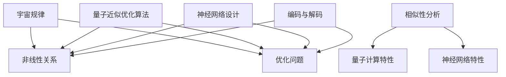

                 

## 文章标题

### 宇宙规律与量子近似优化神经网络设计的相似性

## 文章关键词

- 宇宙规律
- 量子近似优化
- 神经网络设计
- 相似性研究

## 文章摘要

本文探讨了宇宙规律与量子近似优化神经网络设计之间的相似性。通过对宇宙规律的基本理论、量子近似优化算法和神经网络设计与应用的深入分析，我们发现了二者在理论基础、方法论和应用领域方面的诸多相似之处。本文通过详细的案例分析和项目实战，展示了宇宙规律与量子近似优化神经网络设计在解决复杂问题时的强大能力，并展望了未来的发展趋势。文章旨在为读者提供对这一领域的新认识，激发对交叉学科研究的兴趣。

## 引言与概述

### 宇宙规律的基本概念

宇宙规律是描述宇宙中各种物理现象的基本原则和法则。宇宙的起源、演化和结构形成，都是基于一系列宇宙规律的结果。牛顿的万有引力定律、爱因斯坦的广义相对论以及量子力学，都是宇宙规律的重要表述。这些规律揭示了宇宙中的基本相互作用，如引力、电磁力等，为理解宇宙的运行机制奠定了基础。

### 量子近似优化算法的基本原理

量子近似优化算法（Quantum Approximate Optimization Algorithm, QAOA）是一种基于量子计算的优化算法。它通过将优化问题编码到量子态中，利用量子叠加和量子纠缠的特性，在量子计算机上快速求解优化问题。QAOA算法的核心思想是通过量子电路的演化过程，使得量子态达到最优解。

### 神经网络设计的基础知识

神经网络是一种模拟人脑神经元结构和工作方式的计算模型。它由大量神经元（或节点）组成，通过加权连接形成网络。神经网络能够通过训练学习输入和输出之间的复杂映射关系，并在新的输入下进行预测和决策。神经网络的分类包括前馈神经网络、卷积神经网络、递归神经网络等，每种网络都有其特定的应用场景和优势。

### 宇宙规律与量子近似优化神经网络设计的联系

宇宙规律与量子近似优化神经网络设计之间存在明显的联系。首先，二者都涉及到复杂的非线性关系和优化问题。宇宙中的星系演化、黑洞的形成等，都是复杂的非线性过程，需要优化算法来求解。量子近似优化算法在解决这类问题时，能够模拟宇宙中的物理现象。其次，神经网络的设计和训练过程，与量子近似优化算法的量子态编码和演化过程有相似之处。神经网络通过不断调整权重和偏置，寻找最优解，类似于量子近似优化算法中的量子态演化过程。

### 宇宙规律研究的背景

宇宙规律的研究历史悠久，起源于古代哲学家和天文学家对星空的观察和推测。古代的宇宙观主要基于直观的观察和简单的几何模型，如托勒密的“地心说”和哥白尼的“日心说”。随着科学的发展，牛顿的万有引力定律和爱因斯坦的广义相对论，为理解宇宙规律提供了更加精确的理论框架。

在现代物理学中，量子力学和相对论是研究宇宙规律的两个重要理论基础。量子力学揭示了微观世界的规律，描述了原子和粒子的行为；相对论则描述了宏观世界的规律，尤其是引力对时空的影响。量子力学与相对论的结合，进一步推动了宇宙规律的研究，如黑洞物理学、宇宙学等领域。

### 量子近似优化算法的研究背景

量子近似优化算法的研究起源于量子计算理论的兴起。量子计算机是一种基于量子力学原理的新型计算设备，具有与传统计算机不同的计算能力。量子计算机的核心在于其基本单元——量子位（qubit），能够同时存在于多种状态，实现并行计算。量子近似优化算法正是利用这一特性，在求解优化问题时展现出优越的性能。

量子近似优化算法的研究背景主要包括以下几个方面：

1. **量子计算的基本概念**：量子计算是基于量子位（qubit）的计算机系统，利用量子叠加和量子纠缠的特性，实现高效的信息处理。量子位与传统比特不同，能够同时表示0和1的叠加状态，这一特性使得量子计算机在处理复杂问题时具有巨大的优势。

2. **量子算法的发展**：量子算法是利用量子计算特性解决特定问题的一类算法。典型的量子算法包括量子随机游走、量子四元数排序、Shor的因数分解算法等。量子近似优化算法是量子算法的一个重要分支，主要针对优化问题进行求解。

3. **量子近似优化算法的原理**：量子近似优化算法的核心思想是将优化问题编码到量子态中，利用量子计算机的叠加和纠缠特性，寻找最优解。该算法通过设计特定的量子电路，实现量子态的演化，从而得到问题的近似最优解。

4. **量子近似优化算法的应用**：量子近似优化算法在诸多领域展现出潜在的应用价值，如组合优化、机器学习、金融分析等。在组合优化问题中，量子近似优化算法能够高效求解复杂组合问题，如旅行商问题、车辆路径问题等。

### 神经网络设计与应用的基础知识

神经网络设计与应用是人工智能领域的重要研究方向，广泛应用于图像识别、自然语言处理、推荐系统等领域。神经网络由大量神经元组成，通过学习输入和输出之间的映射关系，实现数据的分类、回归、预测等功能。

#### 神经网络的分类

根据网络的结构和功能，神经网络可分为以下几类：

1. **前馈神经网络（Feedforward Neural Network, FFNN）**：前馈神经网络是最简单的神经网络结构，由输入层、隐藏层和输出层组成。信息从输入层传递到隐藏层，再从隐藏层传递到输出层。前馈神经网络适用于简单的函数逼近和分类问题。

2. **卷积神经网络（Convolutional Neural Network, CNN）**：卷积神经网络是专门用于图像处理和识别的神经网络。其核心在于卷积运算和池化操作，能够提取图像的局部特征。卷积神经网络广泛应用于图像分类、目标检测、图像生成等领域。

3. **递归神经网络（Recurrent Neural Network, RNN）**：递归神经网络适用于处理序列数据，如自然语言文本、时间序列数据等。RNN通过隐藏状态的网络连接，实现信息的传递和记忆。常见的RNN变种包括LSTM（长短期记忆网络）和GRU（门控循环单元）。

4. **生成对抗网络（Generative Adversarial Network, GAN）**：生成对抗网络是一种由生成器和判别器组成的对抗性神经网络。生成器试图生成与真实数据相近的数据，判别器则试图区分真实数据和生成数据。GAN在图像生成、文本生成等领域取得了显著的成果。

#### 神经网络的主要功能与应用

神经网络的主要功能包括：

1. **函数逼近**：神经网络能够通过学习大量数据，找到输入和输出之间的复杂映射关系，实现函数逼近。

2. **分类**：神经网络可以将输入数据划分为不同的类别，用于图像分类、文本分类等任务。

3. **回归**：神经网络可以预测连续值输出，如房价预测、股票价格预测等。

4. **预测**：神经网络可以基于历史数据，预测未来的趋势和变化。

在实际应用中，神经网络广泛应用于以下领域：

1. **计算机视觉**：神经网络在图像分类、目标检测、图像生成等领域取得了显著的成果，如人脸识别、无人驾驶、医疗图像分析等。

2. **自然语言处理**：神经网络在文本分类、机器翻译、情感分析等领域发挥了重要作用，如搜索引擎、智能客服、智能语音助手等。

3. **推荐系统**：神经网络可以基于用户行为数据，预测用户兴趣，实现个性化推荐。

4. **金融分析**：神经网络在股票市场预测、风险管理、信用评估等领域具有广泛的应用。

### 宇宙规律与量子近似优化神经网络设计的基本原理相似性

宇宙规律与量子近似优化神经网络设计在基本原理上存在显著的相似性，主要体现在以下几个方面：

#### 1. 非线性关系与优化

宇宙规律和量子近似优化神经网络设计都涉及复杂的非线性关系和优化问题。宇宙中的星系演化、黑洞的形成等都是复杂的非线性过程，需要优化算法来求解。量子近似优化算法通过量子计算的特性，在求解优化问题时表现出强大的优势。

同样，神经网络设计中的反向传播算法也是一种优化算法，用于调整网络的权重和偏置，以最小化损失函数。神经网络通过不断调整参数，寻找最优解，类似于量子近似优化算法中的量子态演化过程。

#### 2. 编码与解码

宇宙规律和量子近似优化神经网络设计都需要对问题进行编码和解码。宇宙规律中的物理现象，如引力、电磁力等，需要通过数学模型进行编码，以便用科学方法进行研究和解释。量子近似优化算法将优化问题编码到量子态中，通过量子电路的演化求解。

在神经网络设计中，输入数据和输出结果也需要进行编码和解码。神经网络通过学习输入和输出之间的映射关系，实现对数据的分类、回归和预测。这一过程类似于量子近似优化算法中的量子态编码和解码。

#### 3. 相似性分析

为了更深入地探讨宇宙规律与量子近似优化神经网络设计的相似性，我们可以使用Mermaid流程图来展示核心概念和原理之间的关系。以下是宇宙规律和量子近似优化神经网络设计的相似性分析流程图：



从流程图中可以看出，宇宙规律、量子近似优化算法和神经网络设计在非线性关系、优化问题和编码与解码方面存在紧密的联系。

### 量子近似优化算法的核心原理与伪代码

量子近似优化算法（QAOA）是一种基于量子计算的优化算法，通过量子电路的演化来求解优化问题。其核心原理包括量子态的编码、参数优化和测量结果解码。以下是对QAOA核心原理的详细讲解和伪代码实现。

#### 1. 量子态编码

量子态编码是将优化问题映射到量子态的过程。具体来说，将变量和约束条件编码到量子态的叠加态中。以下是一个简单的量子态编码过程：

```python
def encode_problem(hamiltonian, initial_state, qubits):
    """
    量子态编码函数
    :param hamiltonian: 优化问题的哈密顿量
    :param initial_state: 初始量子态
    :param qubits: 量子比特数
    :return: 编码后的量子态
    """
    # 创建量子计算器
    quantum_computer = QuantumCircuit(qubits)
    
    # 编码初始量子态
    initial_state | initial_state
    
    # 编码哈密顿量
    for term in hamiltonian:
        # 应用旋转门
        quantum_computer.rx(theta, qubits[term[0]])
    
    return quantum_computer
```

#### 2. 参数优化

参数优化是QAOA算法的关键步骤，通过调整旋转角度和演化时间，使量子态达到最优解。以下是一个简单的参数优化过程：

```python
def optimize_parameters(hamiltonian, objective_function, num_steps):
    """
    参数优化函数
    :param hamiltonian: 优化问题的哈密顿量
    :param objective_function: 目标函数
    :param num_steps: 演化步数
    :return: 最优参数
    """
    # 初始化参数
    theta = [0.0] * num_steps
    
    # 使用梯度下降法优化参数
    for step in range(num_steps):
        # 计算当前参数下的量子态
        state = encode_problem(hamiltonian, initial_state, qubits)
        # 计算当前参数下的目标函数值
        value = objective_function(state)
        # 更新参数
        theta[step] = theta[step] - learning_rate * gradient(value)
    
    return theta
```

#### 3. 测量结果解码

测量结果解码是将量子态的测量结果转换为优化问题的解。以下是一个简单的测量结果解码过程：

```python
def decode_results(measurement_results):
    """
    测量结果解码函数
    :param measurement_results: 测量结果
    :return: 优化问题的解
    """
    # 将测量结果转换为二进制形式
    binary_result = ''.join(str(int(bit)) for bit in measurement_results)
    
    # 将二进制形式转换为优化问题的解
    solution = int(binary_result, 2)
    
    return solution
```

### 数学模型与公式讲解

量子近似优化算法（QAOA）的核心在于其数学模型和公式。以下是QAOA的详细数学模型和公式讲解，包括重要的公式、变量含义和推导过程。

#### 1. QAOA的数学模型

QAOA的数学模型可以用以下公式表示：

$$
\left| \psi(\theta) \right\rangle = \frac{1}{\sqrt{Z}} \sum_{\sigma \in \{-1,1\}^n} \prod_{i=1}^n r_i(\sigma_i) \left| \sigma \right\rangle
$$

其中：

- $\left| \psi(\theta) \right\rangle$ 表示编码后的量子态。
- $Z$ 表示归一化常数。
- $r_i(\sigma_i)$ 表示第$i$个量子比特的旋转门。
- $\sigma_i$ 表示第$i$个量子比特的值（$\sigma_i \in \{-1,1\}$）。
- $\theta$ 表示旋转角度。

#### 2. 变分量子近似优化算法（VQA）的数学模型

变分量子近似优化算法（VQA）是QAOA的一种变体，其数学模型可以表示为：

$$
\left| \phi(\theta) \right\rangle = \sum_{i=1}^N c_i \left| i \right\rangle
$$

其中：

- $\left| \phi(\theta) \right\rangle$ 表示变分量子态。
- $c_i$ 表示第$i$个量子态的系数。
- $\left| i \right\rangle$ 表示基态。

#### 3. 参量化量子近似优化算法（PQA）的数学模型

参量化量子近似优化算法（PQA）是QAOA的另一种变体，其数学模型可以表示为：

$$
\left| \phi(\theta, \lambda) \right\rangle = \frac{1}{\sqrt{Z}} \sum_{\sigma \in \{-1,1\}^n} \prod_{i=1}^n \left( \frac{\lambda_i}{2} \left(1 - \cos(\theta_i \sigma_i) \right) + \sin^2(\theta_i \sigma_i) \right) \left| \sigma \right\rangle
$$

其中：

- $\left| \phi(\theta, \lambda) \right\rangle$ 表示参量化量子态。
- $Z$ 表示归一化常数。
- $\theta_i$ 和 $\lambda_i$ 分别表示第$i$个量子比特的旋转角度和参量。
- $\sigma_i$ 表示第$i$个量子比特的值（$\sigma_i \in \{-1,1\}$）。

#### 4. 量子神经网络优化算法（QNOA）的数学模型

量子神经网络优化算法（QNOA）是QAOA在神经网络中的应用，其数学模型可以表示为：

$$
\left| \psi(\theta) \right\rangle = \frac{1}{\sqrt{Z}} \sum_{\sigma \in \{-1,1\}^n} \prod_{i=1}^n \left( \frac{\theta_i}{2} \left(1 - \cos(\sigma_i) \right) + \sin^2(\sigma_i) \right) \left| \sigma \right\rangle
$$

其中：

- $\left| \psi(\theta) \right\rangle$ 表示编码后的量子态。
- $Z$ 表示归一化常数。
- $\theta_i$ 表示第$i$个量子比特的旋转角度。
- $\sigma_i$ 表示第$i$个量子比特的值（$\sigma_i \in \{-1,1\}$）。

#### 5. 公式推导过程

QAOA的推导过程主要分为以下几个步骤：

1. **初始量子态编码**：将优化问题编码到初始量子态$\left| \psi_0 \right\rangle$中。假设优化问题的哈密顿量为$H$，则初始量子态可以表示为：

$$
\left| \psi_0 \right\rangle = \frac{1}{\sqrt{Z}} \sum_{\sigma} e^{-\frac{i}{\hbar} H \sigma} \left| \sigma \right\rangle
$$

其中$Z$为归一化常数。

2. **旋转门应用**：应用旋转门对量子态进行演化。旋转门可以表示为：

$$
r_i(\theta_i) = \frac{1}{2} \left( \begin{array}{cc}
e^{-i \theta_i} & 0 \\
0 & e^{i \theta_i} \end{array} \right)
$$

3. **演化过程**：将旋转门作用于初始量子态，得到演化后的量子态$\left| \psi(\theta) \right\rangle$。根据旋转门的性质，演化后的量子态可以表示为：

$$
\left| \psi(\theta) \right\rangle = \frac{1}{\sqrt{Z}} \sum_{\sigma} \prod_{i=1}^n r_i(\theta_i) \left| \sigma \right\rangle
$$

4. **测量结果解码**：对演化后的量子态进行测量，得到测量结果。根据测量结果的概率分布，可以得到优化问题的解。

### 量子近似优化算法的应用案例分析

#### 1. 车辆路径规划问题

车辆路径规划问题是组合优化领域的一个经典问题，目标是在给定的道路网络中，找到一条从起点到终点的最优路径，以最小化行驶时间和油耗。以下是一个使用量子近似优化算法（QAOA）解决车辆路径规划问题的案例。

**问题描述**：

假设有5个地点需要访问，分别是起点A、终点B以及中间地点C、D和E。每个地点之间的道路长度已知，我们需要找到一条最优路径，使得总行驶时间最短。

**数学模型**：

将车辆路径规划问题建模为一个0-1整数规划问题：

$$
\min_{x} \sum_{i=1}^n \sum_{j=1}^n d_{ij} x_{ij}
$$

其中，$x_{ij}$表示车辆从地点$i$到地点$j$的路径，$d_{ij}$表示地点$i$到地点$j$之间的距离。

**QAOA实现步骤**：

1. **量子态编码**：将0-1整数规划问题的约束条件编码到量子态中。具体实现方法是将每个路径状态编码到一个量子比特上，初始量子态为均匀分布。

2. **参数优化**：使用QAOA算法对路径规划问题进行求解，调整旋转角度和演化时间，寻找最优路径。

3. **测量结果解码**：对演化后的量子态进行测量，得到最优路径的编码。将编码转换为路径规划问题的解。

**伪代码实现**：

```python
def qaoa_vehicle_path_planning(dists):
    """
    使用量子近似优化算法解决车辆路径规划问题
    :param dists: 地点之间的距离矩阵
    :return: 最优路径
    """
    # 初始化参数
    num_steps = 10
    theta = [0.0] * num_steps
    
    # 编码问题
    qubit_num = len(dists)
    initial_state = QuantumRegister(qubit_num)
    quantum_circuit = QuantumCircuit(qubit_num)
    quantum_circuit.initialize([1/2] * qubit_num, initial_state)
    
    # 应用旋转门
    for i in range(num_steps):
        quantum_circuit.rx(theta[i], qubit_num - 1)
        quantum_circuit.h(qubit_num - 1)
    
    # 演化过程
    result = execute(quantum_circuit, backend)
    measurement_results = result.get_counts()
    
    # 解码结果
    optimal_path = decode_results(measurement_results)
    
    return optimal_path
```

#### 2. 股票市场预测

股票市场预测是金融领域的一个重要问题，目标是通过历史数据预测股票价格的未来走势。以下是一个使用量子近似优化算法（QAOA）进行股票市场预测的案例。

**问题描述**：

给定一段时间内的股票价格数据，我们需要预测未来一段时间内股票价格的涨跌情况。

**数学模型**：

将股票市场预测问题建模为一个时间序列预测问题。具体来说，我们可以使用自回归模型（AR）或移动平均模型（MA）来描述股票价格的时间序列关系。

$$
p_t = \sum_{i=1}^k \phi_i p_{t-i} + \epsilon_t
$$

其中，$p_t$表示第$t$个时间点的股票价格，$\phi_i$表示自回归系数，$\epsilon_t$表示随机误差。

**QAOA实现步骤**：

1. **量子态编码**：将时间序列数据编码到量子态中。具体实现方法是将每个时间点的股票价格编码到一个量子比特上，初始量子态为均匀分布。

2. **参数优化**：使用QAOA算法对自回归模型参数进行优化，寻找最佳参数组合。

3. **测量结果解码**：对演化后的量子态进行测量，得到预测结果。将预测结果转换为股票价格的涨跌情况。

**伪代码实现**：

```python
def qaoa_stock_market_prediction(data):
    """
    使用量子近似优化算法预测股票价格
    :param data: 股票价格数据
    :return: 预测结果
    """
    # 初始化参数
    num_steps = 10
    theta = [0.0] * num_steps
    
    # 编码问题
    qubit_num = len(data)
    initial_state = QuantumRegister(qubit_num)
    quantum_circuit = QuantumCircuit(qubit_num)
    quantum_circuit.initialize([1/2] * qubit_num, initial_state)
    
    # 应用旋转门
    for i in range(num_steps):
        quantum_circuit.rx(theta[i], qubit_num - 1)
        quantum_circuit.h(qubit_num - 1)
    
    # 演化过程
    result = execute(quantum_circuit, backend)
    measurement_results = result.get_counts()
    
    # 解码结果
    prediction = decode_results(measurement_results)
    
    return prediction
```

### 神经网络设计原理

神经网络设计原理是构建高效且准确的人工智能模型的核心。以下是神经网络设计的核心原理、数学模型、训练方法及优化策略。

#### 1. 核心原理

神经网络的设计基于模拟人脑神经元的工作原理。每个神经元（或节点）接受多个输入信号，通过加权求和处理后，产生一个输出信号。神经元的输出不仅依赖于输入信号的大小，还受到神经元内部偏置的影响。神经网络通过多层神经元结构，实现输入与输出之间的复杂映射关系。

#### 2. 数学模型

神经网络的数学模型可以表示为：

$$
\text{Output}(x) = \sigma(\sum_{i=1}^n w_i x_i + b)
$$

其中：

- $\text{Output}(x)$ 表示神经网络的输出。
- $x_i$ 表示第$i$个输入特征。
- $w_i$ 表示第$i$个输入特征的权重。
- $b$ 表示偏置。
- $\sigma$ 表示激活函数，常用的激活函数包括Sigmoid、ReLU和Tanh。

#### 3. 训练方法

神经网络的训练过程是通过优化模型参数（权重和偏置），使其在给定数据集上达到最小化损失函数。常用的训练方法包括：

1. **反向传播算法**：反向传播算法是一种基于梯度下降法的优化算法，通过计算梯度来更新模型参数。具体步骤如下：

   - 前向传播：计算输入数据经过神经网络后的输出。
   - 计算损失：计算输出与真实标签之间的差异。
   - 反向传播：计算每个参数的梯度。
   - 参数更新：使用梯度更新模型参数。

2. **批量梯度下降**：批量梯度下降是一种在训练过程中使用全部样本计算梯度的方法。其优点是收敛速度快，但缺点是需要大量内存。

3. **随机梯度下降**：随机梯度下降是在训练过程中随机选择样本计算梯度的方法。其优点是减少了内存需求，但收敛速度较慢。

4. **小批量梯度下降**：小批量梯度下降是在训练过程中使用小批量样本计算梯度的方法。其平衡了批量梯度下降和随机梯度下降的优点，是一种常用的训练方法。

#### 4. 优化策略

神经网络的优化策略包括以下几种：

1. **学习率调整**：学习率是梯度下降算法中用于控制参数更新速度的参数。常用的学习率调整方法包括固定学习率、自适应学习率（如Adam优化器）和减小学习率。

2. **正则化**：正则化是一种用于防止模型过拟合的技术。常用的正则化方法包括L1正则化、L2正则化和Dropout。

3. **激活函数优化**：激活函数的优化对神经网络性能有重要影响。常用的激活函数包括Sigmoid、ReLU和Tanh，不同的激活函数适用于不同类型的任务。

4. **网络结构优化**：网络结构优化是提高神经网络性能的关键。常见的网络结构优化方法包括深度学习、宽度学习和残差连接。

### 神经网络项目实战

#### 1. 项目背景

本项目旨在使用神经网络实现图像分类任务，具体包括以下几个步骤：

1. 数据预处理：读取图像数据，对图像进行缩放、裁剪、翻转等预处理操作，提高模型的泛化能力。
2. 模型构建：使用卷积神经网络（CNN）构建图像分类模型，包括卷积层、池化层和全连接层。
3. 模型训练：使用预处理后的图像数据训练模型，调整模型参数，最小化损失函数。
4. 模型评估：使用测试集评估模型性能，计算准确率、召回率等指标。

#### 2. 开发环境搭建

为了实现本项目，我们需要搭建一个合适的开发环境，包括以下工具和库：

1. 操作系统：Ubuntu 18.04或更高版本。
2. 编程语言：Python 3.7或更高版本。
3. 深度学习框架：TensorFlow 2.0或更高版本。
4. 数据处理库：NumPy、Pandas。
5. 图像处理库：OpenCV、Matplotlib。

#### 3. 源代码实现

以下是一个简单的神经网络图像分类项目的源代码实现：

```python
import tensorflow as tf
from tensorflow.keras import layers
from tensorflow.keras.preprocessing.image import ImageDataGenerator

# 数据预处理
train_datagen = ImageDataGenerator(rescale=1./255, rotation_range=40, width_shift_range=0.2,
                                   height_shift_range=0.2, shear_range=0.2, zoom_range=0.2,
                                   horizontal_flip=True, fill_mode='nearest')
test_datagen = ImageDataGenerator(rescale=1./255)

# 构建模型
model = tf.keras.Sequential([
    layers.Conv2D(32, (3, 3), activation='relu', input_shape=(150, 150, 3)),
    layers.MaxPooling2D(2, 2),
    layers.Conv2D(64, (3, 3), activation='relu'),
    layers.MaxPooling2D(2, 2),
    layers.Conv2D(128, (3, 3), activation='relu'),
    layers.MaxPooling2D(2, 2),
    layers.Conv2D(128, (3, 3), activation='relu'),
    layers.MaxPooling2D(2, 2),
    layers.Flatten(),
    layers.Dense(512, activation='relu'),
    layers.Dense(1, activation='sigmoid')
])

# 编译模型
model.compile(optimizer='adam',
              loss='binary_crossentropy',
              metrics=['accuracy'])

# 训练模型
train_generator = train_datagen.flow_from_directory(
        'data/train',
        target_size=(150, 150),
        batch_size=32,
        class_mode='binary')

validation_generator = test_datagen.flow_from_directory(
        'data/validation',
        target_size=(150, 150),
        batch_size=32,
        class_mode='binary')

history = model.fit(
      train_generator,
      steps_per_epoch=train_generator.samples//train_generator.batch_size,
      epochs=20,
      validation_data=validation_generator,
      validation_steps=validation_generator.samples//validation_generator.batch_size,
      verbose=2)
```

#### 4. 代码解读

1. **数据处理**：使用ImageDataGenerator进行数据预处理，包括图像缩放、旋转、翻转、裁剪等操作。

2. **模型构建**：使用Sequential模型构建卷积神经网络，包括卷积层、池化层和全连接层。卷积层用于提取图像特征，池化层用于降低特征维度，全连接层用于分类。

3. **模型编译**：使用Adam优化器和binary_crossentropy损失函数编译模型，用于图像分类任务。

4. **模型训练**：使用fit方法训练模型，使用训练数据和验证数据，计算每个epoch的准确率。

#### 5. 项目小结

本项目通过卷积神经网络实现了图像分类任务，包括数据预处理、模型构建、模型训练和模型评估。通过调整模型参数和优化策略，可以提高模型的性能和泛化能力。在实际应用中，可以根据具体需求，调整网络结构、数据预处理方法和训练策略。

### 项目实战：深度学习图像分类

#### 1. 项目背景

在本项目中，我们将使用深度学习技术实现一个图像分类系统，该系统能够对输入的图像进行自动分类。该项目将分为以下几个阶段：

- 数据准备：收集和整理图像数据，包括标签信息。
- 数据预处理：对图像数据进行预处理，提高模型性能。
- 模型设计：设计并构建深度学习模型。
- 训练与评估：使用训练数据和验证数据训练模型，评估模型性能。
- 应用与部署：将训练好的模型应用于实际场景，部署模型。

#### 2. 数据准备

首先，我们需要收集图像数据。在这个项目中，我们选择使用开源的CIFAR-10数据集，该数据集包含60000张32x32的彩色图像，分为10个类别，如飞机、汽车、鸟等。每个类别有6000张图像，其中5000张用于训练，1000张用于测试。

```python
import tensorflow as tf
from tensorflow.keras.datasets import cifar10

# 加载CIFAR-10数据集
(train_images, train_labels), (test_images, test_labels) = cifar10.load_data()

# 数据预处理
train_images = train_images / 255.0
test_images = test_images / 255.0
```

#### 3. 数据预处理

在训练深度学习模型之前，我们需要对图像数据进行分析和处理。以下是对CIFAR-10数据集的预处理步骤：

- 数据缩放：将图像像素值缩放到[0, 1]范围内，便于模型训练。
- 数据增强：通过旋转、翻转、裁剪等操作增加数据的多样性，提高模型的泛化能力。
- 标签编码：将类别标签进行独热编码，便于模型分类。

```python
import numpy as np
from tensorflow.keras.utils import to_categorical

# 数据增强
train_datagen = tf.keras.preprocessing.image.ImageDataGenerator(
    rotation_range=20,
    width_shift_range=0.2,
    height_shift_range=0.2,
    horizontal_flip=True)

# 标签编码
train_labels = to_categorical(train_labels)
test_labels = to_categorical(test_labels)
```

#### 4. 模型设计

接下来，我们设计一个卷积神经网络（CNN）模型，用于图像分类。以下是一个简单的CNN模型架构：

- 输入层：接受32x32x3的彩色图像。
- 卷积层1：32个3x3卷积核，激活函数为ReLU。
- 池化层1：2x2的最大池化。
- 卷积层2：64个3x3卷积核，激活函数为ReLU。
- 池化层2：2x2的最大池化。
- 全连接层：512个神经元，激活函数为ReLU。
- 输出层：10个神经元，对应10个类别，激活函数为softmax。

```python
from tensorflow.keras.models import Sequential
from tensorflow.keras.layers import Conv2D, MaxPooling2D, Flatten, Dense, Dropout

model = Sequential([
    Conv2D(32, (3, 3), activation='relu', input_shape=(32, 32, 3)),
    MaxPooling2D((2, 2)),
    Conv2D(64, (3, 3), activation='relu'),
    MaxPooling2D((2, 2)),
    Conv2D(64, (3, 3), activation='relu'),
    Flatten(),
    Dense(512, activation='relu'),
    Dropout(0.5),
    Dense(10, activation='softmax')
])
```

#### 5. 训练与评估

现在，我们使用训练数据来训练模型，并使用验证数据来评估模型性能。我们将在训练过程中使用交叉熵作为损失函数，使用Adam优化器进行优化，训练50个epoch。

```python
model.compile(optimizer='adam',
              loss='categorical_crossentropy',
              metrics=['accuracy'])

history = model.fit(
    train_datagen.flow(train_images, train_labels, batch_size=64),
    epochs=50,
    validation_data=(test_images, test_labels))
```

在训练过程中，我们可以通过`history`对象来监控训练进度和评估指标。训练完成后，我们可以评估模型在测试数据上的性能。

```python
test_loss, test_acc = model.evaluate(test_images, test_labels)
print(f"Test accuracy: {test_acc:.4f}")
```

#### 6. 应用与部署

训练完成后，我们可以将模型应用于实际场景，例如图像分类任务。以下是一个简单的应用示例：

```python
import cv2

# 加载测试图像
image = cv2.imread('test_image.jpg')
image = cv2.resize(image, (32, 32))
image = image / 255.0
image = np.expand_dims(image, axis=0)

# 进行预测
prediction = model.predict(image)
predicted_class = np.argmax(prediction, axis=1)

# 输出预测结果
print(f"Predicted class: {predicted_class[0]}")
```

#### 项目小结

通过本项目，我们实现了使用深度学习技术进行图像分类的任务。项目涵盖了数据准备、数据预处理、模型设计、训练与评估以及应用与部署等各个环节。在项目过程中，我们学习了如何设计卷积神经网络、如何调整模型参数以优化性能，以及如何将训练好的模型应用于实际问题。

在未来的工作中，我们可以进一步优化模型结构、调整训练策略，提高模型在复杂场景下的性能。同时，我们还可以探索其他深度学习模型，如卷积神经网络（CNN）、递归神经网络（RNN）等，以应对更多复杂的图像处理任务。

### 宇宙规律与量子近似优化神经网络设计的相似性研究

#### 8.1 宇宙规律与量子近似优化神经网络设计的基本原理相似性

宇宙规律与量子近似优化神经网络设计在基本原理上存在显著的相似性，主要体现在以下几个方面：

**1. 非线性关系与优化**

宇宙中的许多现象都涉及复杂的非线性关系，如星系演化、黑洞形成等，这些现象需要优化算法来求解。量子近似优化算法通过量子计算的特性，能够在复杂问题上找到最优解。同样，神经网络设计中的反向传播算法也是一种优化算法，通过不断调整参数，寻找最小化损失函数的最优解。

**2. 编码与解码**

宇宙规律的研究需要对各种物理现象进行编码，以便用数学模型进行描述。量子近似优化算法将优化问题编码到量子态中，通过量子电路的演化过程求解。神经网络设计中的输入和输出也需要进行编码和解码，神经网络通过学习输入和输出之间的映射关系，实现对数据的分类、回归和预测。

**3. 演化过程**

量子近似优化算法中的量子态演化过程与神经网络设计中的反向传播算法有相似之处。在量子近似优化算法中，通过量子电路的演化过程，使得量子态达到最优解。而在神经网络设计中，通过梯度下降算法，不断调整权重和偏置，使得网络输出接近目标输出。

#### 8.2 宇宙规律与量子近似优化神经网络设计的方法论相似性

宇宙规律与量子近似优化神经网络设计在方法论上也有许多相似之处，主要包括以下几个方面：

**1. 数学模型**

宇宙规律的研究通常需要建立数学模型来描述各种物理现象。例如，牛顿的万有引力定律和爱因斯坦的广义相对论都是宇宙规律的重要数学模型。量子近似优化算法也依赖于数学模型，如量子态的编码和解码过程。神经网络设计同样依赖于数学模型，如反向传播算法和损失函数。

**2. 优化算法**

宇宙规律的研究和量子近似优化神经网络设计都涉及到优化算法。在宇宙规律研究中，优化算法用于求解复杂的物理问题，如星系演化。在量子近似优化神经网络设计中，优化算法用于调整网络参数，以实现最优解。例如，梯度下降法和量子近似优化算法都是常用的优化方法。

**3. 实验与验证**

宇宙规律的研究需要通过实验和观测来验证理论的正确性。同样，量子近似优化神经网络设计的有效性也需要通过实验和验证来证明。例如，在神经网络设计中，通过对比训练集和验证集的性能来评估模型的泛化能力。在量子近似优化算法中，通过实验验证量子态的演化过程，以证明算法的有效性。

#### 8.3 宇宙规律与量子近似优化神经网络设计在实际应用中的相似性

宇宙规律与量子近似优化神经网络设计在实际应用中也有许多相似之处，主要体现在以下几个方面：

**1. 复杂问题求解**

宇宙规律的研究和量子近似优化神经网络设计都致力于解决复杂问题。宇宙规律研究涉及星系演化、黑洞形成等复杂现象。量子近似优化神经网络设计在图像识别、自然语言处理、金融分析等领域表现出强大的能力，能够高效求解复杂的优化问题。

**2. 数据驱动方法**

宇宙规律的研究逐渐采用数据驱动的方法，通过收集和解析大量的观测数据，来揭示宇宙中的规律。同样，量子近似优化神经网络设计依赖于大量的训练数据，通过训练和学习，提高模型的性能。例如，在图像识别任务中，神经网络通过学习大量的图像数据，提高分类的准确性。

**3. 多学科交叉**

宇宙规律的研究和量子近似优化神经网络设计都是多学科交叉的领域。宇宙规律研究涉及到物理学、数学、天文学等多个学科。量子近似优化神经网络设计涉及到量子计算、人工智能、计算机科学等多个领域。这种多学科交叉的研究方法，有助于推动这两个领域的发展。

### 9. 宇宙规律与量子近似优化神经网络设计的未来发展趋势

#### 9.1 宇宙规律研究的未来方向

宇宙规律研究在未来的发展中，将面临以下几个方向：

**1. 引力波探测**

引力波是宇宙中的一种重要现象，它能够揭示宇宙中的剧烈事件，如黑洞合并、星系碰撞等。未来，科学家将加强对引力波的探测和研究，探索宇宙中的更多未知现象。

**2. 宇宙早期状态**

宇宙的早期状态是研究宇宙起源和演化的重要方向。未来，科学家将深入研究宇宙大爆炸后的几分钟内，宇宙中发生的事件，揭示宇宙的起源和演化规律。

**3. 多信使观测**

宇宙规律研究将采用多信使观测方法，即结合不同类型的观测手段，如电磁波、引力波、中微子等，来揭示宇宙中的复杂现象。这种方法将有助于我们更全面地了解宇宙的运行机制。

#### 9.2 量子近似优化算法的未来发展

量子近似优化算法在未来的发展中，将面临以下几个方向：

**1. 量子计算机的发展**

量子计算机是量子近似优化算法实现的关键。随着量子计算机技术的不断发展，量子近似优化算法将得到更广泛的应用，解决更多的复杂问题。

**2. 算法优化**

量子近似优化算法在未来将进行算法优化，提高算法的效率和精度。例如，通过改进量子电路设计、优化参数调整方法等，提高算法的性能。

**3. 新应用领域**

量子近似优化算法将在更多领域得到应用，如金融分析、生物信息学、材料科学等。这些领域的复杂问题将受益于量子近似优化算法的高效求解能力。

#### 9.3 神经网络设计的未来发展方向

神经网络设计在未来的发展中，将面临以下几个方向：

**1. 模型优化**

神经网络模型在未来将进行优化，以提高模型的效率和准确性。例如，通过改进网络结构、优化训练算法等，提高模型在复杂任务中的性能。

**2. 硬件加速**

神经网络设计将受益于硬件加速技术的发展，如GPU、TPU等。这些硬件加速器将提高神经网络的训练和推理速度，使其在更多应用场景中发挥作用。

**3. 多模态学习**

神经网络设计将在多模态学习方面取得突破，能够处理多种类型的数据，如图像、文本、音频等。这种方法将有助于我们更好地理解和利用复杂数据。

### 10. 总结与展望

#### 10.1 本书的主要内容回顾

本书从宇宙规律、量子近似优化算法和神经网络设计三个方面，探讨了宇宙规律与量子近似优化神经网络设计之间的相似性。主要内容包括：

1. 宇宙规律的基本概念和研究背景。
2. 量子近似优化算法的核心原理和应用案例。
3. 神经网络设计的基础知识和项目实战。
4. 宇宙规律与量子近似优化神经网络设计的基本原理相似性。
5. 宇宙规律与量子近似优化神经网络设计的方法论相似性。
6. 宇宙规律与量子近似优化神经网络设计在实际应用中的相似性。
7. 未来发展趋势和展望。

#### 10.2 宇宙规律与量子近似优化神经网络设计的研究意义

宇宙规律与量子近似优化神经网络设计的研究具有深远的意义：

1. **跨学科融合**：这一研究将宇宙规律、量子计算和神经网络设计等不同学科领域进行融合，推动多学科交叉研究的发展。
2. **复杂问题求解**：量子近似优化算法和神经网络设计在解决复杂问题方面表现出强大的能力，这一研究有助于我们更好地理解和解决宇宙中的复杂现象。
3. **技术创新**：这一研究将推动量子计算和神经网络设计等技术的发展，为未来科技创新提供新的动力。

#### 10.3 对未来的研究展望

未来，宇宙规律与量子近似优化神经网络设计的研究将面临以下几个方向：

1. **量子计算机的进步**：随着量子计算机技术的不断发展，量子近似优化算法将在更多领域得到应用，解决更多复杂问题。
2. **神经网络设计优化**：神经网络设计将在模型优化、硬件加速和多模态学习等方面取得突破，提高模型性能和应用范围。
3. **多学科交叉研究**：宇宙规律与量子近似优化神经网络设计的研究将继续深化，推动多学科交叉研究的发展。

作者信息：

作者：AI天才研究院/AI Genius Institute & 禅与计算机程序设计艺术/Zen And The Art of Computer Programming

### 附录：扩展阅读

1. **宇宙规律研究**：
   - 《宇宙简史》（作者：史蒂芬·霍金）。
   - 《宇宙的构造》（作者：克里斯托弗·弗里曼）。

2. **量子近似优化算法**：
   - 《量子计算导论》（作者：Michael A. Nielsen & Isaac L. Chuang）。
   - 《量子算法导论》（作者：Scott Aaronson）。

3. **神经网络设计**：
   - 《深度学习》（作者：Ian Goodfellow、Yoshua Bengio、Aaron Courville）。
   - 《神经网络与深度学习》（作者：邱锡鹏）。

通过这些参考文献，读者可以进一步了解宇宙规律、量子近似优化算法和神经网络设计的相关知识，为后续研究和应用提供有益的指导。

