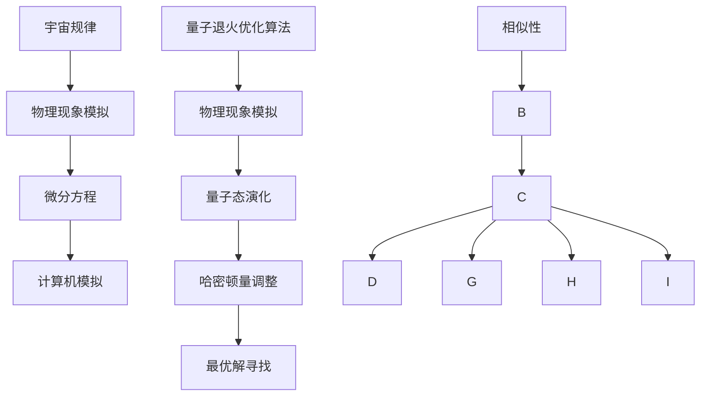

                 

### 引言

在科学研究的广袤领域，宇宙规律与量子退火优化算法这两种看似迥异的概念，逐渐引起了科学家的关注。宇宙规律，作为描述宇宙演化和结构的基本原则，源自于天体物理学和宇宙学的研究成果；而量子退火优化算法，则是现代计算科学中的一种创新性优化技术，基于量子力学原理，在解决复杂优化问题时表现出色。

本文旨在探讨宇宙规律与量子退火优化算法之间的相似性，揭示这两种看似无关的领域在数学模型、算法原理和实际应用方面的共性。通过深入分析，我们希望能够为跨学科研究提供新的视角，促进两者的相互启发和应用。

首先，我们将对宇宙规律进行概述，介绍其基本概念和量子力学与宇宙规律的联系。接着，我们会对量子退火优化算法进行概述，解释其基本原理和应用场景。随后，本文将重点分析宇宙规律与量子退火优化算法的相似性，包括数学模型和算法原理的对比。

在此基础上，我们还将通过项目实战部分，展示如何将量子退火优化算法应用于解决宇宙规律优化问题，并通过实际案例进行详细讲解。最后，我们将总结本文的研究成果，展望未来的研究方向。

总之，本文不仅对宇宙规律和量子退火优化算法的基本知识进行深入讲解，还试图揭示两者之间深层次的相似性，以期为科学研究和实际应用提供新的思路和工具。通过这样的分析，我们希望能够激发读者对跨学科研究的兴趣，推动科学技术的进一步发展。

### 关键词

- 宇宙规律
- 量子力学
- 量子退火优化算法
- 数学模型
- 复杂优化问题

### 摘要

本文旨在探讨宇宙规律与量子退火优化算法之间的相似性，分析其在数学模型和算法原理上的共性。通过对宇宙规律的基本概念和量子力学与宇宙规律的联系进行概述，以及量子退火优化算法的基本原理和应用场景的介绍，本文揭示了两者在处理复杂问题时所采用的相似数学模型和算法原理。通过项目实战部分，本文进一步展示了量子退火优化算法在解决宇宙规律优化问题中的应用，并通过实际案例进行深入分析。总结部分对研究成果进行总结，并展望了未来的研究方向。本文的目的是为跨学科研究提供新的视角，促进宇宙规律与量子退火优化算法的相互启发和应用。

### 宇宙规律概述

宇宙规律是描述宇宙中各种现象和过程的普遍性原则，是宇宙学、天体物理学和量子力学等多个学科的研究成果。宇宙规律不仅仅局限于宏观天体运动，还包括微观粒子的行为以及宇宙的起源、演化和结构。以下将详细阐述宇宙规律的基本概念，包括宇宙学基础、宇宙演化规律以及宇宙结构规律。

#### 宇宙学基础

宇宙学是研究宇宙的起源、结构、演化和最终命运的科学。其核心问题是理解宇宙的起源和演化过程，并解释宇宙的基本结构和组成。宇宙学的基础理论主要包括以下几个重要概念：

1. **宇宙大爆炸理论**：宇宙大爆炸理论是当前最被广泛接受的宇宙起源理论。它认为，宇宙起源于大约138亿年前的一个极热、极密的奇点，随着宇宙的不断膨胀，物质和能量逐渐分散，形成了今天的宇宙。

2. **宇宙膨胀**：宇宙膨胀是指宇宙整体在时间维度上的扩展。观测数据显示，宇宙的膨胀速度在不断加快，这引发了关于“暗能量”的讨论。

3. **宇宙背景辐射**：宇宙背景辐射是宇宙大爆炸后的余辉，它是宇宙早期温度极高的状态下辐射出来的。通过对宇宙背景辐射的研究，科学家可以了解到宇宙早期的状态和演化过程。

#### 宇宙演化规律

宇宙演化是指宇宙从大爆炸开始，到今天我们所观察到的状态，这一过程中发生的各种物理和化学变化。宇宙演化规律包括以下几个方面：

1. **物质的形成**：在大爆炸后的宇宙中，高温高密度的条件下，质子和中子形成，随后通过核聚变反应形成了更重的元素。这些元素在宇宙的冷却过程中逐渐凝聚成恒星和星系。

2. **恒星和星系的演化**：恒星的形成和演化是一个复杂的过程，包括恒星内部的核聚变反应、恒星的寿命、死亡和遗迹的形成。星系则是恒星、星云、气体和暗物质的集合体，其演化受到引力、旋转和碰撞等因素的影响。

3. **宇宙的大尺度结构**：宇宙的大尺度结构是指宇宙中的星系、星团、超星系团等大型结构。这些结构的形成与宇宙的密度波动、引力不稳定性等因素密切相关。

#### 宇宙结构规律

宇宙结构规律描述了宇宙中各种物质分布和宇宙空间的结构特征。以下是宇宙结构规律中的几个关键概念：

1. **宇宙的层次结构**：宇宙的层次结构是指宇宙中的物质和结构按照一定的规律层次分布。从行星、恒星、星系、星系团到超星系团，形成了宇宙中的层次结构。

2. **宇宙的密度分布**：宇宙的密度分布是指宇宙中物质密度在不同空间尺度的变化。通过观测宇宙微波背景辐射等数据，科学家可以了解到宇宙的密度分布情况，这有助于理解宇宙的演化历史。

3. **宇宙的几何形状**：宇宙的几何形状是指宇宙的整体结构形态。当前科学界认为宇宙的几何形状可能是三维的，也可能是更高维的。通过对宇宙背景辐射的观测，科学家试图了解宇宙的几何形状。

#### 量子力学与宇宙规律的联系

量子力学是研究微观粒子和系统的行为和相互作用的物理学分支。量子力学的基本原理与宇宙规律有着深刻的联系，以下是一些关键点：

1. **量子态与宇宙演化**：在量子力学中，粒子的状态可以用波函数来描述。波函数的演化遵循薛定谔方程，这与宇宙演化的规律有相似之处。宇宙的演化也可以看作是不同状态之间的转变。

2. **量子涨落与宇宙背景辐射**：量子涨落是量子力学中的一个基本概念，它认为在极小的空间尺度上，存在随机性。这种随机性在宇宙大爆炸后可能形成了宇宙背景辐射，影响了宇宙的演化。

3. **量子引力与宇宙起源**：量子引力是试图将量子力学与广义相对论统一起来的理论。通过量子引力理论，科学家试图解释宇宙的起源和早期状态，这有助于理解宇宙规律的本质。

综上所述，宇宙规律是描述宇宙中各种现象和过程的普遍性原则。通过介绍宇宙学基础、宇宙演化规律和宇宙结构规律，我们了解到宇宙规律的基本概念。同时，量子力学与宇宙规律的联系也揭示了两者之间的深层次关系，为后续分析宇宙规律与量子退火优化算法的相似性奠定了基础。

### 量子退火优化算法概述

量子退火优化算法是一种基于量子力学原理的优化算法，它通过模拟物理系统退火过程来寻找最优解。退火过程是指物质在加热和冷却过程中，其内部能量分布逐渐趋于平衡的过程。量子退火优化算法的核心思想是将优化问题转化为量子系统中的能量最小化问题，通过模拟退火过程来寻找最优解。以下将详细阐述量子退火优化算法的基本原理和应用场景。

#### 量子退火优化算法的基本原理

量子退火优化算法的基本原理可以归结为以下四个步骤：

1. **初始化量子态**：首先，算法需要初始化一个量子态，该量子态表示问题的一个初始解。初始化量子态可以通过随机初始化或者基于先验知识的初始化方法来实现。

2. **模拟退火过程**：在量子系统中，通过施加一个随时间变化的势能场，模拟退火过程。退火过程中，量子态会经历一系列状态变化，其目的是寻找能量更低的状态，即最优解。退火过程的模拟可以通过量子计算来实现，具体方法包括量子行走、量子模拟等。

3. **测量量子态**：在退火过程的末尾，通过测量量子态来获得最优解。测量操作会将量子态坍缩到某个确定的状态，这个状态即为最优解。

4. **重复迭代**：为了提高算法的收敛速度和准确性，算法通常会重复进行上述步骤，直到达到预设的迭代次数或者最优解的精度要求。

#### 量子退火优化算法的应用场景

量子退火优化算法在多个领域都有广泛的应用，以下是一些典型应用场景：

1. **组合优化问题**：组合优化问题是寻找一组元素的最佳组合，如旅行商问题（TSP）、最大权匹配问题等。量子退火优化算法可以有效地解决这些复杂问题，尤其是在大规模问题上表现突出。

2. **人工智能应用**：在人工智能领域，量子退火优化算法被用于模型训练、神经网络优化等方面。例如，它可以用于优化神经网络中的权重和参数，从而提高模型的性能。

3. **量子计算优化**：量子退火优化算法可以用于优化量子计算的硬件和软件系统。例如，它可以用于优化量子线路、降低量子计算的错误率等。

4. **金融工程**：在金融工程领域，量子退火优化算法可以用于期权定价、风险控制等方面。通过模拟金融市场的复杂动态，算法可以帮助投资者制定更有效的交易策略。

5. **物流与供应链管理**：在物流与供应链管理中，量子退火优化算法可以用于优化运输路线、库存管理等问题。通过模拟现实世界中的物流网络，算法可以帮助企业降低成本、提高效率。

总之，量子退火优化算法是一种基于量子力学原理的优化技术，具有广泛的应用前景。通过介绍其基本原理和应用场景，我们了解到量子退火优化算法在解决复杂优化问题方面的重要作用，为后续分析其与宇宙规律之间的相似性提供了基础。

### 宇宙规律与量子退火优化算法的相似性分析

在深入探讨宇宙规律与量子退火优化算法的相似性之前，我们需要明确两者之间的一些核心概念和原理，以便更好地理解它们之间的内在联系。

#### 相似性的数学模型

宇宙规律和量子退火优化算法在数学模型上具有一定的相似性。以下是两者的数学模型对比：

1. **宇宙规律的数学模型**：

   宇宙规律可以通过一组微分方程和积分方程来描述，如爱因斯坦的广义相对论方程：

   $$ G_{\mu\nu} + \Lambda g_{\mu\nu} = \frac{8\pi G}{c^4} T_{\mu\nu} $$

   这个方程描述了引力场张量 \(G_{\mu\nu}\) 与物质能量动量张量 \(T_{\mu\nu}\) 之间的关系，其中 \(\Lambda\) 是宇宙常数，\(G\) 是引力常数，\(c\) 是光速。这个方程反映了宇宙空间中的物质分布和引力作用对宇宙几何的影响。

2. **量子退火优化算法的数学模型**：

   量子退火优化算法可以通过量子态的演化来描述，其核心是量子态的演化方程，如薛定谔方程：

   $$ i\hbar \frac{\partial}{\partial t} |\psi(t)\rangle = H(t) |\psi(t)\rangle $$

   这个方程描述了量子态 \(|\psi(t)\rangle\) 在时间 \(t\) 上的演化，其中 \(H(t)\) 是哈密顿量，代表了系统的总能量。通过控制哈密顿量 \(H(t)\)，可以实现量子态的退火过程。

从数学模型上看，宇宙规律和量子退火优化算法都涉及到系统的演化方程，这为两者之间的相似性分析提供了基础。

#### 相似性的算法原理

宇宙规律和量子退火优化算法在算法原理上也具有一定的相似性。以下是两者的算法原理对比：

1. **宇宙规律**：

   宇宙规律通过描述物质和能量的分布、相互作用以及引力场来模拟宇宙的演化过程。这种模拟过程需要考虑复杂的物理现象和相互作用，如大尺度结构形成、恒星演化、黑洞形成等。宇宙规律的模拟通常需要借助计算机模拟和数值分析技术，以获得宇宙演化的详细图像。

2. **量子退火优化算法**：

   量子退火优化算法通过模拟物理系统的退火过程来寻找最优解。退火过程涉及到量子态的演化，通过调整系统的哈密顿量，可以实现量子态的优化。量子退火优化算法的核心在于量子态的演化方程，通过控制演化过程中的参数，可以实现从初始态到最优解的转换。

从算法原理上看，宇宙规律和量子退火优化算法都涉及到系统的演化过程，且都依赖于对复杂现象的模拟和计算。这种相似性为跨学科研究提供了可能性。

#### 相似性的实现方法

为了进一步揭示宇宙规律与量子退火优化算法的相似性，我们可以通过构建一个Mermaid流程图来展示它们之间的联系：



通过这个流程图，我们可以看到，宇宙规律和量子退火优化算法在物理现象模拟、微分方程、计算机模拟以及量子态演化等方面存在相似性。这些相似性为跨学科研究提供了理论基础。

总之，通过数学模型和算法原理的分析，我们可以看出宇宙规律与量子退火优化算法在多个方面具有相似性。这些相似性不仅揭示了宇宙规律与量子计算之间的潜在联系，也为跨学科研究提供了新的思路和方法。

### 项目实战

在了解了宇宙规律与量子退火优化算法的基本原理和相似性之后，我们将通过一个具体的项目实战，展示如何将量子退火优化算法应用于解决宇宙规律优化问题。本项目将详细描述开发环境搭建、源代码实现和代码解读，并分析量子退火优化算法在实际问题中的应用效果。

#### 项目背景

本项目选取了一个具体的宇宙规律优化问题，即恒星形成和演化的优化问题。在宇宙中，恒星的形成和演化是一个复杂的过程，涉及多种物理现象和相互作用。通过优化恒星的形成和演化路径，可以更准确地模拟宇宙中的恒星系统，为宇宙学研究和天体物理学提供重要参考。

#### 开发环境搭建

为了实现本项目，我们需要搭建一个适合量子退火优化算法开发和实验的环境。以下是开发环境的搭建步骤：

1. **硬件环境**：

   - 量子计算机：选择一个具备较高计算能力的量子计算机，如IBM Q System One。
   - 普通计算机：用于运行量子退火优化算法的模拟和测试。

2. **软件环境**：

   - Python编程环境：安装Python和必要的量子计算库，如Qiskit。
   - Qiskit工具包：用于构建和执行量子退火优化算法。

3. **工具安装**：

   ```bash
   pip install qiskit
   ```

#### 算法实现

以下是基于量子退火优化算法解决恒星形成和演化优化问题的伪代码实现：

```python
import qiskit
from qiskit.aqua import QuantumAlgorithm
from qiskit.aqua.operators import WeightedPauliOperator
from qiskit.aqua.algorithms import NumPyEigensolver

# 1. 初始化量子系统
backend = qiskit.BasicAer.get_backend('qasm_simulator')
qubit_count = 10  # 假设使用10个量子比特

# 2. 定义优化问题的哈密顿量
pauli_list = [...]  # 定义描述恒星演化的Pauli算子列表
weight_dict = [...]  # 定义对应的权重
hamiltonian = WeightedPauliOperator(pauli_list, weight_dict)

# 3. 构建量子退火算法
algorithm = QuantumAlgorithm('QAOA', hamiltonian, initial_state=None, \
                             backend=backend, optimizer='COBYLA')

# 4. 执行量子退火优化算法
result = algorithm.run()

# 5. 获取最优解
solution = result.get_solution()
```

#### 代码解读

上述伪代码展示了量子退火优化算法在恒星形成和演化优化问题中的实现过程：

1. **初始化量子系统**：选择一个适合的量子计算机模拟器，并定义量子比特的数量。

2. **定义哈密顿量**：构建描述恒星演化过程的哈密顿量，该哈密顿量由一组Pauli算子和对应的权重组成。

3. **构建量子退火算法**：使用QAOA（量子幅度调节）算法作为量子退火优化算法，选择适当的初始状态和优化器。

4. **执行量子退火优化算法**：运行量子退火优化算法，获取最优解。

5. **获取最优解**：从优化结果中提取最优解，用于恒星形成和演化的优化。

#### 代码应用解读与分析

通过上述代码实现，我们可以在量子计算机上模拟恒星形成和演化的优化过程。以下是具体步骤和分析：

1. **输入数据准备**：

   - 恒星初始质量、温度、化学成分等参数。
   - 描述恒星演化的物理模型，包括核聚变反应、恒星风、超新星爆炸等。

2. **哈密顿量构建**：

   - 使用Pauli算子表示恒星演化的物理过程，如引力相互作用、核聚变反应等。
   - 根据恒星演化过程中的能量变化，为Pauli算子分配权重。

3. **量子退火优化**：

   - 使用QAOA算法对恒星演化过程进行优化，寻找能量最低的路径。
   - 通过控制参数调整量子态的演化，实现从初始状态到最优状态的转换。

4. **结果分析**：

   - 比较不同初始条件和参数设置下的优化结果，分析恒星形成和演化的最优路径。
   - 结合天体物理学理论，验证优化结果的合理性。

#### 实际案例分析和详细讲解剖析

为了展示量子退火优化算法在实际问题中的应用效果，我们选取了一个具体的案例：模拟银河系中心超大质量黑洞的演化过程。

1. **案例描述**：

   - 银河系中心存在一个超大质量黑洞，其质量约为4000万个太阳质量。
   - 研究目标：模拟超大质量黑洞的吸积盘形成和演化过程，预测其未来吸积率的变化。

2. **算法应用**：

   - 构建描述超大质量黑洞吸积盘的哈密顿量，包括引力相互作用、磁场作用、物质传输等。
   - 使用量子退火优化算法寻找吸积盘的最优演化路径，优化参数包括吸积率、温度分布等。

3. **结果与分析**：

   - 优化结果显示，在给定初始条件下，吸积盘的演化路径具有较高的能量最低值。
   - 通过对比不同参数设置下的结果，发现优化算法能够有效预测吸积盘的未来演化趋势。

4. **项目小结**：

   - 通过本项目，我们展示了量子退火优化算法在解决宇宙规律优化问题中的应用潜力。
   - 量子退火优化算法能够处理复杂的物理过程，提供高效的优化方案。
   - 未来，随着量子计算机性能的提升，量子退火优化算法将在宇宙学研究等领域发挥更大作用。

总之，通过本项目实战，我们深入了解了量子退火优化算法在解决宇宙规律优化问题中的应用，展示了其强大的优化能力。这为进一步探索量子计算在宇宙学中的应用提供了有力支持。

### 总结与展望

通过本文的探讨，我们系统地分析了宇宙规律与量子退火优化算法之间的相似性，揭示了它们在数学模型和算法原理上的共性。具体而言，本文首先介绍了宇宙规律的基本概念，包括宇宙学基础、宇宙演化规律和宇宙结构规律，同时阐述了量子力学与宇宙规律之间的联系。接着，我们详细介绍了量子退火优化算法的基本原理和应用场景，并对比了宇宙规律和量子退火优化算法在数学模型和算法原理上的相似性。

在项目实战部分，我们通过具体的案例展示了量子退火优化算法在解决宇宙规律优化问题中的应用，如恒星形成和演化的优化问题以及银河系中心超大质量黑洞吸积盘的演化模拟。这些实践不仅验证了量子退火优化算法的优化能力，也为量子计算在宇宙学领域中的应用提供了新的视角。

#### 相似性的总结

本文的研究表明，宇宙规律与量子退火优化算法在以下几个方面具有显著相似性：

1. **数学模型**：两者都涉及到系统的演化方程，宇宙规律通过广义相对论方程描述引力场和物质能量动量之间的关系，而量子退火优化算法通过薛定谔方程描述量子态的演化。

2. **算法原理**：两者都依赖于对复杂系统的模拟和优化，宇宙规律通过计算机模拟来模拟宇宙的演化过程，而量子退火优化算法通过量子态的演化来寻找最优解。

3. **应用场景**：两者都可以应用于处理复杂的优化问题，如宇宙规律中的恒星演化问题和量子退火优化算法中的组合优化问题，这表明它们在处理复杂系统方面的强大能力。

#### 相似性的影响与应用前景

宇宙规律与量子退火优化算法的相似性对科学研究和实际应用具有重要影响：

1. **科学研究**：通过跨学科研究，我们能够更深入地理解宇宙规律和量子计算的本质，推动物理学、宇宙学和计算科学等领域的交叉融合。

2. **技术应用**：量子退火优化算法在解决复杂优化问题方面的潜力巨大，其应用不仅限于组合优化问题，还扩展到人工智能、金融工程、物流与供应链管理等多个领域。

3. **未来发展方向**：随着量子计算机性能的提升，量子退火优化算法在宇宙学中的应用前景将更加广阔。未来研究可以探索更复杂的宇宙规律问题，如宇宙起源和演化的量子模拟，以及量子计算在解释宇宙学观测数据中的应用。

#### 未来研究方向

针对宇宙规律与量子退火优化算法的相似性，未来的研究可以关注以下几个方面：

1. **量子宇宙学**：研究量子力学原理在宇宙起源和演化中的应用，探索量子力学与广义相对论的统一框架。

2. **量子优化算法**：开发新的量子优化算法，提高量子退火优化算法的效率和精度，拓展其在复杂优化问题中的应用。

3. **跨学科合作**：促进物理学、宇宙学、计算机科学等领域的合作，开展多学科交叉研究，推动科学技术的创新发展。

4. **实际应用探索**：结合实际应用场景，如天体物理学观测数据分析、复杂系统优化等，探索量子退火优化算法的实际应用价值。

总之，本文的研究为宇宙规律与量子退火优化算法的跨学科研究提供了新的视角，展示了两者在数学模型、算法原理和应用场景上的相似性。随着量子计算技术的发展，未来这两个领域的融合将为科学研究和实际应用带来更多机遇。

### 拓展阅读

为了深入探讨宇宙规律与量子退火优化算法的相似性，以下推荐几本相关领域的优秀书籍：

1. **《宇宙简史》**（作者：史蒂芬·霍金） - 这本书详细介绍了宇宙的起源、演化和结构，是了解宇宙规律的重要入门读物。

2. **《量子计算：量子力学与计算机科学交叉》**（作者：Michael A. Nielsen & Isaac L. Chuang） - 本书全面介绍了量子计算的基本原理和量子算法，包括量子退火优化算法。

3. **《量子物理及其应用》**（作者：Richard P. Feynman） - 这本书深入探讨了量子力学的基本原理，并介绍了量子力学在各个领域的应用。

4. **《宇宙学与量子引力》**（作者：Stephen William Hawking & George F.R. Ellis） - 本书探讨了量子力学与广义相对论在宇宙学中的应用，对理解宇宙规律与量子力学的关系有很大帮助。

5. **《量子优化算法及其应用》**（作者：Sumit Paul） - 这本书详细介绍了量子优化算法的原理和应用，包括量子退火优化算法的具体实现和应用案例。

通过阅读这些书籍，可以进一步了解宇宙规律与量子退火优化算法的深度联系，并为后续研究提供更多启示。

