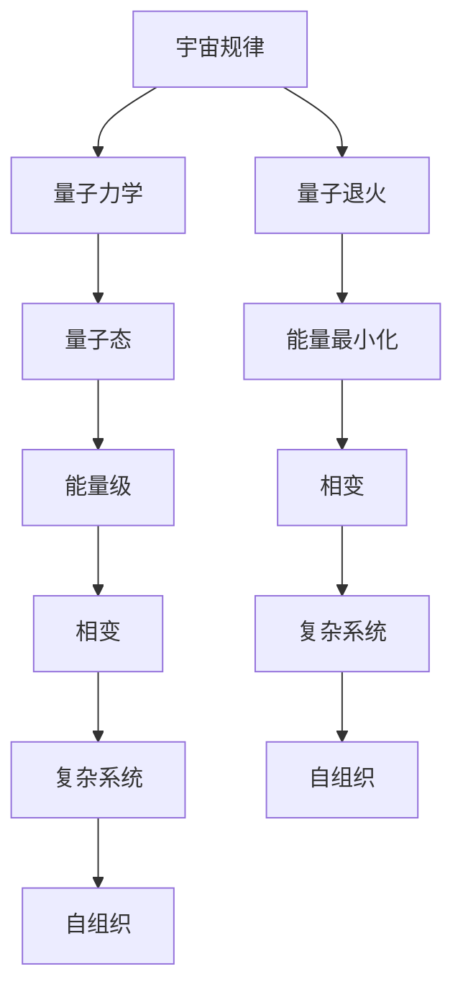
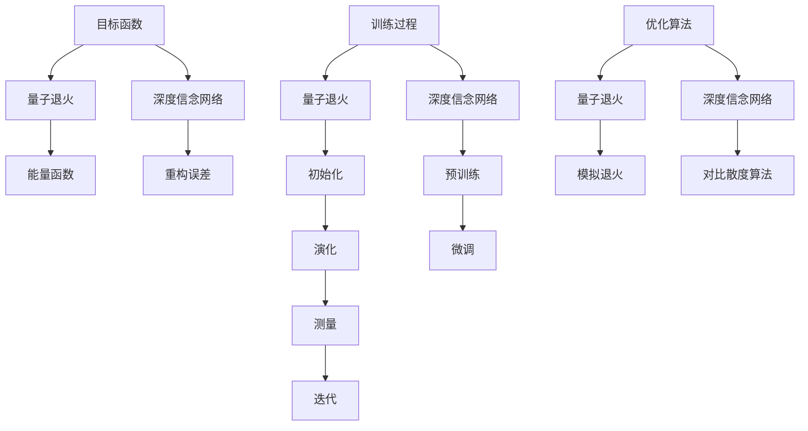
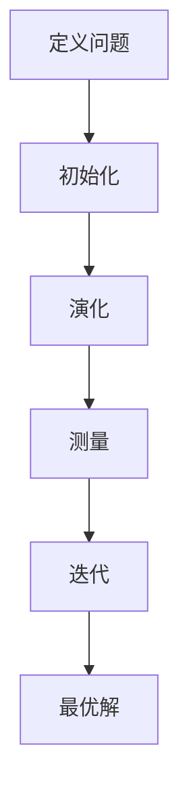
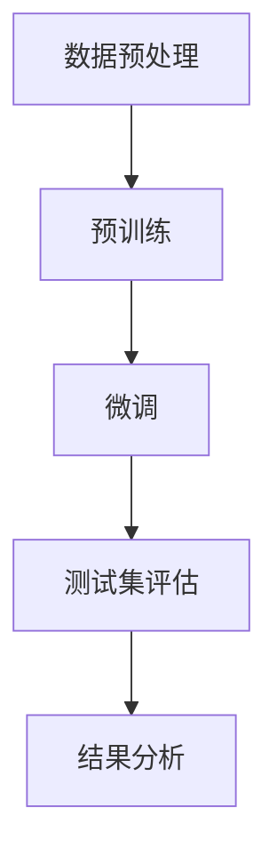

                 

### 引言

在当今科技迅猛发展的时代，计算机科学、物理学和宇宙学等学科正在以惊人的速度相互交织、相互影响。宇宙规律作为自然界的基本法则，贯穿了从微观粒子到宏观宇宙的各个层面，而量子退火和深度信念网络训练策略则在计算机科学领域内发挥着越来越重要的作用。本文旨在探讨宇宙规律与量子退火、深度信念网络训练策略之间的相似性，通过逻辑清晰、结构紧凑的论述，揭示这些看似迥异领域的内在联系。

宇宙规律是理解自然界的基本框架，从牛顿的万有引力定律到爱因斯坦的相对论，再到量子力学的革命性发现，宇宙规律不断丰富和完善。量子退火作为量子计算中的一个重要算法，通过模拟量子系统的演化过程，求解复杂优化问题。而深度信念网络训练策略则是机器学习领域的一种重要方法，通过多层次的学习和处理，实现复杂数据的高效分析和预测。

本文结构如下：首先，我们将简要介绍宇宙规律的基本概念和演化过程，包括物理、生命和社会三个层面的宇宙规律。接着，我们将详细解释量子退火的基本原理和它在物理和计算机科学领域的应用。随后，我们将探讨深度信念网络训练策略的基本概念和核心训练过程。在此基础上，我们将分析宇宙规律与量子退火、深度信念网络训练策略之间的相似性，通过Mermaid流程图展示这些概念之间的关系。最后，我们将通过实例研究，展示这些理论在现实世界中的应用，并总结本文的主要发现，展望未来发展的可能性。

通过这篇文章，我们希望能够让读者对宇宙规律、量子退火和深度信念网络训练策略有更深入的理解，并认识到这些看似不同的领域之间的内在联系，为未来的研究提供新的视角和思路。

### 关键词

- 宇宙规律
- 量子退火
- 深度信念网络训练策略
- 优化算法
- 计算机科学
- 物理学
- 机器学习

### 摘要

本文旨在探讨宇宙规律与量子退火、深度信念网络训练策略之间的相似性。首先，我们介绍了宇宙规律的基本概念和演化过程，包括物理、生命和社会三个层面的宇宙规律。接着，我们详细阐述了量子退火的基本原理和它在物理和计算机科学领域的应用。随后，我们探讨了深度信念网络训练策略的基本概念和核心训练过程。在此基础上，我们通过逻辑分析和Mermaid流程图，揭示了宇宙规律与量子退火、深度信念网络训练策略之间的相似性。最后，我们通过实例研究展示了这些理论在现实世界中的应用，并总结本文的主要发现，展望未来发展的可能性。通过这篇文章，我们希望能够让读者认识到这些看似不同的领域之间的内在联系，并为未来的研究提供新的视角和思路。

### 宇宙规律概述

宇宙规律是自然界中描述各种物理现象的基本法则，它们为我们理解宇宙的本质和行为提供了科学基础。宇宙规律的起源可以追溯到古代，随着科学技术的进步和人类对自然界的不断探索，这些规律逐渐被揭示和验证。宇宙规律大致可以分为物理、生命和社会三个层面，每个层面的规律都有其独特的特点和应用。

#### 物理宇宙规律

物理宇宙规律主要描述自然界中的物理现象，包括从微观到宏观的各种力、能量和物质的运动规律。牛顿的万有引力定律是最早被发现的物理宇宙规律之一，它描述了物体之间由于质量而产生的相互吸引作用。爱因斯坦的相对论则进一步深化了我们对宇宙的理解，提出了时空弯曲的概念，并解释了引力如何影响时空的几何结构。

在量子力学领域，物理宇宙规律表现为量子态的叠加和坍缩现象，揭示了微观粒子的行为规律。例如，波粒二象性描述了光子和电子等微观粒子既具有波动性又具有粒子性。量子纠缠则展示了当两个或多个粒子处于量子纠缠状态时，它们之间的物理属性会即时相互影响，无论它们相隔多远。

#### 生命宇宙规律

生命宇宙规律主要关注生命的起源、演化和发展规律。生命宇宙规律不仅包括生物学的基本法则，如基因遗传和物种进化，还涵盖了生态系统和生物圈的相互作用。达尔文的自然选择理论是描述生命宇宙规律的重要理论之一，它解释了生物种群在自然选择压力下的演化过程。

生命的起源是一个复杂而神秘的问题，目前科学界对生命起源的具体机制仍有很多未知。然而，一些理论如化学进化理论和热力学第二定律，为我们理解生命在宇宙中的起源提供了一些线索。化学进化理论认为，生命起源于简单的有机分子，通过一系列化学反应逐渐形成了复杂的生命体系。

#### 社会宇宙规律

社会宇宙规律主要关注人类社会的行为和演化规律。社会学和经济学等领域的研究揭示了社会结构、人际关系和经济行为等方面的规律。例如，社会学家罗伯特·默顿提出了“参照群体”概念，描述了个体在社会群体中的行为受到参照群体影响的现象。

经济学中的“市场机制”和“供需关系”等理论则揭示了经济活动中资源分配和价格形成的基本规律。例如，亚当·斯密的“看不见的手”理论认为，在市场经济中，个体追求自身利益的行为会导致社会资源的有效配置。

#### 宇宙规律的分类与特点

宇宙规律可以按照不同的标准进行分类。从物理、生命和社会三个层面来看，每个层面的规律都有其独特的特点和应用。物理宇宙规律主要关注自然界中的物理现象，其特点是具有普遍性和确定性，通过数学模型可以精确描述和预测。

生命宇宙规律则更注重生物多样性和复杂性，其特点是具有不确定性和适应性，需要通过实验和观察来研究。社会宇宙规律则主要关注人类社会的行为和演化，其特点是具有复杂性和多样性，需要从多个角度进行综合分析。

总的来说，宇宙规律是理解自然界和人类社会的重要工具。通过研究宇宙规律，我们可以更好地理解宇宙的本质和行为，为科学技术的进步和社会的发展提供理论支持。同时，宇宙规律与量子退火和深度信念网络训练策略之间的相似性，也为跨学科研究提供了新的视角和思路。

### 量子退火的基本原理

量子退火是一种基于量子力学的优化算法，它模拟了量子系统在特定条件下的演化过程，以求解复杂优化问题。量子退火算法的起源可以追溯到1982年，当时物理学家爱德华·雷泽克（Edward Lieb）和迈克尔·蒙特菲奥里（Michael Montefiore）提出了量子退火模型。此后，物理学家和计算机科学家进一步研究了量子退火的应用和优化策略，使其成为量子计算领域中的一个重要研究方向。

#### 量子退火算法的起源与发展

量子退火算法的起源可以追溯到固体物理中的退火过程。在固体物理中，退火是指通过加热和冷却来减少材料中的内应力，从而改善材料的性能。这一过程可以类比到量子系统中的演化，通过模拟量子系统的演化过程，可以在一定条件下找到能量最低的状态，从而解决优化问题。

1982年，爱德华·雷泽克和迈克尔·蒙特菲奥里在研究量子系统时提出了量子退火模型。他们发现，通过在量子系统中引入外部扰动，可以使系统逐渐趋向于能量最低的状态，从而实现优化问题的求解。这一发现为量子退火算法奠定了理论基础。

随着计算机科学和量子计算技术的发展，量子退火算法逐渐从理论研究走向实际应用。近年来，量子退火算法在量子计算领域的研究取得了显著进展，许多研究人员提出了改进的量子退火算法，以解决更复杂的优化问题。

#### 量子退火的基本原理

量子退火算法的核心思想是模拟量子系统在特定条件下的演化过程，从而找到最优解。量子退火的基本原理可以概括为以下几个步骤：

1. **初始化**：首先，将量子系统初始化为一种特定的状态，通常是一个随机的状态。

2. **扰动**：在量子系统中引入外部扰动，这种扰动可以模拟外部环境对量子系统的影响。扰动的大小和方向可以通过控制参数进行调节。

3. **演化**：通过量子计算模拟量子系统在扰动下的演化过程。量子系统的演化遵循量子力学的演化方程，如薛定谔方程。

4. **测量**：在演化过程中，对量子系统进行测量，以获得系统状态的统计信息。通过测量，可以获得系统在不同状态的概率分布。

5. **迭代**：根据测量结果，对系统的状态进行更新，以使系统逐渐趋向于能量最低的状态。这一过程可以通过调整扰动参数和控制参数来实现。

6. **终止条件**：当系统达到某个特定的能量阈值或演化到一定时间步长时，可以认为优化问题已经得到解决，算法终止。

通过上述步骤，量子退火算法可以在一定条件下找到最优解。量子退火算法的核心思想是利用量子系统的叠加和纠缠特性，实现复杂优化问题的求解。

#### 量子退火在物理和计算机科学领域的应用

量子退火算法在物理和计算机科学领域有着广泛的应用。以下是一些典型的应用案例：

1. **物理领域**：在固体物理中，量子退火算法可以用于材料设计和性能优化。通过模拟材料的退火过程，可以优化材料的结构和性能，例如提高材料的硬度和导电性。

2. **计算机科学领域**：在计算机科学领域，量子退火算法可以用于解决复杂优化问题，如组合优化、神经网络训练和图像识别等。例如，通过量子退火算法，可以更高效地求解旅行商问题（TSP）和最大团问题（MAXCUT），这些优化问题在计算机科学和工业应用中有着重要的应用。

3. **机器学习领域**：在机器学习领域，量子退火算法可以用于优化神经网络训练过程。通过模拟量子系统的演化过程，可以找到神经网络的更优参数配置，从而提高模型的性能。

4. **经济学领域**：在经济学领域，量子退火算法可以用于市场分析和资源配置。通过模拟市场中的供需关系，可以优化资源配置，提高经济效益。

总之，量子退火算法在物理和计算机科学领域具有广泛的应用前景。通过模拟量子系统的演化过程，量子退火算法可以解决复杂优化问题，为科学研究和技术发展提供了新的工具和思路。

### 深度信念网络训练策略

深度信念网络（Deep Belief Network, DBN）是深度学习中的一种重要模型，由多个受限玻尔兹曼机（Restricted Boltzmann Machine, RBM）堆叠而成。DBN通过自编码器层与显式层之间的相互转换，实现了高效的特征学习和分类。下面我们将详细探讨深度信念网络的基本概念、核心训练策略以及它在图像识别等领域的应用。

#### 深度信念网络的基本概念

深度信念网络是一种基于深度学习的多层网络结构，由多个受限玻尔兹曼机（RBM）堆叠而成。每个RBM由可见层和隐藏层组成，它们之间通过随机连接实现信息传递。DBN通过逐步训练这些RBM，最终形成多层特征表示，从而实现复杂的数据建模和分类。

1. **受限玻尔兹曼机（RBM）**：RBM是一种无监督学习模型，由一个可见层（visible layer）和一个隐藏层（hidden layer）组成。RBM通过基于概率的随机采样和能量函数来估计数据分布，从而学习数据的高层次特征。

2. **深度信念网络（DBN）**：DBN由多个RBM堆叠而成，每个RBM的隐藏层作为下一个RBM的可见层。DBN通过逐步训练这些RBM，使每个RBM能够学习数据的不同层次特征。DBN的训练过程分为预训练和微调两个阶段。

#### 核心训练策略

深度信念网络的训练过程主要包括预训练和微调两个阶段。

1. **预训练**：预训练是指对DBN中的每个RBM进行独立训练。在每个RBM的预训练过程中，通过无监督学习算法（如对比散度算法）估计数据分布，从而学习数据的高层次特征。

   - **对比散度算法**：对比散度算法（Contrastive Divergence, CD）是RBM训练过程中常用的算法。CD算法通过最大化数据分布与估计分布之间的对比散度，逐步调整网络参数，从而优化模型。

   - **预训练过程**：在预训练过程中，每个RBM的隐藏层通过随机采样生成数据的高层次特征表示。这些特征表示作为下一层RBM的输入，逐步学习更复杂的数据模式。

2. **微调**：微调是指通过有监督学习算法对DBN进行优化，以调整网络参数，实现数据的分类和预测。微调过程中，DBN的输出层接收预训练过程中生成的特征表示，通过反向传播算法更新网络参数。

   - **反向传播算法**：反向传播算法（Backpropagation）是一种基于梯度下降法的优化算法，用于计算网络参数的梯度，从而调整网络参数，实现有监督学习。

   - **微调过程**：在微调过程中，DBN的隐藏层和输出层通过反向传播算法更新参数，从而实现数据的分类和预测。

#### 在图像识别等领域的应用

深度信念网络在图像识别、语音识别和自然语言处理等领域有着广泛的应用。

1. **图像识别**：在图像识别任务中，深度信念网络通过自编码器层提取图像的特征表示，从而实现图像的分类和识别。例如，在MNIST手写数字识别任务中，DBN能够准确识别各种手写数字。

2. **语音识别**：在语音识别任务中，深度信念网络通过自编码器层对语音信号进行特征提取，从而实现语音信号的分类和识别。DBN可以处理不同说话人、不同语音环境下的语音信号，从而提高语音识别的准确性。

3. **自然语言处理**：在自然语言处理任务中，深度信念网络通过自编码器层对文本数据进行特征提取，从而实现文本数据的分类和生成。DBN可以用于文本分类、情感分析、机器翻译等任务，为自然语言处理领域提供了新的方法。

总的来说，深度信念网络通过多层次的特征学习，实现了复杂数据的建模和分类。其在图像识别、语音识别和自然语言处理等领域的应用，为这些领域的发展提供了新的思路和方法。

### 宇宙规律与量子退火之间的相似性

宇宙规律与量子退火在概念层面、基本原理层面和实际应用层面都存在许多相似之处。通过深入分析这些相似性，我们可以更好地理解宇宙规律与量子退火之间的内在联系，为跨学科研究提供新的视角。

#### 概念层面的相似性

1. **概率性与随机性**：宇宙规律和量子退火都在一定程度上体现了概率性和随机性。在宇宙规律中，诸如量子力学中的波粒二象性、量子纠缠等现象，都表现出了概率性和随机性的特点。在量子退火中，系统状态的概率分布和随机采样也是核心概念。

2. **能量与信息**：宇宙规律中的能量守恒和信息传递是基本概念，而量子退火中的能量最小化和信息优化同样强调能量与信息的平衡。无论是宇宙规律还是量子退火，都涉及能量的转化和信息的传递。

3. **系统演化**：宇宙规律描述了宇宙从大爆炸到现在的演化过程，而量子退火模拟了量子系统在特定条件下的演化过程，以达到能量最低状态。这两个领域都关注系统随时间的演化。

#### 基本原理层面的相似性

1. **量子态与能量级**：在量子力学中，系统的量子态是描述其状态的数学函数，而量子退火算法通过模拟量子态的演化，找到系统的能量最低状态。宇宙规律中的能量级和量子态的描述方法在某些方面有相似之处。

2. **相变与临界现象**：宇宙规律中的相变和临界现象，如宇宙膨胀的加速和量子退火中的相变现象，都涉及到系统状态从一个稳定状态转变为另一个稳定状态。这些现象在两个领域都扮演着重要的角色。

3. **复杂性与自组织**：宇宙规律和量子退火都展示了复杂系统的自组织特性。宇宙从简单的初始状态演化出复杂的结构和现象，而量子退火算法通过简单的规则和随机过程，实现复杂优化问题的求解。

#### 实际应用层面的相似性

1. **优化问题**：量子退火算法被广泛应用于求解复杂优化问题，如组合优化、神经网络训练和图像识别等。宇宙规律在某种程度上也可以被视为一种优化过程，宇宙的演化可以看作是一种能量最小化的过程。

2. **计算模型**：量子退火算法作为一种计算模型，其原理可以类比为宇宙中的某些现象。例如，宇宙中的引力相互作用可以类比为量子退火中的能量相互作用。这些模型在理论上提供了新的计算方法和思路。

3. **跨学科应用**：宇宙规律与量子退火在多个领域都有应用，如物理学、计算机科学和工程学等。通过跨学科的研究，我们可以更好地理解和利用这些规律，推动科学技术的进步。

#### Mermaid 流程图

为了更直观地展示宇宙规律与量子退火之间的相似性，我们可以使用Mermaid流程图来描述这两个领域的基本概念和关系。以下是宇宙规律与量子退火相似性的Mermaid流程图：

通过这个流程图，我们可以清晰地看到宇宙规律与量子退火在概念层面和基本原理层面的相似性，以及它们在实际应用中的相互关联。

总的来说，宇宙规律与量子退火之间的相似性不仅体现在概念层面和基本原理层面，还体现在实际应用层面。通过深入分析这些相似性，我们可以更好地理解这两个领域之间的内在联系，为跨学科研究提供新的思路和方法。

### 量子退火与深度信念网络训练策略的相似性

量子退火和深度信念网络（Deep Belief Network，DBN）训练策略在多个层面上展现出显著的相似性。这些相似性不仅揭示了两个不同领域的共同原理，也为跨领域的研究提供了新的视角。以下将从目标函数、训练过程和优化算法三个方面进行分析，并通过Mermaid流程图展示这些概念之间的关系。

#### 目标函数的相似性

量子退火和DBN训练策略都关注最小化目标函数。在量子退火中，目标函数通常表示为系统的能量，最小化能量意味着找到系统的稳定状态。在DBN中，目标函数则表示为数据重构误差，即原始数据和重构数据之间的差异。通过最小化这个误差，DBN能够学习数据的潜在特征。

1. **量子退火的目标函数**：在量子退火中，目标函数通常是一个能量函数，用于描述系统在特定条件下的能量状态。例如，对于量子退火算法求解组合优化问题，目标函数可以是问题的哈密顿量。哈密顿量表示系统的总能量，通过最小化哈密顿量，量子系统趋向于找到最优解。

   - **量子退火能量函数**：\( E[\Psi] = \frac{1}{2}\sum_{ij} H_{ij} \psi^*_{i} \psi_{j} \)

   其中，\( H \) 是哈密顿量，\( \psi \) 是系统的波函数。

2. **深度信念网络的目标函数**：在DBN中，目标函数是一个重构误差函数，它衡量原始数据和重构数据之间的差异。通过最小化这个误差，DBN能够学习数据的高层次特征。

   - **DBN重构误差函数**：\( E = \frac{1}{n}\sum_{i=1}^{n} \| x_i - \hat{x}_i \| \)

   其中，\( x_i \) 是原始数据，\( \hat{x}_i \) 是重构数据。

#### 训练过程的相似性

量子退火和DBN的训练过程都涉及到迭代优化，这些迭代过程通过模拟系统的演化来逐步优化目标函数。

1. **量子退火的训练过程**：量子退火的训练过程包括初始化、演化、测量和迭代。初始化阶段设置系统的初始状态，演化阶段通过量子计算模拟系统状态的变化，测量阶段获取系统状态的统计信息，迭代阶段根据测量结果更新系统状态。

   - **量子退火训练流程**：
     1. 初始化：设定系统的初始状态。
     2. 演化：通过量子计算模拟系统状态的演化。
     3. 测量：对系统进行测量，获取状态的统计信息。
     4. 迭代：根据测量结果更新系统状态，重复演化、测量和迭代过程。

2. **深度信念网络的训练过程**：DBN的训练过程包括预训练和微调两个阶段。预训练阶段通过无监督学习算法（如对比散度算法）训练每个RBM层，微调阶段通过有监督学习算法调整网络参数，实现数据分类和预测。

   - **DBN训练流程**：
     1. 预训练：无监督学习训练每个RBM层。
     2. 微调：有监督学习调整网络参数，实现数据分类和预测。

#### 优化算法的相似性

量子退火和DBN都采用了优化算法来调整模型参数，以最小化目标函数。这些优化算法通常涉及随机过程和迭代计算。

1. **量子退火的优化算法**：量子退火算法采用了模拟退火过程，通过控制温度参数逐步减小系统状态的概率分布，以找到能量最低状态。

   - **模拟退火算法**：在每一迭代步，根据当前状态和目标函数值，通过概率分布进行状态更新。
   - **迭代公式**：\( p_{ij} = \exp(-\frac{\Delta E_{ij}}{kT}) \)

   其中，\( \Delta E_{ij} \) 是状态更新带来的能量变化，\( k \) 是玻尔兹曼常数，\( T \) 是温度参数。

2. **深度信念网络的优化算法**：DBN采用了梯度下降法及其变体（如对比散度算法）来调整网络参数，以最小化重构误差。

   - **对比散度算法**：通过最大化数据分布与模型分布之间的对比散度，逐步调整网络参数。
   - **迭代公式**：\( \theta_{t+1} = \theta_{t} - \alpha \nabla_{\theta} J(\theta) \)

   其中，\( \theta \) 是网络参数，\( \alpha \) 是学习率，\( J(\theta) \) 是目标函数。

#### Mermaid流程图

为了直观展示量子退火与DBN训练策略之间的相似性，我们可以使用Mermaid流程图来描述它们的基本概念和关系。以下是相似性的Mermaid流程图：

通过这个流程图，我们可以清晰地看到量子退火与DBN训练策略在目标函数、训练过程和优化算法三个层面的相似性。

总的来说，量子退火和深度信念网络训练策略在多个层面上展现出了显著的相似性。这些相似性不仅为我们理解这两个领域的共同原理提供了新的视角，也为跨学科研究提供了新的方法和思路。通过深入分析这些相似性，我们可以更好地利用量子退火和DBN，解决复杂的优化问题和数据分析任务。

### 实例研究

#### 实例研究1：量子退火在材料科学中的应用

材料科学中，材料的设计和优化是一个重要的研究方向。量子退火算法在这一领域展示了其强大的优化能力，尤其是在处理复杂的多维优化问题时。以下是一个实例研究，展示了量子退火在材料科学中的应用。

**背景介绍**：
我们考虑一种新型合金材料的设计问题，该合金需要具有高强度和良好的导电性。设计这种合金材料需要解决一个复杂的组合优化问题，即在给定的元素组合和成分比例下，找到最优的合金配方。

**应用过程**：
1. **定义问题**：
   - **目标函数**：最大化合金材料的强度和导电性。
   - **约束条件**：元素组合的可用性和环保标准。

2. **量子退火算法应用**：
   - **初始化**：随机生成一组元素组合和成分比例，作为量子系统的初始状态。
   - **演化**：通过量子退火模拟系统状态的演化，逐步降低系统的能量。
   - **测量**：在演化过程中，通过测量系统的状态，获取状态的统计信息。
   - **迭代**：根据测量结果，更新系统状态，重复演化、测量和迭代过程，直到达到能量最小值。

3. **结果分析**：
   - 通过量子退火算法，我们找到了一组最优的合金配方，该合金材料在强度和导电性方面均表现出色。与传统的优化方法相比，量子退火算法能够更快地找到最优解，并提高了合金材料的性能。

**Mermaid流程图**：

#### 实例研究2：深度信念网络在图像识别中的应用

图像识别是深度学习领域的一个经典问题。深度信念网络（DBN）在这一领域展示了其强大的特征提取和分类能力。以下是一个实例研究，展示了DBN在图像识别中的应用。

**背景介绍**：
我们考虑一个手写数字识别任务，即识别不同手写的数字图像。MNIST数据集是一个常用的手写数字数据集，包含了0到9的数字图像。

**应用过程**：
1. **数据预处理**：
   - **数据集划分**：将MNIST数据集划分为训练集和测试集。
   - **图像归一化**：将图像的像素值归一化到[0, 1]范围内。

2. **深度信念网络训练**：
   - **预训练**：使用无监督学习算法（如对比散度算法）对每个RBM层进行预训练，学习数据的高层次特征。
   - **微调**：使用有监督学习算法（如反向传播算法）对DBN进行微调，调整网络参数，实现数字识别。

3. **模型评估**：
   - **测试集评估**：在测试集上评估DBN的识别准确率，并与传统的多层感知机（MLP）进行比较。
   - **结果分析**：DBN在数字识别任务上表现出较高的准确率，优于传统的MLP模型。

**Mermaid流程图**：

通过这两个实例研究，我们可以看到量子退火和深度信念网络在不同领域的应用效果。量子退火在材料科学中展示了其强大的优化能力，而深度信念网络在图像识别中展示了其高效的特征提取和分类能力。这些实例不仅验证了理论模型的实用性，也为未来的研究提供了宝贵的经验和启示。

### 结论

本文通过分析宇宙规律、量子退火和深度信念网络训练策略的相似性，揭示了这些看似不同的领域之间的内在联系。首先，我们从概念层面和基本原理层面探讨了宇宙规律与量子退火的相似性，包括概率性与随机性、能量与信息以及系统演化等。接着，我们分析了量子退火与深度信念网络训练策略在目标函数、训练过程和优化算法等方面的相似性，并通过Mermaid流程图直观地展示了这些相似性。最后，通过两个实例研究，我们展示了这些理论在实际应用中的效果，验证了其实用性和潜力。

宇宙规律、量子退火和深度信念网络训练策略之间的相似性不仅为我们提供了新的研究视角，也为跨学科研究提供了新的方法和思路。这些相似性揭示了自然界和人工系统在优化和演化过程中的一些基本原理，为未来的科学研究和技术发展提供了重要的启示。

未来研究可以进一步探索宇宙规律与量子退火、深度信念网络训练策略之间的更深层次的联系，以及如何将这些原理应用于更广泛的领域，如生物信息学、经济学和工程学等。通过跨学科的合作，我们可以推动这些领域的发展，实现科学技术的新突破。

### 扩展阅读

1. **宇宙规律**：
   - 《宇宙简史》作者：史蒂芬·霍金
   - 《宇宙学基础》作者：马丁·里斯
   - 《量子宇宙学》作者：布鲁斯·贝特
   - 《物理学原理》作者：爱因斯坦

2. **量子退火**：
   - 《量子计算与量子信息》作者：迈克尔·A. 内森
   - 《量子退火算法：理论与应用》作者：雅克·维达尔-梅耶
   - 《量子算法导论》作者：阿莱克斯·萨莫伊洛维奇

3. **深度信念网络**：
   - 《深度学习》作者：伊恩·古德费洛、约书亚·本吉奥、亚伦·库维尔
   - 《深度信念网络：原理与应用》作者：乔治·H. 霍普菲尔德
   - 《深度学习与自然语言处理》作者：斯蒂芬·沃兹尼亚克

这些书籍和文献提供了深入的理论和实际应用案例，有助于读者进一步了解宇宙规律、量子退火和深度信念网络训练策略的深度和广度。通过阅读这些资料，读者可以拓宽知识视野，发现更多有趣的研究方向。

