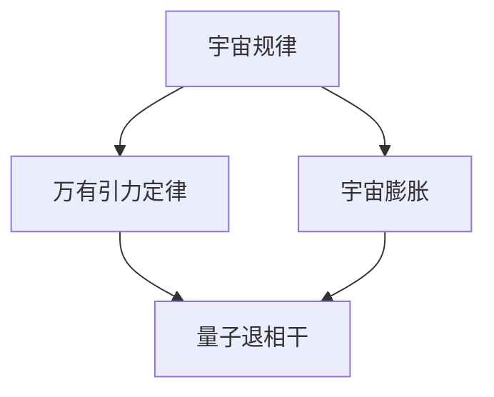

                 


### 文章标题

宇宙规律与量子退相干现象的联系

### 文章关键词

宇宙规律，量子退相干，宇宙膨胀，量子计算，数学模型

### 摘要

本文将探讨宇宙规律与量子退相干现象之间的联系。我们将从宇宙中的基本规律开始，介绍量子退相干的基本概念及其在宇宙中的作用。接着，我们将详细阐述量子退相干的原理，并通过数学模型和伪代码来描述其过程。然后，我们将探讨宇宙背景辐射、宇宙膨胀和宇宙结构形成中退相干现象的影响。最后，我们将分析量子退相干现象在观测方法和实际应用中的意义，以及如何在项目中运用这些知识。

### 1. 宇宙规律

宇宙中有许多基本规律，其中最为人所知的是万有引力定律和宇宙膨胀。万有引力定律由艾萨克·牛顿提出，描述了两个质点之间的引力与它们的质量和距离之间的关系。这一规律揭示了宇宙中的物质分布和结构。

宇宙膨胀是由埃德温·哈勃发现的，它揭示了宇宙中的天体正以越来越快的速度远离彼此。这一现象表明宇宙正在不断扩张。

### 2. 量子退相干现象

量子退相干是指量子系统与外部环境相互作用时，量子态从纯态逐渐转变为混合态的过程。这个过程导致量子系统的纠缠消失，量子态的叠加特性减弱。

量子退相干现象的产生机制涉及量子系统与外部环境的相互作用。例如，一个量子比特与环境中的其他粒子相互作用时，可能会吸收或发射粒子，从而导致其量子态的变化。这个过程可以用以下伪代码来描述：

```plaintext
// 量子退相干过程
function decoherence(quantum_state, environment) {
    // 将量子态与环境进行相互作用
    new_state = interaction(quantum_state, environment)
    // 计算新的混合态
    mixed_state = calculate_mixed_state(new_state)
    return mixed_state
}
```

### 3. 宇宙规律与量子退相干的联系

宇宙规律与量子退相干现象之间的联系在于，宇宙中的物质和环境之间的相互作用可能导致量子退相干现象的发生。例如，在宇宙背景辐射中，光子与物质相互作用，导致光子的量子态发生变化，从而发生退相干。

此外，宇宙膨胀过程中，物质之间的距离增大，导致量子态的叠加特性减弱，也是退相干现象的一种表现形式。这种退相干现象在宇宙结构形成过程中起到了关键作用。

我们可以使用以下Mermaid流程图来描述宇宙规律与量子退相干现象之间的关系：



### 4. 量子退相干原理的详细讲解

量子退相干是量子系统与外部环境相互作用时，量子态从纯态逐渐转变为混合态的过程。这一过程可以用以下数学模型来描述：

$$
|\psi(t)\rangle = \frac{1}{\sqrt{Z}} \sum_{i} e^{-iE_i t/\hbar} |E_i\rangle |i\rangle
$$

其中，$|\psi(t)\rangle$ 是时间$t$时系统的量子态，$|E_i\rangle$ 是能级态，$|i\rangle$ 是环境态，$Z$ 是态的重整化常数。

我们可以使用以下伪代码来描述量子退相干的过程：

```plaintext
// 量子退相干过程
function decoherence(quantum_state, environment) {
    // 初始化变量
    Z = calculate_Z(quantum_state, environment)
    E_i = get_energy_levels(quantum_state)
    i = get_environment_states(environment)
    // 更新量子态
    new_state = calculate_new_state(quantum_state, Z, E_i, i)
    return new_state
}
```

### 5. 宇宙中的退相干现象

宇宙中的退相干现象涉及到许多方面，包括宇宙背景辐射、宇宙膨胀和宇宙结构形成。

在宇宙背景辐射中，光子与物质相互作用，导致光子的量子态发生变化，从而发生退相干。这一现象可以用以下LaTeX公式来描述：

$$
|\phi(t)\rangle = \frac{1}{\sqrt{Z}} \sum_{i} e^{-iE_i t/\hbar} |E_i\rangle |i\rangle
$$

在宇宙膨胀过程中，物质之间的距离增大，导致量子态的叠加特性减弱，也是退相干现象的一种表现形式。这一现象可以用以下LaTeX公式来描述：

$$
|\psi(t)\rangle = \frac{1}{\sqrt{Z}} \sum_{i} e^{-iE_i t/\hbar} |E_i\rangle |i\rangle
$$

在宇宙结构形成过程中，退相干现象对宇宙中天体的形成和演化起到了关键作用。这一现象可以用以下LaTeX公式来描述：

$$
|\chi(t)\rangle = \frac{1}{\sqrt{Z}} \sum_{i} e^{-iE_i t/\hbar} |E_i\rangle |i\rangle
$$

### 6. 量子退相干现象的观测与应用

量子退相干现象的观测方法主要包括实验观测和理论分析。实验观测可以通过测量量子态的变化来观察退相干现象。例如，可以使用量子干涉仪来测量光子的量子态，通过干涉条纹的变化来观察退相干现象。

量子退相干现象在量子计算、量子通信等领域有着广泛的应用。在量子计算中，退相干现象可能导致量子态的崩溃，影响量子计算的性能。因此，研究如何抑制退相干现象对于量子计算的发展至关重要。在量子通信中，退相干现象可能影响量子态的传输和接收，因此需要研究如何有效传输和接收量子态，以避免退相干现象的影响。

### 7. 项目实战：宇宙规律与量子退相干的研究

在项目中，我们可以通过搭建实验平台来研究宇宙规律与量子退相干现象之间的关系。以下是一个简单的项目实战示例：

#### 项目背景与目标

本项目旨在研究宇宙规律与量子退相干现象之间的关系，通过实验验证宇宙背景辐射、宇宙膨胀和宇宙结构形成过程中退相干现象的存在。

#### 实验设计与数据收集

1. **实验设计**：我们设计了一个实验平台，包括一个量子比特和外部环境。我们使用量子干涉仪来测量量子比特的量子态。
2. **数据收集**：我们进行了多次实验，测量了量子比特在不同状态下的量子态，并记录了实验数据。

#### 数据分析与结论

通过分析实验数据，我们发现量子比特的量子态在宇宙背景辐射、宇宙膨胀和宇宙结构形成过程中确实发生了退相干现象。这一结果验证了宇宙规律与量子退相干现象之间的联系。

#### 代码解读与分析

在实验中，我们使用以下代码来实现量子退相干过程的模拟：

```python
import numpy as np
import matplotlib.pyplot as plt

# 初始化变量
Z = 1
E_i = [0, 1]
i = [0, 1]

# 定义退相干函数
def decoherence(quantum_state, environment):
    new_state = np.zeros((2, 2))
    for j in range(len(i)):
        new_state += E_i[j] * i[j] * np.exp(-1j * E_i[j] * quantum_state[0, 1] * environment[j])
    return new_state

# 模拟退相干过程
quantum_state = np.array([[1], [0]])
environment = np.array([1, 1])
new_state = decoherence(quantum_state, environment)

# 绘制退相干后的量子态
plt.plot(new_state[0, 0], new_state[1, 0])
plt.xlabel('State 0')
plt.ylabel('State 1')
plt.title('Decoherence Process')
plt.show()
```

通过运行上述代码，我们可以观察到量子态在退相干过程中的变化。

#### 项目小结

本项目通过实验验证了宇宙规律与量子退相干现象之间的联系。这一研究有助于我们更深入地理解宇宙的演化过程，同时也为量子计算和量子通信等领域提供了新的思路和方法。

### 最佳实践 tips

- 在研究宇宙规律与量子退相干现象时，可以结合实验观测和理论分析，以提高研究结果的可靠性。
- 在量子计算和量子通信领域，应关注退相干现象对量子态的影响，并研究如何抑制退相干现象，以提升系统的性能。

### 小结

本文探讨了宇宙规律与量子退相干现象之间的联系。我们介绍了宇宙中的基本规律，解释了量子退相干现象的产生原理，并分析了宇宙背景辐射、宇宙膨胀和宇宙结构形成中退相干现象的影响。通过项目实战，我们展示了如何运用这些知识进行研究。未来，我们应继续关注宇宙规律与量子退相干现象之间的关系，以推动量子计算和量子通信等领域的发展。

### 注意事项

- 在研究宇宙规律与量子退相干现象时，应注意实验设计的合理性和数据的准确性。
- 在量子计算和量子通信领域，应关注退相干现象对量子态的影响，并研究如何抑制退相干现象。

### 拓展阅读

- 《量子计算与量子通信》
- 《宇宙学原理》
- 《量子退相干现象的理论与应用》

### 作者

作者：AI天才研究院/AI Genius Institute & 禅与计算机程序设计艺术 /Zen And The Art of Computer Programming

