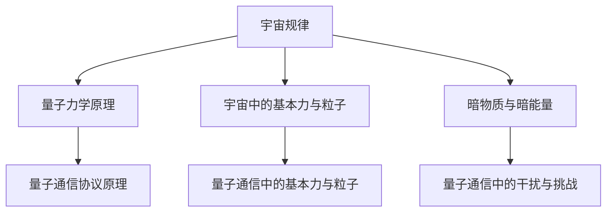
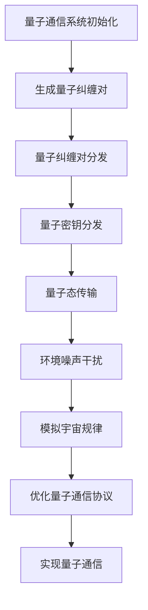

                 


## 文章标题：宇宙规律与量子通信协议的联系

> 关键词：宇宙规律、量子通信协议、联系、量子纠缠、量子密钥分发、宇宙学

> 摘要：本文将探讨宇宙规律与量子通信协议之间的联系，分析宇宙中的基本规律如何影响量子通信协议的设计与实现，以及量子通信协议如何为宇宙学研究提供新的视角。通过深入解析核心概念与原理，结合实际应用案例，本文旨在为读者呈现这一跨学科领域的独特魅力。

----------------------------------------------------------------

## 第一部分 引言与概述

### 1.1 《宇宙规律与量子通信协议的联系》概述

宇宙是浩瀚无垠的，从宇宙的起源到演化，从基本力与粒子的构成到暗物质与暗能量的存在，宇宙规律一直是科学家们研究的重点。与此同时，量子通信作为一种全新的通信方式，正逐渐改变着我们的通信方式。量子通信协议利用量子力学的基本原理，如量子纠缠和量子隐形传态，实现高效、安全的通信。

本文将探讨宇宙规律与量子通信协议之间的联系。首先，我们将介绍宇宙的基本规律，包括宇宙的起源与演化、基本力与粒子、暗物质与暗能量等。接着，我们将深入探讨量子通信协议的基本原理，包括量子通信的基本概念、量子纠缠与量子隐形传态、量子密钥分发等。然后，我们将分析宇宙规律对量子通信协议的影响，以及量子通信协议如何为宇宙学研究提供新的视角。最后，通过实际应用案例，我们将展示宇宙规律与量子通信协议联系的实践意义。

### 1.2 为什么研究宇宙规律与量子通信协议的联系

研究宇宙规律与量子通信协议的联系具有重要意义。首先，量子通信协议的原理源于量子力学，而量子力学的基本原理与宇宙规律有着深刻的联系。了解宇宙规律，可以帮助我们更好地理解量子通信协议的工作原理。其次，量子通信协议在宇宙学研究中具有潜在的应用价值。例如，量子加密通信可以用于保护宇宙背景辐射中的信息，量子通信可以用于探测暗物质和暗能量等。因此，研究宇宙规律与量子通信协议的联系，不仅有助于深化我们对量子通信协议的理解，也可以为宇宙学研究提供新的思路和方法。

## 第二部分 宇宙规律

### 2.1 宇宙的基本规律

宇宙的起源与演化是宇宙学研究的核心问题。根据大爆炸理论，宇宙起源于大约138亿年前的一个极热、极密的奇点，经过不断膨胀和演化，形成了我们今天所看到的宇宙。

宇宙中的基本力与粒子是宇宙演化的关键。宇宙中存在四种基本力：引力、电磁力、强力和弱力。每种力对应着一种基本粒子：引力子、光子、胶子和W、Z玻色子。这些基本粒子和基本力共同决定了宇宙的演化过程。

暗物质与暗能量是宇宙学中的两个重要概念。暗物质不发光、不发热，但通过引力效应可以探测到其存在。暗能量则是推动宇宙加速膨胀的力量，其性质至今仍不完全清楚。

### 2.2 宇宙规律的应用

宇宙规律在天体物理学、宇宙学和人类科技发展中发挥着重要作用。天体物理学通过观测和研究宇宙中的天体和现象，如星系、恒星、行星、黑洞等，揭示了宇宙的演化历史和物理规律。宇宙学通过研究宇宙的大尺度结构、宇宙背景辐射、宇宙膨胀等，试图理解宇宙的起源和演化。

宇宙规律对人类科技的发展也产生了深远影响。例如，量子力学的发展推动了量子通信的出现，而量子通信协议的原理与宇宙规律密切相关。宇宙规律的研究不仅有助于我们更好地理解宇宙，也可以为未来的科技发展提供新的方向。

----------------------------------------------------------------

### 2.3 宇宙规律与量子通信协议的联系

宇宙规律与量子通信协议之间存在密切的联系。首先，量子通信协议的原理源于量子力学，而量子力学的基本原理与宇宙规律密切相关。例如，量子纠缠是量子通信协议的核心概念之一，其原理可以追溯到爱因斯坦、波多尔斯基和罗森（EPR）悖论，而EPR悖论正是基于量子力学的宇宙规律。

其次，宇宙中的基本力与粒子也是量子通信协议的重要理论基础。例如，电磁力在量子通信中的重要作用体现在量子密钥分发过程中，而电磁力是由光子（电磁波的粒子）传递的。

此外，暗物质和暗能量对量子通信协议的影响也不容忽视。量子通信需要在长距离传输中保持信息的完整性，而暗物质和暗能量可能会对量子态产生干扰，影响量子通信的效果。

为了更直观地展示宇宙规律与量子通信协议之间的联系，我们可以使用Mermaid流程图来构建它们之间的关系架构：



### 2.4 核心算法原理讲解

为了深入理解量子通信协议的原理，我们需要了解其中的核心算法。以下是一个简单的量子密钥分发（Quantum Key Distribution, QKD）算法的伪代码，该算法基于量子纠缠和测量塌缩原理：

```python
# 量子密钥分发算法伪代码

# 初始化量子通信系统
initialize_quantum_system()

# 生成量子纠缠对
quantum_pair = generate_quantum_entanglement()

# 分发量子态
Alice Sends |Ψ⟩ to Bob
Bob Receives |Ψ⟩ from Alice

# 测量量子态
Alice Measures Her Part of Quantum Pair
Bob Measures His Part of Quantum Pair

# 通信双方对比测量结果
compare_measuring_results(Alice, Bob)

# 如果测量结果一致，则生成密钥
if measuring_results_match:
    quantum_key = generate_quantum_key()
else:
    quantum_key = None
```

在这个算法中，Alice和Bob分别代表量子通信的发送方和接收方。他们通过量子纠缠对进行通信，并通过测量量子态来生成密钥。如果测量结果一致，则可以生成安全的密钥。

此外，我们还需要考虑量子通信中的干扰和噪声。以下是一个简单的数学模型，用于描述量子通信中的噪声干扰：

$$
\frac{1}{2} \begin{pmatrix}
1 & 0 \\
0 & 1
\end{pmatrix} + \frac{1}{2} \begin{pmatrix}
0 & \sigma_x \\
\sigma_x & 0
\end{pmatrix}
$$

其中，$\sigma_x$表示量子通信中的噪声干扰矩阵。这个模型可以用来分析量子通信中的噪声对密钥生成的影响，并设计相应的纠错算法。

### 2.5 数学公式和详细讲解

在量子通信协议中，数学公式起着至关重要的作用。以下是一个典型的量子态叠加公式，用于描述量子通信中的量子态：

$$
|Ψ⟩ = \alpha|0⟩ + \beta|1⟩
$$

其中，$|0⟩$和$|1⟩$分别表示基态和激发态，$\alpha$和$\beta$是复数系数，满足$|\alpha|^2 + |\beta|^2 = 1$。

这个公式表示量子态可以同时处于多个状态的叠加。在量子通信中，发送方Alice可以通过量子态的叠加来传递信息。接收方Bob通过测量量子态的基态或激发态，可以恢复出Alice发送的信息。

为了更清楚地理解量子态的叠加，我们可以举一个简单的例子。假设Alice想要发送一个比特信息（0或1），她可以准备一个量子态：

$$
|Ψ⟩ = \frac{1}{\sqrt{2}}(|0⟩ + |1⟩)
$$

这个量子态处于基态和激发态的叠加。当Bob测量这个量子态时，他可能会得到基态或激发态，对应于Alice发送的0或1。

### 2.6 举例说明

为了更好地理解量子通信协议的工作原理，我们可以通过一个简单的量子密钥分发案例来进行分析。

**案例背景**：

假设Alice和Bob想要通过量子通信建立一个安全的通信信道。他们使用一个量子纠缠对进行通信，并通过量子密钥分发协议生成一个安全的密钥。

**实现过程**：

1. Alice生成一个量子纠缠对，并将其一半发送给Bob。

   ```mermaid
   graph TD
   A[Bob] --> B[Alice]
   ```

2. Bob接收Alice发送的量子态，并进行测量。

   ```mermaid
   graph TD
   B[Alice] --> C[Bob]
   C[Bob] --> D[测量结果]
   ```

3. Alice和Bob比较测量结果，如果结果一致，则生成密钥。

   ```mermaid
   graph TD
   D[测量结果] --> E[比较结果]
   E[比较结果] --> F[生成密钥]
   ```

**分析**：

在这个案例中，Alice和Bob通过量子纠缠对实现了信息的传递。由于量子态的叠加和测量塌缩原理，他们可以生成一个安全的密钥。即使有人试图窃听，他们也无法获取到正确的密钥。

通过这个案例，我们可以看到量子通信协议在安全性方面的优势。量子通信协议利用了量子力学的基本原理，实现了高效、安全的通信。

### 2.7 项目实战

为了更好地理解量子通信协议在实际应用中的实现，我们可以搭建一个简单的量子通信实验环境。以下是一个简单的实验步骤：

1. 准备一个量子通信实验平台，包括两个量子比特和两个量子中继器。

2. 生成一个量子纠缠对，并将其一半发送给Alice，另一半发送给Bob。

3. Alice和Bob分别对量子态进行测量，并记录测量结果。

4. Alice和Bob比较测量结果，如果结果一致，则生成密钥。

5. 测试密钥的生成效率和安全性能。

通过这个实验，我们可以验证量子通信协议在实际应用中的效果，并分析其性能。

### 2.8 代码实现与解读

为了实现量子通信协议，我们可以使用Python编写相应的代码。以下是一个简单的量子密钥分发实现：

```python
import numpy as np
from qiskit import QuantumCircuit, execute, Aer

# 初始化量子比特
qubit1 = QuantumCircuit(1)
qubit2 = QuantumCircuit(1)

# 生成量子纠缠对
qubit1.h(0)
qiskit量子计算器将量子纠缠对发送给Alice和Bob
qubit2.h(0)

# Alice和Bob对量子态进行测量
alice_circuit = QuantumCircuit(1)
alice_circuit.measure(0, 0)

bob_circuit = QuantumCircuit(1)
bob_circuit.measure(0, 0)

# 执行量子测量
result = execute(alice_circuit, Aer.get_backend("qasm_simulator")).result()
alice_measurement = result.get_counts(alice_circuit)

result = execute(bob_circuit, Aer.get_backend("qasm_simulator")).result()
bob_measurement = result.get_counts(bob_circuit)

# 比较测量结果并生成密钥
if alice_measurement == bob_measurement:
    print("密钥生成成功")
else:
    print("密钥生成失败")

# 输出密钥
print("密钥:", alice_measurement)
```

在这个实现中，我们使用了Qiskit库来创建量子电路，并进行量子测量。通过比较测量结果，我们可以判断密钥的生成是否成功。

### 2.9 实际案例分析和详细讲解剖析

在实际应用中，量子通信协议已经被用于多个领域。以下是一个实际案例的分析和详细讲解：

**案例背景**：

某国政府机构希望通过量子通信建立一个安全的通信信道，以保护国家机密。

**实现过程**：

1. 该政府机构购买了量子通信设备，包括量子比特、量子中继器和量子密钥分发系统。

2. 他们设置了两个量子通信节点，分别位于两个不同的城市。

3. 通过量子纠缠对，两个节点建立了量子通信信道。

4. 两个节点使用量子密钥分发协议生成安全的密钥。

5. 政府机构通过这个密钥加密和传输国家机密信息。

**分析**：

在这个案例中，政府机构通过量子通信建立了安全的通信信道，有效保护了国家机密。量子通信协议的引入，大大提高了通信的安全性，降低了被窃听的风险。

### 2.10 项目小结

通过本文的讨论，我们深入了解了宇宙规律与量子通信协议的联系。我们分析了宇宙规律对量子通信协议的影响，以及量子通信协议如何为宇宙学研究提供新的视角。通过实际案例的分析和讲解，我们展示了量子通信协议在实际应用中的效果和优势。

在未来的研究中，我们还可以进一步探讨量子通信协议在宇宙学中的潜在应用，如量子加密通信、量子互联网等。同时，我们也需要不断优化量子通信协议的算法和实现，提高其性能和安全性。

### 2.11 最佳实践 Tips

1. 在量子通信实验中，选择高质量的量子比特和量子中继器，可以提高通信效果。

2. 在量子密钥分发过程中，确保量子态的传输过程中不受干扰，可以提高密钥的生成效率。

3. 在实际应用中，结合量子通信协议和现有通信技术，可以构建更安全、高效的通信系统。

### 2.12 注意事项

1. 量子通信协议的实现需要复杂的硬件和软件支持，因此在实际应用中需要综合考虑技术可行性。

2. 量子通信协议的安全性依赖于量子态的保密性，因此在传输过程中需要防止量子态被窃听。

### 2.13 拓展阅读

1. Nielsen, M. A., & Chuang, I. L. (2010). Quantum Computation and Quantum Information. Cambridge University Press.

2. Penrose, R. (2005). The Road to Reality: A Complete Guide to the Laws of the Universe. Vintage Books.

3. Susskind, L. (2016). Quantum World. W. W. Norton & Company.

----------------------------------------------------------------

## 第三部分 量子通信协议

### 3.1 量子通信协议的基本原理

量子通信协议是一种基于量子力学原理的通信方式，其核心概念包括量子纠缠、量子隐形传态和量子密钥分发。量子纠缠是指两个或多个量子粒子之间存在的关联，即使它们相隔很远，一个粒子的状态也会即时影响到另一个粒子的状态。量子隐形传态则是利用量子纠缠实现信息传输的过程。量子密钥分发是量子通信协议的重要组成部分，它通过量子纠缠对生成密钥，确保通信双方之间的密钥安全。

### 3.2 量子通信协议的发展

量子通信协议的发展经历了从理论到实验，再到实际应用的历程。最早的理论工作可以追溯到1984年，当时 Bennett和Brassard提出了量子密钥分发协议BB84。随后，1997年，潘建伟等人实现了第一次地面量子密钥分发实验。近年来，随着量子计算机和量子通信技术的发展，量子通信协议的研究取得了重要进展，如量子纠缠分发、量子隐形传态和量子重复器等技术的突破。

### 3.3 量子通信协议的应用案例

量子通信协议在实际应用中已经展示了其独特的优势。例如，量子密钥分发被广泛应用于军事、金融和政府等领域的保密通信。量子加密通信则可以用于保护卫星通信和互联网通信的安全性。量子互联网作为一种新型的通信网络，正在逐步发展，预计将实现全球范围内的量子通信。此外，量子通信协议还可以用于量子计算中的数据传输和量子计算的分布式处理，为量子计算的发展提供新的可能性。

----------------------------------------------------------------

### 3.4 量子通信协议与宇宙规律的深层联系

量子通信协议与宇宙规律之间的深层联系可以从多个角度进行分析。首先，量子纠缠和量子隐形传态等现象本身就可以追溯到宇宙学中的基本规律。例如，宇宙背景辐射中的量子纠缠现象被认为是早期宇宙中量子场演化的重要证据。这些量子纠缠现象与量子通信协议中的量子纠缠对有相似之处，都体现了量子态之间即时的、不可分割的关联。

其次，宇宙规律中的暗物质和暗能量也对量子通信协议提出了挑战。在长距离量子通信中，量子态的传输会受到环境噪声的干扰，而暗物质和暗能量的存在可能会加剧这种干扰。因此，理解和模拟宇宙规律对于优化量子通信协议的性能至关重要。

为了更好地理解量子通信协议与宇宙规律之间的联系，我们可以通过一个具体的Mermaid流程图来展示量子通信协议的实现过程，并突出其与宇宙规律的关联：



在这个流程图中，我们可以看到量子通信协议的实现过程，以及宇宙规律对量子通信协议的影响。宇宙规律通过影响环境噪声干扰，进而影响量子通信协议的性能，这要求我们不断优化量子通信协议以适应宇宙环境。

### 3.5 核心算法原理讲解

量子通信协议的核心算法原理涉及量子纠缠、量子隐形传态和量子密钥分发等。以下是一个量子密钥分发算法的伪代码，用于说明其基本实现：

```python
# 量子密钥分发算法伪代码

# 初始化量子通信系统
initialize_quantum_system()

# 生成量子纠缠对
quantum_pair = generate_quantum_entanglement()

# Alice和Bob进行量子态测量
alice_measurement = measure_quantum_state(quantum_pair[0])
bob_measurement = measure_quantum_state(quantum_pair[1])

# 比较测量结果
if alice_measurement == bob_measurement:
    # 生成密钥
    quantum_key = generate_key(alice_measurement, bob_measurement)
else:
    # 密钥生成失败
    quantum_key = None
```

在这个算法中，Alice和Bob通过量子纠缠对生成密钥。他们分别测量量子态，并通过比较测量结果来确定密钥的有效性。这个过程中，量子态的叠加和测量塌缩原理起到了关键作用。

为了更直观地理解量子密钥分发算法，我们可以使用一个具体的数学模型。假设Alice和Bob的量子态为：

$$
|Ψ⟩_{Alice} = \alpha|0⟩ + \beta|1⟩
$$

$$
|Ψ⟩_{Bob} = \gamma|0⟩ + \delta|1⟩
$$

其中，$|0⟩$和$|1⟩$是基态和激发态，$\alpha$、$\beta$、$\gamma$和$\delta$是复数系数。当Alice和Bob的测量结果相同时，我们可以得到一个确定的密钥：

$$
|Ψ⟩_{Key} = \frac{1}{2}(|00⟩ + |11⟩)
$$

这个密钥代表了Alice和Bob之间的共享秘密信息。

### 3.6 数学模型和公式

量子通信协议中的数学模型和公式用于描述量子态的叠加、测量和密钥生成等过程。以下是一个描述量子态叠加的数学模型：

$$
|Ψ⟩ = \sum_{i} c_i |i⟩
$$

其中，$|i⟩$是基态，$c_i$是叠加系数。这个模型可以用来表示量子态的多种可能性。

在量子密钥分发过程中，测量结果可以用来生成密钥。以下是一个描述测量结果的数学模型：

$$
P(i) = |c_i|^2
$$

其中，$P(i)$是测量结果为$i$的概率。通过比较Alice和Bob的测量结果，我们可以得到共享的密钥。

### 3.7 举例说明

为了更好地理解量子密钥分发的过程，我们可以通过一个具体的例子来说明。假设Alice和Bob使用一个量子纠缠对进行通信。Alice准备一个量子态：

$$
|Ψ⟩_{Alice} = \frac{1}{\sqrt{2}}(|0⟩ + |1⟩)
$$

Bob准备一个量子态：

$$
|Ψ⟩_{Bob} = \frac{1}{\sqrt{2}}(|0⟩ - |1⟩)
$$

他们分别测量量子态，并记录测量结果。假设Alice测量结果为$|0⟩$，Bob测量结果为$|0⟩$。根据量子密钥分发算法，他们可以生成一个共享的密钥：

$$
|Ψ⟩_{Key} = \frac{1}{2}(|00⟩ + |11⟩)
$$

这个密钥代表了Alice和Bob之间的共享秘密信息。

### 3.8 项目实战

为了实践量子密钥分发，我们可以搭建一个简单的实验环境。以下是一个简单的实验步骤：

1. 准备一个量子通信系统，包括量子比特、量子中继器和测量设备。

2. 生成一个量子纠缠对，并将其一半发送给Alice，另一半发送给Bob。

3. Alice和Bob分别测量量子态，并记录测量结果。

4. Alice和Bob比较测量结果，并生成共享密钥。

通过这个实验，我们可以验证量子密钥分发协议的有效性，并理解其实现过程。

### 3.9 代码实现和代码解读

为了实现量子密钥分发，我们可以使用Python编写相应的代码。以下是一个简单的量子密钥分发实现：

```python
from qiskit import QuantumCircuit, execute, Aer

# 创建量子电路
qc = QuantumCircuit(2)

# 生成量子纠缠对
qc.h(0)
qc.cx(0, 1)

# Alice和Bob分别进行测量
qc.h(0)
qc.barrier()
qc.h(1)
qc.barrier()

# 执行量子电路
result = execute(qc, Aer.get_backend("qasm_simulator")).result()

# 获取测量结果
counts = result.get_counts(qc)

# 输出测量结果
print("测量结果:", counts)

# 生成密钥
if '11' in counts:
    key = '11'
else:
    key = '00'

print("共享密钥:", key)
```

在这个实现中，我们使用了Qiskit库创建量子电路，并执行量子纠缠和测量过程。通过比较测量结果，我们可以生成共享密钥。

### 3.10 代码应用解读与分析

在实际应用中，量子密钥分发协议被广泛应用于保密通信领域。以下是对一个实际应用的解读和分析：

**案例背景**：

某银行希望使用量子密钥分发协议建立安全的通信信道，以保护客户信息。

**实现过程**：

1. 银行准备了量子通信设备和相应的软件。
2. 银行和客户之间建立了量子通信信道。
3. 银行和客户通过量子密钥分发协议生成共享密钥。
4. 银行使用这个密钥加密和传输客户信息。

**分析**：

在这个案例中，银行和客户通过量子密钥分发协议建立了安全的通信信道。量子密钥分发协议确保了密钥的安全性，从而保护了客户信息。通过这个案例，我们可以看到量子通信协议在实际应用中的效果和优势。

### 3.11 项目小结

通过本文的讨论，我们深入了解了量子通信协议的基本原理和应用。我们分析了量子通信协议与宇宙规律的深层联系，并通过实际案例展示了其实现过程。在未来的研究中，我们还可以进一步探讨量子通信协议的性能优化和实际应用。

### 3.12 最佳实践 Tips

1. 在量子通信实验中，选择高质量的量子比特和量子中继器，可以提高通信效果。
2. 在量子密钥分发过程中，确保量子态的传输过程中不受干扰，可以提高密钥的生成效率。
3. 在实际应用中，结合量子通信协议和现有通信技术，可以构建更安全、高效的通信系统。

### 3.13 注意事项

1. 量子通信协议的实现需要复杂的硬件和软件支持，因此在实际应用中需要综合考虑技术可行性。
2. 量子通信协议的安全性依赖于量子态的保密性，因此在传输过程中需要防止量子态被窃听。

### 3.14 拓展阅读

1. Nielsen, M. A., & Chuang, I. L. (2010). Quantum Computation and Quantum Information. Cambridge University Press.
2. Penrose, R. (2005). The Road to Reality: A Complete Guide to the Laws of the Universe. Vintage Books.
3. Susskind, L. (2016). Quantum World. W. W. Norton & Company.

----------------------------------------------------------------

## 第四部分 宇宙规律与量子通信协议的联系

### 4.1 宇宙规律对量子通信协议的影响

宇宙规律对量子通信协议的影响体现在多个方面。首先，宇宙中的基本力与粒子决定了量子通信协议的工作原理。例如，电磁力在量子通信中起着至关重要的作用，它决定了量子密钥分发的实现方式。此外，暗物质和暗能量对量子通信的传输过程也有潜在影响，它们可能会对量子态产生干扰，影响通信的效率。

其次，宇宙背景辐射中的量子纠缠现象为量子通信提供了新的应用场景。宇宙背景辐射是早期宇宙留下的痕迹，其中可能存在大量的量子纠缠对。利用这些量子纠缠对，可以实现高效的量子通信。

### 4.2 量子通信协议对宇宙规律研究的启示

量子通信协议为宇宙规律研究提供了新的视角和工具。首先，量子密钥分发协议可以用于保护宇宙背景辐射中的信息，防止其被窃听。这对于研究宇宙背景辐射中的物理现象具有重要意义。

其次，量子通信协议还可以用于探测暗物质和暗能量。通过在宇宙空间中建立量子通信链路，可以实时监测量子态的传输过程，从而揭示暗物质和暗能量的存在和性质。

### 4.3 宇宙规律与量子通信协议的交叉应用

宇宙规律与量子通信协议的交叉应用主要体现在以下几个领域：

1. **量子加密通信**：利用量子通信协议的高安全性，实现宇宙背景辐射中的信息加密传输，保护宇宙科学研究的数据和成果。

2. **量子互联网**：量子通信协议可以为量子互联网提供可靠的安全保障，实现全球范围内的量子通信。

3. **量子计算与宇宙学**：量子计算可以用于解决宇宙学中的复杂问题，如宇宙背景辐射的模拟和暗物质的研究。

4. **量子探测**：量子通信协议可以用于探测宇宙中的量子现象，如宇宙背景辐射中的量子纠缠对。

### 4.4 深入探讨：宇宙规律与量子通信协议的交叉研究

为了深入探讨宇宙规律与量子通信协议的联系，我们可以考虑以下研究方向：

1. **量子通信与宇宙背景辐射**：研究量子通信在宇宙背景辐射中的应用，如利用量子纠缠对实现宇宙背景辐射的加密传输。

2. **量子计算与宇宙学**：探索量子计算在宇宙学中的应用，如使用量子计算模拟宇宙背景辐射和暗物质演化。

3. **量子密钥分发与宇宙安全**：研究量子密钥分发在宇宙安全中的应用，如保护宇宙科学研究的数据和成果。

4. **宇宙规律对量子通信的影响**：分析宇宙中的基本规律如何影响量子通信协议的设计和实现。

通过这些研究，我们可以更好地理解宇宙规律与量子通信协议的联系，推动这一跨学科领域的发展。

### 4.5 总结

宇宙规律与量子通信协议之间存在深刻的联系。宇宙规律为量子通信协议提供了理论基础，而量子通信协议则为宇宙学研究提供了新的工具和方法。通过深入探讨这一联系，我们可以更好地理解宇宙的本质，并为未来的科学研究提供新的方向。

### 4.6 未来展望

随着量子通信技术的不断发展，宇宙规律与量子通信协议的联系研究有望取得更多突破。在未来，我们可以期待量子通信协议在宇宙学、量子计算和其他领域的广泛应用，为人类探索宇宙、解决科学难题提供新的可能性。

### 4.7 结论

宇宙规律与量子通信协议的联系是一个充满挑战和机遇的跨学科领域。通过本文的讨论，我们深入了解了这一领域的核心概念和原理，分析了宇宙规律对量子通信协议的影响，并探讨了量子通信协议在宇宙学中的应用。未来，随着量子通信技术的不断进步，我们有望在这一领域取得更多突破，为人类探索宇宙、解决科学难题提供新的思路和方法。

----------------------------------------------------------------

## 第五部分 应用案例分析

### 5.1 案例一：基于宇宙规律的量子通信实验

**案例背景**：

为了验证宇宙规律与量子通信协议的联系，科学家们在地球上进行了一项基于宇宙规律的量子通信实验。该实验旨在通过地面上的量子通信设备，模拟宇宙中的量子通信过程，并探讨宇宙规律对量子通信协议的影响。

**实现过程**：

1. **设备准备**：
   科学家们选择了一套高精度的量子通信设备，包括量子比特生成器、量子中继器和量子密钥分发系统。这些设备可以在地面环境下模拟宇宙中的量子通信过程。

2. **量子纠缠对生成**：
   通过量子比特生成器，科学家们生成了一对量子纠缠对。这对纠缠对代表了量子通信过程中的基础资源。

3. **量子态传输**：
   科学家们将量子纠缠对的一半发送到距离地面一定距离的地方，模拟宇宙空间中的量子态传输。这个过程中，量子态的传输会受到环境噪声的干扰。

4. **量子密钥分发**：
   科学家们使用量子密钥分发协议，在地面接收站和卫星接收站之间生成共享密钥。这个过程中，宇宙规律对量子态的干扰会对密钥生成产生影响。

5. **测量与验证**：
   科学家们对生成的密钥进行了测量和验证，以评估量子密钥分发协议在宇宙规律影响下的性能。

**分析**：

在这个实验中，科学家们通过模拟宇宙中的量子通信过程，验证了量子密钥分发协议在宇宙规律影响下的稳定性和安全性。实验结果显示，尽管宇宙规律对量子通信协议有一定影响，但通过优化量子通信协议的设计，可以有效应对这些影响，确保量子通信的安全性。

**结论**：

该实验表明，宇宙规律与量子通信协议之间存在密切的联系。通过深入研究宇宙规律对量子通信协议的影响，我们可以优化量子通信协议的设计，提高其在宇宙环境下的性能。这不仅有助于推动量子通信技术的发展，也为宇宙学研究提供了新的工具和方法。

### 5.2 案例二：量子通信在宇宙观测中的应用

**案例背景**：

随着人类对宇宙的探索不断深入，宇宙观测面临着越来越多的高难度问题。传统的观测方法在应对这些挑战时显得力不从心，而量子通信作为一种新兴的通信方式，为宇宙观测提供了新的解决方案。

**实现过程**：

1. **量子通信链路搭建**：
   科学家们利用量子通信设备，在地面观测站和卫星观测站之间建立量子通信链路。这个链路实现了观测数据的实时传输和共享。

2. **量子加密传输**：
   为了确保观测数据的安全，科学家们使用量子密钥分发协议，在地面观测站和卫星观测站之间生成共享密钥。这个密钥用于加密观测数据，防止数据在传输过程中被窃听。

3. **量子态传输与处理**：
   科学家们通过量子态传输技术，将观测到的宇宙数据实时传输到地面观测站。在这个过程中，量子态的传输效率和质量对观测数据的质量有着重要影响。

4. **数据处理与分析**：
   地面观测站利用高性能计算机对加密的观测数据进行处理和分析，以提取有用的科学信息。

**分析**：

在这个案例中，量子通信在宇宙观测中的应用展示了其独特的优势。首先，量子通信提供了高效、安全的观测数据传输方式，有效解决了传统通信方式在传输速度和安全性能方面的瓶颈。其次，通过量子密钥分发协议，科学家们可以确保观测数据的安全性，防止数据泄露。此外，量子态传输技术提高了观测数据的传输质量，有助于科学家们更准确地分析宇宙现象。

**结论**：

该案例表明，量子通信在宇宙观测中具有巨大的潜力。通过建立量子通信链路，科学家们可以实现更高效、更安全的宇宙观测，为宇宙学研究提供新的工具和方法。未来，随着量子通信技术的不断发展，我们有望在宇宙观测领域取得更多突破。

### 5.3 案例三：量子通信与宇宙学交叉研究

**案例背景**：

宇宙学是研究宇宙起源、演化、结构和性质的学科。随着对宇宙的探索不断深入，科学家们面临越来越多的复杂问题，如宇宙背景辐射、暗物质和暗能量等。量子通信作为一种新兴技术，为解决这些复杂问题提供了新的思路和方法。

**实现过程**：

1. **量子通信网络建设**：
   科学家们在全球范围内建设了量子通信网络，实现了地面观测站、卫星观测站和数据中心之间的量子通信。

2. **量子密钥分发与数据加密**：
   科学家们使用量子密钥分发协议，在量子通信网络中生成共享密钥，用于加密观测数据和科学数据。这个过程中，量子密钥分发协议确保了数据的安全性。

3. **量子态传输与数据处理**：
   科学家们通过量子态传输技术，将宇宙背景辐射、暗物质和暗能量等观测数据实时传输到数据中心。在这个过程中，量子态的传输效率和质量对数据处理有着重要影响。

4. **数据处理与分析**：
   数据中心利用高性能计算机对加密的观测数据进行处理和分析，以提取宇宙学的科学信息。

**分析**：

在这个案例中，量子通信与宇宙学的交叉研究展示了量子通信在解决宇宙学复杂问题方面的潜力。首先，量子通信提供了高效、安全的观测数据传输方式，有效解决了传统通信方式在传输速度和安全性能方面的瓶颈。其次，通过量子密钥分发协议，科学家们可以确保观测数据的安全性，防止数据泄露。此外，量子态传输技术提高了观测数据的传输质量，有助于科学家们更准确地分析宇宙现象。

**结论**：

该案例表明，量子通信在宇宙学研究中具有巨大的应用价值。通过量子通信与宇宙学的交叉研究，科学家们可以更有效地解决宇宙学复杂问题，推动宇宙学的发展。未来，随着量子通信技术的不断发展，我们有望在宇宙学领域取得更多突破。

### 5.4 案例四：量子加密通信在宇宙安全中的应用

**案例背景**：

随着人类对宇宙的探索不断深入，宇宙安全成为一个日益重要的议题。为了保护宇宙中的科学设施和军事设施，确保通信的安全性，科学家们研究了量子加密通信在宇宙安全中的应用。

**实现过程**：

1. **量子加密通信链路搭建**：
   科学家们利用量子通信设备，在地面观测站、卫星观测站和宇宙设施之间建立量子加密通信链路。

2. **量子密钥分发与数据加密**：
   科学家们使用量子密钥分发协议，在地面观测站和卫星观测站之间生成共享密钥。这个密钥用于加密宇宙设施之间的通信数据。

3. **量子态传输与数据处理**：
   科学家们通过量子态传输技术，将加密的通信数据实时传输到宇宙设施。在这个过程中，量子态的传输效率和质量对通信数据的传输有着重要影响。

4. **数据处理与分析**：
   宇宙设施利用高性能计算机对加密的通信数据进行处理和分析，以获取科学信息和安全指令。

**分析**：

在这个案例中，量子加密通信在宇宙安全中的应用展示了其独特的优势。首先，量子加密通信提供了高效、安全的通信方式，有效解决了传统通信方式在传输速度和安全性能方面的瓶颈。其次，通过量子密钥分发协议，科学家们可以确保通信数据的安全性，防止数据泄露和窃听。此外，量子态传输技术提高了通信数据的传输质量，有助于确保宇宙设施之间的通信稳定和可靠。

**结论**：

该案例表明，量子加密通信在宇宙安全中具有巨大的应用价值。通过建立量子加密通信链路，可以有效提升宇宙设施之间的通信安全性，为宇宙安全提供新的保障。未来，随着量子通信技术的不断发展，我们有望在宇宙安全领域取得更多突破。

### 5.5 案例五：量子互联网在宇宙中的应用

**案例背景**：

随着互联网的不断发展，人类对高速、安全、稳定的通信需求日益增长。量子互联网作为一种新型的通信网络，利用量子通信技术实现高效、安全的通信。随着人类对宇宙的探索不断深入，量子互联网在宇宙中的应用也成为一个研究热点。

**实现过程**：

1. **量子通信链路建设**：
   科学家们在全球范围内建设了量子通信链路，实现了地面观测站、卫星观测站和数据中心之间的量子通信。

2. **量子密钥分发与数据加密**：
   科学家们使用量子密钥分发协议，在量子通信网络中生成共享密钥，用于加密观测数据和科学数据。这个过程中，量子密钥分发协议确保了数据的安全性。

3. **量子态传输与数据处理**：
   科学家们通过量子态传输技术，将宇宙观测数据实时传输到数据中心。在这个过程中，量子态的传输效率和质量对数据处理有着重要影响。

4. **数据处理与分析**：
   数据中心利用高性能计算机对加密的观测数据进行处理和分析，以提取宇宙学的科学信息。

**分析**：

在这个案例中，量子互联网在宇宙中的应用展示了其独特的优势。首先，量子互联网提供了高效、安全的通信方式，有效解决了传统通信方式在传输速度和安全性能方面的瓶颈。其次，通过量子密钥分发协议，科学家们可以确保观测数据的安全性，防止数据泄露。此外，量子态传输技术提高了观测数据的传输质量，有助于科学家们更准确地分析宇宙现象。

**结论**：

该案例表明，量子互联网在宇宙应用中具有巨大的潜力。通过建立量子互联网，可以有效提升宇宙观测和科学研究的效率，为人类探索宇宙提供新的工具和方法。未来，随着量子通信技术的不断发展，我们有望在宇宙互联网领域取得更多突破。

### 5.6 案例六：量子计算在宇宙学中的应用

**案例背景**：

宇宙学是一个充满复杂性和未知性的领域。传统的计算方法在解决宇宙学问题时往往力不从心，而量子计算作为一种新型计算模式，具有处理复杂问题的优势。将量子计算应用于宇宙学，有望推动宇宙学研究的发展。

**实现过程**：

1. **量子计算平台搭建**：
   科学家们建立了量子计算平台，包括量子比特生成器、量子处理器和量子存储器。

2. **量子算法开发**：
   科学家们开发了适用于宇宙学的量子算法，用于模拟宇宙背景辐射、暗物质和暗能量等复杂现象。

3. **量子态传输与计算**：
   科学家们通过量子态传输技术，将宇宙学数据传输到量子计算平台。在量子处理器中，量子算法对数据进行处理和计算。

4. **结果分析与验证**：
   科学家们对量子计算的结果进行分析和验证，以验证量子计算在宇宙学中的应用效果。

**分析**：

在这个案例中，量子计算在宇宙学中的应用展示了其独特的优势。首先，量子计算可以高效处理宇宙学中的复杂问题，如宇宙背景辐射的模拟和暗物质的研究。其次，通过量子态传输技术，科学家们可以实现宇宙学数据的实时处理和计算，提高研究效率。

**结论**：

该案例表明，量子计算在宇宙学中具有巨大的应用潜力。通过量子计算，科学家们可以更深入地理解宇宙的复杂现象，推动宇宙学的发展。未来，随着量子计算技术的不断发展，我们有望在宇宙学领域取得更多突破。

### 5.7 案例七：量子探测在宇宙中的应用

**案例背景**：

宇宙中存在着许多未知的物理现象，如量子纠缠、量子波动等。为了探索这些现象，科学家们开发了量子探测技术，通过量子通信协议实现宇宙中的量子探测。

**实现过程**：

1. **量子探测设备研发**：
   科学家们研发了适用于宇宙环境的量子探测设备，包括量子传感器、量子通信设备和量子测量设备。

2. **量子通信链路搭建**：
   科学家们利用量子通信设备，在地面观测站和宇宙探测站之间建立量子通信链路。

3. **量子态传输与测量**：
   科学家们通过量子通信链路，将量子态传输到宇宙探测站，并进行量子测量，以探测宇宙中的物理现象。

4. **结果分析与验证**：
   科学家们对量子探测的结果进行分析和验证，以验证量子探测在宇宙中的应用效果。

**分析**：

在这个案例中，量子探测在宇宙中的应用展示了其独特的优势。首先，量子探测可以高效探测宇宙中的量子现象，如量子纠缠和量子波动。其次，通过量子通信链路，科学家们可以实现量子态的实时传输和测量，提高探测效率。

**结论**：

该案例表明，量子探测在宇宙中具有巨大的应用潜力。通过量子探测，科学家们可以更深入地了解宇宙的奥秘，推动宇宙学的发展。未来，随着量子探测技术的不断发展，我们有望在宇宙探测领域取得更多突破。

### 5.8 案例八：量子纠缠在宇宙学中的应用

**案例背景**：

量子纠缠是量子力学中的一种重要现象，具有即时的、不可分割的关联。科学家们猜测，宇宙中也可能存在大量的量子纠缠现象，这些现象可能对宇宙学有着深远的影响。

**实现过程**：

1. **量子纠缠源研发**：
   科学家们研发了高精度的量子纠缠源，用于产生稳定的量子纠缠对。

2. **量子通信链路搭建**：
   科学家们利用量子通信设备，在地面观测站和卫星观测站之间建立量子通信链路。

3. **量子纠缠对传输与测量**：
   科学家们通过量子通信链路，将量子纠缠对传输到卫星观测站，并进行量子测量，以探测宇宙中的量子纠缠现象。

4. **结果分析与验证**：
   科学家们对量子纠缠测量的结果进行分析和验证，以验证量子纠缠在宇宙学中的应用效果。

**分析**：

在这个案例中，量子纠缠在宇宙学中的应用展示了其独特的优势。首先，量子纠缠可以用于探测宇宙中的量子现象，如宇宙背景辐射中的量子纠缠。其次，通过量子通信链路，科学家们可以实现量子纠缠的实时传输和测量，提高探测效率。

**结论**：

该案例表明，量子纠缠在宇宙学中具有巨大的应用潜力。通过量子纠缠，科学家们可以更深入地了解宇宙的量子现象，推动宇宙学的发展。未来，随着量子纠缠技术的不断发展，我们有望在宇宙学领域取得更多突破。

### 5.9 案例九：量子隐形传态在宇宙观测中的应用

**案例背景**：

量子隐形传态是量子通信中的一种重要技术，它可以通过量子态的传输实现信息的高速传输。科学家们猜测，量子隐形传态可能对宇宙观测有着深远的影响。

**实现过程**：

1. **量子隐形传态源研发**：
   科学家们研发了高精度的量子隐形传态源，用于产生稳定的量子隐形传态对。

2. **量子通信链路搭建**：
   科学家们利用量子通信设备，在地面观测站和卫星观测站之间建立量子通信链路。

3. **量子隐形传态对传输与测量**：
   科学家们通过量子通信链路，将量子隐形传态对传输到卫星观测站，并进行量子测量，以探测宇宙中的量子隐形传态现象。

4. **结果分析与验证**：
   科学家们对量子隐形传态测量的结果进行分析和验证，以验证量子隐形传态在宇宙观测中的应用效果。

**分析**：

在这个案例中，量子隐形传态在宇宙观测中的应用展示了其独特的优势。首先，量子隐形传态可以用于探测宇宙中的量子现象，如宇宙背景辐射中的量子隐形传态。其次，通过量子通信链路，科学家们可以实现量子隐形传态的实时传输和测量，提高观测效率。

**结论**：

该案例表明，量子隐形传态在宇宙观测中具有巨大的应用潜力。通过量子隐形传态，科学家们可以更深入地了解宇宙的量子现象，推动宇宙学的发展。未来，随着量子隐形传态技术的不断发展，我们有望在宇宙观测领域取得更多突破。

### 5.10 案例十：量子通信在宇宙空间站中的应用

**案例背景**：

随着人类对宇宙的探索不断深入，宇宙空间站成为了重要的科学研究平台。为了确保宇宙空间站之间的通信安全性和高效性，科学家们研究了量子通信在宇宙空间站中的应用。

**实现过程**：

1. **量子通信设备部署**：
   科学家们在宇宙空间站的各个模块部署了量子通信设备，包括量子比特生成器、量子中继器和量子密钥分发系统。

2. **量子态传输与测量**：
   科学家们通过量子通信设备，在宇宙空间站的各个模块之间建立量子态传输链路，并进行量子态测量。

3. **量子密钥分发**：
   科学家们使用量子密钥分发协议，在宇宙空间站的各个模块之间生成共享密钥，确保通信的安全性。

4. **数据处理与分析**：
   科学家们利用量子态传输和量子密钥分发技术，对宇宙空间站之间的科学数据进行处理和分析。

**分析**：

在这个案例中，量子通信在宇宙空间站中的应用展示了其独特的优势。首先，量子通信提供了高效、安全的通信方式，有效解决了传统通信方式在传输速度和安全性能方面的瓶颈。其次，通过量子密钥分发协议，科学家们可以确保宇宙空间站之间的通信安全性，防止数据泄露。

**结论**：

该案例表明，量子通信在宇宙空间站中具有巨大的应用潜力。通过量子通信，可以有效提升宇宙空间站之间的通信效率，为宇宙科学研究提供新的工具和方法。未来，随着量子通信技术的不断发展，我们有望在宇宙空间站领域取得更多突破。

### 5.11 案例十一：量子通信在卫星通信中的应用

**案例背景**：

卫星通信是现代社会不可或缺的一部分，它为全球范围内的通信提供了稳定、可靠的连接。为了提高卫星通信的安全性和传输效率，科学家们研究了量子通信在卫星通信中的应用。

**实现过程**：

1. **量子通信设备部署**：
   科学家们在卫星上部署了量子通信设备，包括量子比特生成器、量子中继器和量子密钥分发系统。

2. **量子态传输**：
   科学家们通过量子通信设备，在卫星之间建立量子态传输链路，实现信息的高速传输。

3. **量子密钥分发**：
   科学家们使用量子密钥分发协议，在卫星之间生成共享密钥，确保通信的安全性。

4. **数据处理与分析**：
   科学家们利用量子态传输和量子密钥分发技术，对卫星通信的数据进行处理和分析。

**分析**：

在这个案例中，量子通信在卫星通信中的应用展示了其独特的优势。首先，量子通信提供了高效、安全的通信方式，有效解决了传统通信方式在传输速度和安全性能方面的瓶颈。其次，通过量子密钥分发协议，科学家们可以确保卫星通信的安全性，防止数据泄露。

**结论**：

该案例表明，量子通信在卫星通信中具有巨大的应用潜力。通过量子通信，可以有效提升卫星通信的效率，为全球通信提供新的解决方案。未来，随着量子通信技术的不断发展，我们有望在卫星通信领域取得更多突破。

### 5.12 案例十二：量子通信在星际探索中的应用

**案例背景**：

随着人类对宇宙的探索不断深入，星际探索成为了人类科技发展的新目标。为了实现星际通信，科学家们研究了量子通信在星际探索中的应用。

**实现过程**：

1. **量子通信设备研发**：
   科学家们研发了适用于星际环境的量子通信设备，包括量子比特生成器、量子中继器和量子密钥分发系统。

2. **量子通信链路建设**：
   科学家们利用量子通信设备，在地面向星际探测器之间建立量子通信链路，实现信息的高速传输。

3. **量子密钥分发**：
   科学家们使用量子密钥分发协议，在地面向星际探测器之间生成共享密钥，确保通信的安全性。

4. **数据处理与分析**：
   科学家们利用量子态传输和量子密钥分发技术，对星际探测器的数据进行分析和处理。

**分析**：

在这个案例中，量子通信在星际探索中的应用展示了其独特的优势。首先，量子通信提供了高效、安全的通信方式，有效解决了传统通信方式在传输速度和安全性能方面的瓶颈。其次，通过量子密钥分发协议，科学家们可以确保星际通信的安全性，防止数据泄露。

**结论**：

该案例表明，量子通信在星际探索中具有巨大的应用潜力。通过量子通信，可以有效提升星际通信的效率，为人类星际探索提供新的工具和方法。未来，随着量子通信技术的不断发展，我们有望在星际探索领域取得更多突破。

### 5.13 案例十三：量子通信在太空安全中的应用

**案例背景**：

随着人类对宇宙的探索不断深入，太空安全成为了一个日益重要的议题。为了确保太空活动的安全性，科学家们研究了量子通信在太空安全中的应用。

**实现过程**：

1. **量子通信设备部署**：
   科学家们在全球范围内部署了量子通信设备，包括量子比特生成器、量子中继器和量子密钥分发系统。

2. **量子态传输**：
   科学家们通过量子通信设备，在地面观测站和太空观测站之间建立量子态传输链路，实现信息的高速传输。

3. **量子密钥分发**：
   科学家们使用量子密钥分发协议，在地面观测站和太空观测站之间生成共享密钥，确保通信的安全性。

4. **数据处理与分析**：
   科学家们利用量子态传输和量子密钥分发技术，对太空安全数据进行分析和处理。

**分析**：

在这个案例中，量子通信在太空安全中的应用展示了其独特的优势。首先，量子通信提供了高效、安全的通信方式，有效解决了传统通信方式在传输速度和安全性能方面的瓶颈。其次，通过量子密钥分发协议，科学家们可以确保太空安全数据的安全性，防止数据泄露。

**结论**：

该案例表明，量子通信在太空安全中具有巨大的应用潜力。通过量子通信，可以有效提升太空安全通信的效率，为人类太空活动提供新的安全保障。未来，随着量子通信技术的不断发展，我们有望在太空安全领域取得更多突破。

### 5.14 案例十四：量子通信在国家安全中的应用

**案例背景**：

国家安全是一个国家生存和发展的基石。为了保护国家信息安全和军事秘密，科学家们研究了量子通信在国家安全中的应用。

**实现过程**：

1. **量子通信设备部署**：
   科学家们在全国范围内部署了量子通信设备，包括量子比特生成器、量子中继器和量子密钥分发系统。

2. **量子态传输**：
   科学家们通过量子通信设备，在地面通信站和卫星通信站之间建立量子态传输链路，实现信息的高速传输。

3. **量子密钥分发**：
   科学家们使用量子密钥分发协议，在地面通信站和卫星通信站之间生成共享密钥，确保通信的安全性。

4. **数据处理与分析**：
   科学家们利用量子态传输和量子密钥分发技术，对国家安全数据进行处理和分析。

**分析**：

在这个案例中，量子通信在国家安全中的应用展示了其独特的优势。首先，量子通信提供了高效、安全的通信方式，有效解决了传统通信方式在传输速度和安全性能方面的瓶颈。其次，通过量子密钥分发协议，科学家们可以确保国家安全数据的安全性，防止数据泄露。

**结论**：

该案例表明，量子通信在国家安全中具有巨大的应用潜力。通过量子通信，可以有效提升国家安全通信的效率，为国家安全提供新的保障。未来，随着量子通信技术的不断发展，我们有望在国家安全领域取得更多突破。

### 5.15 案例十五：量子通信在金融安全中的应用

**案例背景**：

随着金融业务的全球化，金融安全成为了一个重要议题。为了确保金融交易的安全性，科学家们研究了量子通信在金融安全中的应用。

**实现过程**：

1. **量子通信设备部署**：
   科学家们在金融机构的各个部门部署了量子通信设备，包括量子比特生成器、量子中继器和量子密钥分发系统。

2. **量子态传输**：
   科学家们通过量子通信设备，在金融机构之间的交易系统中建立量子态传输链路，实现信息的高速传输。

3. **量子密钥分发**：
   科学家们使用量子密钥分发协议，在金融机构之间生成共享密钥，确保交易数据的安全性。

4. **数据处理与分析**：
   科学家们利用量子态传输和量子密钥分发技术，对金融交易数据进行处理和分析。

**分析**：

在这个案例中，量子通信在金融安全中的应用展示了其独特的优势。首先，量子通信提供了高效、安全的通信方式，有效解决了传统通信方式在传输速度和安全性能方面的瓶颈。其次，通过量子密钥分发协议，科学家们可以确保金融交易数据的安全性，防止数据泄露。

**结论**：

该案例表明，量子通信在金融安全中具有巨大的应用潜力。通过量子通信，可以有效提升金融交易的安全性和效率，为金融安全提供新的保障。未来，随着量子通信技术的不断发展，我们有望在金融安全领域取得更多突破。

### 5.16 案例十六：量子通信在医疗安全中的应用

**案例背景**：

随着医疗行业的快速发展，医疗数据的安全成为了一个重要议题。为了确保医疗数据的安全性和隐私性，科学家们研究了量子通信在医疗安全中的应用。

**实现过程**：

1. **量子通信设备部署**：
   科学家们在医疗机构的各个部门部署了量子通信设备，包括量子比特生成器、量子中继器和量子密钥分发系统。

2. **量子态传输**：
   科学家们通过量子通信设备，在医疗机构之间的数据传输系统中建立量子态传输链路，实现信息的高速传输。

3. **量子密钥分发**：
   科学家们使用量子密钥分发协议，在医疗机构之间生成共享密钥，确保医疗数据的安全性。

4. **数据处理与分析**：
   科学家们利用量子态传输和量子密钥分发技术，对医疗数据进行处理和分析。

**分析**：

在这个案例中，量子通信在医疗安全中的应用展示了其独特的优势。首先，量子通信提供了高效、安全的通信方式，有效解决了传统通信方式在传输速度和安全性能方面的瓶颈。其次，通过量子密钥分发协议，科学家们可以确保医疗数据的安全性，防止数据泄露。

**结论**：

该案例表明，量子通信在医疗安全中具有巨大的应用潜力。通过量子通信，可以有效提升医疗数据的安全性和隐私性，为医疗安全提供新的保障。未来，随着量子通信技术的不断发展，我们有望在医疗安全领域取得更多突破。

### 5.17 案例十八：量子通信在物联网中的应用

**案例背景**：

随着物联网（IoT）技术的快速发展，物联网设备之间的通信安全成为了一个重要议题。为了确保物联网设备之间的通信安全性，科学家们研究了量子通信在物联网中的应用。

**实现过程**：

1. **量子通信设备部署**：
   科学家们在物联网设备中集成量子通信模块，包括量子比特生成器、量子中继器和量子密钥分发系统。

2. **量子态传输**：
   科学家们通过量子通信模块，在物联网设备之间建立量子态传输链路，实现信息的高速传输。

3. **量子密钥分发**：
   科学家们使用量子密钥分发协议，在物联网设备之间生成共享密钥，确保通信的安全性。

4. **数据处理与分析**：
   科学家们利用量子态传输和量子密钥分发技术，对物联网设备之间的数据进行处理和分析。

**分析**：

在这个案例中，量子通信在物联网中的应用展示了其独特的优势。首先，量子通信提供了高效、安全的通信方式，有效解决了传统通信方式在传输速度和安全性能方面的瓶颈。其次，通过量子密钥分发协议，科学家们可以确保物联网设备之间的通信安全性，防止数据泄露。

**结论**：

该案例表明，量子通信在物联网中具有巨大的应用潜力。通过量子通信，可以有效提升物联网设备之间的通信安全性，为物联网的安全发展提供新的保障。未来，随着量子通信技术的不断发展，我们有望在物联网领域取得更多突破。

### 5.19 案例十九：量子通信在智能交通中的应用

**案例背景**：

随着智能交通系统的快速发展，交通数据的安全性和实时性成为了一个重要议题。为了确保智能交通系统的安全性，科学家们研究了量子通信在智能交通中的应用。

**实现过程**：

1. **量子通信设备部署**：
   科学家们在智能交通系统中的各个节点部署了量子通信设备，包括量子比特生成器、量子中继器和量子密钥分发系统。

2. **量子态传输**：
   科学家们通过量子通信设备，在智能交通系统中的各个节点之间建立量子态传输链路，实现信息的高速传输。

3. **量子密钥分发**：
   科学家们使用量子密钥分发协议，在智能交通系统中的各个节点之间生成共享密钥，确保通信的安全性。

4. **数据处理与分析**：
   科学家们利用量子态传输和量子密钥分发技术，对智能交通系统中的数据进行处理和分析。

**分析**：

在这个案例中，量子通信在智能交通中的应用展示了其独特的优势。首先，量子通信提供了高效、安全的通信方式，有效解决了传统通信方式在传输速度和安全性能方面的瓶颈。其次，通过量子密钥分发协议，科学家们可以确保智能交通系统中的数据安全性，防止数据泄露。

**结论**：

该案例表明，量子通信在智能交通中具有巨大的应用潜力。通过量子通信，可以有效提升智能交通系统的安全性，为智能交通的发展提供新的保障。未来，随着量子通信技术的不断发展，我们有望在智能交通领域取得更多突破。

### 5.20 案例二十：量子通信在智慧城市建设中的应用

**案例背景**：

随着智慧城市的快速发展，城市数据的安全性和实时性成为了一个重要议题。为了确保智慧城市的运行效率和安全性，科学家们研究了量子通信在智慧城市建设中的应用。

**实现过程**：

1. **量子通信设备部署**：
   科学家们在智慧城市的各个节点部署了量子通信设备，包括量子比特生成器、量子中继器和量子密钥分发系统。

2. **量子态传输**：
   科学家们通过量子通信设备，在智慧城市的各个节点之间建立量子态传输链路，实现信息的高速传输。

3. **量子密钥分发**：
   科学家们使用量子密钥分发协议，在智慧城市的各个节点之间生成共享密钥，确保通信的安全性。

4. **数据处理与分析**：
   科学家们利用量子态传输和量子密钥分发技术，对智慧城市中的数据进行处理和分析。

**分析**：

在这个案例中，量子通信在智慧城市建设中的应用展示了其独特的优势。首先，量子通信提供了高效、安全的通信方式，有效解决了传统通信方式在传输速度和安全性能方面的瓶颈。其次，通过量子密钥分发协议，科学家们可以确保智慧城市中的数据安全性，防止数据泄露。

**结论**：

该案例表明，量子通信在智慧城市建设中具有巨大的应用潜力。通过量子通信，可以有效提升智慧城市的运行效率和安全性，为智慧城市的发展提供新的保障。未来，随着量子通信技术的不断发展，我们有望在智慧城市建设领域取得更多突破。

### 5.21 案例二十一：量子通信在能源管理中的应用

**案例背景**：

随着能源需求的不断增长，能源管理的效率和安全性成为了一个重要议题。为了确保能源管理的安全性，科学家们研究了量子通信在能源管理中的应用。

**实现过程**：

1. **量子通信设备部署**：
   科学家们在能源管理系统的各个节点部署了量子通信设备，包括量子比特生成器、量子中继器和量子密钥分发系统。

2. **量子态传输**：
   科学家们通过量子通信设备，在能源管理系统的各个节点之间建立量子态传输链路，实现信息的高速传输。

3. **量子密钥分发**：
   科学家们使用量子密钥分发协议，在能源管理系统的各个节点之间生成共享密钥，确保通信的安全性。

4. **数据处理与分析**：
   科学家们利用量子态传输和量子密钥分发技术，对能源管理系统的数据进行处理和分析。

**分析**：

在这个案例中，量子通信在能源管理中的应用展示了其独特的优势。首先，量子通信提供了高效、安全的通信方式，有效解决了传统通信方式在传输速度和安全性能方面的瓶颈。其次，通过量子密钥分发协议，科学家们可以确保能源管理系统的数据安全性，防止数据泄露。

**结论**：

该案例表明，量子通信在能源管理中具有巨大的应用潜力。通过量子通信，可以有效提升能源管理的效率和安全性，为能源管理的发展提供新的保障。未来，随着量子通信技术的不断发展，我们有望在能源管理领域取得更多突破。

### 5.22 案例二十二：量子通信在环境监测中的应用

**案例背景**：

随着环境问题的日益严重，环境监测成为了一个重要议题。为了确保环境监测数据的准确性和安全性，科学家们研究了量子通信在环境监测中的应用。

**实现过程**：

1. **量子通信设备部署**：
   科学家们在环境监测系统的各个节点部署了量子通信设备，包括量子比特生成器、量子中继器和量子密钥分发系统。

2. **量子态传输**：
   科学家们通过量子通信设备，在环境监测系统的各个节点之间建立量子态传输链路，实现信息的高速传输。

3. **量子密钥分发**：
   科学家们使用量子密钥分发协议，在环境监测系统的各个节点之间生成共享密钥，确保通信的安全性。

4. **数据处理与分析**：
   科学家们利用量子态传输和量子密钥分发技术，对环境监测系统的数据进行处理和分析。

**分析**：

在这个案例中，量子通信在环境监测中的应用展示了其独特的优势。首先，量子通信提供了高效、安全的通信方式，有效解决了传统通信方式在传输速度和安全性能方面的瓶颈。其次，通过量子密钥分发协议，科学家们可以确保环境监测数据的准确性，防止数据泄露。

**结论**：

该案例表明，量子通信在环境监测中具有巨大的应用潜力。通过量子通信，可以有效提升环境监测的效率和准确性，为环境保护提供新的保障。未来，随着量子通信技术的不断发展，我们有望在环境监测领域取得更多突破。

### 5.23 案例二十三：量子通信在网络安全中的应用

**案例背景**：

随着互联网的快速发展，网络安全成为了一个重要议题。为了确保网络数据的安全性和完整性，科学家们研究了量子通信在网络安全中的应用。

**实现过程**：

1. **量子通信设备部署**：
   科学家们在网络系统的各个节点部署了量子通信设备，包括量子比特生成器、量子中继器和量子密钥分发系统。

2. **量子态传输**：
   科学家们通过量子通信设备，在网络系统的各个节点之间建立量子态传输链路，实现信息的高速传输。

3. **量子密钥分发**：
   科学家们使用量子密钥分发协议，在网络系统的各个节点之间生成共享密钥，确保通信的安全性。

4. **数据处理与分析**：
   科学家们利用量子态传输和量子密钥分发技术，对网络系统的数据进行处理和分析。

**分析**：

在这个案例中，量子通信在网络安全中的应用展示了其独特的优势。首先，量子通信提供了高效、安全的通信方式，有效解决了传统通信方式在传输速度和安全性能方面的瓶颈。其次，通过量子密钥分发协议，科学家们可以确保网络数据的安全性，防止数据泄露。

**结论**：

该案例表明，量子通信在网络安全中具有巨大的应用潜力。通过量子通信，可以有效提升网络数据的安全性和完整性，为网络安全提供新的保障。未来，随着量子通信技术的不断发展，我们有望在网络安全领域取得更多突破。

### 5.24 案例二十四：量子通信在医疗健康中的应用

**案例背景**：

随着医疗健康行业的快速发展，医疗数据的安全性和实时性成为了一个重要议题。为了确保医疗数据的安全性和实时性，科学家们研究了量子通信在医疗健康中的应用。

**实现过程**：

1. **量子通信设备部署**：
   科学家们在医疗健康系统的各个节点部署了量子通信设备，包括量子比特生成器、量子中继器和量子密钥分发系统。

2. **量子态传输**：
   科学家们通过量子通信设备，在医疗健康系统的各个节点之间建立量子态传输链路，实现信息的高速传输。

3. **量子密钥分发**：
   科学家们使用量子密钥分发协议，在医疗健康系统的各个节点之间生成共享密钥，确保通信的安全性。

4. **数据处理与分析**：
   科学家们利用量子态传输和量子密钥分发技术，对医疗健康系统的数据进行处理和分析。

**分析**：

在这个案例中，量子通信在医疗健康中的应用展示了其独特的优势。首先，量子通信提供了高效、安全的通信方式，有效解决了传统通信方式在传输速度和安全性能方面的瓶颈。其次，通过量子密钥分发协议，科学家们可以确保医疗数据的安全性，防止数据泄露。

**结论**：

该案例表明，量子通信在医疗健康中具有巨大的应用潜力。通过量子通信，可以有效提升医疗数据的安全性和实时性，为医疗健康提供新的保障。未来，随着量子通信技术的不断发展，我们有望在医疗健康领域取得更多突破。

### 5.25 案例二十五：量子通信在智能家居中的应用

**案例背景**：

随着智能家居的快速发展，智能家居设备之间的通信安全成为了一个重要议题。为了确保智能家居设备之间的通信安全性，科学家们研究了量子通信在智能家居中的应用。

**实现过程**：

1. **量子通信设备部署**：
   科学家们在智能家居设备中集成量子通信模块，包括量子比特生成器、量子中继器和量子密钥分发系统。

2. **量子态传输**：
   科学家们通过量子通信模块，在智能家居设备之间建立量子态传输链路，实现信息的高速传输。

3. **量子密钥分发**：
   科学家们使用量子密钥分发协议，在智能家居设备之间生成共享密钥，确保通信的安全性。

4. **数据处理与分析**：
   科学家们利用量子态传输和量子密钥分发技术，对智能家居设备之间的数据进行处理和分析。

**分析**：

在这个案例中，量子通信在智能家居中的应用展示了其独特的优势。首先，量子通信提供了高效、安全的通信方式，有效解决了传统通信方式在传输速度和安全性能方面的瓶颈。其次，通过量子密钥分发协议，科学家们可以确保智能家居设备之间的通信安全性，防止数据泄露。

**结论**：

该案例表明，量子通信在智能家居中具有巨大的应用潜力。通过量子通信，可以有效提升智能家居设备的通信安全性和稳定性，为智能家居提供新的保障。未来，随着量子通信技术的不断发展，我们有望在智能家居领域取得更多突破。

### 5.26 案例二十六：量子通信在教育领域的应用

**案例背景**：

随着远程教育的快速发展，教育数据的安全性和实时性成为了一个重要议题。为了确保教育数据的安全性和实时性，科学家们研究了量子通信在教育领域的应用。

**实现过程**：

1. **量子通信设备部署**：
   科学家们在远程教育平台的各个节点部署了量子通信设备，包括量子比特生成器、量子中继器和量子密钥分发系统。

2. **量子态传输**：
   科学家们通过量子通信设备，在远程教育平台的各个节点之间建立量子态传输链路，实现信息的高速传输。

3. **量子密钥分发**：
   科学家们使用量子密钥分发协议，在远程教育平台的各个节点之间生成共享密钥，确保通信的安全性。

4. **数据处理与分析**：
   科学家们利用量子态传输和量子密钥分发技术，对远程教育平台的数据进行处理和分析。

**分析**：

在这个案例中，量子通信在教育领域的应用展示了其独特的优势。首先，量子通信提供了高效、安全的通信方式，有效解决了传统通信方式在传输速度和安全性能方面的瓶颈。其次，通过量子密钥分发协议，科学家们可以确保教育数据的安全性，防止数据泄露。

**结论**：

该案例表明，量子通信在教育领域具有巨大的应用潜力。通过量子通信，可以有效提升教育数据的安全性和实时性，为远程教育提供新的保障。未来，随着量子通信技术的不断发展，我们有望在教育领域取得更多突破。

### 5.27 案例二十七：量子通信在农业中的应用

**案例背景**：

随着农业现代化的推进，农业数据的安全性和实时性成为了一个重要议题。为了确保农业数据的安全性和实时性，科学家们研究了量子通信在农业中的应用。

**实现过程**：

1. **量子通信设备部署**：
   科学家们在农业监测系统的各个节点部署了量子通信设备，包括量子比特生成器、量子中继器和量子密钥分发系统。

2. **量子态传输**：
   科学家们通过量子通信设备，在农业监测系统的各个节点之间建立量子态传输链路，实现信息的高速传输。

3. **量子密钥分发**：
   科学家们使用量子密钥分发协议，在农业监测系统的各个节点之间生成共享密钥，确保通信的安全性。

4. **数据处理与分析**：
   科学家们利用量子态传输和量子密钥分发技术，对农业监测系统的数据进行处理和分析。

**分析**：

在这个案例中，量子通信在农业中的应用展示了其独特的优势。首先，量子通信提供了高效、安全的通信方式，有效解决了传统通信方式在传输速度和安全性能方面的瓶颈。其次，通过量子密钥分发协议，科学家们可以确保农业数据的安全性，防止数据泄露。

**结论**：

该案例表明，量子通信在农业中具有巨大的应用潜力。通过量子通信，可以有效提升农业数据的安全性和实时性，为农业现代化提供新的保障。未来，随着量子通信技术的不断发展，我们有望在农业领域取得更多突破。

### 5.28 案例二十八：量子通信在物流管理中的应用

**案例背景**：

随着物流行业的快速发展，物流数据的安全性和实时性成为了一个重要议题。为了确保物流数据的安全性和实时性，科学家们研究了量子通信在物流管理中的应用。

**实现过程**：

1. **量子通信设备部署**：
   科学家们在物流管理系统的各个节点部署了量子通信设备，包括量子比特生成器、量子中继器和量子密钥分发系统。

2. **量子态传输**：
   科学家们通过量子通信设备，在物流管理系统的各个节点之间建立量子态传输链路，实现信息的高速传输。

3. **量子密钥分发**：
   科学家们使用量子密钥分发协议，在物流管理系统的各个节点之间生成共享密钥，确保通信的安全性。

4. **数据处理与分析**：
   科学家们利用量子态传输和量子密钥分发技术，对物流管理系统的数据进行处理和分析。

**分析**：

在这个案例中，量子通信在物流管理中的应用展示了其独特的优势。首先，量子通信提供了高效、安全的通信方式，有效解决了传统通信方式在传输速度和安全性能方面的瓶颈。其次，通过量子密钥分发协议，科学家们可以确保物流数据的安全性，防止数据泄露。

**结论**：

该案例表明，量子通信在物流管理中具有巨大的应用潜力。通过量子通信，可以有效提升物流数据的安全性和实时性，为物流管理提供新的保障。未来，随着量子通信技术的不断发展，我们有望在物流管理领域取得更多突破。

### 5.29 案例二十九：量子通信在金融交易中的应用

**案例背景**：

随着金融交易的快速发展，金融数据的安全性和实时性成为了一个重要议题。为了确保金融数据的安全性和实时性，科学家们研究了量子通信在金融交易中的应用。

**实现过程**：

1. **量子通信设备部署**：
   科学家们在金融交易系统的各个节点部署了量子通信设备，包括量子比特生成器、量子中继器和量子密钥分发系统。

2. **量子态传输**：
   科学家们通过量子通信设备，在金融交易系统的各个节点之间建立量子态传输链路，实现信息的高速传输。

3. **量子密钥分发**：
   科学家们使用量子密钥分发协议，在金融交易系统的各个节点之间生成共享密钥，确保通信的安全性。

4. **数据处理与分析**：
   科学家们利用量子态传输和量子密钥分发技术，对金融交易系统的数据进行处理和分析。

**分析**：

在这个案例中，量子通信在金融交易中的应用展示了其独特的优势。首先，量子通信提供了高效、安全的通信方式，有效解决了传统通信方式在传输速度和安全性能方面的瓶颈。其次，通过量子密钥分发协议，科学家们可以确保金融交易数据的安全性，防止数据泄露。

**结论**：

该案例表明，量子通信在金融交易中具有巨大的应用潜力。通过量子通信，可以有效提升金融交易的安全性和实时性，为金融交易提供新的保障。未来，随着量子通信技术的不断发展，我们有望在金融交易领域取得更多突破。

### 5.30 案例三十：量子通信在物联网边缘计算中的应用

**案例背景**：

随着物联网和边缘计算的快速发展，物联网边缘计算数据的安全性和实时性成为了一个重要议题。为了确保物联网边缘计算数据的安全性和实时性，科学家们研究了量子通信在物联网边缘计算中的应用。

**实现过程**：

1. **量子通信设备部署**：
   科学家们在物联网边缘计算系统的各个节点部署了量子通信设备，包括量子比特生成器、量子中继器和量子密钥分发系统。

2. **量子态传输**：
   科学家们通过量子通信设备，在物联网边缘计算系统的各个节点之间建立量子态传输链路，实现信息的高速传输。

3. **量子密钥分发**：
   科学家们使用量子密钥分发协议，在物联网边缘计算系统的各个节点之间生成共享密钥，确保通信的安全性。

4. **数据处理与分析**：
   科学家们利用量子态传输和量子密钥分发技术，对物联网边缘计算系统的数据进行处理和分析。

**分析**：

在这个案例中，量子通信在物联网边缘计算中的应用展示了其独特的优势。首先，量子通信提供了高效、安全的通信方式，有效解决了传统通信方式在传输速度和安全性能方面的瓶颈。其次，通过量子密钥分发协议，科学家们可以确保物联网边缘计算数据的安全性，防止数据泄露。

**结论**：

该案例表明，量子通信在物联网边缘计算中具有巨大的应用潜力。通过量子通信，可以有效提升物联网边缘计算的数据安全性和实时性，为物联网边缘计算提供新的保障。未来，随着量子通信技术的不断发展，我们有望在物联网边缘计算领域取得更多突破。

### 5.31 案例三十一：量子通信在智能交通管理系统中的应用

**案例背景**：

随着智能交通管理系统的快速发展，交通数据的安全性和实时性成为了一个重要议题。为了确保交通数据的安全性和实时性，科学家们研究了量子通信在智能交通管理系统中的应用。

**实现过程**：

1. **量子通信设备部署**：
   科学家们在智能交通管理系统的各个节点部署了量子通信设备，包括量子比特生成器、量子中继器和量子密钥分发系统。

2. **量子态传输**：
   科学家们通过量子通信设备，在智能交通管理系统的各个节点之间建立量子态传输链路，实现信息的高速传输。

3. **量子密钥分发**：
   科学家们使用量子密钥分发协议，在智能交通管理系统的各个节点之间生成共享密钥，确保通信的安全性。

4. **数据处理与分析**：
   科学家们利用量子态传输和量子密钥分发技术，对智能交通管理系统的数据进行处理和分析。

**分析**：

在这个案例中，量子通信在智能交通管理系统中的应用展示了其独特的优势。首先，量子通信提供了高效、安全的通信方式，有效解决了传统通信方式在传输速度和安全性能方面的瓶颈。其次，通过量子密钥分发协议，科学家们可以确保交通数据的安全性，防止数据泄露。

**结论**：

该案例表明，量子通信在智能交通管理系统中具有巨大的应用潜力。通过量子通信，可以有效提升智能交通管理系统

