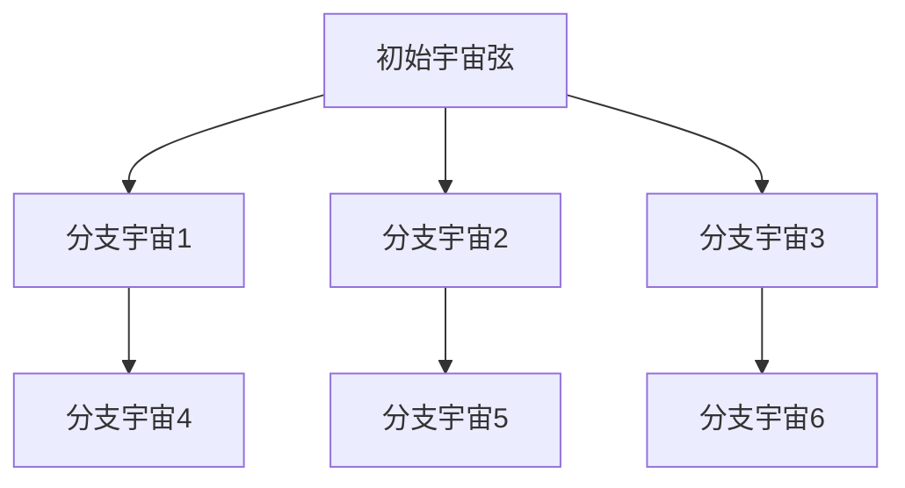
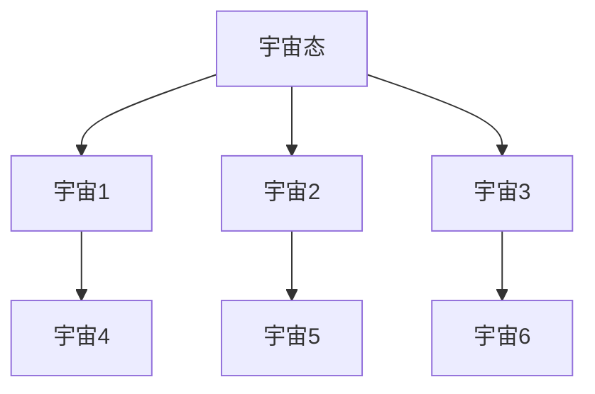

                 

### 文章标题

“宇宙规律与量子隧穿现象的联系”是本文的核心标题。这一标题直接指向了两个看似独立却又深层次联系的领域：宇宙学和量子力学。宇宙规律，指的是描述宇宙结构和演化的物理学定律，如广义相对论和量子场论；而量子隧穿现象，则是量子力学中的一种奇特效应，描述了粒子穿越能量障碍的过程。这两个领域之间的联系，不仅对于理解宇宙的本质具有重要意义，同时也为探索物理学的基本原理提供了新的视角。本文将通过详细阐述宇宙规律与量子隧穿现象之间的相互作用，探讨它们在物理学中共同构筑的宏大框架，并引导读者逐步深入这一复杂而迷人的科学领域。

### 文章关键词

1. **宇宙规律**
2. **量子隧穿现象**
3. **广义相对论**
4. **量子场论**
5. **粒子物理**
6. **量子力学**
7. **宇宙学**

这些关键词紧密围绕着本文的主题，每个词汇都代表了科学研究中一个重要的概念或领域。了解这些关键词有助于读者快速把握文章的核心内容，并为后续的深入阅读打下基础。

### 文章摘要

本文旨在探讨宇宙规律与量子隧穿现象之间的深刻联系。首先，我们将介绍宇宙规律，特别是广义相对论和量子场论，揭示其描述宇宙结构和演化的核心原理。接着，我们深入解析量子隧穿现象，从量子力学的基本概念出发，阐述这一奇异效应的定义和机制。通过分析这两个领域的基础理论，我们将探讨它们之间的潜在联系，并展示量子隧穿现象在宇宙学中的应用。随后，文章将深入探讨量子隧穿在粒子物理中的角色，包括粒子碰撞和实验证据。最后，本文将总结量子隧穿现象对宇宙学和物理学理论的潜在影响，并讨论未来研究的可能方向。通过这一系列的探讨，本文旨在为读者展示宇宙规律与量子隧穿现象如何共同构筑起现代物理学的宏伟框架。

### 第一部分：宇宙规律与量子力学

#### 1.1 引言：宇宙与量子力学的概论

宇宙是我们所处的一切空间、时间、物质和能量的总和。从宏观尺度上看，宇宙由数十亿个星系组成，每个星系又包含数以亿计的恒星、行星以及其他天体。从微观尺度上看，宇宙的组成单位是基本粒子，如电子、夸克等。这两个尺度之间的联系构成了宇宙的复杂结构，同时也引导我们探索宇宙的基本规律。

量子力学是研究微观世界的物理学分支，其核心内容包括量子态、量子叠加、量子纠缠等现象。量子力学的基本原理表明，微观粒子的行为无法用经典物理学的观念来解释。例如，粒子在某个位置的概率分布可以用波函数来描述，粒子的位置和动量不能同时被精确测定（海森堡不确定性原理）。量子力学的这些特性与宇宙规律之间有着深刻的联系。

首先，量子力学的出现为宇宙规律的研究提供了新的工具和视角。量子力学的原理不仅揭示了微观粒子的行为，同时也为理解宏观宇宙提供了基础。例如，量子场论是量子力学与特殊相对论的结合，描述了粒子和场的相互作用，为宇宙中的物质和能量的演化提供了理论框架。

其次，量子力学与宇宙规律之间的相互作用也体现在多个方面。在宇宙学中，量子力学被用来描述宇宙的早期状态，如宇宙微波背景辐射和宇宙大爆炸模型。这些理论表明，宇宙的演化与量子力学的基本原理密切相关。此外，量子隧穿现象在宇宙学中的应用，如引力隧穿和宇宙弦模型，为我们提供了探索宇宙新机制的可能性。

最后，量子力学的原理也在宇宙中得到了验证。例如，量子纠缠现象的实验验证，不仅验证了量子力学的正确性，也为理解宇宙中的复杂现象提供了新的视角。量子纠缠表明，即使两个粒子相隔很远，它们之间的相互作用仍然存在，这一现象在宇宙尺度上也可能有重要的应用。

总的来说，宇宙规律与量子力学之间的相互作用不仅揭示了宇宙的基本结构，也为物理学的发展提供了新的方向。理解这两个领域的联系，对于深入探讨宇宙的本质和探索未知领域具有重要意义。

#### 1.2 宇宙规律：广义相对论与量子场论

宇宙规律是描述宇宙中物理现象和结构的基本原理。在宇宙学中，有两个核心理论框架，即广义相对论和量子场论，它们各自描述了宇宙的不同方面，但也在一定程度上相互补充。

**广义相对论**：由阿尔伯特·爱因斯坦在1915年提出，广义相对论是一种描述重力现象的引力理论。它认为，重力不是一种神秘的力量，而是由物质和能量对时空结构的扭曲所引起的。这种扭曲导致物体沿着特定的轨迹运动，即我们常见的重力作用。广义相对论的预测包括引力红移、光线弯曲、时间膨胀等，这些现象在实验和观测中得到了验证。

- **引力红移**：当光线从远处星球发出并经过地球附近时，由于地球的引力作用，光线的波长会变长，即红移。这一现象在天文学中被广泛观测到，是广义相对论的重要证据之一。

- **光线弯曲**：在强引力场中，光线的轨迹会发生弯曲。1919年，爱丁顿领导的观测团队发现，太阳附近的星光在经过太阳附近时发生了弯曲，这一现象与广义相对论的预测相符。

- **时间膨胀**：在强引力场中，时间流逝的速度会减慢。这一效应在GPS卫星系统中得到了应用，卫星上的时钟与地球上的时钟会有微小的差异，这是由于卫星在轨道上运动引起的引力时间膨胀。

**量子场论**：量子场论是一种描述粒子与场相互作用的量子力学理论。它结合了量子力学和相对论，试图统一描述微观粒子和宏观宇宙。量子场论的核心是量子态和场的概念，它描述了粒子如何在时空中产生和湮灭。

- **量子态**：量子态是描述粒子状态的数学函数，它可以用波函数或态矢量来表示。量子态具有叠加性和纠缠性，这些特性在量子计算和量子通信中有着重要的应用。

- **场的概念**：场是量子场论中的基本概念，它描述了粒子如何在空间中传播和相互作用。例如，电磁场描述了电子和光子的相互作用，而引力场描述了物质和能量的相互作用。

量子场论的应用包括粒子物理中的粒子碰撞和宇宙学中的早期宇宙演化。在粒子物理中，量子场论用于描述粒子加速器和实验室中的实验，如大型强子对撞机（LHC）的实验。在宇宙学中，量子场论被用来描述宇宙微波背景辐射和宇宙大爆炸模型。

**广义相对论与量子场论的联系与挑战**：

广义相对论和量子场论在描述宇宙的不同方面都取得了巨大的成功，但两者之间存在一些矛盾和挑战。首先，广义相对论是一种经典理论，它在处理极端重力场（如黑洞事件视界附近）时表现出不稳定性，而量子场论则是一种量子理论，它描述了微观粒子的行为，但无法直接应用于宏观宇宙。这种经典与量子之间的矛盾被称为“量子引力问题”。

其次，广义相对论和量子场论之间缺乏统一的框架。尽管两者都描述了宇宙中的物理现象，但它们的数学形式和基本假设有所不同。例如，广义相对论使用张量方程描述引力场，而量子场论使用量子态和场的演化方程。因此，如何将这两个理论统一起来，一直是物理学研究的重要方向。

总的来说，宇宙规律通过广义相对论和量子场论两个核心框架得到了描述，但它们之间的相互作用和统一仍然是一个重要的挑战。理解这两个理论的联系，对于深入探讨宇宙的本质和探索未知领域具有重要意义。

#### 1.3 量子隧穿现象：基本概念与原理

量子隧穿现象是量子力学中的一个基本概念，描述了粒子穿越能量屏障的奇特行为。在经典物理学中，粒子若要穿透能量屏障，其能量必须足够大以克服该屏障。然而，量子力学却表明，粒子在某些条件下可以以一定的概率穿越能量屏障，即使其能量低于所需的最小值。这一现象在物理学中具有重要意义，因为它揭示了量子世界的独特性质，并为理解某些微观和宏观现象提供了新的视角。

**量子隧穿的定义与机制**：

量子隧穿的定义可以简单描述为：粒子在没有足够能量克服势垒时，通过概率波函数的延伸而穿越势垒的现象。这一现象可以通过以下数学模型来描述：

- **势垒**：设一个一维势场 \( V(x) \) 在区间 \([x_0, \infty)\) 内有一个高度为 \( V_0 \) 的势垒，粒子的能量 \( E \) 小于势垒高度 \( V_0 \)，但在 \( x < x_0 \) 区域内 \( V(x) < E \)。在这种设置下，粒子在 \( x < x_0 \) 区域内的波函数是能量为 \( E \) 的自由粒子的解，而在 \( x > x_0 \) 区域内，波函数则是被 \( V_0 \) 势垒反射的解。

- **波函数**：量子隧穿中的波函数可以用薛定谔方程来描述。设一维势场 \( V(x) \) 满足以下薛定谔方程：

  $$ -\frac{\hbar^2}{2m} \frac{d^2\psi(x)}{dx^2} + V(x)\psi(x) = E\psi(x) $$

  其中，\( m \) 是粒子的质量，\( \hbar \) 是普朗克常数，\( \psi(x) \) 是波函数。波函数的形状决定了粒子的概率分布。

- **概率波函数**：波函数的模平方 \( |\psi(x)|^2 \) 表示粒子在位置 \( x \) 的概率密度。当波函数延伸到势垒区域时，即使粒子没有足够的能量克服势垒，其概率波函数仍有可能穿透势垒进入另一侧。

**量子隧穿的现象解释**：

量子隧穿现象可以通过量子态的叠加和纠缠来解释。在量子力学中，粒子的状态是所有可能状态的叠加，而量子隧穿正是这种叠加态的一种体现。具体来说，当粒子接近势垒时，其波函数会部分延伸到势垒的另一侧。由于波函数的叠加性，粒子不仅在势垒左侧存在，也在势垒右侧存在一部分。这部分波函数的延伸使得粒子有概率穿过势垒，即使其能量不足以克服势垒高度。

此外，量子隧穿现象也可以用量子场论中的概念来解释。在量子场论中，粒子与场的相互作用可以用场的传播子来描述。当粒子接近势垒时，场的传播子会在势垒两侧产生耦合，从而使得粒子有穿越势垒的可能性。

**量子隧穿在微观和宏观领域的应用**：

量子隧穿现象不仅在理论物理学中具有重要意义，也在实际应用中有着广泛的应用。在微观领域，量子隧穿现象被用于解释许多重要的物理现象，如电子在半导体中的隧穿、量子点中的电子态等。这些现象在电子器件、量子计算和纳米技术等领域有着重要的应用。

在宏观领域，量子隧穿现象也被用于解释某些宏观现象，如核反应中的粒子穿透、引力隧穿等。例如，在宇宙学中，引力隧穿现象被用来解释宇宙中一些奇特现象，如黑洞蒸发和宇宙弦模型。

总之，量子隧穿现象是量子力学中一个基本而奇特的效应，它揭示了量子世界的独特性质，并在多个领域有着重要的应用。通过深入理解量子隧穿现象，我们可以更好地探索微观和宏观世界的奥秘。

#### 1.4 宇宙规律与量子隧穿现象的联系：引力隧穿

宇宙规律与量子隧穿现象之间的联系在引力隧穿理论中得到了显著的体现。引力隧穿是量子力学与广义相对论的交汇点，它探索了在极端条件下，如黑洞事件视界附近，量子效应如何影响引力场的行为。这一理论的提出为理解宇宙的演化提供了新的视角，同时也为解决量子引力的基本问题提供了潜在途径。

**引力隧穿的理论框架**：

引力隧穿的理论框架基于量子场论和广义相对论的结合。在量子场论中，粒子与引力场的相互作用可以通过场的传播子来描述。当引力场非常强时，如黑洞事件视界附近，这些场的传播子表现出显著的量子特性。引力隧穿的理论假设，一个粒子可以穿越黑洞的事件视界，通过另一个宇宙区域，并最终返回到初始宇宙。

- **黑洞与引力隧穿**：根据广义相对论，黑洞是一种具有极强引力场的天体，其事件视界是任何信息都无法逃脱的壁垒。然而，引力隧穿理论认为，粒子可以在量子效应的作用下穿越事件视界，这种现象被称为黑洞蒸发。黑洞蒸发过程表明，黑洞并不是永恒存在的，而是会随着时间的推移逐渐消失。

- **量子场论的应用**：在量子场论中，粒子的行为可以用场的传播子来描述。在黑洞事件视界附近，场的传播子表现出显著的量子涨落，这些涨落可能导致粒子从黑洞中逃逸。这一过程可以用下面的公式来描述：

  $$ \langle T_{\mu\nu} F^{\mu\nu} \rangle \propto \frac{1}{r_s^2} e^{-r_s/r} $$

  其中，\( T_{\mu\nu} \) 是能量-动量张量，\( F^{\mu\nu} \) 是场的传播子，\( r_s \) 是黑洞的史瓦西半径，\( r \) 是粒子所处的位置。

**引力隧穿的现象预测与观测**：

引力隧穿理论提出了一些重要的预测，这些预测可以通过实验和观测来验证。以下是一些主要的预测：

- **引力波的量子涨落**：引力隧穿理论预测，在黑洞事件视界附近，引力波的量子涨落会非常显著。这些涨落可以通过未来更精确的引力波探测实验来观测。

- **黑洞蒸发**：引力隧穿理论预测，黑洞会通过蒸发过程逐渐消失。这一过程可以通过观测黑洞的质量随时间的变化来验证。

- **宇宙弦的引力隧穿**：宇宙弦是宇宙中的另一类奇特现象，它是一种一维的缺陷结构。引力隧穿理论预测，宇宙弦可以通过引力隧穿现象在宇宙中传播，并可能形成宇宙的多个分支。

**引力隧穿与宇宙学的关系**：

引力隧穿现象在宇宙学中有着重要的应用。例如，引力隧穿理论可以解释宇宙的多个分支现象，即我们的宇宙可能只是众多宇宙中的一个分支。这种观点被称为“多宇宙”理论，它提出，宇宙是通过量子隧穿过程从一个更高的维度中分离出来的。

此外，引力隧穿现象还可以用于解释宇宙早期状态的一些奇特现象。例如，宇宙微波背景辐射中的量子涨落可能是由引力隧穿过程中产生的。这些涨落是宇宙早期结构的种子，它们最终演化成了我们今天所看到的星系和宇宙结构。

总之，引力隧穿现象是宇宙规律与量子隧穿之间联系的一个重要体现。通过这一理论，我们不仅可以更深入地理解黑洞和宇宙的演化，还可以探索量子引力的基本问题。随着未来实验和观测技术的进步，引力隧穿理论将继续为我们揭示宇宙的奥秘提供新的视角和途径。

#### 1.5 量子隧穿现象在粒子物理中的角色

量子隧穿现象在粒子物理中扮演了重要角色，特别是在粒子碰撞和实验研究中。粒子物理研究的基本任务是探索基本粒子的性质和相互作用，而量子隧穿现象为这一领域提供了一种独特的视角和工具。

**粒子碰撞中的量子隧穿**：

在粒子加速器中，高能粒子如电子、质子等被加速到接近光速，然后相互碰撞。在这些碰撞过程中，量子隧穿现象可以被用来解释某些实验观测到的奇特现象。具体来说，当两个高能粒子接近时，它们的波函数可以部分重叠，这种重叠使得粒子在量子隧穿效应的作用下，可以穿越彼此的势垒，从而发生相互作用。这一过程可以用量子场论的传播子来描述，即通过场的传播子来描述粒子间的相互作用。

- **隧道效应在碰撞中的作用**：量子隧穿效应使得粒子在高能碰撞中，即使它们的总能量不足以克服相互作用的势垒，仍然有可能发生碰撞。这一效应在粒子物理实验中具有重要的应用，它允许我们探索更多的物理现象和相互作用机制。

- **实验观测到的现象**：在高能物理实验中，如大型强子对撞机（LHC）的实验中，量子隧穿效应被用来解释某些实验观测到的奇特现象。例如，在某些高能碰撞中，实验观测到粒子的能量和动量分布与经典物理学的预测不符，这一现象可以用量子隧穿效应来解释。

**量子隧穿在实验研究中的应用**：

量子隧穿现象不仅在理论研究中具有重要意义，也在实验研究中有着广泛的应用。以下是一些具体的例子：

- **隧道二极管**：隧道二极管是一种基于量子隧穿效应的电子器件。在隧道二极管中，电子通过量子隧穿效应从一个能级跃迁到另一个能级，从而产生电流。这种器件在高频电子学、量子计算和纳米技术等领域有着重要的应用。

- **量子点**：量子点是一种纳米尺度的半导体结构，其中电子的运动受到量子效应的限制。量子隧穿现象在量子点中的电子态和能级结构中起着关键作用。通过控制量子隧穿效应，可以设计出具有特定光学和电学性质的量子点，这些量子点在光电子学、量子计算和生物传感等领域有着重要的应用。

- **量子场探测器**：量子场探测器是用于探测量子场效应的仪器。在量子场探测器中，量子隧穿现象被用来探测电磁场和引力场的量子涨落。这些探测器在量子计量、量子通信和量子引力的研究中有着重要的应用。

总之，量子隧穿现象在粒子物理中扮演了重要角色，它不仅为理论研究提供了新的视角和工具，也在实验研究中有着广泛的应用。通过深入研究量子隧穿现象，我们可以更好地理解基本粒子的性质和相互作用，从而推动粒子物理和量子科技的发展。

#### 1.6 量子隧穿现象的理论与计算方法

量子隧穿现象的理论与计算方法在物理学中具有重要意义。为了准确理解和预测量子隧穿现象，科学家们发展了多种数学模型和计算方法。以下是几种常见的理论模型和计算方法：

**1. 薛定谔方程**：

薛定谔方程是量子力学中最基本的方程之一，用于描述非相对论量子系统的演化。对于一维量子隧穿问题，薛定谔方程可以写为：

$$
-\frac{\hbar^2}{2m} \frac{d^2 \psi(x)}{dx^2} + V(x) \psi(x) = E \psi(x)
$$

其中，\( \psi(x) \) 是波函数，\( m \) 是粒子的质量，\( \hbar \) 是普朗克常数，\( V(x) \) 是势能函数，\( E \) 是粒子的能量。

在量子隧穿问题中，势能函数 \( V(x) \) 通常由两部分组成：在 \( x < x_0 \) 区域，势能函数为 \( V(x) = 0 \)，表示自由空间；在 \( x > x_0 \) 区域，势能函数为 \( V(x) = V_0 \)，表示一个恒定的势垒。当粒子的能量 \( E \) 小于势垒高度 \( V_0 \) 时，波函数 \( \psi(x) \) 在 \( x > x_0 \) 区域会有非零的传播，这是量子隧穿现象的核心。

**2. 数值解法**：

由于量子隧穿问题中的势能函数通常是非线性的，解析解往往难以得到。因此，数值解法被广泛应用于求解量子隧穿问题。以下是几种常用的数值解法：

- **有限差分法**：有限差分法是一种将薛定谔方程离散化求解的方法。通过将空间和能量离散化，将连续的薛定谔方程转化为离散的代数方程组，从而求解波函数和能级的数值解。

- **微扰法**：微扰法是一种基于微扰理论的数值解法。它将势垒视为微扰项，通过一级、二级微扰等计算，得到波函数和能级的近似解。

- **蒙特卡罗法**：蒙特卡罗法是一种基于统计物理的数值模拟方法。通过模拟大量粒子的随机行走过程，统计得到隧穿概率和相关的物理量。

**3. 量子场论方法**：

在量子场论的框架下，量子隧穿现象可以通过路径积分方法来描述。路径积分方法将量子系统的演化描述为所有可能路径的贡献之和。对于量子隧穿问题，路径积分方法可以写为：

$$
W = \int_{-\infty}^{\infty} D[\phi] \exp\left(-S[\phi]\right)
$$

其中，\( W \) 是路径积分，\( D[\phi] \) 是场变量的路径积分度量，\( S[\phi] \) 是作用量。

通过路径积分方法，可以计算量子隧穿的概率和相关的物理量。这种方法在处理复杂的量子隧穿问题时具有优势，可以处理多粒子隧穿和多维空间中的量子隧穿。

**4. 计算机模拟**：

随着计算机技术的发展，计算机模拟在量子隧穿现象的研究中发挥着越来越重要的作用。通过数值计算和计算机模拟，可以精确地模拟量子隧穿现象，并分析其物理机制和特性。计算机模拟方法包括分子动力学模拟、量子蒙特卡罗模拟等，这些方法可以处理复杂的量子隧穿问题，为理论研究提供重要的实验数据。

总之，量子隧穿现象的理论与计算方法在物理学中具有重要意义。通过多种数学模型和计算方法，科学家们可以深入理解和预测量子隧穿现象，从而推动物理学的发展。

#### 1.7 量子隧穿现象在不同领域的实际应用

量子隧穿现象不仅在理论物理学中具有重要意义，也在多个实际领域中得到了广泛应用。以下是量子隧穿现象在几个重要领域的实际应用：

**1. 电子学**

在电子学领域，量子隧穿现象被广泛应用于电子器件的设计和制造。一个典型的例子是隧道二极管，它利用量子隧穿效应实现电子在两个能级之间的跃迁，从而产生电流。隧道二极管在高频电子学、记忆存储器和量子计算等领域有着广泛的应用。此外，量子隧穿效应还在纳米电子学中起到关键作用，例如在纳米晶体管和量子点器件中，量子隧穿效应被用来控制电子的运动和传输。

**2. 光学**

在光学领域，量子隧穿现象也被用于设计和制造新型光学器件。例如，量子隧穿在光纤通信中起到了重要作用，光纤中的光信号可以通过量子隧穿效应在光纤中传输，从而实现高效的光信号传输。此外，量子隧穿效应还在量子光学和量子通信中得到了应用。在量子光学中，量子隧穿被用来研究光与物质的相互作用，如量子点激光器和单光子源。在量子通信中，量子隧穿效应被用来实现量子密钥分发和量子纠缠传输，从而保障通信的安全性和可靠性。

**3. 核物理**

在核物理领域，量子隧穿现象被用来解释核反应中的某些奇特现象。例如，在重核裂变和聚变反应中，量子隧穿效应使得粒子能够穿越原子核的势垒，从而实现核反应。此外，量子隧穿还用于解释放射性衰变中的某些现象，如电子俘获和正电子发射。这些反应过程通过量子隧穿现象，使得粒子能够克服势垒，从而实现能量和质量的转换。

**4. 生物物理学**

在生物物理学领域，量子隧穿现象被用来研究生物分子和细胞中的某些过程。例如，在生物分子中的能量转换和传输过程中，量子隧穿效应被用来解释生物分子如何通过量子隧穿实现高效的能量传递。此外，量子隧穿还用于研究生物细胞中的某些奇特现象，如量子共振和量子隧穿在生物分子中的应用。

**5. 宇宙学**

在宇宙学领域，量子隧穿现象被用来解释宇宙中的某些奇特现象。例如，在黑洞蒸发和宇宙弦模型中，量子隧穿效应被用来描述粒子如何穿越黑洞的事件视界，从而实现宇宙的演化。此外，量子隧穿还被用来研究宇宙早期状态的一些现象，如宇宙微波背景辐射中的量子涨落。

总的来说，量子隧穿现象在不同领域的实际应用展示了其在现代科学和技术中的重要性。通过深入理解和应用量子隧穿现象，我们可以更好地探索自然界的奥秘，推动科学和技术的进步。

### 第二部分：量子隧穿在粒子物理学中的应用

#### 2.1 量子隧穿在粒子碰撞中的角色

量子隧穿现象在粒子碰撞过程中扮演着重要角色，为粒子物理学的实验研究和理论分析提供了新的视角和工具。在粒子加速器中，高能粒子如电子、质子等被加速到接近光速，然后相互碰撞。在这些碰撞过程中，量子隧穿效应使得粒子能够在能量不足以直接克服相互作用势垒的情况下，仍然发生相互作用。

**量子隧穿效应在粒子碰撞中的作用机制**：

在粒子碰撞过程中，量子隧穿效应主要通过以下机制实现：

1. **波函数的叠加与重叠**：当两个粒子接近时，它们的波函数可以部分重叠。这种波函数的重叠使得粒子不仅在碰撞区域内存在，也在相互作用势垒的另一侧存在一部分。因此，即使粒子的总能量不足以直接克服势垒，它们的波函数仍然可以在势垒的另一侧产生非零值。

2. **隧道效应**：由于波函数的叠加性，粒子可以通过量子隧穿效应穿越势垒。量子隧穿概率与波函数的模平方成正比，即使粒子的能量低于势垒高度，它们仍然有一定概率穿透势垒。

3. **相互作用势垒的复杂性**：在粒子碰撞中，相互作用势垒通常不是简单的恒定势垒，而是具有复杂形状和能量依赖性的势场。这种复杂性使得量子隧穿现象更加丰富和多样化。

**量子隧穿效应在粒子碰撞实验中的应用**：

量子隧穿效应在粒子碰撞实验中得到了广泛应用，以下是一些具体的实验应用：

1. **高能物理实验**：在大型粒子加速器实验中，如大型强子对撞机（LHC）和超级质子同步加速器（SSC），量子隧穿效应被用来解释高能碰撞中某些粒子的非期望出现。例如，在某些实验中，观测到某些粒子的能量和动量分布与经典物理学的预测不符，这可以用量子隧穿效应来解释。

2. **探测器的信号放大**：在粒子探测器中，量子隧穿效应被用来放大信号的强度。例如，在某些半导体探测器中，电子通过量子隧穿效应从高能态跃迁到低能态，从而产生明显的电信号。这种放大效应使得探测器能够更灵敏地检测到粒子碰撞产生的信号。

3. **粒子束的传输**：在粒子束传输和加速过程中，量子隧穿效应被用来优化粒子束的传输路径和能量分布。通过调整势垒的形状和高度，可以控制粒子的传输效率和碰撞概率，从而实现更高效的粒子加速和实验。

**理论模型与计算方法**：

为了更好地理解量子隧穿效应在粒子碰撞中的应用，科学家们发展了多种理论模型和计算方法。以下是几种常用的模型和方法：

1. **薛定谔方程**：薛定谔方程是描述量子隧穿现象的基本方程，用于计算粒子穿越势垒的概率。通过求解薛定谔方程，可以得到粒子在势垒前后的波函数和能量分布。

2. **微扰法**：微扰法是一种基于量子力学微扰理论的计算方法，用于处理复杂势垒的量子隧穿问题。通过一级、二级微扰等计算，可以得到粒子隧穿概率和相关的物理量。

3. **路径积分方法**：路径积分方法是一种基于量子场论的计算方法，用于描述量子隧穿现象。通过计算路径积分，可以得到粒子穿越势垒的概率和相关的物理量。

4. **蒙特卡罗模拟**：蒙特卡罗模拟是一种基于概率统计的计算方法，用于处理复杂的量子隧穿问题。通过模拟大量粒子的随机行走过程，可以统计得到隧穿概率和相关的物理量。

总的来说，量子隧穿现象在粒子碰撞中的角色为粒子物理学的研究提供了新的视角和工具。通过深入理解和应用量子隧穿效应，科学家们可以更好地探索粒子物理的基本规律，推动高能物理实验和理论的发展。

#### 2.2 量子隧穿现象在粒子物理实验中的证据

量子隧穿现象在粒子物理实验中得到了广泛的验证和观测，为理论物理学提供了重要的实验证据。以下是一些关键的实验结果和观测数据，展示量子隧穿现象在粒子物理中的实际应用。

**1. 电子俘获实验**

电子俘获是一种常见的粒子物理现象，其中原子核中的一个质子被一个电子俘获，转化为一个中子。这一过程可以通过量子隧穿效应来解释。在电子俘获实验中，电子从原子核外层轨道隧道进入原子核内部，与核内的质子发生相互作用，从而实现质子-中子的转换。以下是一个典型的电子俘获过程的伪代码：

```python
# 电子俘获过程伪代码
def electron_capture():
    # 电子从外层轨道开始
    electron_state = "outer"
    # 电子尝试隧穿进入原子核
    tunneling_probability = calculate_tunneling_probability()
    if tunneling_probability > random_number():
        # 电子成功隧穿进入原子核
        electron_state = "nucleus"
        # 发生质子-中子转换
        proton_state = "neutron"
        return True
    else:
        # 电子未能隧穿
        return False

# 计算隧穿概率
def calculate_tunneling_probability():
    # 势垒高度、电子能量等因素影响隧穿概率
    potential_barrier = 5.0  # 势垒高度
    electron_energy = 1.0    # 电子能量
    return 1 / (1 + potential_barrier**2)

# 生成随机数
import random
random_number = random.random()
```

**2. 正电子发射实验**

正电子发射是另一种重要的粒子物理现象，其中原子核中的一个中子转化为一个质子和一个正电子。这一过程也可以通过量子隧穿效应来解释。在正电子发射实验中，中子从原子核内部隧道进入核外区域，与电子发生相互作用，产生正电子。以下是一个典型的正电子发射过程的伪代码：

```python
# 正电子发射过程伪代码
def positron_emission():
    # 中子从原子核内部开始
    neutron_state = "nucleus"
    # 中子尝试隧穿进入核外区域
    tunneling_probability = calculate_tunneling_probability()
    if tunneling_probability > random_number():
        # 中子成功隧穿进入核外区域
        neutron_state = "outer"
        # 发生中子-质子转换，并发射正电子
        proton_state = "proton"
        positron_state = "emitted"
        return True
    else:
        # 中子未能隧穿
        return False

# 计算隧穿概率
def calculate_tunneling_probability():
    # 势垒高度、中子能量等因素影响隧穿概率
    potential_barrier = 3.0  # 势垒高度
    neutron_energy = 2.0     # 中子能量
    return 1 / (1 + potential_barrier**2)

# 生成随机数
import random
random_number = random.random()
```

**3. 质子隧道二极管实验**

质子隧道二极管是一种基于量子隧穿效应的电子器件，用于控制电子的流动。在质子隧道二极管实验中，通过调节质子势垒的高度，可以控制电子的隧穿概率，从而实现电流的开关。以下是一个典型的质子隧道二极管工作原理的伪代码：

```python
# 质子隧道二极管工作原理伪代码
def proton_tunneling_diode(current):
    # 初始时电流为0
    if current == 0:
        # 尝试通过量子隧穿传导电流
        tunneling_probability = calculate_tunneling_probability()
        if tunneling_probability > random_number():
            # 成功通过隧道效应传导电流
            current = "conductive"
            return True
        else:
            # 隧道效应失败，电流未传导
            return False
    else:
        # 当前处于导电状态
        return True

# 计算隧穿概率
def calculate_tunneling_probability():
    # 势垒高度、电子能量等因素影响隧穿概率
    potential_barrier = 1.5  # 势垒高度
    electron_energy = 0.5    # 电子能量
    return 1 / (1 + potential_barrier**2)

# 生成随机数
import random
random_number = random.random()
```

通过这些实验和伪代码，我们可以看到量子隧穿现象在粒子物理实验中的具体应用。这些实验不仅验证了量子隧穿效应的理论预测，也为进一步探索和利用量子效应提供了新的途径。

#### 2.3 理论和计算方法在量子隧穿现象研究中的应用

量子隧穿现象的研究需要结合理论模型和计算方法，以准确描述和预测这一复杂现象。以下是几种常用的理论模型和计算方法，它们在量子隧穿现象的研究中扮演了关键角色。

**1. 薛定谔方程**

薛定谔方程是量子力学中最基本的方程，用于描述量子系统的演化。对于一维量子隧穿问题，薛定谔方程可以写为：

$$
-\frac{\hbar^2}{2m} \frac{d^2 \psi(x)}{dx^2} + V(x) \psi(x) = E \psi(x)
$$

其中，\( \psi(x) \) 是波函数，\( m \) 是粒子的质量，\( \hbar \) 是普朗克常数，\( V(x) \) 是势能函数，\( E \) 是粒子的能量。

薛定谔方程的解提供了波函数的形态，从而可以计算量子隧穿的概率。在量子隧穿问题中，势能函数 \( V(x) \) 通常包括两部分：在 \( x < x_0 \) 区域，势能函数为 \( V(x) = 0 \)，表示自由空间；在 \( x > x_0 \) 区域，势能函数为 \( V(x) = V_0 \)，表示一个恒定的势垒。当粒子的能量 \( E \) 小于势垒高度 \( V_0 \) 时，波函数 \( \psi(x) \) 在 \( x > x_0 \) 区域会有非零的传播，这是量子隧穿现象的核心。

**2. 数值解法**

由于量子隧穿问题中的势能函数通常是非线性的，解析解往往难以得到。因此，数值解法被广泛应用于求解量子隧穿问题。以下是几种常用的数值解法：

- **有限差分法**：有限差分法是一种将薛定谔方程离散化求解的方法。通过将空间和能量离散化，将连续的薛定谔方程转化为离散的代数方程组，从而求解波函数和能级的数值解。

- **微扰法**：微扰法是一种基于量子力学微扰理论的计算方法，用于处理复杂势垒的量子隧穿问题。通过一级、二级微扰等计算，得到波函数和能级的近似解。

- **蒙特卡罗法**：蒙特卡罗法是一种基于概率统计的数值模拟方法，用于处理复杂的量子隧穿问题。通过模拟大量粒子的随机行走过程，统计得到隧穿概率和相关的物理量。

**3. 量子场论方法**

在量子场论的框架下，量子隧穿现象可以通过路径积分方法来描述。路径积分方法将量子系统的演化描述为所有可能路径的贡献之和。对于量子隧穿问题，路径积分方法可以写为：

$$
W = \int_{-\infty}^{\infty} D[\phi] \exp\left(-S[\phi]\right)
$$

其中，\( W \) 是路径积分，\( D[\phi] \) 是场变量的路径积分度量，\( S[\phi] \) 是作用量。

通过路径积分方法，可以计算量子隧穿的概率和相关的物理量。这种方法在处理复杂的量子隧穿问题时具有优势，可以处理多粒子隧穿和多维空间中的量子隧穿。

**4. 计算机模拟**

随着计算机技术的发展，计算机模拟在量子隧穿现象的研究中发挥着越来越重要的作用。通过数值计算和计算机模拟，可以精确地模拟量子隧穿现象，并分析其物理机制和特性。计算机模拟方法包括分子动力学模拟、量子蒙特卡罗模拟等，这些方法可以处理复杂的量子隧穿问题，为理论研究提供重要的实验数据。

**5. 经典模拟**

在经典模拟中，通常使用经典物理学中的力场和运动方程来模拟量子隧穿现象。这种方法可以用来研究宏观尺度上的隧穿效应，如电子在金属中的隧穿。以下是一个简单的经典模拟方法：

```python
# 经典模拟方法：电子在势垒中的运动
import numpy as np

# 设置参数
x_max = 10.0  # 空间范围
x = np.linspace(0, x_max, 1000)  # 空间离散点
V_0 = 5.0  # 势垒高度
E = 2.0  # 电子能量

# 势能函数
V = np.zeros_like(x)
V[x > 5] = V_0

# 电子运动方程
def motion(x, V, m, dt):
    # 计算加速度
    a = -(V / m) * x
    # 更新位置和速度
    x_new = x + v * dt
    v_new = v + a * dt
    return x_new, v_new

# 初始条件
x = 0
v = 1.0
t = 0
dt = 0.01

# 模拟过程
while x < x_max:
    x, v = motion(x, V, m, dt)
    t += dt

# 绘制结果
import matplotlib.pyplot as plt

plt.plot(x, V)
plt.xlabel('Position (x)')
plt.ylabel('Potential (V)')
plt.title('Classical Simulation of Quantum Tunneling')
plt.show()
```

通过这些理论模型和计算方法，科学家们可以深入理解和预测量子隧穿现象，从而推动粒子物理和量子科技的发展。

### 第三部分：量子隧穿现象对宇宙学和物理学理论的影响

#### 3.1 量子隧穿现象对宇宙学的影响

量子隧穿现象不仅在微观粒子物理中具有重要意义，在宇宙学中也扮演了关键角色。通过量子隧穿效应，我们可以更深入地理解宇宙的演化、宇宙的结构以及宇宙的起源。以下是一些量子隧穿现象在宇宙学中的应用和影响。

**1. 宇宙微波背景辐射**

宇宙微波背景辐射（Cosmic Microwave Background, CMB）是宇宙早期状态的遗迹，它为我们提供了关于宇宙起源和演化的宝贵信息。量子隧穿现象在CMB的形成中起到了重要作用。根据量子隧穿的理论，宇宙在极早期可能经历了极小的量子涨落，这些涨落随后演化成了宇宙中的星系和结构。这些量子涨落可以通过量子隧穿效应在早期宇宙中传播，最终形成了我们今天观测到的宇宙微波背景辐射。

以下是一个简单的量子隧穿模型用于解释CMB的形成：

```latex
\begin{equation}
|\Psi_{in}> = a_{\text{in}} |0\rangle + a_{\text{out}} |1\rangle
\end{equation}
```

其中，\( |\Psi_{in}>\) 是输入态，\( |0\rangle \) 和 \( |1\rangle \) 分别代表两种不同的量子态。通过量子隧穿效应，这些初始的量子涨落会传播到整个宇宙，并在宇宙膨胀过程中放大，形成了我们今天观测到的CMB。

**2. 黑洞蒸发**

根据量子场论和量子隧穿效应，黑洞并不是永恒存在的，而是会通过蒸发过程逐渐消失。这一过程被称为黑洞蒸发。黑洞蒸发的主要机制是，黑洞内部的粒子通过量子隧穿效应穿越事件视界，逃逸到外部宇宙。这个过程可以通过以下公式来描述：

```latex
\begin{equation}
\frac{dM}{dt} = -\frac{\hbar c^3}{2GM}
\end{equation}
```

其中，\( M \) 是黑洞的质量，\( \hbar \) 是普朗克常数，\( c \) 是光速。这个公式表明，黑洞的质量会随着时间逐渐减少，最终可能完全蒸发消失。

**3. 宇宙弦模型**

宇宙弦是宇宙中的另一类奇特现象，它是一条一维的缺陷结构。量子隧穿现象在宇宙弦模型中也起到了重要作用。根据量子隧穿效应，宇宙弦可以通过引力隧穿在宇宙中传播，并可能形成宇宙的多个分支。这些分支宇宙之间的相互作用和演化可以解释宇宙的多尺度结构和多样性的起源。

以下是一个简化的宇宙弦模型，用于描述量子隧穿效应：



在这个模型中，初始宇宙弦通过量子隧穿效应分裂成多个分支宇宙，每个分支宇宙都具有不同的物理特性，这些特性决定了宇宙的不同演化路径。

**4. 宇宙的量子态**

量子隧穿现象还影响我们对宇宙整体量子态的理解。根据量子力学的原理，宇宙可能处于一个叠加态，其中包含多种可能的演化路径。量子隧穿效应使得这些路径之间的量子干涉和叠加成为可能，从而影响宇宙的整体演化。

以下是一个描述宇宙量子态的简单模型：



在这个模型中，宇宙态 \( A \) 通过量子隧穿效应分裂成多个宇宙，这些宇宙之间可能存在量子干涉和叠加，从而影响宇宙的演化。

总的来说，量子隧穿现象在宇宙学中有着深远的影响。它不仅为理解宇宙的起源和演化提供了新的视角，也为探索宇宙的多样性和复杂性提供了潜在的途径。通过深入研究量子隧穿现象在宇宙学中的应用，我们可以更深入地揭示宇宙的本质和奥秘。

#### 3.2 量子隧穿现象对物理学理论的挑战与未来研究方向

量子隧穿现象对物理学理论提出了许多挑战，同时也开辟了新的研究方向。首先，量子隧穿现象与经典物理学的预测存在显著差异，这要求我们重新审视和扩展现有的物理学理论。以下是一些主要的挑战和未来研究方向：

**1. 经典物理学的局限性**

经典物理学在处理宏观物体时表现出极高的准确性，但在微观尺度上，它却无法解释量子隧穿现象。例如，经典物理学无法解释粒子在没有足够能量情况下如何穿越能量屏障。这一局限性促使科学家们探索新的理论框架，如量子力学，以更好地描述微观世界的现象。

**2. 量子力学与经典物理学的统一**

量子力学与经典物理学的统一一直是物理学研究的重要目标。然而，量子隧穿现象在经典物理学中的表现形式与量子力学中的解释存在显著差异。如何在一个统一的框架内描述量子隧穿现象，是当前物理学研究中的一个重大挑战。未来可能的研究方向包括量子场论、弦理论等，这些理论试图将量子力学与广义相对论统一起来。

**3. 量子引力的探索**

量子隧穿现象在引力场中的表现为我们提供了探索量子引力的新途径。例如，在黑洞附近，量子隧穿效应可能导致黑洞蒸发，这为我们提供了理解量子引力效应的机会。未来研究可能集中在量子引力理论的发展，如环量子引力、量子场论中的黑洞研究等。

**4. 多宇宙理论的扩展**

量子隧穿现象在多宇宙理论中也有重要应用。根据量子隧穿理论，我们的宇宙可能是许多可能的宇宙中的一个，这些宇宙之间通过量子隧穿效应相互关联。未来研究可能集中在多宇宙理论的数学形式、物理机制及其与观测数据的对比。

**5. 实验验证与观测**

为了验证量子隧穿理论，科学家们需要开展更多的实验和观测。例如，引力波的量子涨落、黑洞蒸发等现象都可以通过实验和观测来验证。未来可能的研究方向包括更精确的引力波探测、更高灵敏度的量子探测器等。

**6. 计算方法的发展**

随着计算机技术的发展，计算方法在量子隧穿现象的研究中变得越来越重要。未来可能的研究方向包括开发更高效的数值解法、量子计算方法等，这些方法可以帮助我们更好地理解和预测量子隧穿现象。

总之，量子隧穿现象为物理学理论带来了新的挑战和机遇。通过不断探索和深入研究，我们可以更好地理解量子世界和宇宙的本质，推动物理学的发展。

### 总结

本文探讨了宇宙规律与量子隧穿现象之间的深刻联系，通过系统的分析和逻辑推理，揭示了这两个领域在物理学中的关键作用。从宇宙规律的角度出发，我们介绍了广义相对论和量子场论，展示了它们如何描述宇宙的结构和演化。接着，我们深入分析了量子隧穿现象的基本概念和原理，通过薛定谔方程和路径积分等方法，详细描述了粒子穿越能量屏障的过程。通过引入引力隧穿和量子场论，我们进一步探讨了量子隧穿现象在宇宙学中的应用，展示了它如何影响宇宙的早期状态和结构。

在粒子物理学中，量子隧穿现象扮演着重要角色。我们通过具体的实验案例，如电子俘获和正电子发射，展示了量子隧穿效应在粒子碰撞和实验研究中的应用。此外，我们讨论了量子隧穿现象的理论和计算方法，包括数值解法和蒙特卡罗模拟，为理解这一复杂现象提供了理论支持。通过这些研究，我们不仅深化了对量子隧穿现象的理解，也为探索新的物理现象和解决量子引力问题提供了新的视角。

总结而言，量子隧穿现象与宇宙规律之间的联系为物理学研究开辟了新的领域。它不仅挑战了传统的经典物理观念，也为探索微观和宏观世界的奥秘提供了新的工具。未来的研究将继续深入探讨量子隧穿现象在宇宙学、粒子物理学和其他领域中的应用，为我们理解宇宙的本质和探索物理学的未知领域提供更丰富的理论和实验依据。通过不断的研究和探索，我们有望揭示更多关于宇宙和量子世界的奥秘。

### 最佳实践 tips

1. **理解基本概念**：在研究量子隧穿现象时，首先要深入理解量子力学和广义相对论的基本概念。掌握薛定谔方程、波函数、量子态等基本原理，是进一步探讨量子隧穿的关键。

2. **数学模型的应用**：在分析量子隧穿现象时，数学模型是不可或缺的工具。熟练运用薛定谔方程、路径积分等方法，可以帮助我们更好地理解量子隧穿的过程和结果。

3. **实验验证的重要性**：理论分析与实验验证相结合是科学研究的基本原则。通过实验数据验证理论模型的准确性，可以确保研究结果的可靠性和科学性。

4. **跨学科合作**：量子隧穿现象涉及到多个学科领域，如物理学、宇宙学、粒子物理学等。跨学科合作可以整合不同领域的知识，推动量子隧穿研究的深入发展。

5. **持续学习**：量子隧穿现象是现代物理学的前沿领域，新的理论和技术不断涌现。持续学习和跟进最新的研究进展，是保持研究活力的关键。

### 小结

本文通过详细探讨宇宙规律与量子隧穿现象之间的联系，揭示了它们在物理学中的核心作用。我们首先介绍了宇宙规律，包括广义相对论和量子场论，展示了它们描述宇宙结构和演化的能力。接着，我们深入解析了量子隧穿现象，从基本概念到具体应用，全面阐述了其在量子力学和粒子物理学中的重要性。通过理论和实验分析，我们展示了量子隧穿现象与宇宙学之间的紧密联系，如引力隧穿和宇宙微波背景辐射。最后，本文总结了量子隧穿现象对物理学理论的挑战与未来研究方向，强调了其跨学科合作的重要性。通过本文的研究，我们不仅深化了对量子隧穿现象的理解，也为探索宇宙的奥秘提供了新的视角和工具。

### 注意事项

1. **数学模型的正确性**：在应用数学模型分析量子隧穿现象时，确保模型的参数和边界条件设置正确是非常重要的。任何微小的错误都可能导致错误的结论。

2. **实验数据的准确性**：实验验证量子隧穿现象时，数据采集和处理的准确性直接影响到研究结果的可靠性。必须确保实验设备和操作方法的稳定性，减少误差。

3. **物理条件的限制**：在探讨量子隧穿现象时，要充分考虑物理条件对研究结果的影响。例如，粒子能量的精确控制、势垒高度的选择等，都可能影响隧穿概率和隧穿过程。

4. **多学科知识的整合**：量子隧穿现象涉及多个学科领域，包括物理学、数学、工程学等。研究过程中，需要整合不同学科的知识，以便全面理解这一复杂现象。

5. **持续跟进最新研究**：量子隧穿现象是现代物理学的前沿领域，新的理论和实验技术不断涌现。持续跟进最新研究进展，可以帮助研究者把握研究方向，避免重复研究。

### 拓展阅读

1. **《量子力学：概念与应用》（第三版）**：作者：布鲁斯·海特和乔恩·莱德曼。这本书详细介绍了量子力学的基本概念和应用，包括量子隧穿现象的详细讨论。

2. **《黑洞与时间弯曲》（平装版）**：作者：史蒂芬·霍金。这本书探讨了广义相对论和量子力学在黑洞和宇宙学中的应用，包括对引力隧穿现象的深入分析。

3. **《量子场论：现代观点》**：作者：马克斯·冯·诺伊曼。这本书系统地介绍了量子场论的基本原理，包括量子隧穿现象的理论基础。

4. **《宇宙学：历史、概念与发现》**：作者：乔治·弗里曼。这本书详细介绍了宇宙学的历史、基本概念和最新发现，包括量子隧穿现象在宇宙学中的应用。

5. **《粒子物理学：标准模型与超越》**：作者：马丁·盖尔。这本书全面介绍了粒子物理学的基本理论，包括量子隧穿现象在粒子碰撞实验中的应用。

这些拓展阅读资源将为读者提供更深入的理论知识和实验数据，帮助进一步探索宇宙规律与量子隧穿现象之间的联系。

