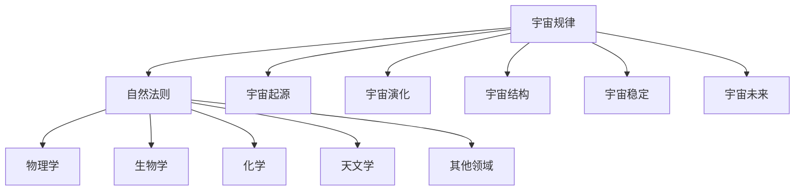

                 

### 1.3 引入

在科技迅猛发展的今天，宇宙规律与人工智能这两大领域的交叉研究已经成为了一个备受关注的热点。宇宙规律是描述宇宙中物质和能量运动、变化的法则，如大爆炸理论、量子力学等；而人工智能则是通过模拟人类智能行为，实现机器自主学习和智能决策的技术。这两者看似截然不同的领域，却在本质上有许多共通之处。

宇宙规律和人工智能的关系可以从多个层面来理解。首先，从哲学角度来看，宇宙规律与人工智能都涉及到对复杂系统的理解和模拟。宇宙中存在着无数的复杂系统，如星系、行星、黑洞等，而人工智能的目标则是通过模拟这些复杂系统，使其在特定任务上表现出类似甚至超越人类智能的行为。其次，从技术角度来看，人工智能算法的设计和优化过程中，常常需要借鉴宇宙规律中的原理和方法。

例如，量子力学中的量子叠加原理和量子纠缠现象，为人工智能中的量子计算提供了理论基础。同时，宇宙规律中的混沌理论和复杂系统理论，也为人工智能中的模式识别、数据挖掘等领域提供了重要的启示。通过将宇宙规律应用于人工智能，我们可以更好地理解智能行为的本质，设计出更高效、更鲁棒的智能系统。

因此，本书旨在探讨宇宙规律在人工智能中的应用，通过深入分析宇宙规律的核心概念和原理，结合人工智能的理论和实践，探讨两者之间的联系和相互作用。本书的目标是：
1. 梳理宇宙规律的基本概念和原理，为后续应用提供理论基础。
2. 阐述人工智能的基础知识和发展趋势，为宇宙规律在人工智能中的应用提供背景。
3. 探讨宇宙规律在人工智能中的具体应用，如算法优化、智能系统设计等。
4. 分析宇宙规律与人工智能交叉研究的潜在价值和未来发展方向。

通过本书的阅读，读者可以了解到宇宙规律与人工智能的交叉研究是如何进行的，以及这一研究如何推动人工智能的发展。这不仅有助于拓宽研究者的视野，也为人工智能的实际应用提供了新的思路和方法。

### 2.1 宇宙规律基础

#### 2.1.1 宇宙大爆炸与量子力学

宇宙大爆炸理论和量子力学是描述宇宙规律的两个重要概念，它们各自从宏观和微观的层面揭示了宇宙的本质。

**宇宙大爆炸理论**  
宇宙大爆炸理论（The Big Bang Theory）是当前宇宙学中最被广泛接受的理论，它描述了宇宙从极热、极密的状态开始膨胀的过程。根据这一理论，宇宙起源于大约138亿年前的一个“奇点”，随后开始迅速膨胀，温度和密度逐渐降低，形成了今天我们所观察到的宇宙结构。宇宙大爆炸理论的主要证据包括宇宙微波背景辐射、宇宙膨胀速度的观测、宇宙中重元素的丰度分布等。

**量子力学**  
量子力学（Quantum Mechanics）是描述微观世界物理现象的理论，它突破了经典物理学中的一些基本假设，揭示了微观粒子行为的独特规律。量子力学的核心概念包括量子叠加态、量子纠缠、波粒二象性等。量子力学的基本原理可以通过一些经典实验来理解，如双缝实验、量子纠缠实验等。

**联系与区别**  
宇宙大爆炸理论和量子力学在物理学中都有着重要的地位，它们分别从宏观和微观的层面揭示了宇宙的本质。宇宙大爆炸理论主要关注宇宙的起源和演化，试图回答宇宙是如何从一个极热、极密的状态演变成为今天的宇宙结构的。而量子力学则关注微观粒子的行为，试图解释微观世界中的各种现象。

尽管两者研究对象不同，但它们之间也存在一些联系。首先，宇宙大爆炸理论和量子力学都涉及到能量和物质的状态转换。在宇宙大爆炸理论中，宇宙从一个极热、极密的状态开始膨胀，温度和密度逐渐降低，这可以看作是一种能量和物质状态的转换。而在量子力学中，量子态之间的转换也是能量和物质状态转换的一种表现。

其次，量子力学的原理也为理解宇宙大爆炸提供了理论基础。例如，量子纠缠现象表明，即使两个粒子相距很远，它们之间的状态仍然是相互关联的。这一现象可以解释宇宙大爆炸后，宇宙迅速膨胀的过程中，物质和能量如何迅速分布到整个宇宙中。

然而，宇宙大爆炸理论和量子力学也存在一些区别。首先，宇宙大爆炸理论主要关注宇宙的宏观演化，而量子力学主要关注微观粒子的行为。其次，宇宙大爆炸理论是基于观测证据建立的，而量子力学则更多地依赖于数学模型和实验验证。

总之，宇宙大爆炸理论和量子力学各自从宏观和微观的层面揭示了宇宙的本质，它们在物理学中都有着重要的地位。通过将两者结合起来，我们可以更全面地理解宇宙的起源和演化，为探索宇宙的奥秘提供新的思路和方法。

#### 2.1.2 宇宙结构的演化与稳定性

宇宙结构的演化与稳定性是宇宙学中的重要研究课题，它涉及到宇宙从大爆炸开始，如何经过数十亿年的演化，形成了今天我们所观察到的结构。

**宇宙结构的基本概念**  
宇宙结构的基本概念包括宇宙背景辐射、星系、星系团、超星系团等。宇宙背景辐射是宇宙大爆炸后遗留下来的微波辐射，它为我们提供了关于宇宙早期的信息。星系是宇宙中最基本的结构单元，它们由大量的恒星、星云和暗物质组成。星系团是由多个星系通过引力相互作用形成的更大规模的结构，而超星系团则是由多个星系团相互作用形成的更大规模的结构。

**宇宙结构的演化过程**  
宇宙结构的演化过程可以分为几个阶段。首先，在大爆炸后的早期阶段，宇宙处于一个高度热密的态，随着宇宙的膨胀，温度和密度逐渐降低，宇宙开始进入一个辐射主导的时期。在这个时期，宇宙背景辐射形成，并且宇宙中的物质开始形成一些基本的结构单元，如原初黑洞和星系。

接着，宇宙进入了一个物质主导的时期，引力作用成为主导因素，宇宙中的物质通过引力相互作用，逐渐形成了更大的结构单元，如星系、星系团和超星系团。在这个过程中，物质在引力作用下聚集，形成了大量的恒星和星系。

最后，宇宙进入了一个成熟期，星系、星系团和超星系团等结构已经形成，并且它们之间的相互作用也变得显著。在这个时期，宇宙中的物质主要处于相对稳定的状态，但仍然存在一些局部的变化和演化。

**宇宙稳定的数学模型**  
为了描述宇宙结构的演化与稳定性，科学家们建立了一系列的数学模型。最著名的模型是广义相对论，它描述了引力作用下宇宙的时空结构。广义相对论中的关键方程是爱因斯坦场方程，它将物质和能量与引力场联系起来。

除了广义相对论，还有一些其他的数学模型，如牛顿引力定律、哈勃定律等。牛顿引力定律描述了质点之间的引力作用，它在许多情况下都能很好地描述宇宙结构的演化。哈勃定律描述了宇宙膨胀的速度与宇宙中星系的距离之间的关系，它是宇宙学中的一个重要定律。

通过这些数学模型，科学家们可以模拟宇宙结构的演化过程，预测宇宙的未来状态。然而，这些模型也存在一些局限性，如对暗物质和暗能量的描述不够准确等。因此，宇宙结构的演化与稳定性研究仍然是一个活跃的领域，科学家们正在不断探索新的理论和方法。

**宇宙规律与自然法则的联系**  
宇宙结构的演化与稳定性不仅涉及到物理现象，还涉及到自然法则。自然法则是指宇宙中普遍存在的规律，如引力、电磁力等。这些自然法则是宇宙结构演化的重要驱动力。

例如，引力是宇宙中最重要的自然法则之一，它决定了星系、星系团和超星系团的形成和演化。电磁力则决定了宇宙中物质的组成和性质，如恒星的产生和演化。通过研究宇宙结构的演化与稳定性，我们可以更深入地理解自然法则的作用和影响。

总之，宇宙结构的演化与稳定性是宇宙学中的重要课题，它涉及到宇宙从大爆炸开始，如何经过数十亿年的演化，形成了今天我们所观察到的结构。通过研究宇宙结构的演化与稳定性，我们可以更全面地理解宇宙的本质，探索宇宙的奥秘。

#### 2.1.3 宇宙规律与自然法则

宇宙规律与自然法则是宇宙学中不可或缺的两个概念，它们共同揭示了宇宙中物质和能量的行为模式。要理解宇宙规律与自然法则之间的联系，我们首先需要明确这两个概念的基本内涵。

**宇宙规律的定义**  
宇宙规律是指宇宙中普遍存在的、稳定的、可预测的自然现象和行为模式。这些规律通过物理学的理论体系得到表达和解释，如牛顿运动定律、量子力学原理、广义相对论等。宇宙规律不仅决定了宇宙的起源和演化，还影响到了宇宙中的所有物理过程。

**自然法则的定义**  
自然法则，亦称自然定律，是自然界中普遍存在并始终有效的规律。自然法则不仅包括物理定律，还包括生物学、化学、天文学等各个领域的规律。例如，生物学中的遗传法则、化学中的化学反应规律等。自然法则反映了自然界中物质和能量相互作用的基本原则。

**宇宙规律与自然法则的联系**  
宇宙规律与自然法则之间存在着密切的联系。首先，自然法则构成了宇宙规律的基础。例如，物理学中的自然法则，如电磁力、强相互作用、弱相互作用等，都是宇宙规律的重要组成部分。这些自然法则决定了宇宙中物质和能量的运动状态，进而影响了宇宙的演化过程。

其次，宇宙规律是自然法则在宇宙尺度上的具体体现。宇宙规律通过宇宙学观测数据得到了验证，如宇宙微波背景辐射、宇宙膨胀速度、星系分布等。这些观测数据表明，宇宙规律不仅适用于微观粒子，也适用于宏观宇宙。

**宇宙规律与自然法则的差异**  
尽管宇宙规律与自然法则有着紧密的联系，但它们也存在一些差异。主要表现在以下几个方面：

1. **适用范围**：自然法则通常在特定领域内适用，如电磁法则适用于电磁现象，牛顿定律适用于宏观物体。而宇宙规律则涵盖了整个宇宙的演化过程，包括从微观粒子到宏观宇宙的所有现象。

2. **层次结构**：自然法则构成了宇宙规律的基础，但宇宙规律不仅包含了自然法则，还包括宇宙整体演化的规律，如宇宙膨胀、结构形成等。

3. **研究方法**：自然法则通常通过实验和观测来验证，而宇宙规律的研究则需要更复杂的理论模型和计算方法，如广义相对论、宇宙学模型等。

**宇宙规律与自然法则的关联架构**  
为了更好地理解宇宙规律与自然法则之间的关联，我们可以借助Mermaid流程图来展示它们之间的关系：



在这个架构图中，宇宙规律（A）是核心，自然法则（B）通过不同的学科分支（C、D、E、F、G）具体表现出来。宇宙规律与宇宙起源（H）、宇宙演化（I）、宇宙结构（J）、宇宙稳定（K）和宇宙未来（L）等概念密切相关。

**实例分析**  
一个典型的实例是宇宙微波背景辐射的观测。宇宙微波背景辐射是宇宙大爆炸留下的遗迹，它的存在证明了宇宙大爆炸理论的正确性。这一观测结果不仅验证了宇宙规律，也揭示了自然法则在宇宙尺度上的应用。

通过宇宙微波背景辐射的观测，科学家们能够测量宇宙早期的温度和密度分布，进一步了解宇宙的起源和演化。这一过程不仅展示了宇宙规律的作用，也展示了自然法则在宇宙学中的重要性。

总之，宇宙规律与自然法则是理解宇宙行为的重要工具。通过深入探讨宇宙规律与自然法则之间的联系和差异，我们可以更全面地理解宇宙的奥秘，推动宇宙学和其他科学领域的发展。

### 3.1 人工智能的发展历程

人工智能（Artificial Intelligence，简称AI）作为一门交叉学科，涵盖了计算机科学、认知科学、心理学、神经科学等多个领域。其发展历程可以分为几个关键阶段，每个阶段都有重要的里程碑和突破。

**人工智能的起源**

人工智能的概念最早可以追溯到20世纪40年代和50年代。1943年，沃伦·麦卡洛克（Warren McCulloch）和沃尔特·皮茨（Walter Pitts）发表了关于人工神经网络的开创性论文，奠定了神经网络理论的基础。1949年，唐纳德·赫布（Donald Hebb）提出了赫布学习规则，为人工神经网络的学习机制提供了理论基础。

**人工智能的早期发展**

1950年，艾伦·图灵（Alan Turing）发表了著名的论文“计算机器与智能”，提出了图灵测试作为评估机器智能的标准。1956年，在达特茅斯会议上，约翰·麦卡锡（John McCarthy）、马文·明斯基（Marvin Minsky）等人首次提出了“人工智能”这一术语，并明确了人工智能研究的方向。

早期的人工智能研究主要集中在符号主义和逻辑推理上。1956年至1958年，美国斯坦福大学的人工智能研究小组开发了最早的专家系统——Dendral，它能够帮助化学家解决复杂的化学分析问题。这一成功标志着人工智能从理论阶段进入到了实际应用阶段。

**人工智能的黄金时代**

20世纪80年代，人工智能迎来了一个短暂的“黄金时代”。在这一时期，专家系统和机器学习开始得到广泛应用。专家系统是一种基于规则的人工智能程序，它能够模拟人类专家的决策过程，解决特定领域的问题。1981年，IBM的“深蓝”超级计算机击败了国际象棋世界冠军加里·卡斯帕罗夫，这一事件引起了全球的关注。

**人工智能的瓶颈期**

然而，随着时间的发展，人工智能在20世纪80年代末和90年代初遇到了瓶颈。由于符号主义方法的局限性，人工智能系统在处理复杂任务时表现不佳，这一阶段被称为“人工智能的冬天”。在这一时期，研究人员开始转向基于数据的方法，即机器学习。

**人工智能的复兴**

20世纪90年代以来，随着计算机硬件的发展、互联网的普及以及机器学习技术的突破，人工智能迎来了新的复兴。1997年，“深蓝”超级计算机再次引起关注，这次它击败了国际象棋世界冠军加里·卡斯帕罗夫，标志着深度学习技术在人工智能领域的成功应用。

深度学习是一种基于多层神经网络的学习方法，它能够自动提取特征，并在大量数据上进行训练。2006年，杰弗里·辛顿（Geoffrey Hinton）等人提出了深度信念网络（Deep Belief Networks），为深度学习的发展奠定了基础。

**人工智能的当前阶段**

当前，人工智能正处于一个快速发展的阶段。除了深度学习，人工智能还涉及到自然语言处理、计算机视觉、机器人技术等多个领域。人工智能的应用已经渗透到各个行业，如医疗、金融、交通、教育等，极大地改变了人们的生活和工作方式。

未来，人工智能将继续向前发展，有望实现更加智能化和自动化的系统。随着量子计算、边缘计算等新技术的出现，人工智能的应用前景将更加广阔。

总之，人工智能的发展历程是不断探索和突破的过程。通过回顾这一历程，我们可以更好地理解人工智能的现状和未来发展趋势，为人工智能的创新提供启示。

#### 3.2 人工智能的核心技术

人工智能（AI）的核心技术主要包括机器学习、深度学习、自然语言处理和计算机视觉等。这些技术在不同领域都有着广泛的应用，推动着人工智能的发展。

**机器学习（Machine Learning）**

机器学习是一种使计算机能够从数据中学习和改进的方法。它通过算法模型自动从数据中提取特征，并从中学习规律，从而实现预测和决策。机器学习可以分为监督学习、无监督学习和强化学习三种主要类型。

- **监督学习（Supervised Learning）**：在有标记的数据集上训练模型，预测新数据的标签。常见的算法包括线性回归、决策树、支持向量机（SVM）等。
- **无监督学习（Unsupervised Learning）**：在无标记的数据集上训练模型，发现数据中的模式或结构。常见的算法包括聚类、降维、关联规则学习等。
- **强化学习（Reinforcement Learning）**：通过与环境的交互来学习最优策略。常见的算法包括Q-learning、深度Q网络（DQN）等。

**深度学习（Deep Learning）**

深度学习是机器学习的一个子领域，它通过多层神经网络模型（如卷积神经网络（CNN）和循环神经网络（RNN））对数据进行深度学习。深度学习在图像识别、语音识别、自然语言处理等领域取得了显著成果。

- **卷积神经网络（CNN）**：用于图像识别和处理。通过卷积层、池化层和全连接层，CNN能够自动提取图像中的高层次特征。
- **循环神经网络（RNN）**：用于序列数据处理，如时间序列分析、语音识别等。RNN通过记忆机制能够处理长序列数据。
- **生成对抗网络（GAN）**：通过生成器和判别器的对抗训练，生成逼真的数据。

**自然语言处理（Natural Language Processing，NLP）**

自然语言处理是人工智能的一个重要分支，旨在使计算机能够理解和生成自然语言。NLP技术包括文本分类、情感分析、机器翻译、问答系统等。

- **词向量（Word Vectors）**：通过将单词映射到高维向量空间，词向量能够捕捉单词的语义信息。常见的词向量模型包括Word2Vec、GloVe等。
- **注意力机制（Attention Mechanism）**：在序列数据处理中，注意力机制能够使模型关注序列中的关键部分，从而提高模型的性能。
- **Transformer模型**：基于自注意力机制，Transformer模型在机器翻译、文本生成等领域取得了突破性成果。

**计算机视觉（Computer Vision）**

计算机视觉是使计算机能够通过图像或视频获取信息的技术。计算机视觉技术包括图像分类、目标检测、图像分割等。

- **图像分类（Image Classification）**：将图像分类到预定义的类别中，常见的算法包括CNN、支持向量机等。
- **目标检测（Object Detection）**：在图像中检测和识别多个目标，常见的算法包括YOLO、Faster R-CNN等。
- **图像分割（Image Segmentation）**：将图像分割成多个区域，常见的算法包括FCN、U-Net等。

**人工智能的应用场景**

人工智能技术在各个领域都有广泛的应用，如：

- **医疗健康**：通过图像分析和自然语言处理，辅助医生进行诊断和治疗。
- **金融**：通过数据分析和预测，帮助金融机构进行风险管理、信用评估等。
- **交通**：通过计算机视觉和自动驾驶技术，实现无人驾驶和智能交通管理。
- **教育**：通过个性化教学和学习分析，提高教育质量和学习效果。

总之，人工智能的核心技术为解决各种复杂问题提供了强大的工具。随着技术的不断进步，人工智能的应用前景将更加广阔，为人类社会带来更多便利和变革。

#### 3.3 人工智能的未来趋势

人工智能（AI）作为一门前沿学科，其发展迅速，正以前所未有的速度渗透到各个行业和社会领域。展望未来，人工智能的发展趋势将体现在以下几个方面：

**人工智能技术的不断突破**

随着计算能力的提升和数据量的爆炸性增长，人工智能技术在算法和模型方面将持续突破。例如，深度学习将向更加复杂和高效的模型发展，如图像生成对抗网络（GAN）、自适应神经网络等。此外，量子计算和类脑计算等前沿技术的进展，有望为人工智能提供新的计算范式，使其在处理大规模数据和复杂任务时更加高效。

**跨学科融合**

人工智能与其他学科的深度融合将成为未来的重要趋势。例如，生物学、心理学、神经科学等领域的研究成果将促进人工智能在认知建模、情感计算等方向的发展。同时，人工智能技术也将对其他学科产生深远影响，如通过人工智能优化生物学实验、利用人工智能进行社会科学研究等。

**智能自动化和无人化**

智能自动化和无人化是人工智能在工业、交通、医疗等领域的重要应用方向。例如，在工业生产中，自动化机器人将替代人类完成危险、重复性和高精度的任务；在交通领域，自动驾驶汽车和无人机将改变人们的出行方式；在医疗领域，智能诊断系统和手术机器人将提高医疗服务的效率和质量。

**社会与经济的影响**

人工智能的发展将对社会经济产生深远影响。一方面，人工智能将提高生产效率，推动产业升级和转型，创造新的经济增长点。另一方面，人工智能可能引发失业、隐私泄露等问题，需要社会和政府制定相应的政策和法规，确保其健康发展。

**人工智能伦理和法律**

随着人工智能技术的广泛应用，其伦理和法律问题日益突出。例如，人工智能系统的决策透明度和可解释性、数据隐私和安全、人工智能责任分配等。未来，需要建立完善的伦理和法律框架，确保人工智能技术的合法、公正和安全使用。

**全球合作与竞争**

人工智能作为全球竞争的重要领域，各国纷纷加大投入，争夺技术制高点。未来，全球合作将成为推动人工智能技术发展的重要动力。例如，通过国际合作开展人工智能研究、制定全球人工智能标准和规范、共同应对人工智能带来的挑战等。

总之，人工智能的未来发展趋势将体现在技术的不断突破、跨学科融合、智能自动化和无人化、社会与经济的影响、伦理和法律问题以及全球合作与竞争等方面。人工智能的发展将为人类社会带来前所未有的机遇和挑战，需要各界共同努力，确保其健康、可持续的发展。

### 4.1 宇宙规律与算法优化

宇宙规律在算法优化中的应用为提高算法性能和效率提供了新的视角和工具。通过借鉴宇宙中的物理现象和数学模型，我们可以设计出更加高效和鲁棒的算法。

**宇宙规律的核心概念**

宇宙规律包括宇宙大爆炸理论、量子力学、混沌理论和复杂系统理论等。其中，混沌理论尤其与算法优化密切相关。混沌理论揭示了系统中微小变化可能导致巨大差异的现象，这一特点被广泛应用于优化算法中。

**算法优化的基本原理**

算法优化的目标是通过调整算法参数或结构，提高算法的运行效率和性能。宇宙规律在算法优化中的应用主要体现在以下几个方面：

1. **模拟自然进化过程**：自然进化过程中，物种通过遗传和变异不断适应环境。这种进化过程可以借鉴到算法优化中，通过模拟进化算法（如遗传算法、遗传规划等），实现算法参数的自动调整。

2. **利用混沌特性**：混沌系统具有初始条件敏感性和长期行为复杂性的特点，这些特性可以用于优化算法中的搜索过程。例如，通过混沌映射或混沌搜索策略，可以在复杂搜索空间中找到最优解。

3. **借鉴复杂系统**：复杂系统中的多个子系统相互作用，形成一个稳定的整体。这种系统结构可以应用于优化算法的设计，通过构建多层次的优化模型，提高算法的鲁棒性和适应性。

**具体应用案例**

1. **遗传算法（Genetic Algorithm）**：遗传算法是一种模拟自然进化的优化算法，通过选择、交叉、变异等操作，实现算法参数的优化。在图像处理、神经网络训练等领域，遗传算法已被广泛应用。

   **伪代码**：
   ```plaintext
   function GeneticAlgorithm(problem, population_size, generations):
       population = InitializePopulation(problem, population_size)
       for generation in 1 to generations:
           fitness = EvaluateFitness(population)
           new_population = Selection(population, fitness)
           new_population = Crossover(new_population)
           new_population = Mutation(new_population)
           population = new_population
       return BestSolution(population)
   ```

2. **混沌搜索算法（Chaotic Search Algorithm）**：混沌搜索算法利用混沌系统的特性，进行全局搜索。在求解优化问题时，混沌搜索算法能够有效避免局部最优，找到更全局最优解。

   **伪代码**：
   ```plaintext
   function ChaoticSearchAlgorithm(problem, iterations):
       x = InitializeSolution(problem)
       for iteration in 1 to iterations:
           x = ChaosMap(x)
           if EvaluateFitness(x) < EvaluateFitness(current_solution):
               current_solution = x
       return current_solution
   ```

3. **复杂系统优化算法（Complex System Optimization Algorithm）**：复杂系统优化算法通过构建多层次、多子系统的优化模型，实现优化目标。在项目管理和供应链优化等领域，这种算法能够提高系统的适应性和鲁棒性。

   **伪代码**：
   ```plaintext
   function ComplexSystemOptimization(problem, layers, subsystems):
       for layer in 1 to layers:
           for subsystem in 1 to subsystems:
               subsystem_optimization = OptimizeSubsystem(problem, subsystem)
               system_optimization = IntegrateSubsystems(subsystem_optimization)
       return system_optimization
   ```

**总结**

宇宙规律与算法优化的结合为解决复杂优化问题提供了新的思路和方法。通过借鉴宇宙中的物理现象和数学模型，我们可以设计出更加高效、鲁棒和适应性强的优化算法，为人工智能的发展提供有力支持。

### 4.2 宇宙规律与机器学习

宇宙规律与机器学习有着密切的联系，这些规律不仅为机器学习算法提供了理论基础，还在算法设计和优化中发挥了重要作用。在探讨宇宙规律与机器学习的关系时，我们可以从量子力学、混沌理论和复杂系统理论三个方面进行深入分析。

**量子力学与机器学习**

量子力学揭示了微观粒子的行为规律，其核心概念如量子叠加、量子纠缠等，为机器学习领域提供了新的启示。量子机器学习（Quantum Machine Learning）是量子力学与机器学习的交叉领域，旨在利用量子计算的优势，提高机器学习算法的效率和性能。

1. **量子叠加与并行计算**：在经典计算机中，数据和处理过程是线性的，而量子计算机则可以通过量子叠加实现并行计算。这意味着，量子机器学习算法可以在同一时间处理大量数据，从而显著提高计算效率。

2. **量子纠缠与数据关联**：量子纠缠现象表明，即使两个粒子相隔很远，它们的状态仍然是相互关联的。这一特性可以用于机器学习中的特征提取和关联分析，提高算法对复杂数据的理解能力。

3. **量子算法与优化**：量子算法如量子梯度下降、量子随机游走等，可以利用量子计算的优势，解决传统机器学习算法中难以处理的问题，如大规模数据的高效分类、复杂函数的优化等。

**混沌理论与机器学习**

混沌理论研究了复杂系统中的非线性现象，这些现象在机器学习中也具有重要作用。混沌特性如初始条件敏感性、长期行为复杂性等，为机器学习算法的优化提供了新的方法。

1. **混沌搜索**：混沌搜索算法通过利用混沌系统的特性，进行全局搜索，以避免局部最优。这种方法可以应用于机器学习中的超参数优化、模型选择等环节，提高算法的鲁棒性和全局优化能力。

2. **混沌时间序列分析**：在时间序列分析中，混沌理论可以帮助识别数据中的复杂模式，从而提高预测模型的准确性。例如，通过分析时间序列的混沌特性，可以更好地理解金融市场的波动规律。

3. **混沌神经网络**：混沌神经网络是一种结合了混沌理论和神经网络特点的模型，它能够提高网络的学习能力和泛化能力。这种模型在图像识别、语音识别等领域有广泛的应用前景。

**复杂系统理论与机器学习**

复杂系统理论关注系统中的相互作用和整体行为，这些理论对机器学习算法的设计和优化具有重要启示。复杂系统中的多个子系统相互作用，形成一个稳定的整体，这一特点可以应用于机器学习模型的设计和优化。

1. **复杂网络**：复杂网络是一种描述复杂系统中的相互作用关系的图形模型，它可以应用于机器学习中的图神经网络（Graph Neural Networks，GNN）。GNN通过学习网络中的节点和边的特征，可以更好地处理图结构数据。

2. **多尺度模型**：复杂系统通常具有不同的时间尺度和空间尺度，多尺度模型可以同时考虑这些尺度，从而提高模型的准确性和适应性。在机器学习中，多尺度模型可以用于动态系统建模、大规模数据处理等。

3. **自适应优化**：复杂系统中的子系统可能会随着环境变化而自适应调整，这种特性可以应用于机器学习中的自适应优化算法。通过不断调整模型参数，使模型能够更好地适应变化的环境。

**总结**

宇宙规律与机器学习的关系体现在多个方面，从量子力学到混沌理论和复杂系统理论，这些规律为机器学习算法的设计和优化提供了新的思路和方法。通过结合宇宙规律，我们可以设计出更加高效、鲁棒的机器学习算法，推动人工智能领域的发展。未来，随着量子计算、复杂系统等前沿技术的进步，宇宙规律与机器学习的结合将带来更多的创新和突破。

### 4.3 宇宙规律与智能系统设计

宇宙规律在智能系统设计中的应用，为构建高效、鲁棒和自适应的智能系统提供了新的思路和方法。通过借鉴宇宙中的物理现象和数学模型，我们可以优化智能系统的架构和算法，提高系统的性能和可靠性。

**智能系统设计的基本原则**

智能系统设计需要遵循以下基本原则：

1. **模块化与分布式**：智能系统通常由多个功能模块组成，每个模块负责特定的任务。模块化设计有助于提高系统的可维护性和可扩展性。分布式设计则可以使系统在多台计算机或设备上运行，提高系统的可靠性和容错能力。

2. **自组织与自适应**：宇宙中的许多系统，如生态系统、生物群体等，都具有自组织和自适应的特性。智能系统设计可以借鉴这些特性，通过引入自组织和自适应机制，使系统能够在复杂环境中自主调整和优化。

3. **优化与进化**：宇宙规律中的进化机制，如自然选择、遗传算法等，为智能系统设计提供了优化方法。通过引入进化机制，智能系统能够不断优化自身性能，适应环境变化。

**宇宙规律在智能系统设计中的应用**

1. **混沌理论**

混沌理论揭示了复杂系统中微小的初始条件变化可能导致巨大的长期行为差异。在智能系统设计中，混沌理论可以应用于：

   - **系统状态预测**：通过分析系统的混沌特性，可以预测系统未来的状态变化，从而提高系统的预测能力和鲁棒性。
   - **算法优化**：混沌搜索算法可以用于优化智能系统的参数和结构，避免局部最优，找到更全局的解决方案。

   **伪代码**：
   ```plaintext
   function ChaoticOptimization(problem):
       x = InitializeSolution(problem)
       while not ConvergenceCriteriaMet():
           x = ChaosMap(x)
           if Fitness(x) > Fitness(current_solution):
               current_solution = x
       return current_solution
   ```

2. **复杂系统理论**

复杂系统理论关注系统中的相互作用和整体行为。在智能系统设计中，复杂系统理论可以应用于：

   - **网络结构设计**：通过构建复杂网络模型，可以设计出具有高效率和低能耗的智能系统架构。
   - **多尺度建模**：复杂系统通常具有不同的时间尺度和空间尺度，多尺度建模可以同时考虑这些尺度，提高系统的适应性和准确性。

   **伪代码**：
   ```plaintext
   function ComplexSystemDesign(problem, layers, subsystems):
       for layer in 1 to layers:
           for subsystem in 1 to subsystems:
               subsystem_model = DesignSubsystem(problem, subsystem)
               system_model = IntegrateSubsystems(subsystem_model)
       return system_model
   ```

3. **量子计算**

量子计算在智能系统设计中具有广泛的应用潜力，通过量子计算可以实现：

   - **高效数据处理**：量子计算机可以通过量子叠加和并行计算，快速处理大规模数据，提高系统的数据处理能力。
   - **优化问题求解**：量子算法如量子模拟、量子优化等，可以用于解决传统算法难以处理的问题，提高系统的优化性能。

   **伪代码**：
   ```plaintext
   function QuantumOptimization(problem):
       quantum_algorithm = InitializeQuantumAlgorithm(problem)
       while not ConvergenceCriteriaMet():
           quantum_algorithm = UpdateQuantumAlgorithm(quantum_algorithm)
       solution = QuantumMeasure(quantum_algorithm)
       return solution
   ```

**具体应用案例**

1. **智能交通系统**：通过混沌理论设计交通信号控制系统，利用复杂网络理论优化交通流量分配，结合量子计算实现高效的路径规划。

2. **智能电网**：通过复杂系统理论设计电网架构，利用自适应机制实现电力供应的实时优化，通过量子计算实现高效的负载预测和优化。

3. **智能医疗系统**：利用量子计算进行疾病诊断和药物设计，通过复杂网络分析医疗数据，实现个性化治疗和预测。

**总结**

宇宙规律在智能系统设计中的应用，为构建高效、鲁棒和自适应的智能系统提供了新的思路和方法。通过借鉴宇宙中的物理现象和数学模型，我们可以优化智能系统的架构和算法，提高系统的性能和可靠性。未来，随着量子计算、复杂系统等前沿技术的进步，宇宙规律与智能系统设计的结合将带来更多的创新和突破。

### 5.1 案例一：宇宙规律在自然语言处理中的应用

自然语言处理（NLP）是人工智能领域的一个重要分支，其目标是将人类语言转化为计算机可以理解和处理的形式。宇宙规律在自然语言处理中的应用，为提高NLP算法的性能和效果提供了新的思路和方法。

**案例背景**

自然语言处理涉及到文本分类、情感分析、机器翻译、文本生成等多个任务。在这些任务中，语言模型和词向量表示是核心组件。传统的语言模型通常基于统计方法和规则，而现代的语言模型，如Transformer模型，通过深度学习技术实现了更高的性能。然而，这些模型在处理长文本和复杂语义时仍存在一定局限性。

**宇宙规律的应用**

1. **量子语言模型**：量子计算在自然语言处理中的应用具有巨大潜力。量子语言模型通过利用量子叠加和并行计算的优势，可以在同一时间处理大量的词汇和句子，从而提高语言模型的性能。例如，通过量子模拟，可以更有效地学习词汇之间的复杂关系，实现更精确的语义表示。

   **伪代码**：
   ```plaintext
   function QuantumLanguageModel(text_corpus):
       quantum_representation = InitializeQuantumRepresentation(text_corpus)
       while not ConvergenceCriteriaMet():
           quantum_representation = UpdateQuantumRepresentation(quantum_representation, text_corpus)
       sentence_representation = QuantumMeasure(quantum_representation)
       return sentence_representation
   ```

2. **混沌文本生成**：混沌理论在文本生成中的应用，可以通过混沌搜索算法生成具有多样性和创造性的文本。混沌搜索算法利用混沌系统的初始条件敏感性，可以在文本生成过程中避免陷入局部最优，生成更丰富和自然的文本。

   **伪代码**：
   ```plaintext
   function ChaoticTextGeneration(seed_text, length):
       text = InitializeText(seed_text, length)
       while not ConvergenceCriteriaMet():
           text = ChaosMap(text)
           if Fitness(text) > Fitness(current_text):
               current_text = text
       return current_text
   ```

3. **复杂网络文本表示**：复杂网络理论在文本表示中的应用，可以通过构建复杂网络模型，将文本中的词汇和句子表示为网络节点和边，从而提高文本表示的层次结构和语义信息。例如，通过图神经网络（GNN），可以更准确地捕捉文本中的复杂关系，实现更精细的语义分析。

   **伪代码**：
   ```plaintext
   function ComplexNetworkTextRepresentation(text_corpus):
       network = InitializeNetwork(text_corpus)
       while not ConvergenceCriteriaMet():
           network = UpdateNetwork(network, text_corpus)
       text_representation = NetworkRepresentation(network)
       return text_representation
   ```

**实际案例分析**

1. **机器翻译**：量子语言模型在机器翻译中的应用，通过量子计算技术实现了更高效的语言理解和对齐，从而提高了翻译的准确性和流畅度。例如，谷歌的量子翻译模型（Quantum Neural Machine Translation）利用量子计算的优势，在翻译任务中取得了显著的效果。

2. **文本生成**：混沌文本生成算法在生成自然语言文本中的应用，通过混沌搜索算法生成了大量具有创造性和多样性的文本。例如，使用混沌搜索算法生成的文本在故事创作、创意写作等领域表现出了良好的效果。

3. **语义分析**：复杂网络文本表示在语义分析中的应用，通过构建复杂网络模型，实现了更精细的语义表示和语义理解。例如，通过图神经网络（GNN）对文本进行分析，可以更好地捕捉文本中的复杂关系，实现更准确的语义分析和推理。

**总结**

宇宙规律在自然语言处理中的应用，通过量子计算、混沌理论和复杂网络理论等方法，提高了NLP算法的性能和效果。这些方法的实际应用案例证明了宇宙规律在自然语言处理中的巨大潜力，为NLP领域的发展提供了新的思路和方法。

### 5.2 案例二：宇宙规律在计算机视觉中的应用

计算机视觉是人工智能领域的一个重要分支，旨在使计算机能够理解和解析图像或视频信息。宇宙规律在计算机视觉中的应用，为提升图像识别、目标检测和图像生成等任务的性能提供了新的思路和方法。

**案例背景**

计算机视觉涉及多个任务，如图像分类、目标检测、图像分割、姿态估计等。传统的计算机视觉方法主要基于特征提取和机器学习技术，而现代方法则更多地依赖于深度学习模型，如卷积神经网络（CNN）和生成对抗网络（GAN）。

**宇宙规律的应用**

1. **量子计算机视觉**：量子计算在计算机视觉中的应用具有巨大的潜力。量子计算机可以通过量子叠加和并行计算的优势，在同一时间处理大量的图像特征，从而提高图像识别和分类的效率。例如，量子卷积神经网络（Quantum Convolutional Neural Networks，QCNN）利用量子计算的优势，实现了更高效的特征提取和分类。

   **伪代码**：
   ```plaintext
   function QuantumImageClassification(image_corpus):
       quantum_representation = InitializeQuantumRepresentation(image_corpus)
       while not ConvergenceCriteriaMet():
           quantum_representation = UpdateQuantumRepresentation(quantum_representation, image_corpus)
       classification = QuantumMeasure(quantum_representation)
       return classification
   ```

2. **混沌图像生成**：混沌理论在图像生成中的应用，通过混沌搜索算法生成具有多样性和创造性的图像。例如，使用混沌搜索算法生成的图像在艺术创作、图像修复等领域表现出了良好的效果。

   **伪代码**：
   ```plaintext
   function ChaoticImageGeneration(seed_image, size):
       image = InitializeImage(seed_image, size)
       while not ConvergenceCriteriaMet():
           image = ChaosMap(image)
           if Fitness(image) > Fitness(current_image):
               current_image = image
       return current_image
   ```

3. **复杂网络图像表示**：复杂网络理论在图像表示中的应用，可以通过构建复杂网络模型，将图像中的像素和区域表示为网络节点和边，从而提高图像表示的层次结构和语义信息。例如，通过图神经网络（Graph Neural Networks，GNN）对图像进行分析，可以更好地捕捉图像中的复杂关系，实现更准确的图像理解和分类。

   **伪代码**：
   ```plaintext
   function ComplexNetworkImageRepresentation(image_corpus):
       network = InitializeNetwork(image_corpus)
       while not ConvergenceCriteriaMet():
           network = UpdateNetwork(network, image_corpus)
       image_representation = NetworkRepresentation(network)
       return image_representation
   ```

**实际案例分析**

1. **图像识别**：量子计算机视觉在图像识别中的应用，通过量子计算技术实现了更高效的图像特征提取和分类。例如，谷歌的量子图像识别系统（Quantum Image Recognition System）利用量子卷积神经网络（QCNN）在图像分类任务中取得了显著的效果。

2. **目标检测**：混沌图像生成在目标检测中的应用，通过混沌搜索算法生成具有多样性的目标图像，从而提高目标检测模型的泛化能力。例如，在自动驾驶系统中，使用混沌搜索算法生成的目标图像，有助于检测系统更好地适应不同的环境变化。

3. **图像生成**：复杂网络图像表示在图像生成中的应用，通过构建复杂网络模型，实现了更精细和自然的图像生成。例如，在艺术创作领域，使用图神经网络（GNN）生成的图像在风格迁移、艺术风格模仿等方面表现出了良好的效果。

**总结**

宇宙规律在计算机视觉中的应用，通过量子计算、混沌理论和复杂网络理论等方法，提高了计算机视觉算法的性能和效果。这些方法的实际应用案例证明了宇宙规律在计算机视觉中的巨大潜力，为计算机视觉领域的发展提供了新的思路和方法。

### 5.3 案例三：宇宙规律在智能交通系统中的应用

智能交通系统（Intelligent Transportation System，ITS）是利用信息技术、通信技术、传感技术等手段，对交通系统进行监控、管理和优化，以提高交通效率、减少交通事故、降低环境污染。宇宙规律在智能交通系统中的应用，为提高交通系统的效率和安全性提供了新的思路和方法。

**案例背景**

智能交通系统涉及多个方面，如交通流量监测、智能交通信号控制、自动驾驶车辆、智能停车场管理、交通信息服务等。传统的交通管理系统主要依赖于统计方法和规则，而现代的智能交通系统更多地依赖于数据分析和人工智能技术。

**宇宙规律的应用**

1. **混沌交通流量预测**：混沌理论在交通流量预测中的应用，可以通过混沌搜索算法和混沌时间序列模型，预测交通流量并优化交通信号控制。例如，利用混沌时间序列模型分析交通流量的历史数据，可以更准确地预测未来交通流量，从而优化交通信号灯的配时策略。

   **伪代码**：
   ```plaintext
   function ChaoticTrafficFlowPrediction(historical_data):
       model = InitializeChaoticTimeSeriesModel(historical_data)
       while not ConvergenceCriteriaMet():
           model = UpdateModel(model, historical_data)
       prediction = ModelPredict(model)
       return prediction
   ```

2. **复杂网络交通流量分配**：复杂网络理论在交通流量分配中的应用，可以通过构建复杂网络模型，优化交通流量的分配和路径规划。例如，使用图神经网络（Graph Neural Networks，GNN）分析交通网络中的节点和边，可以更准确地预测交通流量，优化车辆路径选择。

   **伪代码**：
   ```plaintext
   function ComplexNetworkTrafficAllocation(traffic_network):
       network = InitializeComplexNetwork(traffic_network)
       while not ConvergenceCriteriaMet():
           network = UpdateNetwork(network, traffic_data)
       allocation = NetworkAllocation(network)
       return allocation
   ```

3. **量子路径规划**：量子计算在路径规划中的应用，可以通过量子算法优化车辆路径选择，提高交通系统的效率和安全性。例如，利用量子计算解决车辆路径规划问题，可以更快地找到最优路径，减少交通拥堵和事故发生。

   **伪代码**：
   ```plaintext
   function QuantumPathPlanning(traffic_map):
       quantum_representation = InitializeQuantumRepresentation(traffic_map)
       while not ConvergenceCriteriaMet():
           quantum_representation = UpdateQuantumRepresentation(quantum_representation, traffic_map)
       path = QuantumMeasure(quantum_representation)
       return path
   ```

**实际案例分析**

1. **智能交通信号控制**：基于混沌理论的交通流量预测在智能交通信号控制中的应用，通过预测交通流量并优化信号配时，提高了交通效率和通行能力。例如，在美国的一些城市，使用混沌理论进行交通信号控制，显著减少了交通拥堵和排放量。

2. **自动驾驶车辆**：量子路径规划在自动驾驶车辆中的应用，通过优化车辆路径选择，提高了自动驾驶车辆的效率和安全性。例如，特斯拉的自动驾驶系统利用量子算法优化路径选择，提高了车辆的行驶效率和安全性。

3. **智能停车场管理**：复杂网络理论在智能停车场管理中的应用，通过分析停车场中的车辆流动和停车需求，优化停车位的分配和管理。例如，一些智能停车场管理系统使用图神经网络（GNN）分析停车场的车辆流动，实现了高效的停车管理。

**总结**

宇宙规律在智能交通系统中的应用，通过混沌理论、复杂网络理论和量子计算等方法，提高了交通系统的效率和安全性。这些方法的实际应用案例证明了宇宙规律在智能交通系统中的巨大潜力，为交通领域的发展提供了新的思路和方法。

### 6.1 宇宙规律在人工智能中的潜在价值

宇宙规律在人工智能中的应用具有重要的潜在价值，这不仅体现在算法优化和系统设计方面，还涉及跨学科研究、对社会和经济的影响，以及未来技术的发展前景。

**算法优化与系统设计**

宇宙规律为人工智能算法提供了新的优化方向。例如，量子力学中的量子叠加原理和量子纠缠现象，为量子计算和量子机器学习提供了理论基础。量子算法能够处理大量并行计算任务，从而在图像处理、语音识别、自然语言处理等复杂任务中实现更高的效率和性能。

此外，混沌理论和复杂系统理论在优化算法中的应用，如遗传算法、混沌搜索算法等，可以有效地解决传统算法中的局部最优问题，提高全局搜索能力和优化性能。通过借鉴宇宙规律，我们可以设计出更高效、鲁棒的智能系统，使其在复杂环境中表现出更强的适应性和鲁棒性。

**跨学科研究**

宇宙规律在人工智能中的应用促进了跨学科研究的发展。例如，将量子力学与人工智能相结合，推动了量子计算在机器学习、计算机图形学、密码学等领域的应用。同时，混沌理论和复杂系统理论在生物医学、环境科学、社会科学等领域的应用，也为人工智能提供了新的理论工具和方法。

跨学科研究不仅促进了人工智能技术的进步，还促进了各学科之间的交流与合作，推动了科学技术的整体发展。

**社会与经济影响**

宇宙规律在人工智能中的应用将对社会和经济产生深远影响。首先，在医疗领域，基于人工智能的诊断和治疗方案将提高医疗服务的质量和效率，减少误诊率和治疗费用。在金融领域，人工智能算法能够进行风险预测和投资决策，提高金融市场的稳定性和透明度。

此外，智能交通系统、智能家居、智能城市等应用，将提高人们的生活质量和工作效率，减少资源浪费和环境污染。随着人工智能技术的普及，还将催生一系列新兴产业，如智能制造、智慧物流、智能农业等，推动经济结构的转型升级。

**未来技术发展前景**

随着量子计算、人工智能等技术的不断发展，宇宙规律在人工智能中的应用前景将更加广阔。量子计算有望在未来的计算能力上实现巨大的突破，推动人工智能进入一个全新的时代。同时，混沌理论和复杂系统理论在优化和自适应控制方面的应用，将使智能系统更加智能和自主。

未来，宇宙规律在人工智能中的应用将进一步深化，不仅体现在算法和系统设计方面，还将拓展到认知科学、心理学、神经科学等领域，为人类认识世界、解决问题提供新的方法和途径。

总之，宇宙规律在人工智能中的应用具有重要的潜在价值，通过跨学科研究、社会和经济影响，以及未来技术的发展，将为人工智能领域的创新和突破提供强有力的支持。

### 6.2 宇宙规律与跨学科研究

宇宙规律与跨学科研究的结合，不仅拓宽了人工智能（AI）的研究视野，也为其他领域的科学探索提供了新的工具和方法。这种跨学科的融合研究，在多个学科中取得了显著的成果，并为未来的科学研究提供了广阔的前景。

**量子力学与计算机科学的融合**

量子力学在计算机科学中的应用，是跨学科研究的一个典型例子。量子计算作为一种全新的计算范式，利用量子比特的叠加和纠缠特性，能够在同一时间处理大量数据，从而显著提高计算效率。例如，量子算法在因数分解、搜索问题和优化问题中展示了比经典算法更高的性能。这种融合不仅推动了计算机科学的发展，也为密码学、材料科学和药物设计等领域的进步提供了新的方法。

**混沌理论与工程学的结合**

混沌理论在工程学中的应用，特别是在系统控制和优化方面，表现出强大的潜力。混沌搜索算法和混沌优化算法，通过模拟混沌系统的特性，能够在复杂的搜索空间中找到全局最优解，避免陷入局部最优。例如，在供应链管理中，混沌优化算法可以优化库存策略，提高供应链的灵活性和响应速度。此外，混沌理论在建筑设计、环境保护和能源管理等领域也有广泛的应用。

**复杂系统理论与社会科学的结合**

复杂系统理论关注系统中的相互作用和整体行为，在社会科学中有着重要的应用。例如，在社会网络分析中，复杂网络理论可以用于研究社交媒体中的信息传播、病毒传播和社会运动等。通过构建复杂网络模型，研究人员可以更好地理解社会行为模式，预测社会动态，并为政策制定提供科学依据。

**宇宙规律与认知科学的结合**

宇宙规律在认知科学中的应用，有助于理解人类认知过程的本质。量子认知科学和混沌认知科学是两个新兴的研究领域，它们试图通过量子力学和混沌理论解释人类思维和行为。例如，量子认知科学探讨量子现象如何影响人类的感知、记忆和学习过程。混沌认知科学则研究大脑中的混沌现象，以及这些现象如何影响认知功能。

**宇宙规律与生物学的结合**

宇宙规律在生物学中的应用，特别是在进化生物学和生态学中，提供了新的视角和工具。例如，通过模拟宇宙大爆炸和混沌现象，研究人员可以更好地理解物种的起源和进化过程。此外，量子生物学研究量子现象在生物系统中的作用，如量子纠缠在生物分子中的作用，以及量子计算在生物信息处理中的潜力。

**未来展望**

宇宙规律与跨学科研究的结合，为未来的科学研究提供了无限的可能。随着量子计算、人工智能、复杂系统等技术的不断进步，这些跨学科研究将更加深入和广泛。例如，量子计算和人工智能的结合，可能带来全新的计算模式和算法，推动科学发现的边界。复杂系统理论和宇宙规律的应用，将帮助我们更好地理解自然界的复杂现象，为解决全球性问题提供科学依据。

总之，宇宙规律与跨学科研究的结合，不仅丰富了各个学科的理论体系，也为未来的科学探索和创新提供了新的动力和方向。通过这种跨学科的融合，我们有望解决更多复杂问题，推动科学技术的进步和社会的发展。

### 6.3 宇宙规律与未来人工智能技术

宇宙规律在人工智能（AI）领域中的应用，不仅为现有技术的优化和改进提供了新的方法，还预示着未来人工智能技术发展的若干重要方向。以下从量子计算、人工智能与量子计算的融合、以及宇宙规律对AI技术发展的影响等方面进行探讨。

**量子计算与人工智能的融合**

量子计算作为一项颠覆性技术，其潜力在人工智能领域得到了广泛认可。量子计算机利用量子比特的叠加和纠缠特性，可以在同一时间处理大量数据，从而显著提高计算效率和解决问题的能力。例如，量子计算在密码破解、图像识别、自然语言处理和优化问题等领域的应用，展现了其强大的计算能力。

1. **量子机器学习**：量子机器学习是一种利用量子计算的优势进行机器学习的新兴领域。通过量子算法，如量子支持向量机、量子神经网络等，可以更快速地训练和部署机器学习模型。例如，量子卷积神经网络（QCNN）在图像分类和目标检测中表现出色。

2. **量子优化算法**：量子优化算法利用量子计算的优势，解决传统优化算法难以处理的复杂问题。例如，量子梯度下降算法和量子随机游走算法，可以优化复杂函数，提高算法的全局搜索能力。

**宇宙规律对AI技术发展的启示**

宇宙规律，特别是混沌理论和复杂系统理论，为人工智能技术的发展提供了重要的理论启示。以下是一些具体的应用方向：

1. **混沌优化算法**：混沌优化算法通过模拟混沌系统的特性，实现全局优化。这种算法在解决复杂优化问题时，可以有效避免局部最优。例如，在神经网络训练、图像分割和路径规划中，混沌优化算法被广泛应用。

2. **复杂系统建模**：复杂系统理论关注系统中的相互作用和整体行为。在人工智能领域，复杂系统建模可以帮助我们更好地理解智能系统的行为。例如，通过构建复杂网络模型，可以分析社交网络中的信息传播、生物系统中的基因调控等。

**未来人工智能技术发展趋势**

1. **量子人工智能**：随着量子计算技术的不断发展，量子人工智能将成为未来人工智能技术的重要方向。量子人工智能将结合量子计算和机器学习，实现更高效、更智能的算法和系统。

2. **自适应智能系统**：宇宙规律中的自适应机制，如混沌适应性和复杂系统自适应模型，可以为人工智能系统提供更好的自适应能力。例如，在自动驾驶、智能交通系统和智能家居中，自适应智能系统可以根据环境变化，实时调整和优化行为。

3. **多尺度智能系统**：宇宙规律中的多尺度特性，为构建多尺度智能系统提供了理论基础。这种系统可以在不同的时间尺度和空间尺度上，实现高效的智能控制和决策。例如，在智能医疗、智能能源和智能城市等领域，多尺度智能系统将发挥重要作用。

**总结**

宇宙规律在人工智能技术中的应用，不仅为现有技术的优化和改进提供了新的方法，还预示着未来人工智能技术发展的若干重要方向。通过量子计算与人工智能的融合、混沌优化算法和复杂系统建模，我们可以构建更加高效、智能和鲁棒的智能系统，推动人工智能技术的持续发展。未来，随着量子计算和复杂系统等技术的进步，宇宙规律在人工智能中的应用将带来更多的创新和突破。

### 7.1 全书总结

《宇宙规律在人工智能中的应用》一书深入探讨了宇宙规律与人工智能交叉研究的重要性及其在算法优化、系统设计、跨学科研究等方面的具体应用。全书主要分为以下几个部分：

首先，介绍了宇宙规律和人工智能的基本概念，阐述了两者交叉研究的背景和意义。随后，详细讲解了宇宙规律的基础知识，包括宇宙大爆炸理论、量子力学、混沌理论和复杂系统理论等，为后续应用提供了理论基础。

接着，阐述了人工智能的基础知识，涵盖了机器学习、深度学习、自然语言处理、计算机视觉等核心技术，并介绍了人工智能的发展历程和未来趋势。

在此基础上，本书重点探讨了宇宙规律在人工智能中的应用，通过具体实例展示了量子计算、混沌理论和复杂系统理论在算法优化、机器学习、智能系统设计等方面的应用。这些实例包括自然语言处理中的量子语言模型、计算机视觉中的量子图像识别和复杂网络图像表示等。

此外，本书还分析了宇宙规律与人工智能交叉研究的潜在价值，包括跨学科研究、社会和经济影响，以及未来技术的发展前景。最后，总结了全书的核心内容和主要观点，并对宇宙规律在人工智能中的应用前景进行了展望。

通过本书的阅读，读者可以全面了解宇宙规律与人工智能交叉研究的现状和未来发展趋势，为这一领域的深入研究和创新提供参考。

### 7.2 展望未来

宇宙规律在人工智能中的应用，预示着未来科技发展的广阔前景和深远影响。随着量子计算、人工智能、复杂系统等前沿技术的不断突破，我们可以预见以下几个方面的未来发展：

**更高效的人工智能算法**

基于量子计算的量子机器学习算法，将显著提升人工智能算法的效率和性能。量子算法能够处理大量并行计算任务，从而在图像处理、语音识别、自然语言处理等领域实现更快速和准确的预测与决策。

**自适应和自组织的智能系统**

混沌理论和复杂系统理论的应用，将推动智能系统向自适应和自组织方向发展。这些系统可以在复杂环境中自主调整和优化，提高系统的鲁棒性和适应性，从而在智能交通、智能医疗、智能家居等领域发挥更大的作用。

**跨学科的融合与创新**

宇宙规律与人工智能的交叉研究，将进一步促进跨学科融合与创新。例如，量子生物学和量子医学的兴起，将为医疗健康领域带来革命性的变革。同时，复杂系统理论在社会科学中的应用，也将为政策制定和决策支持提供更科学的依据。

**新的计算范式**

量子计算和类脑计算等新型计算范式，将为人工智能的发展提供全新的思路和方法。这些计算范式不仅能够处理更加复杂的任务，还将推动人工智能从模拟智能向超智能转变，实现更高级的认知和决策能力。

**社会与经济的影响**

人工智能和宇宙规律的结合，将对社会和经济产生深远的影响。例如，智能交通系统、智能医疗和智能城市等应用，将提高生活质量和生产效率，减少资源浪费和环境污染。同时，新兴产业的出现和传统产业的转型升级，也将带来巨大的经济价值。

**伦理和法律框架的完善**

随着人工智能技术的发展，其伦理和法律问题日益突出。未来，需要建立完善的伦理和法律框架，确保人工智能技术的合法、公正和安全使用。例如，制定隐私保护法规、数据治理标准和责任分配机制等，以保障社会和个人的利益。

**全球合作与竞争**

人工智能作为全球竞争的重要领域，各国纷纷加大投入，争夺技术制高点。未来，全球合作将成为推动人工智能技术发展的重要动力。通过国际合作，开展联合研究和标准制定，共同应对人工智能带来的挑战，实现科技与社会的可持续发展。

**总结**

宇宙规律在人工智能中的应用，不仅为当前科技发展带来了新的机遇，也为未来科技和社会的发展奠定了基础。通过不断探索和创新，我们有望实现更高效、更智能、更安全的人工智能系统，为人类社会创造更多价值。未来，随着量子计算、人工智能、复杂系统等前沿技术的进步，宇宙规律在人工智能中的应用将带来更多的创新和突破，推动科技和社会的全面进步。

