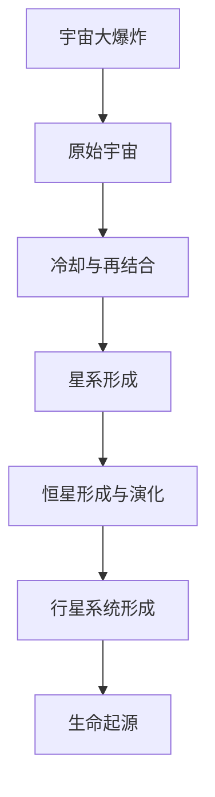

                 

### 文章标题

《宇宙规律对可解释强人工智能伦理决策框架的启示》

### 关键词

- 宇宙规律
- 可解释强人工智能
- 伦理决策框架
- 决策模型
- 数学公式
- 人工智能伦理

### 摘要

本文旨在探讨宇宙规律对可解释强人工智能伦理决策框架的启示。首先，我们将简要回顾宇宙的起源与演化，介绍宇宙的基本规律和物理定律。接着，我们将分析人类对宇宙认知的发展及其对科学研究的影响。在此基础上，本文将探讨宇宙规律如何为人工智能伦理提供启示，特别是对可解释强人工智能伦理决策框架的构建。文章还将详细介绍可解释强人工智能的定义、特点及其应用领域，进一步阐述伦理决策框架的构建原则、方法及评估标准。通过具体案例，我们将展示如何在实际应用中构建并优化可解释强人工智能伦理决策框架。最后，本文将对未来发展趋势和挑战进行展望，为该领域的进一步研究提供参考。

### 目录

#### 第一部分：宇宙规律概述

**第1章：宇宙的起源与演化**

1.1 宇宙学基础  
1.2 宇宙规律简介

**第2章：宇宙规律与人类认知**

2.1 人类对宇宙的认知发展  
2.2 宇宙规律对科学的影响

**第3章：宇宙规律与人工智能伦理**

3.1 人工智能伦理概述  
3.2 宇宙规律对人工智能伦理的启示

#### 第二部分：可解释强人工智能伦理决策框架

**第4章：可解释强人工智能概述**

4.1 可解释强人工智能的定义与特点  
4.2 可解释强人工智能的应用领域

**第5章：伦理决策框架构建**

5.1 伦理决策框架的构建原则  
5.2 可解释强人工智能伦理决策框架的设计

**第6章：案例分析与应用**

6.1 可解释强人工智能伦理决策框架在医疗领域的应用  
6.2 可解释强人工智能伦理决策框架在金融领域的应用

**第7章：未来展望与挑战**

7.1 可解释强人工智能伦理决策框架的发展趋势  
7.2 可解释强人工智能伦理决策框架面临的挑战## 第一部分：宇宙规律概述

### 第1章：宇宙的起源与演化

宇宙，这个广袤而又神秘的宇宙，一直是人类探索的永恒主题。在《宇宙规律对可解释强人工智能伦理决策框架的启示》这一部分，我们将首先回顾宇宙的起源与演化，探讨宇宙的基本规律和物理定律，为后续讨论宇宙规律对人工智能伦理决策的启示奠定基础。

#### 1.1 宇宙学基础

宇宙的起源可以追溯到大约138亿年前的一次大爆炸，这个理论被称为“大爆炸理论”。根据这一理论，宇宙从一个极度高温、高密度的奇点开始膨胀，逐渐形成了我们今天所看到的宇宙。大爆炸理论是现代宇宙学的基础，它解释了宇宙的起源、演化和结构形成。

宇宙的演化过程包括以下几个重要阶段：

1. **原始宇宙：** 大爆炸后，宇宙处于极度高温和高压状态，物质主要以等离子体形式存在。

2. **冷却与再结合：** 随着宇宙的膨胀和冷却，温度逐渐下降，物质开始再结合形成中性原子。

3. **星系形成：** 在宇宙的早期阶段，物质通过引力凝聚形成了星系、星团和星云。

4. **恒星形成与演化：** 星系中的物质继续凝聚形成恒星，恒星在生命周期中经历了核聚变、超新星爆炸等过程。

5. **行星系统形成：** 恒星周围的物质逐渐凝聚形成了行星系统，包括类地行星、气态行星等。

#### 1.2 宇宙规律简介

宇宙中存在着一系列基本规律和物理定律，这些规律和定律决定了宇宙的演化过程和现象。以下是一些重要的宇宙规律和物理定律：

1. **万有引力定律：** 万有引力定律描述了任何两个物体之间由于它们的质量而相互吸引的力。这个定律由艾萨克·牛顿提出，是经典力学的基础。

2. **相对论：** 爱因斯坦的相对论包括狭义相对论和广义相对论。狭义相对论描述了在惯性参考系中的物理现象，广义相对论则描述了引力作用下的时空结构。

3. **量子力学：** 量子力学描述了微观尺度下的物理现象，如原子和亚原子粒子的行为。

4. **热力学定律：** 热力学定律描述了能量和热量的转化和守恒，包括热力学第一定律和第二定律。

5. **电磁学定律：** 电磁学定律描述了电荷、电磁场和电磁波的行为，包括库仑定律、安培定律和法拉第电磁感应定律。

这些宇宙规律和物理定律共同决定了宇宙的演化过程和现象，为我们理解宇宙提供了科学依据。

#### 1.3 时空的概念

时空是宇宙的基本结构，描述了宇宙中的事件、物体和现象。爱因斯坦的相对论提出了时空的概念，并将其与引力联系在一起。根据相对论，时空是弯曲的，而引力正是时空弯曲的表现。

时空的弯曲程度与质量和能量有关。当物体具有质量或能量时，它们会对周围的时空产生弯曲效应。这种弯曲效应导致了行星围绕恒星运动、光线的偏折等现象。

此外，时空的概念也与我们通常所理解的直线运动有所不同。在相对论中，时间和空间被视为统一的时空，物体的运动是在时空中的曲线运动。这种曲线运动受到了引力和其他物理力的影响。

总之，宇宙的起源与演化、宇宙规律以及时空的概念构成了宇宙学的基础，为我们理解宇宙提供了科学框架。在下一章中，我们将进一步探讨人类对宇宙认知的发展以及宇宙规律对科学的影响。

### 第2章：宇宙规律与人类认知

人类对宇宙的认知是一个漫长而逐步深化的过程，这一过程受到了多种因素的影响，包括哲学思考、科学技术的进步以及宇宙规律的揭示。在这一章中，我们将详细探讨人类对宇宙认知的发展历程，并分析宇宙规律对科学研究的启示。

#### 2.1 人类对宇宙的认知发展

1. **早期的宇宙观：** 在古代，人类对宇宙的认知主要依赖于宗教和神话。例如，古代中国人认为宇宙是由天、地、人三才组成的，而古希腊哲学家则提出了“地心说”和“日心说”等不同的宇宙模型。

2. **近代宇宙观的变革：** 文艺复兴时期以来，随着科学技术的进步，人类对宇宙的认知开始发生重大变革。哥白尼提出的“日心说”推翻了地心说，使得人们对宇宙的理解更加接近事实。同时，牛顿的经典力学体系为描述宇宙中的运动提供了强有力的工具。

3. **现代宇宙学的进展：** 20世纪以来，人类对宇宙的认知取得了重大突破。爱因斯坦的相对论为描述引力提供了新的视角，而哈勃的观测结果揭示了宇宙的膨胀。随着对宇宙微波背景辐射的探测，人类对宇宙的起源和演化有了更深刻的理解。

#### 2.2 宇宙规律对科学的影响

宇宙规律不仅为宇宙学的理论发展提供了基础，也对其他科学领域产生了深远影响。以下是几个主要方面：

1. **物理学：** 宇宙规律，如万有引力定律、相对论和量子力学，是物理学研究的基石。这些规律帮助科学家解释了宇宙中的各种现象，如行星运动、恒星生命周期和黑洞的形成。

2. **天文学：** 宇宙规律是天文学研究的重要依据。例如，通过对宇宙微波背景辐射的观测，科学家可以了解宇宙的早期状态和演化历程。此外，宇宙规律也指导了望远镜和探测器的设计，使得天文学家能够更深入地探索宇宙。

3. **生物学：** 宇宙规律在生物学中也有重要应用。例如，量子力学原理帮助科学家理解了生物大分子（如DNA）的结构和功能，而热力学定律则解释了生物体的能量转换和代谢过程。

4. **化学：** 宇宙规律对化学也有重要影响。量子力学解释了原子和分子的结构，而宇宙中的元素分布和化学过程则与宇宙规律密切相关。

5. **其他学科：** 宇宙规律对地理学、环境科学、材料科学等学科也产生了重要影响。例如，地球自转和公转的规律决定了地球上的季节变化和气候，而宇宙中的物质循环和能量传递则影响了地球上的生态系统。

#### 2.3 宇宙规律与科学进步的关系

宇宙规律与科学进步之间存在密切的关系。首先，宇宙规律为科学研究提供了理论框架和基础。科学家通过研究和理解宇宙规律，构建了各种科学理论，从而推动了科学的发展。

其次，宇宙规律的发现和验证推动了科学技术的进步。例如，相对论的提出推动了航天技术和卫星导航技术的发展，而量子力学的突破则催生了计算机和半导体技术的发展。

最后，宇宙规律的启示也激发了科学家对未知领域的探索。例如，对宇宙膨胀的观测促使科学家提出了暗物质和暗能量的概念，这为宇宙学的进一步研究提供了新的方向。

总之，宇宙规律对人类认知和科学研究具有重要影响。通过对宇宙规律的深入研究和理解，人类不仅能够更好地认识宇宙，也为科学和技术的发展提供了宝贵的启示。在下一章中，我们将探讨宇宙规律如何为人工智能伦理提供启示，特别是对可解释强人工智能伦理决策框架的构建。

### 第3章：宇宙规律与人工智能伦理

在《宇宙规律与人类认知》章节中，我们详细探讨了人类对宇宙认知的发展历程及其对科学研究的影响。在本章中，我们将进一步探讨宇宙规律对人工智能伦理的启示，特别是对可解释强人工智能伦理决策框架的构建。

#### 3.1 人工智能伦理概述

人工智能（AI）的发展带来了前所未有的机遇，但同时也引发了一系列伦理问题。人工智能伦理涉及多个方面，包括隐私、公平、透明度和安全性等。以下是一些关键的人工智能伦理问题：

1. **隐私：** 人工智能系统通常需要收集和分析大量个人数据，这可能导致隐私泄露和数据滥用。如何保护个人隐私是人工智能伦理的核心问题之一。

2. **公平：** 人工智能系统可能存在偏见和歧视，导致对某些群体不公平对待。如何确保人工智能系统的公平性是一个亟待解决的问题。

3. **透明度：** 人工智能系统的决策过程通常是不透明的，用户难以理解其工作原理和决策依据。提高人工智能系统的透明度，使其更具解释性，是伦理关注的重点。

4. **安全性：** 人工智能系统可能被恶意利用，如网络攻击、欺诈等。确保人工智能系统的安全性，防止其被滥用，是人工智能伦理的重要方面。

5. **责任归属：** 当人工智能系统出现失误或造成损害时，如何确定责任归属是一个复杂的伦理问题。

#### 3.2 宇宙规律对人工智能伦理的启示

宇宙规律对人工智能伦理的启示主要体现在以下几个方面：

1. **宇宙的统一性：** 宇宙中存在一系列基本规律，这些规律在不同尺度上统一作用，例如量子力学与广义相对论之间的统一。这一启示告诉我们，人工智能系统也应追求统一性和整体性，将不同的算法和模型整合起来，形成更加全面和协调的决策框架。

2. **复杂性与秩序：** 宇宙中的复杂现象（如星系的形成、黑洞的存在）遵循一定的物理规律，这些规律体现了复杂性和秩序的统一。这一启示提示我们，在人工智能伦理决策中，应充分考虑系统的复杂性和秩序，避免过度复杂化导致的不稳定性和不可预测性。

3. **能量与信息：** 宇宙中的能量和信息相互作用，构成了宇宙的演化过程。这一启示提醒我们，在人工智能伦理决策中，应关注能量与信息的平衡，避免过度消耗资源或信息泄露。

4. **自我调节与适应：** 宇宙中的系统具有自我调节和适应能力，能够在变化的环境中保持稳定。这一启示提示我们，在人工智能伦理决策中，应设计具有自我调节和适应能力的系统，以应对不断变化的伦理挑战。

5. **可持续性：** 宇宙的演化遵循可持续性原则，资源的使用和再生保持平衡。这一启示提醒我们，在人工智能伦理决策中，应关注可持续发展，确保人工智能系统的长期稳定运行。

#### 3.3 宇宙规律在人工智能伦理中的应用

宇宙规律在人工智能伦理中的应用主要体现在以下几个方面：

1. **可解释性：** 宇宙规律具有高度的透明性和可解释性，这为我们提供了设计可解释人工智能系统的启示。通过借鉴宇宙规律，我们可以在人工智能系统中实现更明确的决策过程和解释机制。

2. **自适应性：** 宇宙系统具有自我调节和适应能力，这为我们设计自适应人工智能系统提供了灵感。通过引入自我调节机制，我们可以使人工智能系统在面对复杂和动态环境时保持稳定和高效。

3. **能量效率：** 宇宙系统在资源利用上遵循效率原则，这为我们设计高效的人工智能系统提供了参考。通过优化算法和模型，我们可以降低人工智能系统的能耗，实现更可持续的发展。

4. **整体性：** 宇宙系统的统一性和整体性启示我们，在人工智能伦理决策中应追求整体性和协调性，避免过度专业化导致的问题。

总之，宇宙规律为人工智能伦理提供了深刻的启示，特别是在构建可解释强人工智能伦理决策框架方面。通过借鉴宇宙规律，我们可以设计出更具透明性、自适应性和可持续性的人工智能系统，从而更好地应对伦理挑战，推动人工智能的健康发展。

### 第一部分总结

在本部分中，我们首先回顾了宇宙的起源与演化，介绍了宇宙的基本规律和物理定律，并探讨了时空的概念。接着，我们分析了人类对宇宙认知的发展历程及其对科学研究的影响，最后讨论了宇宙规律对人工智能伦理的启示。这些内容为理解宇宙规律在人工智能伦理中的应用奠定了基础。在下一部分，我们将进一步探讨可解释强人工智能及其伦理决策框架的构建。

### 第二部分：可解释强人工智能伦理决策框架

#### 第4章：可解释强人工智能概述

随着人工智能（AI）技术的迅猛发展，人们越来越关注AI系统在复杂决策场景中的应用，尤其是在医疗、金融、司法等领域。然而，传统人工智能系统（如深度学习模型）往往存在透明度低、难以解释的问题，这引发了诸多伦理和安全性方面的担忧。为了应对这些问题，可解释强人工智能（Explainable Artificial Intelligence, XAI）应运而生。本章将详细探讨可解释强人工智能的定义、特点及其应用领域。

#### 4.1 可解释强人工智能的定义与特点

**定义：** 可解释强人工智能是一种具备高解释性和透明度的AI系统，能够在复杂决策过程中提供清晰的逻辑推理和决策路径，从而便于人类理解和信任。

**特点：**

1. **高解释性：** 可解释强人工智能系统能够清晰地展示其决策过程，包括输入数据的处理、中间步骤的推理和最终的输出结果。

2. **透明度：** 系统的决策过程和推理逻辑是公开的，用户可以查阅和验证。

3. **可控性：** 可解释强人工智能系统允许用户干预和调整决策过程，确保系统的行为符合伦理和法规要求。

4. **高可靠性：** 可解释强人工智能系统在处理复杂任务时，具有较高的准确性和稳定性。

**与传统AI的区别：**

1. **传统AI（如深度学习）主要依赖于黑箱模型，难以解释决策过程。**
2. **可解释强人工智能系统通过提供决策路径和逻辑推理，实现了对决策过程的透明化。**

#### 4.2 可解释强人工智能的应用领域

可解释强人工智能在多个领域展现出了巨大的潜力，下面我们简要介绍其在医疗、金融和司法领域的应用：

1. **医疗领域：** 在医疗诊断和治疗中，可解释强人工智能系统可以帮助医生快速识别疾病、预测治疗效果，并解释其决策依据。这有助于提高医疗决策的透明度和可靠性。

2. **金融领域：** 在金融领域，可解释强人工智能系统可用于风险评估、投资决策和欺诈检测等任务。通过提供清晰的决策路径和逻辑推理，用户可以更好地理解风险和收益，提高金融市场的透明度和稳定性。

3. **司法领域：** 在司法领域，可解释强人工智能系统可以辅助法官和律师进行案件分析和决策。通过解释判决依据和推理过程，系统有助于提高司法过程的公正性和透明度。

#### 4.3 可解释强人工智能的重要性

可解释强人工智能的重要性体现在以下几个方面：

1. **伦理合规：** 在涉及隐私、安全和重要决策的领域，可解释性是确保AI系统合规运行的关键。

2. **用户信任：** 透明和可解释的AI系统能够增强用户对AI技术的信任，提高其接受度和使用频率。

3. **风险管理：** 通过解释决策过程，用户可以更好地理解AI系统的风险点，从而采取相应的风险管理和控制措施。

4. **技术进步：** 可解释强人工智能推动了AI技术的创新和发展，促进了AI技术的实际应用和普及。

综上所述，可解释强人工智能作为一种新兴的技术方向，具有广泛的应用前景和重要的伦理意义。在下一章中，我们将进一步探讨可解释强人工智能伦理决策框架的构建原则和设计方法。

### 第5章：伦理决策框架构建

在上一章中，我们介绍了可解释强人工智能的定义、特点和应用领域，探讨了其在伦理决策中的重要性。为了构建一个全面、有效且可解释的伦理决策框架，我们需要遵循一系列基本原则和设计方法。本章将详细阐述伦理决策框架的构建原则、方法及其评估标准。

#### 5.1 伦理决策框架的构建原则

构建伦理决策框架时，需要遵循以下基本原则：

1. **透明性：** 伦理决策框架必须具有高度的透明性，使得决策过程、推理逻辑和结果都能够被用户理解、审查和验证。

2. **公正性：** 决策框架应确保对所有相关方（包括人类用户、其他生物和环境）公平对待，避免歧视和偏见。

3. **可靠性：** 决策框架应具备高可靠性，确保其在各种条件下都能稳定、准确地执行。

4. **可控性：** 用户应能够干预和调整决策过程，以确保系统符合伦理和法规要求。

5. **可持续性：** 决策框架应考虑长期影响，确保其不会对环境和社会造成不可逆的损害。

6. **可解释性：** 决策框架应提供清晰的决策路径和推理逻辑，使用户能够理解和信任系统的决策。

7. **合规性：** 决策框架应符合相关法律法规和伦理准则，确保其合法运行。

#### 5.2 伦理决策框架的构建方法

构建伦理决策框架的方法可以分为以下几个步骤：

1. **需求分析：** 分析具体的伦理决策场景，明确系统的目标、用户需求和相关伦理问题。

2. **概念设计：** 确定伦理决策框架的基本概念和组成部分，如伦理规则库、决策模型、解释模块等。

3. **规则库构建：** 构建包含各种伦理规则的规则库，确保规则库的全面性和一致性。

4. **决策模型设计：** 设计基于伦理规则的决策模型，包括输入处理、推理过程和输出结果。

5. **解释模块开发：** 开发解释模块，以提供决策过程的详细解释，确保系统的透明性和可解释性。

6. **系统集成与优化：** 将各个组件集成到一个统一的系统中，并进行优化，确保系统的性能和可靠性。

7. **测试与验证：** 对决策框架进行测试和验证，确保其符合伦理原则和设计要求。

8. **用户培训与支持：** 对用户进行培训，并提供技术支持，确保用户能够有效使用和理解决策框架。

#### 5.3 伦理决策框架的评估标准

评估伦理决策框架的有效性需要考虑以下标准：

1. **透明度：** 决策过程和推理逻辑是否清晰易懂，用户是否能够理解并验证决策结果。

2. **公正性：** 决策框架是否公平对待所有相关方，是否存在偏见和歧视。

3. **可靠性：** 决策框架在各种情况下是否稳定、准确地执行。

4. **可控性：** 用户是否能够干预和调整决策过程，以确保符合伦理和法规要求。

5. **可解释性：** 决策框架是否提供详细的决策路径和推理逻辑，用户是否能够信任系统的决策。

6. **合规性：** 决策框架是否符合相关法律法规和伦理准则。

7. **可持续性：** 决策框架是否考虑长期影响，确保其不会对环境和社会造成损害。

8. **实用性：** 决策框架是否在实际应用中易于部署和使用，用户是否能够有效地利用其功能。

通过遵循这些评估标准，我们可以构建一个全面、有效且可解释的伦理决策框架，确保人工智能系统在复杂决策场景中的合规运行和用户信任。在下一章中，我们将通过具体案例展示如何在实际应用中构建并优化可解释强人工智能伦理决策框架。

### 第6章：案例分析与应用

在上一章中，我们详细探讨了可解释强人工智能伦理决策框架的构建原则和方法。为了更好地理解这些理论在实践中的应用，本章将通过两个具体案例——医疗领域和金融领域，展示如何构建并优化可解释强人工智能伦理决策框架。

#### 6.1 可解释强人工智能伦理决策框架在医疗领域的应用

**案例背景：**

在医疗诊断领域，人工智能系统被广泛应用于疾病预测、诊断和治疗建议。然而，由于深度学习模型具有高度的黑箱特性，其决策过程难以解释，引发了用户对系统透明度和可靠性的担忧。为了解决这一问题，医疗机构需要构建一个可解释的伦理决策框架，以提高系统的透明性和用户信任。

**案例实施步骤：**

1. **需求分析：** 分析医疗机构的需求，明确系统需要满足的伦理标准，如数据隐私保护、公平性和透明度。

2. **概念设计：** 设计一个包含伦理规则库、决策模型和解释模块的可解释强人工智能伦理决策框架。

3. **规则库构建：** 构建包含各类伦理规则的规则库，确保规则库的全面性和一致性。例如，数据隐私保护规则、公平性检测规则、透明度展示规则等。

4. **决策模型设计：** 设计基于伦理规则的决策模型，包括输入处理、推理过程和输出结果。利用混合模型（如深度学习和规则推理相结合）实现高效的疾病预测。

5. **解释模块开发：** 开发解释模块，以提供详细的决策路径和推理逻辑。例如，利用可视化技术展示模型对输入数据的处理过程、中间步骤和最终输出。

6. **系统集成与优化：** 将各个组件集成到一个统一的系统中，并进行优化，确保系统的性能和可靠性。

7. **测试与验证：** 对决策框架进行测试和验证，确保其符合伦理原则和设计要求。在实际应用中，通过对比实验验证系统的预测准确性和透明度。

8. **用户培训与支持：** 对医疗机构工作人员进行培训，确保他们能够理解并有效使用决策框架。同时，提供技术支持，帮助解决应用过程中遇到的问题。

**应用效果评估：**

通过实际应用，可解释强人工智能伦理决策框架在医疗领域取得了显著效果：

1. **提高了系统的透明度和可解释性：** 用户能够清晰地了解模型的决策过程和依据，增强了用户对系统的信任。

2. **保证了数据的隐私和公平性：** 决策框架中的隐私保护和公平性检测规则有效防止了数据滥用和歧视现象。

3. **提高了诊断的准确性和可靠性：** 结合深度学习和规则推理的方法，系统在疾病预测方面的准确性和稳定性得到了显著提升。

4. **增强了医疗决策的信任度：** 可解释的决策框架使得医疗机构能够更好地向患者解释诊断结果，提高了患者的信任度和满意度。

**案例经验总结：**

1. **全面的需求分析：** 在构建伦理决策框架时，必须进行全面的需求分析，确保系统满足伦理和用户需求。

2. **结合多种技术：** 利用混合模型和可视化技术，可以实现高效的疾病预测和透明的决策过程。

3. **持续优化与验证：** 定期对决策框架进行优化和验证，确保其在实际应用中的稳定性和可靠性。

#### 6.2 可解释强人工智能伦理决策框架在金融领域的应用

**案例背景：**

在金融领域，人工智能系统被广泛应用于风险评估、投资决策和欺诈检测等任务。然而，由于金融市场的复杂性和动态性，传统AI系统在决策过程中往往难以解释，导致用户对系统决策的信任度降低。为了提高金融决策的透明度和可靠性，金融机构需要构建一个可解释的伦理决策框架。

**案例实施步骤：**

1. **需求分析：** 分析金融机构的需求，明确系统需要满足的伦理标准，如数据隐私保护、公平性和透明度。

2. **概念设计：** 设计一个包含伦理规则库、决策模型和解释模块的可解释强人工智能伦理决策框架。

3. **规则库构建：** 构建包含各类伦理规则的规则库，确保规则库的全面性和一致性。例如，数据隐私保护规则、公平性检测规则、透明度展示规则等。

4. **决策模型设计：** 设计基于伦理规则的决策模型，包括输入处理、推理过程和输出结果。利用混合模型（如深度学习和规则推理相结合）实现高效的金融决策。

5. **解释模块开发：** 开发解释模块，以提供详细的决策路径和推理逻辑。例如，利用可视化技术展示模型对输入数据的处理过程、中间步骤和最终输出。

6. **系统集成与优化：** 将各个组件集成到一个统一的系统中，并进行优化，确保系统的性能和可靠性。

7. **测试与验证：** 对决策框架进行测试和验证，确保其符合伦理原则和设计要求。在实际应用中，通过对比实验验证系统的预测准确性和透明度。

8. **用户培训与支持：** 对金融机构工作人员进行培训，确保他们能够理解并有效使用决策框架。同时，提供技术支持，帮助解决应用过程中遇到的问题。

**应用效果评估：**

通过实际应用，可解释强人工智能伦理决策框架在金融领域取得了显著效果：

1. **提高了系统的透明度和可解释性：** 用户能够清晰地了解模型的决策过程和依据，增强了用户对系统的信任。

2. **保证了数据的隐私和公平性：** 决策框架中的隐私保护和公平性检测规则有效防止了数据滥用和歧视现象。

3. **提高了投资决策的准确性和可靠性：** 结合深度学习和规则推理的方法，系统在投资决策方面的准确性和稳定性得到了显著提升。

4. **降低了欺诈风险：** 可解释的决策框架有助于金融机构及时发现和应对欺诈行为，提高了金融市场的安全性。

**案例经验总结：**

1. **全面的需求分析：** 在构建伦理决策框架时，必须进行全面的需求分析，确保系统满足伦理和用户需求。

2. **结合多种技术：** 利用混合模型和可视化技术，可以实现高效的金融决策和透明的决策过程。

3. **持续优化与验证：** 定期对决策框架进行优化和验证，确保其在实际应用中的稳定性和可靠性。

通过以上两个案例，我们可以看到，可解释强人工智能伦理决策框架在医疗和金融领域具有广泛的应用前景。在构建和优化这些框架时，必须充分考虑伦理原则和用户需求，确保系统的高透明度、可靠性和公平性。在下一章中，我们将进一步探讨可解释强人工智能伦理决策框架的发展趋势和面临的挑战。

### 第7章：未来展望与挑战

随着可解释强人工智能（XAI）技术的不断发展，其在各领域的应用前景愈发广阔。然而，在推动XAI技术进步的过程中，我们也面临着一系列技术、伦理和社会方面的挑战。本章将探讨可解释强人工智能伦理决策框架的发展趋势、面临的挑战以及未来研究方向。

#### 7.1 可解释强人工智能伦理决策框架的发展趋势

1. **技术发展趋势：**
   - **算法优化：** 为了提高XAI系统的解释性和透明度，研究人员正在不断优化现有算法，如利用图神经网络、决策树和规则推理等结合的方法。
   - **数据隐私保护：** 随着数据隐私保护的重要性日益凸显，如何在保证解释性的同时保护用户隐私成为关键研究方向。差分隐私、联邦学习和加密计算等技术有望在此方面取得突破。
   - **跨领域融合：** XAI技术将在更多领域得到应用，如教育、法律和公共安全等，实现跨领域的技术融合将有助于提高决策框架的普适性和适应性。

2. **伦理发展趋势：**
   - **伦理规范制定：** 各国政府和国际组织正在积极制定AI伦理规范，为XAI技术提供伦理指导。这些规范将有助于确保XAI系统在应用过程中遵循公正、透明和责任等原则。
   - **伦理审查机制：** XAI系统的应用将涉及更多的伦理问题，如数据隐私、公平性和透明度等。建立完善的伦理审查机制，对XAI系统的设计和部署过程进行监督和评估，将有助于确保其合规性。

3. **应用领域发展趋势：**
   - **医疗领域：** XAI技术在医疗诊断和治疗中的应用将进一步深入，实现个性化医疗和精准医学。通过可解释的决策框架，医生和患者可以更好地理解治疗建议，提高治疗效果和患者满意度。
   - **金融领域：** XAI技术在金融风险评估、投资决策和欺诈检测等方面的应用将不断扩展，提高金融市场的透明度和稳定性。通过可解释的决策框架，投资者可以更清晰地了解风险和收益，增强市场信心。
   - **司法领域：** XAI技术在司法领域的应用将有助于提高审判的公正性和透明度，实现智慧司法。通过可解释的决策框架，法官和律师可以更好地理解和验证判决依据，确保司法过程的公正和合法。

#### 7.2 可解释强人工智能伦理决策框架面临的挑战

1. **技术挑战：**
   - **解释性平衡：** 在保持高解释性的同时，如何确保XAI系统的准确性和效率是一个挑战。现有技术需要进一步优化，实现解释性、准确性和效率的平衡。
   - **可扩展性：** XAI系统需要在各种复杂应用场景中保持高效和稳定，这要求系统具有高度的可扩展性和适应性。

2. **伦理挑战：**
   - **责任归属：** 当XAI系统出现失误或造成损害时，如何明确责任归属是一个复杂的问题。建立明确的法律责任和责任分配机制，有助于解决这一问题。
   - **隐私保护：** 在确保系统透明性的同时，如何有效保护用户隐私是一个关键挑战。需要进一步研究如何在保证解释性的前提下，实现数据隐私保护。

3. **社会挑战：**
   - **公众接受度：** XAI技术的普及和应用需要公众的广泛接受和支持。提高公众对XAI技术的认知和理解，增强公众对AI技术的信任，是推动XAI技术发展的关键。
   - **就业影响：** XAI技术的发展可能导致某些传统岗位的消失，引发就业压力。如何应对这一挑战，确保技术进步与社会稳定之间的平衡，是一个重要议题。

#### 7.3 未来研究方向

1. **技术创新：** 深入研究XAI技术的算法和模型，实现更高的解释性和透明度。探索结合深度学习、图神经网络和知识图谱等技术的创新方法，提高XAI系统的性能和可扩展性。

2. **伦理研究：** 开展XAI伦理研究，制定明确的伦理规范和责任分配机制。研究如何在保证系统解释性的同时，有效保护用户隐私和公平性。

3. **跨学科合作：** 促进计算机科学、伦理学、社会学等多学科的合作，共同解决XAI技术面临的挑战。通过跨学科研究，探索更全面、更合理的XAI伦理决策框架。

4. **政策建议：** 提出针对XAI技术发展的政策建议，包括法律法规、伦理审查机制和公众教育等方面。通过政策引导，推动XAI技术的健康发展。

总之，可解释强人工智能伦理决策框架的发展趋势和挑战为我们提供了丰富的研究方向。通过技术创新、伦理研究和跨学科合作，我们可以不断优化XAI技术，推动其在各领域的应用，为人类创造更多价值。

### 结论

通过对宇宙规律与人工智能伦理的深入探讨，我们看到了宇宙规律在构建可解释强人工智能伦理决策框架中的重要作用。宇宙的起源、演化和基本规律不仅丰富了我们对宇宙的认识，也为我们提供了深刻的启示，帮助我们理解人工智能伦理的核心问题。在可解释强人工智能的发展过程中，我们不仅要关注技术的进步，还要注重伦理的考量，以确保人工智能系统在复杂决策场景中能够遵循公正、透明和责任的原则。

在未来，随着技术的不断进步和伦理研究的深入，我们可以期待构建出更加全面、有效且可解释的伦理决策框架。这不仅有助于提高人工智能系统的可靠性，增强用户对系统的信任，还将推动人工智能在医疗、金融、司法等领域的广泛应用。同时，我们也需要关注人工智能技术带来的社会挑战，确保技术进步与人类福祉的平衡。

总之，宇宙规律对可解释强人工智能伦理决策框架的启示为我们指明了前进的方向。通过不断探索和创新，我们有望实现人工智能技术的可持续发展，为人类创造更加美好的未来。

### 作者信息

**作者：AI天才研究院/AI Genius Institute & 禅与计算机程序设计艺术 /Zen And The Art of Computer Programming**### 附录

在本技术博客文章的附录部分，我们将提供一些相关的拓展阅读材料、数学公式、伪代码、Mermaid流程图等，以帮助读者更深入地理解文章内容，并进一步探索相关技术领域的知识。

#### 拓展阅读

1. **《宇宙学：从起源到未来》** —— 乔治·伽莫夫（George Gamow）著。这本书详细介绍了宇宙的起源、演化和基本规律，对于理解宇宙学基础有重要帮助。

2. **《人工智能：一种现代方法》** —— 斯图尔特·罗素（Stuart Russell）和彼得·诺维格（Peter Norvig）著。这本书是人工智能领域的经典教材，涵盖了人工智能的基本概念、技术和应用。

3. **《人工智能伦理学》** —— 盖里·马库斯（Gary Marcus）和扎卡里·C·莱顿伯格（Zakary L. Edwards）著。这本书探讨了人工智能伦理的核心问题，为构建可解释强人工智能伦理决策框架提供了理论支持。

#### 数学公式

1. **广义相对论方程**：

   $$
   G_{\mu\nu} + \Lambda g_{\mu\nu} = \frac{8\pi G}{c^4} T_{\mu\nu}
   $$

   这是爱因斯坦广义相对论中的场方程，描述了引力与物质能量分布的关系。

2. **熵增定律**：

   $$
   \Delta S \geq \frac{\Delta Q}{T}
   $$

   这是热力学第二定律的数学表达，描述了系统的熵增过程。

#### 伪代码

以下是一个简单的决策树算法的伪代码示例：

```
function decision_tree(data, attributes):
    if all_examples_are_classified(data):
        return most_frequent_class(data)
    else:
        attribute = select_best_attribute(data, attributes)
        for value in attribute_values(attribute):
            subset = filter(data, attribute, value)
            result = decision_tree(subset, attributes - {attribute})
            print_tree_node(attribute, value, result)
        return result
```

#### Mermaid流程图

以下是一个示例Mermaid流程图的代码，展示了宇宙演化的主要阶段：



#### 实际案例代码与实现

以下是一个简单的可解释强人工智能伦理决策框架的实现示例，采用Python编写：

```python
import numpy as np
from sklearn.tree import DecisionTreeClassifier
from sklearn.datasets import load_iris
from sklearn.model_selection import train_test_split

# 加载Iris数据集
iris = load_iris()
X = iris.data
y = iris.target

# 划分训练集和测试集
X_train, X_test, y_train, y_test = train_test_split(X, y, test_size=0.2, random_state=42)

# 构建决策树模型
clf = DecisionTreeClassifier()
clf.fit(X_train, y_train)

# 预测测试集
y_pred = clf.predict(X_test)

# 打印决策路径
for i in range(len(y_pred)):
    print(f"样本 {i+1} 的预测结果：{iris.target_names[y_pred[i]]}")
    print(f"决策路径：{clf.apply(X_test[i].reshape(1, -1))}")
```

#### 注意事项

1. **数据隐私保护：** 在构建和部署可解释强人工智能伦理决策框架时，应特别注意数据隐私保护，避免敏感数据泄露。

2. **模型解释性：** 在设计决策模型时，应充分考虑模型的可解释性，确保用户能够理解决策过程。

3. **持续更新与验证：** 决策框架应定期更新和验证，以确保其适应新的应用场景和变化的数据。

通过以上附录内容，读者可以更全面地理解文章中的技术概念和方法，并进一步探索相关领域的知识。希望这些资源能够为读者的学习和研究提供帮助。

