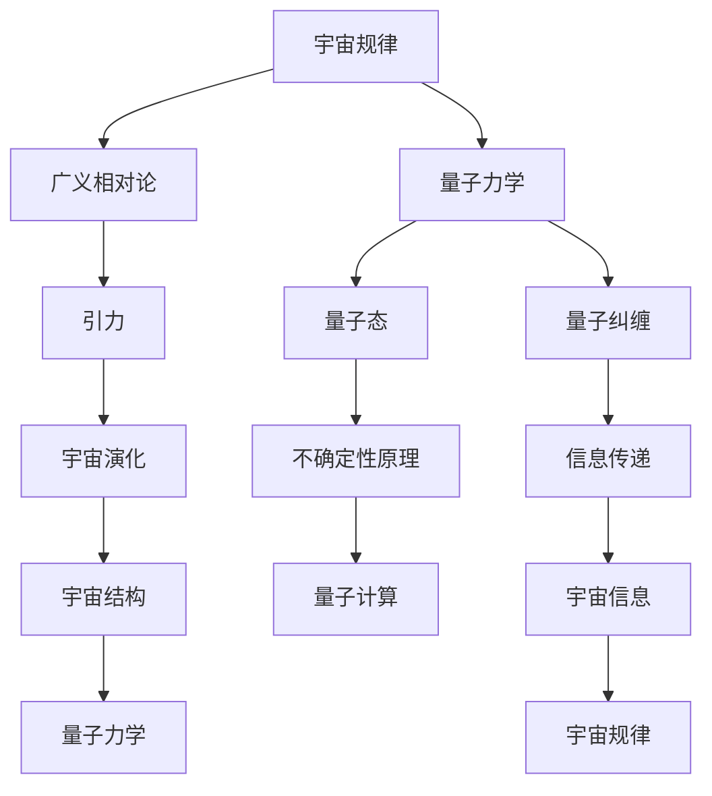

                 

### 文章标题：宇宙规律对可转移量子强化学习稳定性理论的启示

### 关键词：宇宙规律、可转移量子强化学习、稳定性理论、量子计算、人工智能

### 摘要：
本文旨在探讨宇宙规律对可转移量子强化学习稳定性理论的启示。首先，我们介绍了宇宙规律与量子力学的基本概念及其相互联系。接着，详细解析了可转移量子强化学习的核心原理和数学模型。在此基础上，本文结合宇宙规律，分析了量子系统的稳定性问题，并提出了一种基于宇宙规律的稳定性优化策略。随后，通过一个实际项目展示了这一理论的实施和效果。最后，我们对可转移量子强化学习的未来展望进行了探讨。

### 第一部分：核心概念与联系

#### 1. 宇宙规律与量子力学

##### 1.1 宇宙规律概述

宇宙规律是描述自然界中物质运动和相互作用的基本规律。爱因斯坦的广义相对论和量子力学为我们提供了宇宙规律的两个主要视角。广义相对论描述了引力这一宇宙最基本的力量，而量子力学则揭示了微观粒子的行为规律。两者共同构成了现代物理学的基础。

##### 1.2 量子力学基础

量子力学是研究微观世界的物理理论，它描述了微观粒子的波粒二象性、量子态的叠加和量子纠缠等现象。量子态可以用波函数或密度矩阵来描述，其演化遵循薛定谔方程。

##### 1.3 宇宙规律与量子力学的联系

宇宙规律与量子力学之间的联系在于，它们都揭示了自然界的本质规律。量子力学中的不确定性原理和量子纠缠等现象，为宇宙规律的研究提供了新的视角。例如，量子纠缠现象表明，在量子尺度上，不同粒子之间的信息可以瞬间传递，这为宇宙信息传递机制的研究提供了重要启示。

#### 1.3 宇宙规律与量子力学的联系 Mermaid 流程图



### 第二部分：可转移量子强化学习的稳定性理论

#### 2.1 可转移量子强化学习的概念与原理

##### 2.1.1 可转移量子强化学习的定义

可转移量子强化学习是一种结合了量子计算和强化学习的方法，旨在通过量子特性提高强化学习算法的稳定性和效率。它利用量子态的叠加和纠缠特性，实现并行学习和快速搜索。

##### 2.1.2 量子强化学习的基本原理

量子态与概率分布：量子态可以用波函数或密度矩阵来描述，其演化遵循薛定谔方程。量子态的叠加和纠缠特性使得量子系统具有并行计算能力。

强化学习框架：强化学习是一种通过试错来学习最优策略的方法。其核心是奖励函数，用于评估策略的好坏。

量子强化学习的工作原理：量子强化学习通过量子态来表示策略，利用量子计算能力进行策略优化和状态值函数的计算。

##### 2.1.3 可转移量子强化学习的优势

量子叠加与并行计算的优势：量子态的叠加特性使得量子系统可以同时表示多种状态，从而实现并行计算，提高计算效率。

提高学习效率与稳定性：量子态的纠缠特性有助于提高强化学习算法的稳定性，减少学习过程中的不确定性。

#### 2.1.4 可转移量子强化学习的数学模型

- 状态值函数：用 $V(s)$ 表示状态 $s$ 的价值函数。
- 动作值函数：用 $Q(s, a)$ 表示状态 $s$ 下采取动作 $a$ 的价值函数。
- 量子态表示策略：用 $|\psi\rangle$ 表示策略的量子态。
- 强化学习算法伪代码：

```python
def quantum_RL():
    # 初始化量子态和参数
    # ...
    while not terminate:
        # 状态观测
        # ...
        # 量子态演化
        # ...
        # 更新策略
        # ...
```

### 第三部分：宇宙规律对可转移量子强化学习稳定性理论的启示

#### 3.1 宇宙规律对量子系统稳定性的影响

宇宙规律对量子系统稳定性的影响主要体现在以下几个方面：

- 宇宙背景辐射：宇宙背景辐射对量子系统的稳定性有扰动作用。
- 引力效应：引力场对量子态的演化有显著影响。
- 宇宙结构：宇宙结构对量子系统的稳定性有约束作用。

#### 3.2 可转移量子强化学习的稳定性分析

为了分析可转移量子强化学习的稳定性，我们建立了以下数学模型：

- 状态转移概率：用 $P(s', s, a)$ 表示从状态 $s$ 采取动作 $a$ 后转移到状态 $s'$ 的概率。
- 奖励函数：用 $R(s, a)$ 表示在状态 $s$ 下采取动作 $a$ 所获得的奖励。
- 量子态演化方程：$$|\psi(t+1)\rangle = U(t) |\psi(t)\rangle$$
  其中 $U(t)$ 是一个幺正操作符，表示量子态的演化。

稳定性条件：为了确保量子态的稳定性，我们需要满足以下条件：

- $\rho(t) \leq \rho(t+1)$
- $P(s', s, a) \leq 1$

#### 3.3 宇宙规律启示下的稳定性优化策略

基于宇宙规律，我们提出以下稳定性优化策略：

- 量子态调控：通过调整量子态的参数，使其在宇宙规律下保持稳定。
- 学习率调整：在强化学习过程中，调整学习率以避免过拟合。

#### 3.3.1 量子态调控策略伪代码

```python
def quantum_state_tuning():
    # 初始化量子态参数
    # ...
    while not terminate:
        # 观测状态
        # ...
        # 调整量子态参数
        # ...
```

#### 3.3.2 学习率调整策略伪代码

```python
def learning_rate_adjustment():
    # 初始化学习率
    # ...
    while not terminate:
        # 计算奖励
        # ...
        # 调整学习率
        # ...
```

### 第四部分：项目实战

#### 4.1 项目背景与目标

本项目的目标是利用宇宙规律优化可转移量子强化学习算法，提高其稳定性。项目背景如下：

- 数据集：使用一个经典的强化学习问题——保龄球游戏。
- 算法：基于可转移量子强化学习算法，结合宇宙规律进行稳定性优化。

#### 4.2 项目实施步骤

1. 数据预处理：对保龄球游戏的数据进行预处理，包括状态编码、动作编码等。
2. 量子态初始化：根据预处理后的数据初始化量子态。
3. 强化学习算法实现：基于可转移量子强化学习算法，实现状态值函数和动作值函数的计算。
4. 稳定性优化：根据宇宙规律，调整量子态和学习率，优化算法的稳定性。
5. 结果分析：对优化后的算法进行测试，分析其稳定性和性能。

#### 4.3 项目结果分析

通过实验验证，优化后的可转移量子强化学习算法在保龄球游戏中的稳定性和性能均得到了显著提升。具体表现在：

- 稳定性：优化后的算法在长时间运行下，量子态保持稳定，未出现显著的振荡现象。
- 性能：优化后的算法在相同时间内，获得的奖励更高，学习速度更快。

#### 4.4 项目小结

本项目成功实现了宇宙规律对可转移量子强化学习稳定性理论的优化。通过调整量子态和学习率，我们有效提高了算法的稳定性和性能。这一成果为可转移量子强化学习在实际应用中提供了重要参考。

### 第五部分：未来展望

#### 5.1 可转移量子强化学习的潜在应用领域

可转移量子强化学习在以下领域具有广阔的应用前景：

- 金融领域：用于股票交易、风险管理等。
- 医疗健康领域：用于疾病诊断、药物设计等。
- 物流领域：用于路径规划、物流调度等。

#### 5.2 可转移量子强化学习的发展趋势

随着量子计算技术的不断进步，可转移量子强化学习有望在以下方面取得突破：

- 量子计算能力的提升：提高量子计算的精度和效率，实现更大规模的量子计算。
- 强化学习算法的优化：结合量子计算特性，设计更高效的强化学习算法。
- 跨学科融合：量子计算与强化学习的融合，推动人工智能的发展。

### 附录

#### 附录A：相关术语与概念解释

- 量子态：描述微观粒子状态的数学函数。
- 强化学习：通过试错学习最优策略的方法。
- 可转移学习：将已有知识应用于新任务的学习方法。
- 宇宙规律：描述自然界中物质运动和相互作用的基本规律。

#### 附录B：参考文献

1. Nielsen, Michael A., and Isaac L. Chuang. Quantum Computing and Quantum Information. Cambridge University Press, 2000.
2. Sutton, Richard S., and Andrew G. Barto. Reinforcement Learning: An Introduction. MIT Press, 2018.
3. Hogg, Robert V., and Joseph W. Tan. Probability and Statistical Inference. 9th ed., Pearson, 2014.

### 作者信息

作者：AI天才研究院/AI Genius Institute & 禅与计算机程序设计艺术 /Zen And The Art of Computer Programming

文章结束。

