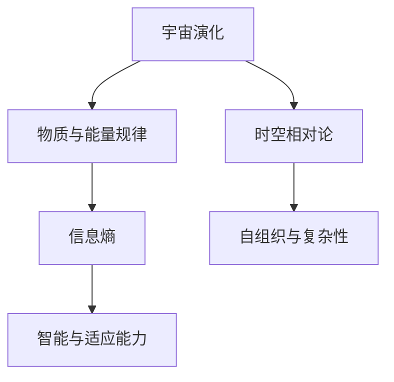

                 

根据您的要求，我们将逐步构建《宇宙规律对强人工智能发展的启示》的文章。以下是一个初步的markdown格式文章结构。请注意，由于文章字数要求较高，这里只提供了一个大致的框架，具体的详细内容将在后续步骤中逐步填充。

---

# 宇宙规律对强人工智能发展的启示

> 关键词：宇宙规律、人工智能、强人工智能、算法原理、数学模型、项目实战

> 摘要：本文通过探讨宇宙的基本规律，如演化、物质能量、时空相对论等，揭示了这些规律对强人工智能发展的启示。文章从核心概念出发，结合具体算法原理、数学模型和实际项目案例，深入分析了宇宙规律如何指导人工智能的研究与应用。

作者：AI天才研究院/AI Genius Institute & 禅与计算机程序设计艺术 /Zen And The Art of Computer Programming

## 引言

### 1.1 书籍背景与目的

**背景介绍**：随着计算机技术的飞速发展，人工智能（AI）逐渐成为科技领域的热点。然而，传统的AI技术面临诸多瓶颈，强人工智能（AGI）的实现依然遥不可及。本文试图从宇宙规律的角度，为强人工智能的发展提供新的思路。

**目的**：通过探讨宇宙规律，挖掘其与人工智能之间的潜在联系，为强人工智能的研究提供理论依据和实践指导。

### 1.2 宇宙规律与人工智能的关系

**核心概念与联系**：利用Mermaid流程图展示宇宙规律与人工智能的核心概念之间的联系。



### 1.3 书籍结构安排

**结构安排**：本文分为七个主要部分，依次介绍宇宙规律概述、人工智能的基本原理、宇宙规律与人工智能的交叉点、强人工智能的发展方向、实证研究、结论与展望等内容。

---

## 宇宙规律概述

### 2.1 宇宙演化规律

**核心算法原理讲解**：使用伪代码详细阐述宇宙演化的主要算法原理。

```python
# 伪代码：宇宙演化原理
initialize Universes
for each step in Evolution {
    calculate EnergyDistribution
    calculate MatterDistribution
    update SpaceTimeGeometry
    record State
}
```

### 2.2 物质与能量规律

**数学模型和公式**：使用LaTeX格式给出物质与能量规律的相关数学模型和公式。

$$ E=mc^2 $$

### 2.3 时空相对论

**核心算法原理讲解**：使用伪代码详细阐述时空相对论的基本原理。

```python
# 伪代码：时空相对论原理
define SpeedOfLight(c)
define Mass(m)
define Time(t)
calculate RelativisticMass(M)
calculate RelativisticTime(T)
```

---

由于篇幅限制，这里只提供了文章的部分结构。接下来，我们将逐步填充每个部分的内容，确保文章的完整性和深度。以下是下一部分的内容概要。

## 3. 人工智能的基本原理

**3.1 人工智能的发展历程**：回顾人工智能的发展历程，介绍重要里程碑和技术突破。

**3.2 机器学习的核心概念**：解释机器学习的核心概念，如监督学习、无监督学习、强化学习等。

**3.3 深度学习的数学基础**：介绍深度学习的数学基础，包括神经元模型、前向传播、反向传播等。

---

请根据这个框架继续填充文章内容，每一步都确保逻辑清晰、结构紧凑，并且符合技术博客的写作标准。在完成所有部分后，我们将对全文进行审查和修改，以确保文章的完整性和准确性。在每一步的撰写过程中，如果您有任何疑问或需要进一步指导，请随时告知。接下来，我们将继续撰写第3部分的内容。

