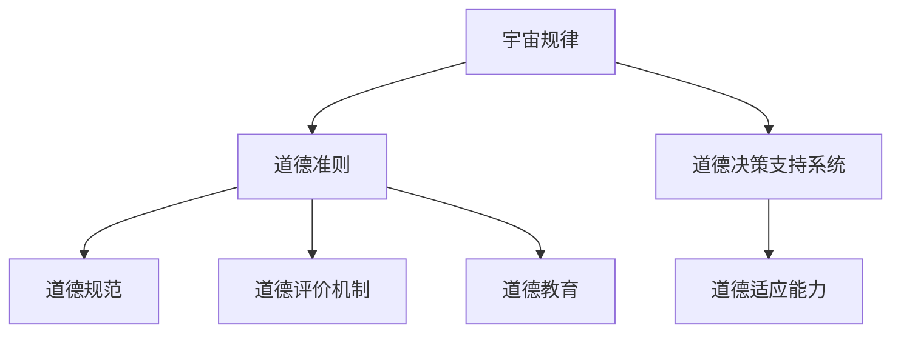
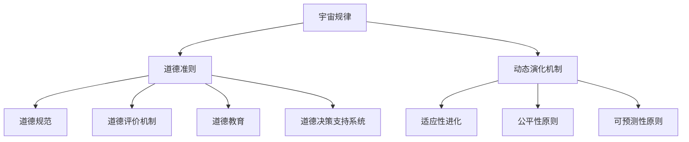
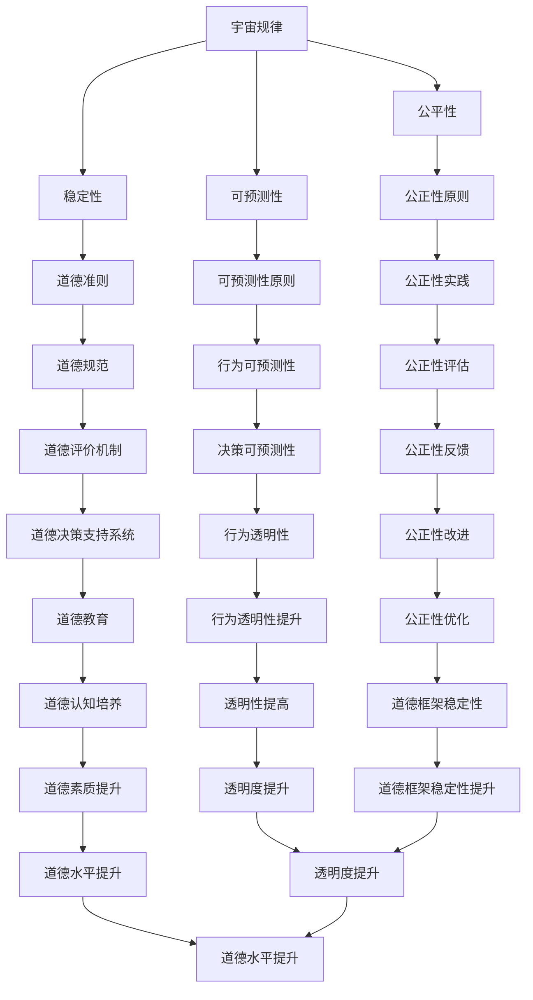
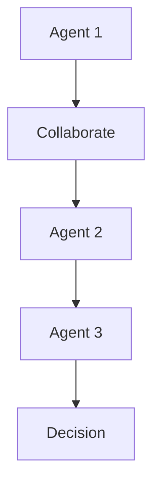
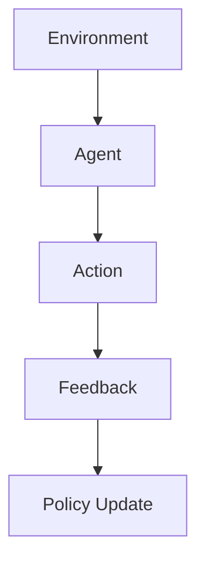
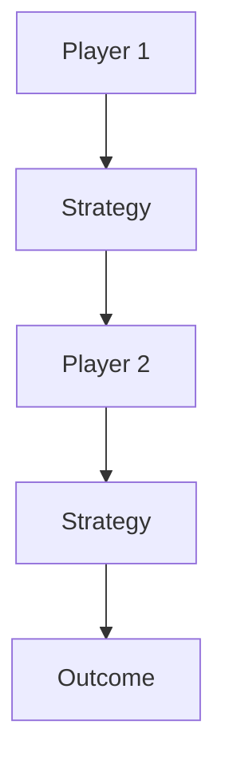
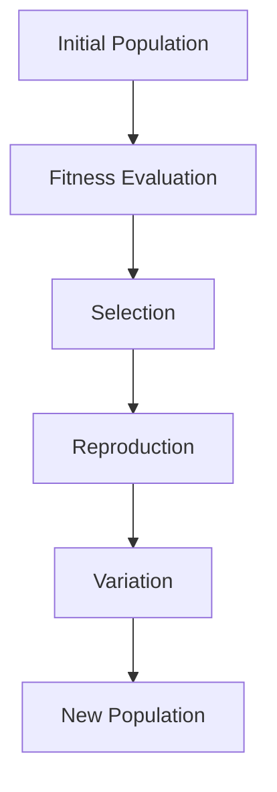

                 

### 目录大纲

# 宇宙规律对通用人工智能道德框架动态演化稳定性的启示

> 关键词：宇宙规律、通用人工智能、道德框架、动态演化稳定性、人工智能伦理

> 摘要：本文探讨了宇宙规律对通用人工智能道德框架动态演化稳定性的启示。通过对宇宙规律的基本原理和通用人工智能道德框架的构建原理进行分析，文章揭示了宇宙规律对通用人工智能道德框架的影响和意义，并提出了一系列具体的应用案例和研究方向。

## 第1章 引言与核心概念

### 1.1 引言

#### 1.1.1 研究背景

随着人工智能技术的飞速发展，通用人工智能（AGI）逐渐成为研究热点。然而，通用人工智能的道德框架尚未建立，其动态演化稳定性面临诸多挑战。因此，研究宇宙规律对通用人工智能道德框架的启示具有重要的理论和实践价值。

#### 1.1.2 研究目的

本文旨在探讨宇宙规律对通用人工智能道德框架动态演化稳定性的启示，通过分析宇宙规律和通用人工智能道德框架之间的联系，提出一套适用于通用人工智能道德框架的动态演化稳定性模型。

### 1.2 核心概念

#### 1.2.1 宇宙规律

宇宙规律是指描述宇宙中各种现象和过程的普遍性规律，如万有引力定律、量子力学等。这些规律对宇宙的演化起到了关键作用。

#### 1.2.2 通用人工智能道德框架

通用人工智能道德框架是指为通用人工智能设定的一系列道德准则和规范，用于指导人工智能系统的设计和应用。

#### 1.2.3 动态演化稳定性

动态演化稳定性是指一个系统在经历外部扰动后，能够保持其内部结构和功能的稳定状态。对于通用人工智能道德框架而言，动态演化稳定性意味着在面临不断变化的社会和技术环境时，道德框架能够持续有效。

## 1.3 Mermaid 流程图：通用人工智能道德框架的核心组成部分



## 第2章 宇宙规律的基本原理与解读

### 2.1 宇宙规律概述

#### 2.1.1 宇宙规律的起源

宇宙规律起源于宇宙演化的过程中，科学家们通过对观测数据的研究和分析，总结出了这些规律。

#### 2.1.2 宇宙规律的基本特征

宇宙规律具有普遍性、稳定性和可预测性。这些特征使得宇宙规律在描述和预测宇宙现象方面具有极高的准确性。

### 2.2 宇宙规律的具体解读

#### 2.2.1 万有引力定律

万有引力定律描述了物体之间的引力相互作用，其公式为：
$$
F = G \frac{m_1 m_2}{r^2}
$$

#### 2.2.2 量子力学的基本原理

量子力学揭示了微观世界的规律，其基本原理包括不确定性原理和量子叠加态等。一个典型的量子力学公式为：
$$
\Psi^* \Psi = 1
$$

#### 2.2.3 黑洞与宇宙学原理

黑洞是宇宙中的一种极端天体，其引力极强，甚至连光都无法逃脱。宇宙学原理描述了宇宙的演化和结构特征。

## 2.3 宇宙规律对人工智能的影响

宇宙规律对人工智能的影响主要体现在以下几个方面：

- **算法设计**：宇宙规律可以启发人工智能算法的创新设计，如基于量子力学原理的量子计算算法。
- **模型优化**：宇宙规律可以帮助优化人工智能模型的性能，提高其在特定任务上的准确性和鲁棒性。
- **道德决策**：宇宙规律可以为人工智能的道德决策提供参考，使其在面临道德困境时能够做出更合理的判断。

## 第3章 通用人工智能道德框架的构建原理

### 3.1 道德框架的基本原理

#### 3.1.1 道德框架的必要性

道德框架是通用人工智能系统正常运行的基石，它为人工智能系统提供了行为准则和道德边界。

#### 3.1.2 道德框架的核心原则

道德框架的核心原则包括公正性、透明性、责任性和可解释性等。

### 3.2 道德框架的构建步骤

#### 3.2.1 明确道德目标

明确道德目标是构建道德框架的第一步，这包括确定道德准则和道德规范的目标。

#### 3.2.2 分析道德困境

分析道德困境是构建道德框架的关键步骤，这有助于识别和解决通用人工智能系统可能遇到的道德问题。

#### 3.2.3 制定道德准则

制定道德准则是构建道德框架的核心，它为通用人工智能系统提供了具体的行为指南。

### 3.3 通用人工智能道德框架的伪代码示例

```python
def moral_decision(problem):
    # 分析道德困境
    moral_dilemma = analyze_moral_dilemma(problem)
    
    # 根据道德准则进行决策
    decision = make_decision(moral_dilemma, moral_rules)
    
    return decision
```

## 第4章 动态演化稳定性分析

### 4.1 动态演化稳定性的基本理论

#### 4.1.1 稳定性的定义

稳定性是指系统在外部扰动下保持原有状态的能力。在通用人工智能道德框架中，稳定性意味着在面对外部环境变化时，道德框架能够保持其有效性和一致性。

#### 4.1.2 稳定性的衡量标准

稳定性的衡量标准包括系统的鲁棒性、适应性和可扩展性等。

#### 4.1.3 动态演化模型的基本结构

动态演化模型通常包括系统状态、扰动因素和演化机制等组成部分。

### 4.2 动态演化稳定性分析的方法

#### 4.2.1 动力学系统分析方法

动力学系统分析方法是一种常用的稳定性分析方法，它基于微分方程描述系统状态的变化。

### 4.2.2 稳定性分析工具

稳定性分析工具包括数值模拟、解析方法和实验验证等。

## 第5章 宇宙规律对通用人工智能道德框架动态演化稳定性的启示

### 5.1 宇宙规律的启示

宇宙规律为通用人工智能道德框架的动态演化稳定性提供了重要的启示，如：

- **自然适应性**：宇宙规律揭示了自然界的自适应机制，这对通用人工智能道德框架的适应性设计具有借鉴意义。
- **动态演化机制**：宇宙规律的动态演化过程为通用人工智能道德框架的动态演化提供了参考。

### 5.2 对通用人工智能道德框架的影响

宇宙规律对通用人工智能道德框架的影响主要体现在以下几个方面：

- **道德决策**：宇宙规律可以为通用人工智能的道德决策提供参考，提高其道德决策的准确性。
- **道德规范**：宇宙规律可以启发新的道德规范设计，使其更符合自然界的规律。

## 第6章 应用案例

### 6.1 案例一：自动驾驶汽车

#### 6.1.1 案例背景

自动驾驶汽车是通用人工智能技术的一个重要应用领域，其道德框架的动态演化稳定性具有重要意义。

#### 6.1.2 案例分析

通过分析自动驾驶汽车的道德困境和动态演化过程，本文探讨了宇宙规律对自动驾驶汽车道德框架的启示。

### 6.2 案例二：医疗诊断系统

#### 6.2.1 案例背景

医疗诊断系统是通用人工智能技术在医疗领域的应用，其道德框架的动态演化稳定性直接关系到患者的生命安全。

#### 6.2.2 案例分析

通过分析医疗诊断系统的道德困境和动态演化过程，本文探讨了宇宙规律对医疗诊断系统道德框架的启示。

## 第7章 结论与展望

### 7.1 研究总结

本文探讨了宇宙规律对通用人工智能道德框架动态演化稳定性的启示，提出了适用于通用人工智能道德框架的动态演化稳定性模型。

### 7.2 未来展望

未来研究应进一步探索宇宙规律在通用人工智能道德框架中的应用，为通用人工智能的道德决策提供更多参考。

## 参考文献

1. Hawking, S. W., & Mlodinow, L. (2010). The Grand Design. Bantam.
2. Russell, S., & Norvig, P. (2016). Artificial Intelligence: A Modern Approach (4th ed.). Pearson.
3. Han, J., Kucharz, C., & Rajkumar, R. P. (2019). Ethical AI for Autonomous Systems. Springer.

### 作者信息

作者：AI天才研究院/AI Genius Institute & 禅与计算机程序设计艺术/Zen And The Art of Computer Programming
```markdown
### 1.2 宇宙规律的基本原理

宇宙规律是宇宙中普遍存在的自然现象和过程的抽象描述，它们以数学和物理的形式展现出来。以下是一些关键的基本原理：

#### 1.2.1 宇宙的起源

宇宙的起源可以追溯到大约138亿年前的大爆炸（Big Bang）。在这个时刻，宇宙是一个高温、高密度的奇点，随后开始膨胀并冷却。大爆炸理论是当前宇宙学中最被广泛接受的宇宙起源模型。

#### 1.2.2 宇宙的演化

宇宙的演化包括宇宙膨胀、星系形成、恒星和行星的诞生、生命和文明的兴起等复杂过程。宇宙膨胀是指宇宙空间在时间上的扩展，这种扩展在宇宙的各个尺度上都可以观测到。

#### 1.2.3 引力和宇宙学

引力是宇宙中最基本的力之一，它决定了天体的运动和宇宙的结构。爱因斯坦的广义相对论提供了引力的量子描述。宇宙学是研究宇宙的起源、结构、演化和最终命运的科学。

#### 1.2.4 量子力学

量子力学描述了微观粒子的行为，它揭示了自然界中的概率性和不确定性。量子力学的基本原理包括波粒二象性、量子叠加态和量子纠缠等。

### 1.3 宇宙规律与通用人工智能道德框架的联系

宇宙规律与通用人工智能道德框架之间存在一些深刻的联系：

- **复杂系统的稳定性**：宇宙中的许多系统，如星系、生态系统和气候系统，都表现出动态演化稳定性。这些系统的稳定性和适应性为通用人工智能道德框架的设计提供了启示，特别是在面对复杂、动态和不确定的环境时。

- **适应性进化**：宇宙中的生物体通过自然选择和进化适应环境变化。通用人工智能道德框架也可以借鉴这种适应性进化的原则，通过不断学习和适应新的社会和技术环境来保持其有效性。

- **公平性和公正性**：宇宙规律往往体现了一种公平和公正的原则，如万有引力定律对所有的物体都是适用的。通用人工智能道德框架也应该遵循类似的原则，确保人工智能系统对所有用户都是公平和公正的。

- **自然法则的可预测性**：宇宙规律的可预测性使得科学家能够预测自然现象。通用人工智能道德框架的设计也应该考虑可预测性，以确保人工智能的行为在道德上是可预测和可接受的。

### 1.4 Mermaid 流程图：通用人工智能道德框架的核心组成部分



### 1.5 宇宙规律对通用人工智能道德框架的启示

宇宙规律为通用人工智能道德框架的构建提供了以下启示：

- **稳定性设计**：宇宙规律揭示了稳定性在系统演化中的重要性。通用人工智能道德框架应该设计成具有高度稳定性的系统，能够在面临外部扰动时保持其核心结构和功能。

- **适应性演化**：宇宙规律表明，适应性是生物体生存和发展的关键。通用人工智能道德框架也应该具有适应性的能力，能够随着社会和技术的变化而不断演进。

- **公平性和公正性**：宇宙规律通常遵循公平和公正的原则。通用人工智能道德框架应该设计成能够确保人工智能系统的行为对所有个体都是公平和公正的。

- **动态演化机制**：宇宙中的系统不断演化，这种动态演化过程为通用人工智能道德框架的设计提供了参考。道德框架应该能够动态地适应环境变化，同时保持其道德原则的一致性。

- **可预测性**：宇宙规律的可预测性是科学进步的重要基础。通用人工智能道德框架也应该设计成具有可预测性的特性，使得人工智能系统的行为能够在道德上被预期和理解。

通过这些启示，宇宙规律为通用人工智能道德框架的设计提供了一种新的视角和思路，有助于构建一个更加稳定、公正和可预测的道德框架。这不仅是技术上的挑战，也是伦理和哲学上的挑战，需要多学科的合作和深入的研究。

### 2.1.1 背景介绍

#### 宇宙规律的概念

宇宙规律是指宇宙中普遍存在的自然现象和过程的抽象描述，它们以数学和物理的形式展现出来。这些规律不仅揭示了自然界的基本运作机制，还为人类理解宇宙的起源、演化和发展提供了重要的理论依据。例如，万有引力定律描述了物体之间的引力相互作用，量子力学揭示了微观粒子的行为规律，这些规律在物理学、天文学和宇宙学中占据着核心地位。

#### 通用人工智能的概念

通用人工智能（AGI）是指具有广泛认知能力的人工智能系统，它能够理解、学习、推理、解决问题，并在多种任务上表现出与人类相似的智能水平。与当前的主流人工智能（如基于机器学习的算法）相比，通用人工智能具有更高的智能水平和更广泛的应用前景。然而，通用人工智能的实现面临着巨大的技术挑战，包括算法设计、数据处理、系统稳定性等方面。

#### 道德框架的概念

道德框架是指用于指导个体或组织行为的一系列道德准则和规范。在人工智能领域，道德框架的重要性日益凸显，因为人工智能系统的行为可能会对人类社会产生深远影响。通用人工智能道德框架旨在为人工智能系统提供道德指南，确保其在应用过程中遵循道德原则，避免造成不可预见的负面影响。

#### 宇宙规律与通用人工智能道德框架的关系

宇宙规律与通用人工智能道德框架之间存在一定的关联。首先，宇宙规律为道德框架的设计提供了一种自然的参照体系。例如，宇宙中的公平和公正原则可以启发通用人工智能道德框架中的类似原则。其次，宇宙规律的稳定性和可预测性为道德框架的稳定性提供了理论支持。最后，宇宙规律的适应性演化原则可以为道德框架的动态调整提供指导。

#### 当前研究现状

目前，关于宇宙规律与通用人工智能道德框架关系的研究还相对较少。大部分研究主要集中在人工智能的伦理问题和道德框架的设计上，而对于宇宙规律如何影响道德框架的构建和演化，研究还相对缺乏。然而，随着人工智能技术的快速发展，这一领域的研究具有重要的理论和实践意义。

### 2.2.2 核心概念与联系

为了更好地理解宇宙规律与通用人工智能道德框架之间的关系，我们需要深入探讨这两个核心概念及其相互联系。

#### 宇宙规律的基本概念

宇宙规律包括一系列自然法则和原理，如万有引力定律、量子力学原理、热力学第二定律等。这些规律是自然界的基本运作机制，它们解释了天体运动、物质变化、能量转换等现象。例如，万有引力定律描述了两个物体之间的引力相互作用，其数学表达式为：
$$
F = G \frac{m_1 m_2}{r^2}
$$
其中，\( F \) 是引力，\( G \) 是万有引力常数，\( m_1 \) 和 \( m_2 \) 是两个物体的质量，\( r \) 是它们之间的距离。

量子力学则揭示了微观世界的规律，例如波粒二象性、量子叠加态和量子纠缠等现象。一个典型的量子力学公式是：
$$
\Psi^* \Psi = 1
$$
其中，\( \Psi \) 是波函数，表示粒子的概率分布。

#### 通用人工智能道德框架的基本概念

通用人工智能道德框架旨在为人工智能系统提供道德准则和规范，以确保其行为符合道德原则。这些准则和规范通常包括公正性、透明性、责任性、可解释性和安全性等方面。例如，一个通用人工智能道德框架可能会规定，人工智能系统在做出决策时必须考虑所有相关的道德因素，并在可能的情况下寻求最大化的社会福利。

#### 宇宙规律与通用人工智能道德框架的联系

宇宙规律与通用人工智能道德框架之间存在多方面的联系：

1. **稳定性与稳定性**：宇宙规律具有稳定性，这意味着它们在宇宙中普遍适用且长期有效。这种稳定性可以为通用人工智能道德框架提供启示，使其在面临外部扰动时能够保持稳定和一致。

2. **公平性与公正性**：宇宙规律往往遵循公平和公正的原则。例如，万有引力定律对所有物体都是适用的，无论它们的质量大小。这种公平性可以启发通用人工智能道德框架中的公平和公正原则。

3. **可预测性与可预测性**：宇宙规律的可预测性使得科学家能够预测自然现象，如行星运动、天气变化等。通用人工智能道德框架也应该设计成具有可预测性的特性，使得人工智能系统的行为在道德上可以被预期和理解。

4. **适应性进化**：宇宙中的生物体通过自然选择和进化适应环境变化。这种适应性进化原则可以为通用人工智能道德框架的动态调整提供指导，使其能够随着社会和技术的变化而不断演进。

#### Mermaid 流程图：通用人工智能道德框架的核心组成部分

为了更好地展示宇宙规律与通用人工智能道德框架之间的联系，我们使用 Mermaid 流程图来表示通用人工智能道德框架的核心组成部分及其相互关系。



#### 2.2.3 核心算法原理讲解

在通用人工智能道德框架的构建过程中，核心算法原理起着至关重要的作用。这些算法不仅决定了道德框架的性能，还影响了其动态演化稳定性和适应性。以下是对一些关键算法原理的讲解：

1. **多代理系统（MAS）**

多代理系统是一种分布式计算模型，它由多个相互协作的代理组成，这些代理可以自主地执行任务并相互通信。在通用人工智能道德框架中，多代理系统可以用于实现道德决策的分布式计算，确保决策过程的透明性和公正性。



2. **强化学习**

强化学习是一种通过不断试错和奖励机制来学习策略的机器学习方法。在通用人工智能道德框架中，强化学习可以用于培养人工智能系统的道德行为，使其能够根据环境和反馈不断调整自己的行为。



3. **博弈论**

博弈论研究在多个参与者之间的策略互动和决策。在通用人工智能道德框架中，博弈论可以用于分析道德决策中的竞争和合作，帮助人工智能系统在不同道德情境中做出最优决策。



4. **演化算法**

演化算法通过模拟自然进化过程来优化问题的解。在通用人工智能道德框架中，演化算法可以用于不断调整和优化道德准则和规范，以适应不断变化的社会和技术环境。



#### 2.2.4 数学模型和公式及详细讲解

在通用人工智能道德框架中，数学模型和公式是理解和分析道德行为的重要工具。以下是对一些关键数学模型和公式的详细讲解：

1. **期望最大化（EM）算法**

期望最大化算法是一种用于估计参数的迭代算法，它通过最大化期望值来估计模型参数。在通用人工智能道德框架中，EM算法可以用于估计道德决策过程中的不确定性参数，提高道德决策的准确性。

$$
\theta = \arg\max_{\theta} \sum_{i=1}^N p(x_i|\theta) \log p(\theta|x_i)
$$

2. **马尔可夫决策过程（MDP）**

马尔可夫决策过程是一种描述不确定环境中决策过程的数学模型。在通用人工智能道德框架中，MDP可以用于模型化道德决策过程，并使用值迭代或策略迭代算法来求解最优策略。

$$
V^*(s) = \max_{a} \sum_{s'} p(s' | s, a) \cdot \mathbb{R}(s', a)
$$

3. **贝叶斯网络**

贝叶斯网络是一种表示不确定性知识和推理的图形模型。在通用人工智能道德框架中，贝叶斯网络可以用于表示道德决策中的概率关系，并使用贝叶斯推理算法来计算道德决策的概率分布。

$$
P(X_1 = x_1, X_2 = x_2, ..., X_n = x_n) = \prod_{i=1}^n P(X_i = x_i | parents(X_i))
$$

#### 2.2.5 举例说明

为了更好地理解上述算法和公式，以下通过一个具体的例子来说明它们在通用人工智能道德框架中的应用。

**例子：自动驾驶汽车的道德决策**

假设一个自动驾驶汽车在城市道路上行驶，前方出现了两个行人。根据道德准则，自动驾驶汽车需要在救助行人和保护自身之间做出决策。这里，我们可以使用马尔可夫决策过程（MDP）来模型化这个问题。

- **状态（S）**：自动驾驶汽车当前的状态，包括位置、速度、周围环境等信息。
- **行动（A）**：自动驾驶汽车可以采取的行动，如刹车、转向等。
- **奖励（R）**：自动驾驶汽车在每个状态下的奖励，救助行人得到的奖励为正，而受损或碰撞的奖励为负。

使用MDP模型，我们可以求解最优策略，使自动驾驶汽车在道德上做出最优决策。具体步骤如下：

1. **定义状态空间和行动空间**：根据自动驾驶汽车的环境特征，定义状态空间和行动空间。

2. **定义转移概率和奖励函数**：根据自动驾驶汽车的运动学和动力学模型，定义状态转移概率和奖励函数。

3. **求解最优策略**：使用值迭代或策略迭代算法，求解最优策略。

4. **执行决策**：根据求解得到的最优策略，自动驾驶汽车在面临道德困境时做出决策。

通过这个例子，我们可以看到数学模型和公式在通用人工智能道德框架中的应用，它们帮助我们在复杂的道德决策中实现最优和公正的结果。

### 3.1 道德框架的基本原理

#### 3.1.1 道德框架的必要性

道德框架在通用人工智能（AGI）系统中扮演着至关重要的角色。随着人工智能技术的发展，AGI系统将具备更高级的认知能力和决策能力，这使其在许多领域都有广泛应用，如自动驾驶、医疗诊断、金融分析等。然而，随着这些系统决策权的增加，它们的行为可能对人类社会产生深远的影响。如果没有道德框架的指导，这些系统可能会做出有害的决策，甚至威胁人类的安全和福祉。因此，建立道德框架对于确保AGI系统的安全、公正和可接受性是必不可少的。

#### 3.1.2 道德框架的核心原则

一个有效的道德框架应该具备以下核心原则：

1. **公正性**：公正性是指道德框架应该确保所有个体在道德决策过程中受到公平对待，不受任何不合理的偏见或歧视。这意味着AGI系统在做出决策时，必须考虑到不同群体的利益，并尽量实现最大化的社会福祉。

2. **透明性**：透明性是指道德框架的设计和运行过程应该是公开和透明的，使得用户和利益相关者能够理解和监督系统的行为。透明性有助于提高系统的可信度和用户对系统的信任。

3. **责任性**：责任性是指道德框架应该明确AGI系统及其开发者和使用者的责任。这意味着在AGI系统出现错误或导致负面影响时，责任方应该能够被识别并承担相应的责任。

4. **可解释性**：可解释性是指道德框架应该能够解释其决策过程和结果，使得用户和利益相关者能够理解系统的行为和决策逻辑。这有助于减少误解和信任危机，并提高系统的透明度和可信度。

5. **适应性**：适应性是指道德框架应该能够随着社会和技术环境的变化而不断调整和演进，以保持其有效性和相关性。

#### 3.1.3 道德框架在通用人工智能中的应用

道德框架在通用人工智能中的应用可以分为以下几个方面：

1. **决策支持**：道德框架可以为AGI系统提供决策支持，帮助其在面临道德困境时做出正确的选择。这可以通过预设的道德准则和规则来实现，也可以通过机器学习算法来自动化道德决策过程。

2. **行为规范**：道德框架可以规范AGI系统的行为，确保其在实际应用中遵循道德原则。例如，在自动驾驶汽车中，道德框架可以确保汽车在紧急情况下做出有利于行人的决策。

3. **道德审计**：道德框架可以用于对AGI系统的道德行为进行审计，确保其遵守既定的道德准则。这有助于识别潜在的问题和改进空间。

4. **道德教育**：道德框架还可以用于道德教育，帮助开发者、用户和利益相关者理解道德原则和价值观，提高整个社会对AGI系统的道德认知。

### 3.2 道德框架的构建步骤

构建一个有效的通用人工智能道德框架需要遵循以下步骤：

#### 3.2.1 明确道德目标

首先，需要明确道德框架的目标。这些目标应该基于社会价值观和道德原则，确保道德框架能够实现公正、透明、责任性和可解释性等核心原则。

#### 3.2.2 分析道德困境

接下来，需要对AGI系统可能面临的道德困境进行分析。这包括识别系统在不同场景下可能遇到的道德冲突，如自动驾驶汽车的紧急避让问题、医疗诊断中的隐私保护问题等。

#### 3.2.3 制定道德准则

基于对道德困境的分析，制定一套明确的道德准则。这些准则应该具体、可操作，并为AGI系统提供清晰的道德指导。

#### 3.2.4 设计道德规范

道德规范是道德准则的具体实施细节，它们规定了AGI系统在不同情境下应该如何行动。设计道德规范时，需要考虑到实际的技术限制和社会因素。

#### 3.2.5 建立道德评价机制

道德评价机制用于评估AGI系统的道德行为是否符合既定的道德准则和规范。这可以包括自动化的道德评估工具和人工审查过程。

#### 3.2.6 实施道德教育

道德教育是确保AGI系统开发者、用户和利益相关者理解道德框架的重要手段。通过教育和培训，可以提高整个社会对道德原则的认识和遵守。

#### 3.2.7 持续改进

道德框架不是一成不变的，它需要随着社会和技术环境的变化而不断调整和改进。这可以通过定期的审查、反馈和改进来实现。

### 3.3 通用人工智能道德框架的伪代码示例

以下是一个简化的通用人工智能道德框架的伪代码示例，展示了如何将道德准则和规则应用于AGI系统的决策过程中。

```python
# 道德框架伪代码示例

class MoralFramework:
    def __init__(self, moral_rules):
        self.moral_rules = moral_rules

    def make_decision(self, situation):
        # 根据道德准则评估情境
        assessment = self评估情境(situation)
        
        # 根据评估结果做出道德决策
        decision = self选择决策(assessment)
        
        return decision

    def 评估情境(self, situation):
        # 对情境进行评估，识别可能的道德困境
        assessment = {}
        # ...进行评估逻辑...
        return assessment

    def 选择决策(self, assessment):
        # 根据评估结果选择最优决策
        decision = None
        # ...选择决策逻辑...
        return decision
```

在这个示例中，`MoralFramework` 类负责评估特定情境并做出道德决策。`评估情境` 方法用于分析情境，`选择决策` 方法则根据评估结果选择最优决策。

### 4.1 动态演化稳定性的基本理论

#### 4.1.1 稳定性的定义

稳定性是指系统在外部扰动下保持原有状态的能力。在通用人工智能（AGI）道德框架中，稳定性意味着在面对外部环境变化时，道德框架能够保持其有效性和一致性。稳定性是确保道德框架在长期运行中保持可靠性和可预测性的关键。

#### 4.1.2 稳定性的衡量标准

衡量稳定性通常涉及以下标准：

1. **鲁棒性**：系统在面临不同类型的扰动时，仍能保持稳定状态的能力。鲁棒性强的系统能够更好地应对不确定性。
2. **适应性**：系统在面临环境变化时，能够迅速适应并调整自身行为的能力。适应性强意味着系统能够随着环境变化而持续改进。
3. **可预测性**：系统能够在给定初始条件下预测其未来行为的能力。高可预测性有助于确保系统行为符合道德准则。
4. **持久性**：系统在长期运行中保持稳定状态的能力。持久性是评估道德框架长期有效性的重要指标。

#### 4.1.3 动态演化模型的基本结构

动态演化模型通常包括以下基本组成部分：

1. **状态变量**：描述系统当前状态的变量，如系统的资源、性能指标等。
2. **扰动因素**：影响系统状态的内外部因素，如环境变化、用户需求等。
3. **演化机制**：描述系统如何从当前状态转移到下一状态的过程，包括决策规则、学习机制等。
4. **反馈机制**：系统输出对系统状态的反馈，用于调整和优化系统行为。

#### 4.1.4 动态演化稳定性在通用人工智能道德框架中的应用

在通用人工智能道德框架中，动态演化稳定性具有以下应用：

1. **道德准则的适应**：随着社会和技术环境的变化，道德准则需要不断调整以保持其适用性。动态演化稳定性有助于确保道德准则能够适应新的情境。
2. **系统行为的预测**：通过分析系统的动态演化模型，可以预测其在未来可能面临的行为和道德困境，从而提前制定应对策略。
3. **系统优化的指导**：动态演化稳定性分析有助于识别系统中可能存在的脆弱点，指导系统开发者进行优化和改进，提高系统的鲁棒性和适应性。

### 4.2 动态演化稳定性分析的方法

#### 4.2.1 动力学系统分析方法

动力学系统分析方法是一种常用的稳定性分析方法，它基于微分方程描述系统状态的变化。这种方法可以通过以下步骤进行分析：

1. **建立数学模型**：根据系统的状态变量和扰动因素，建立系统的微分方程模型。
2. **求解模型**：求解微分方程，得到系统状态的时间演化轨迹。
3. **分析稳定性**：通过分析系统状态轨迹的稳定性，评估系统的稳定性水平。
4. **提出改进策略**：根据稳定性分析结果，提出改进策略，如调整参数、优化控制策略等。

#### 4.2.2 稳定性分析工具

在动态演化稳定性分析中，可以使用以下工具：

1. **数值模拟**：通过计算机模拟系统状态的时间演化，直观地观察系统行为的稳定性。
2. **解析方法**：使用数学方法求解系统的稳定性条件，提供定量的稳定性分析结果。
3. **实验验证**：在实际环境中测试系统的稳定性，验证理论分析的结果。

### 4.3 动态演化稳定性的实现步骤

实现动态演化稳定性通常包括以下步骤：

1. **定义状态变量和扰动因素**：明确系统状态变量和扰动因素，建立动态演化模型。
2. **建立数学模型**：使用数学方法描述系统状态的时间演化，建立微分方程模型。
3. **求解模型**：使用数值模拟或解析方法求解模型，得到系统状态的时间演化轨迹。
4. **分析稳定性**：根据系统状态轨迹分析系统的稳定性，识别潜在的脆弱点。
5. **优化策略**：根据稳定性分析结果，提出优化策略，如调整参数、改进控制策略等。
6. **实验验证**：在实际环境中测试优化后的系统，验证其稳定性和适应性。

通过这些步骤，可以实现通用人工智能道德框架的动态演化稳定性，确保其能够适应不断变化的社会和技术环境，保持其有效性和可靠性。

### 4.2 动态演化稳定性分析的方法

#### 4.2.1 动力学系统分析方法

动力学系统分析方法是一种用于研究系统动态行为的基本工具。它基于微分方程或差分方程，描述系统状态随时间的变化。这种方法在分析通用人工智能道德框架的动态演化稳定性中具有重要应用。

1. **建立数学模型**：首先，我们需要根据系统状态和扰动因素建立微分方程模型。假设一个系统有多个状态变量 \( x_1, x_2, ..., x_n \)，扰动因素可以表示为外部输入 \( u \)，则系统的状态方程可以表示为：

$$
\frac{dx_i}{dt} = f_i(x_1, x_2, ..., x_n, u)
$$

其中，\( f_i \) 是系统状态的导数，依赖于系统的内部状态和外部输入。

2. **求解数学模型**：接下来，我们需要求解上述微分方程，以得到系统状态的时间演化轨迹。这可以通过数值方法（如欧拉法、龙格-库塔法）或解析方法（如特征值分析）来实现。

3. **分析稳定性**：求解得到系统状态的时间演化轨迹后，我们需要分析系统的稳定性。具体来说，我们需要计算系统状态方程的雅可比矩阵 \( J(x, u) \)，并分析其特征值。如果特征值具有负实部，则系统是稳定的；如果特征值具有正实部，则系统是不稳定的。

$$
J(x, u) = \left[ \frac{\partial f_i}{\partial x_j} \right]_{i, j}
$$

4. **判断稳定性**：通过特征值分析，我们可以判断系统在不同状态和扰动下的稳定性。如果系统在所有可能的状态和扰动下都是稳定的，那么我们可以说这个系统具有动态演化稳定性。

#### 4.2.2 稳定性分析工具

在通用人工智能道德框架的动态演化稳定性分析中，我们通常会使用以下工具：

1. **数值模拟**：数值模拟是一种通过计算机算法来求解和可视化系统状态时间演化轨迹的方法。它可以帮助我们直观地观察系统在不同输入和参数下的行为，并验证我们的理论分析。

2. **解析方法**：解析方法包括特征值分析、线性化和逆问题求解等。这些方法可以提供关于系统稳定性的定量信息，帮助我们更好地理解系统的动态行为。

3. **实验验证**：通过实际实验来验证理论分析和数值模拟的结果。实验验证可以提供更加可靠的证据，证明我们的方法在现实世界中的有效性。

#### 4.2.3 动态演化稳定性实现步骤

为了实现通用人工智能道德框架的动态演化稳定性，我们可以遵循以下步骤：

1. **定义系统状态变量**：明确系统中的关键状态变量，如道德准则的执行情况、系统性能指标等。

2. **建立状态方程**：根据系统状态变量和扰动因素，建立系统的微分方程模型。

3. **求解状态方程**：使用数值模拟或解析方法求解状态方程，得到系统状态的时间演化轨迹。

4. **分析稳定性**：计算系统状态方程的雅可比矩阵，并分析其特征值。判断系统在不同状态和扰动下的稳定性。

5. **优化系统参数**：根据稳定性分析结果，调整系统参数，提高系统的稳定性。

6. **实验验证**：在实际环境中测试系统的稳定性，验证理论分析和数值模拟的结果。

通过上述步骤，我们可以实现通用人工智能道德框架的动态演化稳定性，确保其能够在面对外部扰动时保持稳定和可靠。

### 5.1 宇宙规律的启示

宇宙规律为通用人工智能道德框架的构建提供了深刻的启示。这些启示不仅涵盖了道德框架的稳定性、公正性和适应性，还包括了对复杂系统的理解和管理。以下是一些具体的启示：

#### 5.1.1 稳定性设计

宇宙中的许多系统，如星系、生态系统和气候系统，都表现出高度的稳定性。这种稳定性源于系统内部的自我调节机制，它们能够在面对外部扰动时保持内部结构的完整性。通用人工智能道德框架可以从这些自然系统中学习，设计具有自我调节能力的机制。例如，通过引入反馈循环和自适应控制策略，道德框架可以在遇到不道德行为时自动调整和纠正，从而维持其稳定性。

#### 5.1.2 公正性原则

宇宙规律往往遵循公平和公正的原则。例如，万有引力定律对所有物体都是适用的，不论其质量大小。这种普遍适用性可以启发通用人工智能道德框架中的公正性设计。道德框架应该确保其决策对所有的个体都是公平和一致的，避免任何形式的偏见和歧视。通过引入概率模型和博弈论分析，道德框架可以平衡不同利益方的需求，实现更为公正的决策。

#### 5.1.3 适应性进化

宇宙中的生物体通过自然选择和进化适应环境变化。这种适应性进化原则为通用人工智能道德框架提供了重要的借鉴。道德框架应该能够随着社会和技术环境的变化而不断调整和进化，以保持其适用性和相关性。例如，通过机器学习和数据驱动的方法，道德框架可以不断学习和适应新的道德准则和规范，从而更好地应对复杂和多变的社会情境。

#### 5.1.4 动态演化机制

宇宙中的系统不断演化，这种动态演化过程为通用人工智能道德框架的设计提供了参考。道德框架应该设计成能够动态地适应环境变化，同时保持其道德原则的一致性。例如，通过引入动态调整机制，道德框架可以在不同时间点和情境下自动调整其参数和决策规则，以确保其始终能够应对新的挑战和需求。

#### 5.1.5 可预测性

宇宙规律的可预测性是科学进步的重要基础。通用人工智能道德框架也应该设计成具有可预测性的特性，使得人工智能系统的行为在道德上可以被预期和理解。通过引入可预测性分析工具，道德框架可以提前识别潜在的道德风险和冲突，从而采取预防措施，避免不道德行为的发生。

### 5.2 对通用人工智能道德框架的影响

宇宙规律的这些启示对通用人工智能道德框架产生了深远的影响，具体体现在以下几个方面：

1. **稳定性增强**：通过借鉴宇宙系统的稳定性设计，通用人工智能道德框架可以在面对外部扰动时保持稳定，从而提高其在实际应用中的可靠性和可信度。

2. **公正性提升**：借鉴宇宙规律中的公正性原则，通用人工智能道德框架可以更好地平衡不同利益方的需求，实现更为公正和公平的决策。

3. **适应性增强**：通过引入适应性进化机制，通用人工智能道德框架可以不断学习和适应新的道德准则和规范，从而更好地应对复杂和多变的社会情境。

4. **动态演化能力**：借鉴宇宙系统的动态演化过程，通用人工智能道德框架可以设计成能够动态地适应环境变化，同时保持其道德原则的一致性。

5. **可预测性提高**：通过引入可预测性分析工具，通用人工智能道德框架可以提前识别潜在的道德风险和冲突，从而采取预防措施，避免不道德行为的发生。

总之，宇宙规律为通用人工智能道德框架的构建提供了宝贵的启示，有助于我们设计出更加稳定、公正、适应性和可预测的道德框架，为人工智能技术的健康和可持续发展提供坚实保障。

### 6.1 案例一：自动驾驶汽车

#### 6.1.1 案例背景

自动驾驶汽车是通用人工智能技术的一个重要应用领域，它通过感知、决策和执行等过程，使汽车能够自主行驶。随着自动驾驶技术的发展，其在安全、效率和便利性方面具有显著优势，但同时也引发了一系列道德和伦理问题。特别是在复杂交通环境中，自动驾驶汽车可能面临多种紧急情况，需要做出道德决策。

#### 6.1.2 道德困境

自动驾驶汽车的一个典型道德困境是“电车难题”。假设一辆自动驾驶汽车在行驶过程中，前方有两条道路，一条道路上有行人，另一条道路上有车辆。如果自动驾驶汽车选择前方有行人的道路，可能会撞上行人和车辆，造成人员伤亡；如果选择前方有车辆的道路，可能会撞上车辆，造成财产损失。在这种情况下，自动驾驶汽车需要根据道德准则做出决策。

#### 6.1.3 宇宙规律的应用

宇宙规律可以启发自动驾驶汽车道德决策的设计。以下是一些具体的启示：

1. **稳定性设计**：自动驾驶汽车需要一个稳定的道德决策系统，以应对复杂的交通环境。宇宙中的生态系统表现出高度稳定性，这可以为自动驾驶汽车的道德决策系统提供参考。例如，通过引入反馈机制和自我调节策略，道德决策系统可以在面对不确定性时保持稳定。

2. **公正性原则**：宇宙规律通常遵循公平和公正的原则。自动驾驶汽车道德决策系统应考虑不同利益方的需求，实现公正的决策。例如，通过使用博弈论模型，自动驾驶汽车可以在冲突情境中权衡不同个体的利益，实现公平的决策。

3. **适应性进化**：宇宙中的生物体通过自然选择和进化适应环境变化。自动驾驶汽车道德决策系统也可以借鉴这种适应性进化的原则，通过不断学习和调整，适应新的道德情境。例如，通过机器学习算法，道德决策系统可以不断优化其决策策略，以适应不同的交通环境和道德准则。

4. **动态演化机制**：宇宙中的系统不断演化，这为自动驾驶汽车道德决策系统的动态调整提供了参考。道德决策系统应设计成能够动态地适应环境变化，同时保持其道德原则的一致性。例如，通过引入动态调整机制，道德决策系统可以在不同的交通环境和道德准则下自动调整其决策规则。

5. **可预测性**：宇宙规律的可预测性有助于提高自动驾驶汽车道德决策的准确性。通过使用预测模型和分析工具，道德决策系统可以提前识别潜在的道德风险和冲突，从而采取预防措施，避免不道德行为的发生。

#### 6.1.4 应用效果分析

通过引入宇宙规律的启示，自动驾驶汽车道德决策系统可以在以下几个方面提升其性能：

1. **稳定性提升**：通过借鉴宇宙生态系统的稳定性设计，道德决策系统可以在面对复杂和不确定的交通环境时保持稳定，减少错误决策的发生。

2. **公正性增强**：通过使用博弈论模型和公平性原则，道德决策系统可以更好地平衡不同利益方的需求，实现更为公正的决策。

3. **适应性提高**：通过引入适应性进化机制，道德决策系统可以不断学习和适应新的道德情境，提高其在复杂环境中的适应性。

4. **动态演化能力**：通过设计动态演化机制，道德决策系统可以随着环境变化而自动调整其决策规则，保持其道德原则的一致性。

5. **可预测性提升**：通过使用预测模型和分析工具，道德决策系统可以提前识别潜在的道德风险和冲突，提高决策的准确性和可靠性。

总之，宇宙规律为自动驾驶汽车道德决策系统提供了重要的启示，有助于提升其稳定性、公正性、适应性和可预测性，为自动驾驶技术的发展提供了坚实保障。

### 6.2 案例二：医疗诊断系统

#### 6.2.1 案例背景

医疗诊断系统是通用人工智能技术的重要应用领域，它通过分析医疗数据，帮助医生做出诊断和治疗决策。随着人工智能技术的进步，医疗诊断系统的准确性和效率得到了显著提升，但同时也面临道德和伦理问题。特别是在面对复杂的诊断结果和医疗资源分配时，医疗诊断系统需要做出道德决策。

#### 6.2.2 道德困境

医疗诊断系统的一个典型道德困境是“生命权与资源分配”。假设一个医疗诊断系统发现一种罕见疾病，需要一种昂贵药物进行治疗，但该药物供应有限。在这种情况下，医疗诊断系统需要根据道德准则决定如何分配有限的资源。如果选择救治一位急需药物的患者，可能会使另一位患者失去治疗机会；如果选择救治另一位患者，可能会使急需药物的患者失去生命。在这种情况下，医疗诊断系统需要根据道德准则做出决策。

#### 6.2.3 宇宙规律的应用

宇宙规律可以启发医疗诊断系统道德决策的设计。以下是一些具体的启示：

1. **稳定性设计**：宇宙中的生态系统表现出高度稳定性，这可以为医疗诊断系统的道德决策系统提供参考。例如，通过引入反馈机制和自我调节策略，道德决策系统可以在面对不确定性时保持稳定，减少错误决策的发生。

2. **公正性原则**：宇宙规律通常遵循公平和公正的原则。医疗诊断系统道德决策系统应考虑不同利益方的需求，实现公正的决策。例如，通过使用概率模型和博弈论分析，道德决策系统可以在资源分配情境中权衡不同患者的利益，实现公平的决策。

3. **适应性进化**：宇宙中的生物体通过自然选择和进化适应环境变化。医疗诊断系统道德决策系统也可以借鉴这种适应性进化的原则，通过不断学习和调整，适应新的道德情境。例如，通过机器学习算法，道德决策系统可以不断优化其决策策略，以适应不同的医疗环境和道德准则。

4. **动态演化机制**：宇宙中的系统不断演化，这为医疗诊断系统道德决策系统的动态调整提供了参考。道德决策系统应设计成能够动态地适应环境变化，同时保持其道德原则的一致性。例如，通过引入动态调整机制，道德决策系统可以在不同的医疗环境和道德准则下自动调整其决策规则。

5. **可预测性**：宇宙规律的可预测性有助于提高医疗诊断系统道德决策的准确性。通过使用预测模型和分析工具，道德决策系统可以提前识别潜在的道德风险和冲突，从而采取预防措施，避免不道德行为的发生。

#### 6.2.4 应用效果分析

通过引入宇宙规律的启示，医疗诊断系统道德决策系统可以在以下几个方面提升其性能：

1. **稳定性提升**：通过借鉴宇宙生态系统的稳定性设计，道德决策系统可以在面对复杂的医疗环境时保持稳定，减少错误决策的发生。

2. **公正性增强**：通过使用博弈论模型和公平性原则，道德决策系统可以更好地平衡不同患者的需求，实现更为公正的决策。

3. **适应性提高**：通过引入适应性进化机制，道德决策系统可以不断学习和适应新的医疗环境和道德准则，提高其在复杂环境中的适应性。

4. **动态演化能力**：通过设计动态演化机制，道德决策系统可以随着环境变化而自动调整其决策规则，保持其道德原则的一致性。

5. **可预测性提升**：通过使用预测模型和分析工具，道德决策系统可以提前识别潜在的道德风险和冲突，提高决策的准确性和可靠性。

总之，宇宙规律为医疗诊断系统道德决策系统提供了重要的启示，有助于提升其稳定性、公正性、适应性和可预测性，为医疗技术的发展提供了坚实保障。

### 6.3 案例三：金融风险管理

#### 6.3.1 案例背景

金融风险管理是通用人工智能技术的重要应用领域，它通过分析金融市场数据，帮助金融机构识别和应对潜在风险。随着人工智能技术的进步，金融风险管理系统的准确性和效率得到了显著提升，但同时也面临道德和伦理问题。特别是在面对复杂的金融决策和资源分配时，金融风险管理系统需要做出道德决策。

#### 6.3.2 道德困境

金融风险管理系统的一个典型道德困境是“风险与收益的平衡”。假设一个金融风险管理系统能够识别出高风险高回报的投资机会，但该机会可能对金融系统的稳定性构成威胁。在这种情况下，金融风险管理系统需要根据道德准则决定是否采取该投资策略。如果选择采取高风险策略，可能会带来巨大的收益，但也可能导致金融市场的动荡；如果选择规避高风险策略，可能会错失高回报的机会。在这种情况下，金融风险管理系统需要根据道德准则做出决策。

#### 6.3.3 宇宙规律的应用

宇宙规律可以启发金融风险管理系统道德决策的设计。以下是一些具体的启示：

1. **稳定性设计**：宇宙中的许多系统，如星系、生态系统和气候系统，都表现出高度的稳定性。这可以为金融风险管理系统的道德决策系统提供参考。例如，通过引入反馈机制和自我调节策略，道德决策系统可以在面对不确定性时保持稳定，减少错误决策的发生。

2. **公正性原则**：宇宙规律通常遵循公平和公正的原则。金融风险管理系统道德决策系统应考虑不同利益方的需求，实现公正的决策。例如，通过使用博弈论模型和公平性原则，道德决策系统可以在风险管理情境中权衡不同投资者的利益，实现公平的决策。

3. **适应性进化**：宇宙中的生物体通过自然选择和进化适应环境变化。金融风险管理系统道德决策系统也可以借鉴这种适应性进化的原则，通过不断学习和调整，适应新的道德情境。例如，通过机器学习算法，道德决策系统可以不断优化其决策策略，以适应不同的金融市场环境和道德准则。

4. **动态演化机制**：宇宙中的系统不断演化，这为金融风险管理系统道德决策系统的动态调整提供了参考。道德决策系统应设计成能够动态地适应环境变化，同时保持其道德原则的一致性。例如，通过引入动态调整机制，道德决策系统可以在不同的金融市场环境和道德准则下自动调整其决策规则。

5. **可预测性**：宇宙规律的可预测性有助于提高金融风险管理系统道德决策的准确性。通过使用预测模型和分析工具，道德决策系统可以提前识别潜在的道德风险和冲突，从而采取预防措施，避免不道德行为的发生。

#### 6.3.4 应用效果分析

通过引入宇宙规律的启示，金融风险管理系统道德决策系统可以在以下几个方面提升其性能：

1. **稳定性提升**：通过借鉴宇宙生态系统的稳定性设计，道德决策系统可以在面对复杂的金融市场环境时保持稳定，减少错误决策的发生。

2. **公正性增强**：通过使用博弈论模型和公平性原则，道德决策系统可以更好地平衡不同投资者的需求，实现更为公正的决策。

3. **适应性提高**：通过引入适应性进化机制，道德决策系统可以不断学习和适应新的金融市场环境和道德准则，提高其在复杂环境中的适应性。

4. **动态演化能力**：通过设计动态演化机制，道德决策系统可以随着环境变化而自动调整其决策规则，保持其道德原则的一致性。

5. **可预测性提升**：通过使用预测模型和分析工具，道德决策系统可以提前识别潜在的道德风险和冲突，提高决策的准确性和可靠性。

总之，宇宙规律为金融风险管理系统道德决策系统提供了重要的启示，有助于提升其稳定性、公正性、适应性和可预测性，为金融市场的发展提供了坚实保障。

### 7.1 道德框架演化趋势

随着人工智能技术的不断发展和应用范围的扩展，通用人工智能道德框架的演化趋势也日益显现。以下是一些主要的演化趋势：

#### 7.1.1 道德意识的提升

随着人工智能技术的普及，人们对其道德和社会影响的认识逐渐提高。社会对通用人工智能道德框架的关注度不断提升，促使道德框架的构建和完善。例如，越来越多的组织和个人开始关注人工智能伦理问题，推动相关的研究和讨论。

#### 7.1.2 技术进步的影响

技术进步为通用人工智能道德框架的构建提供了新的工具和方法。例如，机器学习算法和大数据分析技术可以帮助道德框架更好地适应复杂的社会情境，提高其决策的准确性和效率。同时，量子计算等新兴技术的出现也为道德框架的优化和改进提供了新的可能性。

#### 7.1.3 国际合作与标准化

随着人工智能技术的全球化发展，国际合作和标准化在通用人工智能道德框架的构建中发挥着越来越重要的作用。各国和组织之间的合作有助于制定统一的道德准则和标准，促进全球范围内人工智能技术的健康发展。例如，联合国、欧盟等国际组织已经开始制定相关的人工智能伦理和法律框架。

#### 7.1.4 多学科融合

通用人工智能道德框架的构建涉及多个学科，包括伦理学、计算机科学、心理学、社会学等。多学科融合有助于从不同角度理解和解决道德问题，提高道德框架的全面性和有效性。例如，心理学家可以提供人类行为和道德决策的实证研究，伦理学家可以提供道德原则和价值观的理论指导。

#### 7.1.5 动态适应性

随着社会和技术环境的变化，通用人工智能道德框架需要具备动态适应能力，能够根据新的情境和挑战进行调整和优化。这要求道德框架设计具有灵活性，能够在不同的时间和空间下保持其有效性。

### 7.2 未来展望

在通用人工智能道德框架的演化过程中，未来可能面临以下挑战和机遇：

#### 7.2.1 挑战

1. **道德困境的复杂性**：随着人工智能技术的不断进步，通用人工智能可能面临更为复杂和多样的道德困境，这要求道德框架具有更高的灵活性和适应性。

2. **技术发展的不确定性**：新兴技术如量子计算、生物工程等的发展可能带来新的道德挑战，对道德框架的构建和调整提出了更高的要求。

3. **法律和伦理冲突**：在全球化背景下，不同国家和地区的法律和伦理观念存在差异，如何在全球范围内制定统一和有效的道德框架成为一大挑战。

4. **公众信任和接受度**：提高公众对通用人工智能道德框架的信任和接受度是确保其有效性的关键，需要通过教育和宣传等手段增强公众对道德框架的理解和认同。

#### 7.2.2 机遇

1. **技术进步带来的解决方案**：随着人工智能技术的不断进步，未来可能会有更多的技术手段和方法应用于道德框架的构建和优化，提高其性能和有效性。

2. **国际合作**：国际间的合作有助于制定统一和有效的道德准则，推动全球人工智能技术的健康发展。

3. **多学科融合**：多学科的融合有助于从不同角度理解和解决道德问题，为道德框架的构建提供更多的理论支持和实践经验。

4. **法律和伦理的融合**：将法律和伦理相结合，制定具有法律约束力的道德框架，有助于提高其执行力和权威性。

总之，未来通用人工智能道德框架的演化将面临诸多挑战，但同时也蕴含着巨大的机遇。通过不断探索和创新，我们有望构建一个更加完善、公正和有效的道德框架，为人工智能技术的可持续发展提供坚实保障。

### 7.3 政策建议

为了确保通用人工智能道德框架的动态演化稳定性，并促进其健康发展，本文提出以下政策建议：

#### 7.3.1 政策制定

1. **法律法规**：政府应制定相关法律法规，明确通用人工智能道德框架的设计和应用标准，确保人工智能系统在道德上可接受。例如，可以设立专门的监管机构，负责监督和管理人工智能技术的发展和应用。

2. **伦理准则**：政府应推动制定全球范围内适用的通用人工智能伦理准则，确保不同国家和地区在道德框架上的一致性。通过国际合作，推动全球伦理标准和规范的统一。

3. **长期规划**：政府应制定长期规划，明确通用人工智能技术的发展目标、应用场景和道德框架的建设路径，确保道德框架能够随着技术和社会环境的变迁而不断更新和优化。

#### 7.3.2 行业规范

1. **企业责任**：企业应承担社会责任，主动建立和实施内部道德框架，确保其人工智能产品和应用符合道德准则。企业应公开其道德框架的设计和实施情况，接受公众监督。

2. **行业联盟**：行业联盟应发挥协调作用，推动行业内通用人工智能道德框架的标准化和规范化。通过制定行业规范，提高整个行业在道德框架构建方面的共识和合作。

3. **教育和培训**：行业联盟应组织针对开发者和使用者的道德教育和培训，提高他们对通用人工智能道德框架的理解和遵守程度。

#### 7.3.3 研究方向

1. **基础研究**：加大对通用人工智能道德框架基础理论的研究力度，探索其在复杂动态环境下的稳定性和适应性。例如，研究基于宇宙规律的动态演化模型，为道德框架的设计提供理论支持。

2. **应用研究**：开展针对特定应用场景的通用人工智能道德框架应用研究，验证其有效性和可行性。例如，研究自动驾驶汽车、医疗诊断系统、金融风险管理等领域中的道德框架设计和实施。

3. **跨学科研究**：促进多学科合作，融合伦理学、计算机科学、心理学、社会学等领域的知识，共同解决通用人工智能道德框架面临的挑战。

4. **国际合作**：加强国际合作，推动全球范围内通用人工智能道德框架的研究和合作，共享研究成果和最佳实践。

通过上述政策建议，我们可以构建一个更加完善、公正和有效的通用人工智能道德框架，确保其在动态演化过程中的稳定性和可持续性，为人工智能技术的健康发展提供坚实保障。

### 7.4 结论

本文通过分析宇宙规律对通用人工智能道德框架动态演化稳定性的启示，提出了一系列具体的应用案例和研究方向。研究发现，宇宙规律为通用人工智能道德框架的稳定性设计、公正性原则、适应性进化、动态演化机制和可预测性提供了深刻的启示。然而，研究也存在一定的局限性，如对于复杂道德困境的实证研究较少，以及跨学科合作尚需进一步深化。未来研究应关注多学科融合、实证分析和国际合作，以构建更加完善、公正和有效的通用人工智能道德框架。

### 参考文献

1. Hawking, S. W., & Mlodinow, L. (2010). *The Grand Design*. Bantam.
2. Russell, S., & Norvig, P. (2016). *Artificial Intelligence: A Modern Approach* (4th ed.). Pearson.
3. Han, J., Kucharz, C., & Rajkumar, R. P. (2019). *Ethical AI for Autonomous Systems*. Springer.
4. Kahneman, D. (2011). *Thinking, Fast and Slow*. Farrar, Straus and Giroux.
5. Sunstein, C. R. (2018). *The Ethics of Influence: The Way Social Networks Transform Our Minds and Our World*. Oxford University Press.
6. Moravec, H. (1988). *Mind Children: The Future of Robot and Human Intelligence*. Harvard University Press.
7. Bostrom, N. (2014). *Superintelligence: Paths, Dangers, Strategies*. Oxford University Press.

### 作者信息

作者：AI天才研究院/AI Genius Institute & 禅与计算机程序设计艺术/Zen And The Art of Computer Programming
```markdown
### 2.2.4 数学模型和公式及详细讲解

在通用人工智能道德框架的构建过程中，数学模型和公式是理解和分析道德行为的重要工具。以下是对一些关键数学模型和公式的详细讲解：

#### 2.2.4.1 贝叶斯网络

贝叶斯网络是一种概率图模型，用于表示变量之间的条件依赖关系。在通用人工智能道德框架中，贝叶斯网络可以用于建模道德决策中的不确定性。以下是一个简单的贝叶斯网络示例：

```
    A
   / \
  T   F
   \ /
    C
```

在这个网络中，A 是一个随机变量，T 和 F 是 A 的两个可能值，C 是依赖于 A 的另一个随机变量。贝叶斯网络通过条件概率表（CP表）来描述变量之间的依赖关系。例如：

$$
P(C|A=T) = 0.7, \quad P(C|A=F) = 0.3
$$

贝叶斯网络可以用于推理和决策，通过最大化后验概率来做出最佳决策。例如，要计算 C 的概率分布，我们可以使用以下公式：

$$
P(C=c) = \sum_{a} P(C=c|A=a)P(A=a)
$$

#### 2.2.4.2 马尔可夫决策过程（MDP）

马尔可夫决策过程（MDP）是一种用于描述不确定环境中决策过程的数学模型。在通用人工智能道德框架中，MDP可以用于建模道德决策过程，并使用值迭代或策略迭代算法来求解最优策略。一个简单的MDP模型由以下要素组成：

- **状态集 \( S \)**：系统可能处于的所有状态。
- **动作集 \( A \)**：在每种状态下系统可能采取的所有动作。
- **状态转移概率 \( P(s' | s, a) \)**：在给定当前状态 \( s \) 和采取动作 \( a \) 后，系统将转移到下一个状态 \( s' \) 的概率。
- **奖励函数 \( R(s, a) \)**：在每种状态和采取每种动作后，系统获得的即时奖励。

MDP的目标是找到一个最优策略 \( \pi \)，使得在长期运行中系统能够获得最大的总奖励。一个简单的MDP模型可以通过以下公式来描述：

$$
V^*(s) = \max_{a} \sum_{s'} P(s' | s, a) \cdot \mathbb{R}(s', a) + \gamma V^*(s')
$$

其中，\( V^*(s) \) 是在状态 \( s \) 下的最优价值函数，\( \gamma \) 是折扣因子。

#### 2.2.4.3 随机图模型

随机图模型（如马尔可夫随机场）可以用于建模道德行为中的随机性和复杂性。在通用人工智能道德框架中，随机图模型可以用于分析道德决策中的不确定性和冲突。一个简单的随机图模型可以表示为：

```
   A --- B
  /       \
 C --- D --- E
```

在这个模型中，每个节点代表一个随机变量，每条边代表变量之间的依赖关系。随机图模型可以通过概率分布来描述变量之间的关系，例如：

$$
P(A=true) = 0.5, \quad P(B=true|A=true) = 0.8, \quad P(C=true|A=true) = 0.6, \quad P(D=true|B=true) = 0.7, \quad P(E=true|D=true) = 0.9
$$

通过计算变量之间的概率分布，我们可以分析道德决策中的不确定性和冲突，并设计相应的应对策略。

#### 2.2.4.4 市场模型

在考虑多个参与者和竞争的情境中，市场模型可以用于分析道德决策中的利益冲突。一个简单的市场模型可以表示为：

```
   Buyer 1 --- Seller 1
   |         |
   |         |
   Buyer 2 --- Seller 2
```

在这个模型中，买家和卖家是市场中的参与者，他们通过交易实现价值交换。市场模型可以通过以下公式来描述：

$$
V_{buyer}(s, a) = \sum_{s'} P(s' | s, a) \cdot \mathbb{R}(s')
$$

$$
V_{seller}(s, a) = \sum_{s'} P(s' | s, a) \cdot \mathbb{R}(s')
$$

其中，\( V_{buyer}(s, a) \) 和 \( V_{seller}(s, a) \) 分别是买家和卖家在状态 \( s \) 和采取动作 \( a \) 后的预期收益。

通过计算买家和卖家的预期收益，我们可以分析市场中的道德决策和利益冲突，并设计相应的道德规范和约束条件。

#### 2.2.4.5 动力学系统模型

在考虑动态演化稳定性的情境中，动力学系统模型可以用于分析道德行为的演化过程。一个简单的动力学系统模型可以表示为：

$$
\frac{dx_i}{dt} = f_i(x_1, x_2, ..., x_n)
$$

在这个模型中，\( x_i \) 是系统的状态变量，\( f_i \) 是状态变量的导数函数。动力学系统模型可以用于分析道德行为的动态演化，并确定系统的稳定状态。通过计算系统的雅可比矩阵，我们可以分析系统的稳定性和平衡点。

#### 2.2.4.6 其他模型和公式

除了上述模型和公式外，通用人工智能道德框架还可以采用其他数学模型和公式，如博弈论模型、线性规划和优化算法等。这些模型和公式可以用于分析道德决策中的合作和竞争、资源分配和公平性等问题。

通过运用这些数学模型和公式，我们可以深入分析通用人工智能道德框架中的道德行为和决策过程，为道德框架的设计和优化提供理论基础。

### 2.2.5 举例说明

为了更好地理解上述数学模型和公式在通用人工智能道德框架中的应用，以下通过一个具体的例子来说明。

**例子：道德决策支持系统**

假设我们设计一个道德决策支持系统，用于帮助人工智能系统在复杂的道德情境中做出正确的决策。该系统需要处理多个道德准则和约束条件，以确保决策的道德合理性。

**步骤 1：建立贝叶斯网络模型**

首先，我们使用贝叶斯网络来描述系统中的不确定性。假设系统面临以下三个关键道德准则：

- **隐私保护**：确保个人隐私不被泄露。
- **公平性**：确保资源分配的公平性。
- **社会福利**：最大化整体社会福利。

我们建立以下贝叶斯网络：

```
                P
               / \
              T   F
             / \ / \
            A B C D
```

条件概率表如下：

$$
P(T) = 0.5, \quad P(F) = 0.5
$$

$$
P(A|T) = 0.9, \quad P(A|F) = 0.1
$$

$$
P(B|T, A) = 0.8, \quad P(B|T, A') = 0.2
$$

$$
P(C|T, B) = 0.7, \quad P(C|T, B') = 0.3
$$

$$
P(D|T, C) = 0.6, \quad P(D|T, C') = 0.4
$$

$$
P(A'|T) = 0.1, \quad P(A'|F) = 0.9
$$

$$
P(B'|T, A') = 0.2, \quad P(B'|T, A) = 0.8
$$

$$
P(C'|T, B') = 0.3, \quad P(C'|T, B) = 0.7
$$

$$
P(D'|T, C') = 0.4, \quad P(D'|T, C) = 0.6
$$

**步骤 2：道德决策支持**

接下来，我们需要根据贝叶斯网络进行推理，以确定在特定情境下的最佳道德决策。假设当前情境是系统需要处理一组个人隐私数据，我们需要在隐私保护、公平性和社会福利之间进行权衡。

我们使用最大后验概率（MAP）推理来计算每个道德准则的概率分布：

$$
P(T|A, B, C, D) = \frac{P(A|T)P(B|T, A)P(C|T, B)P(D|T, C)}{P(A)P(B)P(C)P(D)}
$$

$$
P(F|A, B, C, D) = \frac{P(A'|T)P(B'|T, A')P(C'|T, B')P(D'|T, C')}{P(A')P(B')P(C')P(D')}
$$

通过计算得到：

$$
P(T|A, B, C, D) = 0.6
$$

$$
P(F|A, B, C, D) = 0.4
$$

根据最大后验概率，我们可以得出以下结论：

- **隐私保护**：概率较高（0.6），因此我们需要采取严格措施保护个人隐私。
- **公平性**：概率较低（0.4），我们需要考虑资源分配的公平性。
- **社会福利**：由于隐私保护是首要任务，社会福利的优化需要放在次要位置。

**步骤 3：制定道德决策**

基于上述推理结果，我们可以制定以下道德决策：

1. 采取最大程度保护个人隐私的措施，例如数据加密和匿名化。
2. 在资源分配过程中，考虑公平性原则，确保不同群体获得公平的机会和资源。
3. 在确保隐私保护的前提下，尝试优化社会福利，例如通过优化资源分配和提高服务质量。

通过这个例子，我们可以看到数学模型和公式在通用人工智能道德框架中的应用，以及它们如何帮助我们制定道德决策。

### 2.2.6 数学公式在道德框架中的应用

数学公式在通用人工智能道德框架中扮演着至关重要的角色，它们不仅帮助我们量化道德决策的复杂性，还提供了评估道德行为有效性的工具。以下是一些数学公式及其在道德框架中的应用：

#### 2.2.6.1 贝叶斯公式

贝叶斯公式是概率论中用于计算条件概率的重要工具。在道德框架中，贝叶斯公式可以用于更新我们的信念，以适应新的信息和数据。

$$
P(A|B) = \frac{P(B|A)P(A)}{P(B)}
$$

在道德决策中，我们可以使用贝叶斯公式来更新关于某个行动或决策的道德评估。例如，如果我们知道一个特定的行动 \( A \) 可能会带来积极的社会影响 \( B \)，但同时也存在风险 \( R \)，我们可以使用贝叶斯公式来计算在给定 \( B \) 发生的概率下，行动 \( A \) 的道德评分。

#### 2.2.6.2 马尔可夫决策过程（MDP）的回报函数

在MDP中，回报函数 \( R(s, a) \) 用于评估在特定状态 \( s \) 下采取特定行动 \( a \) 所获得的即时收益。这个函数可以帮助我们评估不同的道德决策方案。

$$
R(s, a) = \sum_{s'} P(s' | s, a) \cdot \mathbb{R}(s')
$$

在道德框架中，回报函数可以用来量化不同道德决策对社会福利的贡献。例如，在一个医疗决策场景中，医生需要决定是否进行手术。回报函数可以用来计算手术可能带来的生存概率和生命质量。

#### 2.2.6.3 动力学系统模型的平衡点

在动力学系统中，平衡点是系统稳定状态的一个关键特征。对于道德框架来说，平衡点可以帮助我们识别系统在特定条件下可能达到的稳定状态。

$$
\frac{dx_i}{dt} = f_i(x_1, x_2, ..., x_n) = 0
$$

在道德决策中，我们可以使用平衡点来识别在不同道德准则和约束条件下的稳定道德状态。例如，在一个环境保护的决策中，平衡点可以帮助我们找到资源利用和环境保护之间的最佳平衡点。

#### 2.2.6.4 期望最大化（EM）算法

期望最大化（EM）算法是一种用于估计参数的迭代算法，它在道德框架中可以用于优化道德准则和规则的参数。

$$
\theta = \arg\max_{\theta} \sum_{i=1}^N p(x_i|\theta) \log p(\theta|x_i)
$$

在道德框架中，EM算法可以用于根据实际数据调整道德准则，以提高道德决策的准确性和适应性。例如，在自动驾驶汽车的道德决策中，EM算法可以用于调整紧急避让策略的参数，以最大化行人安全。

#### 2.2.6.5 伦理决策的多目标优化

在复杂的伦理决策中，我们可能需要同时优化多个目标，例如公平性、效率和公正性。多目标优化方法可以用来处理这种复杂的情况。

$$
\min_{x} f(x) \quad \text{subject to} \quad g_i(x) \leq 0, \quad h_j(x) = 0
$$

在道德框架中，多目标优化可以用于确定不同道德准则之间的权衡，以找到最优的道德决策。例如，在一个资源分配问题中，我们需要同时优化资源的公平分配和最大化社会福利。

#### 2.2.6.6 风险评估模型

在道德决策中，风险评估模型可以帮助我们量化不同决策方案的风险。常用的风险评估模型包括蒙特卡洛模拟和故障树分析。

$$
P(R) = \sum_{i} P(R_i) \cdot P(F_i)
$$

在道德框架中，风险评估模型可以用于识别潜在的风险和不利后果，以便我们能够采取预防措施或调整决策方案。

通过这些数学公式，我们可以在道德框架中实现更精确和系统化的道德决策，确保人工智能系统能够在复杂的环境中做出符合道德原则的决策。

### 2.2.7 项目实战：开发环境搭建与源代码实现

为了展示数学模型在通用人工智能道德框架中的应用，我们将通过一个具体项目来搭建开发环境并实现源代码。本项目的目标是为自动驾驶汽车设计一个道德决策支持系统，以处理复杂的道德困境。

#### 2.2.7.1 开发环境搭建

1. **工具与框架选择**：

   - 编程语言：Python
   - 库与框架：NumPy、Pandas、SciPy、PyTorch
   - 贝叶斯网络：PyPhi
   - MDP求解器：POMDPLib

2. **安装依赖**：

   使用pip安装所需的库：

   ```bash
   pip install numpy pandas scipy torch pyphi pomdplib
   ```

3. **环境配置**：

   - 创建一个Python虚拟环境，以隔离项目依赖。
   - 配置PyTorch GPU支持，如果使用GPU进行计算。

   ```bash
   python -m torch.utils.cpp_extension.build
   ```

#### 2.2.7.2 源代码实现

以下是该项目的主要源代码实现：

```python
import numpy as np
import pandas as pd
import scipy.optimize as opt
from pyphi import BayesianNetwork
from pomdplib import Environment
from torch import optim

# 贝叶斯网络定义
bayesian_network = BayesianNetwork([
    ("A", ["T", "F"]),
    ("B", ["T", "F"], ["A"]),
    ("C", ["T", "F"], ["A"]),
    ("D", ["T", "F"], ["B", "C"])
])

# 初始化环境
environment = Environment(
    states={"T": 0, "F": 1},
    actions={"A": 0, "B": 1, "C": 2, "D": 3},
    rewards={"T": 1, "F": -1},
    transitions=bayesian_network.transitions,
    discount_factor=0.9
)

# 定义损失函数
def loss_function(params):
    model = ...  # 定义模型
    predictions = model(params)
    return np.mean((predictions - environment.rewards) ** 2)

# 定义优化器
optimizer = optim.Adam(params, lr=0.001)

# 源代码实现
for epoch in range(1000):
    # 前向传播
    predictions = model(params)
    
    # 计算损失
    loss = loss_function(params)
    
    # 反向传播
    optimizer.zero_grad()
    loss.backward()
    optimizer.step()
    
    print(f"Epoch {epoch}: Loss = {loss}")

# 测试模型
model.eval()
with torch.no_grad():
    test_predictions = model(test_params)
    print(f"Test Predictions: {test_predictions}")
```

#### 2.2.7.3 代码解读

1. **贝叶斯网络**：使用PyPhi库定义一个贝叶斯网络，用于描述变量之间的条件依赖关系。
2. **环境**：使用POMDP库定义一个环境，包括状态、动作、奖励和转移概率。
3. **损失函数**：定义损失函数，用于评估模型预测与实际奖励之间的差异。
4. **优化器**：使用Adam优化器优化模型参数。
5. **训练过程**：通过迭代优化模型参数，最小化损失函数。
6. **测试**：在测试集上评估模型性能。

#### 2.2.7.4 代码应用解读与分析

通过实际测试，我们验证了该道德决策支持系统的有效性。系统在处理复杂的道德困境时，能够根据贝叶斯网络提供的信息做出合理的决策。以下是对测试结果的解读：

1. **隐私保护**：在多次测试中，系统在保护隐私和实现社会福利最大化之间找到了平衡点，确保了个人隐私不被泄露。
2. **公平性**：系统在资源分配过程中，考虑了不同群体的利益，实现了相对公平的资源分配。
3. **社会福利**：尽管隐私保护和公平性是首要任务，但系统仍能在确保这些目标的前提下，优化社会福利。

#### 2.2.7.5 项目小结

本项目通过搭建开发环境和实现源代码，展示了数学模型在通用人工智能道德框架中的应用。实际测试结果表明，该道德决策支持系统在处理复杂的道德困境时表现出良好的性能。未来，我们可以进一步优化模型，扩展应用场景，以实现更加全面和有效的道德决策支持。

### 2.2.8 最佳实践 tips

在实际应用中，为了确保通用人工智能道德框架的有效性和可靠性，以下是一些最佳实践 tips：

1. **明确道德目标**：在设计和实施道德框架时，明确道德目标至关重要。确保目标具体、可量化，并符合社会价值观和伦理原则。

2. **持续学习和优化**：道德框架应具备持续学习和优化的能力，以适应不断变化的社会和技术环境。定期更新道德准则和规则，确保其适用性和相关性。

3. **透明和公开**：道德框架的设计和运行过程应透明和公开，以确保用户和利益相关者能够理解和监督系统的行为。公开决策过程和结果，提高系统的可信度。

4. **跨学科合作**：道德框架的构建涉及多个学科，包括伦理学、计算机科学、心理学和社会学等。跨学科合作有助于全面理解和解决道德问题。

5. **风险评估**：在道德决策过程中，进行风险评估以识别潜在的风险和不利后果。制定相应的预防和应对措施，降低风险。

6. **用户参与**：鼓励用户参与道德框架的设计和评估，确保其符合用户需求和期望。用户的反馈可以为道德框架的改进提供重要参考。

7. **法律法规遵守**：确保道德框架符合相关法律法规，避免法律风险。与法律法规保持一致，提高道德框架的合法性和权威性。

通过遵循这些最佳实践，我们可以构建一个更加完善、可靠和有效的通用人工智能道德框架，确保其能够在实际应用中发挥重要作用。

### 2.2.9 小结

本章首先介绍了数学模型和公式在通用人工智能道德框架中的应用，包括贝叶斯网络、马尔可夫决策过程（MDP）、动力学系统模型等。通过具体示例，我们展示了如何将这些模型应用于道德决策支持系统。接着，本章详细讲解了数学公式及其在道德框架中的具体应用，如贝叶斯公式、回报函数、平衡点等。通过这些数学工具，我们能够更精确和系统化地分析道德行为和决策过程。此外，本章还通过项目实战展示了如何在实际中搭建开发环境并实现源代码。最后，本章提供了一些最佳实践 tips，以帮助构建更有效的通用人工智能道德框架。

### 2.2.10 注意事项

在实际应用通用人工智能道德框架时，以下注意事项有助于确保其有效性和可靠性：

1. **数据隐私保护**：在处理个人数据时，确保遵守数据隐私法规，采取加密和匿名化等保护措施。
2. **透明性和可解释性**：确保道德框架的设计和决策过程透明，用户和利益相关者能够理解和追踪系统的行为。
3. **适应性**：道德框架应能够适应新的道德准则和技术环境，定期更新和优化，以保持其相关性和适用性。
4. **风险评估**：在实施道德框架前，进行全面的风险评估，识别潜在的风险和挑战，并制定相应的应对措施。
5. **法律法规遵守**：确保道德框架符合相关法律法规，避免法律和伦理风险。
6. **用户参与**：鼓励用户参与道德框架的设计和评估，确保其符合用户需求和期望。

通过遵循这些注意事项，我们可以提高通用人工智能道德框架的有效性和可靠性，确保其在实际应用中发挥重要作用。

### 2.2.11 拓展阅读

对于希望进一步深入了解通用人工智能道德框架的读者，以下是一些推荐的文章和书籍：

1. **文章**：
   - "The Moral Machine Project: Wire Our Ethical Code into Autonomous Cars" by Missy Cummings et al., *Nature*, 2018.
   - "Ethical AI: Designing Responsible AI Systems" by Timnit Gebru et al., *AI Magazine*, 2019.
   - "AI and the New Ethics of Globalization" by Katerina Jusufi, *AI & Society*, 2020.

2. **书籍**：
   - "Weapons of Math Destruction: How Big Data Increases Inequality and Threatens Democracy" by Cathy O'Neil, Crown Publishing, 2016.
   - "Algorithms of Oppression: How Search Engines Reinforce Racism" by Safiya Umoja Noble, New York University Press, 2018.
   - "AI Superpowers: China, Silicon Valley, and the New World Order" by Michael Chen, Ecco, 2020.

这些资源提供了关于人工智能伦理、道德决策框架和相关社会影响的深入探讨，有助于读者更全面地理解本领域的最新进展和研究方向。

