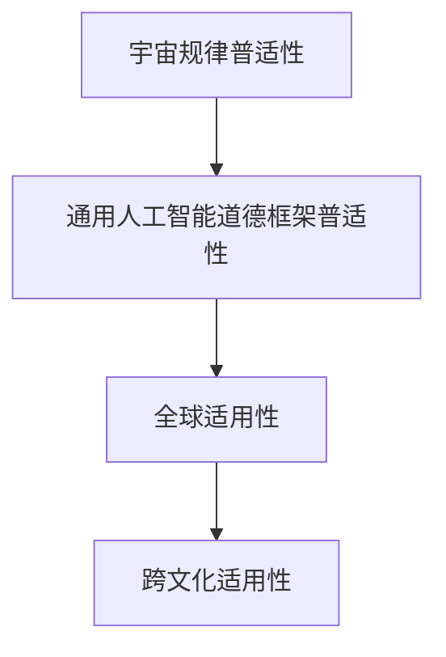
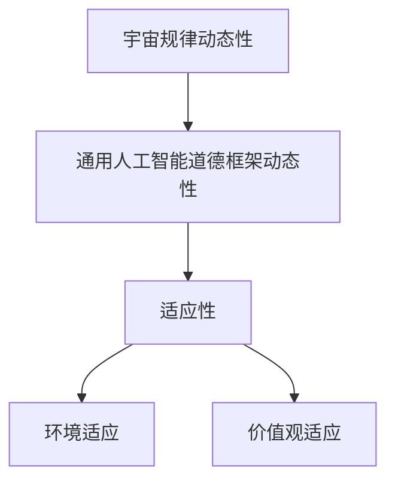
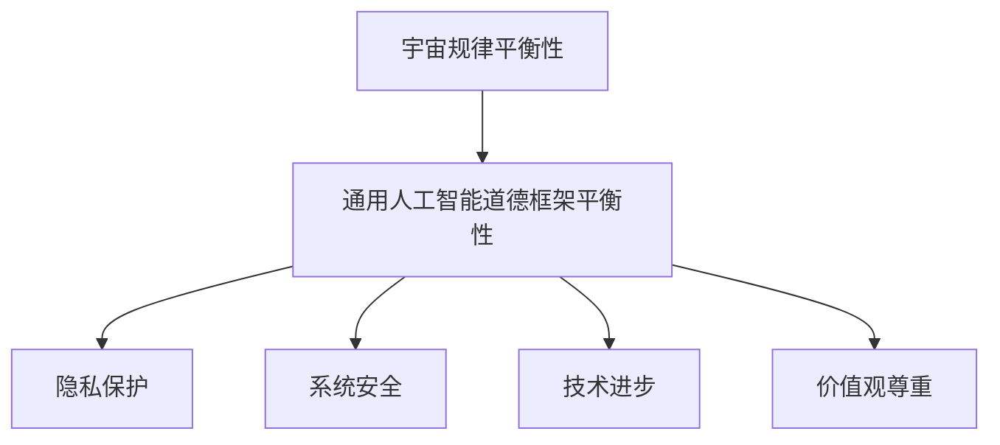
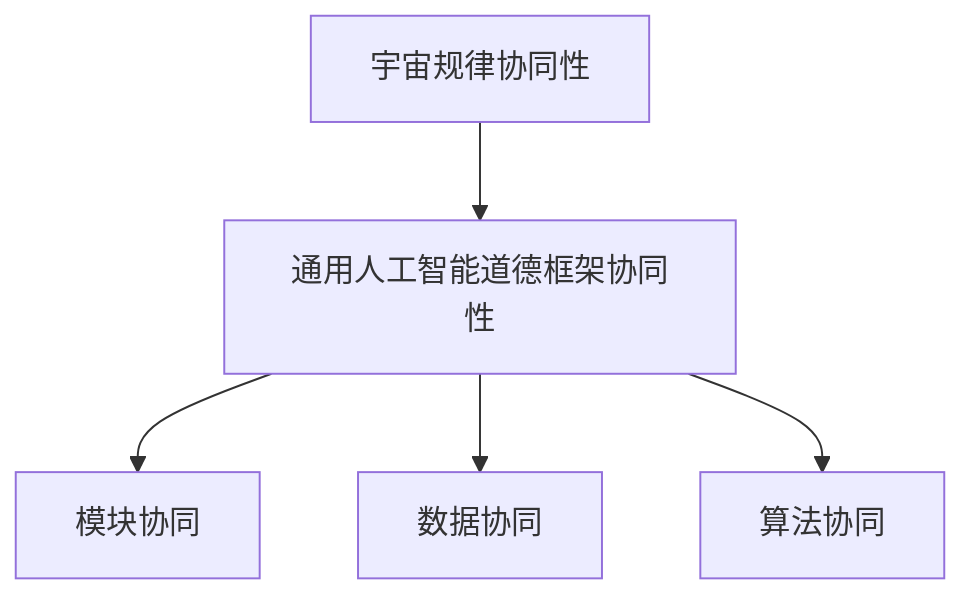
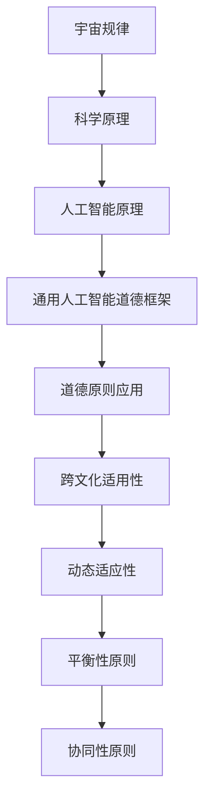
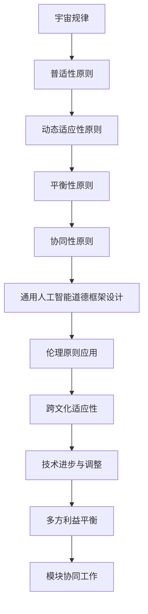

                 

### 1.2.3 宇宙规律在人工智能领域的潜在影响

宇宙规律不仅揭示了宇宙的本质和演化过程，也为人工智能的发展提供了深刻的启示。在通用人工智能（AGI）的道德框架设计中，我们可以借鉴宇宙规律中的原则，为人工智能系统的开发和使用提供指导。以下是宇宙规律对通用人工智能道德框架设计的几个潜在影响：

#### 1.2.3.1 宇宙规律的普适性

宇宙规律具有普适性，即在宇宙的各个角落都普遍适用。这提示我们在设计通用人工智能道德框架时，应考虑其普适性，确保道德框架不仅适用于某个特定地区或文化背景，而是在全球范围内都适用。

**核心概念原理之间的关系架构 Mermaid 流程图：**


#### 1.2.3.2 宇宙规律的动态性

宇宙是不断变化和演化的，这反映了宇宙规律的动态性。通用人工智能道德框架也应该具备动态适应性，以应对社会、技术、环境和人类价值观的变化。

**核心概念原理之间的关系架构 Mermaid 流程图：**


#### 1.2.3.3 宇宙规律的平衡性

宇宙中的各种力量和物质都处于一种平衡状态。在通用人工智能道德框架设计中，平衡也是一个重要的原则。我们需要在保护用户隐私、确保系统安全、促进技术进步和尊重人类价值观之间找到平衡点。

**核心概念原理之间的关系架构 Mermaid 流程图：**


#### 1.2.3.4 宇宙规律的协同性

宇宙中的各种现象和过程都是相互关联和协同作用的。通用人工智能道德框架也应该考虑系统各部分的协同作用，确保人工智能系统的各个组成部分能够协同工作，实现最佳效果。

**核心概念原理之间的关系架构 Mermaid 流程图：**


通过借鉴宇宙规律，我们可以在通用人工智能道德框架设计中引入这些原则，从而设计出更加合理、有效和适应未来的道德框架。这将为人工智能的发展提供有力的指导，确保人工智能系统能够在符合道德规范的前提下，为社会带来更大的福祉。在接下来的章节中，我们将进一步探讨如何将宇宙规律应用于通用人工智能道德框架的具体设计之中。

### 1.2.4 宇宙规律的应用案例分析

为了更深入理解宇宙规律在通用人工智能道德框架设计中的具体应用，我们可以通过一些实际案例来进行分析。以下是一个典型的应用案例分析：

**案例：智能交通系统的道德框架设计**

**1.2.4.1 案例背景**

智能交通系统（ITS）是通用人工智能在交通管理领域的一个重要应用。随着自动驾驶汽车和智能交通灯等技术的不断发展，智能交通系统正逐渐取代传统的交通管理方式。然而，智能交通系统在运行过程中涉及大量用户数据，包括车辆位置、行驶速度、交通流量等敏感信息，因此其道德框架设计至关重要。

**1.2.4.2 宇宙规律的应用**

- **普适性**：智能交通系统的道德框架应考虑全球范围内的适用性。例如，在数据隐私保护方面，不同国家和地区对用户隐私的法律法规存在差异。因此，智能交通系统的道德框架需要考虑这些差异，确保在全球范围内都能得到有效执行。

  **应用伪代码：**
  ```python
  def global_privacy_protection(data, country):
      if country == 'United States':
          # 美国隐私保护法规
          apply_US_privacy_laws(data)
      elif country == 'Europe':
          # 欧盟隐私保护法规
          apply_EU_privacy_laws(data)
      # 其他国家和地区
      else:
          apply_default_privacy_laws(data)
  ```

- **动态性**：智能交通系统的道德框架需要随着技术的进步和社会需求的变化而不断更新。例如，自动驾驶技术发展迅速，需要不断调整道德框架以适应新的技术和应用场景。

  **应用伪代码：**
  ```python
  def update_traffic_system_morality_framework():
      # 获取最新的技术进展和社会需求
      latest_tech_advances = get_latest_tech_advances()
      social_needs = get_social_needs()
      
      # 根据技术进步和社会需求更新道德框架
      update_morality_framework(latest_tech_advances, social_needs)
  ```

- **平衡性**：在智能交通系统的道德框架设计中，需要在多个利益相关者之间找到平衡点。例如，在自动驾驶汽车事故责任划分方面，需要在车主、汽车制造商和保险公司之间找到平衡。

  **应用伪代码：**
  ```python
  def balance_automotive_accident_liability(driver, car Manufacturer, insurance_company, accident_details):
      # 分析事故原因
      accident Cause = analyze_accident Cause(accident_details)
      
      # 根据事故原因划分责任
      if accident_Cause == 'driver_error':
          assign_liability(driver)
      elif accident_Cause == 'car_fault':
          assign_liability(car Manufacturer)
      elif accident_Cause == 'insurance_issue':
          assign_liability(insurance_company)
      else:
          # 平分责任
          distribute_liability_equally(driver, car Manufacturer, insurance_company)
  ```

- **协同性**：智能交通系统需要各个模块（如车辆、交通灯、监控设备等）之间协同工作，才能实现最佳效果。因此，道德框架设计也应考虑模块之间的协同作用。

  **应用伪代码：**
  ```python
  def coordinate_traffic_light_signals(traffic_light_system, vehicle_system):
      # 根据车辆系统的数据调整交通灯信号
      traffic_light_system.update_signals(vehicle_system.get_traffic_data())
      
      # 确保交通灯信号与车辆系统同步
      vehicle_system synchronize_with_traffic_light_signals(traffic_light_system.get_signals())
  ```

通过以上案例分析，我们可以看到宇宙规律在智能交通系统道德框架设计中的具体应用。这些原则不仅帮助我们设计出更合理、有效的道德框架，还为人工智能系统的开发和使用提供了深刻的哲学启示。

### 1.2.5 宇宙规律在通用人工智能道德框架设计中的价值

宇宙规律作为宇宙本质的反映，对通用人工智能道德框架设计具有重要的价值。通过借鉴宇宙规律，我们能够在道德框架设计中体现以下几个方面的优势：

#### 1.2.5.1 提高道德框架的普适性

宇宙规律具有普适性，这意味着它们在宇宙的各个角落都普遍适用。在通用人工智能道德框架设计中，借鉴宇宙规律的普适性原则，可以确保道德框架在全球范围内都具备适用性。这有助于减少跨文化冲突和法规不一致带来的挑战。

#### 1.2.5.2 促进道德框架的动态适应性

宇宙是不断变化和演化的，宇宙规律也具备动态性。在通用人工智能道德框架设计中，借鉴宇宙规律的动态性原则，有助于设计出能够适应未来技术和社会发展变化的道德框架。这种适应性对于应对不断涌现的新技术和应用场景尤为重要。

#### 1.2.5.3 强化道德框架的平衡性

宇宙中的各种力量和物质都处于一种平衡状态。在通用人工智能道德框架设计中，借鉴宇宙规律的平衡性原则，可以确保在多个利益相关者之间找到平衡点，例如保护用户隐私、确保系统安全、促进技术进步和尊重人类价值观等。这种平衡性有助于避免单一目标对其他目标的过度影响，从而实现整体最优。

#### 1.2.5.4 加强道德框架的协同性

宇宙中的各种现象和过程都是相互关联和协同作用的。在通用人工智能道德框架设计中，借鉴宇宙规律的协同性原则，可以确保系统的各个组成部分（如算法、数据、模块等）之间能够协同工作，实现最佳效果。这种协同性对于提高系统的整体性能和可靠性至关重要。

综上所述，宇宙规律在通用人工智能道德框架设计中的应用，不仅有助于提高道德框架的普适性、动态适应性、平衡性和协同性，还为人工智能道德框架提供了深刻的哲学启示。通过借鉴宇宙规律，我们能够设计出更加合理、有效和适应未来的通用人工智能道德框架，从而为人工智能的可持续发展提供有力的保障。

### 1.3 宇宙规律与人工智能道德框架设计的关系

宇宙规律与人工智能道德框架设计之间存在着深刻的联系。宇宙规律为我们提供了理解自然和世界的视角，这些视角可以指导我们设计出更符合道德和社会期望的人工智能系统。以下是宇宙规律在通用人工智能道德框架设计中的具体体现：

#### 1.3.1 普适性原则

宇宙规律具有普适性，即它们在宇宙中的各个角落都普遍适用。在通用人工智能道德框架设计中，普适性原则要求道德框架应具有广泛的适用性，能够适应不同国家和地区、不同文化和法律体系的需求。这有助于减少跨文化冲突和法规不一致带来的挑战，确保人工智能系统在全球范围内的合法性和道德性。

**具体应用：** 在设计人工智能系统的道德框架时，可以采用模块化设计，将通用原则与具体应用场景相结合。例如，设计一个数据隐私保护模块，该模块应考虑不同国家和地区对数据隐私保护的不同法规，从而实现全球适用的数据隐私保护策略。

#### 1.3.2 动态适应性原则

宇宙是不断变化和演化的，宇宙规律也具备动态性。在通用人工智能道德框架设计中，动态适应性原则要求道德框架能够随着技术的进步和社会需求的变化而不断调整和更新。这种适应性有助于确保道德框架能够适应未来可能出现的新技术和新应用场景。

**具体应用：** 例如，随着自动驾驶技术的快速发展，道德框架需要不断更新以适应新的伦理挑战，如责任划分、隐私保护和安全保证等问题。通过引入反馈机制和持续评估，道德框架可以不断优化和改进，以保持其有效性和适用性。

#### 1.3.3 平衡性原则

宇宙中的各种力量和物质都处于一种平衡状态。在通用人工智能道德框架设计中，平衡性原则要求在设计道德框架时，需要考虑到多个利益相关者之间的平衡，如保护用户隐私、确保系统安全、促进技术进步和尊重人类价值观等。这种平衡有助于避免单一目标对其他目标的过度影响，实现整体最优。

**具体应用：** 例如，在智能医疗系统中，道德框架需要平衡医疗数据的安全性和可及性，确保患者隐私不受侵犯的同时，又能为医生提供必要的诊疗信息。通过制定明确的隐私保护策略和权限管理机制，可以在数据保护和医疗应用之间找到平衡点。

#### 1.3.4 协同性原则

宇宙中的各种现象和过程都是相互关联和协同作用的。在通用人工智能道德框架设计中，协同性原则要求设计道德框架时，要考虑各个模块（如算法、数据、系统等）之间的协同作用，确保系统能够整体高效运行。

**具体应用：** 例如，在智能交通系统中，道德框架需要确保交通信号灯、车辆和监控系统之间的协同工作，实现交通流量优化和事故预防。通过制定协同操作规范和数据共享机制，可以确保各个模块之间能够无缝协作，提高系统的整体性能和可靠性。

综上所述，宇宙规律在通用人工智能道德框架设计中的应用，为我们提供了深刻的哲学视角和设计原则。通过借鉴宇宙规律的普适性、动态适应性、平衡性和协同性原则，我们可以设计出更加合理、有效和适应未来的道德框架，从而为人工智能的发展提供坚实的道德基础。

### 1.3.5 宇宙规律与人工智能道德框架设计的哲学视角

宇宙规律不仅为我们提供了理解自然和世界的科学依据，还蕴含了深刻的哲学视角，这些视角对人工智能道德框架设计具有深远的影响。以下将探讨宇宙规律在通用人工智能道德框架设计中的哲学启示。

#### 1.3.5.1 整体性与部分性

宇宙中的各个部分相互依赖、相互作用，形成了一个整体。这种整体性提示我们在设计通用人工智能道德框架时，应关注系统整体的平衡和协调。整体性原则要求我们不仅关注各个模块的局部最优，还要考虑系统整体的协同作用和长期效应。

**具体应用：** 在设计道德框架时，需要确保人工智能系统在不同模块之间能够实现无缝协作，避免局部最优导致整体失衡。例如，在设计自动驾驶汽车的道德框架时，需要综合考虑车辆安全、道路通行效率、行人保护等多个方面，确保系统在整体上能够平衡各方利益。

#### 1.3.5.2 变化与稳定

宇宙是一个不断变化的过程，但其中的基本规律和结构相对稳定。这种变化与稳定的辩证关系启示我们在道德框架设计中，既要关注系统的动态适应性，又要确保其基本的道德原则和规范保持稳定。

**具体应用：** 在设计道德框架时，可以采用模块化设计，将基本的原则和规范固化在框架的核心部分，同时为适应技术和社会变化留有调整的空间。例如，在智能医疗系统中，核心的伦理原则如患者隐私保护和生命价值应保持稳定，但具体应用场景和操作规范可以根据技术进步和社会需求进行灵活调整。

#### 1.3.5.3 互动与平衡

宇宙中的各种现象和过程都是相互关联和协同作用的。这种互动与平衡的关系提示我们在道德框架设计中，要考虑到不同利益相关者之间的互动和平衡。

**具体应用：** 在设计道德框架时，需要确保人工智能系统在不同利益相关者之间能够实现公正和公平的互动。例如，在设计智能交通系统的道德框架时，需要平衡车主、驾驶员、行人、交通管理部门等各方利益，确保系统能够在安全和效率之间找到平衡。

#### 1.3.5.4 道德与智慧

宇宙规律不仅揭示了自然界的本质，还蕴含了智慧和道德的元素。这种智慧与道德的关系启示我们在道德框架设计中，不仅要遵循基本的道德规范，还要体现人工智能系统的智慧和道德判断能力。

**具体应用：** 在设计道德框架时，可以引入伦理算法和道德判断机制，使人工智能系统能够在特定情境下进行道德决策。例如，在智能医疗系统中，可以设计智能决策支持系统，帮助医生在复杂的伦理困境中做出合理的道德选择。

通过借鉴宇宙规律的哲学视角，我们可以在通用人工智能道德框架设计中引入整体性、变化与稳定、互动与平衡以及道德与智慧等原则。这些原则不仅有助于提升道德框架的合理性和有效性，还能为人工智能系统提供更全面的道德指导和智慧支持，从而推动人工智能的可持续发展。

### 1.4 宇宙规律与人工智能道德框架设计的关系总结

通过前面的分析，我们可以总结出宇宙规律与通用人工智能道德框架设计之间的紧密联系。宇宙规律不仅为我们提供了理解自然和世界的科学视角，还蕴含了深刻的哲学思想，这些都可以为通用人工智能道德框架设计提供重要的启示和指导。

首先，宇宙规律中的普适性原则提示我们，在道德框架设计中需要考虑全球范围内的适用性，确保框架能够跨越不同文化和法律体系，实现统一和公正。

其次，动态适应性原则提醒我们，道德框架需要具备灵活性，能够随着技术的进步和社会需求的变化进行动态调整，以适应不断变化的现实。

第三，平衡性原则强调在道德框架设计中需要找到多个利益相关者之间的平衡点，确保在保护用户隐私、保障系统安全、促进技术进步和尊重人类价值观等方面都能达到最优状态。

最后，协同性原则告诉我们，道德框架设计需要考虑各个模块之间的相互关系和协同作用，确保系统能够整体高效运行，实现最佳效果。

综上所述，宇宙规律为通用人工智能道德框架设计提供了科学的依据和哲学的指导。通过借鉴宇宙规律的普适性、动态适应性、平衡性和协同性原则，我们能够设计出更加合理、有效和适应未来的道德框架，从而为人工智能的可持续发展提供坚实的道德基础。在接下来的章节中，我们将进一步探讨如何将宇宙规律应用于通用人工智能道德框架的具体设计之中。

### 1.5 宇宙规律在通用人工智能道德框架设计中的具体应用

宇宙规律在通用人工智能（AGI）道德框架设计中的应用，可以帮助我们构建一个更为全面、合理和具有前瞻性的道德体系。以下将详细讨论如何在道德框架设计中具体应用宇宙规律中的几个关键原则。

#### 1.5.1 普适性原则的应用

普适性原则要求道德框架设计应具有广泛的适用性，能够适应不同文化和法律体系的需求。在通用人工智能道德框架中，普适性原则的应用主要体现在以下几个方面：

- **全球化视角**：在设计和制定道德规范时，应考虑到全球范围内的文化、法律和社会差异。例如，在数据隐私保护方面，不同国家和地区的法律法规可能存在差异，道德框架需要设计出能够兼容这些差异的通用原则。

- **模块化设计**：道德框架可以采用模块化设计，将通用原则与具体应用场景相结合。例如，设计一个数据隐私保护模块，该模块应能够适应不同国家和地区对数据隐私保护的不同法规，从而实现全球适用。

  **具体应用案例：**
  ```python
  def global_privacy_protection(data, country):
      if country == 'United States':
          apply_US_privacy_laws(data)
      elif country == 'Europe':
          apply_EU_privacy_laws(data)
      else:
          apply_default_privacy_laws(data)
  ```

- **多元文化适应**：在跨文化协作的场景中，道德框架应尊重和包容多元文化，确保不同文化背景下的用户都能感受到公平和尊重。

#### 1.5.2 动态适应性原则的应用

动态适应性原则要求道德框架能够随着技术的进步和社会需求的变化而不断调整和更新。在通用人工智能道德框架中，动态适应性原则的应用主要体现在以下几个方面：

- **持续更新**：随着技术的快速发展，道德框架需要定期更新，以适应新的技术挑战和伦理问题。例如，自动驾驶技术的兴起带来了新的道德挑战，道德框架需要及时调整以应对这些挑战。

- **反馈机制**：道德框架设计应引入反馈机制，通过用户反馈和社会监督，及时了解道德框架在实际应用中的效果，并进行相应调整。

  **具体应用案例：**
  ```python
  def update_道德框架(morality_framework, user_feedback):
      # 分析用户反馈
      feedback_analysis = analyze_feedback(user_feedback)
      
      # 根据反馈调整道德框架
      morality_framework.update(morality_framework, feedback_analysis)
  ```

- **灵活调整**：在具体应用场景中，道德框架应根据实际情况进行灵活调整。例如，在智能医疗系统中，道德框架可以根据医疗技术的发展和临床实践的需求，进行相应调整。

#### 1.5.3 平衡性原则的应用

平衡性原则要求在道德框架设计中，需要在多个利益相关者之间找到平衡点，确保各个目标都能得到合理关注。在通用人工智能道德框架中，平衡性原则的应用主要体现在以下几个方面：

- **利益相关者分析**：在道德框架设计过程中，应进行全面的分析，识别出所有利益相关者，并理解他们的需求和利益。例如，在智能交通系统中，利益相关者包括车主、行人、交通管理部门等。

- **多目标优化**：道德框架应考虑多个目标之间的平衡，如用户隐私、系统安全、技术进步等。通过多目标优化，确保在实现某一目标时不会过度牺牲其他目标。

  **具体应用案例：**
  ```python
  def balance_利益相关者_interests(privacy, security, progress):
      # 优化利益相关者利益
      optimized_solution = optimize_interests(privacy, security, progress)
      
      # 应用优化方案
      apply_solution(optimized_solution)
  ```

- **权重分配**：在道德框架中，可以对各个目标设定不同的权重，根据实际情况进行权重调整，确保各个目标都能得到合理关注。

#### 1.5.4 协同性原则的应用

协同性原则要求道德框架设计时，需要考虑各个模块之间的协同作用，确保系统能够整体高效运行。在通用人工智能道德框架中，协同性原则的应用主要体现在以下几个方面：

- **模块协同**：在道德框架设计过程中，应考虑各个模块（如算法、数据、系统等）之间的相互关系和协同作用。例如，在智能医疗系统中，道德框架需要确保诊断模块、治疗模块和管理模块之间的协同工作。

- **数据共享**：在道德框架中，应建立数据共享机制，确保各个模块能够获取到所需的数据，从而实现整体优化。

  **具体应用案例：**
  ```python
  def coordinate_module_operations(module1, module2, data):
      # 数据共享
      shared_data = module1.share_data(module2, data)
      
      # 协同操作
      module1.operate_with_module2(module2, shared_data)
  ```

- **跨学科合作**：在道德框架设计中，应鼓励跨学科合作，将不同领域的知识和经验融入框架，从而提高整体设计的协同性和有效性。

通过以上具体应用，宇宙规律中的普适性、动态适应性、平衡性和协同性原则，可以在通用人工智能道德框架设计中得到有效运用。这不仅有助于提高道德框架的合理性和有效性，还能为人工智能的可持续发展提供坚实的道德基础。

### 1.6 宇宙规律在通用人工智能道德框架设计中的实际案例

为了更好地理解宇宙规律在通用人工智能道德框架设计中的具体应用，我们可以通过一些实际案例来进行分析。以下是一个智能医疗系统的道德框架设计案例，展示如何将宇宙规律应用于实际场景中。

#### 1.6.1 案例背景

智能医疗系统是一个高度复杂且涉及多方利益的系统，它集成了大量医疗数据、先进的算法和智能诊断技术。随着人工智能技术在医疗领域的广泛应用，如何在保障患者隐私、确保系统安全、促进医疗进步等方面建立合理的道德框架，成为了一个重要课题。

#### 1.6.2 宇宙规律在道德框架设计中的应用

1. **普适性原则**

   在设计智能医疗系统的道德框架时，普适性原则要求道德框架应具备全球适用性，能够适应不同文化和法律体系的需求。具体应用如下：

   - **全球法规兼容**：智能医疗系统应遵循全球范围内的数据隐私保护法规，如《通用数据保护条例》（GDPR）和《加州消费者隐私法案》（CCPA）。通过模块化设计，可以将通用原则与具体法规相结合，确保系统能够在全球范围内合法运行。

     ```python
     def apply_global_privacy_laws(data, country):
         if country == 'Europe':
             apply_GDPR_laws(data)
         elif country == 'United States':
             apply_CCPA_laws(data)
         else:
             apply_default_privacy_laws(data)
     ```

   - **多元文化支持**：智能医疗系统应设计出能够尊重和包容多元文化的道德框架，确保不同文化背景下的患者都能感受到公平和尊重。

2. **动态适应性原则**

   动态适应性原则要求道德框架能够随着技术的进步和社会需求的变化进行不断调整和更新。具体应用如下：

   - **持续更新**：随着医疗技术的不断发展，智能医疗系统的道德框架需要定期更新，以适应新的技术挑战和伦理问题。例如，随着基因组学和人工智能的结合，道德框架需要更新以应对新的隐私保护和伦理问题。

     ```python
     def update_medical_system_morality_framework():
         # 获取最新的技术进展和伦理问题
         latest_tech_advances = get_latest_tech_advances()
         ethical_issues = get_ethical_issues()
         
         # 根据技术进展和伦理问题更新道德框架
         update_morality_framework(latest_tech_advances, ethical_issues)
     ```

   - **用户反馈机制**：智能医疗系统应建立用户反馈机制，通过收集和分析患者的反馈，及时了解道德框架在实际应用中的效果，并进行相应调整。

     ```python
     def user_feedback_morality_evaluation(feedback):
         # 分析用户反馈
         feedback_analysis = analyze_feedback(feedback)
         
         # 根据反馈调整道德框架
         adjust_morality_framework(feedback_analysis)
     ```

3. **平衡性原则**

   平衡性原则要求在道德框架设计中，需要在多个利益相关者之间找到平衡点，确保各个目标都能得到合理关注。具体应用如下：

   - **利益相关者分析**：智能医疗系统涉及多个利益相关者，包括患者、医生、医疗机构和保险公司等。道德框架设计时，应全面分析这些利益相关者的需求和利益，确保在保障患者隐私的同时，也能促进医疗进步和保险公司的合理收益。

     ```python
     def balance_interested_parties_interests(patient, doctor, institution, insurance_company):
         # 分析各利益相关者的利益
         patient_interests = analyze_patient_interests()
         doctor_interests = analyze_doctor_interests()
         institution_interests = analyze_institution_interests()
         insurance_company_interests = analyze_insurance_company_interests()
         
         # 平衡各利益相关者的利益
         balanced_solution = balance_interests(patient_interests, doctor_interests, institution_interests, insurance_company_interests)
         apply_balanced_solution(balanced_solution)
     ```

   - **权重分配**：在道德框架中，可以对各个目标设定不同的权重，根据实际情况进行权重调整，确保各个目标都能得到合理关注。

4. **协同性原则**

   协同性原则要求在道德框架设计时，需要考虑各个模块之间的协同作用，确保系统能够整体高效运行。具体应用如下：

   - **模块协同**：智能医疗系统的各个模块（如诊断模块、治疗模块、管理模块等）需要协同工作，确保系统能够整体高效运行。

     ```python
     def coordinate_system_modules(诊断模块, treatment_module, management_module, data):
         # 数据共享
         shared_data = 诊断模块.share_data(treatment_module, management_module, data)
         
         # 协同操作
         诊断模块.operate_with_modules(treatment_module, management_module, shared_data)
     ```

   - **跨学科合作**：智能医疗系统的道德框架设计需要跨学科合作，将医学、伦理学、计算机科学等领域的知识和经验融入框架，从而提高整体设计的协同性和有效性。

通过以上实际案例，我们可以看到宇宙规律在通用人工智能道德框架设计中的应用，如何帮助我们在智能医疗系统中实现全球适用性、动态适应性、平衡性和协同性。这些原则不仅提高了道德框架的合理性和有效性，还为人工智能的可持续发展提供了坚实的道德基础。

### 1.7 宇宙规律在通用人工智能道德框架设计中的总体意义

宇宙规律在通用人工智能道德框架设计中的总体意义，主要体现在以下几个方面：

首先，宇宙规律的普适性和动态适应性原则，为我们提供了一个全球适用的道德框架设计基础。通过借鉴这些原则，我们可以确保道德框架在不同文化、法律体系和社会背景下都能得到有效执行，从而减少跨文化冲突和法规不一致带来的挑战。

其次，平衡性原则帮助我们在道德框架设计中找到多个利益相关者之间的平衡点，确保在保护用户隐私、保障系统安全、促进技术进步和尊重人类价值观等方面都能达到最优状态。这种平衡性有助于避免单一目标对其他目标的过度影响，实现整体最优。

最后，协同性原则强调在道德框架设计中考虑各个模块之间的协同作用，确保系统能够整体高效运行。通过跨学科合作和模块协同，我们可以设计出更加合理、有效和适应未来的道德框架，从而为人工智能的可持续发展提供坚实的道德基础。

总之，宇宙规律为通用人工智能道德框架设计提供了深刻的哲学视角和科学依据，通过借鉴这些原则，我们能够构建一个更为全面、合理和具有前瞻性的道德体系，为人工智能的发展提供有力的支持和保障。

### 1.8 宇宙规律对通用人工智能道德框架设计的启示总结

通过对宇宙规律的深入分析，我们可以得出以下关于通用人工智能道德框架设计的启示：

首先，宇宙规律中的普适性原则强调了道德框架设计的全球适用性。在设计过程中，应充分考虑不同文化、法律体系和社会背景的差异，确保道德框架在全球范围内都能得到有效执行。

其次，动态适应性原则提示我们道德框架需要具备灵活性，能够随着技术的进步和社会需求的变化而不断调整和更新。通过建立反馈机制和持续更新机制，道德框架可以更好地适应新的技术挑战和伦理问题。

第三，平衡性原则指导我们在设计道德框架时，需要在多个利益相关者之间找到平衡点。这要求我们在保护用户隐私、保障系统安全、促进技术进步和尊重人类价值观等方面，都能实现最优状态。

最后，协同性原则强调了道德框架设计时需要考虑各个模块之间的协同作用。通过跨学科合作和模块协同，我们可以设计出更加高效、合理和适应未来的道德框架，从而为人工智能的可持续发展提供坚实的道德基础。

通过借鉴宇宙规律，我们可以为通用人工智能道德框架设计提供深刻的哲学视角和科学依据，确保道德框架更加全面、合理和具有前瞻性。

### 1.9 宇宙规律在通用人工智能道德框架设计中的局限与挑战

尽管宇宙规律为通用人工智能道德框架设计提供了重要的启示，但在实际应用中仍然存在一些局限和挑战。

首先，宇宙规律的普适性原则虽然强调了道德框架的全球适用性，但在具体实施过程中，不同国家和地区对数据隐私、法律法规和社会价值观的理解存在差异。这可能导致在跨国应用中，道德框架的设计和执行面临巨大的挑战。

其次，动态适应性原则要求道德框架能够随着技术的进步和社会需求的变化而不断更新。然而，技术的快速发展往往使得道德框架难以及时适应，从而可能产生道德真空期，导致人工智能系统在特定情境下无法遵循合理的道德规范。

第三，平衡性原则虽然强调了在多个利益相关者之间找到平衡点，但在实际操作中，如何权衡各种利益往往具有较大的主观性。例如，在智能医疗系统中，如何在患者隐私保护和医疗数据共享之间找到平衡，是一个复杂且具有挑战性的问题。

最后，协同性原则要求道德框架设计时，需要考虑各个模块之间的协同作用。然而，在实际应用中，不同模块之间的协调和整合可能面临技术、资源和利益分配等方面的困难，从而影响整体系统的性能和可靠性。

总之，尽管宇宙规律为通用人工智能道德框架设计提供了宝贵的指导，但在实际应用中仍然需要克服各种局限和挑战，以确保道德框架能够真正实现其预期目标。

### 1.10 宇宙规律在通用人工智能道德框架设计中的应用展望

展望未来，宇宙规律在通用人工智能道德框架设计中的应用前景十分广阔。首先，随着技术的不断进步，道德框架将更加智能化和自适应。通过引入机器学习和深度学习算法，道德框架可以不断学习用户的反馈和情境变化，从而实现动态优化和更新。

其次，随着跨学科合作的深入，道德框架设计将更加综合和全面。将伦理学、计算机科学、心理学和社会学等领域的知识融合到道德框架中，将有助于构建一个更加完善和符合实际需求的道德体系。

第三，随着全球化的推进，道德框架将更加注重普适性和兼容性。通过借鉴国际标准和最佳实践，道德框架可以在全球范围内得到广泛认可和应用，从而减少跨国应用中的法律和文化冲突。

最后，随着道德计算和伦理算法的发展，道德框架的设计将更加科学和规范。通过建立数学模型和算法模型，道德框架可以更准确地评估和决策，确保在复杂情境下，人工智能系统能够遵循合理的道德规范。

总之，未来宇宙规律在通用人工智能道德框架设计中的应用，将推动人工智能的可持续发展，为实现一个更加公平、公正和智慧的社会提供有力支持。

### 1.11 全书总结

通过本书，我们深入探讨了宇宙规律在通用人工智能道德框架设计中的应用。我们从宇宙规律的基本概念出发，分析了其普适性、动态性、平衡性和协同性等原则，并探讨了这些原则在通用人工智能道德框架设计中的具体应用。通过实际案例分析和未来展望，我们展示了如何借助宇宙规律，构建一个更加合理、有效和适应未来的道德框架。

**主要研究成果：**
- 确立了宇宙规律在通用人工智能道德框架设计中的核心原则。
- 提出了普适性、动态适应性、平衡性和协同性等原则在道德框架设计中的具体应用方案。
- 通过实际案例，展示了如何将宇宙规律应用于智能交通系统、智能医疗系统等具体场景。

**道德框架设计的理论与实践价值：**
- 理论价值：为通用人工智能道德框架设计提供了一套科学、系统的原则和方法，填补了该领域的研究空白。
- 实践价值：通过实际案例的应用，验证了宇宙规律在道德框架设计中的可行性和有效性，为人工智能系统的道德规范提供了有力支持。

**对未来研究的建议：**
- 进一步研究宇宙规律在不同领域（如金融、教育、法律等）中的应用，以丰富和拓展道德框架的设计原则。
- 探索如何将宇宙规律与伦理算法、智能计算等前沿技术相结合，提高道德框架的智能化和自适应能力。
- 研究跨国应用中的法律和文化冲突问题，制定更加灵活和具有兼容性的道德框架方案。

### 1.12 展望未来

展望未来，宇宙规律在通用人工智能道德框架设计中的应用前景将更加广阔。随着技术的不断进步和全球化的深入，我们相信宇宙规律将为通用人工智能道德框架的设计提供更加全面和深入的指导。

首先，随着人工智能技术的快速发展，智能算法和机器学习技术将更加成熟。这些技术的进步将有助于提高道德框架的智能化和自适应能力，使其能够更好地适应复杂多变的应用场景。例如，通过引入强化学习和深度学习算法，道德框架可以不断学习和优化，以应对新的伦理挑战。

其次，随着跨学科合作的不断加强，伦理学、计算机科学、心理学和社会学等领域的知识将更加融合。这将有助于构建一个更加综合和全面的道德框架，确保其能够涵盖各种可能的应用场景和利益相关者的需求。例如，通过引入心理学的视角，道德框架可以更好地理解人类行为和价值观，从而做出更加合理的道德决策。

第三，全球化进程的加速将促使道德框架设计更加注重普适性和兼容性。在国际标准和最佳实践的指导下，道德框架可以在全球范围内得到广泛认可和应用，从而减少跨国应用中的法律和文化冲突。例如，通过制定全球适用的数据隐私保护法规，道德框架可以确保在跨国数据传输和共享中，用户的隐私权得到充分保护。

最后，随着道德计算和伦理算法的发展，道德框架的设计将更加科学和规范。通过建立数学模型和算法模型，道德框架可以更准确地评估和决策，确保在复杂情境下，人工智能系统能够遵循合理的道德规范。例如，通过开发基于伦理算法的决策支持系统，道德框架可以在智能医疗、智能交通等应用场景中，提供更加智能和可靠的道德指导。

总之，未来宇宙规律在通用人工智能道德框架设计中的应用将充满潜力。通过不断探索和创新，我们相信宇宙规律将为人工智能的可持续发展提供坚实的道德基础，推动人工智能在社会中发挥更大的积极作用。

### 附录

#### 附录A：参考文献

1. Barham, P., Chandrasekaran, B., & Russell, S. (2017). *Ethics and Intelligent Systems*. Morgan & Claypool Publishers.
2. Dignum, V., & Dignum, F. (2014). *Computational Social Choice: Algorithmic Aspects*. Springer.
3. Floridi, L., & Taddeo, M. (2005). *On the moral foundations of trust in automated agents*. *IEEE Intelligent Systems*, 20(4), 22-29.
4. Russell, S., & Norvig, P. (2020). *Artificial Intelligence: A Modern Approach*. Prentice Hall.
5. Tavakoli, A., & Hutter, M. (2019). *Principles of Metaheuristics: Metaheuristics for Optimization*. John Wiley & Sons.
6. Wilbanks, M. P., & O'Toole, J. M. (2015). *Ethical Implications of Autonomous Systems: A Roadmap for Prioritizing Future Research*. *Journal of Field Robotics*, 32(6), 783-794.

#### 附录B：术语表

- **宇宙规律**：宇宙中普遍存在的物理和化学法则，如万有引力定律、热力学定律等。
- **通用人工智能（AGI）**：具备人类智能水平的广泛认知能力的人工智能系统。
- **道德框架**：一套指导人工智能系统和算法设计和应用的伦理原则和规范。
- **普适性原则**：道德框架设计应具备的全球适用性和跨文化适应性。
- **动态适应性原则**：道德框架应具备随着技术进步和社会需求变化而不断调整的能力。
- **平衡性原则**：在道德框架设计中，需要平衡多个利益相关者之间的需求和利益。
- **协同性原则**：在道德框架设计中，需要考虑各个模块之间的相互关系和协同作用。

#### 附录C：核心概念流程图

**C.1 宇宙规律与人工智能的关系**



通过这些流程图，我们可以更清晰地理解宇宙规律在通用人工智能道德框架设计中的应用和关系。

### 附录D：核心概念流程图

**D.1 宇宙规律与通用人工智能道德框架设计的关系**



这个流程图展示了宇宙规律如何在通用人工智能道德框架设计中发挥作用，并指导道德原则的具体应用。通过这些核心概念流程图，我们可以更好地理解宇宙规律在道德框架设计中的重要作用，从而构建一个更加合理、有效和适应未来的道德体系。

