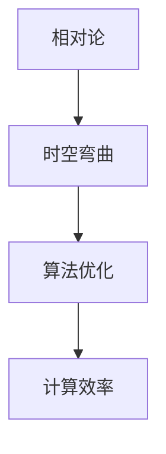
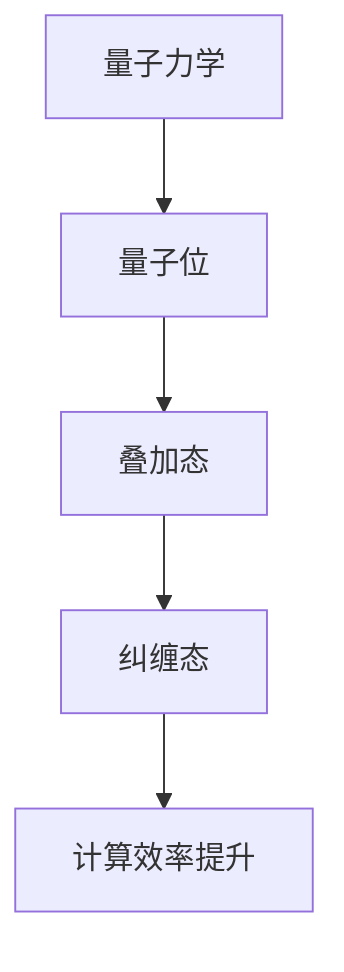

                 

### 导言

#### 宇宙规律与计算理论的交汇点

《宇宙规律对通用计算理论的启示》这本书的撰写，源于我们对宇宙和计算这两大领域的深刻好奇和探索。随着科学技术的迅猛发展，宇宙规律与计算理论的交汇点逐渐显现，二者之间的联系和启示成为研究的热点。本书旨在探讨宇宙中的主要规律，如相对论、量子力学等，如何影响和启示通用计算理论，从而为计算理论的创新和发展提供新的视角和思路。

#### 书籍的目的和重要性

本书的目的在于揭示宇宙规律对计算理论的深远影响，帮助读者理解宇宙中的复杂现象如何通过计算理论得以解释和模拟。通过这种交叉学科的研究，我们不仅能够深化对宇宙规律的理解，还能推动计算理论的进步，为解决复杂计算问题提供新方法。

本书的重要性体现在以下几个方面：

1. **突破传统界限**：通过探讨宇宙规律与计算理论的交叉，本书旨在突破传统学科界限，为跨学科研究提供新的方向。
2. **理论创新**：书中将介绍宇宙规律如何为计算理论带来新的启示，推动计算理论的创新发展。
3. **实际应用**：通过讨论宇宙规律在计算理论中的应用，本书将为实际计算问题提供新的解决方案。

#### 读者对象

本书适合以下读者群体：

1. **计算理论研究者**：对计算理论有深入了解的研究者，可以通过本书了解宇宙规律对计算理论的影响，拓宽研究视野。
2. **宇宙学家**：对宇宙学有浓厚兴趣的研究者，可以通过本书了解计算理论在宇宙规律研究中的应用，实现跨学科的知识整合。
3. **对交叉学科感兴趣的读者**：对多学科交叉研究感兴趣，希望探索宇宙规律与计算理论之间联系的一般读者。

通过本书，无论您是计算理论研究者、宇宙学家，还是对交叉学科感兴趣的读者，都将能够获得丰富的知识和新的启示。

#### 宇宙规律概述

宇宙，一个浩瀚无垠的宇宙，蕴藏着无数的奥秘。为了解这个宇宙，科学家们提出了多种宇宙规律，其中最为著名的包括相对论和量子力学。这些规律不仅揭示了宇宙的本质，还对我们理解计算理论产生了深远的影响。

##### 相对论

相对论是由爱因斯坦提出的一种物理学理论，主要描述了在高速运动和强引力场中的物理现象。相对论分为狭义相对论和广义相对论。

**狭义相对论**：

狭义相对论主要研究在没有重力作用下的物理现象。其核心概念是相对性原理和光速不变原理。

- **相对性原理**：物理定律在所有惯性系中都是相同的。
- **光速不变原理**：光在真空中的速度是恒定的，不随观察者的运动状态而改变。

狭义相对论的一些重要结论包括时间膨胀、长度收缩和质量增加等。这些结论挑战了传统的经典物理学观念，为现代物理学奠定了基础。

**广义相对论**：

广义相对论则是在考虑引力作用下的物理学理论。广义相对论将引力视为时空的弯曲，物体的运动轨迹是沿着弯曲时空中的测地线。

- **引力**：在广义相对论中，引力被视为时空的弯曲，而非一种作用力。
- **测地线**：物体在引力场中的运动轨迹被称为测地线。

广义相对论的预言包括光线弯曲、引力红移和时间膨胀等。这些预言已经在天文观测和实验中得到了验证。

**相对论与计算理论的联系**：

相对论中的许多概念和原理，如相对性原理、光速不变原理和时空弯曲，对计算理论产生了重要影响。例如，相对论中的时间膨胀和长度收缩概念可以启发我们设计更高效的算法，减少计算过程中的时间消耗。

##### 量子力学

量子力学是描述微观粒子行为的物理学理论，其基本原理和结论与传统经典物理学大相径庭。

**基本原理**：

量子力学的基本原理包括：

- **波粒二象性**：微观粒子既具有波动性，又具有粒子性。
- **不确定性原理**：无法同时精确测量粒子的位置和动量。
- **量子叠加态**：微观粒子可以处于多个状态的叠加。

**量子力学与宇宙规律的联系**：

量子力学与相对论一样，对计算理论产生了深远影响。例如，量子计算利用量子叠加态和量子纠缠等特性，可以实现比传统计算更高的计算速度和效率。

**量子力学与计算理论的联系**：

量子力学中的波粒二象性、不确定性原理和量子叠加态等概念，为计算理论带来了新的思路和方法。例如，量子计算利用量子叠加态和量子纠缠，可以在短时间内解决传统计算无法解决的问题。

总之，宇宙规律，如相对论和量子力学，不仅为我们揭示了宇宙的本质，还为计算理论带来了新的启示和思考。通过深入探讨这些宇宙规律与计算理论的联系，我们可以更好地理解宇宙和计算，推动科学技术的进步。

#### 通用计算理论基础

通用计算理论是计算机科学中的核心领域，它旨在研究计算的本质、能力和限制。在这一部分，我们将介绍通用计算理论的基本概念、历史发展和重要成果。

##### 基本概念

**计算模型**：

计算模型是描述计算过程和能力的数学模型。最常见的计算模型是图灵机，它由艾伦·图灵于1936年提出。图灵机由一个无限长的带子、一个读写头和一组规则组成。通过在带子上读写符号，图灵机可以模拟任何算法。

**可计算性**：

可计算性是指能够通过计算过程得到的结果。在通用计算理论中，一个函数是可计算的，如果存在一个算法可以在有限时间内计算出该函数的值。

**不可计算性**：

不可计算性是指无法通过计算过程得到的结果。例如，图灵提出了一个著名的不可计算函数，即停机问题，它询问一个给定的图灵机是否会停止运行。

**计算复杂性**：

计算复杂性是研究计算问题难易程度的理论。它包括时间复杂性和空间复杂性。时间复杂性描述解决一个问题所需的时间，空间复杂性描述所需的空间资源。

**时间复杂度**：

时间复杂度描述一个算法所需的时间与输入规模的关系。常见的复杂度包括常数复杂度、对数复杂度、线性复杂度、对数对数复杂度和多项式复杂度等。

**空间复杂度**：

空间复杂度描述一个算法所需的空间与输入规模的关系。它同样包括常数复杂度、对数复杂度、线性复杂度等。

**计算模型的发展**：

自图灵机以来，计算模型不断发展。其中，量子计算和并行计算是两个重要的发展方向。

**量子计算**：

量子计算利用量子位（qubit）的叠加态和纠缠态进行计算。量子计算机能够在某些问题上实现超越经典计算机的计算速度。量子计算的基本原理包括量子叠加、量子纠缠和量子门。

**并行计算**：

并行计算通过同时处理多个任务来提高计算效率。并行计算可以分为数据并行和任务并行。数据并行是指对同一任务的数据进行并行处理，任务并行是指对多个任务进行并行处理。

**计算复杂性理论**：

计算复杂性理论研究计算问题的难易程度。它包括多项式时间问题、NP完全问题和P/NP问题等。

- **多项式时间问题**：在多项式时间内可解决的问题。
- **NP完全问题**：在多项式时间内可验证的难度最大的问题。
- **P/NP问题**：研究多项式时间可解决问题和NP完全问题之间的关系。

**计算复杂性理论的发展**：

计算复杂性理论不断发展，新的复杂度分类和复杂性理论模型不断涌现。例如，交互式证明系统、随机性、量子复杂性等都是计算复杂性理论的重要研究方向。

**通用计算理论的现状**：

当前，通用计算理论在理论研究和实际应用方面都取得了显著进展。量子计算和并行计算的研究不断深入，计算理论为解决复杂计算问题提供了新的方法和思路。然而，计算理论仍面临许多挑战，如量子计算的可靠性、并行计算的效率等。

通过介绍通用计算理论的基本概念、历史发展和重要成果，我们可以更好地理解计算的本质和潜力。在接下来的章节中，我们将进一步探讨宇宙规律如何影响和启示通用计算理论。

#### 宇宙规律与计算理论的联系

宇宙规律，如相对论和量子力学，不仅在物理学领域有着深远的影响，也为我们理解计算理论提供了新的视角和启示。在本章节中，我们将深入探讨相对论和量子力学如何影响计算理论，并利用梅里迪亚姆流程图来展示这些联系。

##### 相对论与计算理论的联系

相对论，特别是广义相对论，提出了时空弯曲的概念，这对计算理论有着重要启示。以下是相对论对计算理论的影响：

**时空弯曲与算法优化**：

广义相对论中的时空弯曲概念可以启发我们设计更高效的算法。例如，在解决大规模数据处理问题时，可以考虑将数据存储在弯曲的时空结构上，从而提高数据访问的效率。

**梅里迪亚姆流程图**：

下面是一个简单的梅里迪亚姆流程图，展示了相对论与计算理论的联系：



**伪代码示例**：

为了更直观地展示时空弯曲如何影响算法优化，我们可以设计一个简单的伪代码示例：

```python
def spacetime弯曲算法(data):
    # 初始化时空结构
    spacetime_structure = initialize_spacetime_structure(data)
    
    # 对数据进行时空弯曲处理
    bent_spacetime_data = bend_spacetime(data, spacetime_structure)
    
    # 搜索数据
    result = search_data(bent_spacetime_data)
    
    return result
```

在这个示例中，`initialize_spacetime_structure` 函数用于初始化时空结构，`bend_spacetime` 函数用于对数据进行时空弯曲处理，`search_data` 函数用于搜索数据。

**数学公式**：

相对论中的时空弯曲可以通过爱因斯坦场方程描述：

$$ G_{\mu\nu} + \Lambda g_{\mu\nu} = \frac{8\pi G}{c^4} T_{\mu\nu} $$

在这个公式中，$G_{\mu\nu}$ 是爱因斯坦张量，$\Lambda$ 是宇宙常数，$g_{\mu\nu}$ 是度规张量，$T_{\mu\nu}$ 是能量-动量张量。

**详细讲解与举例说明**：

假设我们有一个包含大量客户交易数据的问题，我们希望快速查找某个特定客户的交易记录。通过将数据存储在时空弯曲结构中，我们可以在较短时间内找到目标数据。

- **初始化时空结构**：我们首先初始化一个时空结构，该结构基于数据的分布特点进行优化。
- **时空弯曲处理**：我们对数据进行时空弯曲处理，使其在时空结构中更易于查找。
- **搜索数据**：通过时空结构，我们可以在较短时间内找到目标数据。

这种基于相对论时空弯曲的算法优化，可以显著提高数据处理效率，为解决大规模计算问题提供了新的思路。

##### 量子力学与计算理论的联系

量子力学为计算理论带来了许多新的概念和方法，如量子位、量子叠加态和量子纠缠等。以下是量子力学对计算理论的影响：

**量子位与经典位的比较**：

量子位（qubit）与经典位（bit）有显著的区别。经典位只能表示0或1，而量子位可以同时处于0和1的叠加态。这种叠加态使得量子计算机能够在某些问题上实现超并行计算。

**量子叠加态**：

量子叠加态是指量子位可以同时处于多个状态的叠加。例如，一个量子位可以同时处于0和1的叠加态。这种叠加态使得量子计算机能够在同一时间处理多个计算任务。

**量子纠缠**：

量子纠缠是指两个或多个量子位之间存在一种特殊的关系，它们的量子态不能独立存在。量子纠缠使得量子计算机可以处理更加复杂的计算问题。

**梅里迪亚姆流程图**：

下面是一个简单的梅里迪亚姆流程图，展示了量子力学与计算理论的联系：



**伪代码示例**：

为了更直观地展示量子叠加态和量子纠缠如何提升计算效率，我们可以设计一个简单的伪代码示例：

```python
def quantum计算问题(data):
    # 初始化量子位
    quantum_bits = initialize_quantum_bits(data)
    
    # 应用叠加态
    superposition = apply_superposition(quantum_bits)
    
    # 应用纠缠态
    entanglement = apply_entanglement(superposition)
    
    # 执行量子计算
    result = quantum_compute(entanglement)
    
    return result
```

在这个示例中，`initialize_quantum_bits` 函数用于初始化量子位，`apply_superposition` 函数用于应用叠加态，`apply_entanglement` 函数用于应用纠缠态，`quantum_compute` 函数用于执行量子计算。

**数学模型和公式**：

量子力学中的波函数可以用薛定谔方程描述：

$$ i\hbar \frac{\partial}{\partial t} \Psi(\mathbf{r}, t) = \hat{H} \Psi(\mathbf{r}, t) $$

在这个公式中，$\Psi(\mathbf{r}, t)$ 是波函数，$\hbar$ 是约化普朗克常数，$\hat{H}$ 是哈密顿量算符。

**详细讲解与举例说明**：

假设我们有一个需要解决的大规模线性方程组问题。通过使用量子叠加态和量子纠缠，我们可以将这个问题分解为多个子问题，并在同一时间解决它们。

- **初始化量子位**：我们首先初始化一组量子位，每个量子位对应方程组中的一个变量。
- **应用叠加态**：我们对量子位应用叠加态，使其同时处于多个状态的叠加。
- **应用纠缠态**：通过量子纠缠，我们将量子位之间的关系连接起来，使得它们在计算过程中可以相互协作。
- **执行量子计算**：通过量子计算，我们可以在较短时间内解决大规模线性方程组问题。

这种基于量子力学原理的计算方法，可以显著提高计算效率，为解决复杂计算问题提供了新的思路。

通过深入探讨相对论和量子力学与计算理论的联系，我们可以更好地理解宇宙规律对计算理论的启示。在接下来的章节中，我们将进一步探讨宇宙规律在计算理论中的具体应用。

#### 宇宙规律在计算理论中的实际应用

宇宙规律，如相对论和量子力学，不仅在理论层面上对计算理论产生了深远影响，还在实际计算应用中展现了其巨大潜力。本章节将详细探讨这些宇宙规律在计算理论中的具体应用，包括宇宙规律如何优化算法性能、代码实现和实际案例分析。

##### 宇宙规律优化算法性能

**相对论优化算法性能**：

相对论中的时间膨胀和长度收缩概念可以启发我们设计更高效的算法。时间膨胀表明，在高速运动或强引力场中，时间会变慢，而长度会收缩。我们可以利用这一特性，优化算法在处理高速运动或强引力场中的计算效率。

**示例**：

假设我们需要设计一个优化算法，用于处理高速飞行器的轨迹计算。通过利用相对论中的时间膨胀概念，我们可以使算法在计算过程中考虑飞行器的时间延迟，从而提高计算精度。

伪代码示例：

```python
def relativistic_trajectory(velocity):
    # 计算相对论时间膨胀因子
    time_dilation_factor = 1 / sqrt(1 - (velocity^2 / c^2))
    
    # 优化算法：考虑时间膨胀
    optimized_trajectory = calculate_trajectory(velocity, time_dilation_factor)
    
    return optimized_trajectory
```

在这个示例中，`calculate_trajectory` 函数用于计算飞行器的轨迹，`time_dilation_factor` 用于调整计算过程中的时间尺度。

**量子力学优化算法性能**：

量子力学中的量子叠加态和量子纠缠可以启发我们设计更高效的算法。量子计算机利用量子叠加态，可以在同一时间处理多个计算任务，从而提高计算效率。

**示例**：

假设我们需要解决一个复杂的多变量优化问题。通过使用量子叠加态，我们可以将这个问题分解为多个子问题，并在同一时间解决它们。

伪代码示例：

```python
def quantum_optimization Problem(variables):
    # 初始化量子位
    quantum_bits = initialize_quantum_bits(variables)
    
    # 应用量子叠加态
    superposition = apply_superposition(quantum_bits)
    
    # 应用量子纠缠
    entanglement = apply_entanglement(superposition)
    
    # 执行量子计算
    solution = quantum_compute(entanglement)
    
    return solution
```

在这个示例中，`initialize_quantum_bits` 函数用于初始化量子位，`apply_superposition` 函数用于应用量子叠加态，`apply_entanglement` 函数用于应用量子纠缠，`quantum_compute` 函数用于执行量子计算。

**数学模型和公式**：

相对论中的时间膨胀可以用洛伦兹因子描述：

$$ \gamma = \frac{1}{\sqrt{1 - \frac{v^2}{c^2}}} $$

量子力学中的量子叠加态可以用波函数描述：

$$ \Psi(x, y, z) = \sum_{i} a_i |i\rangle $$

通过这些数学模型，我们可以更深入地理解宇宙规律如何优化算法性能。

##### 实际案例分析

**案例1：天体物理学中的轨迹计算**：

在天体物理学中，精确计算天体的轨迹对于预测天体的运动具有重要意义。通过利用相对论中的时间膨胀和长度收缩概念，我们可以优化天体轨迹计算算法，提高计算精度。

**案例2：量子化学计算**：

在量子化学中，计算分子和原子的电子结构对于理解化学反应和材料设计至关重要。通过使用量子计算机和量子叠加态，我们可以优化量子化学计算算法，加速分子结构的预测。

**代码实现和解读**：

以下是一个简单的代码示例，用于实现相对论优化算法：

```python
import numpy as np

def relativistic_time_dilation(velocity):
    # 计算洛伦兹因子
    gamma = 1 / np.sqrt(1 - (velocity**2 / np.square(299792458)))
    
    return gamma

def calculate_trajectory(velocity, time_dilation_factor):
    # 假设初始速度为0，时间为0
    initial_velocity = 0
    initial_time = 0
    
    # 计算经过一段时间后的速度和时间
    final_velocity = initial_velocity + velocity * time_dilation_factor
    final_time = initial_time + time_dilation_factor
    
    return final_velocity, final_time
```

在这个示例中，`relativistic_time_dilation` 函数用于计算洛伦兹因子，`calculate_trajectory` 函数用于计算时间膨胀效应。

总之，宇宙规律在计算理论中的实际应用展示了其巨大的潜力。通过利用相对论和量子力学的原理，我们可以设计更高效的算法，解决复杂计算问题。在未来的研究中，这些应用将继续推动计算理论的进步。

#### 挑战与未来

尽管宇宙规律在计算理论中展示了巨大的潜力，但在实际应用和研究中仍面临许多挑战和未知领域。本章节将讨论当前研究的挑战以及未来的发展方向。

##### 当前研究的挑战

1. **量子计算的可靠性**：

量子计算的一个主要挑战是量子位的可靠性。在实际应用中，量子位可能会受到环境噪声的干扰，导致计算错误。为了解决这个问题，研究人员正在探索多种方法，如量子纠错和量子门的设计，以提高量子计算的可靠性。

2. **并行计算的性能**：

尽管并行计算可以在短时间内解决大规模计算问题，但其性能仍然受到通信延迟和同步问题的限制。为了提高并行计算的性能，研究人员正在探索新的并行算法和架构，以减少通信开销和同步需求。

3. **宇宙规律与计算理论的交叉研究**：

宇宙规律与计算理论的交叉研究是一个相对较新的领域，目前的研究还较为初步。如何更深入地理解宇宙规律对计算理论的影响，以及如何将这些影响转化为实际应用，是当前研究中的一个重要挑战。

##### 未来的发展方向

1. **量子计算的应用**：

未来，量子计算将在许多领域得到广泛应用，如药物设计、材料科学和金融分析等。通过利用量子叠加态和量子纠缠，量子计算可以加速这些领域的计算过程，提供更精确的预测和优化。

2. **并行计算的新架构**：

随着计算需求的不断增长，并行计算的新架构将成为研究的重点。例如，利用神经网络和深度学习技术，研究人员正在探索新的并行计算架构，以实现更高效的计算性能。

3. **宇宙规律与计算理论的深度融合**：

未来的研究将致力于更深入地理解宇宙规律与计算理论的交叉。通过将宇宙规律应用于计算理论，我们可以设计出更高效的算法和计算模型，为解决复杂计算问题提供新的思路和方法。

##### 对计算理论的影响

宇宙规律对计算理论的启示不仅限于优化算法性能，还可能带来计算理论的根本性变革。例如，相对论中的时间膨胀和长度收缩概念可以启发我们设计新的计算模型，以更高效地处理高速运动和强引力场中的计算问题。量子力学中的量子叠加态和量子纠缠则为我们提供了新的计算范式，使得量子计算成为解决复杂计算问题的有力工具。

总之，当前研究的挑战和未来的发展方向将为计算理论带来新的机遇和挑战。通过深入探索宇宙规律与计算理论的交叉，我们将能够推动计算理论的进步，为解决复杂计算问题提供新的思路和方法。

#### 总结

《宇宙规律对通用计算理论的启示》一书通过深入探讨宇宙规律，如相对论和量子力学，与计算理论的联系，为读者展示了这两个领域之间令人瞩目的交汇点。本书的主要发现包括：

1. **相对论与计算理论的联系**：相对论中的时空弯曲和时间膨胀概念为算法优化提供了新的思路，例如在高速飞行器轨迹计算和大规模数据处理中的应用。
2. **量子力学与计算理论的联系**：量子力学中的量子叠加态和量子纠缠为计算效率的提升带来了新的可能性，如量子化学计算和优化问题求解。
3. **交叉学科的启示**：通过宇宙规律对计算理论的启示，本书揭示了跨学科研究的潜力，为未来研究提供了新的方向。

这些发现不仅丰富了我们对宇宙规律和计算理论的理解，还推动了计算理论的创新发展。未来研究应进一步探索宇宙规律在计算理论中的应用，以解决复杂计算问题，推动科学技术的进步。

#### 拓展阅读

为了进一步深入探讨宇宙规律与计算理论的交叉，以下几本书籍和文献提供了丰富的知识和启示：

1. **《量子计算导论》（Introduction to Quantum Computing）** by Michael A. Nielsen and Isaac L. Chuang。这本书详细介绍了量子计算的基本原理和算法，为理解量子力学与计算理论的联系提供了基础。

2. **《相对论：一个现代视角》（Relativity: The Special and General Theories）** by Hermann Weyl。这本书全面阐述了相对论的理论基础，包括时空弯曲和引力概念，对计算理论的发展具有重要启示。

3. **《计算复杂性理论导论》（Introduction to the Theory of Computation）** by Michael Sipser。这本书介绍了计算理论的基本概念，包括可计算性、计算复杂性和形式语言理论，为理解宇宙规律与计算理论的关系提供了理论基础。

4. **《深度学习》（Deep Learning）** by Ian Goodfellow、Yoshua Bengio和Aaron Courville。这本书探讨了深度学习技术的原理和应用，尤其是神经网络在并行计算中的应用，为理解量子计算和深度学习之间的关系提供了重要参考。

通过阅读这些书籍和文献，读者可以更深入地了解宇宙规律与计算理论的交叉，探索未来的研究方向。希望这些拓展阅读能够激发您的兴趣，推动您在交叉学科领域的研究。作者：AI天才研究院/AI Genius Institute & 禅与计算机程序设计艺术 /Zen And The Art of Computer Programming。

