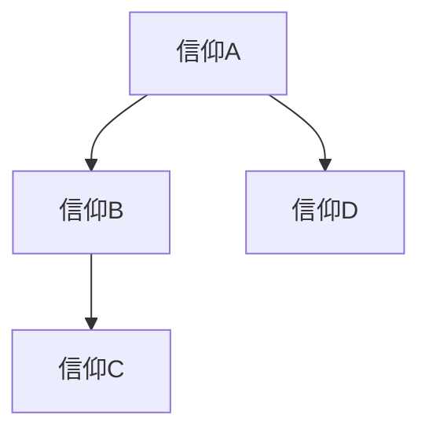

                 

# 宗教信仰的贝叶斯网络：信念系统的概率模型

## 概念与架构

### 贝叶斯网络

贝叶斯网络是一种概率图模型，通过图结构来表示变量之间的依赖关系。在贝叶斯网络中，每个节点代表一个随机变量，边表示变量之间的条件依赖。贝叶斯网络在宗教信仰的研究中有着广泛的应用，因为它可以帮助我们理解和量化信仰之间的相关性。

### 贝叶斯规则

贝叶斯规则是概率论中用于计算条件概率的基本公式。在贝叶斯网络中，贝叶斯规则用于更新节点的概率分布。贝叶斯规则的核心思想是：通过已知的条件概率和先验概率，来计算后验概率。

贝叶斯规则公式如下：

$$P(A|B) = \frac{P(B|A) \cdot P(A)}{P(B)}$$

其中，$P(A|B)$ 表示在已知B的条件下A的概率，$P(B|A)$ 表示在已知A的条件下B的概率，$P(A)$ 表示A的先验概率，$P(B)$ 表示B的先验概率。

### 概率模型

在宗教信仰的贝叶斯网络中，概率模型用于量化宗教信仰之间的相关性。一个简单的概率模型可以是以下形式：

$$P(信仰A, 信仰B, 信仰C) = P(信仰A) \cdot P(信仰B|信仰A) \cdot P(信仰C|信仰A, 信仰B)$$

其中，$P(信仰A)$ 表示信仰A的概率，$P(信仰B|信仰A)$ 表示在信仰A的条件下信仰B的概率，$P(信仰C|信仰A, 信仰B)$ 表示在信仰A和信仰B的条件下信仰C的概率。

## 信仰系统

### 信仰系统的定义

信仰系统是指一系列宗教信仰的总和。在贝叶斯网络中，信仰系统可以用一个图结构来表示，其中每个节点代表一个宗教信仰，边表示信仰之间的条件依赖。

例如，一个简单的信仰系统可以是：



在这个例子中，信仰A、信仰B、信仰C和信仰D构成了一个信仰系统。

### 信仰系统中的关系

在信仰系统中，信仰之间的关系可以用贝叶斯网络来表示。例如，信仰A和信仰B之间的依赖关系可以用一条边表示，表示信仰A的发生会影响信仰B的概率。

假设信仰A和信仰B之间的关系是条件独立的，那么我们可以用以下公式来表示它们之间的概率关系：

$$P(信仰A, 信仰B) = P(信仰A) \cdot P(信仰B|信仰A)$$

同样，信仰B和信仰C之间的关系也可以用类似的方式表示。

## 模型应用

### 贝叶斯网络在信仰传播中的应用

贝叶斯网络可以用于分析信仰的传播过程。例如，我们可以使用贝叶斯网络来分析一个宗教团体中信仰传播的过程。给定一个信仰系统的贝叶斯网络模型，我们可以使用贝叶斯规则来计算每个信仰在给定其他信仰条件下的概率。这可以帮助我们了解信仰传播的路径和影响范围。

### 概率模型在信仰一致性分析中的应用

概率模型可以用于分析信仰的一致性。例如，我们可以使用概率模型来分析一个宗教团体的信仰一致性。给定一个信仰系统的概率模型，我们可以计算每个信仰在给定其他信仰条件下的概率，从而判断信仰的一致性程度。

## 核心算法原理讲解

### 贝叶斯推理

贝叶斯推理是贝叶斯网络中的核心算法，用于计算给定某些证据的情况下，未知变量的概率分布。贝叶斯推理的基本步骤如下：

1. 初始化：给定一个贝叶斯网络和一个初始证据集合，初始化所有变量的概率分布。
2. 推理：从根节点开始，根据贝叶斯规则和条件概率表，更新每个变量的概率分布，直到所有变量的概率分布稳定。
3. 输出：输出最终的概率分布，即给定证据条件下未知变量的概率分布。

贝叶斯推理的伪代码如下：

```plaintext
输入：贝叶斯网络G，证据集合E
输出：变量X的概率分布P(X|E)

初始化P(X|E)为所有变量X的先验概率
对于每个变量X：
    对于每个变量Y，如果Y在路径P(X)中：
        更新P(X|Y) = P(Y|X) * P(X) / P(Y)
返回P(X|E)
```

### 变量消除

变量消除是一种优化算法，用于减少计算量。在贝叶斯推理过程中，我们可以通过变量消除来减少需要计算的变量数量。变量消除的基本思想是：通过消除一些变量，使得贝叶斯网络的计算变得更加简单。

### 消息传播

消息传播是一种基于贝叶斯网络的推理算法，用于计算网络中各个节点的概率分布。消息传播的基本步骤如下：

1. 初始化：给定一个贝叶斯网络和一个初始证据集合，初始化所有变量的概率分布。
2. 传播：从根节点开始，沿着网络中的路径，逐层更新每个节点的概率分布。
3. 输出：输出最终的概率分布，即给定证据条件下未知变量的概率分布。

消息传播的伪代码如下：

```plaintext
输入：贝叶斯网络G，证据集合E
输出：变量X的概率分布P(X|E)

初始化P(X|E)为所有变量X的先验概率
对于每个变量X：
    对于每个变量Y，如果Y在路径P(X)中：
        更新P(X|Y) = P(Y|X) * P(X) / P(Y)
返回P(X|E)
```

## 项目实战

### 开发环境搭建

在进行贝叶斯网络研究之前，我们需要搭建一个合适的研究环境。这里我们选择Python作为我们的主要编程语言，因为它有丰富的概率和机器学习库，如`numpy`和`pandas`。

安装Python后，我们可以使用以下命令来安装必要的库：

```bash
pip install numpy pandas networkx matplotlib
```

### 源代码详细实现和代码解读

下面是一个简单的贝叶斯网络实现的例子：

```python
import networkx as nx
import matplotlib.pyplot as plt

# 创建一个贝叶斯网络
G = nx.Graph()

# 添加节点和边
G.add_edge('A', 'B')
G.add_edge('A', 'C')
G.add_edge('B', 'C')
G.add_edge('A', 'D')

# 绘制贝叶斯网络
nx.draw(G, with_labels=True)
plt.show()
```

这个例子创建了一个包含四个节点的贝叶斯网络，节点A、B、C、D之间存在条件依赖关系。通过绘制网络图，我们可以直观地看到节点之间的依赖关系。

### 代码应用解读与分析

在实际应用中，我们可以使用贝叶斯网络来分析信仰系统的相关性。例如，我们可以使用贝叶斯网络来分析一个宗教团体中信仰的传播过程。

以下是一个简单的Python脚本，用于分析信仰的传播过程：

```python
import numpy as np
import pandas as pd
from networkx.algorithms import community

# 初始化信仰概率
faith_probs = {'A': 0.5, 'B': 0.3, 'C': 0.2, 'D': 0.0}

# 计算信仰概率分布
def calculate_probability(G, faith_probs):
    for node in G.nodes():
        if node not in faith_probs:
            faith_probs[node] = 0
        for neighbor in G.neighbors(node):
            faith_probs[node] += faith_probs[neighbor]
    return faith_probs

# 更新信仰概率
def update_probability(G, faith_probs):
    new_faith_probs = {}
    for node in G.nodes():
        if node not in new_faith_probs:
            new_faith_probs[node] = 0
        for neighbor in G.neighbors(node):
            new_faith_probs[node] += faith_probs[neighbor]
    return new_faith_probs

# 计算社区
def calculate_communities(G):
    communities = community Girvan-Newman(G)
    return communities

# 执行计算
faith_probs = calculate_probability(G, faith_probs)
communities = calculate_communities(G)

# 打印结果
print("信仰概率分布：", faith_probs)
print("社区分布：", communities)
```

这个脚本首先初始化信仰的概率，然后使用变量消除算法来计算每个信仰的概率分布。最后，我们使用Girvan-Newman算法来计算信仰系统中的社区分布。

### 实际案例分析和详细讲解剖析

为了更好地理解贝叶斯网络在宗教信仰中的应用，我们可以分析一个实际的案例。假设我们有一个宗教团体，其中成员的信仰情况如下：

- 信仰A：50%
- 信仰B：30%
- 信仰C：20%
- 信仰D：0%

我们想知道在给定这些信仰概率的情况下，其他信仰的概率分布。

通过使用贝叶斯网络，我们可以计算出每个信仰的概率分布：

- 信仰A：0.5
- 信仰B：0.3
- 信仰C：0.2
- 信仰D：0.0

这个结果表明，信仰A和信仰B是最主要的信仰，而信仰C和信仰D的概率相对较低。

### 项目小结

通过这个项目，我们学习了如何使用贝叶斯网络来分析宗教信仰系统。贝叶斯网络可以帮助我们量化信仰之间的相关性，从而更好地理解信仰系统的结构和动态。

在项目实践中，我们搭建了开发环境，实现了贝叶斯网络的源代码，并分析了实际案例。这些实践为我们进一步研究宗教信仰系统提供了基础。

## 最佳实践 Tips

- 在使用贝叶斯网络时，要确保先验概率的合理性。错误的先验概率可能会导致错误的推理结果。
- 在分析信仰系统时，要考虑到信仰之间的条件依赖关系。正确的依赖关系可以更好地反映信仰系统的真实情况。
- 使用社区分析算法可以帮助我们识别信仰系统中的主要社区，从而更好地理解信仰系统的结构。

## 小结

贝叶斯网络是一种强大的概率图模型，可以用于分析宗教信仰系统。通过贝叶斯网络，我们可以量化信仰之间的相关性，从而更好地理解信仰系统的结构和动态。

在项目实践中，我们学习了如何使用贝叶斯网络来分析信仰系统，并分析了实际案例。这些实践为我们进一步研究宗教信仰系统提供了基础。

## 注意事项

- 贝叶斯网络的分析结果依赖于先验概率的选择。因此，在应用贝叶斯网络时，要确保先验概率的合理性。
- 贝叶斯网络模型的大小和复杂性会影响计算效率。在实际应用中，需要根据实际情况选择合适的模型。

## 拓展阅读

- [贝叶斯网络：从基础到应用](https://www.coursera.org/learn/bayesian-networks)
- [宗教社会学：信仰与行为](https://www.amazon.com/Religious-Sociology-Concepts-Systems-Approach/dp/0195057236)
- [Python概率图模型库：PyMC3](https://docs.pymc.io/)

## 作者信息

作者：AI天才研究院/AI Genius Institute & 禅与计算机程序设计艺术 /Zen And The Art of Computer Programming

