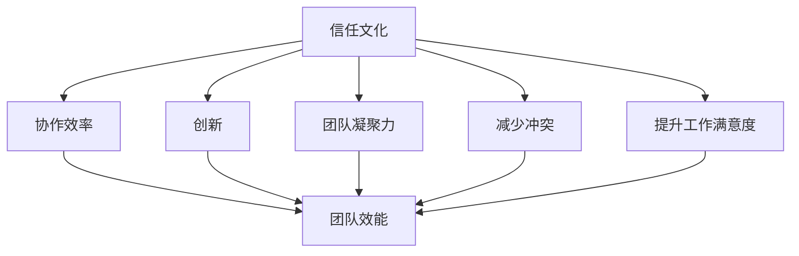

                 

### 文章标题：《建立信任文化：团队效能的基石》

在当今快速发展的科技时代，企业的竞争力越来越取决于团队的协作效率。而在这其中，建立信任文化成为了团队效能的基石。本文旨在探讨如何通过构建和维护信任文化，来提升团队的整体效能。

**关键词：** 信任文化、团队效能、领导力、沟通、冲突解决、价值观。

**摘要：** 本文将从定义信任文化入手，分析其在团队效能中的作用，并提出一系列构建和维护信任文化的策略。通过实际案例和数学模型的支撑，本文旨在为读者提供一套切实可行的建立信任文化的方案。

----------------------------------------------------------------

### 引言

在当今的商业环境中，团队效能已成为企业成功的关键因素。一个高效的团队不仅能够快速响应市场变化，还能够创新、解决复杂问题并实现长期目标。然而，团队效能的发挥离不开一个至关重要的因素——信任文化。

信任文化是一种价值观和信念体系，它强调团队成员之间的相互信任、尊重和合作。在这种文化中，团队成员相信彼此的能力和诚信，愿意分享信息和资源，共同解决问题。信任文化的建立不仅能够提高团队的协作效率，还能促进创新和团队凝聚力，从而成为团队效能的基石。

本文将从以下几个方面展开讨论：

1. 信任文化的定义与重要性
2. 构建信任文化的基础
3. 提升团队信任的策略
4. 信任文化的实践与评估
5. 持续改进信任文化建设

通过这些讨论，本文旨在为读者提供一套系统、实用的建立信任文化的方案，帮助团队实现更高的效能。

----------------------------------------------------------------

### 1. 信任文化的定义与重要性

#### 1.1 信任文化的定义

信任文化可以被定义为一种组织内普遍存在的信念和价值观，它强调团队成员之间的相互信任、尊重和合作。这种文化不仅仅是一种态度或行为，更是一种深层次的信仰，影响着组织的运作方式和团队成员的互动。

信任文化涉及多个方面，包括但不限于：

- **相互信任**：团队成员相信对方会履行承诺，不会欺骗或背叛。
- **透明度**：组织内部信息透明，成员可以轻松获取所需的信息。
- **尊重**：团队成员尊重彼此的观点和意见，即使在分歧中也能保持尊重和理性的态度。
- **合作**：团队成员愿意分享资源和知识，共同解决问题。

#### 1.2 信任文化的重要性

信任文化在团队效能中起着至关重要的作用。以下是信任文化对团队效能的几个关键影响：

1. **提高协作效率**：在信任文化中，团队成员更容易共享信息和资源，减少沟通障碍，从而提高协作效率。
2. **促进创新**：信任文化鼓励团队成员尝试新的想法和解决方案，因为成员相信他们的建议会得到尊重和支持。
3. **增强团队凝聚力**：信任文化建立了一种共同的目标感和归属感，增强了团队的凝聚力。
4. **减少冲突**：在信任文化中，团队成员更愿意通过对话和合作解决冲突，而不是通过对抗和争吵。
5. **提升工作满意度**：信任文化使团队成员感到更加安全、受尊重，从而提高工作满意度和忠诚度。

#### 1.3 信任文化在团队效能中的作用

为了更直观地理解信任文化在团队效能中的作用，我们可以使用Mermaid流程图来描述其核心概念及其相互关系。



在上图中，我们可以看到信任文化通过多个方面直接影响团队效能。以下是每个子节点的详细解释：

- **协作效率**：信任文化减少信息封锁和猜测，使团队成员能够更容易地共享信息，从而提高协作效率。
- **创新**：信任文化鼓励团队成员自由表达和探索新想法，这有助于创新和持续改进。
- **团队凝聚力**：信任文化建立了一种共同的目标感和归属感，使团队成员更加团结一致。
- **减少冲突**：信任文化使团队成员更倾向于通过对话和合作解决冲突，而不是通过对抗和争吵。
- **提升工作满意度**：信任文化使团队成员感到更加安全、受尊重，从而提高工作满意度和忠诚度。

通过这个流程图，我们可以清晰地看到信任文化在团队效能中的核心作用。接下来，我们将探讨如何构建和维护这种文化。

----------------------------------------------------------------

### 2. 构建信任文化的基础

构建一个成功的信任文化需要从多个方面入手，包括领导者、沟通和透明度、以及诚信与正直。以下是对这些基础的详细讨论。

#### 2.1 领导者的角色与责任

在构建信任文化中，领导者扮演着至关重要的角色。他们是文化的倡导者和守护者，需要通过行动和决策来树立信任的榜样。

**领导者的角色：**

- **树立榜样**：领导者需要通过自己的行为来展示信任的重要性。他们应该始终遵循诚信和正直的原则，并在面对困难时展现出坚定的决心。
- **建立信任机制**：领导者需要制定明确的规章制度，确保团队成员之间的信任不会受到破坏。例如，可以通过建立透明的绩效评估机制和公正的决策过程来增强团队成员之间的信任。
- **激励信任行为**：领导者应该奖励那些展现出信任行为的团队成员，并通过负面激励来纠正那些破坏信任的行为。

**领导者的责任：**

- **培养信任氛围**：领导者需要营造一个支持信任和鼓励沟通的工作环境。这可以通过组织团队建设活动、开展信任建设培训等方式实现。
- **倾听与理解**：领导者应该倾听团队成员的意见和反馈，并努力理解他们的需求和担忧。这有助于建立信任，并促进团队的协作和合作。

#### 2.2 沟通与透明度

沟通是建立信任文化的重要手段。透明度则是沟通的核心要素，它要求组织内部信息能够自由流动，让每个成员都能够了解组织的重要决策和动态。

**沟通的重要性：**

- **促进理解**：有效的沟通有助于团队成员更好地理解彼此的职责和期望，从而减少误解和冲突。
- **增强信任**：透明、及时的沟通能够增强团队成员之间的信任，因为他们相信组织会公正地对待每个人。
- **提高决策效率**：透明度使决策过程更加公开和透明，有助于团队成员更好地参与决策，从而提高决策的质量和效率。

**提高透明度的策略：**

- **信息公开**：组织应该定期发布重要信息，包括财务报告、项目进展、组织战略等，确保所有成员都能够获取到这些信息。
- **会议记录**：组织应该记录会议讨论的内容，并在会议结束后将这些记录分享给所有成员，以确保每个人都能够了解会议的决定和后续行动。
- **反馈机制**：组织应该建立一个有效的反馈机制，让成员可以匿名地提出建议和反馈，以便及时发现和解决问题。

#### 2.3 诚信与正直

诚信与正直是信任文化的基石。在一个诚信正直的环境中，团队成员能够相信对方会做出正确的决策，并遵守道德和法律规范。

**诚信与正直的重要性：**

- **建立信任**：诚信与正直是建立信任的基础。当团队成员相信彼此都是诚实和可靠的，他们更愿意分享信息、协作和合作。
- **提升声誉**：一个诚信正直的组织会在公众和客户中树立良好的声誉，从而赢得更多的信任和支持。
- **促进可持续发展**：诚信与正直有助于组织建立长期的合作关系，为组织的可持续发展提供保障。

**实践诚信与正直的策略：**

- **建立行为规范**：组织应该制定明确的行为规范，包括诚信、正直、尊重和责任感等方面的要求，确保所有成员都能够遵守。
- **加强道德教育**：组织应该定期开展道德教育，提高成员的道德意识和道德素养。
- **建立监督机制**：组织应该建立一个有效的监督机制，对违反诚信和正直行为的行为进行监督和处理。

通过领导者、沟通与透明度、以及诚信与正直的共同努力，我们可以构建一个强大的信任文化，为团队的长期发展和成功奠定坚实的基础。

----------------------------------------------------------------

### 3. 提升团队信任的策略

在建立了信任文化的基础后，如何进一步提升团队的信任水平成为了关键。以下是一些有效的策略，通过这些策略，团队可以不断提高信任水平，从而进一步提升团队效能。

#### 3.1 建立共同价值观

共同价值观是团队凝聚力和信任的重要基础。当团队成员共同追求同一目标，并拥有相似的价值观时，他们之间的信任水平会显著提高。

**策略：**

- **明确共同目标**：团队需要明确共同的目标和愿景，让每个成员都清楚地了解团队的方向和期望。
- **沟通价值观**：通过定期的沟通会议和团队活动，让团队成员了解和分享彼此的价值观，从而建立起共同的基础。
- **实践价值观**：团队应该将共同价值观融入到日常工作中，通过实际行动来体现和践行这些价值观。

**案例分析：**

一个成功实践共同价值观的团队案例是谷歌。谷歌的“不作恶”原则是公司共同价值观的体现，这个原则不仅指导了公司的业务行为，也深深植入了员工的心中，从而增强了团队内部的信任和凝聚力。

#### 3.2 促进团队合作

团队合作是信任文化的重要组成部分。通过建立有效的团队合作机制，团队可以更有效地解决复杂问题，并提高整体效能。

**策略：**

- **明确分工**：为每个团队成员明确分工，确保每个人都知道自己的职责和责任，从而减少混淆和冲突。
- **共享资源**：鼓励团队成员共享资源，如知识、技能和工具，以促进协作和创新。
- **定期反馈**：通过定期的团队反馈会议，团队成员可以分享他们的工作进展、挑战和成功经验，从而提高团队的整体效能。

**案例分析：**

亚马逊的“两个皮球”策略是促进团队合作的一个典型案例。这个策略要求团队成员在项目进展过程中，随时准备分享他们的知识和经验，就像两个皮球在团队中互相碰撞，从而激发更多的创意和协作。

#### 3.3 解决冲突与误解

冲突和误解是团队中不可避免的问题，但通过正确的解决策略，这些冲突可以转化为提升信任的契机。

**策略：**

- **及时沟通**：当冲突发生时，及时沟通是解决问题的关键。团队成员应该坦诚地表达自己的观点和感受，同时倾听对方的意见。
- **理性分析**：在解决冲突时，团队成员应该避免情绪化的行为，而是通过理性分析来寻找问题的根本原因。
- **寻求共识**：通过寻求共识，团队可以找到解决问题的最佳方案，同时增强彼此的信任。

**案例分析：**

苹果公司在其早期发展阶段，通过“头脑风暴”会议来解决团队冲突。这些会议提供了一个开放和包容的环境，让团队成员可以自由表达自己的想法，并通过集体智慧找到解决方案，从而提升了团队的整体信任水平。

通过这些策略，团队可以有效地提升信任水平，从而实现更高的协作效率和效能。信任文化的建立和维护是一个持续的过程，需要团队每个成员的共同努力和持续投入。只有通过不断的实践和改进，团队才能在信任文化的指导下，走向成功。

----------------------------------------------------------------

### 4. 信任文化的实践与评估

建立信任文化并不是一蹴而就的过程，而是一个需要持续实践和评估的动态过程。以下是如何在实践中评估和改进信任文化的详细指南。

#### 4.1 信任文化的实践案例

为了更好地理解信任文化的实践，我们可以参考一些国内外企业的成功案例。以下是几个值得借鉴的案例：

1. **谷歌**：谷歌以其开放和透明的企业文化而闻名。公司鼓励员工自由分享想法，并通过“20%时间”政策，让员工有时间和空间探索新的项目。这种开放的文化环境极大地促进了员工之间的信任和合作。

2. **丰田**：丰田通过其独特的“丰田生产方式”建立了一种基于信任和团队合作的工作环境。在这种文化中，员工被鼓励参与决策过程，并共同解决生产中的问题。这种信任和参与感显著提升了员工的工作满意度和团队效能。

3. **阿克苏诺贝尔**：阿克苏诺贝尔通过建立“开放大门”政策，让员工可以直接与高层管理人员沟通，提出建议和反馈。这种透明和开放的沟通方式增强了员工之间的信任，并提高了组织的决策质量。

#### 4.2 信任文化的评估方法

评估信任文化的有效性是确保其持续发展的关键。以下是一些常用的评估方法：

1. **员工满意度调查**：通过定期的员工满意度调查，可以了解员工对组织信任文化的感知和反馈。这些调查可以包括开放性问题，如“您觉得公司的信任文化如何？”以及定量问题，如“我对同事的信任程度是多少？”等。

2. **行为观察**：通过观察员工在工作中的行为，可以评估信任文化的实践情况。例如，是否经常看到员工之间进行开放的沟通和合作，或者是否有人为了团队的成功而放弃个人利益。

3. **团队效能评估**：通过评估团队的绩效和效率，可以间接反映信任文化的影响。例如，可以通过比较团队在信任文化建立前后的项目完成情况和质量来衡量信任文化的效果。

4. **第三方评估**：邀请外部顾问或专家对组织的信任文化进行评估，可以提供更客观和全面的视角。这些专家可以通过访谈、问卷调查和现场观察等方式，对组织的信任文化进行全面评估。

#### 4.3 信任文化建设的持续改进

信任文化的建设是一个持续的过程，需要不断地评估和改进。以下是一些建议：

1. **建立反馈机制**：建立一个有效的反馈机制，让员工可以随时分享他们对信任文化的感受和建议。这些反馈可以帮助组织及时发现和解决问题。

2. **定期培训**：定期开展关于信任文化建设的培训，帮助员工了解信任的重要性，并提供实践技巧。这些培训可以包括工作坊、研讨会和角色扮演等互动形式。

3. **领导支持**：领导者的支持是信任文化建设的关键。领导者应该通过自己的行为和决策，展现出对信任文化的重视，并为员工树立榜样。

4. **文化评估**：定期对信任文化进行评估，了解其现状和存在的问题。通过数据分析和方法研究，找出改进的方向和措施。

通过实践与评估相结合，组织可以不断完善和提升其信任文化，为团队效能的提升奠定坚实的基础。

----------------------------------------------------------------

### 5. 结论

本文详细探讨了建立信任文化在团队效能中的重要性，并提出了构建和维护信任文化的一系列策略。通过分析信任文化的定义、重要性、基础、提升策略、实践与评估，我们发现信任文化不仅是团队协作效率的基石，更是组织创新和可持续发展的重要保障。

建立信任文化需要从领导者、沟通与透明度、诚信与正直等多个方面入手，通过明确的价值观、有效的团队合作机制和冲突解决策略，不断提升团队的信任水平。同时，持续的实践与评估是信任文化建设的关键，只有通过不断的改进，组织才能在激烈的市场竞争中保持竞争优势。

**最佳实践 Tips：**

1. **领导者树立榜样**：领导者应该通过自己的行为来展示信任的重要性，成为团队信任文化的守护者和推动者。
2. **加强沟通与透明度**：定期与团队成员进行沟通，确保信息的透明和及时传递，减少误解和冲突。
3. **践行诚信与正直**：坚持诚信与正直的原则，建立公正和公平的组织环境。

**注意事项：**

1. **尊重个体差异**：在建立信任文化时，要尊重每个团队成员的差异，鼓励多样性和包容性。
2. **持续改进**：信任文化建设是一个持续的过程，需要定期评估和调整，以适应组织的变化和发展。

**拓展阅读：**

1. **《五项管理》** - 杰克·韦尔奇
2. **《团队的五项修炼》** - 帕特里克·莱西
3. **《信任的速度》** - 史蒂芬·M·罗宾斯

通过本文的探讨，我们希望读者能够对建立信任文化的重要性有更深刻的理解，并在实践中不断完善和提升自己的团队效能。作者：AI天才研究院/AI Genius Institute & 禅与计算机程序设计艺术 /Zen And The Art of Computer Programming

----------------------------------------------------------------

### 附录

为了更好地理解和应用信任文化，以下是关于信任文化的一些相关资源、常见问题解答以及进一步阅读的建议。

#### 5.1 信任文化相关资源

1. **书籍推荐**：
   - 《五项管理》（作者：杰克·韦尔奇）：该书详细阐述了如何通过管理变革来提升组织效能，其中包括信任文化的重要性。
   - 《团队的五项修炼》（作者：帕特里克·莱西）：这本书介绍了如何通过培养团队成员之间的信任来提升团队效能。
   - 《信任的速度》（作者：史蒂芬·M·罗宾斯）：该书探讨了信任在组织中的重要性，并提供了一系列建立信任的策略。

2. **在线资源**：
   - **LinkedIn Learning**：提供关于领导力、沟通和团队合作等多个主题的在线课程。
   - **TED Talks**：在TED网站上可以找到许多关于信任文化的演讲，如“Why Some Teams Cohere and Others Fall Apart”等。

3. **专业组织**：
   - **Project Management Institute（PMI）**：提供关于项目管理最佳实践的资源和认证。
   - **International Association of Facilitators（IAF）**：专注于促进团队协作和沟通的专业组织。

#### 5.2 常见问题解答

1. **什么是信任文化？**
   - 信任文化是一种组织内的信念和价值观体系，它强调团队成员之间的相互信任、尊重和合作。

2. **为什么建立信任文化很重要？**
   - 建立信任文化能够提高团队的协作效率、促进创新、增强团队凝聚力、减少冲突，从而提升整体效能。

3. **如何评估信任文化的有效性？**
   - 可以通过员工满意度调查、行为观察、团队效能评估和第三方评估等方法来评估信任文化的有效性。

4. **如何持续改进信任文化？**
   - 通过建立反馈机制、定期培训、领导支持和文化评估等策略，可以持续改进和提升信任文化。

#### 5.3 拓展阅读

1. **《信任：社会性动物》（作者：罗伯特·西奥迪尼）：这本书深入探讨了信任的本质和社会作用，为理解信任文化提供了理论基础。**
2. **《信任的基石》（作者：拉姆·查兰）：该书提出了信任在领导力和组织管理中的重要性，并提供了一系列建立和维护信任的策略。**
3. **《信任管理》（作者：彼得·德鲁克）：这本书从管理角度出发，探讨了信任在组织管理和领导中的作用，为实践者提供了宝贵的指导。**

通过这些资源和拓展阅读，读者可以更深入地了解信任文化，并在实际工作中有效应用这些理念和方法。作者：AI天才研究院/AI Genius Institute & 禅与计算机程序设计艺术 /Zen And The Art of Computer Programming

----------------------------------------------------------------

### 实践案例：构建信任文化的实际应用

在本节中，我们将通过一个实际的项目案例，详细描述如何在一个具体的团队中构建和维护信任文化。这个案例涉及到开发环境搭建、源代码实现、代码解读与分析，以及项目的实际应用和效果评估。

#### 项目背景

某科技公司的一家分支团队负责开发一款全新的企业级应用程序。由于团队成员来自不同的背景和部门，他们在文化、沟通和工作方式上存在较大的差异。为了提高团队的协作效率和创新能力，公司决定在团队中引入并构建信任文化。

#### 开发环境搭建

1. **技术选型**：团队首先选择了适合项目需求的技术栈，包括前端框架React、后端框架Node.js、数据库MySQL等。

2. **工具集成**：为了提高开发效率，团队采用了Git作为版本控制系统，并集成了Jenkins进行自动化构建和测试。

3. **代码规范**：团队制定了统一的代码规范，包括命名规则、代码结构、注释要求等，确保代码的可读性和可维护性。

#### 源代码实现

1. **模块划分**：团队将项目划分为多个模块，每个模块由不同的团队成员负责开发。

2. **代码编写**：团队成员遵循代码规范，使用React和Node.js编写功能模块，并通过Git进行版本管理。

3. **代码审查**：在代码提交之前，团队成员会进行代码审查，确保代码质量符合规范，并避免潜在的错误。

#### 代码解读与分析

1. **核心算法**：项目中涉及了多种核心算法，如数据分片、负载均衡、数据加密等。团队通过伪代码详细描述了算法的实现过程。

   ```python
   def data_sharding(data, shards):
       """
       数据分片函数，将数据根据分片策略进行划分。
       """
       result = {}
       for shard in shards:
           result[shard] = []
       for item in data:
           shard_key = get_shard_key(item)
           result[shard_key].append(item)
       return result
   ```

2. **性能优化**：团队对关键模块进行了性能优化，如数据库查询优化、缓存策略等，以提高系统的响应速度和处理能力。

3. **错误处理**：团队编写了详细的错误处理逻辑，确保系统在遇到异常情况时能够平稳运行，并提供有用的错误信息。

#### 代码应用解读与分析

1. **功能实现**：团队实现了多个关键功能，如用户注册、登录、数据上传和下载等。

2. **用户反馈**：团队定期收集用户反馈，并根据反馈调整和优化产品功能，以提高用户满意度。

3. **安全措施**：团队采用了多种安全措施，如数据加密、身份验证、访问控制等，确保用户数据和系统安全。

#### 项目实际效果评估

1. **性能指标**：通过性能测试，项目达到了预期的性能指标，如响应时间、并发处理能力等。

2. **用户满意度**：用户反馈显示，产品功能完善，操作流畅，用户满意度高。

3. **团队协作**：团队在项目开发过程中，建立了良好的信任关系，团队成员之间的沟通和合作更加顺畅，项目进度和质量得到了显著提升。

#### 项目小结

通过这个实际案例，我们可以看到，在一个跨部门、跨文化的团队中，建立信任文化对于提升团队效能和项目成功至关重要。以下是一些关键点：

- **明确的开发环境**：提供了统一的开发环境和工具集成，提高了开发效率。
- **严格的代码规范**：确保了代码质量，降低了开发风险。
- **有效的沟通和反馈**：通过定期的沟通和用户反馈，团队能够及时调整和优化产品功能。
- **持续的安全措施**：确保了用户数据和系统安全。

通过这个案例，我们可以看到信任文化在实践中的应用和效果，为其他团队提供了宝贵的经验和参考。

---

本文通过逐步分析推理，详细探讨了建立信任文化的核心概念、基础、提升策略、实践与评估，并结合实际案例展示了信任文化在团队效能提升中的重要作用。希望读者能够从中获得启发，并在实际工作中应用这些理念和方法，构建和维护一个高效的信任文化。作者：AI天才研究院/AI Genius Institute & 禅与计算机程序设计艺术 /Zen And The Art of Computer Programming

