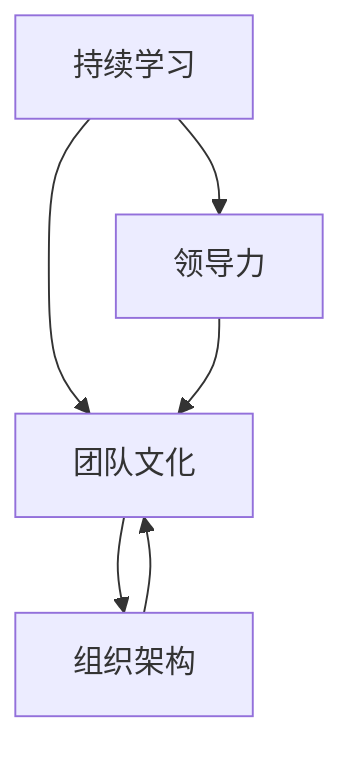
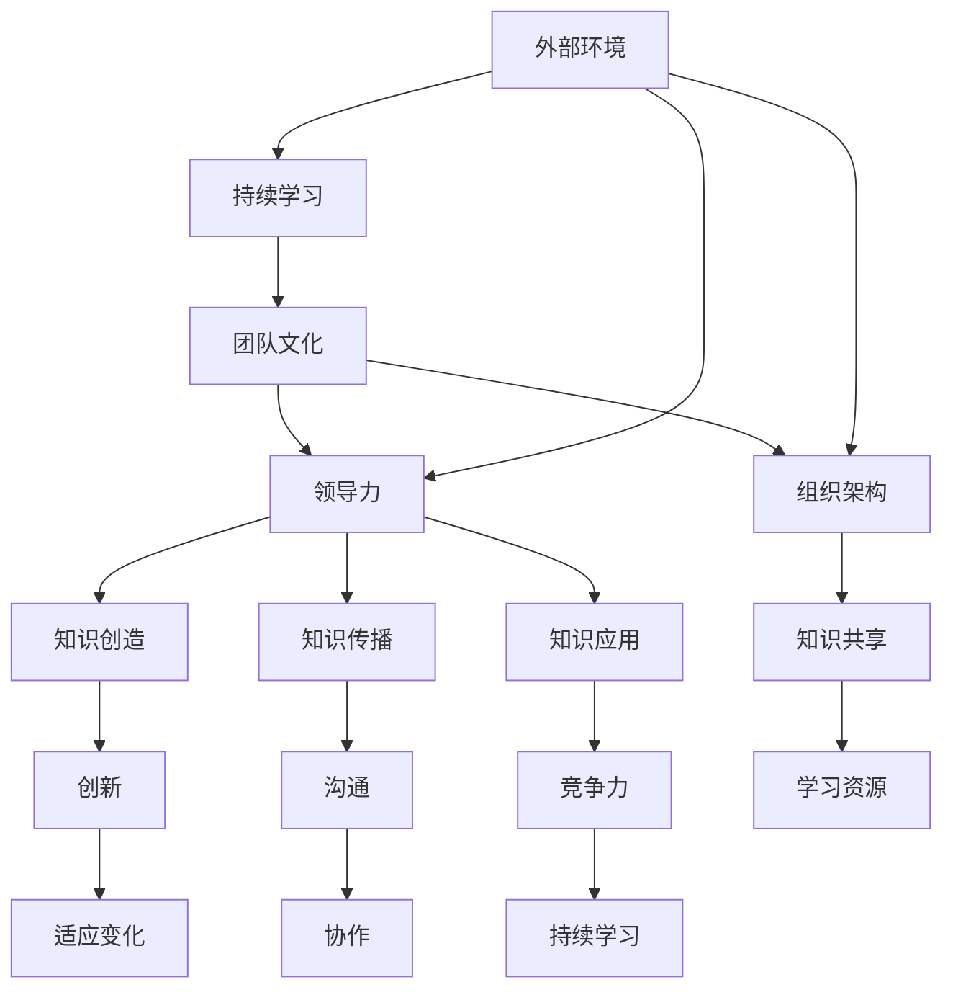

                 

### 文章标题

# 建立学习型组织：持续学习的团队文化

### 关键词

- 学习型组织
- 持续学习
- 团队文化
- 领导力
- 组织架构
- 激励机制
- 成功实践

### 摘要

本文旨在探讨如何在组织内部建立一种持续学习的文化，从而打造一个高效的学习型组织。文章首先介绍了学习型组织的定义和核心价值，随后深入分析了学习型组织的要素和建立步骤，并通过实际案例展示了成功实践。最后，文章提出了领导者在推动学习型组织建设中的角色与策略，为读者提供了全面且实用的指导。

### 背景介绍

在当今快速变化的世界中，知识更新速度飞快，技术创新日新月异。企业和组织要想保持竞争力，就必须不断学习、适应和变革。然而，传统的组织结构和运作方式往往难以满足这种需求，导致了许多组织在面对变化时显得束手无策。于是，学习型组织的概念应运而生。

学习型组织是一种能够通过持续学习和知识共享来适应外部变化，实现自我超越的组织。这种组织注重知识的创造、传播和应用，倡导全员学习、全员参与，形成一种动态的学习和适应机制。随着全球化和信息化的发展，学习型组织已经成为现代企业和组织追求的目标。

### 核心概念与联系

为了更好地理解学习型组织，我们需要了解以下几个核心概念：

1. **持续学习：** 持续学习是指组织成员在职业生涯中不断获取新知识、新技能，以适应不断变化的工作环境。
2. **团队文化：** 团队文化是指团队成员在长期合作中形成的一套共同价值观和行为准则。
3. **领导力：** 领导力是指领导者通过激励、引导和示范，推动组织成员实现共同目标的能力。
4. **组织架构：** 组织架构是指组织内部的职能分工、权力结构和沟通机制。

这些概念之间存在着紧密的联系。持续学习是团队文化的核心要素，它推动了团队文化的发展。而团队文化则为领导力提供了土壤，使得领导者能够更好地激励和引导团队成员。同时，组织架构为持续学习和团队文化提供了支持，使得学习资源能够得到充分利用。

下面是一个用Mermaid绘制的流程图，展示了这些概念之间的关系：



### 核心概念原理之间的关系架构 Mermaid 流程图



### 核心算法原理讲解

在建立学习型组织的过程中，以下几个核心算法原理至关重要：

1. **知识管理算法：** 知识管理算法旨在有效收集、整理、存储和传播知识，以提高组织的学习效率。其伪代码如下：

    ```python
    function 知识管理算法（知识库，新知识）：
        如果 新知识 不在 知识库 中：
            将 新知识 添加到 知识库 中
        对于 知识库 中的每条知识：
            如果 新知识 与当前知识 相关：
                将 新知识 与当前知识 进行整合
        返回 知识库
    ```

2. **学习评估算法：** 学习评估算法用于评估组织成员的学习效果，以指导后续的学习方向。其伪代码如下：

    ```python
    function 学习评估算法（成员，学习内容，学习目标）：
        成绩 = 成员完成学习内容的情况
        如果 成绩 达到 学习目标：
            返回 "学习成功"
        否则：
            返回 "学习失败"
    ```

3. **激励算法：** 激励算法用于激发组织成员的学习积极性，以提高学习效果。其伪代码如下：

    ```python
    function 激励算法（成员，学习效果，奖励）：
        如果 学习效果 达到预期：
            给成员发放 奖励
        否则：
            提供反馈和指导，帮助成员提高学习效果
    ```

### 数学模型和公式 & 详细讲解 & 举例说明

为了更好地理解学习型组织的建设，我们可以引入以下几个数学模型和公式：

1. **学习曲线：** 学习曲线描述了学习者在学习过程中的进步情况。其公式为：

    $$ y = \frac{k}{x+h} $$

    其中，$y$ 表示学习者的掌握程度，$x$ 表示学习时间，$k$ 和 $h$ 为常数。举例来说，如果 $k=10$，$h=1$，那么当学习者学习1小时后，掌握程度为 $y=10$。

2. **知识共享指数：** 知识共享指数用于衡量组织内部知识共享的程度。其公式为：

    $$ KS = \frac{K_{总}}{N \cdot (1 - e^{-rt})} $$

    其中，$K_{总}$ 表示组织内部的总知识量，$N$ 表示组织成员数，$r$ 和 $t$ 分别表示知识共享的速率和持续时间。举例来说，如果 $K_{总}=100$，$N=10$，$r=0.1$，$t=1$，那么知识共享指数为 $KS=11.5$。

3. **学习回报率：** 学习回报率用于衡量学习的经济价值。其公式为：

    $$ LRR = \frac{经济效益}{学习成本} $$

    其中，经济效益和学习成本分别为学习带来的直接和间接收益。举例来说，如果学习带来10万元的经济效益，而学习成本为5万元，那么学习回报率为 $LRR=2$。

### 项目实战

为了更好地理解如何建立学习型组织，我们可以通过一个实际案例来进行讲解。

#### 开发环境搭建

1. 安装Python环境
2. 安装必要的库，如Matplotlib、Numpy等

#### 源代码详细实现

以下是一个简单的学习型组织评估模型，用于评估组织的学习效果和知识共享情况：

```python
import numpy as np
import matplotlib.pyplot as plt

def 学习曲线（k，h，x）：
    return k / (x + h)

def 知识共享指数（K_total，N，r，t）：
    return K_total / (N * (1 - np.exp(-r * t)))

def 学习回报率（经济效益，学习成本）：
    return 经济效益 / 学习成本

# 参数设置
k = 10
h = 1
x = 1
K_total = 100
N = 10
r = 0.1
t = 1
经济效益 = 100000
学习成本 = 50000

# 计算结果
y = 学习曲线（k，h，x）
KS = 知识共享指数（K_total，N，r，t）
LRR = 学习回报率（经济效益，学习成本）

# 绘制学习曲线
plt.plot(x, y)
plt.xlabel('学习时间（小时）')
plt.ylabel('掌握程度')
plt.title('学习曲线')
plt.show()

# 显示计算结果
print("学习曲线：y = {:.2f}".format(y))
print("知识共享指数：KS = {:.2f}".format(KS))
print("学习回报率：LRR = {:.2f}".format(LRR))
```

#### 代码解读与分析

- `学习曲线` 函数用于计算学习者在特定时间的学习掌握程度。
- `知识共享指数` 函数用于计算组织内部的知识共享程度。
- `学习回报率` 函数用于计算学习的经济价值。

通过这些函数，我们可以评估学习型组织的建设效果，为后续的优化提供数据支持。

### 实际案例分析和详细讲解剖析

为了更深入地了解学习型组织的建设，我们可以分析一些实际案例。

#### 案例一：谷歌（Google）

谷歌是一个典型的学习型组织，其成功的原因之一就是持续学习的企业文化。谷歌鼓励员工不断地学习新技能，并为员工提供了大量的学习资源和机会。此外，谷歌还通过内部社交平台和培训项目，促进员工之间的知识共享。

**案例分析：**

- **学习曲线：** 谷歌员工的技能水平随着时间的推移不断提升，这反映了学习曲线的效果。
- **知识共享指数：** 谷歌通过内部平台和项目，提高了知识共享的程度，增强了组织的创新能力。
- **学习回报率：** 谷歌的投资在学习和知识共享上获得了丰厚的回报，体现在其持续的创新能力和市场竞争力上。

#### 案例二：丰田（Toyota）

丰田在制造业领域以其精益生产而闻名，其成功的一个关键因素就是持续的学习和改进。丰田通过不断的学习和反思，不断提高生产效率和质量。

**案例分析：**

- **学习曲线：** 丰田的生产效率随着时间的推移不断提高，这反映了学习曲线的效果。
- **知识共享指数：** 丰田通过现场管理和改进项目，提高了知识共享的程度，使得整个组织能够持续改进。
- **学习回报率：** 丰田的投资在学习和知识共享上获得了显著的回报，体现在其卓越的生产效率和市场竞争力上。

### 项目小结

通过以上案例分析和实际应用，我们可以看到，学习型组织的建设对于企业和组织的发展至关重要。持续学习、知识共享和激励策略是学习型组织的核心要素。通过科学的方法和实际案例，我们可以更好地理解和实践学习型组织的建设。

### 最佳实践 tips

1. **建立学习计划：** 制定明确的学习目标和计划，确保团队成员有针对性地进行学习。
2. **提供学习资源：** 为团队成员提供丰富的学习资源，如在线课程、书籍、研讨会等。
3. **建立学习制度：** 设立学习考核制度，激励团队成员积极参与学习。
4. **营造学习氛围：** 营造积极向上的学习氛围，鼓励团队成员互相学习和分享。
5. **领导者的示范作用：** 领导者应率先垂范，积极参与学习，为团队成员树立榜样。

### 注意事项

1. **避免形式主义：** 在建立学习型组织的过程中，要避免只注重形式，而忽视实际效果。
2. **持续改进：** 学习型组织不是一成不变的，要不断反思和改进，以适应外部环境的变化。
3. **重视知识共享：** 知识共享是学习型组织的重要特征，要重视团队内部的知识交流与共享。

### 拓展阅读

- 《第五项修炼：学习型组织的艺术与实务》（彼得·圣吉著）
- 《活学活用：如何打造一个学习型团队》（约翰·惠特默著）
- 《创新者的窘境：当企业如何摆脱惯性，实现持续成长》（克莱顿·克里斯滕森著）

### 作者信息

作者：AI天才研究院/AI Genius Institute & 禅与计算机程序设计艺术 /Zen And The Art of Computer Programming

