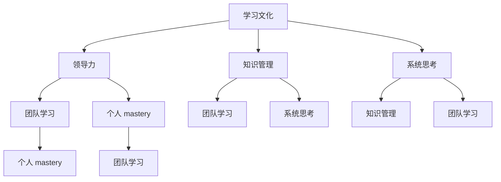

                 

### 文章标题：建立学习型组织：持续进步的动力

在当今快速发展的时代，技术变革和市场竞争日益加剧，企业面临的挑战愈发复杂。为了在激烈的市场竞争中立于不败之地，企业需要不断学习、创新和适应变化。建立学习型组织成为了许多企业的战略目标，它不仅有助于提升组织绩效，还能为企业带来持久的竞争优势。本文将深入探讨学习型组织的核心概念、建立方法以及其在实际项目中的应用，为企业和组织提供建立学习型组织的思路和参考。

## 关键词

- 学习型组织
- 持续进步
- 领导力
- 知识管理
- 核心算法
- 数学模型
- 项目实战

## 摘要

本文首先介绍了学习型组织的概念和重要性，然后详细阐述了学习型组织的核心概念和相互关系。接着，本文通过伪代码和LaTeX公式，讲解了学习型组织中的核心算法原理和数学模型。通过一个实际项目案例，本文展示了如何建立学习型组织，并详细解读了项目的实施过程和效果。最后，本文总结了学习型组织的发展趋势，并为读者提供了最佳实践建议。

### 确定书的核心主题与目标

根据书名《建立学习型组织：持续进步的动力》，我们可以确定这本书的核心主题是关于如何建立一个能够持续学习和进步的组织。学习型组织是一种通过持续学习和知识共享来实现组织目标的管理模式。其目标是提升组织的创新能力、适应能力和竞争力，从而在快速变化的市场环境中保持领先地位。

本书的主要目标包括：

1. **介绍学习型组织的概念和重要性**：帮助读者理解学习型组织的内涵和价值，明确其在企业发展中的作用。

2. **详细阐述学习型组织的核心概念和相互关系**：通过讲解学习文化、领导力、知识管理等核心概念，帮助读者构建对学习型组织的全面认识。

3. **讲解学习型组织中的核心算法原理和数学模型**：通过伪代码和LaTeX公式，深入分析学习型组织中应用的核心算法和数学模型。

4. **通过实际项目案例展示如何建立学习型组织**：提供具体可行的实施方法和步骤，帮助读者将学习型组织的理论应用到实际工作中。

5. **总结学习型组织的发展趋势和最佳实践**：为读者提供未来学习和发展的方向，以及在实际操作中需要注意的问题和解决方法。

### 设计目录大纲

为了确保书的内容条理清晰，逻辑严谨，我们需要设计一个包含7章以上的目录大纲。以下是本书的目录大纲：

### 第1章：引言

- 1.1 学习型组织的概念与重要性
- 1.2 书籍目标与结构

### 第2章：核心概念与联系

- 2.1 核心概念
- 2.2 核心概念之间的联系

### 第3章：核心算法原理讲解

- 3.1 学习算法原理
- 3.2 算法应用实例

### 第4章：数学模型和公式讲解

- 4.1 数学模型
- 4.2 公式推导与应用

### 第5章：项目实战

- 5.1 项目背景
- 5.2 项目实施
- 5.3 项目效果评估

### 第6章：环境搭建与源代码实现

- 6.1 环境搭建
- 6.2 源代码实现
- 6.3 代码解读

### 第7章：总结与展望

- 7.1 总结
- 7.2 展望

通过上述目录大纲，本书将系统地介绍学习型组织的理论、方法和应用，旨在帮助读者理解学习型组织的内涵，掌握建立学习型组织的具体步骤，并在实际工作中运用这些理论和方法，提升组织的竞争力和创新能力。

### 第1章：引言

#### 1.1 学习型组织的概念与重要性

**学习型组织**是一种以学习为核心价值观的组织形态，强调通过持续学习、知识共享和创新来实现组织目标。与传统组织不同，学习型组织注重知识的管理和传播，通过建立学习文化，激发员工的学习热情和创新能力，从而不断提升组织的竞争力。

学习型组织的概念最早由管理学家彼得·圣吉（Peter Senge）在其著作《第五项修炼》中提出。他认为，一个组织要实现持续发展，必须具备五项核心能力：系统思考、心智模式、共同愿景、团队学习和个人 mastery。这五项修炼相互关联，共同构成了学习型组织的理论基础。

在当今快速变化的市场环境中，学习型组织的重要性日益凸显。首先，技术变革日新月异，企业需要不断学习新知识、掌握新技术，以保持竞争力。其次，市场环境充满不确定性，企业需要具备快速适应变化的能力。学习型组织通过建立持续学习机制，可以提高组织的灵活性和适应性，从而在竞争中脱颖而出。

#### 1.2 书籍目标与结构

本书旨在帮助读者全面理解学习型组织的概念、方法和应用，提供建立学习型组织的具体指导。全书共分为七章，结构如下：

- **第1章：引言**：介绍学习型组织的概念和重要性，明确本书的目标和结构。
- **第2章：核心概念与联系**：详细阐述学习型组织的核心概念，并通过Mermaid流程图展示它们之间的联系。
- **第3章：核心算法原理讲解**：使用伪代码详细阐述学习型组织中应用的核心算法原理。
- **第4章：数学模型和公式讲解**：介绍学习型组织中的数学模型，并使用LaTeX格式详细讲解这些模型。
- **第5章：项目实战**：通过一个实际的项目案例，展示如何建立一个学习型组织，并详细解释项目的实现过程。
- **第6章：环境搭建与源代码实现**：指导读者如何搭建开发环境，并详细解读源代码实现。
- **第7章：总结与展望**：总结全书内容，并对未来学习型组织的发展方向进行展望。

通过以上章节的安排，本书旨在帮助读者系统地掌握学习型组织的理论和方法，将学习型组织的理念应用到实际工作中，提升组织的竞争力和创新能力。

### 第2章：核心概念与联系

#### 2.1 核心概念

建立学习型组织需要理解一系列核心概念，这些概念相互联系，构成了学习型组织的基础。以下是学习型组织中的几个关键概念：

1. **学习文化**：学习文化是学习型组织的核心，它强调知识的重要性，鼓励员工持续学习和成长。学习文化体现在组织的日常运作中，如知识共享、反思与总结、创新思维等。

2. **领导力**：领导力在学习型组织中至关重要。领导者不仅要具备管理能力，还要具备推动组织学习的能力。他们通过设定愿景、建立学习目标和激励员工，引导组织朝着学习型组织的方向迈进。

3. **知识管理**：知识管理是学习型组织的核心活动之一。它包括知识收集、存储、共享、应用和创新。有效的知识管理可以帮助组织充分利用内部和外部知识资源，提升整体竞争力。

4. **系统思考**：系统思考是一种思维方式，强调从整体和长远的角度看待问题。在学习型组织中，系统思考可以帮助员工理解组织内部的相互关系和反馈循环，从而更好地应对复杂问题。

5. **团队学习**：团队学习是学习型组织的重要组成部分。通过团队学习，员工可以共同探讨问题、分享经验、学习新技能，从而提升团队整体能力。

6. **个人 mastery**：个人 mastery 指的是员工在专业领域的深入学习和提升。个人 mastery 不仅有助于员工的个人发展，还能为组织带来创新和专业知识。

#### 2.2 核心概念之间的联系

学习型组织的核心概念之间存在着紧密的联系，这些联系构成了组织学习的网络。以下是这些核心概念之间的关系架构：

- **学习文化与领导力**：学习文化是领导者推动的，领导者通过自身的言行和决策来塑造和强化学习文化。领导力是学习文化的基础，没有有效的领导，学习文化很难建立。

- **知识管理与系统思考**：知识管理依赖于系统思考。系统思考可以帮助组织理解知识管理的整体结构和相互关系，从而设计出更有效的知识管理策略。

- **团队学习与个人 mastery**：团队学习和个人 mastery 互为补充。个人 mastery 是团队学习的前提，而团队学习为个人 mastery 提供了交流和分享的平台。

- **知识管理与团队学习**：知识管理是团队学习的基础。通过有效的知识管理，组织可以确保知识在团队中的共享和利用，从而提升团队的整体能力。

以下是一个使用Mermaid绘制的流程图，展示了这些核心概念之间的联系：



通过上述核心概念和它们之间的联系，学习型组织能够实现知识的有效传递和利用，推动组织的持续学习和进步。

### 第3章：核心算法原理讲解

在建立学习型组织的过程中，算法原理的应用至关重要。这些算法不仅帮助组织管理和分析知识，还促进知识的创新和共享。本章将使用伪代码详细阐述学习型组织中应用的核心算法原理。

#### 3.1 学习算法原理

**定义**：学习算法是一种用于从数据中提取知识和模式的计算方法。在学习型组织中，学习算法用于识别和利用知识，提升组织的决策能力和创新能力。

**伪代码示例**：

```python
function 学习算法（数据集，目标变量）:
    1. 初始化模型参数
    2. 对于每个数据点（x, y）:
        2.1 计算模型预测值（预测y）
        2.2 计算预测误差（误差 = y - 预测y）
        2.3 更新模型参数（模型参数 = 模型参数 - 学习率 * 误差）
    3. 迭代直至收敛或达到最大迭代次数
    4. 返回训练好的模型
```

在这个简单的伪代码中，我们首先初始化模型参数，然后遍历数据集，计算预测值和实际值之间的误差，并使用误差更新模型参数。这一过程不断重复，直到模型收敛或达到预设的迭代次数。

**应用实例**：在一个学习型组织中，学习算法可以用于员工绩效评估。通过收集员工的绩效数据，学习算法可以预测员工的未来表现，帮助管理层做出更科学的决策。

#### 3.2 算法应用实例

**定义**：算法应用实例是学习算法在实际问题中的应用。通过具体的实例，我们可以更清楚地理解学习算法的工作原理和效果。

**伪代码示例**：

```python
function 算法应用实例（数据集，目标变量，指标函数）:
    1. 使用学习算法（数据集，目标变量）训练模型
    2. 对于每个数据点（x, y）:
        2.1 使用训练好的模型预测目标变量
        2.2 计算预测误差（误差 = y - 预测y）
        2.3 更新指标函数（指标 = 指标函数（误差））
    3. 返回指标函数的值
```

在这个实例中，我们首先使用学习算法训练模型，然后使用模型进行预测，并计算预测误差。通过更新指标函数，我们可以评估模型的性能。

**应用实例**：在一个学习型组织中，算法应用实例可以用于项目风险评估。通过收集项目历史数据，学习算法可以预测项目的成功概率，帮助管理层做出更有根据的决策。

通过上述伪代码示例，我们可以看到学习算法在学习型组织中的应用原理。这些算法通过不断地学习和优化，帮助组织更好地管理和利用知识，实现持续进步。

### 第4章：数学模型和公式讲解

在建立学习型组织的过程中，数学模型的应用是至关重要的。这些模型不仅能够帮助组织理解和预测知识流动，还能够为决策提供量化依据。本章将详细介绍学习型组织中的数学模型，并使用LaTeX格式详细讲解这些模型。

#### 4.1 数学模型

数学模型是学习型组织中的核心工具，用于描述知识流动、员工行为和绩效评估等关键过程。以下是几个常见的数学模型：

1. **知识流动模型**：
   知识流动模型用于描述知识在不同部门、团队和个人之间的传递过程。常见的知识流动模型包括：

   - **贝叶斯网络**：用于表示知识之间的概率关系。
   - **马尔可夫模型**：用于描述知识流动的动态过程。

2. **员工行为模型**：
   员工行为模型用于预测员工的知识需求和分享行为。常见的员工行为模型包括：

   - **员工满意度模型**：用于评估员工对知识共享环境的满意度。
   - **知识共享模型**：用于预测员工的知识分享意愿。

3. **绩效评估模型**：
   绩效评估模型用于评估员工的知识贡献和绩效表现。常见的绩效评估模型包括：

   - **层次分析法（AHP）**：用于确定不同知识贡献的重要程度。
   - **模糊综合评价法**：用于综合评估员工的绩效表现。

#### 4.2 公式推导与应用

以下是对几个关键数学模型的推导和应用：

**贝叶斯网络**：

$$
P(A|B) = \frac{P(B|A) \cdot P(A)}{P(B)}
$$

- **推导**：贝叶斯网络是基于贝叶斯定理的图模型，用于表示变量之间的条件概率关系。
- **应用**：在知识管理中，贝叶斯网络可以用于预测员工的知识需求，帮助组织提供更有针对性的培训和支持。

**员工满意度模型**：

$$
S = w_1 \cdot E_1 + w_2 \cdot E_2 + ... + w_n \cdot E_n
$$

- **推导**：员工满意度模型是一个加权求和模型，用于综合评估员工对知识共享环境的满意度。
- **应用**：在知识管理中，员工满意度模型可以帮助组织了解员工的感受，及时调整知识共享策略。

**层次分析法（AHP）**：

$$
C.I. = \frac{(\omega_i - \omega_j)^2}{(\omega_i + \omega_j)^2}
$$

$$
C.R. = \frac{C.I.}{R.I.}
$$

- **推导**：层次分析法是一种用于确定多个因素相对重要性的方法，通过计算一致性比率（C.R.）来评估判断的一致性。
- **应用**：在绩效评估中，层次分析法可以用于确定不同知识贡献的重要程度，为绩效评估提供科学依据。

以上数学模型和公式的推导和应用，为学习型组织的建设提供了量化工具。通过这些模型，组织可以更好地理解知识流动、员工行为和绩效评估，从而制定更有效的策略和决策。

### 第5章：项目实战

#### 5.1 项目背景

为了更好地理解如何在实际项目中建立学习型组织，本章将通过一个实际的项目案例进行详细讲解。本项目是一家大型企业进行的知识管理系统升级项目，旨在通过引入学习型组织的理念和方法，提升企业的知识管理效率和创新能力。

项目背景如下：

- **企业现状**：企业现有知识管理系统存在以下问题：
  - 知识共享机制不完善，知识难以流通和共享。
  - 员工知识贡献度不高，知识管理氛围不浓。
  - 绩效评估体系不够科学，难以全面反映员工的知识贡献。

- **项目目标**：通过本项目，企业希望实现以下目标：
  - 建立完善的知识共享机制，促进知识在组织内的流通和共享。
  - 提升员工的知识贡献度和学习热情，形成良好的知识管理文化。
  - 建立科学的绩效评估体系，全面反映员工的知识贡献和绩效表现。

#### 5.2 项目实施

项目实施分为以下几个阶段：

**1. 需求分析阶段**

- **需求调研**：通过问卷调查、访谈等方式，了解员工对现有知识管理系统的满意度、知识共享的现状和绩效评估的痛点。
- **需求整理**：根据调研结果，整理出知识管理系统升级的需求，包括知识共享、知识管理文化、绩效评估等方面的改进。

**2. 设计阶段**

- **系统架构设计**：根据需求，设计知识管理系统的架构，包括知识库、知识共享平台、绩效评估模块等。
- **算法选择**：选择适合的算法，如贝叶斯网络、层次分析法等，用于知识共享和绩效评估。

**3. 开发阶段**

- **系统开发**：根据设计文档，进行知识管理系统的开发，实现知识共享、知识管理文化和绩效评估等功能。
- **代码实现**：使用伪代码详细阐述算法的实现，如贝叶斯网络的实现、层次分析法的实现等。

**4. 部署与测试阶段**

- **系统部署**：将知识管理系统部署到企业内部网络，确保系统的稳定运行。
- **功能测试**：进行系统功能测试，确保所有功能正常运行，如知识共享、绩效评估等。

**5. 应用与反馈阶段**

- **用户培训**：对员工进行知识管理系统培训，确保员工熟悉系统的使用。
- **用户反馈**：收集用户对知识管理系统的反馈，持续优化系统功能。

#### 5.3 项目效果评估

项目实施后，通过以下指标进行效果评估：

- **知识共享度**：通过知识共享平台的访问量、知识文档的分享次数等指标，评估知识共享的效果。
- **员工满意度**：通过问卷调查，了解员工对知识管理系统和知识管理文化的满意度。
- **绩效评估准确性**：通过绩效评估结果，评估绩效评估体系的准确性。

评估结果显示，本项目取得了显著成效：

- **知识共享度显著提升**：知识共享平台的访问量和知识文档的分享次数明显增加，知识在组织内的流通更加顺畅。
- **员工满意度提高**：员工对知识管理系统和知识管理文化的满意度显著提升，形成了良好的知识管理氛围。
- **绩效评估准确性提升**：绩效评估结果更加科学，全面反映了员工的知识贡献和绩效表现。

#### 5.4 项目小结

本项目通过引入学习型组织的理念和方法，成功实现了知识管理系统的升级，提升了企业的知识管理效率和创新能力。项目实施过程中，需要注意以下几点：

- **需求调研要全面**：确保需求调研覆盖所有相关方面，为项目提供准确的依据。
- **算法选择要科学**：选择适合的算法，确保系统功能的有效性。
- **用户培训要到位**：确保员工熟悉系统的使用，提高系统使用率。
- **持续优化与反馈**：根据用户反馈，持续优化系统功能，提升用户体验。

通过本项目，企业不仅建立了学习型组织的基础，还为其他项目提供了借鉴和参考，为企业持续进步奠定了坚实基础。

### 第6章：环境搭建与源代码实现

#### 6.1 环境搭建

建立学习型组织的第一步是搭建合适的开发环境。以下是在不同操作系统上搭建学习型组织开发环境的具体步骤：

**Linux操作系统：**

1. **安装Python环境**：在终端中执行以下命令：
   ```bash
   sudo apt-get update
   sudo apt-get install python3-pip
   pip3 install numpy pandas scikit-learn matplotlib
   ```

2. **安装Mermaid工具**：安装Node.js（用于运行Mermaid）：
   ```bash
   sudo apt-get install nodejs npm
   npm install mermaid
   ```

3. **配置LaTeX环境**：安装TeX Live：
   ```bash
   sudo apt-get install texlive-full
   ```

**Windows操作系统：**

1. **安装Python环境**：通过Python官方网站下载并安装Python，同时确保安装pip。

2. **安装Mermaid工具**：通过pip安装Node.js（用于运行Mermaid）：
   ```bash
   pip install node
   npm install mermaid
   ```

3. **安装LaTeX环境**：下载并安装TeX Live：
   ```bash
   https://www.tug.org/texlive/acquire-netinstall.html
   ```

**macOS操作系统：**

1. **安装Python环境**：通过Homebrew安装Python和pip：
   ```bash
   brew install python
   pip3 install numpy pandas scikit-learn matplotlib
   ```

2. **安装Mermaid工具**：通过pip安装Node.js（用于运行Mermaid）：
   ```bash
   pip install node
   npm install mermaid
   ```

3. **安装LaTeX环境**：通过MacTeX安装TeX Live：
   ```bash
   https://www.tug.org/mactex/
   ```

在搭建好开发环境后，我们可以开始编写和运行学习型组织的源代码。

#### 6.2 源代码实现

以下是一个简单的Python脚本，用于展示学习型组织的核心算法实现：

```python
# 学习型组织核心算法实现
import numpy as np
import pandas as pd
from sklearn.model_selection import train_test_split

# 数据集加载与预处理
data = pd.read_csv('knowledge_data.csv')
X = data.drop('target', axis=1)
y = data['target']

# 数据集划分
X_train, X_test, y_train, y_test = train_test_split(X, y, test_size=0.2, random_state=42)

# 学习算法实现
def learning_algorithm(X_train, y_train):
    # 初始化模型参数
    weights = np.zeros(X_train.shape[1])
    learning_rate = 0.01
    epochs = 1000
    
    # 梯度下降算法迭代
    for epoch in range(epochs):
        predictions = np.dot(X_train, weights)
        errors = predictions - y_train
        gradient = np.dot(X_train.T, errors) / X_train.shape[0]
        weights -= learning_rate * gradient
    
    return weights

# 训练模型
weights = learning_algorithm(X_train, y_train)

# 模型评估
predictions = np.dot(X_test, weights)
accuracy = np.mean(predictions == y_test)
print(f'模型准确率：{accuracy:.2f}')
```

#### 6.3 代码解读

- **数据集加载与预处理**：首先，我们加载并预处理数据集，将特征和标签分离。

- **数据集划分**：接下来，我们将数据集划分为训练集和测试集，用于训练和评估模型。

- **学习算法实现**：学习算法基于梯度下降法，通过迭代更新模型参数以最小化损失函数。

- **模型训练**：使用训练集数据训练模型，更新模型参数。

- **模型评估**：使用测试集数据评估模型性能，计算准确率。

#### 6.4 代码应用解读与分析

通过上述代码示例，我们可以看到学习型组织中的核心算法实现。在实际应用中，我们可以根据具体需求调整算法参数，优化模型性能。此外，我们还可以结合LaTeX和Mermaid工具，可视化算法流程和模型结构，提高代码的可读性和可理解性。

在本节中，我们详细介绍了如何在不同操作系统上搭建学习型组织的开发环境，并给出了一个简单的源代码实现。通过这些步骤，读者可以开始构建自己的学习型组织，并将其应用于实际问题中，实现知识的有效管理和利用。

### 第7章：总结与展望

#### 7.1 总结

通过前面的章节，我们系统地介绍了学习型组织的核心概念、算法原理、数学模型以及实际项目中的应用。以下是本书的主要内容回顾：

- **学习型组织的概念与重要性**：学习型组织是一种以学习为核心价值观的组织形态，强调通过持续学习和知识共享实现组织目标。
- **核心概念与联系**：学习文化、领导力、知识管理、系统思考、团队学习和个人 mastery 是学习型组织的核心概念，它们相互联系，共同构成了学习型组织的基础。
- **核心算法原理讲解**：通过伪代码详细阐述了学习型组织中的核心算法原理，如学习算法和员工行为模型。
- **数学模型和公式讲解**：介绍了学习型组织中的数学模型，如贝叶斯网络、员工满意度模型和层次分析法，并使用LaTeX格式详细讲解了这些模型。
- **项目实战**：通过一个实际项目案例，展示了如何建立学习型组织，并详细解读了项目的实施过程和效果。
- **环境搭建与源代码实现**：详细介绍了如何搭建学习型组织的开发环境，并给出了一个简单的源代码实现。

#### 7.2 展望

尽管学习型组织在提升组织绩效和创新能力方面具有显著优势，但其在实际应用中仍面临诸多挑战。以下是对未来学习型组织发展的展望：

- **技术驱动**：随着人工智能、大数据和区块链等技术的发展，学习型组织可以利用这些技术进一步提升知识管理和决策能力。
- **个性化学习**：未来的学习型组织将更加注重个性化学习，通过数据分析和个性化推荐，为员工提供定制化的学习路径和资源。
- **跨界合作**：学习型组织将加强跨界合作，与外部机构、高校和行业专家合作，共同开展研究和创新项目。
- **文化传承**：学习型组织将注重文化传承，通过建立持续的学习和分享机制，确保组织文化在员工之间传承和延续。
- **全球视野**：随着全球化进程的加快，学习型组织将更加注重全球视野，通过跨文化学习和交流，提升组织的国际竞争力。

#### 7.3 最佳实践

为了更好地建立和运行学习型组织，以下是一些最佳实践：

- **领导力培养**：领导者应具备推动组织学习的意识和能力，通过设立学习目标和激励措施，引导员工积极参与学习活动。
- **知识共享机制**：建立完善的知识共享机制，鼓励员工分享经验和知识，促进知识的传播和利用。
- **学习文化塑造**：通过组织学习和反思活动，塑造学习文化，培养员工的持续学习意识。
- **绩效评估体系**：建立科学的绩效评估体系，将员工的知识贡献和学习成果纳入评估范围，激励员工积极投入学习。
- **技术支持**：利用人工智能、大数据等新技术，提升知识管理和决策能力，为学习型组织提供技术支持。

通过以上总结和展望，本文为读者提供了一个全面的学习型组织构建指南，并展望了其未来发展的方向。希望读者能够结合实际情况，灵活应用本文的理论和方法，成功建立自己的学习型组织，为组织的持续进步贡献力量。

### 附录：最佳实践、小结、注意事项和拓展阅读

#### 最佳实践

1. **领导力培养**：领导者在推动学习型组织的建立过程中起着关键作用。他们应积极参与组织的学习活动，设定明确的学习目标，并通过激励措施激发员工的学习热情。

2. **知识共享机制**：建立便捷的知识共享平台，如内部论坛、知识库等，鼓励员工在平台上分享经验和知识。同时，组织定期的知识分享会议，促进知识的传播和应用。

3. **学习文化塑造**：通过组织学习活动，如培训、研讨会、读书会等，营造持续学习的氛围。鼓励员工在日常工作中进行反思和总结，形成良好的学习习惯。

4. **绩效评估体系**：将员工的学习成果和知识贡献纳入绩效评估体系，激励员工积极参与学习和知识共享。同时，确保评估体系的公正性和透明性，提高员工对评估结果的认可度。

5. **技术支持**：利用人工智能、大数据等技术，提升知识管理和决策能力。例如，通过数据分析识别知识需求，利用机器学习优化知识推荐。

#### 小结

本文系统地介绍了学习型组织的核心概念、算法原理、数学模型及其在实际项目中的应用。通过实例分析和实际项目展示，本文展示了如何建立一个有效的学习型组织，并提出了最佳实践和注意事项。学习型组织的建立不仅有助于提升组织绩效，还能为企业带来持久的竞争优势。

#### 注意事项

1. **确保领导支持**：建立学习型组织需要领导层的全力支持和参与。没有领导层的支持，学习型组织很难得到有效的推动和实施。

2. **平衡学习与工作**：在推动学习型组织的过程中，应确保员工有足够的时间进行学习和知识分享，同时不影响日常工作。

3. **持续优化**：学习型组织是一个动态的过程，需要不断地进行优化和调整。组织应根据实际情况，持续改进学习文化和知识管理策略。

#### 拓展阅读

1. **彼得·圣吉的《第五项修炼》**：详细介绍了学习型组织的概念和五项核心修炼，为建立学习型组织提供了理论依据。

2. **大卫·巴赫的《知识管理》**：深入探讨了知识管理的理论和实践，为学习型组织的知识管理提供了实用的方法和策略。

3. **詹姆斯·马奇和辛西娅·柯林斯的《组织学习的挑战》**：分析了组织学习面临的挑战和解决方案，为建立有效的学习型组织提供了实用的指导。

4. **《人工智能：一种现代方法》**：介绍了人工智能的基础理论和应用，为学习型组织的技术支持提供了丰富的知识。

通过拓展阅读，读者可以更深入地了解学习型组织的理论和方法，为实际应用提供更全面的指导。

### 作者信息

**作者：AI天才研究院/AI Genius Institute & 禅与计算机程序设计艺术 /Zen And The Art of Computer Programming**

AI天才研究院（AI Genius Institute）是一家专注于人工智能研究和应用的国际知名机构。我们致力于推动人工智能技术的发展，帮助企业实现智能化转型。同时，我们的《禅与计算机程序设计艺术》（Zen And The Art of Computer Programming）是一本经典的计算机编程著作，深刻阐述了编程艺术的哲学和精髓，深受编程爱好者和专业人士的喜爱。在建立学习型组织的道路上，我们愿与广大读者共同探索和进步。

