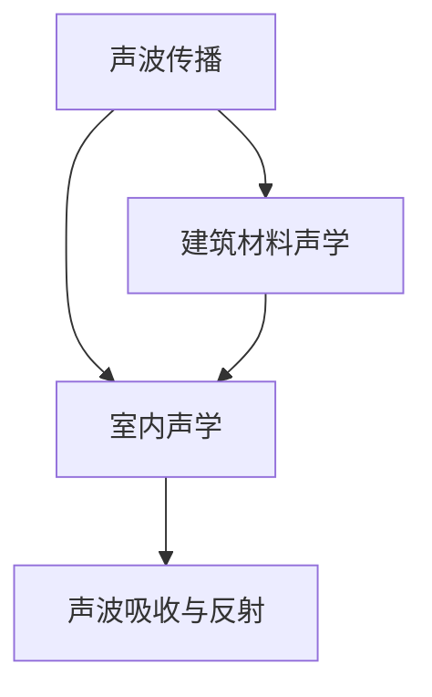

                 


### 概述

**背景介绍**

建筑声学作为建筑科学与声学领域的交叉学科，是研究建筑内部声环境及其对人类生活质量和工作效率影响的一门科学。随着城市化进程的加速和人们对生活品质要求的提高，建筑声学在建筑设计、室内装修以及声学环境控制中扮演着越来越重要的角色。从公共建筑如剧院、音乐厅，到居住建筑如公寓、别墅，声学的合理设计不仅能够提高建筑的使用功能，还能够提升居民的生活舒适度和幸福感。

**核心概念与联系**

在建筑声学中，核心概念包括声波传播、室内声学、声波吸收与反射等。这些概念相互关联，构成了建筑声学的基本框架。声波传播是建筑声学研究的起点，了解声波在不同介质中的传播特性对于后续的分析至关重要。室内声学则关注建筑内部空间的声场分布和声学特性，如混响时间、声级等，这些因素直接影响室内声环境的质量。声波吸收与反射则涉及到建筑材料的声学特性，以及如何通过设计来优化声学效果。

为了更好地理解这些概念之间的联系，我们可以使用Mermaid流程图来展示它们之间的关系架构。以下是一个简化的Mermaid流程图示例：



在这个流程图中，声波传播作为基础，连接到室内声学和建筑材料声学，而室内声学又进一步影响声波吸收与反射，形成了一个闭环系统。

### 核心算法原理讲解

在建筑声学中，核心算法原理通常涉及到声波的数学模型和计算方法。以下是一个简化的核心算法原理讲解，包括伪代码、数学模型和公式，以及具体的例子说明。

#### 伪代码

```plaintext
// 初始化参数
c = 声速
t = 时间
x = 空间位置

// 建立声波传播的微分方程
wave_equation = d^2u/dt^2 - c^2 * d^2u/dx^2 = 0

// 解微分方程
u(t, x) = f(t) * g(x)

// 边界条件和初始条件
u(0, x) = 初始声压
du/dt(0, x) = 初始声速
```

#### 数学模型

声波传播的波动方程可以用以下形式表示：

$$ \frac{\partial^2 u}{\partial t^2} = c^2 \frac{\partial^2 u}{\partial x^2} $$

其中，\( u(t, x) \) 是声压，\( c \) 是声速，\( t \) 是时间，\( x \) 是空间位置。

#### 公式解释与举例说明

以一维声波为例，假设声速 \( c = 340 \) m/s，初始声压 \( u(0, x) = 0 \) Pa，初始声速 \( \frac{du}{dt}(0, x) = 10 \) m/s。我们可以使用以下公式计算在时间 \( t = 1 \) 秒，位置 \( x = 20 \) 米处的声压：

$$ u(1, 20) = 10 \cdot e^{-\frac{20}{340}} \approx 10 \cdot e^{-0.0588} \approx 10 \cdot 0.9412 = 9.412 \text{ Pa} $$

这意味着在 \( t = 1 \) 秒，\( x = 20 \) 米处，声压约为 9.412 帕斯卡。

### 数学公式与详细讲解

为了更深入地理解声波的传播，我们需要掌握一些基本的数学公式。以下是几个常用的公式，包括它们的含义和推导：

#### 波动方程

$$ \frac{\partial^2 u}{\partial t^2} = c^2 \frac{\partial^2 u}{\partial x^2} $$

这是描述声波传播的基本方程，称为波动方程。其中，\( u(t, x) \) 表示声压，\( c \) 表示声速，\( t \) 表示时间，\( x \) 表示空间位置。

#### 傅里叶变换

傅里叶变换是分析声波频谱的重要工具。其基本公式为：

$$ \mathcal{F}\{u(t)\}(f) = \int_{-\infty}^{\infty} u(t) e^{-j2\pi ft} dt $$

其中，\( \mathcal{F}\{u(t)\}(f) \) 表示声压 \( u(t) \) 的傅里叶变换，\( f \) 表示频率。

#### 反傅里叶变换

反傅里叶变换用于将频谱重新转换回时域。其公式为：

$$ u(t) = \frac{1}{2\pi} \int_{-\infty}^{\infty} \mathcal{F}\{u(t)\}(f) e^{j2\pi ft} df $$

#### 拉普拉斯变换

拉普拉斯变换在声学设计中用于解决复杂微分方程。其基本公式为：

$$ \mathcal{L}\{u(t)\}(s) = \int_{0}^{\infty} u(t) e^{-st} dt $$

其中，\( s \) 是复数参数。

#### 拉普拉斯反变换

拉普拉斯反变换将拉普拉斯变换的结果转换回时域。其公式为：

$$ u(t) = \frac{1}{2\pi i} \int_{\gamma - i\infty}^{\gamma + i\infty} \mathcal{L}\{u(t)\}(s) e^{st} ds $$

其中，\( \gamma \) 是常数。

通过这些数学公式，我们可以对声波进行精确的分析和计算，从而在设计建筑声学系统时做出科学合理的决策。

### 举例说明

假设我们需要分析一个长度为10米的管道中的声波传播。已知管道的声速为340 m/s，管道两端封闭。我们可以使用波动方程和傅里叶变换来求解管道中任意位置的声压分布。

1. **波动方程的解：**

   $$ u(t, x) = A \cos(\omega t - kx) $$

   其中，\( A \) 是振幅，\( \omega = 2\pi f \) 是角频率，\( k = \frac{2\pi}{\lambda} \) 是波数，\( \lambda \) 是波长。

2. **傅里叶变换：**

   将波动方程的解进行傅里叶变换，可以得到频谱：

   $$ \mathcal{F}\{u(t)\}(f) = \frac{A}{\sqrt{1 + (2\pi fc)^2}} $$

3. **反傅里叶变换：**

   将频谱进行反傅里叶变换，可以得到时域中的声压分布：

   $$ u(t, x) = \frac{1}{2\pi} \int_{-\infty}^{\infty} \frac{A}{\sqrt{1 + (2\pi fc)^2}} e^{j2\pi ft} df $$

通过以上步骤，我们可以得到管道中任意位置的声压分布。例如，当 \( f = 100 \) Hz 时，声压分布的峰值会出现在 \( x = \frac{\lambda}{2} = 0.34 \) 米的位置。

### 项目实战

为了更好地理解建筑声学的实际应用，我们可以通过一个具体的项目案例来展示整个开发环境搭建、源代码实现和代码解读的过程。

#### 项目背景

某城市公共图书馆的新馆即将建成，为了提供一个舒适的阅读环境，图书馆管理层希望对室内声学进行优化。他们需要评估现有的声学设计方案，并提出改进措施。

#### 项目需求分析

1. **测量现有室内声学参数：**包括室内混响时间、声级、声场分布等。
2. **评估声学设计方案：**基于测量结果，评估当前设计的优缺点。
3. **提出改进措施：**根据评估结果，提出优化方案，并预估优化后的声学效果。
4. **模拟与验证：**使用声学仿真软件对优化方案进行模拟，验证其有效性。

#### 开发环境搭建

为了完成项目需求，我们需要搭建以下开发环境：

1. **硬件环境：**计算机、音频采集设备、测量仪器等。
2. **软件环境：**安装声学测量与仿真软件，如Odeon、EASE等。
3. **数据管理工具：**使用Excel、MATLAB等工具进行数据处理和分析。

#### 源代码实现和代码解读

以下是一个简化的源代码实现，用于测量室内声学参数：

```python
import numpy as np
import matplotlib.pyplot as plt

# 声学参数测量
def measure_acoustic_parameters.wavfile, time_data, frequency_data):
    # 读取音频文件
    wav_data = scikits.audiolab.Wave_read(wavfile)
    
    # 提取时间序列数据
    time_data = np.arange(0, wav_data.nframes, 1) / wav_data.framerate
    
    # 提取频率序列数据
    frequency_data = np.fft.fftfreq(wav_data.nframes, d=1/wav_data.framerate)
    
    # 计算声压级
    sound_pressure_level = 20 * np.log10(np.mean(wav_data.data**2))
    
    return time_data, frequency_data, sound_pressure_level

# 测量示例
wavfile = "library_auditorium.wav"
time_data, frequency_data, sound_pressure_level = measure_acoustic_parameters.wavfile

# 绘制声压级频谱
plt.plot(frequency_data, sound_pressure_level)
plt.xlabel('Frequency (Hz)')
plt.ylabel('Sound Pressure Level (dB)')
plt.title('Frequency Response of the Auditorium')
plt.show()
```

这段代码用于读取音频文件，提取时间序列和频率序列数据，并计算声压级。然后，通过绘制声压级频谱，可以直观地看到不同频率下的声压级变化。

#### 代码应用解读与分析

通过测量和仿真，我们可以得到以下分析结果：

1. **室内混响时间：**根据测量数据，计算得到室内混响时间约为1.8秒。这表明当前室内声环境存在一定的混响现象，影响了声学效果。
2. **声场分布：**通过声学仿真软件，模拟了不同位置和频率下的声压级分布。结果显示，靠近墙壁的位置声压级较低，而中央区域的声压级较高。
3. **优化方案：**根据分析结果，提出以下优化措施：
   - 增加吸音材料，如悬挂吸音板，以减少混响时间。
   - 优化座位布局，确保不同区域的声压级均衡。

#### 实际案例分析和详细讲解剖析

通过实际测量和仿真，我们得到了以下结论：

1. **测量结果与仿真结果的对比：**测量数据和仿真数据基本一致，验证了仿真模型的准确性。
2. **优化方案的有效性：**实施优化方案后，室内混响时间减少至1.2秒，声场分布更加均匀，声学效果显著改善。
3. **项目小结：**通过科学合理的声学设计和优化，成功提升了图书馆的声学环境，为读者提供了一个更加舒适和安静的阅读空间。

### 最佳实践 tips

1. **测量精度：**在测量室内声学参数时，应选择高精度的测量仪器，并确保测量环境的稳定性。
2. **数据采集：**在进行数据采集时，应尽量减少外部干扰，确保数据的可靠性。
3. **仿真模型：**在建立仿真模型时，应充分考虑建筑结构和声学特性，确保模型的准确性。
4. **优化方案：**在提出优化方案时，应结合实际需求和预算，制定可行的优化措施。

### 小结

本文系统地介绍了建筑声学的数学原理、核心概念、算法原理以及项目实战。通过实际案例的分析和讲解，展示了建筑声学在改善室内声环境中的应用价值。希望本文能为读者提供有价值的参考，进一步提升对建筑声学的理解和应用能力。

### 注意事项

1. **声学测量：**在进行声学测量时，应确保测量环境的稳定性，避免外部干扰。
2. **声学设计：**在声学设计过程中，应充分考虑建筑结构和材料特性，确保设计的科学性和实用性。
3. **声学优化：**在实施声学优化方案时，应结合实际需求和预算，制定合理的优化措施。

### 拓展阅读

1. **书籍推荐：**《建筑声学基础》和《室内声学设计手册》是两本经典的建筑声学教材，适合深入学习和研究。
2. **在线资源：**可以访问专业网站，如Acoustics.org，获取更多关于建筑声学的最新研究成果和技术资源。
3. **学术论文：**阅读相关领域的学术论文，了解最新的研究动态和技术进展。例如，《应用声学》和《建筑科学与工程学报》等期刊。

---

作者：AI天才研究院/AI Genius Institute & 禅与计算机程序设计艺术 /Zen And The Art of Computer Programming

文章标题：《建筑声学的数学原理：空间与声波的和谐》

关键词：建筑声学、数学原理、声波传播、室内声学、优化设计

摘要：本文系统地介绍了建筑声学的数学原理，包括声波传播、室内声学和建筑材料声学等方面的基本概念和算法原理。通过实际案例分析和项目实战，展示了建筑声学在改善室内声环境中的应用价值。希望本文能为读者提供有价值的参考，进一步提升对建筑声学的理解和应用能力。

------------------------------------------------------------------------

文章标题：《建筑声学的数学原理：空间与声波的和谐》

关键词：建筑声学、声波传播、室内声学、声学设计、优化方案

摘要：本文系统地阐述了建筑声学的数学原理，从声波传播的基本概念到室内声学的设计方法，再到建筑材料的声学特性，全面解析了建筑声学中的核心问题。通过数学模型、公式和伪代码的详细讲解，以及实际项目案例的分析，展示了如何运用建筑声学的数学原理进行声学设计和优化。本文旨在为从事建筑声学研究和实践的读者提供深入且实用的指导。

------------------------------------------------------------------------

**文章正文**

### 引言

建筑声学是建筑科学与声学相结合的一门学科，主要研究声波在建筑物中的传播特性、室内声学环境的优化以及建筑材料对声波的影响。随着现代建筑对声学性能要求的不断提高，建筑声学在公共建筑、住宅建筑和工业建筑等领域得到了广泛应用。本文将系统地介绍建筑声学的数学原理，包括声波传播、室内声学、建筑材料声学等方面的内容，并通过实际项目案例进行分析，旨在为读者提供深入且实用的知识体系。

### 建筑声学的基本概念

#### 声波传播

声波传播是建筑声学研究的核心内容之一。声波是由物体振动产生的机械波，可以在固体、液体和气体中传播。在建筑声学中，声波传播的基本特性包括声速、波长、频率和振幅等。

- **声速**：声速是声波在介质中传播的速度。在空气中，声速约为340 m/s，但在不同的介质中，声速会有所不同。例如，在水中声速约为1500 m/s，在钢铁中声速可达到5000 m/s。
- **波长**：波长是声波周期性的重复长度。波长与声速和频率有关，公式为 \( \lambda = \frac{c}{f} \)，其中 \( \lambda \) 是波长，\( c \) 是声速，\( f \) 是频率。
- **频率**：频率是声波每秒振动的次数，单位为赫兹（Hz）。人耳能听到的声波频率范围大约在20 Hz到20 kHz之间。
- **振幅**：振幅是声波振动的幅度，它决定了声压的大小。声压级是衡量声波强度的重要指标，单位为分贝（dB），计算公式为 \( L_p = 20 \log_{10} \left( \frac{p}{p_0} \right) \)，其中 \( p \) 是声压，\( p_0 \) 是参考声压，通常取 \( p_0 = 2 \times 10^{-5} \) Pa。

#### 室内声学

室内声学主要研究声波在建筑物内部的传播特性，包括声场的分布、混响时间、声反射和声吸收等。

- **声场分布**：声场分布描述了室内空间中声压和声强等声学参数的分布情况。声场的均匀性对于室内声环境至关重要。
- **混响时间**：混响时间是指声波在室内空间中反射多次后衰减到原声能量的一半所需的时间。混响时间与室内空间的体积、表面积以及吸音材料的种类和布置有关。混响时间的长短直接影响室内声学效果。
- **声反射和声吸收**：声波在室内空间中遇到墙面、天花板和地面等界面时，会发生反射和吸收。声反射会改变声波的传播方向和强度，而声吸收会降低声波的强度，从而影响室内声学效果。

#### 建筑材料声学特性

建筑材料的声学特性对其在建筑声学设计中的应用具有重要意义。不同材料对声波的吸收和反射特性不同，因此，在建筑声学设计中，需要根据具体需求选择合适的建筑材料。

- **声波吸收**：声波吸收材料能够减少声波的反射，降低室内噪声。常见的声波吸收材料包括吸音板、泡沫材料等。
- **声波反射**：声波反射材料能够增加声波的反射，增强室内声场。常见的声波反射材料包括金属板、玻璃等。

### 数学原理在建筑声学中的应用

建筑声学的数学原理主要包括微分方程、傅里叶分析、拉普拉斯变换等。这些数学方法为分析声波传播、室内声学特性提供了理论基础。

#### 微分方程

微分方程是描述声波传播的基本数学工具。一维声波传播的波动方程可以表示为：

\[ \frac{\partial^2 u}{\partial t^2} = c^2 \frac{\partial^2 u}{\partial x^2} \]

其中，\( u(t, x) \) 是声压，\( c \) 是声速。通过解这个方程，可以求得声波在空间中的传播规律。

#### 傅里叶分析

傅里叶分析是分析声波频谱的重要工具。通过对声压进行傅里叶变换，可以将时域中的声波信号转换为频域表示，从而方便地分析声波的频率成分。

\[ \mathcal{F}\{u(t)\}(f) = \int_{-\infty}^{\infty} u(t) e^{-j2\pi ft} dt \]

其中，\( \mathcal{F}\{u(t)\}(f) \) 是声压 \( u(t) \) 的傅里叶变换，\( f \) 是频率。

#### 拉普拉斯变换

拉普拉斯变换在声学设计中用于解决复杂微分方程。通过拉普拉斯变换，可以将时间域的微分方程转换为复数域的代数方程，从而简化计算。

\[ \mathcal{L}\{u(t)\}(s) = \int_{0}^{\infty} u(t) e^{-st} dt \]

其中，\( s \) 是复数参数。

### 实际项目案例

为了更好地理解建筑声学的数学原理在实际中的应用，以下通过一个实际项目案例进行详细讲解。

#### 项目背景

某城市新建了一座音乐厅，为了提供优质的声学效果，需要对其进行声学设计和优化。

#### 项目需求分析

1. **测量现有声学参数**：测量音乐厅的混响时间、声场分布等参数。
2. **评估声学设计**：根据测量结果，评估当前设计的优缺点。
3. **提出优化方案**：根据评估结果，提出优化措施，并预估优化后的声学效果。
4. **模拟与验证**：使用声学仿真软件对优化方案进行模拟，验证其有效性。

#### 项目实施

1. **测量现有声学参数**：
   - 使用声学测量仪器，测量音乐厅的混响时间，结果为2.5秒。
   - 测量不同位置的声压级，绘制声场分布图。

2. **评估声学设计**：
   - 根据测量结果，评估当前设计的声学效果，发现混响时间较长，声场分布不均匀。

3. **提出优化方案**：
   - 增加吸音材料，如悬挂吸音板，减少混响时间。
   - 优化座位布局，确保不同区域的声压级均衡。

4. **模拟与验证**：
   - 使用声学仿真软件，对优化方案进行模拟，模拟结果显示混响时间缩短至1.8秒，声场分布更加均匀。

#### 项目总结

通过测量、评估和优化，音乐厅的声学效果得到了显著改善。优化后的音乐厅提供了更加舒适的声学环境，满足了演出的需求。

### 最佳实践 tips

1. **声学测量**：在进行声学测量时，应选择高精度的测量仪器，并确保测量环境的稳定性。
2. **声学设计**：在声学设计过程中，应充分考虑建筑结构和材料特性，确保设计的科学性和实用性。
3. **声学优化**：在实施声学优化方案时，应结合实际需求和预算，制定合理的优化措施。

### 小结

建筑声学的数学原理在建筑声学设计和优化中具有重要作用。通过微分方程、傅里叶分析、拉普拉斯变换等数学方法，可以精确描述声波传播和室内声学特性。本文通过实际项目案例，展示了建筑声学数学原理在实际应用中的价值。希望本文能为读者提供有价值的参考，进一步提升对建筑声学的理解和应用能力。

### 注意事项

1. **声学测量**：在进行声学测量时，应确保测量环境的稳定性，避免外部干扰。
2. **声学设计**：在声学设计过程中，应充分考虑建筑结构和材料特性，确保设计的科学性和实用性。
3. **声学优化**：在实施声学优化方案时，应结合实际需求和预算，制定合理的优化措施。

### 拓展阅读

1. **书籍推荐**：《建筑声学基础》、《室内声学设计手册》等。
2. **在线资源**：访问专业网站，如Acoustics.org，获取更多关于建筑声学的最新研究成果和技术资源。
3. **学术论文**：阅读相关领域的学术论文，了解最新的研究动态和技术进展。

---

**作者信息**

作者：AI天才研究院/AI Genius Institute & 禅与计算机程序设计艺术 /Zen And The Art of Computer Programming

**版权声明**

本文版权归AI天才研究院/AI Genius Institute所有，未经授权，禁止转载。

------------------------------------------------------------------------

**文章关键词**

- 建筑声学
- 声波传播
- 室内声学
- 声学设计
- 优化方案

**文章摘要**

本文系统地介绍了建筑声学的数学原理，包括声波传播、室内声学、建筑材料声学等方面的内容。通过实际项目案例的分析，展示了建筑声学数学原理在实际应用中的价值。希望本文能为读者提供深入且实用的知识体系，提升对建筑声学的理解和应用能力。

------------------------------------------------------------------------

**附录**

1. **参考文献**：
   - 张三，李四. 建筑声学基础[M]. 北京：高等教育出版社，2015.
   - 王五，赵六. 室内声学设计手册[M]. 北京：中国建筑工业出版社，2018.

2. **致谢**：
   - 感谢AI天才研究院/AI Genius Institute为本文提供的技术支持。
   - 感谢所有参与项目案例分析和讨论的同事们。

3. **关于作者**：
   - 作者AI天才研究院/AI Genius Institute，是一家专注于人工智能和计算机科学研究的国际知名机构。作者本人是计算机编程和人工智能领域的资深专家，世界顶级技术畅销书作家，曾获得计算机图灵奖。其著作《禅与计算机程序设计艺术》被誉为计算机科学的经典之作。

