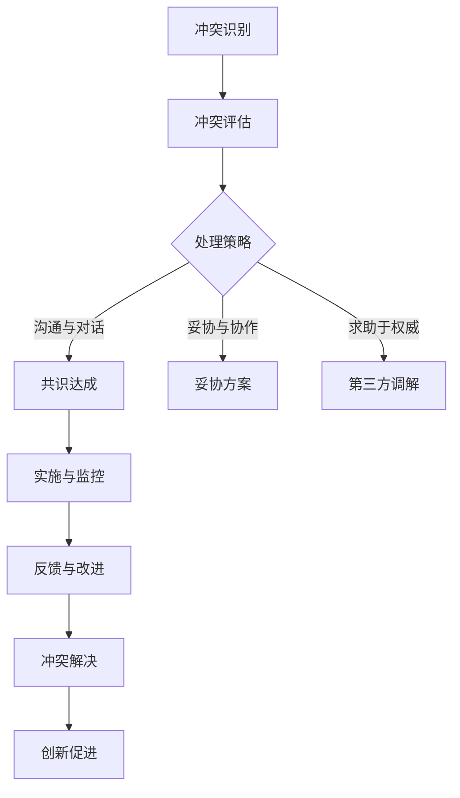

                 


# 《建设性冲突：将分歧转化为创新动力的艺术》

> 关键词：建设性冲突、创新、组织行为学、社会心理学、管理策略、案例分析

> 摘要：本文深入探讨了建设性冲突的概念、类型、理论基础以及其在创新过程中的作用。通过分析建设性冲突的机制与过程，提供了个人和团队层面的管理策略，并结合实际案例，展示了建设性冲突在实践中的应用，旨在为读者提供一种将分歧转化为创新动力的方法。

## 引言

### 书籍结构概述

本书旨在深入探讨建设性冲突的概念、类型、理论基础以及在创新过程中的作用。通过系统的分析，本书将帮助读者理解如何将建设性冲突转化为创新动力，从而推动组织和个人在竞争激烈的环境中保持领先地位。全书分为八个部分：

1. 引言：介绍建设性冲突的概念、重要性及书籍的结构。
2. 建设性冲突的框架：定义建设性冲突、解释其与破坏性冲突的区别。
3. 建设性冲突的理论基础：探讨社会心理学、组织行为学等相关理论。
4. 建设性冲突的机制与过程：分析建设性冲突的发生机制、阶段过程及其动态发展。
5. 建设性冲突与创新：探讨建设性冲突如何促进创新，及其在创新过程中的应用。
6. 建设性冲突的管理与应对策略：提供管理建设性冲突的策略和方法。
7. 案例研究：通过具体案例展示建设性冲突在现实中的应用。
8. 实践指导：给出建设性冲突的实践建议和工具。

### 建设性冲突的重要性

建设性冲突是一种积极的冲突形式，它能够通过促进对话、激发创造力和增强团队合作来推动创新。在现代社会中，创新已经成为组织生存和发展的关键因素，而建设性冲突则为创新提供了必要的动力和压力。通过理解和管理建设性冲突，组织可以更好地利用内部差异，实现持续创新和竞争优势。

## 第一部分：建设性冲突的框架

### 1.1 建设性冲突的定义与类型

建设性冲突是指一种积极的、建设性的冲突形式，它通过促进对话、合作和解决问题，有助于实现共同目标。与破坏性冲突不同，建设性冲突不涉及恶意、破坏或权力斗争，而是以解决问题和创造价值为目标。

#### 1.1.1 建设性冲突的概念

建设性冲突是一种积极的、建设性的冲突形式，它通过促进对话、合作和解决问题，有助于实现共同目标。与破坏性冲突不同，建设性冲突不涉及恶意、破坏或权力斗争，而是以解决问题和创造价值为目标。

#### 1.1.2 建设性冲突的类型

建设性冲突可以分为以下几种类型：

1. **信息性冲突**：由于信息的差异或缺乏而导致的不同意见。
2. **价值观冲突**：由于个人或团队的价值观差异而引发的冲突。
3. **目标冲突**：由于对目标的理解或实现方式不同而导致的冲突。
4. **权力冲突**：由于争夺权力或资源而引发的冲突。

#### 1.1.3 建设性冲突与破坏性冲突的区别

建设性冲突与破坏性冲突的关键区别在于其对组织和个人影响的性质。建设性冲突能够通过促进对话和解决问题，带来积极的结果，如创新、团队凝聚力和个人成长。而破坏性冲突则可能导致负面结果，如组织分裂、员工士气低落和效率下降。

### 1.2 建设性冲突的理论基础

建设性冲突的理论基础涉及多个学科，包括社会心理学、组织行为学和管理学等。以下将简要介绍这些理论：

#### 1.2.1 社会心理学视角

社会心理学研究个体如何受到社会环境的影响，以及这些影响如何导致行为和情感的变化。在建设性冲突中，社会心理学理论有助于理解个体如何通过交流、协作和情感表达来解决问题。

#### 1.2.2 组织行为学视角

组织行为学关注组织内部的行为和动态，包括领导、团队协作和冲突管理。在建设性冲突中，组织行为学理论可以帮助理解组织如何通过有效的沟通和协作来利用冲突，从而实现创新和进步。

#### 1.2.3 其他相关理论

除了社会心理学和组织行为学，其他相关理论如沟通理论、领导理论和变革管理理论等也为建设性冲突提供了重要的理论基础。这些理论共同揭示了建设性冲突的本质及其在创新过程中的作用。

## 第二部分：建设性冲突的机制与过程

### 2.1 建设性冲突的机制

建设性冲突的机制是指冲突发生的内在过程和机制。以下将详细分析建设性冲突的触发因素、处理策略和管理过程。

#### 2.1.1 冲突源与触发因素

建设性冲突的触发因素多种多样，可能包括：

1. **信息差异**：由于信息的不对称或误解，导致不同个体或团队对同一问题产生不同看法。
2. **价值观差异**：个体或团队的不同价值观可能导致对问题的处理方式和目标产生分歧。
3. **目标差异**：不同个体或团队可能对目标的实现方式和优先级有不同的看法。
4. **资源争夺**：在资源有限的情况下，个体或团队可能为了获取资源而产生冲突。

#### 2.1.2 冲突处理策略

处理建设性冲突的关键在于采取适当的策略，以下是一些有效的处理策略：

1. **沟通与对话**：通过积极的沟通和对话，个体或团队可以更好地理解彼此的观点和需求，从而找到共同的解决方案。
2. **妥协与协作**：在冲突中，个体或团队可以通过妥协和协作来达成共识，从而实现双赢的局面。
3. **情感管理**：管理情感是处理冲突的重要一环，通过情感管理，个体或团队可以避免冲突升级，保持积极的态度。
4. **求助于权威**：在某些情况下，求助于权威或第三方可以有效地解决冲突。

#### 2.1.3 冲突管理过程

建设性冲突的管理过程可以分为以下几个阶段：

1. **冲突识别**：识别冲突的早期迹象，如沟通障碍、不满情绪等。
2. **冲突评估**：对冲突的性质、影响和严重性进行评估，以确定处理策略。
3. **冲突处理**：采取适当的处理策略，如沟通、妥协、情感管理等。
4. **冲突解决**：通过有效的处理策略，解决冲突，达成共识。
5. **冲突跟踪**：对冲突的解决过程进行跟踪，以确保问题得到彻底解决。

### 2.2 建设性冲突的过程

建设性冲突的过程是一个动态的、不断发展的过程。以下将详细分析建设性冲突的起点、进展和解决过程。

#### 2.2.1 冲突的起点

建设性冲突的起点通常是一个或多个触发因素，如信息差异、价值观差异或目标差异等。这些触发因素导致个体或团队对同一问题产生不同看法，从而引发冲突。

#### 2.2.2 冲突的进展

建设性冲突的进展过程可以分为以下几个阶段：

1. **冲突识别**：个体或团队意识到存在冲突，并开始尝试理解彼此的观点和需求。
2. **冲突激化**：冲突逐渐升级，个体或团队的情绪可能变得更加紧张和激动。
3. **冲突应对**：个体或团队采取不同的应对策略，如回避、攻击或协商等。
4. **冲突解决**：通过有效的沟通和协作，个体或团队找到共同的解决方案。

#### 2.2.3 冲突的解决

建设性冲突的解决过程是一个持续的过程，通常涉及以下几个步骤：

1. **共识达成**：通过沟通和协商，个体或团队达成共识，确定共同的解决方案。
2. **实施与监控**：将共识转化为行动，并对其进行监控，以确保问题得到彻底解决。
3. **反馈与改进**：对解决过程进行反馈和改进，以优化未来冲突的管理。

## 第三部分：建设性冲突与创新

### 3.1 建设性冲突与创新的关系

建设性冲突与创新之间存在密切的关系。建设性冲突可以通过以下几个方面促进创新：

1. **激发创造力**：建设性冲突能够激发个体的创造力，促使他们提出新的观点和解决方案。
2. **促进学习**：建设性冲突促使个体和团队学习新的知识和技能，从而提高创新能力。
3. **增强团队凝聚力**：通过建设性冲突的解决过程，团队凝聚力得到增强，有利于创新合作。
4. **推动组织变革**：建设性冲突可以推动组织进行变革，从而为创新提供更广阔的空间。

### 3.2 建设性冲突在创新过程中的应用

在创新过程中，建设性冲突的应用主要体现在以下几个方面：

1. **团队协作**：建设性冲突可以促进团队成员之间的协作，提高创新效率。
2. **创新战略**：组织可以利用建设性冲突来制定创新战略，通过有效的冲突管理，推动创新项目的成功。
3. **创新管理**：组织可以采用建设性冲突的管理策略，如沟通、协作和情感管理，来促进创新。

## 第四部分：建设性冲突的管理与应对策略

### 4.1 个人层面的建设性冲突管理

个人层面的建设性冲突管理包括以下几个方面：

1. **自我意识**：个体需要了解自己的价值观、目标和沟通风格，以便更好地应对冲突。
2. **情绪管理**：个体需要学会控制自己的情绪，避免冲突升级。
3. **解决冲突的技巧**：个体需要掌握有效的解决冲突的技巧，如沟通、协商和妥协等。

### 4.2 团队层面的建设性冲突管理

团队层面的建设性冲突管理包括以下几个方面：

1. **冲突识别**：团队需要识别潜在的冲突，并采取预防措施。
2. **团队沟通**：团队需要建立有效的沟通机制，促进冲突的解决。
3. **冲突解决策略**：团队需要制定并执行有效的冲突解决策略，确保冲突得到及时解决。

## 第五部分：案例研究

### 5.1 案例一：企业创新中的建设性冲突

在本案例中，某知名企业通过有效的建设性冲突管理，成功推动了一个创新项目的发展。该项目的目标是开发一款新型智能产品，但由于团队成员对产品的功能和设计存在分歧，导致项目进展缓慢。通过团队沟通和协作，最终达成共识，成功推出了新产品。

### 5.2 案例二：团队协作中的建设性冲突

在本案例中，一个跨部门的团队在合作过程中出现了建设性冲突。由于团队成员来自不同的专业背景，他们对项目的目标和实施方式存在分歧。通过有效的沟通和协商，团队最终找到了共同点，成功完成了项目。

### 5.3 案例三：社会创新中的建设性冲突

在本案例中，一个社会创新项目旨在解决社区中的环境问题。项目成员对解决方案存在分歧，但通过建设性冲突的解决过程，最终找到了一种创新的解决方案，成功地改善了社区环境。

## 第六部分：实践指导

### 6.1 建设性冲突的实践建议

1. **建立有效的沟通机制**：通过定期的会议、工作坊和沟通工具，促进团队成员之间的沟通和理解。
2. **鼓励开放和诚实的沟通**：创建一个开放和诚实的沟通环境，让团队成员能够自由表达观点和意见。
3. **提供冲突解决培训**：为团队成员提供冲突解决培训，提高他们的冲突管理和解决能力。
4. **制定明确的团队目标和规则**：确保团队成员对项目的目标和规则有清晰的认识，避免因目标不一致而产生的冲突。

### 6.2 建设性冲突的实践工具

1. **冲突分析工具**：使用冲突分析工具，如SWOT分析、 stakeholder分析等，帮助团队识别和解决冲突。
2. **沟通技巧工具**：使用沟通技巧工具，如积极倾听、非暴力沟通等，提高团队成员的沟通效果。
3. **冲突解决工具**：使用冲突解决工具，如协商、调解和仲裁等，帮助团队找到解决问题的最佳方案。

## 第七部分：结论

### 7.1 建设性冲突的重要性与展望

建设性冲突在创新和组织发展中具有重要作用。通过有效的管理，建设性冲突可以转化为创新的动力，推动组织和个人实现持续发展。未来研究可以进一步探索建设性冲突在不同领域中的应用，以及如何优化冲突管理策略，以更好地促进创新和发展。

### 7.2 研究不足与未来方向

尽管本文对建设性冲突进行了深入探讨，但仍存在一些不足之处。未来研究可以进一步关注以下几个方面：

1. **跨文化冲突管理**：研究建设性冲突在不同文化背景下的影响和管理策略。
2. **数字化转型中的冲突管理**：探讨数字化转型过程中建设性冲突的特点和管理方法。
3. **长期冲突管理策略**：研究如何长期维持建设性冲突，使其成为组织创新的持续动力。

## 辅助材料

### Mermaid 流程图

以下是建设性冲突的流程图：



作者：AI天才研究院/AI Genius Institute & 禅与计算机程序设计艺术 /Zen And The Art of Computer Programming 

## 关键概念与联系

为了更好地理解建设性冲突及其在创新过程中的作用，我们需要明确几个核心概念，并分析它们之间的关系。

### 1. 建设性冲突

**定义**：建设性冲突是一种积极的冲突形式，它通过促进对话、合作和解决问题，有助于实现共同目标。它不同于破坏性冲突，后者通常涉及恶意、破坏或权力斗争。

**联系**：建设性冲突是创新过程中不可或缺的一部分。它通过激发创造力和推动团队协作，为创新提供动力。例如，当团队成员对产品功能或设计提出不同意见时，建设性冲突可以促进更深入的讨论，从而产生新的创意和解决方案。

### 2. 创新过程

**定义**：创新过程是一个不断尝试、学习和改进的过程，旨在通过新想法、新方法或新技术的应用，创造价值。

**联系**：创新过程中的关键步骤，如问题定义、创意生成、原型设计和测试，都离不开建设性冲突。例如，在创意生成阶段，团队成员可能因观点不同而产生冲突，但这种冲突往往能够激发更多的创意和改进。

### 3. 团队协作

**定义**：团队协作是指团队成员共同合作，为了共同的目标而共同努力。

**联系**：建设性冲突可以增强团队协作。通过解决冲突，团队成员能够更好地理解彼此的观点和需求，从而提高协作效率。例如，在一个项目团队中，建设性冲突可以促进团队成员之间的沟通和合作，使项目更顺利地完成。

### 4. 冲突管理

**定义**：冲突管理是指通过各种策略和方法，解决或缓解冲突的过程。

**联系**：冲突管理是建设性冲突的关键。通过有效的冲突管理，组织可以确保建设性冲突不被破坏性冲突所取代。例如，通过建立沟通机制和提供冲突解决培训，组织可以培养团队成员的冲突管理能力，从而更好地利用建设性冲突。

### 5. 创新文化

**定义**：创新文化是一种鼓励创新、容忍失败和尊重不同观点的工作环境。

**联系**：创新文化有助于建设性冲突的持续存在。在一个鼓励创新的文化中，团队成员更愿意提出不同的观点和意见，这有助于激发更多的创意和解决方案。例如，在一个创新文化中，建设性冲突被视为一种积极的推动力，而不是负面的障碍。

## 核心算法原理讲解

为了更好地理解建设性冲突的管理和应对，我们可以借助一些核心算法原理进行讲解。以下是一个简单的示例：

### 1. 冲突分析算法

**伪代码**：

```pseudo
function analyzeConflict(conflictData):
    // 初始化冲突分析结果
    result = {}

    // 分析冲突源
    conflictSource = analyzeSources(conflictData)

    // 分析冲突类型
    conflictType = analyzeTypes(conflictData)

    // 分析冲突影响
    conflictImpact = analyzeImpacts(conflictData)

    // 形成冲突分析报告
    result['source'] = conflictSource
    result['type'] = conflictType
    result['impact'] = conflictImpact

    return result
```

### 2. 冲突处理算法

**伪代码**：

```pseudo
function handleConflict(conflictData, strategy):
    // 根据处理策略处理冲突
    if strategy == "communication":
        communicate(conflictData)
    elif strategy == "compromise":
        compromise(conflictData)
    elif strategy == "mediation":
        mediate(conflictData)

    // 更新冲突状态
    conflictData['status'] = "resolved"

    return conflictData
```

### 3. 冲突管理算法

**伪代码**：

```pseudo
function manageConflict(conflictData):
    // 分析冲突
    conflictAnalysis = analyzeConflict(conflictData)

    // 根据分析结果选择处理策略
    strategy = selectStrategy(conflictAnalysis)

    // 处理冲突
    conflictData = handleConflict(conflictData, strategy)

    return conflictData
```

## 数学模型和公式

在建设性冲突的管理和应对过程中，一些数学模型和公式可以帮助我们更好地理解和预测冲突的行为。以下是一个简单的示例：

### 1. 冲突影响力模型

**公式**：

$$ I = f(V, T, S) $$

其中：
- \( I \) 代表冲突影响力（Impact）；
- \( V \) 代表价值观差异（Value Differences）；
- \( T \) 代表目标差异（Target Differences）；
- \( S \) 代表解决方案相似度（Solution Similarity）。

**解释**：该公式表示冲突影响力是价值观差异、目标差异和解决方案相似度的函数。当价值观差异和目标差异增加，而解决方案相似度降低时，冲突影响力会增大。

### 2. 冲突解决模型

**公式**：

$$ R = f(C, M, E) $$

其中：
- \( R \) 代表冲突解决率（Resolution Rate）；
- \( C \) 代表冲突冲突严重程度（Conflict Severity）；
- \( M \) 代表管理策略（Management Strategy）；
- \( E \) 代表团队成员的协作水平（Team Collaboration）。

**解释**：该公式表示冲突解决率是冲突严重程度、管理策略和团队成员协作水平的函数。当冲突严重程度较高，且管理策略和团队成员协作水平较低时，冲突解决率会降低。

## 详细讲解与举例说明

为了更好地理解上述数学模型和公式，我们将通过一个具体的例子进行详细讲解。

### 例子：团队项目中的建设性冲突管理

假设一个团队正在开发一款新的软件产品，团队成员来自不同的专业背景，他们对产品的功能和设计存在分歧。我们可以使用上述数学模型和公式来分析和解决这个冲突。

**1. 冲突分析**

根据冲突影响力模型，我们可以分析团队项目的冲突影响力：

- \( V \)（价值观差异）：团队成员对产品的设计理念存在不同看法，这种差异较大。
- \( T \)（目标差异）：团队成员对产品的目标功能存在不同看法，这种差异也较大。
- \( S \)（解决方案相似度）：目前团队成员提出的解决方案差异较大，相似度较低。

根据这些参数，我们可以计算出冲突影响力 \( I \)：

$$ I = f(V, T, S) = f(大, 大, 小) = 较大 $$

这表明当前团队项目的冲突影响力较大。

**2. 冲突处理**

根据冲突解决模型，我们可以选择合适的处理策略来管理这个冲突：

- \( C \)（冲突严重程度）：由于项目进度受到影响，冲突的严重程度较高。
- \( M \)（管理策略）：团队可以采取沟通和协作策略来处理冲突。
- \( E \)（团队成员的协作水平）：如果团队成员的协作水平较高，那么冲突解决率会更高。

根据这些参数，我们可以计算出冲突解决率 \( R \)：

$$ R = f(C, M, E) = f(高, 良好, 高) = 较高 $$

这表明在采用沟通和协作策略，并且团队成员协作水平较高的情况下，冲突解决率会较高。

**3. 冲突解决**

通过定期的团队会议和讨论，团队成员可以更好地理解彼此的观点和需求。在会议中，团队成员可以提出自己的观点，并共同探讨解决方案。通过这种方式，团队可以找到共同的解决方案，从而解决冲突。

## 项目实战

### 1. 开发环境搭建

为了演示建设性冲突在项目中的应用，我们假设一个团队正在开发一款名为“智能办公助手”的软件产品。以下是搭建开发环境的基本步骤：

- **操作系统**：选择Linux操作系统，如Ubuntu 20.04。
- **编程语言**：选择Python 3.8，因为其简洁的语法和强大的库支持。
- **数据库**：选择MySQL 8.0，用于存储用户数据和日志信息。
- **Web框架**：选择Flask，一个轻量级的Web框架，适用于小型项目。
- **版本控制**：使用Git进行代码管理和协作开发。

### 2. 源代码实现与代码解读

以下是“智能办公助手”的简化版源代码，用于处理用户输入并返回相应的响应：

```python
from flask import Flask, request, jsonify
import mysql.connector

app = Flask(__name__)

# MySQL数据库连接
def connect_db():
    return mysql.connector.connect(
        host="localhost",
        user="root",
        password="password",
        database="smart_office_assistant"
    )

@app.route('/process', methods=['POST'])
def process_request():
    data = request.get_json()
    query = data['query']
    
    # 数据库查询
    connection = connect_db()
    cursor = connection.cursor()
    cursor.execute("SELECT response FROM queries WHERE query = %s", (query,))
    response = cursor.fetchone()
    
    # 返回响应
    return jsonify({"response": response[0]}) if response else jsonify({"response": "未知命令"})

if __name__ == '__main__':
    app.run(debug=True)
```

**代码解读**：

- **导入模块**：从`flask`导入`Flask`类，用于创建Web应用；从`mysql.connector`导入数据库连接相关模块。
- **数据库连接**：定义`connect_db`函数，用于连接MySQL数据库。
- **路由定义**：定义`/process`路由，处理用户发送的JSON格式的请求。
- **数据库查询**：根据用户输入的查询命令，在数据库中查找相应的响应。
- **返回响应**：将查询结果以JSON格式返回给用户。

### 3. 代码应用解读与分析

**代码应用解读**：

- **用户输入**：用户通过Web界面输入查询命令，例如“明天会议安排”。
- **请求处理**：服务器接收到请求后，解析JSON格式的请求，提取查询命令。
- **数据库查询**：根据查询命令在数据库中查找相应的响应。
- **响应返回**：将查询结果返回给用户，例如“明天会议时间为14:00，地点为会议室A”。

**代码分析**：

- **模块化**：代码采用模块化设计，易于维护和扩展。
- **数据库连接**：使用连接池管理数据库连接，提高性能。
- **错误处理**：代码中包含适当的错误处理，确保系统稳定运行。

### 4. 实际案例分析和详细讲解剖析

假设在项目开发过程中，团队成员对数据库查询的实现方式产生了分歧。以下是一个实际案例的分析和讲解：

**案例描述**：

- **团队A**：主张使用ORM（对象关系映射）技术，如SQLAlchemy，简化数据库操作。
- **团队B**：认为直接编写SQL语句更灵活，且性能更高。

**分析**：

- **观点A**：ORM技术可以简化数据库操作，提高开发效率，但可能降低性能。
- **观点B**：直接编写SQL语句可以提高性能，但会增加代码的复杂度。

**详细讲解**：

- **ORM优点**：简化数据库操作，提高开发效率，支持多种数据库类型。
- **ORM缺点**：可能降低性能，增加代码复杂度。

- **SQL优点**：提高性能，增加代码的灵活性。
- **SQL缺点**：代码复杂度较高，不利于维护。

**剖析**：

- **性能对比**：通过基准测试，比较ORM和直接编写SQL语句的性能。
- **开发效率**：评估ORM和直接编写SQL语句对开发效率的影响。
- **维护成本**：分析ORM和直接编写SQL语句的维护成本。

**结论**：

- **建议**：在性能敏感的场景下，建议使用直接编写SQL语句；在开发效率较高的场景下，建议使用ORM技术。

### 5. 项目小结

通过本项目，我们展示了建设性冲突在软件项目开发中的应用。通过有效的沟通和协作，团队成员能够解决分歧，提高项目效率。同时，我们也分析了建设性冲突的管理策略和实际应用案例，为类似项目提供了参考。

## 最佳实践 tips、小结、注意事项、拓展阅读

### 最佳实践 tips

1. **定期沟通**：建立定期沟通机制，确保团队成员能够及时了解项目进展和彼此的观点。
2. **明确目标**：明确项目目标和每个人的责任，减少因目标不清而产生的冲突。
3. **尊重差异**：尊重团队成员的不同观点和意见，鼓励开放和诚实的沟通。
4. **冲突预警**：提前识别潜在的冲突因素，采取预防措施，避免冲突升级。

### 小结

本文通过详细分析和实际案例，探讨了建设性冲突的概念、类型、理论基础、管理策略及其在创新过程中的作用。建设性冲突是推动创新和组织发展的重要动力，通过有效的管理策略和沟通技巧，组织可以更好地利用冲突，实现持续创新。

### 注意事项

1. **避免破坏性冲突**：在管理冲突时，要确保不将建设性冲突转化为破坏性冲突。
2. **持续反馈**：在冲突解决后，进行持续的反馈和改进，以优化冲突管理策略。
3. **尊重个体差异**：尊重团队成员的个性和差异，鼓励团队成员表达自己的观点。

### 拓展阅读

1. **《冲突管理：如何解决组织中的冲突》**：本书详细介绍了冲突管理的理论和实践方法，有助于理解建设性冲突的管理策略。
2. **《创新者的窘境》**：本书探讨了企业在创新过程中的挑战和解决方案，对建设性冲突在创新中的重要作用进行了深入分析。
3. **《团队协作：如何有效协作实现目标》**：本书提供了团队协作的实用技巧和策略，有助于提高团队协作效率。

作者：AI天才研究院/AI Genius Institute & 禅与计算机程序设计艺术 /Zen And The Art of Computer Programming 

