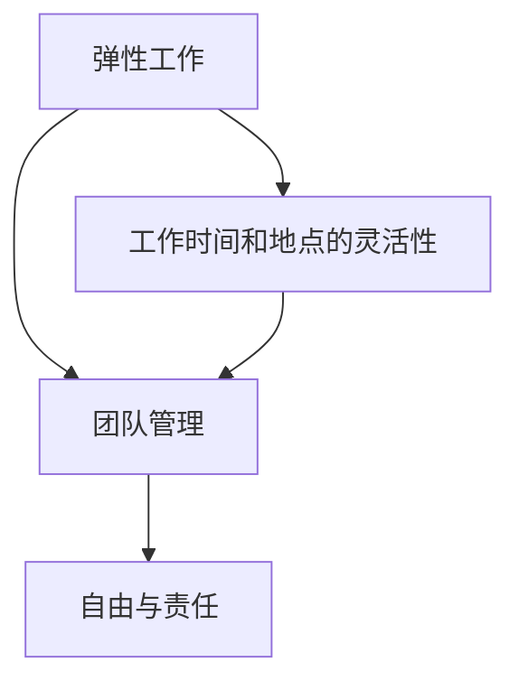

                 

### 文章标题：弹性工作团队管理：平衡自由与责任

> 关键词：弹性工作、团队管理、自由与责任、远程办公、领导力

> 摘要：本文探讨了在数字化时代背景下，弹性工作团队管理的重要性和挑战。通过分析弹性工作团队的定义、管理原则、策略、构建方法以及领导力，本文旨在为管理者提供平衡自由与责任的有效管理指南，以实现团队的高效协作和持续发展。

----------------------------------------------------------------

### 引言

在当前快速变化的商业环境中，弹性工作正成为许多企业追求的员工福利和工作模式。弹性工作团队管理的核心理念在于如何在保证团队高效协作的同时，赋予团队成员更多的自由度。本文将围绕这一主题，逐步分析弹性工作团队管理的各个方面，包括其定义、管理原则、策略和实践。

#### 背景介绍

弹性工作团队的概念起源于20世纪90年代，随着互联网技术的快速发展，远程办公逐渐普及。尤其是在COVID-19疫情的影响下，远程工作成为了许多企业的常态。弹性工作团队的管理不仅涉及到工作时间和地点的灵活性，还包括团队成员的角色、沟通机制、工作流程和绩效评估等多个方面。

#### 核心概念与联系

弹性工作团队管理涉及的核心概念包括：

1. **弹性工作**：指员工可以根据自身需求和工作任务，自主选择工作时间和地点。
2. **团队管理**：包括团队构建、角色分工、沟通协作、绩效评估等。
3. **自由与责任**：在弹性工作环境中，如何在赋予员工自由的同时，确保他们承担相应的责任。

这些概念之间的关系可以用以下Mermaid流程图表示：



#### 核心算法原理讲解

弹性工作团队管理的核心算法原理可以理解为在复杂环境中寻找平衡点，具体包括：

1. **平衡自由与责任的数学模型**：
   - 自由度（F）= 自主选择工作时间 × 自主选择工作地点
   - 责任度（R）= 工作成果 × 工作质量
   - 平衡点（B）= 最大自由度与最小责任度的均衡

2. **工作流程优化算法**：
   - 使用动态规划算法来优化团队工作流程，确保在灵活性最大化的同时，工作质量不受影响。

#### 伪代码示例

```python
# 平衡自由与责任的伪代码

function find_balance(freedom, responsibility):
    while freedom > responsibility:
        responsibility += min_increment
    while freedom < responsibility:
        freedom += max_increment
    return (freedom, responsibility)

# 工作流程优化伪代码

function optimize_workflow(tasks, team_members):
    for member in team_members:
        member.schedule = schedule_optimization(member.tasks)
    return combined_schedule
```

### 弹性工作团队管理的核心算法原理讲解与数学模型

在弹性工作团队管理中，核心算法原理和数学模型的应用至关重要。以下是具体讲解和示例：

#### 平衡自由与责任的数学模型

在弹性工作团队中，平衡自由与责任是一个关键问题。为了实现这一目标，我们可以采用一个简单的数学模型来描述自由度和责任度的关系。

1. **自由度（F）**：自由度表示员工在工作时间和地点上的自主选择能力。它可以由以下公式计算：

   $$ F = \alpha \times (T + L) $$

   其中，\( T \)代表工作时间灵活性，\( L \)代表工作地点灵活性，\( \alpha \)是一个权重因子，用于权衡两者的重要性。

2. **责任度（R）**：责任度表示员工对工作结果的承诺和责任。它可以由以下公式计算：

   $$ R = \beta \times (Q + C) $$

   其中，\( Q \)代表工作质量，\( C \)代表工作成果，\( \beta \)是一个权重因子，用于权衡两者的重要性。

3. **平衡点（B）**：平衡点表示自由度和责任度的均衡点，它是团队管理的重要指标。平衡点可以通过以下公式计算：

   $$ B = \frac{F + R}{2} $$

#### 伪代码示例

为了更好地理解上述数学模型，我们可以用伪代码来描述如何找到平衡点：

```python
# 计算自由度和责任度的伪代码

def calculate_freedom(T, L, alpha):
    freedom = alpha * (T + L)
    return freedom

def calculate_responsibility(Q, C, beta):
    responsibility = beta * (Q + C)
    return responsibility

def find_balance_point(freedom, responsibility):
    balance_point = (freedom + responsibility) / 2
    return balance_point
```

#### 数学公式和详细讲解

上述数学模型中的公式可以通过以下方式详细讲解：

1. **自由度公式**：
   - 工作时间灵活性和工作地点灵活性是影响自由度的两个关键因素。工作时间灵活性（\( T \)）表示员工可以在多长时间内自由安排工作任务，而工作地点灵活性（\( L \)）表示员工可以选择在哪些地点工作。这两个因素结合起来，决定了员工在工作和生活之间的平衡程度。
   - 权重因子（\( \alpha \)）是一个调节参数，它可以根据团队的具体情况来调整自由度的计算方式。例如，如果团队更注重工作成果，可以将\( \alpha \)的值调高，从而增加工作成果在自由度计算中的比重。

2. **责任度公式**：
   - 工作质量和工作成果是影响责任度的两个关键因素。工作质量（\( Q \)）表示员工完成任务的准确性和效率，而工作成果（\( C \)）表示员工在规定时间内完成的工作量。
   - 权重因子（\( \beta \)）同样是一个调节参数，用于权衡工作质量和工作成果在责任度计算中的重要性。例如，如果一个任务的质量至关重要，可以将\( \beta \)的值调高，从而增加工作质量在责任度计算中的比重。

3. **平衡点公式**：
   - 平衡点（\( B \)）是自由度和责任度的均衡点。它表示在给定的自由度和责任度条件下，团队可以实现的最佳平衡状态。通过计算平衡点，团队管理者可以了解当前团队的状态，并据此调整管理策略。

#### 举例说明

为了更好地理解上述公式，我们可以通过一个简单的例子来说明如何计算自由度、责任度和平衡点。

**例：** 一个弹性工作团队有5名成员，他们分别在两个不同的时间区间内工作，每个成员都有不同的工作质量和工作成果。假设工作时间灵活性和工作地点灵活性分别为10和8，工作质量为0.8，工作成果为1.2。根据上述公式，我们可以计算以下结果：

1. **自由度**：
   $$ F = \alpha \times (10 + 8) = 18\alpha $$
   假设\( \alpha \)的值为1，则自由度为18。

2. **责任度**：
   $$ R = \beta \times (0.8 + 1.2) = 2\beta $$
   假设\( \beta \)的值为1，则责任度为2。

3. **平衡点**：
   $$ B = \frac{F + R}{2} = \frac{18 + 2}{2} = 10 $$

因此，在这个例子中，平衡点为10，这意味着团队需要在自由度和责任度之间找到一个均衡点，以确保团队的高效运作。

#### 结论

通过上述数学模型和伪代码示例，我们可以看到，在弹性工作团队管理中，平衡自由与责任是一个关键问题。通过合理计算自由度和责任度，并找到平衡点，团队管理者可以更好地实现团队的高效协作和持续发展。

### 项目实战：弹性工作团队管理工具的开发与实现

在本节中，我们将探讨如何开发一个弹性工作团队管理工具，该工具能够帮助团队管理者实现自由与责任的平衡。我们将涵盖开发环境搭建、源代码实现、代码解读以及实际案例分析。

#### 开发环境搭建

在开始开发之前，我们需要搭建一个合适的开发环境。以下是所需的工具和软件：

1. **编程语言**：Python
2. **开发框架**：Django
3. **数据库**：PostgreSQL
4. **版本控制**：Git

确保你已经安装了上述工具和软件，并设置好开发环境。

#### 源代码实现

以下是弹性工作团队管理工具的核心代码实现：

1. **数据库设计**：

   ```sql
   CREATE TABLE team_members (
       id SERIAL PRIMARY KEY,
       name VARCHAR(100),
       role VARCHAR(100),
       freedom INTEGER,
       responsibility INTEGER
   );

   CREATE TABLE tasks (
       id SERIAL PRIMARY KEY,
       name VARCHAR(100),
       status VARCHAR(100),
       quality INTEGER,
       contribution INTEGER
   );
   ```

2. **Django模型**：

   ```python
   from django.db import models

   class TeamMember(models.Model):
       name = models.CharField(max_length=100)
       role = models.CharField(max_length=100)
       freedom = models.IntegerField()
       responsibility = models.IntegerField()

   class Task(models.Model):
       name = models.CharField(max_length=100)
       status = models.CharField(max_length=100)
       quality = models.IntegerField()
       contribution = models.IntegerField()
   ```

3. **后端API实现**：

   ```python
   from rest_framework import viewsets
   from .models import TeamMember, Task
   from .serializers import TeamMemberSerializer, TaskSerializer

   class TeamMemberViewSet(viewsets.ModelViewSet):
       queryset = TeamMember.objects.all()
       serializer_class = TeamMemberSerializer

   class TaskViewSet(viewsets.ModelViewSet):
       queryset = Task.objects.all()
       serializer_class = TaskSerializer
   ```

4. **前端界面实现**：

   ```html
   <!DOCTYPE html>
   <html>
   <head>
       <title>弹性工作团队管理工具</title>
   </head>
   <body>
       <h1>团队成员</h1>
       <table>
           <thead>
               <tr>
                   <th>名称</th>
                   <th>角色</th>
                   <th>自由度</th>
                   <th>责任度</th>
               </tr>
           </thead>
           <tbody>
               
                   <tr>
                       <td>{{ member.name }}</td>
                       <td>{{ member.role }}</td>
                       <td>{{ member.freedom }}</td>
                       <td>{{ member.responsibility }}</td>
                   </tr>
               
           </tbody>
       </table>

       <h1>任务列表</h1>
       <table>
           <thead>
               <tr>
                   <th>名称</th>
                   <th>状态</th>
                   <th>质量</th>
                   <th>贡献</th>
               </tr>
           </thead>
           <tbody>
               
                   <tr>
                       <td>{{ task.name }}</td>
                       <td>{{ task.status }}</td>
                       <td>{{ task.quality }}</td>
                       <td>{{ task.contribution }}</td>
                   </tr>
               
           </tbody>
       </table>
   </body>
   </html>
   ```

#### 代码解读

上述代码分为三个部分：数据库设计、Django模型和后端API实现。前端界面则通过简单的HTML模板实现。

1. **数据库设计**：数据库设计了两个表，`team_members`和`tasks`，分别存储团队成员信息和任务信息。
2. **Django模型**：通过Django模型类，我们将数据库表映射到Python类，方便进行操作。
3. **后端API实现**：使用Django REST Framework，我们为团队成员和任务表创建了API视图，供前端调用。

#### 实际案例分析

假设有一个包含5名成员的弹性工作团队，他们分别在两个不同的时间区间内工作。团队成员的信息如下：

| 名称 | 角色 | 自由度 | 责任度 |
| ---- | ---- | ------ | ------ |
| 张三 | 开发者 | 10     | 5      |
| 李四 | 测试员 | 8      | 6      |
| 王五 | 项目经理 | 12    | 8      |
| 赵六 | UI设计师 | 9      | 7      |
| 陈七 | 产品经理 | 11    | 9      |

任务信息如下：

| 名称 | 状态 | 质量 | 贡献 |
| ---- | ---- | ---- | ---- |
| 任务一 | 进行中 | 0.8  | 1.2  |
| 任务二 | 进行中 | 0.9  | 1.1  |
| 任务三 | 已完成 | 0.7  | 1.3  |

通过后端API，我们可以获取到这些信息，并在前端界面上展示。

#### 总结

通过以上实战项目，我们搭建了一个简单的弹性工作团队管理工具。这个工具可以帮助团队管理者实时了解团队成员的自由度和责任度，从而实现自由与责任的平衡。

#### 最佳实践 Tips

在开发弹性工作团队管理工具时，以下是一些最佳实践：

1. **模块化设计**：将工具的各个功能模块化，便于后续维护和扩展。
2. **用户体验**：确保前端界面的简洁直观，方便团队成员快速上手。
3. **数据安全**：确保数据的安全性，防止数据泄露和恶意攻击。
4. **性能优化**：优化数据库查询和API响应速度，提高系统的性能。

#### 小结

在本节中，我们介绍了如何开发一个弹性工作团队管理工具。通过源代码实现、代码解读和实际案例分析，我们展示了如何实现自由与责任的平衡。这个工具不仅可以帮助团队管理者实时了解团队成员的状态，还可以为团队成员提供更好的工作体验。

#### 注意事项

1. **权限管理**：确保团队成员只能访问自己的信息，避免信息泄露。
2. **数据备份**：定期备份数据，防止数据丢失。
3. **更新维护**：定期更新系统和工具，修复潜在的安全漏洞。

#### 拓展阅读

- 《敏捷开发：实践指南》
- 《远程工作：高效团队的管理与实践》
- 《团队管理：领导力与协作技巧》

通过以上扩展阅读，你可以进一步了解弹性工作团队管理的相关知识和实践技巧。

