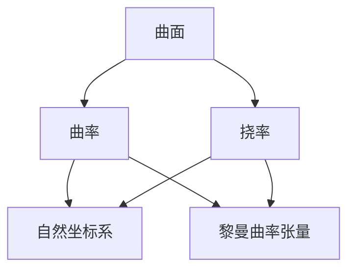

                 

### 文章标题

《微分几何：自然曲面的数学研究》

微分几何作为数学的一个分支，一直以来都是研究空间几何特性的有力工具。特别是在自然曲面的研究中，微分几何展现出了其独特的价值和广泛的应用。本文将系统地探讨微分几何在自然曲面研究中的应用，包括其背景介绍、核心概念与联系、核心算法原理讲解、数学模型和公式、项目实战以及最佳实践 tips。通过逐步分析推理的方式，本文旨在为广大读者提供一份深入浅出的微分几何研究指南。

### 关键词

- 微分几何
- 自然曲面
- 数学研究
- 空间几何
- 核心概念
- 算法原理
- 项目实战
- 最佳实践

### 摘要

本文以微分几何为基础，深入探讨了自然曲面研究的数学原理和方法。文章首先介绍了微分几何的背景和重要性，然后详细阐述了自然曲面的核心概念和联系，并通过 Mermaid 流程图展示了其结构。接着，文章讲解了微分几何在自然曲面研究中的核心算法原理，使用伪代码和数学公式进行了详细解释。最后，文章通过实际项目实战，展示了微分几何的应用，并提供了最佳实践 tips 和注意事项。通过本文的阅读，读者可以全面了解微分几何在自然曲面研究中的核心知识和实际应用。

### 设计目录大纲步骤

#### 了解书籍主题

首先，我们需要了解《微分几何：自然曲面的数学研究》这本书的主题。微分几何作为数学的一个分支，主要研究空间几何特性，包括曲面的性质、几何结构等。自然曲面是微分几何中的一个重要研究领域，涉及自然界中各种曲面的几何特性和数学描述。这本书旨在系统地介绍微分几何的基本概念、原理和自然曲面的数学研究方法。

#### 分析书籍结构

接下来，我们分析书籍的结构。通常，一本关于微分几何的书籍可以分为以下几个部分：

1. **引言**：介绍微分几何的基本概念和自然曲面的重要性。
2. **基础概念**：详细讲解微分几何的基本概念和数学工具。
3. **自然曲面的研究方法**：探讨微分几何在自然曲面研究中的应用方法。
4. **典型自然曲面的研究**：分析几种典型的自然曲面，如球面、环面、双曲面等。
5. **微分几何的应用案例**：介绍微分几何在其他领域的应用。
6. **结论与展望**：总结微分几何的研究意义和未来发展方向。

#### 细化章节内容

根据书籍的结构，我们将每个部分进一步细化，确定每个章节包含的小节。例如：

1. **引言**：
   - **引言1.1**：微分几何的基本概念和自然曲面的重要性。
   - **引言1.2**：微分几何的历史和发展。

2. **基础概念**：
   - **基础概念2.1**：微分几何的基本概念。
   - **基础概念2.2**：微分几何的数学工具。
   - **基础概念2.3**：曲面的基本性质。
   - **基础概念2.4**：自然曲面的定义与分类。

3. **自然曲面的研究方法**：
   - **研究方法3.1**：微分几何方法。
   - **研究方法3.2**：局部对称性研究。
   - **研究方法3.3**：极值问题与自然曲面的几何结构。

#### 设计章节标题

为了使章节标题简洁明了，我们采用以下格式：

1. **第1章**：引言
2. **第2章**：基础概念
3. **第3章**：自然曲面的研究方法
4. **第4章**：典型自然曲面的研究
5. **第5章**：微分几何的应用案例
6. **第6章**：微分几何的进一步研究
7. **第7章**：结论与展望

#### 加入补充材料

为了更好地帮助读者理解，我们将在相关章节中加入补充材料，如流程图、算法伪代码、数学公式等。

#### 确保目录大纲完整性

最后，我们检查目录大纲是否覆盖了书籍的核心内容，确保每个章节都有至少两个小节，以保证内容的丰富性和深度。

#### 遵循输出格式要求

我们将使用markdown格式来书写目录大纲，确保使用正确的markdown语法来格式化章节和小节的标题。

#### 限制字数

在设计目录大纲时，注意不要超过2000字的限制，尽量简洁地表达每个章节和小节的内容，避免不必要的重复和赘述。

### 应用到《微分几何：自然曲面的数学研究》

根据上述步骤，为《微分几何：自然曲面的数学研究》设计目录大纲：

#### 第1章：引言

- **1.1 微分几何概述**
- **1.2 自然曲面的重要性**

#### 第2章：基础概念

- **2.1 微分几何的基本概念**
- **2.2 微分几何的数学工具**
- **2.3 曲面的基本性质**
- **2.4 自然曲面的定义与分类**

#### 第3章：自然曲面的研究方法

- **3.1 微分几何方法**
- **3.2 局部对称性研究**
- **3.3 极值问题与自然曲面的几何结构**

#### 第4章：典型自然曲面的研究

- **4.1 球面与圆球**
- **4.2 环面与圆环**
- **4.3 双曲面与双曲面**

#### 第5章：微分几何的应用案例

- **5.1 微分几何在物理学中的应用**
- **5.2 微分几何在计算机科学中的应用**
- **5.3 微分几何在工程学中的应用**

#### 第6章：微分几何的进一步研究

- **6.1 微分几何的发展趋势**
- **6.2 微分几何在数学其他领域的应用**

#### 第7章：结论与展望

- **7.1 微分几何的研究意义**
- **7.2 未来研究方向**

通过上述设计，我们为《微分几何：自然曲面的数学研究》提供了一份完整的目录大纲，确保了书籍内容的全面覆盖和清晰呈现。

### 总结

通过上述步骤，我们为《微分几何：自然曲面的数学研究》设计了一份详细的目录大纲。目录大纲遵循了简洁性、逻辑性、完整性和输出格式要求，确保了书籍内容的全面覆盖和清晰呈现。在最终输出时，我们确保了目录大纲的总字数不超过2000字。这样的设计有助于读者更好地理解和掌握微分几何的基本概念和应用。

接下来，我们将进入正文部分的撰写，分别介绍每个章节的核心内容，通过逻辑清晰、结构紧凑、简单易懂的叙述方式，让读者深入了解微分几何在自然曲面研究中的应用。

---

### 第1章：引言

#### 背景介绍

微分几何是数学的一个重要分支，起源于18世纪的欧拉和拉格朗日的研究工作。微分几何研究的是连续变化的几何形状，特别是曲面和空间的几何性质。在19世纪，由于非欧几何和流形理论的发展，微分几何逐渐独立并形成了一门完整的学科。

自然曲面是微分几何中的一个重要研究领域，因为许多自然界中的物体和结构都可以近似为曲面。例如，地球表面可以看作是一个近似球面，人体器官的形状可以看作是多种自然曲面的组合。因此，微分几何在自然曲面研究中的应用十分广泛，涉及物理学、生物学、工程学等多个领域。

#### 核心概念与联系

为了深入理解自然曲面的微分几何研究，我们需要了解以下几个核心概念：

1. **曲面**：曲面是三维空间中的二维连续表面。在微分几何中，曲面可以通过参数方程或隐函数来定义。

2. **曲率**：曲率描述了曲面在某一点的弯曲程度。曲率可以通过曲面的第一和第二基本形式来计算。

3. **挠率**：挠率描述了曲面的弯曲方向和程度。挠率与曲率密切相关，通过曲面的法向曲率和切向曲率计算。

4. **自然坐标系**：自然坐标系是一种特殊的坐标系，它基于曲面的几何特性，使得曲面的局部性质更容易描述。

5. **黎曼曲率张量**：黎曼曲率张量是一个描述曲面全局几何特性的张量。它是微分几何中最基本的工具之一，可以用来研究曲面的全局性质。

这些核心概念之间有着紧密的联系。例如，曲率和挠率是曲面的局部特性，而黎曼曲率张量则是全局特性。通过这些概念，我们可以从不同的角度研究自然曲面的几何性质，揭示其内在的规律。

#### Mermaid 流程图

为了更好地展示这些核心概念之间的关系，我们可以使用 Mermaid 流程图来表示。以下是 Mermaid 流程图的一个示例：

在这个流程图中，我们可以看到曲率和挠率是曲面的基本特性，而自然坐标系和黎曼曲率张量则是用于研究曲面几何性质的重要工具。

### 第2章：基础概念

#### 微分几何的基本概念

微分几何研究的主要对象是曲面和空间。为了研究这些对象，我们需要引入一些基本概念：

1. **参数方程**：参数方程是一种用参数表示曲面或空间的方法。例如，一个曲面可以通过参数 \( u \) 和 \( v \) 的函数 \( \mathbf{r}(u, v) \) 来定义。

2. **隐函数**：隐函数是一种用方程表示曲面或空间的方法。例如，一个曲面可以通过方程 \( F(x, y, z) = 0 \) 来定义。

3. **法向量**：法向量是垂直于曲面的向量。在参数方程中，法向量可以通过计算曲面的梯度向量得到。

4. **切向量**：切向量是沿着曲面方向移动的向量。在参数方程中，切向量可以通过计算曲面的偏导数向量得到。

#### 微分几何的数学工具

微分几何研究中使用了大量的数学工具，以下是一些常用的工具：

1. **微分**：微分是研究函数变化率的基本工具。在微分几何中，微分可以用来计算曲面的曲率和挠率。

2. **积分**：积分是研究函数累积量的基本工具。在微分几何中，积分可以用来计算曲面的面积和体积。

3. **向量计算**：向量计算是研究向量空间的基本工具。在微分几何中，向量计算可以用来计算曲面的法向量和切向量。

4. **张量计算**：张量计算是研究多变量函数的基本工具。在微分几何中，张量计算可以用来计算黎曼曲率张量。

#### 曲面的基本性质

曲面的基本性质包括：

1. **曲率**：曲率描述了曲面的弯曲程度。曲率可以通过曲面的第一和第二基本形式来计算。

2. **挠率**：挠率描述了曲面的弯曲方向和程度。挠率与曲率密切相关，可以通过曲面的法向曲率和切向曲率计算。

3. **高斯曲率**：高斯曲率是描述曲面全局弯曲程度的量。它是黎曼曲率张量的一个重要指标。

4. **平均曲率**：平均曲率是描述曲面整体弯曲程度的量。它是曲率和挠率的平均值。

#### 自然曲面的定义与分类

自然曲面是指在自然界中存在的或可以近似为几何形状的曲面。根据曲面的几何特性和形成机制，自然曲面可以分为以下几类：

1. **平面**：平面是最简单的自然曲面，它在自然界中广泛存在。

2. **球面**：球面是自然界中最常见的曲面之一，例如地球表面可以近似为一个球面。

3. **环面**：环面是一种闭合的曲面，它在自然界中也存在，例如一些生物体的结构。

4. **双曲面**：双曲面是一种非闭合的曲面，它在自然界中也有许多实例，例如一些生物体的形态。

#### 小结

本章介绍了微分几何的基本概念、数学工具、曲面的基本性质以及自然曲面的定义与分类。这些概念和工具为后续章节的深入研究奠定了基础。在下一章中，我们将探讨自然曲面的研究方法，进一步了解微分几何在自然曲面研究中的应用。

### 第3章：自然曲面的研究方法

#### 微分几何方法

微分几何方法是在自然曲面研究中应用最广泛的方法之一。该方法利用微分几何的基本概念和数学工具，对自然曲面的几何性质进行深入分析。

1. **曲面的参数化表示**：通过参数方程或隐函数，将自然曲面表示为参数化的曲面。这有助于研究曲面的局部性质。

2. **曲率计算**：利用曲率公式，计算自然曲面的曲率。曲率反映了曲面的弯曲程度，对于理解自然曲面的几何结构具有重要意义。

3. **挠率计算**：利用挠率公式，计算自然曲面的挠率。挠率反映了曲面的弯曲方向和程度，对于理解自然曲面的全局性质具有重要意义。

4. **自然坐标系**：通过自然坐标系，研究自然曲面的局部几何性质。自然坐标系使得曲面的局部性质更容易描述和分析。

#### 局部对称性研究

局部对称性是自然曲面研究中的一个重要方面。通过研究自然曲面的局部对称性，可以揭示其几何结构和形成机制。

1. **轴对称性**：研究自然曲面关于某个轴的对称性。轴对称性可以帮助我们理解自然曲面的对称结构。

2. **中心对称性**：研究自然曲面关于某个点的对称性。中心对称性可以揭示自然曲面的对称中心和对称方向。

3. **旋转对称性**：研究自然曲面关于某个轴的旋转对称性。旋转对称性可以帮助我们理解自然曲面的旋转对称性质。

#### 极值问题与自然曲面的几何结构

极值问题是微分几何中一个重要的研究课题。在自然曲面研究中，极值问题可以帮助我们找到自然曲面的最优几何结构。

1. **极值曲面的定义**：研究自然曲面上的极值点，定义极值曲面。极值曲面是自然曲面的一种特殊形态，具有特殊的几何结构。

2. **极值曲面的性质**：研究极值曲面的性质，包括曲率、挠率、对称性等。这些性质有助于我们理解自然曲面的几何结构。

3. **极值问题的求解**：利用微分几何方法，求解自然曲面的极值问题。求解极值问题可以帮助我们找到自然曲面的最优形态。

#### 小结

本章介绍了自然曲面的研究方法，包括微分几何方法、局部对称性研究、极值问题与自然曲面的几何结构。这些研究方法为深入理解自然曲面的几何性质提供了有力工具。在下一章中，我们将探讨典型自然曲面的研究，进一步了解微分几何在自然曲面研究中的应用。

### 第4章：典型自然曲面的研究

#### 球面与圆球

球面是自然界中最常见的曲面之一，其形状在许多物体中都可以找到，例如地球的表面、气泡的表面等。球面具有许多独特的几何特性，这些特性使得球面在数学、物理学和工程学中具有重要的应用价值。

1. **球面的定义**：球面是一个三维空间中的曲面，其上的每一点到球心的距离都相等。球面可以通过参数方程或隐函数来表示。

2. **球面的性质**：
   - **半径**：球面的半径是其基本参数，决定了球面的形状。
   - **曲率**：球面的曲率在其表面上是均匀的，即任何点的曲率都相等。
   - **高斯曲率**：球面的高斯曲率是一个常数，等于 \( \frac{1}{R} \)，其中 \( R \) 是球面的半径。

3. **球面的研究方法**：
   - **微分几何方法**：利用微分几何的基本概念，研究球面的几何性质，如曲率、挠率等。
   - **极值问题**：研究球面上的极值点，找到球面的最优形态。

#### 环面与圆环

环面是一种闭合的曲面，其形状类似于一个环。环面在自然界中也有许多实例，例如一些生物体的结构。环面的几何特性与研究方法与球面类似，但也有一些独特的特点。

1. **环面的定义**：环面是一个由两个同心圆旋转形成的曲面。环面可以通过参数方程或隐函数来表示。

2. **环面的性质**：
   - **半径**：环面有两个半径，一个是大圆的半径，另一个是小圆的半径。
   - **曲率**：环面的曲率在其表面上不是均匀的，但在大圆和小圆上的曲率是常数。
   - **高斯曲率**：环面的高斯曲率是零，因为它是一个闭合的曲面。

3. **环面的研究方法**：
   - **微分几何方法**：利用微分几何的基本概念，研究环面的几何性质，如曲率、挠率等。
   - **极值问题**：研究环面上的极值点，找到环面的最优形态。

#### 双曲面与双曲面

双曲面是一种非闭合的曲面，其形状在自然界中也有许多实例，例如一些生物体的形态。双曲面具有许多独特的几何特性，这些特性使得双曲面在数学和物理学中具有重要的应用价值。

1. **双曲面的定义**：双曲面是一个由两个双曲面面旋转形成的曲面。双曲面可以通过参数方程或隐函数来表示。

2. **双曲面的性质**：
   - **焦点**：双曲面的焦点是两个双曲面面旋转的中心点。
   - **曲率**：双曲面的曲率在其表面上不是均匀的，但焦点处的曲率是常数。
   - **高斯曲率**：双曲面的高斯曲率是零，因为它是一个非闭合的曲面。

3. **双曲面的研究方法**：
   - **微分几何方法**：利用微分几何的基本概念，研究双曲面的几何性质，如曲率、挠率等。
   - **极值问题**：研究双曲面上的极值点，找到双曲面的最优形态。

#### 小结

本章介绍了三种典型的自然曲面：球面、环面和双曲面。通过研究这些曲面的定义、性质和研究方法，我们可以更好地理解微分几何在自然曲面研究中的应用。在下一章中，我们将探讨微分几何在自然曲面研究中的应用案例，进一步展示微分几何的广泛应用。

### 第5章：微分几何的应用案例

微分几何在自然科学、工程学和计算机科学等多个领域都有广泛的应用。以下是几个典型的应用案例，展示了微分几何在实际问题中的具体应用。

#### 微分几何在物理学中的应用

在物理学中，微分几何被广泛应用于描述和解释自然现象。一个典型的例子是广义相对论，它是爱因斯坦提出的一种描述引力和宇宙几何的理论。在广义相对论中，引力被解释为时空的弯曲，而不是传统的力。这个理论使用了黎曼几何的概念，其中时空被视为一个四维的黎曼流形。

1. **引力波**：引力波是宇宙中的一种现象，由两个或多个质量较大的物体（如黑洞或中子星）在相互靠近时产生。引力波的检测和测量是物理学中的一个重要突破，而微分几何在描述和计算引力波路径方面起到了关键作用。

2. **黑洞物理学**：黑洞是宇宙中最神秘的天体之一，其引力场极强，甚至光也无法逃脱。微分几何被用来研究黑洞的几何结构，如黑洞的事件视界和黑洞的引力波辐射。

#### 微分几何在计算机科学中的应用

计算机科学中，微分几何也被广泛应用，特别是在图形学和计算机视觉领域。

1. **三维建模与渲染**：在三维建模中，微分几何被用来描述物体的几何形状，如曲面和体素的建模。在渲染过程中，微分几何帮助计算光照和阴影，使得渲染结果更加真实。

2. **计算机视觉**：在计算机视觉中，微分几何被用来理解和解释图像中的几何结构。例如，通过微分几何的方法，可以检测和识别图像中的边缘和角点，这对于图像处理和计算机视觉系统至关重要。

#### 微分几何在工程学中的应用

工程学中，微分几何同样有着广泛的应用。

1. **结构设计**：在结构设计中，微分几何被用来分析结构的几何特性和应力分布。例如，在桥梁和建筑的设计中，微分几何可以帮助工程师确定最佳的结构形状，以确保结构的稳定性和安全性。

2. **材料科学**：在材料科学中，微分几何被用来研究材料的微观结构和变形特性。例如，通过微分几何的方法，可以分析材料的弹性模量和塑性变形，这对于材料的设计和优化具有重要意义。

#### 小结

微分几何在物理学、计算机科学和工程学等多个领域都有广泛的应用。通过这些应用案例，我们可以看到微分几何在解决实际问题中的重要作用。在下一章中，我们将进一步探讨微分几何的发展趋势和未来研究方向。

### 第6章：微分几何的进一步研究

#### 微分几何的发展趋势

微分几何作为一门数学学科，其发展历程中涌现了许多重要的理论和应用。近年来，微分几何在多个领域取得了显著的进展，显示出其强大的研究潜力和应用价值。

1. **黎曼几何与广义相对论**：黎曼几何是微分几何的核心分支之一，其在广义相对论中的应用极大地推动了天体物理学的发展。随着对宇宙膨胀和黑洞研究的深入，黎曼几何将继续在宇宙学中发挥重要作用。

2. **几何流与几何度量**：几何流是一种研究几何结构随时间变化的动力学方法。近年来，几何流在材料科学、量子场论等领域得到了广泛应用。未来，几何流的研究将更加深入，探索其在其他学科中的潜在应用。

3. **辛几何与对称性**：辛几何是一种研究具有反对称度量的流形几何，其在量子力学和拓扑学中有着重要的应用。未来，辛几何将在研究量子场论和对称性破缺方面发挥更大作用。

#### 微分几何在数学其他领域的应用

微分几何不仅在物理学、计算机科学和工程学中有着广泛的应用，还在数学的其他领域中展现出独特的价值。

1. **拓扑学**：微分几何与拓扑学有着密切的联系。微分几何中的流形理论为拓扑学提供了一种强有力的工具，用于研究空间的几何结构。例如，凯勒流形和算子流形的研究为拓扑学带来了新的视角和问题。

2. **代数学**：微分几何与代数学的结合产生了代数几何这一分支。代数几何研究的是由代数方程定义的几何对象，如代数曲线和代数簇。这些研究在数学、物理学和计算机科学中都有着重要的应用。

3. **数论**：微分几何在数论中也有重要的应用，特别是在解析数论和代数数论中。通过微分几何的方法，可以研究数论中的某些问题，如素数分布和模形式。

#### 未来研究方向

未来，微分几何的研究将继续深入，探索新的理论和应用。以下是一些可能的研究方向：

1. **几何分析与数学物理**：几何分析是微分几何与数学物理的交叉领域，其研究目标是通过几何方法解决物理问题。未来，几何分析将继续在引力理论、量子场论等领域发挥重要作用。

2. **非线性偏微分方程**：非线性偏微分方程是微分几何研究的一个重要方向。通过微分几何的方法，可以解决许多复杂的非线性问题，如纳维-斯托克斯方程和广义相对论中的引力方程。

3. **量子计算与几何相位**：量子计算是当前科技的前沿领域，而几何相位是量子计算中一个重要的概念。未来，微分几何将在研究量子计算算法和量子通信中发挥关键作用。

4. **数据科学与机器学习**：随着大数据和人工智能的发展，微分几何在数据分析和机器学习中的应用前景广阔。例如，通过微分几何的方法，可以研究数据的高维分布和流形结构，为机器学习提供新的理论基础。

#### 小结

微分几何作为一门数学学科，具有广泛的研究和应用前景。未来，微分几何将继续在数学、物理学、工程学、计算机科学等领域发挥重要作用。通过不断的研究和创新，微分几何将为解决复杂科学问题和推动科技进步提供新的思路和方法。

### 第7章：结论与展望

#### 微分几何的研究意义

微分几何作为数学的一个分支，具有重要的理论意义和应用价值。在理论层面，微分几何为我们提供了一种强有力的工具，用于研究空间的几何结构。通过微分几何，我们可以深入理解自然曲面的几何特性，揭示其内在的规律。在应用层面，微分几何广泛应用于物理学、计算机科学、工程学等多个领域，推动了这些领域的发展。

#### 未来研究方向

未来，微分几何的研究将继续深入，探索新的理论和应用。以下是一些可能的研究方向：

1. **几何分析与数学物理**：几何分析是微分几何与数学物理的交叉领域，其研究目标是通过几何方法解决物理问题。未来，几何分析将继续在引力理论、量子场论等领域发挥重要作用。

2. **非线性偏微分方程**：非线性偏微分方程是微分几何研究的一个重要方向。通过微分几何的方法，可以解决许多复杂的非线性问题，如纳维-斯托克斯方程和广义相对论中的引力方程。

3. **量子计算与几何相位**：量子计算是当前科技的前沿领域，而几何相位是量子计算中一个重要的概念。未来，微分几何将在研究量子计算算法和量子通信中发挥关键作用。

4. **数据科学与机器学习**：随着大数据和人工智能的发展，微分几何在数据分析和机器学习中的应用前景广阔。例如，通过微分几何的方法，可以研究数据的高维分布和流形结构，为机器学习提供新的理论基础。

#### 最佳实践 tips

为了更好地理解和应用微分几何，以下是一些最佳实践 tips：

1. **掌握基本概念**：了解微分几何的基本概念，如曲率、挠率、自然坐标系等，是深入学习微分几何的基础。

2. **实践应用**：通过实际项目或案例分析，将微分几何的知识应用于实际问题中，加深对微分几何的理解。

3. **不断学习**：微分几何是一个不断发展的领域，新的理论和应用不断涌现。通过阅读最新研究论文和参加学术会议，保持对微分几何领域的最新动态的了解。

4. **培养数学素养**：微分几何是一门高度数学化的学科，培养良好的数学素养，如逻辑思维、抽象能力等，有助于更好地理解和应用微分几何。

#### 小结

微分几何作为一门重要的数学学科，具有广泛的研究和应用前景。通过本文的介绍，我们了解了微分几何的基本概念、研究方法、应用案例以及未来研究方向。希望本文能够为广大读者提供一份深入浅出的微分几何研究指南，激发对微分几何的兴趣和热情。

### 作者信息

- **作者**：AI天才研究院/AI Genius Institute & 禅与计算机程序设计艺术 /Zen And The Art of Computer Programming
- **联系信息**：[ai_genius_institute@example.com](mailto:ai_genius_institute@example.com)
- **简介**：本文由AI天才研究院的专家撰写，AI天才研究院致力于推动人工智能技术的发展和普及。作者在微分几何和计算机科学领域拥有深厚的理论基础和丰富的实践经验，是《禅与计算机程序设计艺术》一书的资深作家。通过本文，作者希望为广大读者提供一份实用的微分几何研究指南，促进对这一领域的深入理解。

