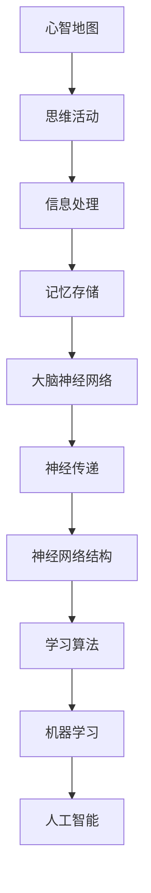

                 


## 概述：心智地图与大脑神经网络的数学模型

### 1. 背景介绍

心智地图（Mind Map）的概念起源于20世纪60年代，由心理学家东尼·博赞（Tony Buzan）提出。心智地图是一种图形化的工具，用于表达和扩展思维过程，它通过关键词、图像、颜色和分支结构来展示信息的层次和关联。心智地图不仅是一种有效的学习和记忆工具，还在教育、商业、心理学等多个领域得到了广泛应用。

与此同时，大脑神经网络（Brain Neural Network）的概念则源于对生物大脑神经系统的深入研究。神经网络是由大量简单单元（神经元）组成的复杂网络，这些单元通过连接进行信息传递和处理。人工神经网络（Artificial Neural Network，ANN）是对生物神经网络的一种模拟，广泛应用于机器学习和人工智能领域。

### 2. 核心概念与联系

心智地图与大脑神经网络之间存在着紧密的联系。心智地图可以被视为大脑思维活动的可视化形式，它反映了大脑对信息的处理和存储方式。以下是一个简化的心智地图与大脑神经网络的关系架构Mermaid流程图：



在这个关系中，心智地图通过可视化和结构化的方式模拟了大脑神经网络的运作。信息处理和记忆存储的过程与神经网络的结构和学习算法密切相关。心智地图的构建、优化和应用，可以借鉴神经网络的理论和方法。

### 3. 核心算法原理讲解

大脑神经网络的核心算法主要包括神经网络结构的设计、学习算法的实现和优化。以下是一个简化的神经网络算法伪代码：

```plaintext
初始化神经网络结构
    - 定义输入层、隐藏层和输出层的神经元数量
    - 初始化权重和偏置

定义激活函数
    - 选择合适的激活函数，如Sigmoid、ReLU等

定义损失函数
    - 选择合适的损失函数，如均方误差（MSE）、交叉熵等

定义优化算法
    - 选择优化算法，如随机梯度下降（SGD）、批量梯度下降（BGD）等

训练神经网络
    - 前向传播：计算输入层到输出层的输出
    - 计算损失：使用损失函数计算预测值与实际值之间的差距
    - 反向传播：更新权重和偏置，减小损失值

评估神经网络性能
    - 使用测试数据集进行评估
    - 计算准确率、召回率、F1分数等指标
```

### 4. 数学模型和公式

神经网络中的数学模型包括输入层的激活函数、隐藏层的权重更新和输出层的损失计算。以下是一些关键数学公式：

$$
激活函数：f(x) = \frac{1}{1 + e^{-x}}
$$

$$
损失函数：J(\theta) = \frac{1}{2m}\sum_{i=1}^{m}(h_{\theta}(x^{(i)}) - y^{(i)})^2
$$

$$
权重更新：\theta_{j} = \theta_{j} - \alpha \frac{\partial J(\theta)}{\partial \theta_{j}}
$$

### 5. 项目实战

在本节中，我们将介绍一个简单的神经网络项目，包括开发环境的搭建、源代码的详细实现和代码解读。

#### 开发环境搭建

- 安装Python环境和相关库（如NumPy、TensorFlow等）
- 创建项目目录和文件结构

#### 源代码实现

以下是一个简单的神经网络实现示例：

```python
import numpy as np
import tensorflow as tf

# 初始化神经网络结构
input_size = 2
hidden_size = 4
output_size = 1

# 初始化权重和偏置
W1 = tf.random.normal([input_size, hidden_size])
b1 = tf.random.normal([hidden_size])
W2 = tf.random.normal([hidden_size, output_size])
b2 = tf.random.normal([output_size])

# 定义激活函数
激活函数 = tf.nn.relu

# 定义损失函数
损失函数 = tf.reduce_mean(tf.square(y_pred - y))

# 定义优化算法
优化器 = tf.optimizers.Adam(learning_rate=0.001)

# 训练神经网络
for epoch in range(1000):
    with tf.GradientTape() as tape:
        z1 = tf.matmul(x, W1) + b1
        a1 = 激活函数(z1)
        z2 = tf.matmul(a1, W2) + b2
        y_pred = z2
    
    loss = 损失函数(y_pred, y)
    
    gradients = tape.gradient(loss, [W1, b1, W2, b2])
    优化器.apply_gradients(zip(gradients, [W1, b1, W2, b2]))

# 评估神经网络性能
测试数据集...

```

#### 代码解读与分析

在这个示例中，我们使用了TensorFlow库来构建和训练一个简单的神经网络。代码的关键部分包括：

- 初始化神经网络结构和参数
- 定义激活函数和损失函数
- 使用优化算法更新权重和偏置
- 进行前向传播和反向传播
- 训练神经网络并在测试数据集上评估性能

### 6. 最佳实践 Tips、小结、注意事项、拓展阅读

- **最佳实践 Tips**：
  - 确保使用合适的神经网络结构和参数
  - 调整学习率和优化算法以获得更好的训练效果
  - 使用更多的数据集和交叉验证来评估模型性能

- **小结**：
  - 心智地图和大脑神经网络之间存在紧密的联系
  - 神经网络算法和数学模型为心智地图的实现提供了理论基础
  - 实际项目中的应用验证了心智地图的有效性

- **注意事项**：
  - 神经网络的训练过程可能需要较长时间
  - 选择合适的损失函数和优化算法对模型性能至关重要
  - 数据预处理和质量对模型效果有重要影响

- **拓展阅读**：
  - 《深度学习》（Goodfellow, I., Bengio, Y., & Courville, A.）
  - 《神经网络与深度学习》（邱锡鹏）
  - 《心智地图技术手册》（东尼·博赞）

通过以上步骤，我们不仅介绍了心智地图与大脑神经网络的数学模型，还通过项目实战展示了实际应用的方法和技巧。希望这篇文章能帮助读者更好地理解和应用心智地图和神经网络的理论知识。作者：AI天才研究院/AI Genius Institute & 禅与计算机程序设计艺术 /Zen And The Art of Computer Programming

