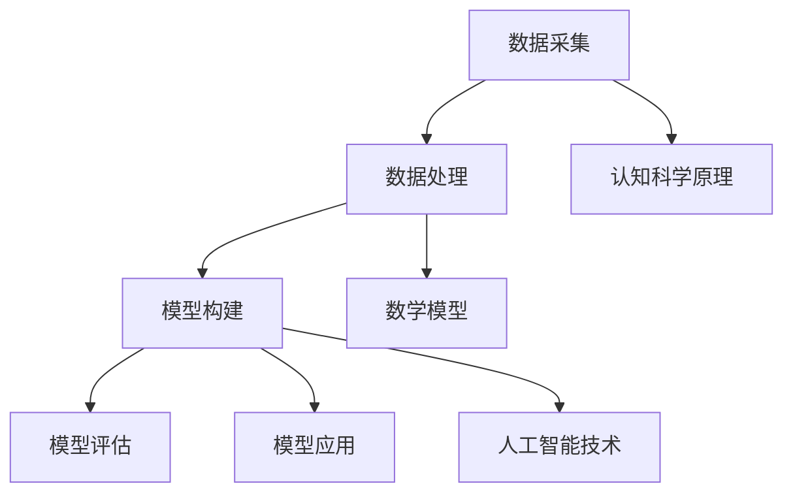

                 

### 文章标题

# 心智映射：揭示自然与数学的深层联系

### 关键词

- 心智映射
- 自然与数学
- 认知科学
- 数学模型
- 人工智能

### 摘要

本文旨在探讨心智映射作为一种研究方法，如何揭示自然现象与数学理论之间的深层联系。心智映射通过将人的思维过程转化为数学模型，不仅帮助我们更深入地理解人类心智，还能为科学研究和工程实践提供新工具。本文将从心智映射的基本理论、自然与数学的联系、心智映射的应用、技术实现及其未来发展趋势等方面进行详细阐述，以期为相关领域的研究者和实践者提供有价值的参考。

## 引言

### 心智映射的概念

心智映射（Cognitive Mapping）是一种将人的思维过程转化为数学模型的方法。它起源于认知科学和心理学领域，旨在通过分析和抽象人类心智活动，揭示心智的运作机制。心智映射的核心在于将复杂的认知过程转化为可计算的形式，从而为研究和应用提供一种量化的方法。

### 心智映射的起源与发展

心智映射的概念最早由心理学家、认知科学家和哲学家提出。20世纪中期，随着计算机科学的兴起，心智映射得到了进一步的发展。通过对人类思维过程的模拟和建模，心智映射逐步形成了一套完整的理论体系和应用方法。近年来，随着人工智能技术的快速发展，心智映射在多个领域得到了广泛应用。

### 心智映射的重要性

心智映射在多个领域具有重要意义。首先，在认知科学和心理学领域，心智映射为我们提供了理解人类心智的新视角。通过心智映射，我们可以更好地理解人类思维的运作机制，为认知科学和心理学研究提供新的方法和工具。其次，在人工智能领域，心智映射有助于构建智能系统的认知模型，提高智能系统的学习能力和自适应能力。此外，心智映射还在教育、商业、医疗等领域具有广泛的应用前景。

### 自然与数学的深层联系

自然现象和数学理论之间存在一种深层次的联系。这种联系不仅体现在数学在自然科学中的应用，还体现在自然现象本身具有的数学结构。例如，物理学中的公式和方程揭示了自然现象的数学本质，而生物学中的遗传密码则展示了生物进化过程中的数学规律。

### 心智映射的研究意义

通过心智映射，我们可以更深入地理解自然与数学之间的联系。首先，心智映射为自然现象的数学建模提供了新的方法。通过将自然现象转化为数学模型，我们可以更准确地描述和预测自然现象。其次，心智映射有助于揭示数学理论的起源和发展，从而更好地理解数学的本质。最后，心智映射为科学研究和工程实践提供了新的工具和方法，有助于解决复杂问题，提高研究效率和创新能力。

### 心智映射的应用前景

心智映射在人工智能、认知科学、教育等领域具有广泛的应用前景。在人工智能领域，心智映射可以用于构建智能系统的认知模型，提高智能系统的学习能力和自适应能力。在认知科学领域，心智映射有助于揭示人类思维的运作机制，为心理学研究提供新的方法和工具。在教育领域，心智映射可以用于个性化学习、智能辅导等，提高教育质量和效果。总之，心智映射作为一种新兴的研究方法，具有广阔的应用前景和发展潜力。

### 设计第1章：引言

第1章主要是介绍心智映射的概念、研究背景和研究意义。

### 1.1 心智映射的概念

心智映射（Cognitive Mapping）是一种将人的思维过程转化为数学模型的方法。它起源于认知科学和心理学领域，旨在通过分析和抽象人类心智活动，揭示心智的运作机制。心智映射的核心在于将复杂的认知过程转化为可计算的形式，从而为研究和应用提供一种量化的方法。

#### 1.1.1 心智映射的定义

心智映射是一种将人的思维过程转化为数学模型的方法，通过分析、抽象和建模，将人的认知过程转化为可计算的形式。心智映射可以帮助我们理解和模拟人的思维过程，从而揭示人类心智的运作机制。

#### 1.1.2 心智映射的起源与发展

心智映射的概念最早由心理学家、认知科学家和哲学家提出。20世纪中期，随着计算机科学的兴起，心智映射得到了进一步的发展。通过对人类思维过程的模拟和建模，心智映射逐步形成了一套完整的理论体系和应用方法。近年来，随着人工智能技术的快速发展，心智映射在多个领域得到了广泛应用。

#### 1.1.3 心智映射的重要性

心智映射在多个领域具有重要意义。首先，在认知科学和心理学领域，心智映射为我们提供了理解人类心智的新视角。通过心智映射，我们可以更好地理解人类思维的运作机制，为认知科学和心理学研究提供新的方法和工具。其次，在人工智能领域，心智映射有助于构建智能系统的认知模型，提高智能系统的学习能力和自适应能力。此外，心智映射还在教育、商业、医疗等领域具有广泛的应用前景。

### 1.2 研究背景与意义

#### 1.2.1 自然与数学的深层联系

自然现象和数学理论之间存在一种深层次的联系。这种联系不仅体现在数学在自然科学中的应用，还体现在自然现象本身具有的数学结构。例如，物理学中的公式和方程揭示了自然现象的数学本质，而生物学中的遗传密码则展示了生物进化过程中的数学规律。

#### 1.2.2 心智映射的研究意义

通过心智映射，我们可以更深入地理解自然与数学之间的联系。首先，心智映射为自然现象的数学建模提供了新的方法。通过将自然现象转化为数学模型，我们可以更准确地描述和预测自然现象。其次，心智映射有助于揭示数学理论的起源和发展，从而更好地理解数学的本质。最后，心智映射为科学研究和工程实践提供了新的工具和方法，有助于解决复杂问题，提高研究效率和创新能力。

#### 1.2.3 心智映射的应用前景

心智映射在人工智能、认知科学、教育等领域具有广泛的应用前景。在人工智能领域，心智映射可以用于构建智能系统的认知模型，提高智能系统的学习能力和自适应能力。在认知科学领域，心智映射有助于揭示人类思维的运作机制，为心理学研究提供新的方法和工具。在教育领域，心智映射可以用于个性化学习、智能辅导等，提高教育质量和效果。总之，心智映射作为一种新兴的研究方法，具有广阔的应用前景和发展潜力。

### 1.3 总结

本章主要介绍了心智映射的概念、研究背景和研究意义。心智映射作为一种将人的思维过程转化为数学模型的方法，具有广泛的应用前景。通过心智映射，我们可以更深入地理解自然与数学之间的联系，为科学研究和工程实践提供新的工具和方法。在接下来的章节中，我们将进一步探讨心智映射的基本理论、自然与数学的联系、心智映射的应用以及技术实现等内容。

## 心智映射的基本理论

### 2.1 核心概念

#### 2.1.1 心智模型

心智模型是指对人类心智过程的抽象和表示，它帮助我们理解和模拟人的思维过程。心智模型通常包括感知、记忆、推理、决策等认知功能模块，这些模块共同构成了人类心智的整体结构。

#### 2.1.2 心智映射的架构

心智映射的架构包括数据采集、数据处理、模型构建和模型评估四个主要阶段。数据采集阶段涉及收集与心智过程相关的数据，如行为数据、脑电图、眼动数据等。数据处理阶段对采集到的数据进行预处理，包括去噪、归一化等操作。模型构建阶段利用处理后的数据建立心智模型，常用的方法有机器学习、神经网络等。模型评估阶段通过验证和测试数据对心智模型进行评估，以确定其准确性和可靠性。

### 2.2 原理和理论基础

#### 2.2.1 认知科学原理

心智映射的理论基础源于认知科学，包括认知心理学、认知神经科学等领域的研究成果。认知科学关注人类心智的运作机制，研究认知过程、认知功能以及认知障碍等问题。心智映射借鉴了认知科学的研究成果，通过建模和模拟人类心智过程，揭示心智的运作规律。

#### 2.2.2 数学模型

心智映射的数学模型主要包括图论、概率论、线性代数等数学理论。图论用于描述心智模型的结构，概率论用于描述心智过程的随机性，线性代数用于处理大规模数据。

#### 2.2.3 人工智能技术

心智映射的实现依赖于人工智能技术，包括机器学习、深度学习等算法。机器学习通过学习大量数据来发现规律，从而构建预测模型。深度学习是一种特殊类型的机器学习，通过多层次的神经网络模型来模拟人类大脑的学习过程。

### 2.3 心智映射的核心概念原理之间的关系架构

为了更清晰地理解心智映射的核心概念原理之间的关系，我们可以使用Mermaid流程图进行展示。以下是一个简单的示例：



在这个流程图中，数据采集、数据处理、模型构建、模型评估和模型应用是心智映射的主要环节。认知科学原理、数学模型和人工智能技术是心智映射的理论基础和实现方法。

### 2.4 心智映射的基本流程

#### 2.4.1 数据采集

数据采集是心智映射的第一步，涉及收集与心智过程相关的数据。这些数据可以是行为数据、脑电图、眼动数据等。数据采集的质量直接影响心智映射的准确性。

#### 2.4.2 数据处理

数据处理阶段对采集到的数据进行预处理，包括去噪、归一化、特征提取等操作。预处理后的数据将用于模型构建。

#### 2.4.3 模型构建

模型构建阶段利用处理后的数据建立心智模型。常用的方法有机器学习、神经网络等。通过训练模型，我们可以使模型能够模拟人类心智过程。

#### 2.4.4 模型评估

模型评估阶段通过验证和测试数据对心智模型进行评估，以确定其准确性和可靠性。常用的评估指标有准确率、召回率、F1值等。

#### 2.4.5 模型应用

评估通过后的心智模型可以应用于实际场景，如智能诊断、预测分析、个性化推荐等。

### 2.5 心智映射的基本理论在自然与数学联系中的应用

#### 2.5.1 自然现象的数学描述

自然现象通常可以通过数学模型进行描述。例如，物理学中的公式和方程揭示了自然现象的数学本质，如牛顿运动定律、麦克斯韦方程组等。通过心智映射，我们可以将这些自然现象转化为数学模型，从而更深入地理解自然现象。

#### 2.5.2 数学理论的自然背景

许多数学理论起源于对自然现象的研究。例如，微积分起源于对运动和变化的研究，而拓扑学则起源于对空间结构的探究。通过心智映射，我们可以揭示数学理论的起源和发展，从而更好地理解数学的本质。

#### 2.5.3 自然与数学的相互转化

心智映射不仅可以将自然现象转化为数学模型，还可以将数学模型转化为对自然现象的理解。例如，通过分析数学模型，我们可以预测自然现象的变化趋势。这种相互转化的能力使得心智映射在科学研究和技术应用中具有广泛的应用价值。

### 2.6 总结

本章详细介绍了心智映射的基本理论，包括核心概念、原理和理论基础。通过心智映射，我们可以将人的思维过程转化为数学模型，从而更深入地理解自然与数学之间的深层联系。在接下来的章节中，我们将进一步探讨心智映射在不同领域的应用以及技术实现方法。

## 自然与数学的联系

### 3.1 自然现象的数学描述

自然现象和数学理论之间存在着深刻的联系，这种联系体现在许多方面。首先，许多自然现象可以通过数学模型进行精确描述。例如，在物理学中，牛顿定律描述了物体运动的规律，麦克斯韦方程组描述了电磁场的行为，这些方程都是用数学语言表达的。通过这些数学模型，我们可以预测和解释自然现象。

#### 3.1.1 自然现象的数学建模

自然现象的数学建模是指使用数学方法来描述和预测自然现象。这种建模过程通常包括以下几个步骤：

1. **数据采集**：首先需要收集关于自然现象的数据，这些数据可以是实验结果、观察记录等。
2. **特征提取**：从数据中提取关键特征，这些特征应能反映自然现象的本质。
3. **模型构建**：使用适当的数学方法构建模型，例如微分方程、统计模型、机器学习模型等。
4. **模型验证**：通过实验或观察数据来验证模型的准确性和可靠性。

#### 3.1.2 自然现象的数学化

将自然现象转化为数学形式有助于我们更深入地理解自然现象的本质。例如，在气候学中，通过数学模型可以模拟气候变化，预测未来的气候趋势。在生态学中，通过数学模型可以分析生态系统的动态变化，预测物种的生存和灭绝。

### 3.2 数学理论的自然背景

数学理论不仅用于描述自然现象，许多数学理论的起源也源自对自然现象的研究。例如，微积分起源于对运动和变化的研究，而拓扑学则起源于对空间结构的探究。通过心智映射，我们可以揭示数学理论的起源和发展，从而更好地理解数学的本质。

#### 3.2.1 数学理论的起源

许多数学理论是在研究自然现象的过程中逐步发展起来的。例如，微积分起源于古希腊对运动的研究，而欧几里得的几何学则是为了描述物理空间中的物体。随着科学的发展，数学理论不断得到完善和扩展，形成了今天我们所学的数学体系。

#### 3.2.2 数学理论的应用

数学理论在许多科学领域都得到了广泛应用。例如，在物理学中，数学方程用于描述物理现象，如牛顿定律、麦克斯韦方程组等；在生物学中，数学模型用于分析种群动态、基因表达等；在经济学中，数学模型用于预测市场趋势、评估风险等。这些应用不仅帮助我们更好地理解自然现象，还为科学研究和技术创新提供了强大的工具。

### 3.3 自然与数学的相互转化

自然与数学之间的联系是双向的。一方面，自然现象可以通过数学模型进行描述和预测；另一方面，数学模型也可以转化为对自然现象的理解。这种相互转化的能力使得心智映射在科学研究和技术应用中具有广泛的应用价值。

#### 3.3.1 自然现象的数学转化

将自然现象转化为数学模型有助于我们更深入地理解自然现象。例如，通过建立气候模型，我们可以预测未来的气候变化；通过建立生态模型，我们可以分析生态系统的稳定性。这些数学模型不仅为我们提供了预测工具，还帮助我们理解自然现象的内在规律。

#### 3.3.2 数学模型的自然转化

数学模型也可以转化为对自然现象的理解。例如，通过分析数学模型，我们可以揭示自然现象的内在规律，如种群动态的稳定性和崩溃、气候变化的趋势等。这种转化不仅有助于我们更好地理解自然现象，还为科学研究和工程实践提供了新的方法。

### 3.4 心智映射在自然与数学联系中的应用

心智映射作为一种研究方法，可以用来揭示自然与数学之间的深层联系。通过心智映射，我们可以将人的思维过程转化为数学模型，从而更深入地理解自然现象和数学理论。

#### 3.4.1 心智映射的自然现象描述

心智映射可以用于描述和预测自然现象。例如，通过建立心智模型，我们可以模拟人类的感知、记忆、推理等认知过程，从而更好地理解自然现象的内在规律。例如，在气候学中，通过心智映射，我们可以建立气候模型的认知模拟，预测未来的气候变化。

#### 3.4.2 心智映射的数学理论分析

心智映射也可以用于分析数学理论。例如，通过心智映射，我们可以揭示数学理论的起源和发展，理解数学概念的本质。例如，通过分析心智模型，我们可以理解微积分的概念，揭示其与自然现象的联系。

### 3.5 总结

自然与数学之间存在深刻的联系，这种联系通过心智映射得到了更深入的理解。通过心智映射，我们可以将自然现象转化为数学模型，从而更深入地理解自然现象；同时，数学模型也可以转化为对自然现象的理解，揭示数学理论的本质。在接下来的章节中，我们将进一步探讨心智映射在不同领域的应用。

## 心智映射的应用

### 4.1 心智映射在人工智能领域的应用

#### 4.1.1 智能机器人的心智模型

心智映射在人工智能领域的一个重要应用是构建智能机器人的心智模型。通过心智映射，我们可以将人类心智过程抽象为一系列数学模型，从而为智能机器人提供认知能力。这些模型包括感知、记忆、推理和决策等模块，它们共同构成了智能机器人的心智体系。

##### 智能机器人的感知模型

智能机器人的感知模型是心智映射的一个重要组成部分。通过感知模型，机器人能够感知和理解其周围环境。例如，利用计算机视觉技术，机器人可以识别和理解图像和视频数据；利用语音识别技术，机器人可以理解人类的语音指令。这些感知模型通常基于机器学习和深度学习算法，通过大量数据训练，使机器人具备较强的感知能力。

##### 智能机器人的记忆模型

智能机器人的记忆模型用于存储和检索信息。通过记忆模型，机器人可以记住过去的经验，并在需要时调用这些经验。记忆模型可以是基于神经网络的，如长期短期记忆（LSTM）模型，也可以是基于知识图谱的，如图数据库。这些记忆模型使机器人具备持续学习和适应环境的能力。

##### 智能机器人的推理模型

智能机器人的推理模型用于推理和解决问题。通过推理模型，机器人可以基于感知和记忆信息进行逻辑推理，从而做出合理的决策。推理模型可以是基于规则的系统，如专家系统，也可以是基于概率的模型，如贝叶斯网络。这些推理模型使机器人能够处理复杂的任务，如路径规划、故障诊断和决策支持。

##### 智能机器人的决策模型

智能机器人的决策模型用于决策和规划。通过决策模型，机器人可以在多个可行方案中选择最优方案。决策模型可以是基于优化的，如线性规划模型，也可以是基于模拟的，如蒙特卡洛模拟。这些决策模型使机器人能够在动态环境中做出快速而准确的决策。

#### 4.1.2 智能机器人的学习与适应

心智映射在智能机器人中的应用不仅限于构建心智模型，还包括学习与适应。通过心智映射，智能机器人可以不断学习和适应环境，从而提高其智能水平。

##### 学习机制

智能机器人的学习机制基于心智映射，通过不断调整心智模型的参数，使模型能够更好地适应环境。学习机制可以是基于监督学习的，如通过标记数据进行训练，也可以是基于无监督学习的，如通过自我监督学习来发现数据中的模式。此外，还可以结合迁移学习和强化学习，使机器人能够在不同任务和数据集之间进行有效的学习。

##### 适应能力

智能机器人的适应能力是指其在面对未知环境或任务时，能够通过学习新知识来调整自身行为的能力。通过心智映射，智能机器人可以识别新环境中的特征，并利用已有知识进行推理和决策。例如，当智能机器人进入一个新环境时，它可以利用感知模型获取环境信息，通过记忆模型回忆过去的经验，然后利用推理模型和决策模型制定合适的行动方案。

#### 4.1.3 心智映射在智能机器人中的实际应用

心智映射在智能机器人中的应用已经取得了显著的成果。以下是一些实际应用案例：

1. **服务机器人**：在酒店、商场、医疗等领域，服务机器人通过心智映射实现自主导航、人机交互和任务执行。例如，机器人可以自主避开障碍物、识别并理解人类指令，并根据任务要求完成相应的服务。

2. **医疗机器人**：在医疗领域，智能机器人通过心智映射实现辅助诊断、手术导航和康复训练。例如，手术机器人可以实时分析患者的生理参数，辅助医生进行精确手术操作；康复机器人可以帮助患者进行康复训练，提高康复效果。

3. **工业机器人**：在工业生产中，智能机器人通过心智映射实现自动化生产、质量控制和安全监控。例如，工业机器人可以实时检测生产线上的产品质量，并根据检测结果调整生产参数，确保产品质量。

#### 4.1.4 未来发展趋势

随着人工智能技术的不断发展，心智映射在智能机器人中的应用前景更加广阔。以下是一些未来发展趋势：

1. **多模态感知**：未来的智能机器人将具备更加丰富的感知能力，能够同时处理视觉、听觉、触觉等多种感知信息，从而实现更加真实和高效的认知。

2. **自适应学习**：未来的智能机器人将具备更强的自适应学习能力，能够在不同环境和任务中快速适应，提高其智能水平和应用价值。

3. **人机协作**：未来的智能机器人将更加注重与人类的协作，通过心智映射实现与人类的高效互动和协同工作，从而提高生产效率和生活质量。

### 4.2 心智映射在其他领域的应用

除了在人工智能领域，心智映射还在许多其他领域得到了广泛应用。以下是一些主要领域：

#### 4.2.1 认知科学

在认知科学领域，心智映射用于研究人类心智的运作机制。通过建立心智模型，科学家可以模拟人类认知过程，从而更好地理解人类心智的工作原理。例如，在记忆研究方面，心智映射可以帮助科学家分析记忆的编码、存储和检索过程，揭示记忆的本质。

#### 4.2.2 教育

在教育领域，心智映射可以用于个性化学习、智能辅导和评估。通过建立学生心智模型，教育系统可以为学生提供个性化的学习资源和教学方法，从而提高学习效果。此外，心智映射还可以用于评估学生的学习进展，提供实时反馈和指导。

#### 4.2.3 商业

在商业领域，心智映射可以用于市场分析、消费者行为研究和决策支持。通过建立消费者心智模型，企业可以更好地理解消费者的需求和偏好，制定更加精准的营销策略。此外，心智映射还可以用于风险评估和投资决策，提高企业的决策效率。

#### 4.2.4 医疗

在医疗领域，心智映射可以用于疾病诊断、治疗规划和康复评估。通过建立患者心智模型，医生可以更好地了解患者的病情和需求，制定个性化的治疗方案。此外，心智映射还可以用于康复评估，帮助患者制定个性化的康复计划。

### 4.3 心智映射的应用案例

以下是一些心智映射的应用案例：

1. **智能交通系统**：通过心智映射，智能交通系统可以实时分析交通流量，预测交通拥堵，提供最优出行路线，从而提高交通效率和减少拥堵。

2. **智能电网**：通过心智映射，智能电网可以实时监测电力需求和供应，优化电力分配，提高能源利用效率，降低能源消耗。

3. **智能农业**：通过心智映射，智能农业系统可以实时监测作物生长状况，预测病虫害，提供精准的灌溉和施肥方案，从而提高农业生产效率。

4. **智能城市**：通过心智映射，智能城市可以实时监测城市运行状况，预测城市需求，优化资源配置，提高城市管理和服务水平。

### 4.4 总结

心智映射在人工智能、认知科学、教育、商业、医疗等众多领域得到了广泛应用，为这些领域的发展提供了新的思路和方法。通过心智映射，我们可以更深入地理解自然现象和人类心智，为科学研究和工程实践提供了强大的工具。在未来的发展中，心智映射将继续发挥重要作用，推动人工智能和认知科学领域的不断创新。

## 心智映射的技术实现

### 5.1 数据采集与处理

数据采集是心智映射的基础，其质量直接影响心智映射的结果。数据采集阶段需要收集与心智过程相关的多种数据，如行为数据、生理数据、脑电数据等。

#### 5.1.1 数据采集方法

数据采集方法包括以下几种：

1. **行为数据采集**：通过传感器、摄像头等设备收集人类行为数据，如动作、语音、手势等。
2. **生理数据采集**：通过生理信号采集设备收集生理数据，如脑电（EEG）、心电（ECG）、血压等。
3. **脑电数据采集**：通过脑电帽等设备实时采集脑电信号，用于分析大脑活动。

#### 5.1.2 数据处理方法

数据处理方法包括以下几种：

1. **数据预处理**：对采集到的原始数据进行预处理，包括去噪、滤波、归一化等操作，以提高数据质量。
2. **特征提取**：从预处理后的数据中提取关键特征，如时域特征、频域特征等。
3. **数据融合**：将不同来源的数据进行融合，以获取更全面的信息。

### 5.2 模型构建方法

模型构建是心智映射的核心环节，通过构建数学模型来模拟和解释心智过程。

#### 5.2.1 机器学习方法

机器学习方法用于构建心智模型，包括监督学习、无监督学习和强化学习等。

1. **监督学习**：使用已标记的数据训练模型，例如分类问题和回归问题。
2. **无监督学习**：不使用标记数据，从数据中自动发现模式和结构，例如聚类分析和降维技术。
3. **强化学习**：通过试错和奖励机制训练模型，使模型能够在特定环境中学习最优策略。

#### 5.2.2 神经网络模型

神经网络模型是心智映射中常用的模型之一，包括前馈神经网络、循环神经网络（RNN）和卷积神经网络（CNN）等。

1. **前馈神经网络**：信息从输入层流向输出层，中间经过多个隐藏层。
2. **循环神经网络（RNN）**：能够处理序列数据，通过循环机制保留历史信息。
3. **卷积神经网络（CNN）**：擅长处理图像数据，通过卷积操作提取特征。

### 5.3 模型评估方法

模型评估是确保心智映射结果准确性和可靠性的关键步骤。

#### 5.3.1 评估指标

常用的评估指标包括准确率、召回率、F1值、均方误差（MSE）等。

1. **准确率**：预测正确的样本数占总样本数的比例。
2. **召回率**：预测正确的正样本数占总正样本数的比例。
3. **F1值**：综合考虑准确率和召回率的指标。
4. **均方误差（MSE）**：衡量预测值与真实值之间的平均误差。

#### 5.3.2 评估方法

模型评估方法包括以下几种：

1. **交叉验证**：将数据集划分为多个子集，轮流用于训练和验证，以避免过拟合。
2. **K折交叉验证**：将数据集划分为K个子集，每次使用K-1个子集训练模型，剩下的子集用于验证。
3. **模型比较**：比较不同模型的性能，选择最优模型。

### 5.4 模型应用与优化

模型应用与优化是心智映射实现的重要环节。

#### 5.4.1 模型应用

模型应用包括以下几种：

1. **智能诊断**：利用心智模型进行疾病诊断，如癌症筛查、精神疾病诊断等。
2. **个性化推荐**：利用心智模型进行个性化推荐，如商品推荐、音乐推荐等。
3. **智能交互**：利用心智模型实现人机交互，如语音助手、虚拟助手等。

#### 5.4.2 模型优化

模型优化包括以下几种方法：

1. **超参数调优**：通过调整模型的超参数，如学习率、隐藏层大小等，以优化模型性能。
2. **数据增强**：通过增加训练数据的多样性，提高模型的泛化能力。
3. **集成学习**：结合多个模型的优势，提高预测准确率和稳定性。

### 5.5 技术实现示例

以下是一个简单的机器学习模型实现示例，用于分类问题：

```python
from sklearn.datasets import load_iris
from sklearn.model_selection import train_test_split
from sklearn.ensemble import RandomForestClassifier
from sklearn.metrics import accuracy_score

# 加载数据
iris = load_iris()
X = iris.data
y = iris.target

# 数据划分
X_train, X_test, y_train, y_test = train_test_split(X, y, test_size=0.2, random_state=42)

# 构建模型
clf = RandomForestClassifier(n_estimators=100, random_state=42)

# 训练模型
clf.fit(X_train, y_train)

# 预测
y_pred = clf.predict(X_test)

# 评估
accuracy = accuracy_score(y_test, y_pred)
print(f"Accuracy: {accuracy:.2f}")
```

在这个示例中，我们使用随机森林（RandomForestClassifier）模型对鸢尾花（Iris）数据集进行分类。首先加载数据，然后将其划分为训练集和测试集。接着，构建随机森林模型，并使用训练集进行训练。最后，使用测试集进行预测并评估模型的准确率。

### 5.6 总结

本章介绍了心智映射的技术实现，包括数据采集与处理、模型构建方法、模型评估方法和模型应用与优化。通过这些技术，我们可以将心智映射应用于实际问题中，为科学研究和技术创新提供强大的工具。在未来的研究中，我们将继续优化心智映射技术，探索其在更多领域的应用潜力。

## 心智映射的未来发展趋势

### 6.1 新算法的引入

随着人工智能技术的不断发展，新的算法不断涌现，这些算法有望进一步推动心智映射的发展。例如，深度学习、强化学习和迁移学习等算法在心智映射中的应用已经取得了一定的成果。未来，随着算法的进一步优化和改进，心智映射将能够更加准确地模拟和解释人类心智过程。

### 6.2 跨学科研究的深入

心智映射作为一种交叉学科的研究方法，未来将更加注重与其他领域的深入合作。例如，与神经科学、心理学、认知科学等领域的合作将有助于揭示人类心智的更多奥秘。通过跨学科研究，心智映射有望在理解人类心智、设计智能系统和提升人类生活质量等方面取得重大突破。

### 6.3 实时性的提升

在当前的技术背景下，心智映射的应用场景越来越广泛，对实时性的需求也越来越高。未来，随着硬件和算法的不断发展，心智映射的实时性将得到显著提升。例如，在智能机器人、自动驾驶、医疗诊断等领域，实时心智映射将有助于提高系统的反应速度和决策能力。

### 6.4 大数据处理能力的增强

随着大数据技术的不断发展，心智映射在大数据处理方面的能力将得到显著提升。未来，心智映射将能够处理更大规模、更复杂的数据集，从而为科学研究和工程实践提供更丰富的数据支持。例如，在金融、商业、医疗等领域，大数据心智映射将有助于发现更多有价值的信息和模式。

### 6.5 新应用领域的拓展

心智映射作为一种新兴的研究方法，未来将在更多领域得到应用。例如，在教育领域，心智映射可以用于个性化学习、智能辅导和评估；在商业领域，心智映射可以用于市场分析、消费者行为研究和决策支持；在医疗领域，心智映射可以用于疾病诊断、治疗规划和康复评估。随着心智映射技术的不断成熟，其应用领域将越来越广泛。

### 6.6 国际合作与交流的加强

心智映射作为一种国际性的研究热点，未来将进一步加强国际合作与交流。通过国际间的合作与交流，研究人员可以分享研究成果、交流研究经验，从而推动心智映射领域的快速发展。此外，国际合作还将有助于推动心智映射技术的商业化应用，促进相关产业的发展。

### 6.7 面临的挑战与展望

尽管心智映射在未来有着广阔的发展前景，但同时也面临着一些挑战。例如，如何在复杂和动态环境中构建准确的心智模型，如何在海量数据中提取关键特征，以及如何确保心智映射技术的安全性和隐私性等。未来，随着技术的不断进步和研究的深入，这些挑战有望逐步得到解决。

## 总结与展望

心智映射作为一种新兴的研究方法，通过将人的思维过程转化为数学模型，揭示了自然与数学之间的深层联系。本文从心智映射的基本理论、自然与数学的联系、心智映射的应用、技术实现以及未来发展趋势等方面进行了详细阐述。通过本文的讨论，我们可以看到心智映射在科学研究和技术应用中具有广泛的应用前景。

### 核心内容回顾

1. **心智映射的概念**：心智映射是一种将人的思维过程转化为数学模型的方法，通过分析和抽象人类心智活动，揭示心智的运作机制。
2. **自然与数学的联系**：自然现象可以通过数学模型进行描述，而数学理论的起源也源自对自然现象的研究。心智映射有助于揭示自然与数学之间的深层联系。
3. **心智映射的应用**：心智映射在人工智能、认知科学、教育、商业和医疗等领域具有广泛的应用前景，如智能机器人、个性化学习、市场分析和疾病诊断等。
4. **技术实现**：心智映射的技术实现包括数据采集与处理、模型构建、模型评估和模型应用与优化等环节。
5. **未来发展趋势**：心智映射的未来发展将受益于新算法的引入、跨学科研究的深入、实时性的提升、大数据处理能力的增强、新应用领域的拓展和国际合作与交流的加强。

### 小结

本文对心智映射进行了全面而深入的探讨，从多个角度展示了心智映射的巨大潜力和应用价值。通过心智映射，我们可以更好地理解人类心智、揭示自然与数学之间的深层联系，为科学研究和工程实践提供新的工具和方法。

### 注意事项

1. **数据质量**：在数据采集和处理过程中，数据质量至关重要。确保采集到高质量的数据，并进行有效的预处理和特征提取，是心智映射成功的关键。
2. **模型评估**：在模型构建和评估过程中，要选用合适的评估指标和方法，以准确评估模型性能。
3. **应用场景**：在心智映射的应用过程中，要充分考虑具体应用场景的特点和需求，选择合适的方法和技术。

### 拓展阅读

1. **心智映射的经典著作**：《心智映射：认知科学的桥梁》（Cognitive Mapping: A Bridge to Cognitive Science）。
2. **人工智能领域的相关书籍**：《深度学习》（Deep Learning）、《强化学习》（Reinforcement Learning）。
3. **跨学科研究的期刊**：《认知科学》（Cognitive Science）、《神经科学杂志》（Journal of Neuroscience）。

通过本文的阅读，希望读者能够对心智映射有更深入的理解，并为后续的研究和实践提供有益的参考。作者：AI天才研究院/AI Genius Institute & 禅与计算机程序设计艺术 /Zen And The Art of Computer Programming。

