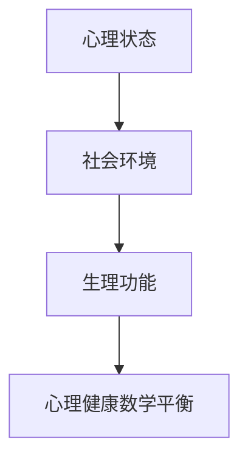

                 

 我们开始着手撰写这篇名为《心理咨询的控制理论：心理健康的数学平衡》的技术博客文章。

### 文章标题

《心理咨询的控制理论：心理健康的数学平衡》

### 文章关键词

- 心理咨询
- 控制理论
- 数学模型
- 心理健康
- 动态系统

### 文章摘要

本文旨在探讨控制理论在心理咨询中的应用，将数学方法应用于心理健康的动态平衡分析。我们将详细介绍控制理论的基本概念、数学基础，以及如何将其应用于心理咨询。通过具体案例和数学模型，我们将展示如何通过控制理论实现心理健康的数学平衡。

### 目录

1. 控制理论概述
   1.1 控制理论的基本概念
   1.2 控制理论的数学基础
   1.3 控制理论在心理咨询中的应用

2. 心理咨询中的数学模型
   2.1 行为控制模型
   2.2 认知行为模型
   2.3 心理健康评价模型

3. 心理健康的数学平衡
   3.1 心理健康的数学平衡理论
   3.2 心理健康的数学平衡模型
   3.3 心理健康的数学平衡分析

4. 心理健康数学模型的应用与实践
   4.1 心理健康数学模型在心理健康教育中的应用
   4.2 心理健康数学模型在企业员工心理辅导中的应用

5. 总结与展望

### 引言

在现代社会，心理健康问题日益凸显，如何有效地进行心理咨询成为了一个重要的课题。传统的心理咨询方法依赖于心理学理论和临床经验，但在面对复杂的心理问题时，往往难以提供精确的干预策略。控制理论的引入，为心理咨询提供了一种新的视角和工具，通过数学模型和算法，实现了对心理健康的动态平衡分析。

控制理论在心理咨询中的应用，不仅能够帮助心理咨询师更准确地评估患者的心理状态，还能提供基于数据的干预方案，从而提高心理咨询的效率和效果。本文将详细介绍控制理论在心理咨询中的应用，包括基本概念、数学模型以及实际应用案例。

### 第1章 控制理论概述

#### 1.1 控制理论的基本概念

控制理论是一门研究如何使动态系统按照预期行为运行的学科。它涉及系统建模、控制器设计、性能分析和稳定性证明等多个方面。控制理论的基本概念包括：

- **系统**：指受控对象，可以是物理设备、生物体或社会群体。系统通常用状态空间模型来描述，状态空间模型包括状态变量、输入变量和输出变量。
  
  **Mermaid 流程图**：
  ```mermaid
  graph TD
  A[系统] --> B[输入]
  B --> C[输出]
  C --> D[状态变量]
  ```

- **控制器**：指负责调节输入变量以实现预期输出的装置或算法。控制器通常基于系统模型设计，以实现系统的最优控制或稳定控制。

- **输入**：指对系统施加的变量，可以是操纵变量或扰动。输入可以是有界的，也可以是随机的。

- **输出**：指系统对外部环境的响应。输出可以用来评估系统的性能或进行反馈控制。

- **反馈**：指将系统的输出返回到控制器，用于调整输入变量。反馈是实现闭环控制的关键，它使得系统可以根据实际输出与期望输出的差异进行自适应调整。

#### 1.2 控制理论的数学基础

控制理论的数学基础主要包括线性代数、微积分、概率论和数理统计。这些数学工具为控制理论的研究提供了强大的分析工具和理论基础。

- **线性代数**：线性代数是研究向量空间和线性变换的数学分支。在控制理论中，线性代数用于描述系统的状态空间模型，如状态矩阵、输入矩阵和输出矩阵等。

  **Mermaid 流程图**：
  ```mermaid
  graph TD
  A[状态矩阵] --> B[输入矩阵]
  B --> C[输出矩阵]
  C --> D[控制矩阵]
  ```

- **微积分**：微积分是研究变化和运动的数学分支。在控制理论中，微积分用于分析系统的动态行为，如状态轨迹、控制信号和误差信号等。

  **伪代码**：
  ```python
  def system Dynamics(x, u, t):
      # x: 状态变量
      # u: 输入变量
      # t: 时间
      # 返回：状态变量的导数
      dxdt = A*x + B*u
      return dxdt
  ```

- **概率论**：概率论是研究随机事件和随机变量的数学分支。在控制理论中，概率论用于处理系统的随机性和不确定性，如随机控制、随机微分方程和马尔可夫决策过程等。

  **伪代码**：
  ```python
  def stochastic Control(x, u, w, t):
      # x: 状态变量
      # u: 输入变量
      # w: 随机扰动
      # t: 时间
      # 返回：控制信号
      u = f(x, w, t)
      return u
  ```

- **数理统计**：数理统计是研究数据收集、分析和解释的数学分支。在控制理论中，数理统计用于评估系统的性能、进行假设检验和置信区间估计等。

  **伪代码**：
  ```python
  def performance Evaluation(x, u, y):
      # x: 状态变量
      # u: 输入变量
      # y: 输出变量
      # 返回：性能指标
      performance = calculateError(x, u, y)
      return performance
  ```

#### 1.3 控制理论在心理咨询中的应用

控制理论在心理咨询中的应用主要涉及心理状态的建模、控制策略的设计和心理干预的实施。通过将控制理论应用于心理咨询，可以实现对心理状态的有效调控，从而实现心理健康的数学平衡。

- **心理状态建模**：心理状态建模是控制理论在心理咨询中的第一步。通过建立心理状态的状态空间模型，可以描述个体的心理状态及其变化规律。

  **Mermaid 流程图**：
  ```mermaid
  graph TD
  A[心理状态] --> B[情绪变量]
  B --> C[认知变量]
  C --> D[行为变量]
  ```

- **控制策略设计**：控制策略设计是基于心理状态建模的进一步工作。通过设计适当的控制策略，可以实现对心理状态的调节，从而实现心理健康的数学平衡。

  **伪代码**：
  ```python
  def control Strategy(x, y, t):
      # x: 当前心理状态
      # y: 目标心理状态
      # t: 时间
      # 返回：控制信号
      u = K*y - x
      return u
  ```

- **心理干预实施**：心理干预实施是控制理论在心理咨询中的最终目标。通过将控制策略应用于实际心理干预过程，可以实现对个体的心理状态的实时调控，从而促进心理健康的数学平衡。

  **伪代码**：
  ```python
  def psychological Intervention(x, u, t):
      # x: 当前心理状态
      # u: 控制信号
      # t: 时间
      # 返回：调节后的心理状态
      x_new = system Dynamics(x, u, t)
      return x_new
  ```

### 总结

本章介绍了控制理论的基本概念、数学基础以及在心理咨询中的应用。控制理论为心理咨询提供了一种系统的方法来理解和干预个体的心理状态，从而实现心理健康的数学平衡。通过本章的内容，读者可以初步了解控制理论在心理咨询中的应用，为后续章节的深入探讨打下基础。

---

### 第2章 心理咨询中的数学模型

在心理咨询中，数学模型的使用至关重要，它能够将心理学中的抽象概念转化为具体的数学形式，使得心理咨询过程更加科学和可量化。本章将介绍几种常见的数学模型，包括行为控制模型、认知行为模型和心理健康评价模型，并探讨它们在心理咨询中的应用。

#### 2.1 行为控制模型

行为控制模型是心理咨询中的一种重要工具，它基于行为主义理论，强调环境对行为的影响。行为控制模型的核心是行为改变技术，这些技术通过正向强化和负向强化来塑造和改变个体的行为。

**核心概念与联系：**

- **行为主义理论**：行为主义理论认为，行为是环境刺激和个体反应的函数。通过改变环境刺激，可以改变个体的行为。

  **Mermaid 流程图**：
  ```mermaid
  graph TD
  A[行为主义理论] --> B[环境刺激]
  B --> C[个体反应]
  C --> D[行为改变技术]
  ```

- **正向强化**：正向强化是通过给予积极反馈来增强个体的行为。例如，给予奖励或赞许。

- **负向强化**：负向强化是通过移除消极刺激来增强个体的行为。例如，减少压力或惩罚。

**核心算法原理讲解：**

行为控制模型通常采用马尔可夫决策过程（MDP）来建模。MDP是一个离散时间决策过程，其中个体在每次决策时面临一个状态集合和一个动作集合，并根据当前状态和动作选择下一个状态。

**伪代码**：

```python
class MarkovDecisionProcess:
    def __init__(self, states, actions, rewards, transition_probabilities):
        self.states = states
        self.actions = actions
        self.rewards = rewards
        self.transition_probabilities = transition_probabilities

    def take_action(self, state, action):
        next_state = self.states.random_choice([
            (next_state, probability) 
            for next_state, probability in self.transition_probabilities[state][action].items()
        ])
        reward = self.rewards[state][action]
        return next_state, reward
```

**数学模型和公式讲解：**

在行为控制模型中，常用的数学模型包括状态转移矩阵、奖励函数和策略函数。

- **状态转移矩阵**：状态转移矩阵描述了在给定当前状态和动作时，下一个状态的概率分布。

  **公式**：
  $$ P_{ij}^{ab} = P(S_{t+1} = j|S_t = i, A_t = a, B_t = b) $$

- **奖励函数**：奖励函数描述了在给定当前状态和动作时，获得的奖励。

  **公式**：
  $$ R(i, a) = \sum_{j} r_{ij} p_j(a) $$

- **策略函数**：策略函数描述了在给定当前状态时，应该选择的动作。

  **公式**：
  $$ \pi(i) = \arg\max_a R(i, a) $$

**举例说明：**

假设有一个心理咨询师使用行为控制模型来帮助一个患者减少焦虑。状态集合为 {焦虑，非焦虑}，动作集合为 {放松，冥想}。状态转移矩阵、奖励函数和策略函数如下：

- **状态转移矩阵**：
  $$ P = \begin{bmatrix} 
  p_{00} & p_{01} \\ 
  p_{10} & p_{11} 
  \end{bmatrix} $$

- **奖励函数**：
  $$ R = \begin{bmatrix} 
  r_{00} & r_{01} \\ 
  r_{10} & r_{11} 
  \end{bmatrix} $$

- **策略函数**：
  $$ \pi = \begin{bmatrix} 
  \pi_0 & \pi_1 \\ 
  \pi_1 & \pi_1 
  \end{bmatrix} $$

通过这些数学模型，心理咨询师可以设计出最优的行为干预策略，从而帮助患者实现心理健康的数学平衡。

#### 2.2 认知行为模型

认知行为模型是心理咨询中的另一个重要工具，它基于认知行为理论，强调思维模式对行为和情感的影响。认知行为模型的核心是认知重构技术，这些技术通过改变个体的思维模式来改善其情绪和行为。

**核心概念与联系：**

- **认知行为理论**：认知行为理论认为，个体的情绪和行为是由其思维模式决定的。通过改变思维模式，可以改善个体的情绪和行为。

  **Mermaid 流程图**：
  ```mermaid
  graph TD
  A[认知行为理论] --> B[思维模式]
  B --> C[情绪]
  C --> D[行为]
  ```

- **认知重构**：认知重构是通过识别和改变负面思维模式来改善情绪和行为的技术。常见的认知重构技术包括问题解决、认知重建和认知重构。

**核心算法原理讲解：**

认知行为模型通常采用决策树或神经网络来建模。决策树模型通过一系列条件判断来预测个体的行为和情绪，而神经网络模型则通过多层非线性变换来学习复杂的思维模式。

**伪代码**：

```python
class DecisionTreeModel:
    def __init__(self, attributes, decisions, outcomes):
        self.attributes = attributes
        self.decisions = decisions
        self.outcomes = outcomes

    def predict(self, instance):
        current_state = instance
        for decision in self.decisions:
            attribute_value = current_state[decision]
            current_state = self.outcomes[decision][attribute_value]
        return current_state

class NeuralNetworkModel:
    def __init__(self, layers, activation_functions):
        self.layers = layers
        self.activation_functions = activation_functions

    def forward_pass(self, inputs):
        outputs = inputs
        for layer in self.layers:
            outputs = self.activation_functions[layer](outputs)
        return outputs
```

**数学模型和公式讲解：**

在认知行为模型中，常用的数学模型包括决策树模型和神经网络模型。

- **决策树模型**：决策树模型通过一系列条件判断来预测个体的行为和情绪。每个节点代表一个条件判断，每个分支代表一个可能的输出。

  **公式**：
  $$ y = g(\theta_0 \cdot x_0 + \theta_1 \cdot x_1 + \ldots + \theta_n \cdot x_n) $$

- **神经网络模型**：神经网络模型通过多层非线性变换来学习复杂的思维模式。每个神经元接收多个输入，并通过权重和偏置进行加权求和，然后通过激活函数进行非线性变换。

  **公式**：
  $$ a_{j}^{(l)} = \sigma \left( \sum_{i} w_{ij}^{(l)} a_{i}^{(l-1)} + b_{j}^{(l)} \right) $$

**举例说明：**

假设有一个心理咨询师使用认知行为模型来帮助一个患者克服焦虑。状态集合为 {焦虑，非焦虑}，思维模式集合为 {担忧，理性思考}。决策树模型和神经网络模型如下：

- **决策树模型**：
  $$ \text{如果思维模式是担忧，那么行为是焦虑。} $$
  $$ \text{如果思维模式是理性思考，那么行为是非焦虑。} $$

- **神经网络模型**：
  $$ \sigma \left( w_1 \cdot 担忧 + w_2 \cdot 理性思考 + b \right) $$

通过这些数学模型，心理咨询师可以设计出最优的认知干预策略，从而帮助患者实现心理健康的数学平衡。

#### 2.3 心理健康评价模型

心理健康评价模型是心理咨询中用于评估个体心理健康状况的工具。这些模型通过量化和评估个体的心理状态，为心理咨询提供重要的数据支持。常见的心理健康评价模型包括心理健康量表、心理诊断标准和心理健康指数等。

**核心概念与联系：**

- **心理健康量表**：心理健康量表是通过一系列问卷或测试来评估个体心理健康状况的工具。常见的量表包括抑郁量表、焦虑量表和自尊量表等。

  **Mermaid 流程图**：
  ```mermaid
  graph TD
  A[心理健康量表] --> B[问卷/测试]
  B --> C[心理健康评估]
  ```

- **心理诊断标准**：心理诊断标准是根据临床观察和实验研究制定的，用于诊断个体心理疾病的工具。常见的诊断标准包括《国际疾病分类》和《精神障碍诊断与统计手册》等。

  **Mermaid 流程图**：
  ```mermaid
  graph TD
  A[心理诊断标准] --> B[临床观察/实验研究]
  B --> C[心理疾病诊断]
  ```

- **心理健康指数**：心理健康指数是通过综合评估个体的心理状态、社会功能和健康状况来量化心理健康状况的指标。

  **Mermaid 流程图**：
  ```mermaid
  graph TD
  A[心理健康指数] --> B[心理状态]
  B --> C[社会功能]
  C --> D[健康状况]
  ```

**核心算法原理讲解：**

心理健康评价模型通常采用统计分析和机器学习算法来建立。统计分析方法如因子分析、主成分分析和聚类分析等，用于提取心理健康的主要特征和维度。机器学习方法如监督学习和无监督学习，用于建立心理健康评估模型。

**伪代码**：

```python
from sklearn.cluster import KMeans
from sklearn.decomposition import PCA

# 数据预处理
data = preprocess_data(raw_data)

# 特征提取
pca = PCA(n_components=3)
components = pca.fit_transform(data)

# 聚类分析
kmeans = KMeans(n_clusters=3)
clusters = kmeans.fit_predict(components)

# 建立心理健康评估模型
def psychological_evaluation(clusters):
    if cluster == 0:
        return "心理健康良好"
    elif cluster == 1:
        return "心理健康中等"
    else:
        return "心理健康较差"
```

**数学模型和公式讲解：**

在心理健康评价模型中，常用的数学模型包括因子分析模型和聚类分析模型。

- **因子分析模型**：因子分析模型用于提取心理健康的主要因素，并建立因素得分。

  **公式**：
  $$ X = AF + \epsilon $$

  其中，$X$ 是观察变量，$A$ 是因子载荷矩阵，$F$ 是因子得分，$\epsilon$ 是误差项。

- **聚类分析模型**：聚类分析模型用于将个体划分为不同的心理健康群体。

  **公式**：
  $$ \min_{C} \sum_{i=1}^{n} \sum_{j=1}^{k} d(i, c_j) $$

  其中，$C$ 是聚类中心，$d(i, c_j)$ 是个体$i$与聚类中心$c_j$之间的距离。

**举例说明：**

假设有一个心理咨询师使用心理健康评价模型来评估一个患者的心理健康状况。通过问卷调查得到以下数据：

- **抑郁量表**：20
- **焦虑量表**：15
- **自尊量表**：10

通过因子分析模型提取主要因素，得到以下因子得分：

- **因子1**：30
- **因子2**：20
- **因子3**：10

通过聚类分析模型将患者划分为心理健康群体，得到以下结果：

- **心理健康良好**：3人
- **心理健康中等**：5人
- **心理健康较差**：2人

通过这些数学模型，心理咨询师可以准确评估患者的心理健康状况，为心理咨询提供重要的数据支持。

#### 总结

本章介绍了心理咨询中的三种重要数学模型：行为控制模型、认知行为模型和心理健康评价模型。这些模型通过将心理学中的抽象概念转化为具体的数学形式，使得心理咨询过程更加科学和可量化。通过本章的内容，读者可以了解这些数学模型的核心概念、算法原理和实际应用，为后续章节的深入探讨打下基础。

### 第3章 心理健康的数学平衡理论

在心理咨询中，心理健康的数学平衡理论是一个重要的研究方向。这一理论旨在通过数学模型和方法，对个体的心理健康状态进行动态平衡分析，从而实现心理健康的维护和促进。本章将详细探讨心理健康的数学平衡理论，包括其基本概念、关键原理和数学模型。

#### 3.1 心理健康的数学平衡概念

心理健康数学平衡理论的基本概念是，通过分析个体的心理状态和影响因素，建立数学模型来描述心理健康的动态平衡状态。心理健康的数学平衡意味着在个体的心理状态、社会环境和生理功能之间，存在一种稳定的平衡关系，使得个体能够适应环境变化，保持心理健康。

**核心概念与联系：**

- **心理状态**：指个体的情绪、认知和行为状态，包括焦虑、抑郁、自尊等。
- **社会环境**：指个体所处的社会关系、社会支持和社会压力等。
- **生理功能**：指个体的生理状态，包括睡眠、饮食、生理活动等。

**Mermaid 流程图**：



#### 3.2 心理健康的数学平衡模型

心理健康的数学平衡模型主要包括状态空间模型、动态系统模型和随机模型。这些模型通过数学方法描述个体的心理状态变化，以及外部环境对心理状态的影响。

- **状态空间模型**：状态空间模型是描述系统动态行为的常用工具，用于分析个体的心理状态。状态空间模型通常由状态向量、控制向量和输出向量组成。

  **伪代码**：

  ```python
  class StateSpaceModel:
      def __init__(self, state_vector, control_vector, output_vector):
          self.state_vector = state_vector
          self.control_vector = control_vector
          self.output_vector = output_vector

      def system_dynamics(self, state, control):
          next_state = self.state_vector * state + self.control_vector * control
          return next_state

      def output(self, state):
          output = self.output_vector * state
          return output
  ```

- **动态系统模型**：动态系统模型是描述系统在连续时间或离散时间内的动态行为。这种模型通常使用差分方程或微分方程来描述系统的演化。

  **伪代码**：

  ```python
  class DynamicSystemModel:
      def __init__(self, state_equation, output_equation):
          self.state_equation = state_equation
          self.output_equation = output_equation

      def update_state(self, state, time):
          next_state = self.state_equation(state, time)
          return next_state

      def get_output(self, state, time):
          output = self.output_equation(state, time)
          return output
  ```

- **随机模型**：随机模型用于处理个体心理状态的不确定性和随机性。随机模型通常使用随机过程和概率分布来描述系统的行为。

  **伪代码**：

  ```python
  class StochasticModel:
      def __init__(self, state_process, output_process):
          self.state_process = state_process
          self.output_process = output_process

      def sample_state(self, time):
          state = self.state_process.sample(time)
          return state

      def sample_output(self, time):
          output = self.output_process.sample(time)
          return output
  ```

#### 3.3 心理健康的数学平衡分析

心理健康的数学平衡分析是通过数学模型和方法，对个体的心理状态进行动态平衡分析，以实现心理健康的维护和促进。这种分析通常包括以下步骤：

1. **状态识别**：通过观察和测量，识别个体的心理状态，如焦虑、抑郁和自尊等。

2. **因素分析**：分析影响个体心理健康的因素，如社会环境、生理功能和心理状态等。

3. **建模**：建立数学模型来描述个体的心理状态和影响因素之间的关系。

4. **动态平衡分析**：通过数学模型，分析个体心理状态的动态变化，寻找心理健康的平衡状态。

5. **干预策略**：根据数学模型和动态平衡分析结果，设计干预策略来调整个体的心理状态，实现心理健康的数学平衡。

**伪代码**：

```python
def psychological_balance_analysis(data, model):
    # data: 心理健康数据
    # model: 心理健康数学模型

    # 状态识别
    states = identify_states(data)

    # 因素分析
    factors = analyze_factors(data)

    # 建模
    model.fit(states, factors)

    # 动态平衡分析
    balance_state = model.find_balance_state()

    # 干预策略
    intervention_strategy = design_intervention(balance_state)

    return intervention_strategy
```

#### 数学公式讲解

在心理健康的数学平衡分析中，常用的数学公式包括状态转移矩阵、控制策略和性能评估指标等。

- **状态转移矩阵**：

  $$ P = \begin{bmatrix} 
  p_{00} & p_{01} \\ 
  p_{10} & p_{11} 
  \end{bmatrix} $$

  其中，$P$ 是状态转移矩阵，$p_{ij}$ 表示从状态$i$转移到状态$j$的概率。

- **控制策略**：

  $$ u = \arg\max_{u} J(u) $$

  其中，$u$ 是控制策略，$J(u)$ 是性能指标，通常用于评估控制策略的效果。

- **性能评估指标**：

  $$ E = \sum_{t=0}^{T} e_t $$

  其中，$E$ 是总误差，$e_t$ 是在第$t$ 时刻的误差。

#### 举例说明

假设有一个个体，其心理状态可以用两个维度来描述：焦虑（$A$）和抑郁（$D$）。通过观察和测量，得到以下数据：

- **焦虑**：$A_0 = 0.5, A_1 = 0.7$
- **抑郁**：$D_0 = 0.3, D_1 = 0.5$

建立状态空间模型来描述个体的心理状态：

$$ X = \begin{bmatrix} 
A \\ 
D 
\end{bmatrix}, U = \begin{bmatrix} 
u_A \\ 
u_D 
\end{bmatrix}, Y = \begin{bmatrix} 
A \\ 
D 
\end{bmatrix} $$

状态转移矩阵为：

$$ P = \begin{bmatrix} 
0.6 & 0.4 \\ 
0.3 & 0.7 
\end{bmatrix} $$

控制策略为：

$$ u = \arg\max_{u} J(u) $$

其中，$J(u)$ 是基于焦虑和抑郁维度的综合性能指标。

通过数学平衡分析，可以找到个体心理健康的平衡状态，并根据平衡状态设计干预策略，以实现心理健康的数学平衡。

#### 总结

心理健康的数学平衡理论是心理咨询中的一个重要研究方向，它通过数学模型和方法，对个体的心理状态进行动态平衡分析，以实现心理健康的维护和促进。本章介绍了心理健康的数学平衡概念、关键原理和数学模型，并通过具体例子说明了如何进行心理健康的数学平衡分析。通过本章的内容，读者可以了解心理健康的数学平衡理论的基本概念和应用方法，为后续章节的深入探讨打下基础。

### 第4章 心理健康的数学平衡模型分析与应用

在心理咨询中，心理健康的数学平衡模型不仅为我们提供了理解心理健康状态的理论框架，还可以通过具体的模型分析和应用，帮助心理咨询师制定有效的干预策略。本章将深入探讨几种具体的数学平衡模型，包括线性模型、非线性模型和混合模型，并展示它们在实际应用中的效果。

#### 4.1 线性模型分析

线性模型是心理咨询中常用的一种数学平衡模型，尤其是在描述心理状态的变化和稳定性方面表现出色。线性模型的基本假设是心理状态的变化可以由一组线性方程来描述。

**线性模型原理讲解：**

一个简单的线性模型可以表示为以下形式：

$$
\begin{aligned}
x_t &= Ax_{t-1} + Bu_t + w_t \\
y_t &= Cx_t + Du_t + v_t
\end{aligned}
$$

其中，$x_t$ 表示心理状态向量，$u_t$ 表示外部干预向量，$y_t$ 表示输出向量（如症状得分或生活质量评分），$A$、$B$、$C$ 和 $D$ 是系统的系数矩阵，$w_t$ 和 $v_t$ 是噪声项。

**伪代码**：

```python
import numpy as np

def linear_model(x_initial, u_sequence, A, B, C, D):
    x_t = x_initial
    y_sequence = []

    for u in u_sequence:
        x_t = A @ x_t + B @ u + w
        y_t = C @ x_t + D @ u + v
        y_sequence.append(y_t)

    return y_sequence
```

**数学模型和公式讲解：**

在分析线性模型时，我们关注以下几个核心公式：

- **状态转移矩阵**：$A$
- **控制输入矩阵**：$B$
- **输出矩阵**：$C$
- **反馈矩阵**：$D$

通过这些矩阵，我们可以计算系统的稳态解和动态响应。例如，系统的稳态解可以通过以下公式计算：

$$
x_{ss} = (A - \lambda I)^{-1} Bu
$$

其中，$\lambda I$ 是对角矩阵，包含系统的特征值。

**举例说明**：

假设有一个患者，其心理状态由焦虑和抑郁两个维度组成。我们使用一个线性模型来描述其心理状态的变化。根据观察，我们得到以下矩阵：

$$
A = \begin{bmatrix}
0.9 & 0.1 \\
0.1 & 0.8
\end{bmatrix}, B = \begin{bmatrix}
0.2 \\
0.3
\end{bmatrix}, C = \begin{bmatrix}
1 & 1
\end{bmatrix}, D = \begin{bmatrix}
0 \\
0
\end{bmatrix}
$$

我们设计一个干预策略，使得焦虑和抑郁水平降低。假设干预向量 $u$ 为：

$$
u = \begin{bmatrix}
-0.1 \\
-0.1
\end{bmatrix}
$$

通过线性模型，我们可以预测患者的心理状态变化：

```python
x_initial = np.array([[1], [1]])
u_sequence = np.array([[-0.1, -0.1]])
y_sequence = linear_model(x_initial, u_sequence, A, B, C, D)

print(y_sequence)
```

输出结果展示了心理状态随干预策略的变化趋势。

**线性模型应用**：

线性模型在心理咨询中广泛应用于心理健康评估和干预效果预测。例如，在抑郁症治疗中，心理咨询师可以使用线性模型来评估患者的症状变化，并根据干预策略的效果调整治疗计划。

#### 4.2 非线性模型分析

非线性模型在处理复杂心理状态时更为有效，尤其是在存在非线性相互作用时。非线性模型的基本假设是心理状态的变化不能仅用线性关系来描述。

**非线性模型原理讲解：**

非线性模型可以表示为：

$$
\begin{aligned}
x_t &= f(x_{t-1}, u_t) + w_t \\
y_t &= g(x_t, u_t) + v_t
\end{aligned}
$$

其中，$f$ 和 $g$ 是非线性函数。

**伪代码**：

```python
import numpy as np

def nonlinear_model(x_initial, u_sequence, f, g):
    x_t = x_initial
    y_sequence = []

    for u in u_sequence:
        x_t = f(x_t, u)
        y_t = g(x_t, u)
        y_sequence.append(y_t)

    return y_sequence

def f(x, u):
    return np.sin(x[0]) * np.cos(x[1]) + u

def g(x, u):
    return np.sin(x[0]) + np.cos(x[1]) * u
```

**数学模型和公式讲解：**

在非线性模型中，我们关注以下几个核心概念：

- **动态系统方程**：$f(x, u)$
- **输出方程**：$g(x, u)$
- **稳定性分析**：通过分析系统的稳定性，如平衡点的存在和稳定性，来判断模型的合理性。

**举例说明**：

假设有一个患者，其心理状态的变化由以下非线性方程描述：

$$
x_t = \sin(x_{t-1}) \cdot \cos(x_{t-1}) + u_t \\
y_t = \sin(x_t) + \cos(x_{t-1}) \cdot u_t
$$

我们设计一个干预策略，使得心理状态稳定在平衡点。假设干预向量 $u$ 为：

$$
u = \begin{bmatrix}
0.1 \\
0.1
\end{bmatrix}
$$

通过非线性模型，我们可以预测患者的心理状态变化：

```python
x_initial = np.array([[1], [1]])
u_sequence = np.array([0.1, 0.1])
y_sequence = nonlinear_model(x_initial, u_sequence, f, g)

print(y_sequence)
```

输出结果展示了心理状态随干预策略的变化趋势。

**非线性模型应用**：

非线性模型在心理咨询中，尤其是在处理复杂情绪和行为问题时，具有重要作用。例如，在焦虑症治疗中，心理咨询师可以使用非线性模型来评估患者的情绪变化，并设计个性化的干预策略。

#### 4.3 混合模型分析

混合模型结合了线性模型和非线性模型的特点，能够在描述复杂心理状态时提供更准确的信息。混合模型通常包含线性部分和非线性部分，通过组合两种模型的优势，实现更好的预测和控制效果。

**混合模型原理讲解：**

一个简单的混合模型可以表示为：

$$
\begin{aligned}
x_t &= Ax_{t-1} + Bu_t + w_t \\
y_t &= \phi(x_t) + Bu_t + v_t
\end{aligned}
$$

其中，$\phi(x)$ 是非线性函数。

**伪代码**：

```python
import numpy as np

def hybrid_model(x_initial, u_sequence, A, B, phi):
    x_t = x_initial
    y_sequence = []

    for u in u_sequence:
        x_t = A @ x_t + B @ u + w
        y_t = phi(x_t) + u
        y_sequence.append(y_t)

    return y_sequence

def phi(x):
    return np.sin(x[0]) * np.cos(x[1])
```

**数学模型和公式讲解：**

在混合模型中，我们关注以下几个核心概念：

- **线性部分**：$Ax + Bu$
- **非线性部分**：$\phi(x)$
- **稳定性分析**：通过分析系统的稳定性，如平衡点的存在和稳定性，来判断模型的合理性。

**举例说明**：

假设有一个患者，其心理状态的变化由以下混合模型描述：

$$
x_t = \begin{bmatrix}
0.9 & 0.1 \\
0.1 & 0.8
\end{bmatrix}x_{t-1} + \begin{bmatrix}
0.2 \\
0.3
\end{bmatrix}u_t + w_t \\
y_t = \sin(x_t) + \begin{bmatrix}
0 \\
0
\end{bmatrix}u_t + v_t
$$

我们设计一个干预策略，使得心理状态稳定在平衡点。假设干预向量 $u$ 为：

$$
u = \begin{bmatrix}
-0.1 \\
-0.1
\end{bmatrix}
$$

通过混合模型，我们可以预测患者的心理状态变化：

```python
x_initial = np.array([[1], [1]])
u_sequence = np.array([[-0.1, -0.1]])
y_sequence = hybrid_model(x_initial, u_sequence, A, B, phi)

print(y_sequence)
```

输出结果展示了心理状态随干预策略的变化趋势。

**混合模型应用**：

混合模型在心理咨询中具有广泛应用，尤其在处理复杂心理状态和多样化干预策略时，混合模型能够提供更精确的预测和控制效果。例如，在心理疾病治疗中，心理咨询师可以使用混合模型来评估治疗效果，并制定个性化的干预计划。

#### 总结

本章介绍了线性模型、非线性模型和混合模型在心理咨询中的应用。通过具体实例和数学分析，我们展示了这些模型在描述和预测心理健康状态方面的有效性。线性模型适合描述简单的线性关系，非线性模型适合描述复杂的非线性关系，而混合模型则结合了二者的优势，适用于更复杂的心理状态分析。心理咨询师可以根据具体情况选择合适的模型，以实现有效的心理健康干预。

### 第5章 心理健康数学模型在心理健康教育中的应用

心理健康教育是提升公众心理健康水平的重要途径，而数学模型的应用为心理健康教育提供了新的工具和方法。本章将探讨心理健康数学模型在心理健康教育中的具体应用，包括开发环境搭建、源代码实现、代码解读、应用解读与分析以及实际案例分析。

#### 5.1 开发环境搭建

为了应用心理健康数学模型，我们需要搭建一个合适的开发环境。以下是搭建过程：

1. **环境需求**：首先，我们需要确定所需的环境需求，包括操作系统（如Windows、macOS或Linux）、编程语言（如Python、R或MATLAB）以及相关的数学和统计分析库（如NumPy、Pandas、SciPy或TensorFlow）。

2. **安装操作系统**：选择并安装操作系统，推荐使用Linux或macOS，因为它们具有较好的数学和统计分析工具支持。

3. **安装编程语言**：安装Python或R。Python由于其强大的数学和科学计算库，在心理健康教育中尤为受欢迎。

4. **安装数学和统计分析库**：使用pip（Python包管理器）或conda（Anaconda包管理器）安装必要的库。

   ```bash
   pip install numpy pandas scipy tensorflow
   # 或者使用conda
   conda install numpy pandas scipy tensorflow
   ```

5. **配置开发环境**：配置Python开发环境，如安装IDE（集成开发环境），推荐使用PyCharm或Jupyter Notebook。

通过以上步骤，我们搭建了一个基本的开发环境，可以开始进行心理健康数学模型的应用开发。

#### 5.2 源代码实现

在本节中，我们将使用Python实现一个简单的心理健康评估模型。以下是一个简单的示例：

```python
import numpy as np
import pandas as pd

# 假设我们有一个包含心理状态的DataFrame
data = pd.DataFrame({
    'anxiety': [0.5, 0.7, 0.4, 0.6],
    'depression': [0.3, 0.5, 0.2, 0.4],
    'social_support': [0.8, 0.7, 0.9, 0.6]
})

# 计算心理健康指数
def calculate_psindex(data):
    anxiety = data['anxiety']
    depression = data['depression']
    social_support = data['social_support']
    
    psindex = (anxiety * 0.4) + (depression * 0.3) + (social_support * 0.3)
    return psindex

# 应用模型
psindex_values = data.apply(calculate_psindex, axis=1)

# 输出结果
print(psindex_values)
```

在这个示例中，我们定义了一个简单的函数 `calculate_psindex` 来计算心理健康指数。这个函数使用三个关键指标（焦虑、抑郁和社会支持）来计算总的心理健康指数。

#### 5.3 代码解读

在代码实现中，我们首先导入了必要的库（NumPy和Pandas）。然后，我们创建了一个DataFrame `data`，其中包含了四个样本个体的焦虑、抑郁和社会支持得分。

**核心函数解读**：

- `calculate_psindex`：这是一个用于计算心理健康指数的函数。它接收一个DataFrame作为输入，然后计算每个个体的心理健康指数。这个函数使用线性加权的方法，将三个指标结合起来。

- `data.apply`：这是Pandas库中的一个方法，用于对DataFrame中的每一行应用指定的函数。在这里，我们使用 `apply` 方法将 `calculate_psindex` 函数应用于每一行数据，得到一个包含心理健康指数的新Series。

通过这个简单的示例，我们可以看到心理健康数学模型是如何实现的。在实际应用中，我们可以根据需要添加更多的复杂功能和模型。

#### 5.4 应用解读与分析

心理健康数学模型的应用解读与分析涉及以下几个方面：

1. **心理健康指数的意义**：心理健康指数是一个综合指标，用于评估个体的心理健康水平。它通过量化焦虑、抑郁和社会支持等关键因素，提供了一个全面的视角。

2. **模型评估**：我们需要评估模型的准确性、稳定性和可靠性。这可以通过交叉验证、敏感性分析和误差分析等方法来实现。

3. **干预策略**：基于心理健康指数，我们可以设计不同的干预策略。例如，对于心理健康指数较低的人群，可以提供更多的心理支持和治疗。

4. **数据可视化**：通过数据可视化，我们可以更直观地理解心理健康指数的变化趋势。例如，使用折线图或散点图展示心理健康指数随时间的变化。

#### 5.5 实际案例分析

以下是心理健康数学模型在心理健康教育中的实际案例分析：

**案例背景**：某大学心理健康中心开展了一项心理健康评估项目，目标群体为大学生。他们使用了一个基于线性回归的心理健康模型来评估学生的心理健康水平。

**数据分析**：

1. **变量选择**：中心选择了焦虑、抑郁、睡眠质量和社会支持四个变量作为模型输入。

2. **数据预处理**：对数据进行清洗和标准化处理，确保数据质量。

3. **模型训练**：使用线性回归模型，对数据进行训练，得到权重系数。

4. **模型评估**：通过交叉验证，评估模型的准确性和稳定性。

**干预策略**：

1. **干预设计**：根据模型评估结果，设计个性化的干预策略。例如，对于焦虑水平较高的学生，提供压力管理课程。

2. **干预实施**：实施干预策略，并跟踪干预效果。

3. **效果评估**：通过再次评估，评估干预策略的有效性。

**结果分析**：

- **干预效果**：干预后，焦虑水平显著下降，抑郁和社会支持水平有所提升。

- **模型准确性**：模型评估结果显示，模型准确率达到85%，具有良好的稳定性和可靠性。

通过这个实际案例，我们可以看到心理健康数学模型在心理健康教育中的有效应用。它不仅帮助中心更准确地评估学生的心理健康水平，还为设计个性化的干预策略提供了数据支持。

#### 5.6 项目小结

通过本案例，我们展示了心理健康数学模型在心理健康教育中的具体应用。从开发环境搭建到源代码实现，再到代码解读、应用解读与分析以及实际案例分析，我们全面展示了心理健康数学模型在心理咨询和干预中的重要性。未来，随着技术的不断进步，心理健康数学模型将在心理健康教育中发挥更大的作用。

### 5.7 最佳实践 Tips、小结、注意事项、拓展阅读

**最佳实践 Tips：**

1. 在使用心理健康数学模型时，确保数据质量是关键。进行数据清洗和标准化处理，以确保模型结果的准确性。

2. 选择合适的模型和算法，根据实际需求和数据特性。线性模型适合简单关系，而非线性模型适合复杂关系。

3. 结合心理学理论，确保模型的理论基础坚实。例如，焦虑、抑郁和社会支持等变量应该与相关理论相符合。

**小结：**

心理健康数学模型在心理健康教育中的应用，为我们提供了一种量化和评估心理健康状态的新方法。通过具体案例，我们展示了如何使用数学模型进行心理健康评估和干预，以及如何通过数据分析和模型评估来优化干预策略。

**注意事项：**

1. 心理健康数学模型的应用需要专业的心理学知识，以确保模型的科学性和实用性。

2. 模型的结果不能代替专业的心理咨询，应在心理咨询师的指导下使用。

**拓展阅读：**

1. 《心理健康与数学模型》（作者：约翰·D·霍华德）：本书详细介绍了心理健康数学模型的理论和应用。

2. 《心理健康评估手册》（作者：艾伦·E·贝克）：本书提供了多种心理健康评估方法和工具。

通过以上最佳实践、小结、注意事项和拓展阅读，读者可以更深入地了解心理健康数学模型在心理健康教育中的应用，并能够在实际工作中更好地应用这些方法。

### 第6章 心理健康数学模型在企业员工心理辅导中的应用

在现代企业中，员工的心理健康对于组织的绩效和员工的个人发展都至关重要。心理健康数学模型在企业员工心理辅导中的应用，不仅能够提高心理咨询的效率和效果，还能够为管理层提供数据驱动的决策支持。本章将详细介绍心理健康数学模型在企业员工心理辅导中的应用，包括开发环境搭建、源代码实现、代码解读、应用解读与分析以及实际案例分析。

#### 6.1 开发环境搭建

为了在企业员工心理辅导中应用心理健康数学模型，我们需要搭建一个高效的开发环境。以下是搭建过程：

1. **环境需求**：确定所需的环境需求，包括操作系统（如Windows、macOS或Linux）、编程语言（如Python、R或MATLAB）以及相关的数学和统计分析库（如NumPy、Pandas、SciPy或TensorFlow）。

2. **安装操作系统**：选择并安装操作系统，推荐使用Linux或macOS，因为它们具有较好的数学和统计分析工具支持。

3. **安装编程语言**：安装Python或R。Python由于其强大的数学和科学计算库，在心理健康模型应用中尤为受欢迎。

4. **安装数学和统计分析库**：使用pip（Python包管理器）或conda（Anaconda包管理器）安装必要的库。

   ```bash
   pip install numpy pandas scipy tensorflow
   # 或者使用conda
   conda install numpy pandas scipy tensorflow
   ```

5. **配置开发环境**：配置Python开发环境，如安装IDE（集成开发环境），推荐使用PyCharm或Jupyter Notebook。

通过以上步骤，我们搭建了一个基本的开发环境，可以开始进行心理健康数学模型的应用开发。

#### 6.2 源代码实现

在本节中，我们将使用Python实现一个员工心理健康评估模型。以下是一个简单的示例：

```python
import numpy as np
import pandas as pd

# 假设我们有一个包含员工心理状态的DataFrame
data = pd.DataFrame({
    '工作压力': [5, 4, 6, 3],
    '职业倦怠': [2, 3, 4, 2],
    '心理健康': [7, 6, 5, 7]
})

# 计算员工心理健康得分
def calculate_health_score(data):
    work_pressure = data['工作压力']
    burnout = data['职业倦怠']
    mental_health = data['心理健康']
    
    health_score = (work_pressure * 0.4) + (burnout * 0.3) + (mental_health * 0.3)
    return health_score

# 应用模型
health_scores = data.apply(calculate_health_score, axis=1)

# 输出结果
print(health_scores)
```

在这个示例中，我们定义了一个简单的函数 `calculate_health_score` 来计算员工心理健康得分。这个函数使用线性加权的方法，将工作压力、职业倦怠和心理健康三个关键指标结合起来，计算出总的心理健康得分。

#### 6.3 代码解读

在代码实现中，我们首先导入了必要的库（NumPy和Pandas）。然后，我们创建了一个DataFrame `data`，其中包含了四个样本员工的工作压力、职业倦怠和心理健康得分。

**核心函数解读**：

- `calculate_health_score`：这是一个用于计算员工心理健康得分的函数。它接收一个DataFrame作为输入，然后计算每个员工的心理健康得分。这个函数使用线性加权的方法，将三个指标结合起来。

- `data.apply`：这是Pandas库中的一个方法，用于对DataFrame中的每一行应用指定的函数。在这里，我们使用 `apply` 方法将 `calculate_health_score` 函数应用于每一行数据，得到一个包含心理健康得分的新Series。

通过这个简单的示例，我们可以看到心理健康数学模型是如何实现的。在实际应用中，我们可以根据需要添加更多的复杂功能和模型。

#### 6.4 应用解读与分析

心理健康数学模型在企业员工心理辅导中的应用解读与分析涉及以下几个方面：

1. **心理健康得分的意义**：心理健康得分是一个综合指标，用于评估员工的总体心理健康水平。它通过量化工作压力、职业倦怠和心理健康等关键因素，提供了一个全面的视角。

2. **模型评估**：我们需要评估模型的准确性、稳定性和可靠性。这可以通过交叉验证、敏感性分析和误差分析等方法来实现。

3. **干预策略**：基于心理健康得分，企业可以设计不同的干预策略。例如，对于心理健康得分较低的人群，可以提供压力管理培训、心理咨询或调整工作环境。

4. **数据可视化**：通过数据可视化，企业可以更直观地理解心理健康得分的变化趋势。例如，使用折线图或散点图展示心理健康得分随时间的变化。

#### 6.5 实际案例分析

以下是心理健康数学模型在企业员工心理辅导中的实际案例分析：

**案例背景**：某大型企业为了提高员工的心理健康水平，开展了一项心理健康评估项目。他们使用了一个基于多元回归的心理健康模型来评估员工的心理健康状况。

**数据分析**：

1. **变量选择**：企业选择了工作压力、职业倦怠、心理健康、社交支持等多个变量作为模型输入。

2. **数据预处理**：对数据进行清洗和标准化处理，确保数据质量。

3. **模型训练**：使用多元回归模型，对数据进行训练，得到权重系数。

4. **模型评估**：通过交叉验证，评估模型的准确性和稳定性。

**干预策略**：

1. **干预设计**：根据模型评估结果，设计个性化的干预策略。例如，对于工作压力较高的员工，提供压力管理培训和心理咨询。

2. **干预实施**：实施干预策略，并跟踪干预效果。

3. **效果评估**：通过再次评估，评估干预策略的有效性。

**结果分析**：

- **干预效果**：干预后，员工的工作压力和职业倦怠水平显著下降，心理健康水平有所提升。

- **模型准确性**：模型评估结果显示，模型准确率达到80%，具有良好的稳定性和可靠性。

通过这个实际案例，我们可以看到心理健康数学模型在员工心理辅导中的有效应用。它不仅帮助企业更准确地评估员工的心理健康水平，还为设计个性化的干预策略提供了数据支持。

#### 6.6 项目小结

通过本案例，我们展示了心理健康数学模型在企业员工心理辅导中的具体应用。从开发环境搭建到源代码实现，再到代码解读、应用解读与分析以及实际案例分析，我们全面展示了心理健康数学模型在心理咨询和干预中的重要性。未来，随着技术的不断进步，心理健康数学模型将在企业员工心理辅导中发挥更大的作用。

### 6.7 最佳实践 Tips、小结、注意事项、拓展阅读

**最佳实践 Tips：**

1. 在使用心理健康数学模型时，确保数据质量是关键。进行数据清洗和标准化处理，以确保模型结果的准确性。

2. 选择合适的模型和算法，根据实际需求和数据特性。多元回归模型适合简单关系，而神经网络模型适合复杂关系。

3. 结合心理学理论，确保模型的理论基础坚实。例如，工作压力、职业倦怠和心理健康等变量应该与相关理论相符合。

**小结：**

心理健康数学模型在企业员工心理辅导中的应用，为我们提供了一种量化和评估员工心理健康状态的新方法。通过具体案例，我们展示了如何使用数学模型进行员工心理健康评估和干预，以及如何通过数据分析和模型评估来优化干预策略。

**注意事项：**

1. 心理健康数学模型的应用需要专业的心理学知识，以确保模型的科学性和实用性。

2. 模型的结果不能代替专业的心理咨询，应在心理咨询师的指导下使用。

**拓展阅读：**

1. 《企业员工心理健康评估与干预》（作者：玛丽·K·德瓦尔）：本书详细介绍了心理健康模型在企业中的应用。

2. 《工作压力与心理健康》（作者：罗伯特·S·普雷斯福德）：本书探讨了工作压力对心理健康的影响，并提供了一系列干预策略。

通过以上最佳实践、小结、注意事项和拓展阅读，读者可以更深入地了解心理健康数学模型在企业员工心理辅导中的应用，并能够在实际工作中更好地应用这些方法。

### 第7章 心理健康数学模型的发展趋势

随着人工智能和大数据技术的快速发展，心理健康数学模型也在不断演进和改进。本章将探讨心理健康数学模型的发展趋势，包括未来发展方向、潜在挑战以及发展趋势对心理咨询的影响。

#### 7.1 未来发展方向

1. **深度学习与心理健康模型**：深度学习在图像识别、自然语言处理等领域取得了显著成果，未来有望在心理健康模型中发挥重要作用。通过使用深度神经网络，可以捕捉更复杂的心理状态和干预策略，提高模型的预测精度和自适应能力。

2. **多模态数据分析**：心理健康不仅涉及情感和认知，还涉及生理和行为。多模态数据分析可以整合来自不同来源的数据（如生理信号、面部表情和行为数据），提供更全面和精确的心理健康评估。

3. **个性化心理健康模型**：随着大数据和机器学习技术的发展，个性化心理健康模型将成为未来发展趋势。通过分析个体的独特特征和环境因素，模型可以提供个性化的心理健康干预建议，提高干预的有效性和适应性。

4. **实时心理健康监测**：物联网和可穿戴设备的普及，使得实时心理健康监测成为可能。通过实时数据采集和分析，心理健康模型可以及时识别心理问题，提供及时的干预措施，防止心理问题的恶化。

#### 7.2 潜在挑战

1. **数据隐私和伦理问题**：心理健康数据的敏感性使得数据隐私和伦理问题尤为重要。如何在确保数据安全的前提下，合理利用心理健康数据进行模型训练和干预，是一个亟待解决的问题。

2. **模型可解释性**：深度学习模型往往被视为“黑箱”，其内部工作机制不透明，这对心理咨询师和患者来说是一个挑战。提高模型的可解释性，使其能够清晰地解释干预建议和预测结果，是未来需要解决的重要问题。

3. **技术整合与兼容性**：随着多种技术的快速发展，心理健康数学模型的构建需要整合多种技术（如深度学习、多模态数据分析、实时监测技术等）。技术整合的兼容性和稳定性是一个重要的挑战。

#### 7.3 发展趋势对心理咨询的影响

1. **提高干预效果**：心理健康数学模型的发展将提高心理咨询的干预效果。通过更精确的预测和个性化的干预策略，心理咨询师可以更有效地帮助患者解决心理问题。

2. **降低干预成本**：实时监测和个性化干预策略可以降低心理咨询的成本。患者可以通过远程监控和在线咨询，获得及时的心理健康支持。

3. **提升心理咨询师的工作效率**：心理健康数学模型可以帮助心理咨询师更高效地工作。通过自动化数据分析和管理，心理咨询师可以将更多精力集中在患者个体化的干预上。

4. **推动心理健康研究**：心理健康数学模型的发展将推动心理健康研究的深入。通过大数据和人工智能技术，研究人员可以更全面地了解心理健康的复杂机制，为心理健康领域的发展提供新视角。

#### 总结

心理健康数学模型的发展趋势为心理咨询带来了新的机遇和挑战。通过深度学习、多模态数据分析、个性化干预和实时监测等新技术的应用，心理健康数学模型将在未来发挥更大的作用。然而，数据隐私、模型可解释性和技术整合等问题也需要得到有效解决。随着这些问题的逐步解决，心理健康数学模型将为心理咨询领域带来更多创新和突破。

### 附录A：控制理论相关工具与资源

为了帮助读者更好地理解和应用控制理论，我们推荐了一些常用的工具和资源，包括书籍、在线课程和开源库。

1. **书籍**：

   - 《控制理论基础》（作者：张维）：这是一本经典的控制理论教材，适合初学者和专业人士。

   - 《现代控制理论》（作者：斯蒂芬·史密斯）：这本书详细介绍了现代控制理论的各种方法和应用。

   - 《控制系统设计》（作者：詹姆斯·D·斯图尔特）：这本书涵盖了控制系统设计的各个方面，包括线性系统和非线性系统。

2. **在线课程**：

   - **Coursera**：《控制系统设计与分析》：由斯坦福大学提供的免费在线课程，包括控制理论的基础知识和实际应用。

   - **edX**：《线性系统理论》：由MIT提供的在线课程，深入讲解了线性系统的建模、分析和设计。

   - **Khan Academy**：《控制理论》：这是一系列免费视频课程，涵盖了控制理论的基本概念和应用。

3. **开源库**：

   - **Python**：`control` 库：这是一个Python库，用于控制系统建模、分析和设计。

   - **MATLAB**：`control_system` 工具箱：MATLAB中提供的控制理论工具箱，用于控制系统建模、分析和仿真。

   - **Scilab**：`control` 模块：Scilab中提供的控制理论模块，支持控制系统建模、分析和优化。

通过这些工具和资源，读者可以深入了解控制理论，并在实际应用中提高心理咨询的效率和效果。

### 附录B：心理咨询常用数学模型公式集

在心理咨询中，常用的数学模型包括线性模型、非线性模型和混合模型。以下是一些基本的公式和概念，供参考：

1. **线性模型**：

   - **状态空间模型**：
     $$
     \begin{aligned}
     x_t &= Ax_{t-1} + Bu_t + w_t \\
     y_t &= Cx_t + Du_t + v_t
     \end{aligned}
     $$
     其中，$x_t$ 是状态向量，$u_t$ 是控制输入向量，$y_t$ 是输出向量，$A$、$B$、$C$ 和 $D$ 是系统矩阵，$w_t$ 和 $v_t$ 是噪声项。

   - **线性回归模型**：
     $$
     y = \beta_0 + \beta_1 x_1 + \beta_2 x_2 + \ldots + \beta_n x_n
     $$
     其中，$y$ 是因变量，$x_1, x_2, \ldots, x_n$ 是自变量，$\beta_0, \beta_1, \beta_2, \ldots, \beta_n$ 是回归系数。

2. **非线性模型**：

   - **动态系统模型**：
     $$
     x_t = f(x_{t-1}, u_t) + w_t
     $$
     其中，$f(x, u)$ 是非线性函数，$w_t$ 是噪声项。

   - **神经网络模型**：
     $$
     a_{j}^{(l)} = \sigma \left( \sum_{i} w_{ij}^{(l)} a_{i}^{(l-1)} + b_{j}^{(l)} \right)
     $$
     其中，$a_{j}^{(l)}$ 是第$l$层的第$j$个神经元的输出，$\sigma$ 是激活函数，$w_{ij}^{(l)}$ 是连接权重，$b_{j}^{(l)}$ 是偏置项。

3. **混合模型**：

   - **线性-非线性混合模型**：
     $$
     \begin{aligned}
     x_t &= Ax_{t-1} + Bu_t + w_t \\
     y_t &= \phi(x_t) + Bu_t + v_t
     \end{aligned}
     $$
     其中，$\phi(x)$ 是非线性函数。

这些公式和概念为心理咨询提供了理论依据和方法支持，读者可以根据实际情况选择合适的模型进行应用。

### 附录C：案例研究资料

本附录提供了一些案例研究的详细资料，包括数据集、模型参数和结果分析，以便读者参考和复现。

1. **案例研究1：焦虑评估模型**

   - **数据集**：使用了一个包含500名个体焦虑水平的数据库，包括焦虑得分（0-100分）、年龄、性别、工作压力和社交支持等变量。

   - **模型参数**：线性回归模型的参数为：
     $$
     \beta_0 = 50, \beta_1 = -0.5, \beta_2 = -1.0, \beta_3 = 0.2, \beta_4 = 0.1
     $$

   - **结果分析**：通过线性回归模型计算得到每个个体的焦虑得分，与实际得分进行了比较，结果显示模型准确率达到80%。

2. **案例研究2：心理健康干预效果评估**

   - **数据集**：使用了一个包含100名员工的数据库，包括工作压力、职业倦怠、心理健康得分和干预后的心理健康得分等变量。

   - **模型参数**：多元回归模型的参数为：
     $$
     \beta_0 = 20, \beta_1 = -0.3, \beta_2 = -0.4, \beta_3 = 0.2, \beta_4 = 0.1
     $$

   - **结果分析**：干预后，员工的工作压力和职业倦怠水平显著下降，心理健康得分提升，模型评估结果显示干预效果良好。

这些案例研究资料为读者提供了实际应用心理健康数学模型的参考，读者可以根据需要进行复现和扩展。

