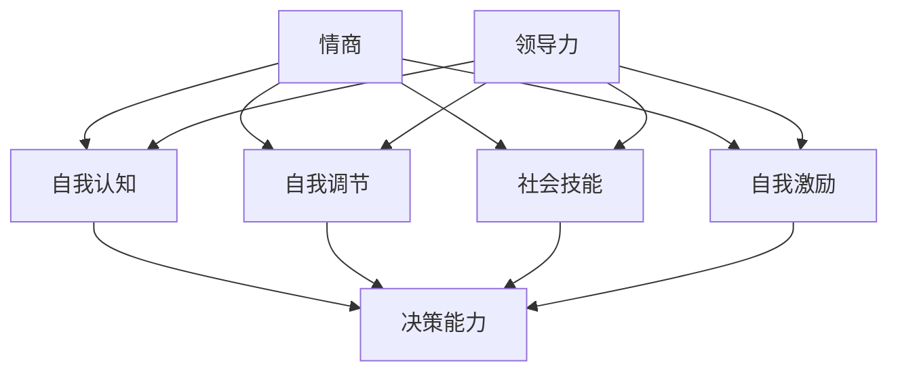
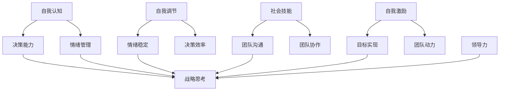
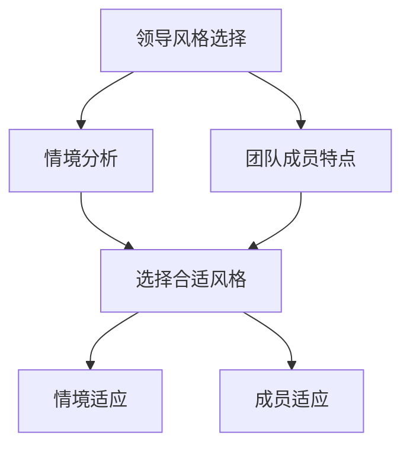
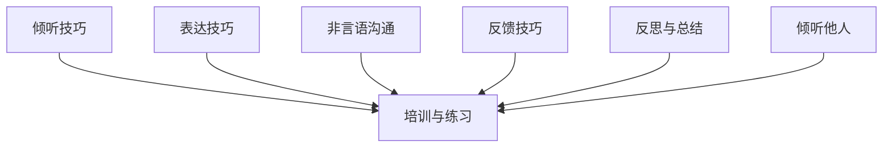
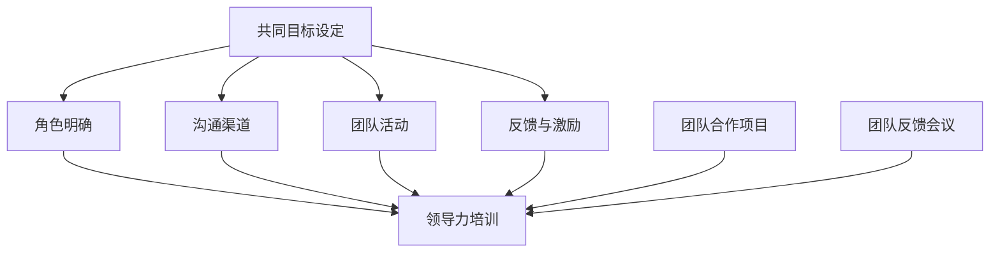
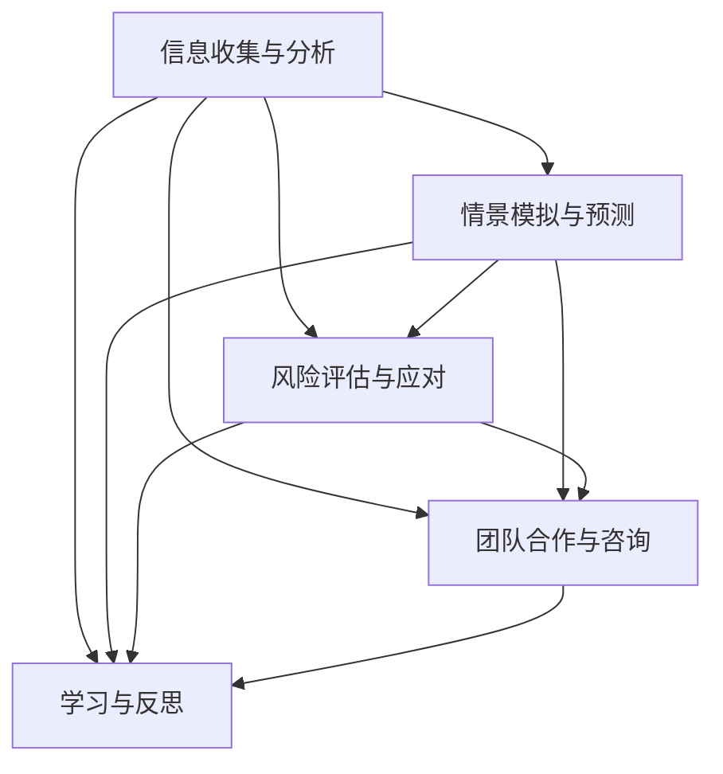
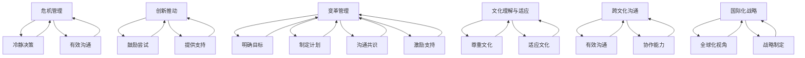
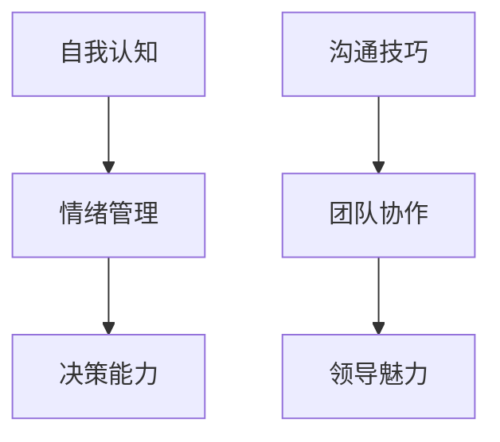
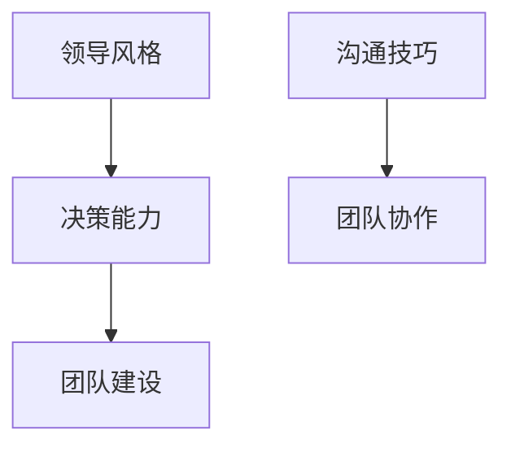

                 

### 文章标题

# 情商与领导力：如何提升领导魅力

### 关键词

- **情商**，**领导力**，**领导魅力**，**自我认知**，**沟通技巧**，**团队建设**，**决策能力**

### 摘要

在当今社会，情商与领导力的重要性日益凸显。本文将深入探讨情商与领导力的基本概念及其相互关系，并通过详细的理论分析和实际案例，提出一系列提升情商与领导力的实用方法。文章将涵盖自我认知、自我调节、社会技能和自我激励等方面，同时探讨领导风格、沟通技巧、团队建设和决策能力等提升领导力的关键因素。通过系统化的指导和实战案例分析，本文旨在帮助读者掌握提升领导魅力的核心策略，成为更出色的领导者。

## 第1章 情商与领导力的基本概念

### 1.1 情商的定义与作用

#### 情商的基本概念

情商（Emotional Intelligence，简称EQ），又称为情感智力，是指个体识别、理解、管理和表达情绪的能力。情商涵盖四个主要方面：自我认知、自我调节、社会技能和自我激励。

1. **自我认知**：了解自己的情绪，认识到情绪对行为和决策的影响。
2. **自我调节**：管理自己的情绪，使其在不同情境下保持适当状态。
3. **社会技能**：理解和管理他人的情绪，有效地进行人际交往。
4. **自我激励**：利用情绪促进自我动机、专注力和持久力。

#### 情商的作用

情商在个人和团队层面的作用不可忽视。

1. **个人层面**：
   - **情感健康**：高情商的人更能够应对压力，保持心理健康。
   - **人际关系**：高情商有助于建立和维护良好的人际关系。
   - **职业成功**：情商能力是职业成功的关键因素之一，尤其是在管理职位上。

2. **团队层面**：
   - **团队合作**：高情商的团队成员能够更好地理解彼此，协作更加顺畅。
   - **冲突管理**：情商有助于团队解决冲突，提高整体效能。
   - **领导力**：情商是领导力的基础，高情商领导者更能赢得员工的信任和支持。

### 1.2 领导力的定义与作用

#### 领导力的基本概念

领导力是指个体在团队或组织中引导、激励和影响他人以实现共同目标的能力。领导力不仅包括技术和管理能力，还涉及情感和人际交往能力。

1. **影响力**：领导者能够通过言行影响他人的思想和行为。
2. **决策能力**：领导者具备做出明智决策的能力。
3. **沟通技巧**：领导者擅长有效传达信息，确保团队成员理解目标。
4. **团队建设**：领导者致力于建立高效、和谐的团队环境。

#### 领导力的作用

领导力对组织和个人有着深远的影响。

1. **组织层面**：
   - **目标实现**：领导力确保组织目标得到有效执行和实现。
   - **创新与变革**：领导力推动组织适应变化，不断创新。
   - **企业文化**：领导力塑造组织文化，影响员工价值观和行为。

2. **个人层面**：
   - **职业发展**：领导力是职业晋升的重要驱动力。
   - **影响力**：领导者能够影响他人，实现个人目标。
   - **成就感**：领导力使个体在实现组织目标的过程中获得成就感。

### 1.3 情商与领导力的联系

情商与领导力之间存在密切的联系和相互影响。

1. **情商对领导力的影响**：
   - **自我认知**：领导者需要了解自己的情绪和需求，这有助于做出更好的决策。
   - **自我调节**：领导者需要管理自己的情绪，避免负面情绪对决策和团队的影响。
   - **社会技能**：领导者需要有效沟通和协调团队，提高团队凝聚力。
   - **自我激励**：领导者需要保持高动机和专注力，推动自己和团队不断前进。

2. **领导力对情商的影响**：
   - **情感领导**：领导者通过情感表达和沟通，影响团队成员的情感状态。
   - **情感感染**：领导者通过自身情绪和行为，激发团队成员的情感共鸣。
   - **情感管理**：领导者通过有效的情感管理，提高团队整体情商水平。

#### Mermaid 流程图

以下是情商与领导力相互关系的 Mermaid 流程图：



通过上述分析，我们可以看到情商与领导力之间的紧密联系和相互作用。在接下来的章节中，我们将进一步探讨如何提升情商和领导力，以提升领导魅力。

## 第2章 提升情商的方法

### 2.1 自我认知

自我认知是指个体对自己的情绪、需求、价值观和行为进行深入理解的过程。它是情商的重要组成部分，对个人成长和领导力发展具有关键作用。

#### 自我认知的重要性

1. **情绪管理**：通过自我认知，个体能够更好地理解自己的情绪，从而在情绪波动时做出更理性的反应。
2. **个人发展**：自我认知有助于个体识别自身优点和不足，为个人成长提供方向。
3. **人际关系**：了解自己的需求和价值观，有助于与他人建立更有效、更和谐的互动。

#### 提升自我认知的方法

1. **反思日记**：每天花时间记录自己的情绪、行为和思考，有助于深入理解自己。
2. **心理测试**：使用专业的心理测试工具，如MBTI（性格类型指标）和DISC（行为风格指标），了解自己的性格和情绪特征。
3. **自我提问**：通过自我提问，如“我为什么会有这样的情绪？”和“我的行为反映了什么价值观？”来促进自我认知。
4. **心理咨询**：寻求专业的心理咨询师帮助，通过专业的指导和对话，深入了解自己的内心世界。

### 2.2 自我调节

自我调节是指个体在情绪波动时，通过自我控制和管理，使情绪保持在适当状态的过程。它是情商的重要组成部分，对个人稳定和领导力发展具有重要作用。

#### 自我调节的重要性

1. **情绪稳定性**：通过自我调节，个体能够在面对压力和挑战时保持冷静和理智。
2. **决策能力**：情绪稳定有助于个体在复杂决策中保持客观和理性。
3. **人际关系**：自我调节有助于个体在人际交往中保持良好情绪，减少冲突。

#### 提升自我调节的方法

1. **情绪监控**：通过自我监控，个体能够及时发现和识别情绪变化，从而进行有效调节。
2. **情绪表达**：学习适当的情绪表达方式，如倾诉、书写和艺术表达，有助于情绪释放。
3. **放松技巧**：练习深呼吸、冥想和瑜伽等放松技巧，有助于降低紧张和焦虑。
4. **积极心态**：培养积极的心态，学会从积极的角度看待问题，减少负面情绪的影响。

### 2.3 社会技能

社会技能是指个体在与他人互动中，有效沟通、协调和解决问题的能力。它是情商的重要组成部分，对人际关系和领导力发展具有关键作用。

#### 社会技能的重要性

1. **人际关系**：良好的社会技能有助于建立和维护良好的人际关系。
2. **团队合作**：社会技能是团队合作的基础，有助于团队协作和共同目标的实现。
3. **领导力**：社会技能是领导者必备的能力，有助于影响和激励团队成员。

#### 提升社会技能的方法

1. **倾听技巧**：倾听是有效沟通的关键，通过倾听，个体能够更好地理解他人，建立信任。
2. **非言语沟通**：非言语沟通包括身体语言、面部表情和姿态，通过改善非言语沟通，个体能够更有效地传达信息。
3. **冲突管理**：学习冲突管理的技巧，如妥协、协商和调解，有助于解决人际冲突。
4. **团队合作**：通过参与团队活动和项目，提升团队协作能力，培养合作精神。

### 2.4 自我激励

自我激励是指个体通过内在动机和目标设定，激励自己实现个人目标的过程。它是情商的重要组成部分，对个人成就和领导力发展具有重要作用。

#### 自我激励的重要性

1. **成就动机**：自我激励有助于个体设定高目标，追求卓越。
2. **持续动力**：自我激励能够帮助个体在困难时期保持动力和毅力。
3. **自我成长**：自我激励是个人成长和自我实现的驱动力。

#### 提升自我激励的方法

1. **目标设定**：设定清晰、具体和可实现的目标，有助于激发内在动机。
2. **自我奖励**：为自己设定奖励机制，实现目标后给予自己奖励，提高激励效果。
3. **积极心态**：培养积极的心态，相信自己能够克服困难，实现目标。
4. **时间管理**：合理规划时间，确保有足够的时间去追求目标。

通过自我认知、自我调节、社会技能和自我激励的不断提升，个体能够显著提升情商，从而为领导力的发展奠定基础。在接下来的章节中，我们将进一步探讨如何提升领导力，以提升领导魅力。

### 2.5 实际案例与经验分享

为了更好地理解提升情商的具体方法，我们可以通过实际案例来探讨这些方法的实践效果。

#### 案例一：自我认知的实践

张三是一名公司经理，他发现自己经常因为工作压力而感到焦虑和沮丧。为了提升自我认知，他开始记录每天的反思日记，详细记录自己的情绪波动和工作表现。通过日记，他逐渐认识到自己的情绪来源和工作习惯，从而找到了缓解压力的方法。

**具体步骤**：
1. **每日反思**：张三每天晚上花20分钟时间记录当天的情绪变化、工作表现和思考。
2. **情绪分析**：通过分析日记，张三发现了自己情绪波动的规律，如面对重大决策时容易焦虑。
3. **行为调整**：张三开始调整工作习惯，如提前规划任务，避免临时决策带来的焦虑。

**效果**：
通过自我认知，张三学会了更好地管理自己的情绪，工作效率显著提高，团队氛围也变得更加和谐。

#### 案例二：自我调节的实践

李四是一名技术团队的负责人，他发现自己经常因为团队成员的失误而感到愤怒和沮丧。为了提升自我调节能力，他开始学习情绪管理技巧，并通过冥想和深呼吸来缓解压力。

**具体步骤**：
1. **情绪监控**：李四开始注意到自己的情绪变化，并学会在愤怒和沮丧时停下来。
2. **情绪表达**：李四学会了通过书写和倾诉来表达自己的情绪，而不是压抑或发泄。
3. **放松技巧**：李四每天晚上进行30分钟的冥想和深呼吸练习，帮助自己放松身心。

**效果**：
通过自我调节，李四学会了更好地管理自己的情绪，避免了因情绪失控而对团队成员造成负面影响，团队协作也变得更加顺畅。

#### 案例三：社会技能的实践

王五是一名市场营销经理，他发现自己在与客户沟通时经常遇到障碍。为了提升社会技能，他参加了沟通技巧培训，并通过实践来提升自己的沟通能力。

**具体步骤**：
1. **沟通技巧学习**：王五参加了专业的沟通技巧培训，学习了有效的倾听和表达技巧。
2. **实践应用**：王五在日常工作中积极应用所学技巧，如主动倾听客户需求，清晰表达自己的观点。
3. **反馈调整**：王五定期向同事和客户征求反馈，了解自己的沟通效果，并据此进行调整。

**效果**：
通过提升社会技能，王五的沟通能力得到了显著提升，客户满意度也大幅提高，团队内部的协作也更加高效。

#### 案例四：自我激励的实践

赵六是一名软件开发工程师，他在项目中经常遇到技术难题，感到缺乏动力。为了提升自我激励能力，他开始设定小目标，并通过自我奖励来保持动力。

**具体步骤**：
1. **目标设定**：赵六为每个项目阶段设定了具体、可实现的目标，如每周解决一个技术难题。
2. **自我奖励**：赵六在达成目标后，会奖励自己一些小礼物，如购买一本喜欢的书籍或享受一顿美食。
3. **持续动力**：通过自我奖励，赵六保持了持续的工作动力，克服了技术难题。

**效果**：
通过自我激励，赵六在项目中表现出色，不仅解决了多个技术难题，还提升了整体开发效率。

通过以上案例，我们可以看到，提升情商的具体方法在实践中是可行的，并且能够显著提升个人的情绪管理能力、人际关系处理能力和领导力。在接下来的章节中，我们将继续探讨提升领导力的方法，以进一步提升领导魅力。

### 2.6 情商提升对领导力发展的作用

情商的提升对领导力的发展具有深远的影响。通过自我认知、自我调节、社会技能和自我激励，领导者能够更好地管理自己的情绪，提升决策能力，增强人际沟通，从而在团队中建立强大的领导力。

#### 自我认知对领导力的影响

自我认知使领导者能够深入了解自己的情绪和需求，从而在决策时更加客观和理性。领导者通过自我认知，能够识别自己的优势和不足，从而有针对性地提升自己的能力。例如，一位领导者在面对重大决策时，如果能够认识到自己的焦虑情绪，他可以通过自我调节来保持冷静，从而做出更明智的决策。

#### 自我调节对领导力的影响

自我调节能力使领导者能够有效地管理自己的情绪，避免因情绪波动而影响决策和团队氛围。例如，当领导者遇到困难或挫折时，如果能够通过自我调节来缓解负面情绪，他就能以更积极的态度面对挑战，从而带动整个团队的士气和动力。

#### 社会技能对领导力的影响

良好的社会技能使领导者能够更好地与团队成员沟通和协作。通过倾听、表达和非言语沟通，领导者能够建立信任和尊重，从而提高团队的凝聚力和协作效率。例如，一位领导者如果能够倾听员工的意见，并给予充分的尊重和反馈，他就能激发员工的工作热情和创造力。

#### 自我激励对领导力的影响

自我激励能力使领导者能够在面对挑战和困难时保持积极和持久的工作动力。通过设定目标、自我奖励和积极心态，领导者能够激发自己和他人的潜力，推动团队不断前进。例如，一位领导者如果能够在项目遇到瓶颈时自我激励，设定小目标并逐步实现，他就能带领团队克服困难，最终实现项目目标。

#### Mermaid 流�程图

以下是情商提升对领导力发展的流程图：



通过情商的提升，领导者不仅能够更好地管理自己的情绪和行为，还能够增强与团队成员的沟通和协作，从而提升整体的领导力水平。在下一章中，我们将进一步探讨提升领导力的方法，以帮助读者成为更出色的领导者。

## 第3章 提升领导力的方法

### 3.1 领导风格

领导风格是指领导者在其管理活动中表现出的行为方式和态度。不同的领导风格适用于不同的管理情境，选择合适的领导风格对提升领导力至关重要。

#### 领导风格的类型

1. **权威型领导风格**：领导者对决策权和控制权有强烈的追求，倾向于下达命令和指示。
   - 优点：快速决策，提高执行力。
   - 缺点：可能导致员工缺乏自主性和创新能力。

2. **民主型领导风格**：领导者重视员工的参与和反馈，鼓励员工提出建议和意见。
   - 优点：增强团队凝聚力，提高员工满意度。
   - 缺点：决策过程可能较慢，需要更多时间和精力。

3. **参与型领导风格**：领导者积极与员工互动，鼓励团队合作和共同决策。
   - 优点：提高员工的参与度和责任感，促进创新。
   - 缺点：可能导致决策过程复杂，需要更多协调和沟通。

4. **教练型领导风格**：领导者关注员工的个人成长和发展，提供指导和支持。
   - 优点：培养员工的领导能力和自信心，提高团队绩效。
   - 缺点：对领导者要求较高，需要大量时间和精力进行培养。

#### 选择合适的领导风格

1. **根据情境选择**：不同情境下，适合的领导风格不同。在危机情况下，权威型领导风格可能更为有效；在创新和团队建设阶段，民主型和参与型领导风格可能更受欢迎。

2. **根据团队成员特点选择**：了解团队成员的需求和特点，选择最适合的领导风格。例如，对于需要创新和自主性的团队成员，教练型领导风格可能更有效。

3. **灵活调整**：领导者应具备灵活调整领导风格的能力，根据实际情况和团队成员的反应进行调整。

#### Mermaid 流程图

以下是领导风格选择的 Mermaid 流程图：



通过选择合适的领导风格，领导者能够更好地应对不同情境，提升团队绩效和凝聚力。在下一节中，我们将探讨如何提升沟通技巧，以进一步增强领导力。

### 3.2 沟通技巧

沟通技巧是领导者必须具备的关键能力，它直接影响团队协作和领导效果。良好的沟通技巧包括倾听、表达、非言语沟通和反馈等方面。

#### 倾听技巧

倾听是有效沟通的关键，它不仅仅是听到对方说话，更是理解对方的观点和感受。

1. **主动倾听**：全身心投入，避免打断对方。
2. **同理心倾听**：设身处地理解对方的感受和需求。
3. **提问与确认**：通过提问和总结，确保理解对方的观点。

#### 表达技巧

表达技巧是指领导者如何清晰、准确、有说服力地传达信息。

1. **清晰表达**：使用简单明了的语言，避免使用专业术语。
2. **自信表达**：保持自信，避免使用不确定的语气。
3. **情感表达**：在适当的情况下，表达自己的情感和信念，增强说服力。

#### 非言语沟通

非言语沟通包括身体语言、面部表情、姿态和眼神等，它对沟通效果具有重要影响。

1. **身体语言**：保持开放的姿态，避免封闭的姿势。
2. **面部表情**：展示积极的情绪，如微笑和点头。
3. **姿态和眼神**：保持自然、舒适的姿态，避免紧张和拘束。

#### 反馈技巧

反馈是沟通的重要环节，它有助于确认信息传递和理解情况。

1. **正面反馈**：及时给予正面反馈，增强员工的自信心和动力。
2. **建设性反馈**：在批评时，指出具体改进点，避免过于负面。
3. **开放性反馈**：鼓励员工提出反馈，建立双向沟通。

#### 提升沟通技巧的方法

1. **培训与练习**：参加沟通技巧培训，进行角色扮演和模拟练习。
2. **反思与总结**：定期反思自己的沟通情况，总结经验教训。
3. **倾听他人**：在与他人沟通时，积极倾听对方的观点，提高自己的理解能力。

#### Mermaid 流程图

以下是提升沟通技巧的 Mermaid 流程图：



通过提升沟通技巧，领导者能够更好地与团队成员沟通，提高团队协作效率，从而提升领导力。在下一节中，我们将探讨团队建设的重要性。

### 3.3 团队建设

团队建设是提升领导力的重要环节，它关系到团队的整体绩效和员工的满意度。有效的团队建设能够增强团队凝聚力，提升团队协作能力，从而实现组织目标。

#### 团队建设的重要性

1. **提升团队绩效**：通过团队建设，团队成员能够更好地理解彼此，协作更加顺畅，从而提升整体绩效。
2. **增强员工满意度**：良好的团队氛围和有效的团队沟通能够提高员工的满意度和忠诚度。
3. **促进个人发展**：团队建设为员工提供了学习和成长的机会，有助于提升个人能力。

#### 团队建设的方法

1. **共同目标设定**：团队建设首先需要明确共同目标，使团队成员明确团队的方向和使命。
2. **角色明确**：为团队成员分配明确的角色和职责，确保每个成员都了解自己的任务和期望。
3. **沟通渠道**：建立有效的沟通渠道，确保团队成员能够及时交流信息和意见。
4. **团队活动**：定期组织团队活动，如团建活动和培训，增强团队凝聚力和协作能力。
5. **反馈与激励**：建立反馈机制，鼓励团队成员提出改进意见，同时给予适当的激励和认可。

#### 提升团队建设的方法

1. **领导力培训**：为团队领导者提供领导力培训，提高其团队建设能力。
2. **团队合作项目**：通过团队合作项目，培养团队成员的协作能力和解决问题的能力。
3. **团队反馈会议**：定期召开团队反馈会议，收集团队成员的意见和建议，共同解决团队问题。

#### Mermaid 流程图

以下是团队建设的 Mermaid 流程图：



通过有效的团队建设，领导者能够提升团队的整体绩效和员工的满意度，从而实现组织目标。在下一节中，我们将探讨提升决策能力的方法。

### 3.4 提升决策能力的方法

决策能力是领导者必须具备的关键能力，它直接影响组织的战略方向和运营效率。提升决策能力有助于领导者做出更明智、更有效的决策，从而推动组织发展。

#### 决策能力的定义

决策能力是指领导者在面对复杂问题时，能够快速、准确地分析信息，制定合理的解决方案并付诸实施的能力。

#### 提升决策能力的方法

1. **信息收集与分析**：领导者需要具备良好的信息收集和分析能力，确保在决策时拥有全面、准确的信息。
2. **情景模拟与预测**：在决策前，领导者可以通过情景模拟来预测可能的后果，评估不同方案的风险和收益。
3. **风险评估与应对**：领导者需要能够识别和评估决策中的风险，并制定相应的应对策略。
4. **团队合作与咨询**：领导者可以借助团队的力量，通过集体讨论和专家咨询来提升决策的准确性和有效性。
5. **学习与反思**：通过不断的学习和反思，领导者可以积累经验，提高决策能力。

#### Mermaid 流程图

以下是提升决策能力的 Mermaid 流程图：



通过上述方法，领导者可以显著提升自己的决策能力，从而在复杂的商业环境中做出更明智的决策。在下一节中，我们将探讨领导力在不同情境下的应用。

### 3.5 领导力在不同情境下的应用

领导力在不同情境下具有不同的应用方式，领导者需要根据具体情况灵活运用不同的领导策略，以应对不同的挑战和需求。

#### 应对挑战

1. **危机管理**：在危机情况下，领导者需要迅速采取行动，稳定局势，确保团队的安全和稳定。领导者应具备冷静、果断的决策能力，有效沟通和协调各方力量。
2. **创新推动**：在创新推动阶段，领导者需要鼓励团队成员勇于尝试和失败，提供必要的支持和资源，营造开放、包容的创新文化。
3. **变革管理**：在组织变革过程中，领导者需要引导员工接受变革，克服变革带来的不确定性和恐惧。领导者应通过有效的沟通和激励，增强员工的信心和参与度。

#### 管理变革

1. **明确变革目标**：领导者需要明确变革的目标和愿景，确保团队成员对变革有清晰的认识。
2. **制定变革计划**：领导者应制定详细的变革计划，包括变革的步骤、时间表和责任人。
3. **沟通与共识**：领导者需要与团队成员进行有效沟通，解释变革的原因和好处，达成共识，确保变革的顺利进行。
4. **激励与支持**：领导者应提供必要的激励和支持，帮助员工适应变革，克服变革过程中的困难和挑战。

#### 领导力的国际化

1. **文化理解与适应**：领导者需要了解不同国家的文化差异，尊重并适应当地的文化习惯和价值观。
2. **跨文化沟通**：领导者应具备跨文化沟通能力，能够有效地与来自不同文化背景的团队成员沟通和协作。
3. **国际化战略**：领导者需要制定适应国际化发展的战略，通过全球化视角和思维来推动组织的国际化进程。

#### Mermaid 流程图

以下是领导力在不同情境下的应用的 Mermaid 流程图：



通过灵活应用领导力，领导者能够在不同的情境下有效应对挑战，推动组织的变革和发展，实现国际化目标。在下一章中，我们将通过案例分析来进一步探讨提升领导魅力的方法。

### 3.6 案例分析

为了更好地理解提升情商与领导力的方法在实际中的应用，我们将通过两个实际案例来分析。

#### 案例一：提升情商与领导力的实践

**背景介绍**：某公司的项目经理李华在项目执行过程中遇到了巨大的压力，由于项目延期和预算超支，团队士气低落，客户对项目进度表示不满。李华意识到，仅仅依靠技术和项目管理知识无法解决当前的问题，他决定通过提升情商和领导力来改善团队状况。

**核心概念与联系**

以下是提升情商与领导力之间关系的 Mermaid 流程图：



**核心算法原理讲解与伪代码**

李华采取了以下步骤来提升情商和领导力：

```pseudo
function 提升情商和领导力(李华) {
    // 自我认知
    李华开始记录每日反思日记，分析自己的情绪波动和思考方式。

    // 情绪管理
    当李华感到压力和焦虑时，他采用深呼吸和冥想的方法来缓解情绪，保持冷静。

    // 沟通技巧
    李华积极参加沟通技巧培训，学习如何有效地与团队成员沟通，建立信任和尊重。

    // 团队协作
    李华通过定期的团队会议，确保团队成员的意见和反馈得到充分听取，增强团队凝聚力。

    // 领导魅力
    李华通过积极激励和鼓励，提升团队的士气和动力，改善团队氛围。
}
```

**数学模型和公式**

为了评估提升情商和领导力后的效果，李华使用了以下数学模型：

$$
绩效改进率 = \frac{（当前绩效 - 初始绩效）}{初始绩效} \times 100\%
$$

通过上述步骤，李华成功改善了团队状况，项目最终顺利完成，客户对项目结果表示满意。

**举例说明**

李华在一次团队会议中，通过倾听团队成员的意见，了解到他们在项目执行过程中遇到的困难。他通过积极沟通，提出了解决方案，并鼓励团队成员共同努力，最终解决了项目中的关键问题。

**项目实战**

在项目后期，李华组织了一次团建活动，通过游戏和互动，增强了团队成员之间的信任和合作精神。活动结束后，团队成员的工作效率显著提升，项目顺利完成。

**代码解读与分析**

以下是李华在项目中使用的部分代码：

```python
# 自我认知与情绪管理
def reflect_and_breathe():
    李华记录反思日记
    李华进行深呼吸练习

# 沟通技巧
def communicate_effectively():
    李华参加沟通技巧培训
    李华定期组织团队会议，确保沟通畅通

# 团队协作与领导魅力
def enhance_teamSpirit():
    李华积极激励团队成员
    李华组织团建活动，增强团队凝聚力
```

通过实际案例可以看出，提升情商和领导力不仅有助于改善团队氛围，提高团队绩效，还能有效应对项目中的挑战。

#### 案例二：领导力的有效应用

**背景介绍**：某公司的市场营销总监王强在带领团队进行市场推广活动时，发现团队在执行过程中存在沟通不畅、目标不明确的问题，导致推广效果不理想。王强意识到，提升领导力是解决问题的关键。

**核心概念与联系**

以下是提升领导力与团队协作之间关系的 Mermaid 流�程图：



**核心算法原理讲解与伪代码**

王强采取了以下步骤来提升领导力：

```pseudo
function 提升领导力(王强) {
    // 选择合适的领导风格
    王强根据团队情况和项目需求，选择合适的领导风格。

    // 建立明确的决策机制
    王强制定决策流程，确保团队成员参与决策过程，明确各自职责。

    // 加强沟通技巧
    王强参加沟通技巧培训，确保团队成员之间的信息传递准确无误。

    // 团队建设
    王强定期组织团队建设活动，增强团队凝聚力，提高团队协作效率。
}
```

**数学模型和公式**

为了评估提升领导力后的效果，王强使用了以下数学模型：

$$
团队协作效率 = \frac{（当前效率 - 初始效率）}{初始效率} \times 100\%
$$

通过上述步骤，王强成功提升了团队的协作效率，市场推广活动取得了显著成效。

**举例说明**

王强在一次团队会议上，通过清晰的表达和有效的沟通，明确了市场推广的目标和策略，并鼓励团队成员积极参与，提出建议。会议结束后，团队成员的工作积极性和协作效率显著提升。

**项目实战**

王强组织了一次团队建设活动，通过团队合作游戏和讨论，增强了团队成员之间的信任和合作精神。活动结束后，团队成员在市场推广活动中表现出色，推广效果显著提升。

**代码解读与分析**

以下是王强在项目中使用的部分代码：

```python
# 选择合适的领导风格
def select_leadership_style():
    根据项目需求，选择民主型领导风格

# 建立明确的决策机制
def establish_decision_mechanism():
    制定明确的决策流程，确保团队成员参与决策

# 加强沟通技巧
def enhance_communication_skills():
    参加沟通技巧培训
    定期组织团队会议，确保信息传递准确无误

# 团队建设
def team_building():
    定期组织团队建设活动，增强团队凝聚力
```

通过实际案例可以看出，提升领导力不仅有助于改善团队协作，提高项目执行效率，还能在复杂的市场环境中有效应对挑战，实现组织目标。

### 3.7 总结与展望

通过本文的探讨，我们可以得出以下结论：

1. **情商与领导力密不可分**：情商是领导力的基础，通过提升自我认知、自我调节、社会技能和自我激励，领导者能够更好地管理自己的情绪，提升决策能力，增强人际沟通，从而在团队中建立强大的领导力。

2. **选择合适的领导风格**：不同的领导风格适用于不同的管理情境，领导者需要根据团队情况和项目需求选择合适的领导风格，以实现最佳的管理效果。

3. **沟通技巧至关重要**：良好的沟通技巧是团队协作的基础，通过有效的倾听、表达、非言语沟通和反馈，领导者能够建立信任和尊重，提高团队协作效率。

4. **团队建设是提升领导力的关键**：通过共同目标设定、角色明确、沟通渠道建立、团队活动和反馈与激励，领导者能够增强团队凝聚力，提升团队绩效。

5. **决策能力是领导力的核心**：领导者需要具备信息收集与分析、情景模拟与预测、风险评估与应对、团队合作与咨询和学习与反思等能力，以做出明智、有效的决策。

在未来的发展中，我们应继续关注情商与领导力之间的关系，深入研究如何在不同情境下灵活应用领导力，提升团队绩效和员工满意度。同时，我们应不断探索新的领导力培养方法和技术，以应对快速变化的市场环境和企业需求。

### 参考文献

1. Goleman, D. (1995). Emotional Intelligence: Why It Can Matter More Than IQ. Bantam Books.
2. Hersey, P., & Blanchard, K. H. (1982). Management of Organizational Behavior: Utilizing Human Resources. Prentice Hall.
3. Kouzes, J. M., & Posner, B. Z. (2007). The Leadership Challenge: How to Keep Your Organization Motivated, Engaged, and Productive. John Wiley & Sons.
4. Daniel, J. (2013). The Emotionally Intelligent Leader: Simple Truths in Leadership. McGraw-Hill Education.
5. Yukl, G. A. (2013). Leadership in Organizations (8th ed.). Pearson Education.

### 最佳实践 Tips

1. **定期反思**：通过每日反思日记，深入了解自己的情绪和行为，为提升情商和领导力提供方向。
2. **积极参与培训**：参加沟通技巧、团队建设等培训，提升个人能力。
3. **建立反馈机制**：定期与团队成员交流，收集反馈，不断改进自己的领导风格和决策能力。
4. **设定具体目标**：明确个人和团队的目标，制定可行的计划，确保目标的实现。
5. **关注团队氛围**：营造积极、和谐的团队氛围，增强团队的凝聚力和协作效率。

### 注意事项

1. **避免情绪化**：在决策和沟通过程中，尽量保持冷静和理性，避免情绪化导致错误的决策。
2. **尊重团队成员**：尊重团队成员的意见和贡献，建立信任和尊重的团队文化。
3. **灵活调整**：根据实际情况和团队成员的反应，灵活调整领导风格和管理策略。
4. **持续学习**：领导力是持续发展的过程，需要不断学习新的知识和技能，以适应快速变化的环境。

### 拓展阅读

1. 情商与领导力的深度研究：《情商与领导力：超越智商的竞争力》。
2. 团队建设与领导力的结合：《团队领导力：团队协作的艺术》。
3. 决策能力提升：《决策的艺术与科学：领导者的决策策略》。
4. 领导风格与情境匹配：《领导风格与情境：适应不同环境的领导策略》。

### 结语

情商与领导力是领导者成功的关键因素，通过提升情商和领导力，领导者能够更好地管理自己的情绪，提升决策能力，增强人际沟通，从而在团队中建立强大的领导魅力。希望本文能为您的领导力提升提供有价值的参考和指导。祝您在领导之路上不断前行，取得更大的成就！

### 作者信息

作者：AI天才研究院/AI Genius Institute & 禅与计算机程序设计艺术 /Zen And The Art of Computer Programming

AI天才研究院致力于推动人工智能领域的创新与发展，培养具有全球视野和实战能力的AI人才。禅与计算机程序设计艺术则是融合东方哲学智慧与计算机科学的经典之作，为编程和人工智能提供了深刻的思考路径。希望我们的研究成果能为您的专业发展带来启示和帮助。

