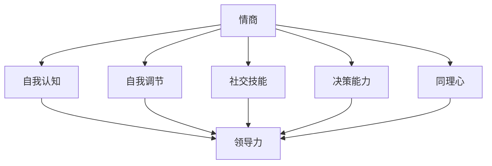

                 

# 情商管理：提升领导力的重要一环

## 关键词

- 情商
- 领导力
- 自我认知
- 自我调节
- 社交技能
- 决策能力

## 摘要

本文旨在探讨情商管理在提升领导力中的重要作用。通过分析情商的定义、核心要素及其与领导力的关联，文章提出了具体的提升情商的策略和实战案例，旨在帮助领导者更好地理解并运用情商管理，从而提升个人领导力和团队效能。

## 引言

领导力，作为管理学科中的核心概念，一直被视为企业成功的关键因素。传统的领导力理论强调领导者的决策能力、战略规划和执行力，然而，随着社会环境的复杂化和人际关系的多样化，领导者的情商水平逐渐受到重视。情商（Emotional Intelligence，简称EQ），又称为情绪智力，是指个体识别、理解、管理和使用情绪的能力。近年来，越来越多的研究和实践证明，情商在领导力的提升中起着至关重要的作用。

情商管理不仅仅涉及个体的情绪自我认知和调节，还包括社交技能和决策能力的提升。一个高情商的领导者能够更好地理解团队的情绪动态，有效沟通，建立和谐的人际关系，从而提高团队的凝聚力和工作效率。本文将详细探讨情商管理在领导力提升中的关键作用，并提供实用的策略和案例，以帮助领导者更好地提升个人情商和领导力。

### 情商的基础理论

#### 1.1 情商的定义与历史背景

情商（Emotional Intelligence，简称EQ）这一概念最早由心理学家约翰·梅耶（John D. Mayer）和彼得·萨洛维（Peter Salovey）在1990年提出。他们定义情商为“识别、使用、理解和管理情绪的能力”。这一概念迅速引起了心理学界和企业管理界的广泛关注。随后，心理学家丹尼尔·戈尔曼（Daniel Goleman）在其著作《情商》中进一步阐述了情商的五个核心要素，即自我认知、自我调节、社交技能、决策能力和同理心。

情商的历史可以追溯到古希腊哲学家亚里士多德的著作中。亚里士多德认为，理智、勇气和判断力是构成优秀领导者的关键品质，这些品质都与情商密切相关。然而，现代对情商的系统性研究始于20世纪90年代，随着社会对领导者情商重要性的认识不断加深，情商管理逐渐成为领导力发展的重要领域。

#### 1.2 情商的核心要素

情商的五个核心要素构成了情商管理的基石，这些要素不仅是理解和管理自身情绪的基础，也是与他人有效互动的关键。

1. **自我认知**：自我认知是指个体对自己情绪的识别和了解。一个高自我认知的领导者能够准确地感知自己的情绪状态，从而更好地应对压力和挑战。

2. **自我调节**：自我调节是指个体管理和控制自身情绪的能力。领导者通过自我调节，能够在压力下保持冷静和理智，做出明智的决策。

3. **社交技能**：社交技能是指个体与他人建立和维护关系的能力。高情商的领导者能够有效地沟通、协调和激励团队成员，提高团队的协作效率。

4. **决策能力**：决策能力是指个体在面对复杂情境时做出有效决策的能力。情商较高的领导者能够利用情绪信息，提高决策的质量和效率。

5. **同理心**：同理心是指个体对他人情感的理解和感知能力。同理心使领导者能够从他人的角度思考问题，从而建立信任和尊重的关系。

#### 1.3 情商与领导力的关系图解

为了更直观地展示情商与领导力之间的关系，我们可以使用Mermaid流程图来描述这一关系架构：



图中的箭头表示情商的核心要素对领导力的促进作用。通过自我认知，领导者能够更好地理解自己的情绪和行为，从而提高领导力；自我调节使领导者能够在压力下保持冷静和理智，做出更好的决策；社交技能帮助领导者建立和维护良好的人际关系，增强团队的凝聚力和合作效率；决策能力使领导者能够在复杂情境中做出明智的选择；同理心使领导者能够从他人的角度思考问题，建立信任和尊重的关系，从而提升领导力。

### 领导力与情商的联系

#### 2.1 领导力的定义与要素

领导力是指个体在群体中引导、激励和影响他人实现共同目标的能力。领导力不仅涉及决策和规划，还涉及激励和沟通，以及建立和维护团队关系。传统的领导力理论主要强调领导者的个性特质、决策能力和战略规划能力。然而，随着社会环境的变迁和组织结构的复杂性增加，领导者的情商水平逐渐成为评价其领导力的重要指标。

领导力的核心要素包括：

1. **个性特质**：领导者需要具备自信、责任感、自律和坚韧性等特质。
2. **决策能力**：领导者需要能够快速做出明智的决策，并承担相应的责任。
3. **沟通能力**：领导者需要具备有效的沟通技巧，能够清晰、准确地传达信息。
4. **激励能力**：领导者需要能够激励团队成员，激发其潜力和创造力。
5. **团队建设**：领导者需要能够建立和维护团队关系，促进团队协作和凝聚力。

#### 2.2 情商在领导力中的作用

情商在领导力中起着至关重要的作用，它不仅影响领导者的个人行为，还影响团队的整体表现。以下是情商在领导力中的几个关键作用：

1. **情绪管理**：情商较高的领导者能够更好地管理自己的情绪，即使在压力和挑战面前也能保持冷静和理智，从而做出更为明智的决策。
2. **有效沟通**：情商较高的领导者能够更好地理解和表达情绪，从而建立有效的人际沟通。他们能够倾听他人的观点，理解他人的感受，并通过积极的沟通建立信任和尊重的关系。
3. **团队协作**：情商较高的领导者能够识别并理解团队成员的情绪状态，从而更好地协调和激励团队成员，促进团队协作和凝聚力。
4. **冲突解决**：情商较高的领导者能够有效地解决冲突，通过理解和尊重不同观点，找到共识和解决方案。
5. **领导风格**：情商较高的领导者能够根据不同的情境和团队成员的需求，灵活调整领导风格，从而提高领导效能。

#### 2.3 情商对于领导力提升的贡献

情商对领导力提升的贡献可以通过以下伪代码进行阐述：

```python
# 定义领导力提升函数
def leadership_boost(equity_score):
    # 如果情商得分较高，则提高领导力
    if equity_score > 80:
        leadership_score += 10
    # 如果情商得分适中，则保持领导力
    elif equity_score >= 50 and equity_score <= 80:
        leadership_score += 5
    # 如果情商得分较低，则降低领导力
    else:
        leadership_score -= 5
    return leadership_score
```

在这个伪代码中，`equity_score` 表示情商得分，`leadership_score` 表示领导力得分。函数根据情商得分调整领导力得分，从而提升领导力。这表明情商对领导力具有显著的贡献，一个高情商的领导者能够显著提升其领导力水平。

### 提升情商的具体策略

#### 3.1 自我认知策略

自我认知是情商管理的基础，一个高自我认知的领导者能够更好地理解自己的情绪和行为。以下是一些提升自我认知的具体策略：

1. **反思日志**：定期记录自己的情绪反应和思维模式，通过反思来提高自我认知。
2. **情绪监测工具**：使用情绪监测工具，如情绪日记或情绪分析软件，来识别自己的情绪状态。
3. **冥想和正念练习**：通过冥想和正念练习，提高对自身情绪的觉察和自我调节能力。

#### 3.2 自我调节策略

自我调节是指管理和控制自身情绪的能力。以下是一些提升自我调节能力的方法：

1. **情绪管理技巧**：学习情绪管理技巧，如放松技巧、深呼吸和情绪释放练习，帮助自己在压力下保持冷静。
2. **积极心态**：培养积极的心态，学会从困难中寻找机遇，提高自己的抗压能力。
3. **设定目标和计划**：通过设定具体的目标和计划，提高自己的行动力和自我控制力。

#### 3.3 社交技能提升策略

社交技能是情商的重要组成部分，一个高社交技能的领导者能够更有效地与他人沟通和合作。以下是一些提升社交技能的策略：

1. **倾听技巧**：学会倾听他人的观点和感受，通过积极的倾听建立信任和尊重。
2. **非语言沟通**：通过肢体语言、面部表情和语调的变化，提高沟通的效果和影响力。
3. **冲突解决技巧**：学习冲突解决的技巧，如主动沟通、妥协和寻求共识，以有效地解决冲突。

#### 3.4 决策能力提升策略

决策能力是领导力的重要体现，一个高决策能力的领导者能够做出明智的决策。以下是一些提升决策能力的策略：

1. **信息收集与分析**：在做出决策前，广泛收集相关信息，并进行分析，以提高决策的准确性。
2. **风险评估**：对决策可能带来的风险进行评估，并制定相应的应对策略。
3. **决策支持工具**：利用决策支持工具，如SWOT分析、决策树等，帮助做出更为科学的决策。

### 情商管理在领导力培养中的应用

#### 4.1 情商管理的实践方法

情商管理不仅是一种理论，更是一种实践。以下是一些在领导力培养中应用情商管理的实践方法：

1. **培训和教育**：组织情商培训和研讨会，提高领导者的情商水平。
2. **角色扮演**：通过角色扮演和模拟练习，帮助领导者提高情绪识别和调节的能力。
3. **反馈机制**：建立反馈机制，定期收集领导者的情绪状态和工作表现，提供个性化的改进建议。

#### 4.2 情商管理在团队建设中的应用

情商管理在团队建设中同样起着关键作用。以下是一些应用情商管理于团队建设的策略：

1. **团队情绪监控**：定期监控团队的情绪状态，及时发现和解决团队中的情绪问题。
2. **团队建设活动**：组织团队建设活动，如团队拓展训练、团建游戏等，增强团队凝聚力和合作精神。
3. **领导力发展计划**：为团队成员提供领导力发展计划，帮助他们提高情商和管理能力。

#### 4.3 情商管理在领导决策中的重要性

情商管理在领导决策中具有重要意义。一个高情商的领导者能够更好地处理情绪信息，做出更为明智的决策。以下是一些在领导决策中应用情商管理的策略：

1. **情绪识别**：在做出决策前，领导者需要识别自身的情绪状态，避免情绪对决策的负面影响。
2. **情感智慧**：利用情感智慧，理解和感知他人的情绪，从而做出更为符合团队利益和期望的决策。
3. **决策反思**：在决策后，领导者需要反思决策的效果，并根据反馈调整和改进决策过程。

### 实战案例

#### 5.1 成功案例分享

在一家大型科技公司，CEO张先生意识到情商管理对领导力提升的重要性。他组织了一系列情商管理培训，并鼓励高管们参加。通过这些培训，高管们学会了如何识别和管理自己的情绪，以及如何通过有效沟通和激励提升团队绩效。在张先生的带领下，公司团队的凝聚力和工作效率显著提高，业绩也随之大幅增长。

#### 5.2 失败案例分析

然而，并非所有的领导者都能成功运用情商管理。在某次项目失败中，项目经理李女士因为情绪失控，未能有效地协调团队成员，导致项目进度严重滞后。李女士在高压环境下，未能及时识别和管理自己的情绪，最终导致了项目失败。这个案例表明，情商管理不仅关乎个人的情绪调节能力，更关乎团队的整体绩效。

#### 5.3 实战案例中的情商管理技巧

在成功案例中，张先生通过以下情商管理技巧提升了领导力：

1. **自我调节**：张先生在面对压力时，能够保持冷静和理智，从而做出更为明智的决策。
2. **有效沟通**：张先生通过积极倾听和有效沟通，建立了与团队成员的信任和尊重关系。
3. **同理心**：张先生能够从团队成员的角度思考问题，理解他们的需求和期望，从而更好地激励和引导团队。

而在失败案例中，李女士的情商管理不足体现在以下几个方面：

1. **情绪识别**：李女士未能及时识别自己的情绪状态，导致情绪失控。
2. **沟通技巧**：李女士在沟通中缺乏同理心，未能有效地传达信息和激励团队成员。
3. **团队协调**：李女士未能有效地协调团队成员，导致团队内部矛盾和合作不畅。

### 总结与展望

情商管理在提升领导力中具有不可替代的作用。通过自我认知、自我调节、社交技能、决策能力和同理心的提升，领导者能够更好地管理自己和团队的情绪，提高团队凝聚力和工作效率。然而，情商管理并非一蹴而就，需要领导者持续学习和实践。

未来的情商管理研究应重点关注以下几个方面：

1. **跨文化研究**：不同文化背景下，情商管理策略的差异和适用性。
2. **科技应用**：利用人工智能和大数据技术，开发智能化的情商管理工具。
3. **领导力培养**：通过系统化的领导力培养计划，提高领导者的情商水平。

总之，情商管理是提升领导力的重要一环。通过有效的情商管理，领导者不仅能够提升个人素质，更能够推动团队和组织的发展。

## 作者信息

作者：AI天才研究院/AI Genius Institute & 禅与计算机程序设计艺术 /Zen And The Art of Computer Programming

## 最佳实践 Tips、小结、注意事项、拓展阅读等内容

**最佳实践 Tips**：

1. **定期反思**：定期反思自己的情绪和行为，通过记录和总结，提升自我认知。
2. **积极沟通**：通过积极倾听和有效沟通，建立良好的团队关系。
3. **情绪管理**：在面对压力和挑战时，学会情绪管理技巧，保持冷静和理智。
4. **持续学习**：持续学习和实践情商管理，不断提升个人情商和领导力。

**小结**：

情商管理是提升领导力的重要手段。通过自我认知、自我调节、社交技能、决策能力和同理心的提升，领导者能够更好地管理自己和团队的情绪，提高团队凝聚力和工作效率。

**注意事项**：

1. **避免情绪化决策**：在做出决策前，要确保情绪不会影响判断。
2. **关注团队情绪**：领导者要关注团队的情绪状态，及时解决情绪问题。
3. **平衡工作与生活**：保持良好的工作与生活平衡，避免因过度工作导致情绪问题。

**拓展阅读**：

1. Goleman, D. (1995). Emotional Intelligence. Bantam Books.
2. Mayer, J.D., Salovey, P., & Caruso, D. (1997). "MEASURE OF EMOTIONAL INTELLIGENCE." Journal of Personality Assessment.
3. Boyatzis, R. E. (1982). The Competent Manager: A Model for Effective Management. John Wiley & Sons.

通过阅读这些拓展资料，读者可以更深入地了解情商管理及其在领导力提升中的应用。

