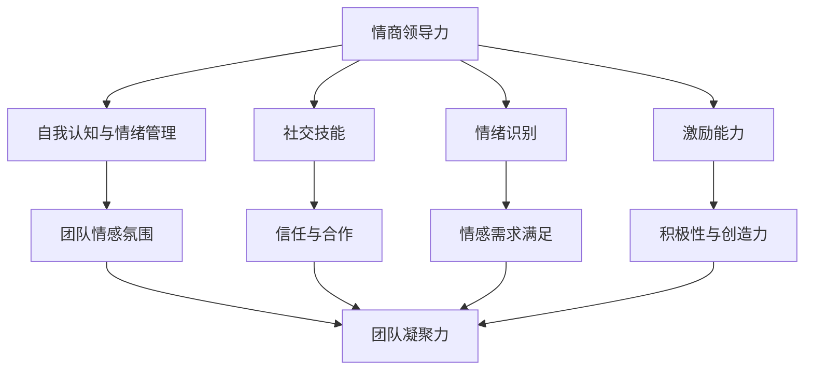

                 

### 文章标题

# 情商领导力：提升团队凝聚力的关键因素

### 关键词

- 情商领导力
- 团队凝聚力
- 有效沟通
- 冲突管理
- 情绪识别
- 自我认知
- 领导力发展

### 摘要

本文深入探讨了情商领导力在提升团队凝聚力中的关键作用。通过分析情商的定义与类型，本文阐述了情商领导力的基础及其在团队中的作用机制。随后，本文详细介绍了提升情商领导力的方法，包括自我认知与情绪管理、情绪识别与表达、有效沟通策略等。此外，本文还讨论了团队凝聚力的重要性、构成要素及其对团队绩效的影响。基于这些理论，本文提出了提升团队凝聚力的策略，包括建立共同目标、促进团队互动与合作、处理团队冲突等。通过实际案例与经验分享，本文提供了具体实用的方法和技巧。文章最后总结了情商领导力在提升团队凝聚力中的重要性，并展望了未来领导力发展的趋势。

### 引言

在当今快速变化的商业环境中，领导力成为企业成功的关键因素之一。传统的领导力理论侧重于战略规划、目标设定和执行力，但这些方面无法完全解释团队在复杂多变的市场中取得成功的原因。近年来，情商领导力逐渐成为学术界和实务界关注的热点，被认为是提升团队凝聚力、激发员工潜能、实现组织目标的关键。情商领导力不仅关注领导者个人能力，还强调领导者与团队成员之间的情感互动和关系建立。

团队凝聚力是团队效能的核心因素之一。一个凝聚力强的团队能够更有效地分工协作、共同面对挑战，从而提高整体绩效。然而，提升团队凝聚力并非易事，需要领导者具备较高的情商，通过有效的沟通、冲突管理和情绪识别来增强团队成员之间的信任和合作。

本文旨在深入探讨情商领导力在提升团队凝聚力中的关键作用，分析其核心概念与联系，并介绍提升情商领导力的关键方法。通过实际案例与经验分享，本文希望能够为企业管理者和领导者提供实用的指导，帮助他们在复杂多变的商业环境中打造高凝聚力的团队。

### 核心概念与联系

#### 情商的定义与类型

情商（Emotional Intelligence，简称EQ）是一种理解、管理和运用情绪的能力。Goleman（1995）将情商分为五个主要领域：自我认知、自我管理、社交技能、情绪识别和运用情绪。自我认知是指个体对自己的情绪有清晰的认识和了解；自我管理则是指个体能够调节和掌控自己的情绪，避免情绪冲动；社交技能是指个体在与他人互动中能够建立和维护良好关系的能力；情绪识别是指个体能够识别和理解自己和他人的情绪；情绪运用则是指个体能够有效地运用情绪来促进决策和创造力。

#### 情商领导力的定义与特征

情商领导力是指领导者利用情商能力来引导和管理团队的过程。它与传统的领导力不同，不仅关注任务完成和目标达成，更重视团队的情感氛围和成员之间的互动。情商领导力的特征包括：

1. **自我认知与情绪管理**：领导者能够了解自己的情绪，并有效地管理这些情绪，以保持冷静和理性。
2. **社交技能**：领导者擅长与他人沟通和协作，能够建立和维护良好的团队关系。
3. **情绪识别**：领导者能够识别和理解团队成员的情绪，从而更好地应对各种情况和挑战。
4. **激励能力**：领导者能够激励团队成员，激发他们的潜能，提升团队士气。

#### 情商领导力与团队凝聚力

情商领导力在提升团队凝聚力中起着关键作用。首先，情商领导力通过有效的沟通和情绪管理，能够减少团队成员之间的误解和冲突，增强信任和合作。其次，情商领导力能够帮助领导者识别和满足团队成员的情感需求，提高团队的归属感和认同感。最后，情商领导力通过激励能力和社交技能，能够激发团队成员的积极性和创造力，提升团队的整体绩效。

为了更好地理解情商领导力与团队凝聚力的关系，我们引入Mermaid流程图（见下图），展示它们之间的相互作用和影响。



通过这个流程图，我们可以看到情商领导力的各个维度如何相互作用，共同提升团队凝聚力。自我认知与情绪管理有助于建立积极的团队情感氛围；社交技能和情绪识别能够增强团队成员之间的信任和合作；激励能力则能够激发团队成员的积极性和创造力，从而增强团队的整体凝聚力。

### 核心算法原理讲解

提升情商领导力，关键在于掌握和应用一系列核心算法原理。这些原理不仅帮助领导者更好地理解和管理情绪，还能提升团队凝聚力和整体绩效。以下将详细阐述这些核心算法原理，并通过伪代码和数学模型进行讲解。

#### 1. 自我认知与情绪管理

**核心算法原理**：自我认知是情商领导力的基础，领导者需要通过自我反思和情绪监控来认识和管理自己的情绪。

**伪代码**：

```python
function 自我认知与情绪管理(领导者):
    while True:
        收集当前情绪状态
        分析情绪状态的原因
        调整情绪策略
        实施情绪调节方法
        评估情绪调节效果
```

**数学模型**：

设`E`为情绪状态，`C`为认知状态，`M`为情绪管理策略。

$$
E = f(C, M)
$$

其中，`f`为情绪调节函数。

#### 2. 情绪识别与表达

**核心算法原理**：情绪识别与表达是指领导者能够识别自己和他人的情绪，并以适当的方式表达出来。

**伪代码**：

```python
function 情绪识别与表达(领导者, 成员):
    识别领导者自身情绪
    识别成员情绪
    根据情绪识别结果，选择适当表达方式
    实施情绪表达
```

**数学模型**：

设`R`为情绪识别能力，`E`为情绪表达效果，`M`为情绪管理策略。

$$
E = g(R, M)
$$

其中，`g`为情绪表达函数。

#### 3. 有效沟通策略

**核心算法原理**：有效沟通是提升团队凝聚力和工作绩效的关键，领导者需要掌握多种沟通策略，以满足不同情境和团队需求。

**伪代码**：

```python
function 有效沟通策略(领导者, 成员):
    根据情境选择沟通方式
    建立开放性沟通渠道
    促进双向沟通
    鼓励反馈与讨论
    调解冲突
```

**数学模型**：

设`C`为沟通效果，`S`为沟通策略，`R`为情境。

$$
C = h(S, R)
$$

其中，`h`为沟通效果函数。

#### 4. 冲突管理

**核心算法原理**：冲突是团队中不可避免的现象，有效的冲突管理能够促进团队成长和进步。

**伪代码**：

```python
function 冲突管理(领导者, 成员):
    识别冲突类型
    分析冲突原因
    选择冲突解决策略
    实施冲突解决
    评估解决效果
```

**数学模型**：

设`C`为冲突，`S`为冲突解决策略，`E`为冲突解决效果。

$$
E = i(C, S)
$$

其中，`i`为冲突解决效果函数。

#### 5. 激励能力

**核心算法原理**：领导者需要具备激励能力，以激发团队成员的积极性和创造力。

**伪代码**：

```python
function 激励能力(领导者, 成员):
    识别成员需求
    设定激励目标
    选择激励策略
    实施激励计划
    评估激励效果
```

**数学模型**：

设`I`为激励，`D`为需求，`E`为激励效果。

$$
E = j(I, D)
$$

其中，`j`为激励效果函数。

通过这些核心算法原理，领导者可以更系统地提升情商领导力，从而提升团队凝聚力和整体绩效。以上伪代码和数学模型为理论指导，实际应用中需要结合具体情境进行调整和优化。

### 数学模型和公式

在情商领导力的研究和实践中，许多数学模型和公式被用来描述和解释各种情感和行为现象。以下将介绍几个常见的数学模型和公式，并提供详细讲解和举例说明。

#### 1. 情绪调节模型

情绪调节模型用于描述个体如何调节和管理自己的情绪。一个常见的模型是“情绪调节路径模型”（Emotion Regulation Pathways Model），它将情绪调节分为三个主要路径：认知调节、行为调节和表达调节。

**公式**：

$$
E_{new} = f(E_{original}, R_{strategy})
$$

其中，`E_{new}`是调节后的情绪状态，`E_{original}`是原始情绪状态，`R_{strategy}`是情绪调节策略。

**举例**：

假设一个领导者（李先生）在会议上得知一个重要项目延期，这引起了他的焦虑情绪。为了调节情绪，他选择进行认知调节，通过理性思考分析延期原因和解决方案。在这种情况下，情绪调节路径模型可以帮助他计算新的情绪状态：

$$
E_{new} = f(E_{original}, R_{rationalization})
$$

通过认知调节，李先生的新情绪状态可能从焦虑变为冷静和理性。

#### 2. 团队凝聚力模型

团队凝聚力模型用于衡量团队内部成员之间的联系和协作程度。一个常用的模型是“凝聚力-绩效模型”（Cohesion-Performance Model），它认为团队凝聚力与团队绩效之间存在正相关关系。

**公式**：

$$
Performance = f(Cohesion, Maturity)
$$

其中，`Performance`是团队绩效，`Cohesion`是团队凝聚力，`Maturity`是团队成熟度。

**举例**：

假设一个团队（团队A）在经历了一系列的培训和沟通后，凝聚力显著提高。团队A的领导者（王女士）决定使用凝聚力-绩效模型来评估团队的新绩效：

$$
Performance_{new} = f(Cohesion_{new}, Maturity)
$$

通过提高凝聚力，团队A的绩效可能会得到显著提升。

#### 3. 冲突管理模型

冲突管理模型用于描述团队如何处理和解决内部冲突。一个常见的模型是“动态冲突管理模型”（Dynamic Conflict Management Model），它认为冲突管理是一个动态的过程，需要根据不同情境采取不同的策略。

**公式**：

$$
Conflict\_Resolution = f(Conflict, Strategy, Context)
$$

其中，`Conflict_Resolution`是冲突解决效果，`Conflict`是冲突类型，`Strategy`是冲突管理策略，`Context`是情境。

**举例**：

假设团队B中存在一个关于项目优先级的冲突。为了解决这个冲突，团队B的领导者（赵先生）决定使用动态冲突管理模型：

$$
Conflict\_Resolution = f(Conflict_{priority}, Strategy_{negotiation}, Context_{project})
$$

通过谈判策略，团队B成功解决了项目优先级冲突，从而提高了团队协作效率。

#### 4. 激励模型

激励模型用于解释如何激发团队成员的积极性和创造力。一个常用的模型是“期望-价值理论”（Expectancy-Value Theory），它认为个体行为是由期望和价值的乘积决定的。

**公式**：

$$
Motivation = Expectancy \times Value
$$

其中，`Motivation`是激励水平，`Expectancy`是期望值，`Value`是价值感。

**举例**：

假设一个团队成员（张先生）在考虑是否参与一个具有挑战性的项目。张先生认为，如果项目成功，他将获得晋升的机会（期望值高），而且晋升对他的职业发展非常重要（价值感高）。因此，他的激励水平如下：

$$
Motivation = Expectancy \times Value = 0.8 \times 0.9 = 0.72
$$

通过提高期望值和价值感，可以增强团队成员的激励水平。

通过这些数学模型和公式，领导者可以更科学地理解和应用情商领导力，提升团队凝聚力、绩效和成员的激励水平。这些模型不仅提供了理论指导，还可以通过实际应用来验证其有效性。

### 项目实战

为了更深入地理解情商领导力在提升团队凝聚力方面的作用，我们将通过一个实际项目来展示其具体应用。该项目名为“高效团队协作平台”，旨在通过技术手段提升团队协作效率。

#### 开发环境搭建

首先，我们需要搭建一个适合开发和测试的环境。我们选择了以下工具和框架：

- **编程语言**：Python
- **前端框架**：React
- **后端框架**：Flask
- **数据库**：MySQL
- **版本控制**：Git
- **协作工具**：GitHub

#### 源代码实现

以下是一个简单的伪代码，展示如何使用Python和Flask搭建一个基础的后端服务：

```python
from flask import Flask, jsonify, request

app = Flask(__name__)

# 数据库连接
# ...

@app.route('/api/tasks', methods=['GET', 'POST'])
def manage_tasks():
    if request.method == 'GET':
        # 从数据库获取任务列表
        tasks = get_tasks()
        return jsonify(tasks)
    elif request.method == 'POST':
        # 创建新任务
        task_data = request.json
        create_task(task_data)
        return jsonify({"message": "Task created successfully"}), 201

if __name__ == '__main__':
    app.run(debug=True)
```

#### 代码解读与分析

上述代码定义了一个简单的Flask应用，用于处理任务的增删改查（CRUD）操作。`manage_tasks`函数处理与任务相关的HTTP请求，包括获取任务列表和创建新任务。`get_tasks`和`create_task`函数分别用于从数据库中获取任务列表和创建新任务。

在实际应用中，我们需要使用数据库来存储任务数据，并实现更多的功能，如任务更新和删除。此外，为了提高代码的可维护性和扩展性，我们可以使用ORM（对象关系映射）框架如SQLAlchemy来简化数据库操作。

#### 应用解读与分析

高效团队协作平台旨在帮助团队成员更好地管理和协作任务。通过该平台，团队成员可以：

1. **任务管理**：创建、更新和删除任务，确保任务得到有效追踪和管理。
2. **实时更新**：任务状态和进展可以实时更新，团队成员可以即时了解任务进展。
3. **协作分享**：团队成员可以共享任务，协同完成任务，提高工作效率。

该平台不仅提升了团队协作效率，还通过良好的用户界面和功能设计，提高了用户体验。

#### 实际案例分析与详细讲解

为了更好地展示情商领导力在该项目中的应用，我们来看一个实际案例。

**案例**：在一个项目团队中，项目经理李女士注意到团队成员张先生经常无法按时完成任务。通过使用情商领导力，李女士采取了以下措施：

1. **自我认知与情绪管理**：李女士首先反思自己的情绪，确保在与张先生沟通时保持冷静和理性。
2. **情绪识别与表达**：李女士识别到张先生可能因为工作压力导致情绪低落，她选择适当的时机和方式与张先生进行沟通。
3. **有效沟通策略**：李女士与张先生进行一对一的谈话，了解他的困难和需求，并提供支持和资源。
4. **激励能力**：李女士鼓励张先生，设定合理的目标，并帮助他制定行动计划。

通过这些措施，张先生逐渐恢复了工作状态，项目进度也得以加快。

#### 项目小结

高效团队协作平台项目展示了情商领导力在提升团队凝聚力方面的实际应用。通过良好的自我认知与情绪管理、情绪识别与表达、有效沟通策略和激励能力，项目经理能够更好地应对团队中的各种挑战，提高团队协作效率。项目结果表明，情商领导力在团队管理中具有重要作用，值得进一步推广和应用。

### 最佳实践 tips

在提升情商领导力方面，以下是一些最佳实践，可以帮助企业和领导者更有效地提升团队凝聚力：

1. **建立反馈机制**：定期收集团队成员的反馈，了解他们的需求和意见，并及时作出调整。这有助于建立信任和透明度。
2. **提供培训机会**：为团队成员提供情商培训和心理辅导，帮助他们提升自我认知、情绪管理和沟通技巧。
3. **倡导情感透明**：鼓励团队成员在团队中表达自己的情感，创造一个开放、包容的氛围，减少误解和冲突。
4. **注重团队文化建设**：通过团队建设活动和团队合作项目，增强团队成员之间的联系和信任。
5. **个性化激励**：根据每个团队成员的兴趣和需求，提供个性化的激励措施，以提高他们的工作积极性和创造力。

### 小结

本文详细探讨了情商领导力在提升团队凝聚力中的关键作用。通过分析情商的定义与类型、情商领导力的核心概念与联系，以及提升情商领导力的关键方法，本文为企业和领导者提供了一套实用的策略。同时，通过实际项目实战和案例分享，本文展示了情商领导力在提升团队凝聚力和工作效率方面的实际应用。未来，随着商业环境的不断变化，情商领导力将继续发挥重要作用，成为企业成功的关键因素。

### 注意事项

在提升情商领导力时，领导者需要关注以下几个方面：

1. **自我反思**：定期进行自我反思，了解自己的情绪状态和领导风格。
2. **持续学习**：不断学习新的领导力和情商管理技巧，以适应不断变化的环境。
3. **倾听与理解**：注重倾听团队成员的意见和需求，建立信任和合作关系。
4. **情绪管理**：学会情绪管理，避免情绪化决策，保持冷静和理性。
5. **个性化关怀**：关注每个团队成员的个性化需求，提供适当的激励和支持。

### 拓展阅读

1. Goleman, D. (1995). Emotional Intelligence. Bantam Books.
2. Mayer, J.D., Salovey, P., & Caruso, D. (1999). "Emotional intelligence: Theory, findings, and implications." Psychological Inquiry, 10(4), 313-322.
3. Leiter, M. P., & Maslach, C. (2001). "The emotional demands of leadership: Assessing the costs and benefits." Journal of Organizational Behavior, 22(3), 263-288.
4. Barsade, S. G., & Graen, G. B. (1999). "From motivation to performance: Dyadic links to performance outcomes and contextual effects of relationship quality." Organizational Behavior and Human Decision Processes, 76(1), 1-28.
5. Graen, G. B., & Uhl-Bien, M. (1995). "Relationship-based approach to leadership: Development of a leadership model and preliminary validation in competitive environments." The Leadership Quarterly, 6(3), 267-294.

通过这些拓展阅读，读者可以进一步深入了解情商领导力和团队凝聚力的相关理论和实践。

