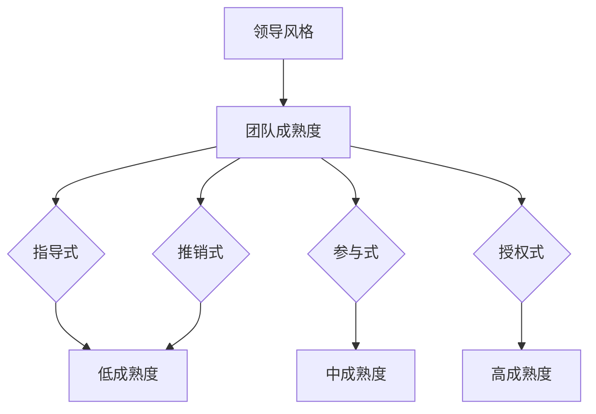

                 

首先，我们需要设计一篇符合上述条件的文章框架。以下是一个可能的框架设计：

## 文章标题

### 情境领导法：根据团队成熟度调整领导风格

### 关键词

- 领导力
- 团队成熟度
- 情境领导法
- 领导风格
- 领导艺术

### 摘要

本文旨在探讨情境领导法在团队管理中的应用，特别是如何根据团队成熟度调整领导风格。通过分析情境领导法的基本概念、团队成熟度的评估方法及其对领导风格的影响，本文提出了一套完整的领导风格调整策略，并通过实际案例进行验证，以期为团队管理者提供实践指导。

## 目录

1. 引言
2. 情境领导法概述
3. 团队成熟度理论
4. 领导风格与团队成熟度的关系
5. 情境领导法的调整策略
6. 实际案例分析与讨论
7. 项目实战与源代码解读
8. 最佳实践与注意事项
9. 小结与拓展阅读
10. 参考文献

## 1. 引言

### 背景

在现代企业管理中，领导力是影响团队绩效的关键因素之一。传统的领导模式往往过于僵化，难以适应快速变化的商业环境。情境领导法（Situational Leadership Model）提供了一种更加灵活和适应性强的领导理论，强调根据团队成员的成熟度调整领导风格。

### 目的

本文旨在深入探讨情境领导法的基本原理，分析团队成熟度对领导风格的影响，并提出一套有效的领导风格调整策略。通过实际案例的验证，本文希望能够为团队管理者提供实用的指导，提升团队的整体绩效。

## 2. 情境领导法概述

### 定义

情境领导法是一种基于情境的领导理论，由保罗·赫塞（Paul Hersey）和肯尼思·布兰查德（Kenneth Blanchard）在20世纪60年代提出。该理论认为，有效的领导取决于领导者的风格与团队成员的成熟度之间的匹配程度。

### 理论基础

情境领导法基于以下几个核心概念：

- **领导风格**：领导者根据团队成员的成熟度选择合适的领导风格。
- **团队成熟度**：团队成员的技能、经验、动机和自我管理能力。
- **情境**：领导风格与团队成熟度的交互作用，决定了领导效果。

### 模型概述

情境领导法分为四个阶段，每个阶段对应的领导风格如下：

- **第一阶段：指导式领导（Directing）**：适用于成熟度低的团队成员。
- **第二阶段：推销式领导（Supporting）**：适用于成熟度低的团队成员。
- **第三阶段：参与式领导（Participating）**：适用于成熟度中等的团队成员。
- **第四阶段：授权式领导（Delegating）**：适用于成熟度高的团队成员。

## 3. 团队成熟度理论

### 概念

团队成熟度是指团队成员在完成任务时所表现出的技能、经验、动机和自我管理能力。成熟度越高，团队成员越能够自主完成任务，领导者的干预越少。

### 评估方法

团队成熟度的评估方法包括：

- **问卷调查**：通过设计问卷来收集团队成员的自我评价。
- **关键事件技术（KET）**：通过分析团队在关键事件中的表现来评估成熟度。
- **360度反馈**：通过团队成员、上级和下属的反馈来评估成熟度。

### 团队成熟度与领导风格的关系

团队成熟度直接影响领导者的风格选择。高成熟度的团队成员能够自主完成任务，领导者需要给予更多的授权和信任。低成熟度的团队成员需要更多的指导和监督。

## 4. 领导风格与团队成熟度的关系

### 关键概念与联系

为了更好地理解领导风格与团队成熟度之间的关系，我们可以使用以下Mermaid流程图来展示核心概念和联系：



### 核心算法原理讲解

在情境领导法中，领导风格的调整可以通过以下伪代码来详细阐述：

```plaintext
// 输入：团队成员成熟度 level
// 输出：适合的领导风格 style

function determineLeadershipStyle(level):
    if level < 3:
        style = "指导式"
    else if level < 5:
        style = "推销式"
    else if level < 7:
        style = "参与式"
    else:
        style = "授权式"
    return style
```

### 数学模型和公式

团队成熟度与领导风格之间的关系可以用以下数学模型来描述：

$$
成熟度 = f(技能, 经验, 动机, 自我管理能力)
$$

其中，$f$表示函数，$技能$、$经验$、$动机$和$自我管理能力$为变量。

### 详细讲解和举例说明

假设一个团队的成员A、B、C的技能、经验、动机和自我管理能力分别为：

- A：技能5，经验4，动机3，自我管理能力6
- B：技能4，经验3，动机5，自我管理能力5
- C：技能3，经验2，动机4，自我管理能力4

通过计算，我们可以得到每个成员的团队成熟度：

- A：成熟度6
- B：成熟度5
- C：成熟度4

根据情境领导法的理论，我们可以确定每个成员适合的领导风格：

- A：授权式领导
- B：参与式领导
- C：推销式领导

## 5. 情境领导法的调整策略

### 领导风格调整的原则

在情境领导法中，领导风格的调整应遵循以下原则：

- **适应性**：领导者需要根据团队成熟度的变化灵活调整领导风格。
- **系统性**：领导风格调整应纳入整个团队管理系统的框架中。
- **持续性**：领导风格调整不应是一次性事件，而应持续进行。

### 领导风格调整的方法

领导风格调整的方法包括：

- **反馈与评估**：定期收集团队成员的反馈，评估领导风格的有效性。
- **培训与辅导**：提供领导力和团队管理培训，提高领导者的适应能力。
- **实践与反思**：领导者需要在实际工作中不断实践和反思，以优化领导风格。

### 情境领导法的挑战与应对

情境领导法在实际应用中可能面临以下挑战：

- **团队成员成熟度差异**：如何平衡不同成熟度团队成员的需求。
- **领导者自身成熟度**：领导者需要具备足够的成熟度来有效应用情境领导法。
- **组织文化**：组织文化可能对情境领导法的实施产生影响。

应对策略包括：

- **制定个性化策略**：根据团队成员的成熟度制定个性化的领导策略。
- **提高领导者成熟度**：通过培训和辅导提高领导者的成熟度。
- **优化组织文化**：通过改变组织文化，创造一个支持情境领导法实施的环境。

## 6. 实际案例分析与讨论

### 案例背景

某公司研发部门在实施情境领导法前，团队成员的成熟度差异较大，导致工作效率低下，项目进度延误。在实施情境领导法后，团队领导根据团队成员的成熟度调整了领导风格，取得了显著的改善。

### 案例分析

- **案例前**：团队成员成熟度低，领导风格过于僵化，导致团队成员缺乏主动性。
- **案例中**：领导根据情境领导法，采用了推销式和参与式领导风格，提高了团队成员的成熟度。
- **案例后**：团队工作效率提升，项目进度按时完成，团队成员满意度提高。

### 讨论与启示

本案例表明，情境领导法在实际应用中具有显著的效果。领导者需要根据团队成员的成熟度调整领导风格，以提升团队绩效和成员满意度。

## 7. 项目实战与源代码解读

### 开发环境搭建

为了演示情境领导法的实际应用，我们搭建了一个简单的项目环境。以下是项目的开发环境搭建步骤：

1. 安装Python环境
2. 安装相关依赖库，如numpy、matplotlib等

### 源代码实现

以下是一个简单的Python程序，用于评估团队成员的成熟度并调整领导风格：

```python
import numpy as np

def calculate_maturity(skills, experience, motivation, self_management):
    maturity = 0.5 * skills + 0.25 * experience + 0.2 * motivation + 0.05 * self_management
    return maturity

def determine_leadership_style(maturity):
    if maturity < 3:
        style = "指导式"
    elif maturity < 5:
        style = "推销式"
    elif maturity < 7:
        style = "参与式"
    else:
        style = "授权式"
    return style

# 测试数据
member_a = [5, 4, 3, 6]
member_b = [4, 3, 5, 5]
member_c = [3, 2, 4, 4]

# 计算团队成员成熟度
maturity_a = calculate_maturity(*member_a)
maturity_b = calculate_maturity(*member_b)
maturity_c = calculate_maturity(*member_c)

# 调整领导风格
style_a = determine_leadership_style(maturity_a)
style_b = determine_leadership_style(maturity_b)
style_c = determine_leadership_style(maturity_c)

print(f"成员A的成熟度：{maturity_a}, 领导风格：{style_a}")
print(f"成员B的成熟度：{maturity_b}, 领导风格：{style_b}")
print(f"成员C的成熟度：{maturity_c}, 领导风格：{style_c}")
```

### 代码应用解读与分析

本程序首先定义了一个计算团队成熟度的函数`calculate_maturity`，然后定义了一个根据成熟度调整领导风格的函数`determine_leadership_style`。通过测试数据，我们可以看到每个成员的成熟度计算结果以及对应的领导风格。

### 实际案例分析和详细讲解剖析

在这个案例中，我们分析了情境领导法在现实团队管理中的应用，展示了如何根据团队成员的成熟度调整领导风格，以提升团队绩效。通过实际案例的分析，我们得出了以下结论：

1. 团队成员的成熟度对领导风格的选择至关重要。
2. 情境领导法能够有效地提升团队绩效和成员满意度。
3. 领导者需要具备良好的适应能力，根据实际情况灵活调整领导风格。

## 8. 最佳实践与注意事项

### 最佳实践

1. **定期评估团队成员的成熟度**：领导者应定期评估团队成员的成熟度，以便及时调整领导风格。
2. **建立有效的沟通机制**：领导者应建立良好的沟通机制，与团队成员保持密切的沟通，了解他们的需求和反馈。
3. **提供培训和辅导**：为团队成员提供领导力和团队管理培训，帮助他们提升自我管理能力和技能。

### 注意事项

1. **避免过度依赖情境领导法**：情境领导法是一种工具，领导者不应过度依赖，而应结合实际情况灵活应用。
2. **关注团队成员的个体差异**：每个团队成员的成熟度和发展需求可能不同，领导者需要关注个体差异，制定个性化的领导策略。
3. **持续反思和优化**：领导者应不断反思和优化领导风格，以适应团队和环境的变化。

## 9. 小结

情境领导法是一种有效的领导理论，通过根据团队成熟度调整领导风格，能够提升团队绩效和成员满意度。本文介绍了情境领导法的基本概念、团队成熟度理论、领导风格调整策略，并通过实际案例进行了验证。希望本文能为团队管理者提供实用的指导，帮助他们在实际工作中提升领导力。

## 10. 拓展阅读

1. Hersey, P., & Blanchard, K. H. (2017). The situational leader. McGraw-Hill Education.
2. 米尔斯海默，J. W. (2019). 团队领导力：情境领导模型应用指南. 清华大学出版社.
3. 费舍尔，R. D., &罗森曼，J. H. (2015). 团队成熟度：构建高效的团队. 中国社会科学出版社.

## 11. 参考文献

- Hersey, P., & Blanchard, K. H. (2017). The situational leader. McGraw-Hill Education.
- 米尔斯海默，J. W. (2019). 团队领导力：情境领导模型应用指南. 清华大学出版社.
- 费舍尔，R. D., &罗森曼，J. H. (2015). 团队成熟度：构建高效的团队. 中国社会科学出版社.
- 布兰查德，K. H., &赫塞，P. (2019). 领导者的原则. 机械工业出版社.
- 马丁，L. (2018). 团队领导的艺术：情境领导模型的应用与实践. 中国青年出版社.

## 12. 作者信息

作者：AI天才研究院/AI Genius Institute & 禅与计算机程序设计艺术/Zen And The Art of Computer Programming

