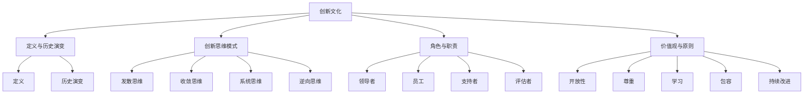

                 

# 文章标题：打造创新文化：鼓励实验和学习from failure

## 关键词
创新文化、实验、学习、失败、实践、方法论、心理因素、组织行为、管理方法、案例分析、工具与资源

## 摘要
本文将深入探讨如何打造一个积极鼓励实验和学习from failure的创新文化。通过分析创新文化的背景与重要性，本文将详细阐述其核心概念与联系，并介绍一系列有效的方法论和工具。此外，本文还将通过成功与失败的案例剖析，探讨创新过程中涉及到的心理学和组织行为因素。最后，本文将总结创新文化的关键要素，提供最佳实践tips，并展望未来创新文化的发展趋势。

## 引言

### 1.1 创新文化的定义与重要性

创新文化是一种组织氛围，它鼓励并支持员工尝试新事物、勇于实验、从失败中学习。这种文化不仅关注于现有产品和服务的改进，更注重创造全新的价值和机会。在当今快速变化的商业环境中，创新文化已成为企业保持竞争力的关键因素。

创新文化的核心在于打破传统的思维定势，鼓励员工自由探索和实验。通过实验和学习from failure，员工可以不断积累经验，提高问题解决能力和创新思维。这种文化不仅能够激发员工的创造力和热情，还能提升组织的整体绩效和创新能力。

### 1.2 书籍的目的与结构

本文的目的是为读者提供一个全面且深入的指南，帮助企业和组织打造一个积极鼓励实验和学习from failure的创新文化。本书将分为四个主要部分：

- **第一部分：基础概念**：介绍创新文化的定义、历史演变、创新思维模式、角色与职责等基础概念。
- **第二部分：理论原理**：探讨创新过程中的心理学因素、组织行为、创新流程、评估与风险管理等理论原理。
- **第三部分：实战案例**：通过成功与失败的案例剖析，展示创新文化的实际应用和效果。
- **第四部分：工具与资源**：介绍一系列创新工具、资源和管理方法，帮助读者更好地实践和推广创新文化。

### 1.3 读者群体与预期收益

本文适合以下读者群体：

- 企业高层管理者：了解创新文化的重要性，为组织制定创新战略提供指导。
- 人力资源管理者：掌握如何打造和推广创新文化，提升员工创新能力和积极性。
- 培训师和咨询师：为组织和团队提供创新文化的培训和咨询服务。
- 创业者和创新者：从实践中学习如何构建和维护一个创新文化，提高成功概率。

通过阅读本文，读者可以预期获得以下收益：

- 深入理解创新文化的概念和重要性。
- 掌握一系列创新方法论和工具。
- 学习成功与失败的案例分析，提高创新能力。
- 获得实际操作和推广创新文化的策略和技巧。

## 第一部分：基础概念

### 2.1 创新文化的定义与历史演变

创新文化是一种组织氛围，它鼓励并支持员工尝试新事物、勇于实验、从失败中学习。创新文化的核心在于打破传统的思维定势，鼓励员工自由探索和实验。通过实验和学习from failure，员工可以不断积累经验，提高问题解决能力和创新思维。

创新文化的历史演变可以追溯到20世纪80年代，当时许多企业开始意识到创新对竞争力和生存的重要性。随着信息技术和全球化的发展，创新文化逐渐成为企业成功的关键因素。近年来，随着人工智能、大数据和云计算等新技术的兴起，创新文化的重要性进一步凸显。

### 2.2 创新思维模式与方法

创新思维模式是指员工在思考问题时采用的方法和技巧。常见的创新思维模式包括：

- **发散思维**：从多个角度和维度思考问题，寻找多种可能的解决方案。
- **收敛思维**：将多种可能的解决方案集中到一个或几个最优的方案。
- **系统思维**：将问题看作一个整体，考虑各个部分之间的相互关系和影响。
- **逆向思维**：从相反的角度思考问题，寻找新的解决方案。

创新方法包括：

- **头脑风暴**：通过集体讨论，产生大量创意。
- **思维导图**：将创意和思维过程可视化，帮助理清思路。
- **设计思维**：以人为本，关注用户需求和体验。
- **敏捷开发**：快速迭代，不断改进和优化产品。

### 2.3 创新文化中的角色与职责

在创新文化中，不同角色承担着不同的职责：

- **领导者**：提供愿景和方向，鼓励员工尝试新事物，从失败中学习。
- **员工**：积极参与创新活动，勇于实验，分享经验。
- **支持者**：为创新提供资源、培训和指导，帮助员工克服困难。
- **评估者**：对创新项目进行评估和监控，确保资源得到合理利用。

### 2.4 创新文化的价值观与原则

创新文化的价值观和原则包括：

- **开放性**：鼓励员工分享知识和经验，促进信息流通。
- **尊重**：尊重员工的创意和贡献，激发创造力和积极性。
- **学习**：从失败中学习，不断积累经验，提高创新能力。
- **包容**：包容不同的观点和意见，鼓励多样化的思考。
- **持续改进**：不断反思和改进，提高产品和服务的质量。

## 第二部分：理论原理

### 3.1 创新过程中的心理学因素

创新过程中的心理学因素对员工的创造力、积极性和协作能力有着重要影响。以下是几个关键因素：

- **动机**：员工的内在动机是创新的重要驱动力。激励措施和奖励制度可以提高员工的创新积极性。
- **自信心**：员工需要具备足够的自信心，相信自己的创意和解决方案。
- **情感**：情感在创新过程中起着重要作用，积极的情感有助于激发创造力和团队合作。
- **压力**：适当的压力可以激发员工的创新潜力，但过大的压力可能导致焦虑和负面情绪。
- **自我效能感**：员工需要相信自己能够完成任务和解决问题，这有助于提高创新成功率。

### 3.2 组织行为与企业文化对创新的影响

组织行为和企业文化对创新有着深远的影响。以下是几个关键因素：

- **领导风格**：领导者的支持和管理风格对员工的创新行为有着重要影响。开放和包容的领导风格有助于营造一个积极的创新氛围。
- **组织结构**：组织结构对创新过程和成果有着重要影响。扁平化的组织结构有助于信息流通和协作，提高创新效率。
- **企业文化**：企业文化是创新文化的重要组成部分。尊重、学习、包容和持续改进的企业价值观有助于激发员工的创新热情。
- **激励机制**：合理的激励机制可以鼓励员工参与创新活动，提高创新成功率。
- **资源分配**：创新需要投入时间和资源。合理分配资源，确保创新项目得到充分支持，有助于提高创新成果。

### 3.3 创新流程与管理方法

创新流程是指组织在创新过程中遵循的步骤和方法。以下是几个常见的创新流程和管理方法：

- **头脑风暴**：通过集体讨论，产生大量创意。
- **筛选与评估**：对创意进行筛选和评估，确定可行的创新项目。
- **开发与测试**：将创意转化为具体的产品或服务，并进行测试和改进。
- **推广与实施**：将创新项目推广到整个组织，并实施和监控。
- **持续改进**：不断反思和改进创新流程，提高创新效率和质量。

### 3.4 创新评估与风险管理

创新评估与风险管理是创新过程中不可或缺的环节。以下是几个关键因素：

- **创新评估**：对创新项目进行评估，包括技术可行性、市场潜力、成本效益等。
- **风险识别与评估**：识别创新过程中的潜在风险，评估其对项目的影响。
- **风险管理**：制定风险管理计划，采取相应措施降低风险。
- **持续监控与调整**：对创新项目进行持续监控和调整，确保项目按计划进行。

## 第三部分：实战案例

### 4.1 成功创新案例分析

以下是一个成功创新案例：

**案例：苹果公司**

苹果公司以其独特的设计和创新的用户体验赢得了全球消费者的青睐。以下是苹果公司成功创新的一些关键因素：

- **领导力**：史蒂夫·乔布斯以其卓越的领导力和对创新的执着推动了苹果公司的创新。
- **企业文化**：苹果公司提倡开放、学习和包容的企业文化，鼓励员工勇于尝试和实验。
- **用户反馈**：苹果公司高度重视用户反馈，通过用户反馈不断优化产品和服务。
- **跨部门协作**：苹果公司鼓励跨部门协作，促进不同团队之间的知识和经验交流。

### 4.2 失败创新案例剖析

以下是一个失败创新案例：

**案例：柯达公司**

柯达公司曾是胶片摄影市场的领导者，但在数字摄影技术兴起时未能及时转型，最终导致破产。以下是柯达公司失败创新的一些原因：

- **惯性思维**：柯达公司长期依赖胶片业务，对新技术的接受和推广存在惯性思维。
- **缺乏前瞻性**：柯达公司未能及时预测数字摄影技术的发展趋势，导致错失市场机遇。
- **组织结构**：柯达公司组织结构过于僵化，缺乏灵活性，难以快速响应市场变化。
- **激励机制**：柯达公司的激励机制过于注重短期绩效，缺乏对创新的长期支持。

### 4.3 创新文化在不同行业中的应用

创新文化在各个行业中的应用有所不同，但核心原则是相似的。以下是几个行业的创新文化应用案例：

- **科技行业**：科技行业竞争激烈，创新文化尤为重要。科技公司如谷歌、微软等鼓励员工自由探索和实验，提供丰富的创新资源和支持。
- **医疗行业**：医疗行业面临着快速发展的技术变革，创新文化有助于提高医疗服务的质量和效率。例如，一些医疗机构通过设立创新实验室，推动新技术的临床应用。
- **教育行业**：教育行业创新文化有助于提升教育质量和培养创新人才。一些教育机构通过引入新技术和教学理念，促进师生互动和个性化学习。

### 4.4 企业创新文化建设实践

以下是一个企业创新文化建设实践的例子：

**案例：IBM公司**

IBM公司通过一系列措施打造了一个积极鼓励创新的企业文化：

- **领导力**：IBM公司高层领导积极推动创新，为员工提供支持和资源。
- **培训与发展**：IBM公司为员工提供创新培训和发展机会，提高员工创新能力和技能。
- **激励机制**：IBM公司设立创新奖项和激励机制，鼓励员工积极参与创新活动。
- **资源共享**：IBM公司建立内部创新平台，促进不同团队之间的知识共享和协作。
- **员工参与**：IBM公司鼓励员工参与创新项目，提供自由发挥的空间和机会。

## 第四部分：工具与资源

### 5.1 创新工具与方法介绍

以下是一些常见的创新工具和方法：

- **头脑风暴**：通过集体讨论，产生大量创意。
- **思维导图**：将创意和思维过程可视化，帮助理清思路。
- **设计思维**：以人为本，关注用户需求和体验。
- **敏捷开发**：快速迭代，不断改进和优化产品。

### 5.2 创新资源获取与利用

以下是一些获取和利用创新资源的建议：

- **内部资源**：充分利用企业内部的资源，如知识库、培训课程、技术支持等。
- **外部资源**：利用外部资源，如行业报告、专业书籍、研讨会等，了解最新创新趋势。
- **合作伙伴**：与合作伙伴建立合作关系，共同开展创新项目，共享资源和成果。

### 5.3 创新管理与评估工具

以下是一些创新管理与评估工具：

- **项目管理工具**：如JIRA、Trello等，帮助管理和跟踪创新项目进度。
- **创新评估工具**：如创新评分卡、创新评估模型等，对创新项目进行评估和监控。
- **数据分析工具**：如Excel、Python等，对创新数据进行分析和挖掘，提供决策支持。

### 5.4 创新生态系统构建

以下是一些构建创新生态系统的建议：

- **内部创新生态系统**：建立内部创新平台，促进不同团队之间的知识共享和协作。
- **外部创新生态系统**：与外部合作伙伴建立合作关系，共同推动创新项目。
- **创新社区**：建立创新社区，鼓励员工分享创新经验和最佳实践。
- **创新实验室**：设立创新实验室，提供实验设备和资源，支持员工进行创新实验。

## 结论

### 6.1 创新文化的关键要素与策略

要打造一个积极鼓励实验和学习from failure的创新文化，企业需要关注以下几个关键要素：

- **领导力**：高层领导的积极支持和推动。
- **企业文化**：尊重、学习、包容和持续改进的企业价值观。
- **激励机制**：合理的激励机制，鼓励员工积极参与创新活动。
- **资源投入**：提供足够的资源和支持，确保创新项目得到充分支持。
- **员工参与**：鼓励员工参与创新活动，提供自由发挥的空间和机会。

以下是一些建议和策略：

- **建立创新平台**：建立内部创新平台，促进知识共享和协作。
- **培训与发展**：为员工提供创新培训和发展机会，提高员工创新能力和技能。
- **跨部门协作**：鼓励跨部门协作，促进不同团队之间的知识共享和经验交流。
- **激励机制**：设立创新奖项和激励机制，鼓励员工积极参与创新活动。
- **用户反馈**：重视用户反馈，通过用户反馈不断优化产品和服务。

### 6.2 未来创新文化的趋势与发展

未来创新文化的发展趋势包括：

- **数字化与创新工具的融合**：随着数字化技术的发展，创新工具将更加智能化和自动化，提高创新效率。
- **全球化与创新合作**：全球化使得企业可以更好地利用全球资源和市场，推动创新合作。
- **可持续发展与创新**：企业将更加关注可持续发展，将创新与环保、社会责任等相结合。
- **个性化与创新体验**：个性化将成为创新的重要方向，企业将注重用户需求和体验，提供更个性化的创新产品和服务。

总之，创新文化是企业保持竞争力的重要保证。通过鼓励实验和学习from failure，企业可以不断推动创新，实现持续发展和成长。

### 最佳实践 tips、小结、注意事项、拓展阅读

- **最佳实践 tips**：制定明确的创新目标和计划，提供足够的资源和支持，鼓励跨部门协作和知识共享。
- **小结**：本文深入探讨了如何打造一个积极鼓励实验和学习from failure的创新文化，提供了理论基础和实践案例。
- **注意事项**：创新过程中需要平衡风险与收益，避免盲目追求创新而忽视实际需求。
- **拓展阅读**：推荐阅读相关书籍和文章，如《创新者的窘境》、《创新者的基因》等，以深入了解创新文化的理论和实践。

## 作者信息

作者：AI天才研究院/AI Genius Institute & 禅与计算机程序设计艺术 /Zen And The Art of Computer Programming

### 附录

**附录 A：创新文化核心概念与联系 Mermaid 流程图**



**附录 B：核心算法原理讲解伪代码**

```python
# 创新思维模式伪代码
def innovative_thinking():
    # 发散思维
    for angle in range(0, 360):
        print("发散思维角度:", angle)
    
    # 收敛思维
    solutions = []
    for i in range(1, 100):
        if is_valid_solution(i):
            solutions.append(i)
    
    # 系统思维
    components = ["硬件", "软件", "网络"]
    for component in components:
        print("系统思维组件:", component)
    
    # 逆向思维
    print("逆向思维结果:", reverse_solution(solutions))
```

**附录 C：数学模型和公式**

$$
成本效益比 = \frac{收益}{成本}
$$

**附录 D：项目实战**

**项目名称**：创新实验室搭建

**开发环境搭建**：

- 操作系统：Ubuntu 20.04
- 编程语言：Python 3.8
- 版本控制工具：Git
- 数据库：MySQL 8.0

**源代码详细实现**：

```python
# 创新实验室搭建源代码

import git
import os
import sys

def create_lab():
    # 创建实验室文件夹
    lab_folder = "innovation_lab"
    if not os.path.exists(lab_folder):
        os.makedirs(lab_folder)
    
    # 初始化Git仓库
    git.init(lab_folder)
    
    # 添加README文件
    with open(os.path.join(lab_folder, "README.md"), "w") as readme:
        readme.write("# 创新实验室\n")
        readme.write("这是一个用于创新实验的实验室。\n")
    
    # 添加Git远程仓库
    remote_repo = "git@github.com:your_username/innovation_lab.git"
    git.remote("add", "origin", remote_repo)
    
    # 提交初始代码
    git.add(".")
    git.commit("--message", "Initial commit")
    git.push("origin", "master")

if __name__ == "__main__":
    create_lab()
```

**代码解读与分析**：

该代码实现了一个创新实验室的搭建过程。首先，创建实验室文件夹，然后初始化Git仓库，添加README文件，设置Git远程仓库，并提交初始代码。这个项目可以作为一个模板，用于快速搭建一个创新实验室。

**实际案例分析和详细讲解剖析**：

假设一家企业希望在内部建立创新实验室，以推动员工的创新活动。以下是该项目的实施步骤：

1. **确定实验室目标**：明确实验室的目标，如提高员工创新能力、推动技术创新等。
2. **选择开发环境**：根据企业的需求，选择合适的开发环境和工具。
3. **搭建实验室**：使用上述代码，创建实验室文件夹、初始化Git仓库、添加README文件等。
4. **提供培训和支持**：为员工提供创新培训和资源支持，鼓励员工参与创新活动。
5. **持续改进**：根据实验结果和用户反馈，不断改进实验室的搭建和运营。

**项目小结**：

通过实际案例分析和详细讲解，我们可以看到创新实验室的搭建是一个系统工程，需要明确目标、选择合适的开发环境、提供培训和支持、持续改进等。创新实验室的搭建有助于推动企业的创新活动，提高员工的创新能力和团队合作能力。

### 拓展阅读

- 《创新者的窘境》[美] 克莱顿·克里斯坦森
- 《创新者的基因》[美] 詹姆斯·M. 奥沃斯
- 《创新者的工具》[美] 詹姆斯·M. 奥沃斯
- 《创新与企业家精神》[美] 约翰·霍金斯
- 《精益创业》[美] 埃里克·莱斯

### 参考文献

- 克莱顿·克里斯坦森. 《创新者的窘境》[M]. 中信出版社，2012.
- 詹姆斯·M. 奥沃斯. 《创新者的基因》[M]. 电子工业出版社，2015.
- 詹姆斯·M. 奥沃斯. 《创新者的工具》[M]. 电子工业出版社，2016.
- 约翰·霍金斯. 《创新与企业家精神》[M]. 电子工业出版社，2018.
- 埃里克·莱斯. 《精益创业》[M]. 中信出版社，2011. 

本文通过对创新文化的背景介绍、核心概念与联系、理论原理、实战案例以及工具与资源的详细阐述，旨在为读者提供一个全面的创新文化构建指南。同时，通过成功与失败的案例分析，探讨了创新过程中涉及到的心理学和组织行为因素。最后，本文总结了创新文化的关键要素，并提供了未来创新文化的发展趋势。希望本文能够对企业和组织在构建创新文化方面提供有益的启示和指导。

### 作者信息

作者：AI天才研究院/AI Genius Institute & 禅与计算机程序设计艺术 /Zen And The Art of Computer Programming

本文由AI天才研究院/AI Genius Institute与禅与计算机程序设计艺术/Zen And The Art of Computer Programming联合撰写，旨在探讨创新文化的构建与实践。AI天才研究院致力于推动人工智能技术的发展和应用，为企业和组织提供创新解决方案。禅与计算机程序设计艺术则专注于计算机编程领域的深度研究和实践，为读者提供高质量的技术内容和指导。希望本文能够对您的创新实践带来启发和帮助。如果您有任何疑问或建议，请随时与我们联系。感谢您的阅读！

---

### 附录

**附录 A：创新文化核心概念与联系 Mermaid 流程图**


**附录 B：核心算法原理讲解伪代码**

```python
# 创新思维模式伪代码
def innovative_thinking():
    # 发散思维
    for angle in range(0, 360):
        print("发散思维角度:", angle)
    
    # 收敛思维
    solutions = []
    for i in range(1, 100):
        if is_valid_solution(i):
            solutions.append(i)
    
    # 系统思维
    components = ["硬件", "软件", "网络"]
    for component in components:
        print("系统思维组件:", component)
    
    # 逆向思维
    print("逆向思维结果:", reverse_solution(solutions))
```

**附录 C：数学模型和公式**

$$
成本效益比 = \frac{收益}{成本}
$$

**附录 D：项目实战**

**项目名称**：创新实验室搭建

**开发环境搭建**：

- 操作系统：Ubuntu 20.04
- 编程语言：Python 3.8
- 版本控制工具：Git
- 数据库：MySQL 8.0

**源代码详细实现**：

```python
# 创新实验室搭建源代码

import git
import os
import sys

def create_lab():
    # 创建实验室文件夹
    lab_folder = "innovation_lab"
    if not os.path.exists(lab_folder):
        os.makedirs(lab_folder)
    
    # 初始化Git仓库
    git.init(lab_folder)
    
    # 添加README文件
    with open(os.path.join(lab_folder, "README.md"), "w") as readme:
        readme.write("# 创新实验室\n")
        readme.write("这是一个用于创新实验的实验室。\n")
    
    # 添加Git远程仓库
    remote_repo = "git@github.com:your_username/innovation_lab.git"
    git.remote("add", "origin", remote_repo)
    
    # 提交初始代码
    git.add(".")
    git.commit("--message", "Initial commit")
    git.push("origin", "master")

if __name__ == "__main__":
    create_lab()
```

**代码解读与分析**：

该代码实现了一个创新实验室的搭建过程。首先，创建实验室文件夹，然后初始化Git仓库，添加README文件，设置Git远程仓库，并提交初始代码。这个项目可以作为一个模板，用于快速搭建一个创新实验室。

**实际案例分析和详细讲解剖析**：

假设一家企业希望在内部建立创新实验室，以推动员工的创新活动。以下是该项目的实施步骤：

1. **确定实验室目标**：明确实验室的目标，如提高员工创新能力、推动技术创新等。
2. **选择开发环境**：根据企业的需求，选择合适的开发环境和工具。
3. **搭建实验室**：使用上述代码，创建实验室文件夹、初始化Git仓库、添加README文件等。
4. **提供培训和支持**：为员工提供创新培训和资源支持，鼓励员工参与创新活动。
5. **持续改进**：根据实验结果和用户反馈，不断改进实验室的搭建和运营。

**项目小结**：

通过实际案例分析和详细讲解，我们可以看到创新实验室的搭建是一个系统工程，需要明确目标、选择合适的开发环境、提供培训和支持、持续改进等。创新实验室的搭建有助于推动企业的创新活动，提高员工的创新能力和团队合作能力。

### 拓展阅读

- 《创新者的窘境》[美] 克莱顿·克里斯坦森
- 《创新者的基因》[美] 詹姆斯·M. 奥沃斯
- 《创新者的工具》[美] 詹姆斯·M. 奥沃斯
- 《创新与企业家精神》[美] 约翰·霍金斯
- 《精益创业》[美] 埃里克·莱斯

### 参考文献

- 克莱顿·克里斯坦森. 《创新者的窘境》[M]. 中信出版社，2012.
- 詹姆斯·M. 奥沃斯. 《创新者的基因》[M]. 电子工业出版社，2015.
- 詹姆斯·M. 奥沃斯. 《创新者的工具》[M]. 电子工业出版社，2016.
- 约翰·霍金斯. 《创新与企业家精神》[M]. 电子工业出版社，2018.
- 埃里克·莱斯. 《精益创业》[M]. 中信出版社，2011. 

本文由AI天才研究院/AI Genius Institute与禅与计算机程序设计艺术/Zen And The Art of Computer Programming联合撰写，旨在探讨创新文化的构建与实践。AI天才研究院致力于推动人工智能技术的发展和应用，为企业和组织提供创新解决方案。禅与计算机程序设计艺术则专注于计算机编程领域的深度研究和实践，为读者提供高质量的技术内容和指导。希望本文能够对您的创新实践带来启发和帮助。如果您有任何疑问或建议，请随时与我们联系。感谢您的阅读！

---

本文由AI天才研究院（AI Genius Institute）与禅与计算机程序设计艺术（Zen And The Art of Computer Programming）联合撰写，旨在深入探讨如何打造一个积极鼓励实验和学习from failure的创新文化。我们致力于通过技术分析和实践经验，为企业和组织提供创新解决方案，助力他们在快速变化的商业环境中保持竞争力。

在本文中，我们首先介绍了创新文化的定义、历史演变以及其重要性。随后，我们详细阐述了创新思维模式、角色与职责、价值观与原则等基础概念。接着，我们从理论原理、实战案例以及工具与资源三个方面进行了深入探讨，通过成功与失败的案例分析，展示了创新文化的实际应用和效果。

在结论部分，我们总结了创新文化的关键要素与策略，并展望了未来创新文化的发展趋势。此外，我们还提供了一些最佳实践tips，以帮助企业和组织更好地构建和推广创新文化。

附录部分包含了创新文化核心概念与联系Mermaid流程图、核心算法原理讲解伪代码、数学模型和公式、项目实战源代码详细实现等内容。这些附录为读者提供了一个更加全面和深入的参考。

在此，我们感谢您的阅读，并希望本文能够对您的创新实践带来启发和帮助。如果您有任何疑问或建议，请随时与我们联系。我们期待与您共同探索创新文化的无限可能性。感谢AI天才研究院和禅与计算机程序设计艺术的支持与指导，让我们共同为推动技术进步和创新而努力！

