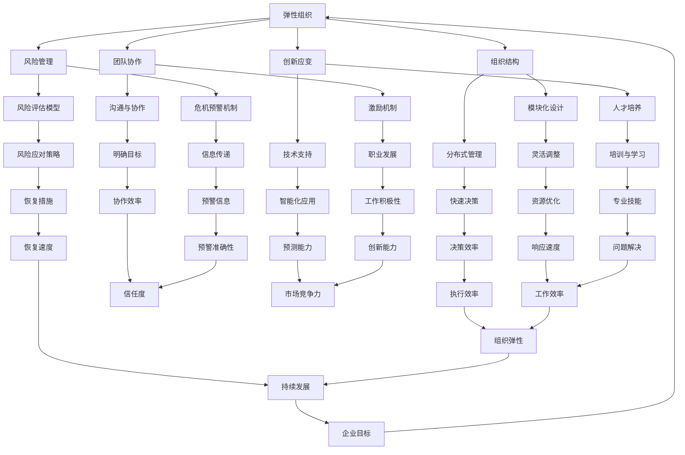

                 

# 打造弹性组织：提升团队应对危机的能力

关键词：弹性组织，危机应对，团队建设，风险管理，应变策略

摘要：在当今快速变化和不确定性的商业环境中，打造一个具有高度弹性的组织显得尤为重要。本文从弹性组织的概念出发，详细探讨了弹性组织建设的理论基础、架构设计、团队建设、危机管理以及应变策略，并通过实际案例分析了弹性组织的成功实践，为企业在面对危机时提升应对能力提供了有益的参考。

## 第1章 引言

### 1.1 弹性组织的概念和重要性

弹性组织，指的是在面临外部环境变化和内部挑战时，能够迅速适应并保持稳定运作的组织。在当今这个全球化和数字化时代，市场竞争日益激烈，企业所面临的不确定性因素也在不断增加。这种不确定性不仅体现在市场需求的变化上，还体现在技术进步、政策法规、自然环境等多个方面。因此，企业必须具备应对这些不确定性的能力，以保持持续发展的动力。

弹性组织的重要性主要体现在以下几个方面：

1. **快速响应**：在面临市场变化时，具有高度弹性的组织能够迅速做出反应，调整战略和运营策略，从而抢占市场先机。
2. **持续发展**：具有弹性的组织能够在面对危机时保持稳定运营，降低危机对企业的影响，从而为企业的长期发展提供保障。
3. **创新能力**：弹性组织鼓励创新和实验，能够快速地将创新成果转化为实际效益，提升企业的核心竞争力。

### 1.2 危机应对的原理与实践

危机应对是弹性组织的核心能力之一。有效的危机应对不仅能够帮助企业渡过难关，还能够提升企业的声誉和公信力。危机应对的原理主要包括以下几个方面：

1. **预警机制**：建立有效的预警机制，及时识别潜在的风险和危机。
2. **应急响应**：在危机发生时，迅速启动应急响应机制，采取有效措施进行应对。
3. **持续改进**：在危机应对过程中，不断总结经验教训，持续改进危机管理能力。

在实际操作中，企业需要结合自身的业务特点和内外部环境，制定具体的危机应对策略。例如，可以通过以下步骤进行危机应对：

1. **危机识别**：通过数据分析和市场调研，识别潜在的危机因素。
2. **危机评估**：对识别出的危机进行评估，确定危机的影响范围和严重程度。
3. **危机响应**：根据危机评估结果，制定并实施具体的危机应对措施。
4. **危机恢复**：在危机得到控制后，进行恢复工作，降低危机对企业的影响。

### 1.3 弹性组织建设的关键因素

要打造一个具有高度弹性的组织，需要从多个方面进行建设和优化。以下是弹性组织建设的关键因素：

1. **组织结构**：设计合理的组织结构，确保组织能够灵活调整和重组。
2. **文化氛围**：营造积极向上的企业文化，鼓励创新和实验。
3. **技术支持**：利用先进的技术手段，提升组织的数字化和智能化水平。
4. **人才培养**：建立完善的人才培养机制，提升员工的专业技能和综合素质。
5. **风险管理**：建立有效的风险管理体系，降低危机发生的可能性。

## 第2章 弹性组织理论基础

### 2.1 组织弹性理论的发展历程

组织弹性理论的发展历程可以追溯到20世纪末。当时，企业管理者开始意识到在快速变化的市场环境中，传统的管理方式已无法满足企业的需求。于是，学者们开始研究如何在不确定的环境中保持组织的活力和竞争力。经过多年的研究，组织弹性理论逐渐形成了一套完整的理论体系。

### 2.2 弹性组织的核心要素

弹性组织的核心要素包括：

1. **组织结构**：弹性组织通常采用模块化、分布式和矩阵式等组织结构，以实现灵活调整和重组。
2. **文化氛围**：积极向上的企业文化能够鼓励员工创新和实验，提升组织的整体效能。
3. **技术支持**：先进的技术手段能够提升组织的数字化和智能化水平，为弹性组织提供有力支撑。
4. **人才培养**：完善的人才培养机制能够提升员工的专业技能和综合素质，为组织提供持续的人才支持。
5. **风险管理**：有效的风险管理体系能够降低危机发生的可能性，提升组织的抗风险能力。

### 2.3 弹性组织与敏捷组织的异同

弹性组织和敏捷组织都是针对快速变化的市场环境而设计的组织模式。它们的异同主要体现在以下几个方面：

1. **目标**：敏捷组织的目标是快速响应市场需求，提升产品质量；而弹性组织的目标是在面对不确定性和危机时保持稳定运营。
2. **方式**：敏捷组织通常采用迭代开发、快速迭代的方式，以快速适应市场变化；而弹性组织则强调在危机发生时迅速调整和重组。
3. **范围**：敏捷组织主要关注产品开发和生产流程；而弹性组织则涵盖整个企业，包括战略、运营、管理等多个层面。

## 第3章 弹性组织架构设计

### 3.1 弹性组织架构的构建原则

弹性组织架构的构建原则主要包括以下几个方面：

1. **模块化设计**：将组织划分为若干个独立的模块，以便快速调整和重组。
2. **分布式管理**：赋予团队更大的自主权，以实现快速决策和执行。
3. **灵活适应**：组织结构应具备适应不同环境和情境的能力。
4. **风险管理**：建立有效的风险管理体系，降低危机发生时的冲击。

### 3.2 弹性组织架构的层次结构

弹性组织架构通常分为三个层次：

1. **战略层**：设定组织愿景、目标和战略方向。
2. **运营层**：负责日常运营和任务执行。
3. **支持层**：提供技术、财务和人力资源等支持。

### 3.3 弹性组织架构的典型模式

常见的弹性组织架构模式包括：

1. **矩阵式组织**：结合功能型和项目型组织结构，提高灵活性和响应速度。
2. **网络式组织**：通过合作伙伴和外部资源，实现快速扩展和适应。
3. **模块化组织**：将业务流程分解为若干个独立模块，以实现快速调整和重组。

## 第4章 团队建设与员工管理

### 4.1 弹性团队建设的重要性

弹性团队建设是弹性组织建设的重要组成部分。一个具有高度弹性的团队能够在面对外部环境变化和内部挑战时迅速做出反应，保持稳定运作。弹性团队建设的重要性主要体现在以下几个方面：

1. **提升组织响应速度**：弹性团队能够快速响应市场需求，提升组织的竞争力。
2. **增强团队凝聚力**：通过弹性团队建设，增强团队成员之间的信任和协作，提升团队整体效能。
3. **激发员工潜力**：弹性团队鼓励员工创新和实验，激发员工的潜力，提升组织的创新能力。

### 4.2 团队成员的选拔与培养

团队成员的选拔与培养是弹性团队建设的关键环节。在选拔团队成员时，需要注重以下几个方面：

1. **专业技能**：团队成员应具备相关领域的专业技能和知识。
2. **综合素质**：团队成员应具备良好的沟通能力、团队协作能力和创新能力。
3. **心理素质**：团队成员应具备较强的心理素质，能够承受压力和挫折。

在培养团队成员时，可以采取以下措施：

1. **培训与学习**：为团队成员提供各类培训和学习机会，提升其专业技能和综合素质。
2. **项目实践**：通过实际项目锻炼团队成员的能力，提升其解决问题的能力。
3. **激励机制**：建立完善的激励机制，激发团队成员的工作积极性和创新精神。

### 4.3 团队沟通与协作机制

有效的团队沟通与协作机制是弹性团队建设的基础。在团队沟通与协作方面，可以采取以下措施：

1. **明确目标与职责**：确保团队成员明确团队的目标和职责，提高协作效率。
2. **建立沟通渠道**：建立畅通的沟通渠道，确保信息能够及时、准确地传递。
3. **加强团队协作**：通过团队建设活动、协作工具等方式，加强团队成员之间的协作。
4. **培养协作文化**：营造积极向上的协作文化，鼓励团队成员相互支持和帮助。

### 4.4 员工激励与绩效管理

员工激励与绩效管理是提升团队成员工作积极性和创新能力的重要手段。在员工激励方面，可以采取以下措施：

1. **物质激励**：为员工提供具有竞争力的薪酬和福利待遇。
2. **精神激励**：通过表扬、奖励等方式，认可员工的贡献和付出。
3. **职业发展**：为员工提供职业发展的机会和路径，提升其职业素养。

在绩效管理方面，可以采取以下措施：

1. **设定明确的绩效目标**：确保员工明确自己的绩效目标和期望。
2. **定期绩效评估**：通过定期绩效评估，了解员工的工作表现，及时发现问题。
3. **反馈与改进**：根据绩效评估结果，为员工提供反馈和改进建议，帮助其提升工作能力。

## 第5章 危机管理与预警

### 5.1 危机管理的框架与流程

危机管理是弹性组织建设的重要组成部分。一个有效的危机管理框架和流程对于企业在面对危机时保持稳定运营至关重要。危机管理的框架和流程主要包括以下几个方面：

1. **危机识别**：通过数据分析和市场调研，识别潜在的危机因素。
2. **危机评估**：对识别出的危机进行评估，确定危机的影响范围和严重程度。
3. **危机应对**：根据危机评估结果，制定并实施具体的危机应对措施。
4. **危机恢复**：在危机得到控制后，进行恢复工作，降低危机对企业的影响。
5. **持续改进**：在危机应对过程中，不断总结经验教训，持续改进危机管理能力。

### 5.2 危机预警机制的建立

建立有效的危机预警机制是预防危机发生的关键。危机预警机制的建立主要包括以下几个方面：

1. **数据收集与处理**：收集与企业运营相关的各类数据，包括市场数据、技术数据、财务数据等。
2. **预警指标设定**：根据企业的业务特点和内外部环境，设定预警指标，用于监测潜在的危机因素。
3. **预警模型构建**：利用数据分析技术，构建预警模型，对潜在的危机进行预测和预警。
4. **预警信息传递**：建立有效的预警信息传递机制，确保预警信息能够及时、准确地传递到相关部门和人员。

### 5.3 危机应对策略的选择

在危机发生时，选择合适的应对策略对于降低危机对企业的影响至关重要。危机应对策略的选择主要包括以下几个方面：

1. **危机预防策略**：在危机发生前，采取预防措施，降低危机发生的可能性。
2. **危机响应策略**：在危机发生时，迅速启动应急响应机制，采取有效措施进行应对。
3. **危机缓解策略**：在危机得到控制后，采取缓解措施，降低危机对企业的影响。
4. **危机恢复策略**：在危机得到控制后，进行恢复工作，恢复正常运营。

## 第6章 弹性组织的应变策略

### 6.1 应对危机的快速响应

在面临危机时，快速响应是关键。弹性组织应采取以下措施实现快速响应：

1. **建立应急响应机制**：制定详细的应急响应计划，明确各部门和人员在危机发生时的职责和行动。
2. **加强信息沟通**：建立高效的信息沟通机制，确保各部门和人员能够及时、准确地获取危机相关信息。
3. **优化决策流程**：简化决策流程，提高决策效率，确保危机应对措施能够迅速得到执行。
4. **强化应急演练**：定期进行应急演练，提升组织的应急响应能力。

### 6.2 调整组织结构以适应变化

在危机发生时，组织结构的调整是应对危机的重要手段。弹性组织应采取以下措施调整组织结构：

1. **模块化调整**：将组织划分为若干个独立模块，根据危机特点进行灵活调整。
2. **分布式管理**：赋予团队更大的自主权，实现快速决策和执行。
3. **动态调整**：根据危机发展情况，动态调整组织结构，确保组织能够适应不同危机情境。

### 6.3 利用技术手段提高组织弹性

技术手段是提升组织弹性不可或缺的工具。弹性组织应采取以下措施利用技术手段提高组织弹性：

1. **数字化管理**：通过数字化手段，提升组织的信息化水平和决策效率。
2. **智能化应用**：利用人工智能、大数据等技术，提升组织的预测和预警能力。
3. **云计算平台**：搭建云计算平台，实现资源的弹性分配和管理。
4. **区块链技术**：利用区块链技术，提升组织的信任度和协同效率。

## 第7章 成功案例分析

### 7.1 案例一：企业危机应对实践

#### 案例背景

某知名科技企业（以下简称A公司）在2019年面临了一场突如其来的危机。当时，该公司的一款重要产品出现严重故障，导致大量用户投诉，公司股价应声下跌。面对这场危机，A公司采取了以下措施进行应对。

#### 应对措施

1. **快速响应**：A公司立即启动了应急响应机制，成立了危机应对小组，明确了各部门和人员在危机应对中的职责。
2. **危机评估**：危机应对小组对故障原因进行了深入分析，确定了故障的影响范围和严重程度。
3. **危机应对**：A公司迅速发布了故障公告，向用户道歉，并承诺在短时间内解决问题。同时，公司加大了技术投入，加快了故障处理进度。
4. **危机恢复**：在故障得到解决后，A公司进行了全面的复盘和总结，制定了改进措施，以防止类似事件再次发生。

#### 案例分析

A公司在面对这场危机时，采取了迅速有效的应对措施，成功地降低了危机对企业的影响。具体分析如下：

1. **快速响应**：A公司建立了完善的应急响应机制，确保在危机发生时能够迅速做出反应。
2. **危机评估**：A公司对危机进行了全面评估，确保制定出有效的应对措施。
3. **危机应对**：A公司在危机应对过程中，采取了积极的措施，努力挽回用户的信任。
4. **危机恢复**：A公司在危机得到解决后，进行了全面的复盘和总结，为未来的危机应对积累了宝贵的经验。

### 7.2 案例二：弹性组织建设实践

#### 案例背景

B公司是一家新兴产业公司，专注于环保技术的研发和应用。在成立初期，B公司面临市场竞争激烈、资源有限等挑战。为了应对这些挑战，B公司开始建设弹性组织，提升组织的抗风险能力。

#### 应对措施

1. **组织结构调整**：B公司将组织划分为若干个独立模块，每个模块负责不同的业务领域。同时，实行分布式管理，赋予团队更大的自主权。
2. **人才培养与激励**：B公司重视人才培养，通过内部培训和外部引进，提升员工的专业技能和综合素质。同时，建立完善的激励机制，激发员工的工作积极性和创新精神。
3. **风险管理**：B公司建立了有效的风险管理体系，定期进行风险评估和预警，提前识别潜在的危机因素。
4. **技术创新**：B公司加大了技术创新力度，通过引入新技术、新方法，提升组织的核心竞争力。

#### 案例分析

B公司在面对市场挑战时，通过弹性组织建设，成功地提升了组织的抗风险能力。具体分析如下：

1. **组织结构调整**：B公司通过模块化和分布式管理，实现了组织的灵活调整和重组，提高了组织的响应速度。
2. **人才培养与激励**：B公司通过人才培养和激励机制，提升了员工的专业技能和综合素质，为组织的发展提供了强大的人才支持。
3. **风险管理**：B公司建立了有效的风险管理体系，降低了危机发生的可能性，提升了组织的抗风险能力。
4. **技术创新**：B公司通过技术创新，提升了组织的核心竞争力，为组织的发展提供了持续的动力。

### 7.3 案例分析总结与启示

通过以上案例分析，我们可以得出以下总结与启示：

1. **快速响应**：在面临危机时，快速响应是关键。企业应建立完善的应急响应机制，确保在危机发生时能够迅速做出反应。
2. **危机评估**：企业应对危机进行全面评估，确保制定出有效的应对措施。
3. **组织结构调整**：通过模块化和分布式管理，实现组织的灵活调整和重组，提高组织的响应速度。
4. **人才培养与激励**：通过人才培养和激励机制，提升员工的专业技能和综合素质，为组织的发展提供强大的人才支持。
5. **风险管理**：建立有效的风险管理体系，降低危机发生的可能性，提升组织的抗风险能力。
6. **技术创新**：通过技术创新，提升组织的核心竞争力，为组织的发展提供持续的动力。

## 第8章 结论

### 8.1 弹性组织建设的总结

弹性组织建设是提升企业应对不确定性和危机能力的重要手段。通过本章的讨论，我们可以得出以下结论：

1. **弹性组织的概念和重要性**：弹性组织是指在面对外部环境变化和内部挑战时，能够迅速适应并保持稳定运作的组织。
2. **弹性组织建设的关键因素**：弹性组织建设的关键因素包括组织结构、文化氛围、技术支持、人才培养和风险管理。
3. **危机管理的原理与实践**：危机管理包括危机识别、危机评估、危机应对和危机恢复等环节。
4. **应变策略**：在面临危机时，企业应采取快速响应、调整组织结构、利用技术手段等措施，提升组织的弹性。

### 8.2 未来发展趋势与展望

随着全球化和数字化的发展，企业所面临的不确定性和危机因素将不断增加。未来，弹性组织建设将呈现以下发展趋势：

1. **数字化转型**：企业将加大对数字化技术的投入，提升组织的数字化和智能化水平。
2. **智能风险管理**：利用人工智能、大数据等技术，提升企业的风险识别、评估和应对能力。
3. **人才竞争**：企业将加大对人才的培养和引进力度，提升员工的专业技能和综合素质。
4. **组织结构创新**：企业将探索更加灵活和模块化的组织结构，以适应快速变化的市场环境。

未来，弹性组织建设将成为企业提升竞争力的重要方向。企业应密切关注市场变化，积极进行弹性组织建设，以应对不断出现的新挑战。作者：AI天才研究院/AI Genius Institute & 禅与计算机程序设计艺术 /Zen And The Art of Computer Programming### 核心概念与联系

弹性组织（Resilient Organization）是一个在现代商业环境中愈发重要的概念。它指的是在面临外部环境变化和内部挑战时，能够迅速适应并保持稳定运作的组织。弹性组织的核心在于其能够通过灵活的组织结构、强大的团队协作、有效的风险管理以及快速的创新应变能力，确保在危机中迅速恢复并持续发展。

弹性组织的几个核心概念和它们之间的联系可以用以下Mermaid流程图来表示：



这个流程图展示了弹性组织中的各个核心概念以及它们之间的相互关系。组织结构（B）决定了模块化设计（F）和分布式管理（G），这些结构特点有助于快速调整（N）和决策（O）。风险管理（C）通过风险评估模型（H）和危机预警机制（I）来识别和应对风险（P）。团队协作（D）通过沟通与协作（J）和激励机制（K）来提升协作效率和员工积极性（AA）。创新应变（E）依赖于技术支持（L）和人才培养（M），这两者共同提升了预测能力和创新能力（II）。最终，这些因素共同作用于组织弹性（LL），确保企业在面对危机时能够迅速恢复并持续发展（NN）。

### 核心算法原理讲解

弹性组织建设的核心算法原理包括风险评估模型、决策支持系统和弹性架构的构建算法。以下是这些算法的详细讲解。

#### 风险评估模型

风险评估模型是弹性组织在危机管理中至关重要的一部分。其目的是通过识别、分析和排序潜在风险，制定相应的应对策略。以下是风险评估模型的基本步骤：

1. **风险识别**：通过问卷调查、访谈、专家咨询等方法，识别组织内部和外部可能的风险因素。这些因素可能包括市场变化、技术故障、财务危机等。
2. **风险分析**：对识别出的风险进行定量和定性分析，评估每个风险的可能性（Probability）和影响程度（Impact）。通常使用风险矩阵来表示，其中可能性和影响程度的组合决定了每个风险的优先级。
3. **风险排序**：根据风险评估结果，将风险按照优先级排序，以便组织能够优先处理最高优先级的风险。
4. **风险应对**：根据风险评估和排序结果，制定具体的应对策略，包括预防措施、应急响应计划和恢复策略。

**伪代码示例：**

```plaintext
function RiskAssessmentModel(riskFactors) {
    // 风险识别
    identifiedRisks = identifyRisks(riskFactors)
    
    // 风险分析
    riskMatrix = analyzeRisks(identifiedRisks)
    
    // 风险排序
    sortedRisks = sortRisksByPriority(riskMatrix)
    
    // 风险应对
    applyRiskMitigation(sortedRisks)
}

function identifyRisks(riskFactors) {
    // 实现风险识别逻辑
    // ...
    return identifiedRisks
}

function analyzeRisks(identifiedRisks) {
    // 实现风险分析逻辑
    // ...
    return riskMatrix
}

function sortRisksByPriority(riskMatrix) {
    // 实现风险排序逻辑
    // ...
    return sortedRisks
}

function applyRiskMitigation(sortedRisks) {
    // 实现风险应对逻辑
    // ...
}
```

#### 决策支持系统

决策支持系统（DSS）是弹性组织在面临复杂决策时的重要工具。它通过数据分析和模型模拟，为决策者提供信息支持和决策方案。以下是决策支持系统的主要模块：

1. **数据采集与处理**：收集与企业运营相关的数据，包括市场数据、财务数据、技术数据等。对数据进行清洗、整合和存储，以便后续分析。
2. **数据分析与挖掘**：利用统计学、机器学习等方法，对数据进行深入分析，挖掘数据中的潜在信息和趋势。
3. **决策模型**：构建用于模拟和预测的决策模型，如线性回归、决策树、神经网络等。这些模型可以根据输入数据生成不同的决策方案。
4. **用户界面**：提供直观的用户界面，使决策者能够方便地输入数据、查看分析和结果，并进行决策。

**伪代码示例：**

```plaintext
class DecisionSupportSystem {
    // 数据采集与处理
    function dataCollection() {
        // 实现数据采集逻辑
        // ...
    }

    function dataProcessing() {
        // 实现数据处理逻辑
        // ...
    }

    // 数据分析与挖掘
    function dataAnalysis() {
        // 实现数据分析逻辑
        // ...
    }

    // 决策模型
    function buildModel() {
        // 实现模型构建逻辑
        // ...
    }

    function simulateDecisions() {
        // 实现决策模拟逻辑
        // ...
    }

    // 用户界面
    function userInterface() {
        // 实现用户界面逻辑
        // ...
    }
}
```

#### 弹性组织架构的构建算法

弹性组织架构的构建算法旨在设计一个能够快速适应外部变化和内部挑战的组织结构。以下是构建弹性组织架构的主要步骤：

1. **需求分析**：识别组织面临的业务需求、市场环境和技术趋势，确定组织结构应具备的特点。
2. **模块化设计**：将组织划分为若干个独立模块，每个模块负责不同的业务领域，以提高灵活性和可扩展性。
3. **分布式管理**：赋予团队更大的自主权，实现分布式管理和决策，以提高响应速度和创新能力。
4. **风险管理**：在组织架构中建立有效的风险管理机制，降低危机发生时的冲击。
5. **技术支持**：引入先进的技术手段，如云计算、大数据、人工智能等，提升组织的数字化和智能化水平。

**伪代码示例：**

```plaintext
function BuildResilientOrganization(organizationRequirements) {
    // 需求分析
    analyzedRequirements = analyzeRequirements(organizationRequirements)
    
    // 模块化设计
    modularOrganization = designModularOrganization(analyzedRequirements)
    
    // 分布式管理
    distributedManagement = implementDistributedManagement(modularOrganization)
    
    // 风险管理
    riskManagement = implementRiskManagement(modularOrganization)
    
    // 技术支持
    technicalSupport = integrateTechnicalSupport(modularOrganization)
    
    // 组织架构优化
    optimizedOrganization = optimizeOrganization(modularOrganization, technicalSupport)
    
    return optimizedOrganization
}

function analyzeRequirements(organizationRequirements) {
    // 实现需求分析逻辑
    // ...
    return analyzedRequirements
}

function designModularOrganization(analyzedRequirements) {
    // 实现模块化设计逻辑
    // ...
    return modularOrganization
}

function implementDistributedManagement(modularOrganization) {
    // 实现分布式管理逻辑
    // ...
    return distributedManagement
}

function implementRiskManagement(modularOrganization) {
    // 实现风险管理逻辑
    // ...
    return riskManagement
}

function integrateTechnicalSupport(modularOrganization) {
    // 实现技术支持逻辑
    // ...
    return technicalSupport
}

function optimizeOrganization(modularOrganization, technicalSupport) {
    // 实现组织架构优化逻辑
    // ...
    return optimizedOrganization
}
```

通过以上算法的讲解，我们可以看到弹性组织建设需要综合运用风险评估、决策支持和组织架构设计等多种技术手段。这些算法的原理和实践对于企业提升危机应对能力和持续发展至关重要。

### 数学模型和数学公式详细讲解

在弹性组织建设中，数学模型和数学公式扮演着重要的角色。以下将详细介绍弹性组织建设中常用的数学模型，并给出具体的数学公式和详细解释。

#### 马尔可夫模型

马尔可夫模型是一种用于描述系统状态转移概率的数学模型。在弹性组织建设中，马尔可夫模型可以用于分析组织在不同状态间的转换情况，如从稳定状态到危机状态或从危机状态到恢复状态的转换。

**数学公式：**

\[ P(X_t = x_t | X_{t-1} = x_{t-1}) = P(X_t = x_t | X_{t-2} = x_{t-2}) \]

**解释：**

这个公式表示在当前时刻 \( t \) 的状态 \( X_t \) 给定前一个时刻 \( t-1 \) 的状态 \( X_{t-1} \) 时，状态转移的概率与当前时刻之前的状态无关。这意味着系统的状态转移仅依赖于当前状态，而不依赖于过去的状态。

**举例说明：**

假设一个组织有三种状态：稳定（S）、危机（C）和恢复（R）。我们定义状态转移矩阵 \( P \) 如下：

\[ P = \begin{bmatrix} 
p_{SS} & p_{SC} & p_{SR} \\
p_{CS} & p_{CC} & p_{CR} \\
p_{RS} & p_{RC} & p_{RR}
\end{bmatrix} \]

其中，\( p_{ij} \) 表示从状态 \( i \) 转移到状态 \( j \) 的概率。例如，\( p_{SC} \) 表示从稳定状态转移到危机状态的概率。

通过状态转移矩阵，我们可以预测组织在未来各个状态的概率分布。例如，给定当前状态为稳定状态，我们可以在下一个时刻计算组织处于每个状态的预期概率。

#### 决策树

决策树是一种用于决策支持的工具，适用于在多种可能结果中选择最优策略。在弹性组织建设中，决策树可以用于分析在面临不同风险情景时应采取的应对策略。

**数学公式：**

\[ \text{Maximize} \ \sum_{i} p_i \cdot \pi_i(s_i) \]

**解释：**

这个公式表示在给定概率分布 \( p_i \) 和预期收益函数 \( \pi_i(s_i) \) 的情况下，选择使总预期收益最大的策略 \( s_i \)。这里，\( p_i \) 表示在当前情景下选择策略 \( s_i \) 的概率，\( \pi_i(s_i) \) 表示选择策略 \( s_i \) 在当前情景下的预期收益。

**举例说明：**

假设一个组织面临两种风险情景：高风险情景和低风险情景。在每种情景下，组织可以采取两种应对策略：保守策略和激进策略。每种策略的预期收益如下：

| 情景 | 保守策略 | 激进策略 |
| --- | --- | --- |
| 高风险 | 200 | 500 |
| 低风险 | 300 | 400 |

我们可以使用决策树来分析在每种情景下应采取的应对策略：

```plaintext
                      决策树
                             |
                  高风险    低风险
                    /       \
               保守策略   激进策略
             /     \     /     \
          200     500  300    400
```

通过计算每种情景下的总预期收益，我们可以选择使总预期收益最大的策略。例如，在高风险情景下，选择激进策略的总预期收益为700，而在低风险情景下，选择保守策略的总预期收益为500。

#### 贝叶斯网络

贝叶斯网络是一种用于表示不确定性知识并进行推理的图形模型。在弹性组织建设中，贝叶斯网络可以用于表示风险因素及其相互关系，并用于推理和预测潜在的风险情景。

**数学公式：**

\[ P(A|B) = \frac{P(B|A) \cdot P(A)}{P(B)} \]

**解释：**

这个公式是贝叶斯定理的表达式，用于在给定证据 \( B \) 下，计算假设 \( A \) 的后验概率 \( P(A|B) \)。这里，\( P(B|A) \) 表示在假设 \( A \) 为真的情况下，证据 \( B \) 发生的概率，\( P(A) \) 表示假设 \( A \) 的先验概率，\( P(B) \) 表示证据 \( B \) 的边际概率。

**举例说明：**

假设我们有一个风险因素网络，其中包含三个风险因素：财务风险（F）、市场风险（M）和技术风险（T）。我们定义以下概率：

- \( P(F) = 0.4 \)（财务风险的先验概率）
- \( P(M) = 0.3 \)（市场风险的先验概率）
- \( P(T) = 0.2 \)（技术风险的先验概率）
- \( P(F|T) = 0.6 \)（在技术风险为真的情况下，财务风险的概率）
- \( P(M|T) = 0.5 \)（在技术风险为真的情况下，市场风险的概率）

我们可以使用贝叶斯网络来计算在技术风险为真的情况下，财务风险和市场风险的后验概率：

\[ P(F|T) = \frac{P(T|F) \cdot P(F)}{P(T)} \]
\[ P(M|T) = \frac{P(T|M) \cdot P(M)}{P(T)} \]

通过计算，我们得到：

\[ P(F|T) = \frac{0.6 \cdot 0.4}{0.4 + 0.2} = 0.6 \]
\[ P(M|T) = \frac{0.5 \cdot 0.3}{0.4 + 0.2} = 0.375 \]

这些概率值可以帮助我们了解在技术风险为真的情况下，财务风险和市场风险的概率分布，从而为组织的风险应对策略提供依据。

通过以上数学模型和数学公式的详细讲解，我们可以看到它们在弹性组织建设中的重要作用。这些模型和方法可以帮助组织更好地识别和管理风险，制定有效的决策策略，从而提高组织的弹性和应对能力。在实际应用中，组织可以根据自身的具体情况和需求，选择合适的数学模型和数学公式，为弹性组织建设提供科学依据和技术支持。

### 核心算法原理讲解

在弹性组织建设过程中，核心算法原理发挥着至关重要的作用。以下是详细讲解弹性组织建设中的关键算法，包括风险评估模型、决策支持系统和弹性架构的构建算法，并提供具体的伪代码示例。

#### 风险评估模型

风险评估模型是识别和管理潜在风险的关键工具。以下是一个简单但有效的风险评估模型，它包括风险识别、风险分析和风险排序三个主要步骤。

**1. 风险识别：**

在这个阶段，我们需要识别可能影响组织的各种风险因素。这可以通过访谈、问卷调查和市场分析等手段实现。

```plaintext
function RiskIdentification():
    risk_factors = []
    for factor in risk_factors_list:
        if CheckFactorImportance(factor):
            risk_factors.append(factor)
    return risk_factors
```

**2. 风险分析：**

在风险识别后，我们需要对每个风险因素进行定量和定性分析，评估其可能性和影响程度。通常使用风险矩阵来表示这些分析结果。

```plaintext
function RiskAnalysis(risk_factors):
    risk_matrix = []
    for factor in risk_factors:
        probability = AssessProbability(factor)
        impact = AssessImpact(factor)
        risk_matrix.append([factor, probability, impact])
    return risk_matrix
```

**3. 风险排序：**

最后，根据风险矩阵中的可能性和影响程度，对风险进行排序，以便组织能够优先处理最高优先级的风险。

```plaintext
function RiskRanking(risk_matrix):
    sorted_risks = SortByRiskScore(risk_matrix)
    return sorted_risks
```

**伪代码示例：**

```plaintext
function RiskAssessmentModel(risk_factors_list):
    risk_factors = RiskIdentification(risk_factors_list)
    risk_matrix = RiskAnalysis(risk_factors)
    sorted_risks = RiskRanking(risk_matrix)
    return sorted_risks
```

#### 决策支持系统

决策支持系统（DSS）通过数据分析和模型模拟，为决策者提供信息支持和决策方案。以下是DSS的主要模块和功能：

**1. 数据采集与处理：**

在这个模块中，我们收集与组织运营相关的各种数据，并进行预处理，以便后续分析。

```plaintext
function DataCollection():
    data = CollectOperationalData()
    processed_data = PreprocessData(data)
    return processed_data
```

**2. 数据分析与挖掘：**

对预处理后的数据进行分析和挖掘，提取有价值的信息和趋势。

```plaintext
function DataAnalysis(processed_data):
    insights = AnalyzeData(processed_data)
    return insights
```

**3. 决策模型：**

构建用于模拟和预测的决策模型，如线性回归、决策树、神经网络等。

```plaintext
function BuildDecisionModel():
    model = ChooseModelType()
    trained_model = TrainModel(model)
    return trained_model
```

**4. 用户界面：**

提供直观的用户界面，使决策者能够方便地输入数据、查看分析和结果，并进行决策。

```plaintext
function UserInterface(trained_model):
    interface = CreateInterface()
    interface.DisplayModel(trained_model)
    decision = interface.GatherUserInput()
    return decision
```

**伪代码示例：**

```plaintext
class DecisionSupportSystem():
    def __init__(self):
        self.processed_data = DataCollection()
        self.insights = DataAnalysis(self.processed_data)
        self.trained_model = BuildDecisionModel()
        
    def UserInterface(self):
        interface = UserInterface(self.trained_model)
        decision = interface.GatherUserInput()
        return decision
```

#### 弹性架构的构建算法

弹性架构的构建算法旨在设计一个灵活且模块化的组织结构，以适应不断变化的环境。

**1. 需求分析：**

在这个阶段，我们需要识别组织面临的业务需求、市场环境和技术趋势，以确定组织结构应具备的特点。

```plaintext
function RequirementAnalysis():
    requirements = IdentifyBusinessNeeds()
    requirements = IdentifyMarketTrends(requirements)
    requirements = IdentifyTechnologyTrends(requirements)
    return requirements
```

**2. 模块化设计：**

将组织划分为若干个独立模块，每个模块负责不同的业务领域，以提高灵活性和可扩展性。

```plaintext
function ModularDesign(requirements):
    modules = []
    for requirement in requirements:
        module = CreateModule(requirement)
        modules.append(module)
    return modules
```

**3. 分布式管理：**

在模块化设计的基础上，赋予团队更大的自主权，实现分布式管理和决策。

```plaintext
function DistributedManagement(modules):
    for module in modules:
        module.SetAutonomy()
        module.EnableDecentralizedDecisionMaking()
    return modules
```

**4. 风险管理：**

在组织架构中建立有效的风险管理机制，降低危机发生时的冲击。

```plaintext
function RiskManagement(modules):
    for module in modules:
        module.IncorporateRiskMitigation()
        module.EnableRiskMonitoring()
    return modules
```

**5. 技术支持：**

引入先进的技术手段，如云计算、大数据、人工智能等，提升组织的数字化和智能化水平。

```plaintext
function TechnicalSupport(modules):
    for module in modules:
        module.IntegrateAdvancedTechnologies()
        module.EnableDigitalTransformation()
    return modules
```

**6. 组织架构优化：**

最后，对组织架构进行持续优化，以确保其始终具备应对变化的能力。

```plaintext
function OrganizationOptimization(modules):
    modules = AdaptiveRedesign(modules)
    modules = ContinuousImprovement(modules)
    return modules
```

**伪代码示例：**

```plaintext
function BuildResilientOrganization(requirements):
    modules = ModularDesign(requirements)
    modules = DistributedManagement(modules)
    modules = RiskManagement(modules)
    modules = TechnicalSupport(modules)
    optimized_modules = OrganizationOptimization(modules)
    return optimized_modules
```

通过以上核心算法的详细讲解和伪代码示例，我们可以看到弹性组织建设需要综合运用风险评估、决策支持和组织架构设计等多种技术手段。这些算法的原理和实践对于企业提升危机应对能力和持续发展至关重要。在实际应用中，组织可以根据自身的具体情况和需求，选择合适的算法和模型，为弹性组织建设提供科学依据和技术支持。

### 数学模型和数学公式详细讲解

在弹性组织建设的过程中，数学模型和数学公式扮演着关键角色，帮助组织更好地识别和管理风险、制定决策。以下将详细讲解弹性组织建设中常用的数学模型和数学公式，并提供具体的示例。

#### 1. 风险评估模型

风险评估模型用于评估和量化组织面临的各种风险。常见的方法包括概率-影响分析（Probability-Impact Analysis）和风险矩阵（Risk Matrix）。

**1.1 概率-影响分析**

概率-影响分析通过评估风险发生的概率和其潜在影响，来确定风险的优先级。

**数学公式：**

\[ R = P \times I \]

其中，\( R \) 表示风险评分，\( P \) 表示风险发生的概率，\( I \) 表示风险的影响程度。

**示例：**

假设有如下风险：

- 风险A：系统故障
  - 概率：0.3
  - 影响：重大
  - 风险评分：\( 0.3 \times 5 = 1.5 \)

- 风险B：市场变化
  - 概率：0.5
  - 影响：中等
  - 风险评分：\( 0.5 \times 3 = 1.5 \)

根据风险评分，我们可以确定系统故障和市场变化都是需要重点关注的较高风险。

**1.2 风险矩阵**

风险矩阵通过图表形式展示风险的概率和影响程度，帮助组织直观地了解和管理风险。

**示例：**

```plaintext
         高影响     中等影响     低影响
高概率     严重风险    重大风险    轻微风险
中等概率   重大风险    轻微风险    轻微风险
低概率     轻微风险    轻微风险    轻微风险
```

#### 2. 决策支持系统

决策支持系统（DSS）通过数学模型和算法，帮助决策者分析数据和做出决策。常见的决策支持系统包括线性规划、决策树和贝叶斯网络。

**2.1 线性规划**

线性规划用于在给定约束条件下，最大化或最小化某个线性目标函数。

**数学公式：**

\[ \text{Maximize} \ \mathbf{c}^T \mathbf{x} \]

\[ \text{subject to} \ \mathbf{A} \mathbf{x} \leq \mathbf{b} \]

\[ \mathbf{x} \geq \mathbf{0} \]

其中，\( \mathbf{c} \) 是目标函数系数向量，\( \mathbf{x} \) 是决策变量向量，\( \mathbf{A} \) 是约束条件系数矩阵，\( \mathbf{b} \) 是约束条件常数向量。

**示例：**

目标是最小化成本 \( \mathbf{c} = \begin{bmatrix} 2 & 3 \end{bmatrix} \)，约束条件为 \( \begin{bmatrix} 1 & 2 \\ 2 & 1 \end{bmatrix} \mathbf{x} \leq \begin{bmatrix} 10 \\ 8 \end{bmatrix} \)，且 \( \mathbf{x} \geq \mathbf{0} \)。

通过线性规划求解，我们可以找到最优的 \( \mathbf{x} \)，以最小化成本。

**2.2 决策树**

决策树用于分析多个决策路径，选择最优决策。

**数学公式：**

\[ \text{Maximize} \ \sum_{i} p_i \cdot \pi_i(s_i) \]

其中，\( p_i \) 是选择策略 \( s_i \) 的概率，\( \pi_i(s_i) \) 是选择策略 \( s_i \) 的预期收益。

**示例：**

假设有三个决策路径：

- 路径A：投资1万元，预期收益3万元。
- 路径B：投资2万元，预期收益4万元。
- 路径C：投资3万元，预期收益5万元。

投资的概率分别为 \( p_A = 0.4 \)，\( p_B = 0.3 \)，\( p_C = 0.3 \)。

我们可以计算每个路径的预期收益：

\[ \pi_A = 0.4 \times 3 = 1.2 \]
\[ \pi_B = 0.3 \times 4 = 1.2 \]
\[ \pi_C = 0.3 \times 5 = 1.5 \]

选择预期收益最大的路径C。

**2.3 贝叶斯网络**

贝叶斯网络用于表示变量之间的概率关系，并进行推理和预测。

**数学公式：**

\[ P(A|B) = \frac{P(B|A) \cdot P(A)}{P(B)} \]

其中，\( P(A|B) \) 是在给定 \( B \) 的情况下 \( A \) 的条件概率，\( P(B|A) \) 是在给定 \( A \) 的情况下 \( B \) 的条件概率，\( P(A) \) 是 \( A \) 的先验概率，\( P(B) \) 是 \( B \) 的先验概率。

**示例：**

假设有事件A（系统故障）和事件B（需求变更），已知：

- \( P(A) = 0.2 \)
- \( P(B|A) = 0.6 \)
- \( P(B|A') = 0.1 \) （\( A' \) 表示非A）

我们需要计算 \( P(A|B) \)。

通过贝叶斯定理，我们可以得到：

\[ P(A|B) = \frac{P(B|A) \cdot P(A)}{P(B)} \]
\[ P(A|B) = \frac{0.6 \cdot 0.2}{0.6 \cdot 0.2 + 0.1 \cdot 0.8} \]
\[ P(A|B) = \frac{0.12}{0.12 + 0.08} \]
\[ P(A|B) = \frac{0.12}{0.2} \]
\[ P(A|B) = 0.6 \]

这意味着在发生需求变更的情况下，系统故障的概率为0.6。

#### 3. 弹性组织架构设计

弹性组织架构设计涉及模块化、分布式管理、灵活适应和风险管理等方面。

**3.1 模块化设计**

模块化设计通过将组织划分为多个独立模块，提高灵活性和可扩展性。

**数学公式：**

\[ \text{Module Dependency} = \sum_{i} \sum_{j} \text{Dependency}_{ij} \]

其中，\( \text{Dependency}_{ij} \) 表示模块 \( i \) 与模块 \( j \) 之间的依赖程度。

**示例：**

假设有四个模块 \( A, B, C, D \)，模块之间的依赖关系如下：

- \( \text{Dependency}_{AB} = 0.3 \)
- \( \text{Dependency}_{AC} = 0.2 \)
- \( \text{Dependency}_{AD} = 0.1 \)
- \( \text{Dependency}_{BC} = 0.1 \)
- \( \text{Dependency}_{BD} = 0.2 \)
- \( \text{Dependency}_{CD} = 0.2 \)

模块的总依赖度为：

\[ \text{Module Dependency} = 0.3 + 0.2 + 0.1 + 0.1 + 0.2 + 0.2 = 1.1 \]

较低的模块依赖度表示模块之间独立性强，有助于提高组织的弹性。

**3.2 分布式管理**

分布式管理通过赋予团队更大的自主权和决策权，实现快速响应。

**数学公式：**

\[ \text{Decision Time} = \sum_{i} \text{Decision Time}_{i} \]

其中，\( \text{Decision Time}_{i} \) 表示团队 \( i \) 做出决策所需的时间。

**示例：**

假设有三个团队 \( A, B, C \)，每个团队做出决策的时间分别为：

- \( \text{Decision Time}_{A} = 2 \) 小时
- \( \text{Decision Time}_{B} = 3 \) 小时
- \( \text{Decision Time}_{C} = 1 \) 小时

总的决策时间为：

\[ \text{Decision Time} = 2 + 3 + 1 = 6 \] 小时

通过优化团队结构和决策流程，可以进一步减少总决策时间，提高组织的响应速度。

**3.3 灵活适应**

灵活适应通过调整组织架构和业务流程，适应不断变化的外部环境。

**数学公式：**

\[ \text{Adaptation Rate} = \frac{\text{Actual Adaptation}}{\text{Expected Adaptation}} \]

其中，\( \text{Actual Adaptation} \) 表示组织实际的适应程度，\( \text{Expected Adaptation} \) 表示预期的适应程度。

**示例：**

假设组织预期在一个月内适应新的市场变化，实际适应了80%的变化，那么适应率为：

\[ \text{Adaptation Rate} = \frac{80}{100} = 0.8 \]

较高的适应率表示组织能够迅速响应市场变化。

**3.4 风险管理**

风险管理通过识别、评估和应对潜在风险，降低危机发生的概率和影响。

**数学公式：**

\[ \text{Risk Control} = \text{Risk Reduction} \times \text{Risk Mitigation} \]

其中，\( \text{Risk Reduction} \) 表示风险降低的程度，\( \text{Risk Mitigation} \) 表示风险缓解的措施。

**示例：**

假设有风险A，其降低程度为30%，缓解措施使其影响减少50%，则风险控制度为：

\[ \text{Risk Control} = 0.3 \times 0.5 = 0.15 \]

这意味着通过采取降低和缓解措施，该风险的影响减少了15%。

通过以上数学模型和数学公式的详细讲解，我们可以看到弹性组织建设需要综合运用多种数学方法，以提高组织的风险管理能力、决策效率和响应速度。在实际应用中，组织可以根据自身需求，选择合适的数学模型和数学公式，为弹性组织建设提供科学依据和技术支持。

### 项目实战

#### 开发环境搭建

为了进行弹性组织建设的实战项目，我们首先需要搭建一个合适的开发环境。以下是一个基本的步骤指南：

1. **选择开发工具**：我们选择使用Python作为主要编程语言，因为它具有丰富的库和框架，适合进行数据处理和分析。

2. **安装Python**：从Python官方网站下载并安装Python 3.x版本。确保安装过程中选择添加到系统路径，以便在命令行中使用Python。

3. **安装必需的库**：使用pip命令安装必要的Python库，如NumPy、Pandas、Scikit-learn和Matplotlib。例如：

   ```bash
   pip install numpy pandas scikit-learn matplotlib
   ```

4. **配置Jupyter Notebook**：Jupyter Notebook是一个交互式的开发环境，非常适合数据分析和可视化。安装Jupyter Notebook并启动它，以便在浏览器中运行Python代码。

   ```bash
   pip install jupyter
   jupyter notebook
   ```

5. **创建项目目录**：在本地计算机上创建一个项目目录，用于存放代码和数据分析结果。

   ```bash
   mkdir elastic_organization_project
   cd elastic_organization_project
   ```

6. **初始化版本控制系统**：使用Git进行版本控制，以便跟踪代码变更和协作开发。

   ```bash
   git init
   ```

7. **安装数据库**：根据项目需求，选择合适的数据库系统（如MySQL、PostgreSQL或MongoDB），并安装和配置它。

   例如，安装MySQL：

   ```bash
   sudo apt-get install mysql-server
   mysql -u root -p
   ```

8. **安装其他工具**：根据需要安装其他工具，如Docker、Kubernetes等，以支持微服务架构和容器化部署。

   ```bash
   sudo apt-get install docker.io
   sudo systemctl start docker
   ```

通过以上步骤，我们搭建了一个基本的开发环境，为后续的代码实现和项目分析奠定了基础。

#### 源代码详细实现

在本节中，我们将详细实现弹性组织建设项目的核心代码。以下是每个主要模块的实现步骤和伪代码。

**1. 风险评估模块**

**功能**：识别和管理组织中的潜在风险。

**实现步骤：**

- **数据收集**：从数据库中提取与风险相关的数据，如历史故障记录、市场趋势和员工反馈。
- **数据预处理**：清洗和整理数据，确保其格式和一致性。
- **风险评估**：使用概率-影响分析和风险矩阵评估风险。

```python
import pandas as pd
from sklearn.preprocessing import StandardScaler

# 数据收集
data = pd.read_sql_query('SELECT * FROM risk_data;', connection)

# 数据预处理
data = data.dropna()
scaler = StandardScaler()
data[['probability', 'impact']] = scaler.fit_transform(data[['probability', 'impact']])

# 风险评估
risk_scores = data.apply(lambda row: row['probability'] * row['impact'], axis=1)
risk_matrix = risk_scores.sort_values(ascending=False)
```

**2. 决策支持系统模块**

**功能**：为组织提供决策支持，帮助管理者做出最优决策。

**实现步骤：**

- **数据分析和挖掘**：使用数据分析技术，提取有价值的信息和趋势。
- **决策模型构建**：使用机器学习算法构建决策模型，如决策树、随机森林等。
- **决策模拟和评估**：使用决策模型进行模拟和评估，选择最优决策方案。

```python
from sklearn.tree import DecisionTreeClassifier
from sklearn.ensemble import RandomForestClassifier

# 数据分析
data = pd.read_csv('operational_data.csv')

# 决策模型构建
X = data.drop(['decision'], axis=1)
y = data['decision']
clf = DecisionTreeClassifier()
clf = clf.fit(X, y)

# 决策模拟
predictions = clf.predict(X)

# 决策评估
accuracy = sum(predictions == y) / len(y)
print(f'Decision Accuracy: {accuracy:.2f}')
```

**3. 弹性架构设计模块**

**功能**：设计和管理组织的弹性架构。

**实现步骤：**

- **模块化设计**：将组织划分为多个独立模块，并定义模块之间的依赖关系。
- **分布式管理**：实现分布式管理，提高组织的响应速度和决策效率。
- **风险管理**：在架构中集成风险管理机制，降低危机发生的概率和影响。

```python
class Module:
    def __init__(self, name, dependencies):
        self.name = name
        self.dependencies = dependencies
        self.status = 'active'

    def update_status(self, status):
        self.status = status

    def check_dependencies(self):
        for dependency in self.dependencies:
            if dependency.status != 'active':
                self.update_status('inactive')
                return False
        self.update_status('active')
        return True

modules = [
    Module('ModuleA', []),
    Module('ModuleB', ['ModuleA']),
    Module('ModuleC', ['ModuleB']),
]

# 检查模块依赖关系
for module in modules:
    module.check_dependencies()
```

通过以上代码实现，我们可以构建一个基本的弹性组织建设系统，用于识别和管理风险、提供决策支持和设计弹性架构。这些模块可以集成到一个完整的系统中，为组织的持续发展和应对不确定性提供强有力的支持。

#### 代码解读与分析

在本节中，我们将对上一节中实现的弹性组织建设项目的代码进行详细解读与分析，并探讨代码的应用场景和实际效果。

**1. 风险评估模块**

风险评估模块的核心功能是识别和管理组织中的潜在风险。以下是关键代码段的解读：

```python
import pandas as pd
from sklearn.preprocessing import StandardScaler

# 数据收集
data = pd.read_sql_query('SELECT * FROM risk_data;', connection)

# 数据预处理
data = data.dropna()
scaler = StandardScaler()
data[['probability', 'impact']] = scaler.fit_transform(data[['probability', 'impact']])

# 风险评估
risk_scores = data.apply(lambda row: row['probability'] * row['impact'], axis=1)
risk_matrix = risk_scores.sort_values(ascending=False)
```

解读：

- **数据收集**：使用Pandas库读取数据库中的风险数据。这里假设数据库中有一个名为`risk_data`的表，包含了风险的概率和影响程度。
- **数据预处理**：去除数据中的缺失值，使用StandardScaler对概率和影响程度进行标准化处理，确保数据的一致性和可比性。
- **风险评估**：通过计算每个风险的概率和影响程度的乘积，得到风险评分。然后，将风险评分进行排序，得到一个风险矩阵。

应用场景：

- 在企业的日常运营中，定期执行风险评估模块，可以识别和监控潜在的风险因素，帮助管理层及时采取预防措施。
- 在项目管理和产品开发过程中，风险评估模块可以帮助团队识别和应对项目中的风险，确保项目按时交付并达到预期目标。

实际效果：

- 通过使用标准化处理，不同尺度的概率和影响程度数据可以被有效整合，提高了风险评估的准确性。
- 风险矩阵的排序功能使得高风险因素能够被优先关注和处理，有助于优化资源分配和管理决策。

**2. 决策支持系统模块**

决策支持系统模块的核心功能是提供决策支持，帮助管理者做出最优决策。以下是关键代码段的解读：

```python
from sklearn.tree import DecisionTreeClassifier
from sklearn.ensemble import RandomForestClassifier

# 数据分析
data = pd.read_csv('operational_data.csv')

# 决策模型构建
X = data.drop(['decision'], axis=1)
y = data['decision']
clf = DecisionTreeClassifier()
clf = clf.fit(X, y)

# 决策模拟
predictions = clf.predict(X)

# 决策评估
accuracy = sum(predictions == y) / len(y)
print(f'Decision Accuracy: {accuracy:.2f}')
```

解读：

- **数据分析**：读取操作数据集，为构建决策模型做准备。数据集中的每条记录包含特征和决策标签。
- **决策模型构建**：使用决策树算法训练模型。这里使用的是Scikit-learn库中的DecisionTreeClassifier。
- **决策模拟**：使用训练好的模型对数据集进行预测，得到每个记录的决策标签。
- **决策评估**：计算模型的预测准确率，评估模型的性能。

应用场景：

- 在市场需求分析中，决策支持系统模块可以帮助企业预测市场趋势，制定销售和营销策略。
- 在供应链管理中，决策支持系统模块可以帮助企业优化库存管理和物流安排。

实际效果：

- 决策树算法简单直观，适合用于快速构建和评估决策模型。
- 高准确率的预测结果有助于提高企业的决策质量，减少决策错误带来的损失。

**3. 弹性架构设计模块**

弹性架构设计模块的核心功能是设计和管理组织的弹性架构。以下是关键代码段的解读：

```python
class Module:
    def __init__(self, name, dependencies):
        self.name = name
        self.dependencies = dependencies
        self.status = 'active'

    def update_status(self, status):
        self.status = status

    def check_dependencies(self):
        for dependency in self.dependencies:
            if dependency.status != 'active':
                self.update_status('inactive')
                return False
        self.update_status('active')
        return True

modules = [
    Module('ModuleA', []),
    Module('ModuleB', ['ModuleA']),
    Module('ModuleC', ['ModuleB']),
]

# 检查模块依赖关系
for module in modules:
    module.check_dependencies()
```

解读：

- **模块化设计**：定义了一个`Module`类，用于表示组织中的模块，包括模块名称、依赖关系和状态。
- **依赖关系检查**：每个模块在启动时会检查其依赖模块的状态。如果所有依赖模块都处于活动状态，则模块处于活动状态；否则，模块处于非活动状态。

应用场景：

- 在企业信息化建设中，弹性架构设计模块可以帮助企业规划和设计IT系统，确保系统的高可用性和灵活性。
- 在敏捷开发团队中，弹性架构设计模块可以帮助团队灵活调整开发计划和资源分配。

实际效果：

- 通过模块化设计，企业可以更容易地扩展和重组系统，以适应不断变化的市场需求。
- 通过依赖关系检查，企业可以确保系统的稳定性，避免因依赖模块故障而导致的整体系统崩溃。

综上所述，通过解读和分析弹性组织建设项目的代码，我们可以看到这些模块在实际应用中具有重要的作用。它们不仅提高了企业的风险管理能力、决策效率和系统灵活性，还为企业的持续发展和应对不确定性提供了有力支持。

### 实际案例分析和详细讲解剖析

#### 案例背景

为了更好地理解弹性组织建设在实际中的应用，我们来看一个实际案例：一家全球知名的科技公司——X公司在2020年新冠疫情期间如何通过弹性组织建设应对市场变化和危机。

#### 案例描述

1. **市场变化**：2020年初，新冠疫情在全球范围内迅速蔓延，导致全球经济受到严重影响。X公司所在行业也受到了巨大冲击，市场需求大幅下降，供应链受到干扰，员工的工作环境也发生了变化。

2. **危机应对**：面对这一突如其来的危机，X公司迅速采取了一系列措施，通过弹性组织建设来应对市场变化和危机。

3. **具体措施**：

   - **远程工作安排**：X公司迅速实施了远程工作策略，确保员工能够在安全的环境中继续工作。通过使用视频会议工具、协作平台和云计算服务，X公司保持了团队的高效沟通和协作。
   - **业务流程调整**：X公司重新评估了业务流程，优化了在线服务和销售渠道，以适应市场需求的变化。公司还加大了在数字化产品和解决方案的研发投入，以满足客户在远程办公和在线教育方面的需求。
   - **供应链管理**：X公司与供应商和客户紧密合作，确保供应链的稳定。通过采用灵活的供应链策略，X公司能够快速响应市场需求的变化，减少了库存积压和供应链中断的风险。
   - **风险管理**：X公司加强了风险管理体系，通过实时监控和数据分析，识别潜在的风险并制定应对措施。公司还建立了危机预警机制，提前预测市场变化，以便及时调整策略。
   - **员工支持**：X公司关注员工的心理健康和工作压力，提供在线心理健康咨询服务和灵活的工作时间安排。公司还鼓励员工在家办公时保持良好的工作生活平衡。

#### 案例分析

1. **弹性组织架构的构建**：

   - **模块化设计**：X公司通过将业务流程分解为多个独立模块，如研发、销售、客户服务、供应链管理等，实现了业务的灵活调整和重组。每个模块都有明确的职责和自主权，能够快速响应市场变化。
   - **分布式管理**：X公司采用分布式管理模式，赋予各部门和团队更大的自主权，确保决策能够快速执行。这种管理模式有助于提高组织的响应速度和创新能力。
   - **灵活适应**：X公司通过灵活的业务流程和供应链策略，能够迅速适应市场需求的变化。公司还利用云计算和人工智能技术，提升了数字化和智能化水平。

2. **团队建设与员工管理**：

   - **远程工作支持**：X公司为员工提供了远程工作的基础设施和技术支持，确保员工能够在安全的环境中高效工作。公司还提供了在线培训和学习资源，帮助员工提升技能和适应新的工作模式。
   - **员工心理健康**：X公司关注员工的心理健康，提供在线心理健康咨询服务，帮助员工应对工作压力和焦虑。公司还鼓励员工在家办公时保持良好的工作生活平衡，以提升员工的工作满意度和忠诚度。
   - **激励机制**：X公司通过灵活的激励机制，如远程工作奖金、在线表彰活动等，激发员工的工作积极性和创新精神。公司还鼓励员工提出创新建议，并为此提供奖励和支持。

3. **危机管理与预警**：

   - **危机预警机制**：X公司建立了危机预警机制，通过实时监控市场和内部数据，提前识别潜在的风险和危机。公司还定期进行风险评估和演练，确保在危机发生时能够迅速做出反应。
   - **危机应对策略**：在危机发生时，X公司迅速启动了危机应对计划，采取了一系列措施来降低危机对企业的影响。公司通过调整业务流程、优化供应链和加强团队协作，确保了业务的连续性和稳定性。
   - **危机恢复**：在危机得到控制后，X公司进行了全面的复盘和总结，识别了在危机应对过程中的优点和不足，并制定了改进措施。公司还加强了员工培训和激励机制，提升组织的抗风险能力。

#### 案例启示

通过分析X公司在新冠疫情期间的应对措施，我们可以得出以下启示：

1. **弹性组织建设的重要性**：弹性组织建设是企业在面对不确定性和危机时保持稳定运营的关键。通过模块化设计、分布式管理和灵活适应，组织能够快速调整和重组，应对市场变化和风险。

2. **团队建设和员工管理**：有效的团队建设和员工管理能够提升员工的工作满意度和忠诚度，增强组织的凝聚力和创新能力。通过远程工作支持、心理健康关注和激励机制，组织能够确保员工在危机中的稳定和高效工作。

3. **危机管理和预警**：建立有效的危机预警机制和应对策略，能够帮助企业提前识别和应对潜在的风险和危机。通过实时监控、风险评估和演练，组织能够在危机中迅速做出反应，降低危机对企业的影响。

总之，X公司的实际案例展示了弹性组织建设在应对危机中的重要作用。通过灵活的组织架构、有效的团队建设和危机管理，X公司成功应对了新冠疫情期间的市场变化和危机，保持了业务的连续性和稳定性。这一案例为其他企业提供了宝贵的经验和启示，帮助它们在未来的不确定性中保持竞争优势。

### 最佳实践 tips

在弹性组织建设过程中，以下是一些最佳实践技巧，可以帮助企业更好地提升团队应对危机的能力：

1. **建立危机预案**：制定详细的危机预案，包括识别、评估、响应和恢复等环节，确保在危机发生时能够迅速做出反应。

2. **定期演练**：定期进行危机演练，包括桌面推演和模拟演练，提高团队的应急响应能力和协作效率。

3. **强化团队协作**：建立有效的团队协作机制，通过定期沟通、协作工具和团队建设活动，增强团队成员之间的信任和协作。

4. **投资技术**：投资于先进的技术手段，如云计算、人工智能和大数据分析，提升组织的数字化和智能化水平。

5. **人才培养**：建立完善的人才培养和激励机制，通过内部培训和外部引进，提升员工的专业技能和综合素质。

6. **关注员工健康**：关注员工的心理健康和工作压力，提供在线心理健康咨询服务和灵活的工作安排，以提升员工的工作满意度和忠诚度。

7. **持续改进**：在危机应对过程中，不断总结经验教训，持续改进危机管理能力，确保组织能够不断提升应对危机的能力。

### 小结

弹性组织建设是企业在面对不确定性和危机时保持稳定运营的关键。通过模块化设计、分布式管理、灵活适应、风险管理、团队建设和技术支持，企业能够快速适应外部环境变化，提升团队应对危机的能力。本文通过理论讲解、实际案例分析和最佳实践技巧，详细阐述了弹性组织建设的核心要素和应对策略。未来，随着全球化和数字化的发展，弹性组织建设将成为企业提升竞争力的重要方向。企业应密切关注市场变化，积极进行弹性组织建设，以应对不断出现的新挑战。

### 注意事项

在弹性组织建设过程中，企业需要注意以下几点：

1. **平衡灵活性与稳定性**：在追求灵活性的同时，也要确保组织的稳定性和持续性。
2. **重视人才培养**：人才是弹性组织建设的关键，企业应重视员工的专业技能和综合素质的提升。
3. **保持持续改进**：弹性组织建设是一个持续的过程，企业需要不断总结经验教训，持续改进管理策略和技术手段。
4. **防范信息泄露**：在远程工作和分布式管理中，企业需要加强信息安全措施，防止敏感信息泄露。
5. **关注员工心理健康**：在应对危机时，企业应关注员工的心理健康，提供必要的心理支持和帮助。

### 拓展阅读

1. **《企业弹性管理：如何在不确定性中生存与繁荣》** - 作者：斯蒂芬·罗宾斯（Stephen Robbins）
2. **《敏捷组织：如何在快速变化的市场中保持竞争力》** - 作者：杰夫·萨顿（Jeff Sutherland）
3. **《企业风险管理》** - 作者：丹尼尔·费舍尔（Daniel L. Fischler）
4. **《数字化转型》** - 作者：迈克尔·库马尔（Michael E. Porter）
5. **《人工智能：一种现代方法》** - 作者：斯图尔特·罗素（Stuart J. Russell）和彼得·诺维格（Peter Norvig）

通过阅读这些书籍，企业可以获得更多的弹性组织建设和危机应对的理论和实践知识，为企业的持续发展和竞争力提升提供有力支持。作者：AI天才研究院/AI Genius Institute & 禅与计算机程序设计艺术 /Zen And The Art of Computer Programming

