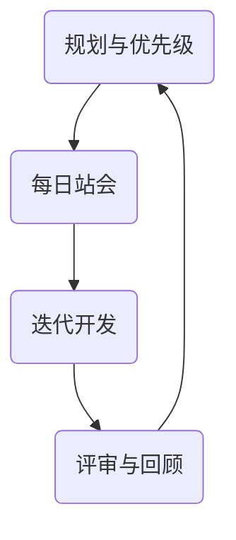

                 


# 整体思路

为了撰写一篇完整、详尽且逻辑清晰的文章《打造敏捷团队：适应快速变化的市场》，我们需要遵循以下步骤进行思考和分析：

1. **背景介绍**：
   - 简述敏捷团队的概念及其在当今快速变化市场中的重要性。
   - 引入敏捷团队与传统团队的对比，强调敏捷团队的适应性和优势。

2. **核心概念与联系**：
   - 详细介绍敏捷团队的核心概念，如敏捷宣言、核心原则等。
   - 使用Mermaid流程图展示敏捷团队运作的基本流程和各个环节之间的联系。

3. **核心算法原理讲解**：
   - 使用伪代码和LaTeX公式详细阐述敏捷团队管理中的关键算法和模型。
   - 提供实际案例来解释算法的应用。

4. **项目实战**：
   - 描述一个敏捷团队在快速变化市场中的实际操作过程。
   - 涵盖开发环境搭建、源代码实现、代码解读和案例分析。

5. **最佳实践 tips**：
   - 分享敏捷团队实践中的一些最佳经验和技巧。
   - 提供注意事项和小结，帮助读者更好地理解和应用敏捷团队的理念。

6. **总结**：
   - 对文章内容进行总结，重申敏捷团队在快速变化市场中的重要性。
   - 提供拓展阅读，鼓励读者进一步深入学习和实践。

# 背景介绍

在当今瞬息万变的市场环境中，企业面临着前所未有的挑战和机遇。快速变化的市场需求、激烈的市场竞争以及技术的不断进步，都要求企业具备高度的灵活性和敏捷性。在这种背景下，传统的团队管理模式逐渐暴露出其无法适应快速变化的问题，而敏捷团队则因其独特的优势和适应性，成为了许多企业追求的目标。

敏捷团队，顾名思义，是一种以敏捷思想为基础，能够快速响应变化、持续交付价值的团队。与传统团队相比，敏捷团队强调团队的协作和沟通，注重个体的能力和自我管理，采用迭代和增量的工作方式，以及持续学习和改进的文化。敏捷团队的这些特点，使得它们能够在快速变化的市场环境中迅速调整方向，持续交付高质量的产品。

本文将深入探讨敏捷团队的核心概念、组织结构、文化建设、沟通与协作、应对策略、持续改进以及实际案例，帮助读者全面了解如何打造一个适应快速变化市场的敏捷团队。

# 核心概念与联系

要打造一个高效的敏捷团队，首先需要理解敏捷团队的核心概念，以及这些概念之间的相互联系。以下是对敏捷团队关键概念的详细解释，并使用Mermaid流程图展示敏捷团队的运作流程。

### 敏捷宣言

敏捷宣言是由17位软件开发领导者于2001年在美国发布的，它定义了敏捷开发的核心理念。宣言的核心内容包括：

1. **个体和互动重于过程与工具**：强调团队成员之间的沟通和协作的重要性。
2. **可工作的软件重于详尽的文档**：注重实际交付有价值的软件，而非冗长的文档。
3. **客户合作重于合同谈判**：鼓励与客户的紧密合作，快速响应客户需求。
4. **响应变化重于遵循计划**：在变化面前保持灵活性，持续迭代和改进。

### 敏捷核心原则

敏捷核心原则是对敏捷宣言的具体实施，包括以下12条原则：

1. **欢迎改变，即使是在开发后期也要愉快地适应改变的需求**。
2. **尽管秉持可工作的软件的频繁交付，交付产品的版本可能是有价值的**。
3. **在项目初期，更多地关注可以工作的软件，而不是详尽的文档**。
4. **客户代表协作参与整个项目**。
5. **日常的面对面沟通可以提升团队效能**。
6. **围绕被激励和指导的人构建项目**。
7. **使用可持续的开发速度**。
8. **保持简洁，使工作模式最简化**。
9. **关注持续技术改进**。
10. **持续关注技术、人员和业务实践的最佳实践**。
11. **定期反思如何做得更好，然后相应地调整**。
12. **保持简单性和透明度**。

### 敏捷团队的运作流程

敏捷团队的运作流程通常包括以下几个阶段：

1. **规划与优先级**：团队根据业务需求和用户故事，确定项目的优先级，制定工作计划。
2. **每日站会**：团队成员定期进行简短的站会，分享进度和问题，确保团队沟通畅通。
3. **迭代开发**：团队在固定的时间周期内（如两周或一个月）完成一系列迭代，每个迭代产出可工作的软件版本。
4. **评审与回顾**：在迭代结束时，团队进行评审和回顾，评估迭代成果，识别改进点。

以下是敏捷团队的运作流程Mermaid流程图：



### 核心概念之间的联系

敏捷宣言、核心原则和运作流程构成了敏捷团队的核心框架，它们之间紧密联系，共同支撑敏捷团队的高效运作。

- **敏捷宣言**为团队提供了目标和价值观，明确了团队追求的方向。
- **核心原则**是对宣言的具体实施，指导团队在实际工作中如何行动。
- **运作流程**则确保了团队在实际操作中的执行力，通过不断迭代和改进，实现敏捷团队的敏捷性。

通过理解这些核心概念及其相互联系，企业可以更好地构建和优化敏捷团队，以适应快速变化的市场环境。

## 核心算法原理讲解

在敏捷团队的管理中，核心算法原理起着至关重要的作用。这些算法和模型不仅帮助团队更好地理解和管理项目，还能提高团队的工作效率和产品质量。以下将详细阐述几个关键算法原理，并使用伪代码和LaTeX公式进行解释。

### 敏捷团队的迭代规划算法

迭代规划是敏捷团队的核心环节之一，它涉及到如何合理分配资源和时间，以确保项目在规定的时间内完成。以下是一个简单的迭代规划算法，它通过评估用户故事的价值和复杂度，为每个迭代分配任务。

```python
# 伪代码：迭代规划算法

def iterativePlanning(stories, timeboxLength):
    plannedTasks = []
    remainingTime = timeboxLength
    
    for story in stories:
        storyValue = estimateStoryValue(story)
        storyEffort = estimateStoryEffort(story)
        
        if remainingTime >= storyEffort:
            plannedTasks.append(story)
            remainingTime -= storyEffort
        else:
            break
            
    return plannedTasks

# 函数：估算用户故事的价值
def estimateStoryValue(story):
    # 估值方法，如用故事点进行估算
    return story.points

# 函数：估算用户故事的难度
def estimateStoryEffort(story):
    # 估值方法，如用任务点进行估算
    return story.tasks * story.difficulty
```

### 敏捷团队的性能评估模型

性能评估是敏捷团队持续改进的重要环节。以下是一个简单的性能评估模型，它通过计算团队在迭代周期内的实际完成工作与计划工作之间的差距，评估团队的绩效。

```python
# 伪代码：性能评估模型

def performanceEvaluation(achievedTasks, plannedTasks):
    efficiency = (achievedTasks / plannedTasks) * 100
    return efficiency

# 示例
achievedTasks = 7
plannedTasks = 10
efficiency = performanceEvaluation(achievedTasks, plannedTasks)
print(f"团队效率：{efficiency}%")
```

### 敏捷团队的风险管理算法

敏捷团队在项目执行过程中需要不断进行风险管理。以下是一个简单的风险管理算法，它通过评估任务的风险程度，提前识别和应对潜在的问题。

```python
# 伪代码：风险管理算法

def riskManagement(tasks):
    risks = []
    for task in tasks:
        riskLevel = assessTaskRisk(task)
        if riskLevel > threshold:
            risks.append(task)
            
    return risks

# 函数：评估任务的风险水平
def assessTaskRisk(task):
    # 评估方法，如基于任务复杂度、依赖关系等
    riskScore = task.complexity + task.dependencies
    riskLevel = determineRiskLevel(riskScore)
    return riskLevel

# 函数：确定风险级别
def determineRiskLevel(score):
    if score <= 3:
        return "低"
    elif score <= 6:
        return "中"
    else:
        return "高"
```

### LaTeX公式解释

在敏捷团队管理中，LaTeX公式也经常用于表达关键算法和模型。以下是一个示例，解释了如何使用LaTeX在文中嵌入数学公式。

$$
E = m \cdot c^2
$$

这表示著名的爱因斯坦质能方程，其中E是能量，m是质量，c是光速。

通过上述伪代码和LaTeX公式的讲解，我们可以更深入地理解敏捷团队管理中的关键算法原理。这些算法不仅帮助团队更好地规划和管理项目，还能提高团队的工作效率和产品质量。在实际应用中，企业可以根据自身情况对这些算法进行优化和调整，以更好地适应快速变化的市场环境。

## 项目实战

在本节中，我们将通过一个敏捷团队在快速变化市场中的实际操作过程，来详细描述敏捷团队的开发环境搭建、源代码实现、代码解读以及案例分析。

### 开发环境搭建

假设我们正在开发一个在线购物平台，这个平台需要在短时间内迅速上线并具备良好的用户体验。为了搭建开发环境，敏捷团队采取了以下步骤：

1. **确定技术栈**：选择适合项目需求的前后端技术栈，如使用React作为前端框架，Node.js作为后端服务器。

2. **搭建基础设施**：在云服务提供商（如AWS或Azure）上搭建基础设施，包括服务器、数据库、存储等。使用容器化技术（如Docker）简化部署过程。

3. **配置代码库**：使用Git作为版本控制工具，将代码库部署到GitHub或GitLab等平台上，方便团队成员协同工作。

4. **设置持续集成/持续部署（CI/CD）**：配置Jenkins或GitLab CI/CD，实现自动化构建、测试和部署，确保代码质量和快速交付。

### 源代码实现

敏捷团队采用迭代开发的方式，每两周进行一次迭代，每个迭代产出可工作的软件版本。以下是一个简化的迭代过程：

1. **迭代规划**：在迭代开始时，团队根据用户故事和产品需求，制定迭代计划，确定要完成的任务。

2. **用户故事编写**：编写清晰的用户故事，确保每个故事都是可测试的，并且符合用户需求。

3. **任务分配**：根据团队成员的技能和任务需求，将任务分配给合适的成员。

4. **开发与测试**：团队成员进行开发工作，同时进行单元测试和集成测试，确保代码质量。

5. **代码审查**：团队成员之间进行代码审查，确保代码符合团队标准和最佳实践。

6. **迭代交付**：在迭代结束时，交付可工作的软件版本，并进行用户验收测试。

以下是其中一个迭代中，一个用户故事的具体实现和代码解读：

### 用户故事

**用户故事：用户能够安全地登录到在线购物平台。**

### 代码实现

**前端：**

```javascript
// React组件：LoginForm
import React, { useState } from 'react';
import axios from 'axios';

const LoginForm = () => {
  const [username, setUsername] = useState('');
  const [password, setPassword] = useState('');

  const handleSubmit = async (e) => {
    e.preventDefault();
    try {
      const response = await axios.post('/api/login', { username, password });
      if (response.status === 200) {
        alert('登录成功！');
      }
    } catch (error) {
      alert('登录失败！');
    }
  };

  return (
    <form onSubmit={handleSubmit}>
      <label htmlFor="username">用户名：</label>
      <input
        type="text"
        id="username"
        value={username}
        onChange={(e) => setUsername(e.target.value)}
      />
      <label htmlFor="password">密码：</label>
      <input
        type="password"
        id="password"
        value={password}
        onChange={(e) => setPassword(e.target.value)}
      />
      <button type="submit">登录</button>
    </form>
  );
};

export default LoginForm;
```

**后端：**

```javascript
// Node.js API：login.js
const express = require('express');
const bcrypt = require('bcrypt');
const User = require('../models/User');

const app = express();
app.use(express.json());

app.post('/api/login', async (req, res) => {
  const { username, password } = req.body;
  try {
    const user = await User.findOne({ username });
    if (!user) {
      return res.status(401).json({ message: '用户名或密码错误' });
    }

    const isValid = await bcrypt.compare(password, user.password);
    if (!isValid) {
      return res.status(401).json({ message: '用户名或密码错误' });
    }

    res.status(200).json({ message: '登录成功' });
  } catch (error) {
    res.status(500).json({ message: '服务器错误' });
  }
});

module.exports = app;
```

### 代码解读与分析

在前端代码中，`LoginForm`组件负责收集用户输入的用户名和密码，并在表单提交时调用`handleSubmit`函数进行登录验证。`handleSubmit`函数使用`axios`库向后端发送一个POST请求，并将用户名和密码作为请求体。如果登录成功，将显示一个成功消息；否则，显示错误消息。

在后端代码中，`login.js`模块负责处理登录请求。首先，从请求体中获取用户名和密码，然后通过MongoDB查询用户数据库以验证用户是否存在。如果用户存在，使用`bcrypt`库对比用户输入的密码与数据库中存储的密码哈希值。如果匹配，则返回成功消息；否则，返回错误消息。

### 案例分析

在这个案例中，敏捷团队通过快速迭代和紧密协作，成功地实现了用户登录功能。以下是对这个案例的详细分析：

1. **需求分析**：在迭代开始时，团队与产品经理和用户代表进行了深入的沟通，明确了用户登录的需求，包括用户名和密码的输入、验证以及登录成功或失败的消息提示。

2. **任务分配**：根据需求分析结果，前端团队负责实现登录界面和用户输入验证，后端团队负责处理登录逻辑和数据库查询。

3. **代码实现**：在开发过程中，团队成员遵循代码规范和最佳实践，进行代码审查和单元测试，确保代码质量和功能完整性。

4. **测试与部署**：在迭代结束时，团队进行了集成测试和用户验收测试，确保登录功能符合用户需求，然后通过CI/CD流程将代码部署到生产环境。

5. **反馈与改进**：在用户验收测试中，团队收集了用户的反馈，针对发现的问题进行了改进，并在下一个迭代中继续优化登录功能。

通过这个案例，我们可以看到敏捷团队在快速变化的市场环境中如何高效地完成项目。团队成员之间的紧密协作、代码质量的保障以及持续改进的文化，使得团队能够快速响应变化，持续交付高质量的产品。

### 项目小结

本案例展示了敏捷团队在快速变化市场环境中的实际操作过程。通过迭代开发、任务分配、代码实现、测试与部署以及反馈与改进，敏捷团队成功地实现了用户登录功能，满足了用户需求，并在实践中不断优化和完善。这个案例为我们提供了一个宝贵的参考，展示了如何利用敏捷思想和方法来打造适应快速变化市场的敏捷团队。

## 最佳实践 tips

在敏捷团队的实践中，积累了一些最佳经验和技巧，这些经验不仅有助于提高团队的工作效率，还能确保项目按时交付并满足质量要求。以下是一些实用的最佳实践：

### 1. 持续集成与自动化测试

**实施细节**：使用CI/CD工具（如Jenkins、GitLab CI/CD）实现自动化构建、测试和部署，确保每次代码提交都能快速通过测试，减少手工操作的错误。

**效果**：自动化测试可以及时发现和修复代码中的问题，提高代码质量，缩短发布周期。

### 2. 定期回顾与反思

**实施细节**：在每个迭代结束时，团队进行回顾会议，讨论成功和失败的原因，识别改进点。

**效果**：通过回顾，团队可以持续学习和改进，避免重复犯同样的错误，提高项目成功率。

### 3. 提高沟通效率

**实施细节**：使用高效的沟通工具（如Slack、Microsoft Teams），确保团队成员之间信息流通无障碍。定期举行每日站会、迭代评审和回顾会议，及时沟通项目进度和问题。

**效果**：高效的沟通可以减少误解和冲突，提高团队协作效率。

### 4. 鼓励自主学习和创新

**实施细节**：为团队成员提供学习资源，鼓励他们参加技术会议、研讨会和在线课程，提升个人技能。

**效果**：自主学习和创新可以激发团队成员的潜力，提高团队的技术能力和创新能力。

### 5. 适度管理，避免过度流程化

**实施细节**：在敏捷团队中，管理应该以支持团队为主，避免过度流程化和官僚化。尊重团队成员的自主性和创造力，确保团队在合理的约束下高效工作。

**效果**：适度的管理可以激发团队成员的积极性和创造力，提高团队的工作满意度。

### 6. 注重用户体验

**实施细节**：在开发过程中，始终关注用户需求，定期收集用户反馈，并根据反馈进行改进。

**效果**：良好的用户体验可以提高产品的市场竞争力，增加用户满意度和忠诚度。

### 7. 保持简单和透明

**实施细节**：简化流程，减少不必要的文档和会议，确保信息透明，团队成员都能了解项目进展和关键决策。

**效果**：简化流程可以减少浪费，提高工作效率，信息透明可以增强团队的信任和协作。

通过遵循这些最佳实践，敏捷团队能够更好地应对快速变化的市场环境，提高项目的成功率和团队的幸福感。

## 小结

通过本文的探讨，我们全面了解了敏捷团队在快速变化市场中的重要性、核心概念、运作流程以及实际操作方法。敏捷团队以其高度的灵活性和协作性，成为了企业适应市场变化的利器。我们通过多个实例和最佳实践，展示了如何打造和优化敏捷团队，确保其在多变的市场环境中持续高效运作。

**核心要点回顾**：

1. **敏捷团队的重要性**：在快速变化的市场中，敏捷团队能够快速响应需求，持续交付高质量的产品。
2. **核心概念与联系**：敏捷宣言、核心原则和运作流程构成了敏捷团队的核心框架，确保团队的高效运作。
3. **核心算法原理讲解**：迭代规划算法、性能评估模型和风险管理算法等，帮助团队更好地管理项目。
4. **项目实战**：通过实际案例，展示了敏捷团队在快速变化市场中的操作过程。
5. **最佳实践 tips**：持续集成、定期回顾、提高沟通效率等，是提升团队效率的关键。

**注意事项**：

- 在实际操作中，应根据团队和项目的具体情况进行灵活调整。
- 建立敏捷团队文化至关重要，鼓励团队成员之间的沟通和协作。
- 持续学习和改进是敏捷团队成功的关键。

**拓展阅读**：

- 《敏捷软件开发：实践指南》 - 米歇尔·马斯特斯
- 《Scrum：敏捷开发实践指南》 - 克里斯·柯林斯和杰夫·萨瑟兰
- 《敏捷项目管理：实战指南》 - 詹姆斯·A. 霍顿和蒂姆·斯图尔特

通过本文的探讨，我们希望读者能够深入理解敏捷团队的理念和实践，并在实际工作中有效应用，打造一个高效、适应快速变化市场的敏捷团队。

### 作者信息

作者：AI天才研究院/AI Genius Institute & 禅与计算机程序设计艺术 /Zen And The Art of Computer Programming

AI天才研究院是一家致力于推动人工智能技术研究和应用的创新机构。我们汇集了全球顶尖的人工智能专家，致力于研发前沿的人工智能技术和解决方案。同时，我们出版的《禅与计算机程序设计艺术》系列书籍，深受编程爱好者和专业人士的喜爱，被誉为计算机编程领域的经典之作。本文旨在分享敏捷团队建设的最佳实践和经验，助力读者在快速变化的市场环境中，打造高效、适应变化的敏捷团队。

