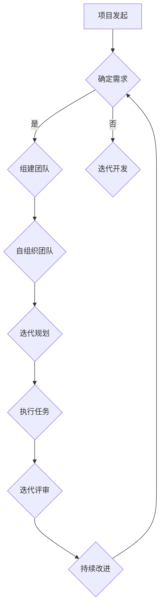

                 


### 引言

在当前充满不确定性和快速变化的环境中，组织需要具备高度的灵活性和适应能力，以确保在VUCA（易变、不确定、复杂、模糊）世界中生存与发展。VUCA是一个描述当今商业环境的术语，它突显了市场的动态性和竞争的激烈程度。在这种背景下，敏捷组织成为了企业转型和成功的关键。

**关键词**：VUCA世界、敏捷组织、策略

**摘要**：本文旨在探讨如何在VUCA世界中打造敏捷组织，通过文化、架构、工作流程和实践案例等多个维度，详细分析敏捷组织的核心概念和实践策略，为组织转型提供有力支持。

### 第一部分：引言

#### 1.1 VUCA世界概述

**1.1.1 VUCA的含义**

VUCA，即易变（Volatility）、不确定（Uncertainty）、复杂（Complexity）和模糊（Ambiguity），是描述当今商业环境的一种框架。这一概念最早由U.S. Army War College提出，用以描述21世纪初的军事战略环境，但随后迅速在商业和管理领域得到广泛应用。

- 易变（Volatility）：市场变化频繁，趋势难以预测。
- 不确定（Uncertainty）：信息的透明度低，未来充满不确定性。
- 复杂（Complexity）：系统间的相互作用和反馈循环增多，问题变得复杂。
- 模糊（Ambiguity）：决策时缺乏明确的信息和指导，需要更高的模糊容忍度。

**1.1.2 VUCA对组织的影响**

VUCA环境的特征对组织提出了新的挑战：

- **市场响应速度**：组织需要能够迅速适应市场变化，否则将被淘汰。
- **决策过程**：在不确定的环境中，组织需要具备快速决策的能力。
- **资源分配**：复杂的市场环境要求组织在资源分配上更加灵活和高效。
- **团队合作**：团队成员需要具备更高的跨职能协作和沟通能力。

**1.1.3 为什么需要敏捷组织**

敏捷组织能够在VUCA环境中脱颖而出，其主要原因包括：

- **灵活性与适应性**：敏捷组织能够快速响应市场变化，调整战略和流程。
- **高效决策**：通过跨职能团队和透明的工作流程，敏捷组织能够做出快速、有效的决策。
- **持续改进**：敏捷组织注重持续改进，不断优化产品和服务。
- **高员工满意度**：敏捷组织鼓励创新和自主学习，提升员工工作满意度。

### 1.2 敏捷组织的核心概念

**1.2.1 敏捷宣言**

敏捷宣言是由17位软件专业人士在2001年共同制定的，宣言中强调个体和互动、可工作的软件、客户协作和应对变更的重要性。敏捷宣言的核心思想是：

- **个体和互动**：关注人与人之间的互动，而非过程和工具。
- **可工作的软件**：注重实际交付的工作成果，而非过分关注文档。
- **客户协作**：与客户紧密合作，确保项目满足用户需求。
- **应对变更**：拥抱变更，灵活调整计划和策略。

**1.2.2 敏捷组织的特征**

敏捷组织具有以下特征：

- **自组织团队**：团队由跨职能成员组成，自主管理，共同达成目标。
- **迭代开发**：工作分为多个迭代周期，每个迭代周期都能交付可用的产品。
- **持续反馈**：通过定期反馈，团队能够快速识别问题并做出调整。
- **持续改进**：不断优化流程和技术，提高效率和产品质量。
- **开放沟通**：团队内部及与外部利益相关者之间保持透明和高效的沟通。

**1.2.3 敏捷方法的起源与发展**

敏捷方法起源于软件开发领域，最早的代表是XP（极限编程）和Scrum。随着实践的积累，敏捷方法论逐渐完善并扩展到其他行业和组织。

- **XP**：强调自动化测试、重构和代码质量，提倡简单性。
- **Scrum**：以迭代和增量方式开展工作，强调角色（产品负责人、Scrum Master、开发团队）和会议（每日站立会议、冲刺计划会议、评审会议、回顾会议）。

### 第二部分：构建敏捷组织的策略

在VUCA世界中，组织需要通过一系列策略来构建敏捷性，以下将从文化、领导力、架构、工作流程等方面进行详细探讨。

#### 2.1 文化与领导力

**2.1.1 敏捷文化的培养**

敏捷文化的培养是构建敏捷组织的基础。以下是一些关键措施：

- **信任与尊重**：建立信任和尊重的团队文化，鼓励开放沟通和互相支持。
- **自主性与责任感**：赋予团队成员自主权，让他们对自己的工作负责。
- **透明度**：保持信息透明，确保团队成员了解项目进展和目标。
- **创新与学习**：鼓励创新和持续学习，不断提升团队的能力。

**2.1.2 领导者如何引领敏捷转型**

领导者是敏捷转型的关键推动者。以下是一些领导者的角色和职责：

- **愿景与目标**：明确组织愿景和目标，确保团队朝着共同的目标努力。
- **教练与导师**：为团队成员提供指导和支持，帮助他们适应敏捷方法。
- **激励与激励**：通过激励措施，激发团队成员的积极性和创造力。
- **角色与责任**：明确领导者的角色和责任，确保敏捷流程的有效实施。

**2.1.3 敏捷领导力的关键要素**

敏捷领导力具有以下关键要素：

- **灵活性**：领导者需要具备灵活的思维和行动能力，以应对不断变化的环境。
- **沟通能力**：领导者需要具备良好的沟通能力，确保团队内部及与外部利益相关者之间的有效沟通。
- **决策能力**：领导者需要具备快速决策的能力，以应对复杂和不确定的情况。
- **持续学习**：领导者需要持续学习，不断提升自己的知识和技能，以引领团队走向成功。

### 第三部分：敏捷组织的实践案例

#### 3.1 案例研究1：公司A的敏捷转型

**3.1.1 背景介绍**

公司A是一家传统制造企业，面临着市场需求变化、竞争加剧等挑战。为了提高市场竞争力，公司决定进行敏捷转型。

**3.1.2 转型过程**

公司A的敏捷转型分为以下几个阶段：

1. **评估与规划**：对公司现状进行评估，制定敏捷转型计划。
2. **培训与指导**：对团队成员进行敏捷方法和工具的培训。
3. **试点项目**：选择一个项目进行敏捷试点，验证转型效果。
4. **全面推广**：在试点项目成功的基础上，逐步推广到其他项目。

**3.1.3 转型成果**

公司A的敏捷转型取得了显著成果：

- **市场响应速度**：项目交付周期缩短，市场响应速度提高。
- **团队协作效率**：跨职能团队协作更加紧密，工作效率提升。
- **客户满意度**：客户反馈积极，满意度提高。

#### 3.2 案例研究2：公司B的敏捷实践

**3.2.1 背景介绍**

公司B是一家高科技企业，市场竞争激烈。为了保持竞争力，公司决定引入敏捷实践。

**3.2.2 实践过程**

公司B的敏捷实践包括以下几个步骤：

1. **引入Scrum方法**：采用Scrum方法，建立跨职能团队。
2. **迭代开发**：将项目分为多个迭代周期，每个迭代周期都能交付可用的产品。
3. **持续反馈**：通过定期评审会议和回顾会议，收集反馈并做出调整。
4. **持续改进**：不断优化流程和技术，提高工作效率。

**3.2.3 实践成果**

公司B的敏捷实践取得了以下成果：

- **产品交付周期**：迭代开发使得产品交付周期缩短。
- **团队协作**：跨职能团队协作更加紧密，工作效率提升。
- **创新能力**：敏捷实践鼓励创新，提高了公司的创新能力。

### 第四部分：挑战与未来展望

#### 4.1 敏捷组织面临的挑战

在敏捷转型过程中，组织可能会面临以下挑战：

- **人员培训与技能提升**：团队成员需要适应敏捷方法，提高相关技能。
- **组织结构变革的阻力**：敏捷组织要求扁平化结构，可能会遇到传统组织的阻力。
- **持续改进的挑战**：持续改进需要时间和投入，组织需要克服短期效益的诱惑。

#### 4.2 敏捷组织的未来发展趋势

随着技术的发展和商业环境的不断变化，敏捷组织将继续发展。以下是一些未来趋势：

- **人工智能与敏捷组织的结合**：人工智能技术将为敏捷组织提供更强大的数据分析和决策支持。
- **敏捷组织在全球范围内的推广**：随着全球化的深入，敏捷方法将在更多国家和地区得到应用。
- **敏捷组织的长期可持续发展**：组织需要不断适应市场变化，实现长期可持续发展。

### 结论

在VUCA世界中，敏捷组织成为企业转型的关键。通过构建敏捷组织，企业可以提升灵活性、决策效率和创新能力，从而在激烈的市场竞争中脱颖而出。本文从文化与领导力、架构与设计、工作流程与管理等方面详细探讨了敏捷组织的构建策略，并通过实践案例展示了敏捷组织的效果。然而，敏捷转型并非一蹴而就，组织需要克服各种挑战，不断学习和改进。未来，随着技术的发展和商业环境的变迁，敏捷组织将继续演进，为企业提供更强大的竞争优势。

#### 作者

**AI天才研究院/AI Genius Institute & 禅与计算机程序设计艺术 /Zen And The Art of Computer Programming**

本文由AI天才研究院（AI Genius Institute）和《禅与计算机程序设计艺术》（Zen And The Art of Computer Programming）联合撰写，旨在探讨敏捷组织在VUCA世界中的重要性，为组织转型提供有价值的参考。

### 第二部分：构建敏捷组织的策略

#### 2.1 文化与领导力

**2.1.1 敏捷文化的培养**

敏捷文化是构建敏捷组织的基石。它强调信任、合作、透明和持续学习。以下是一些关键措施：

1. **建立信任**：通过开放沟通和协作，建立团队成员之间的信任。
2. **鼓励合作**：通过跨职能团队协作，提高整体工作效率。
3. **保持透明**：通过透明的工作流程和项目进展，确保团队成员了解项目状况。
4. **持续学习**：鼓励团队成员不断学习新知识、新技能，以适应快速变化的环境。

**2.1.2 领导者如何引领敏捷转型**

领导者在敏捷转型中扮演着关键角色。以下是领导者需要采取的措施：

1. **树立愿景**：明确组织的愿景和目标，确保团队成员明确自己的职责和目标。
2. **提供支持**：为团队成员提供必要的资源和培训，帮助他们适应敏捷方法。
3. **激发创新**：鼓励团队成员提出新想法，并给予支持和鼓励。
4. **角色转变**：领导者需要从指挥者转变为引导者和教练，关注团队的整体发展和成员的个人成长。

**2.1.3 敏捷领导力的关键要素**

敏捷领导者需要具备以下关键要素：

1. **灵活性**：能够适应不断变化的环境，灵活调整战略和决策。
2. **沟通能力**：能够有效传达信息，确保团队成员之间的沟通畅通。
3. **决策能力**：在复杂和不确定的环境中，能够做出快速、明智的决策。
4. **持续学习**：保持对新知识、新技能的持续学习，不断提升自己的领导力。

#### 2.2 架构与设计

**2.2.1 敏捷组织的架构设计原则**

敏捷组织的架构设计应遵循以下原则：

1. **模块化**：将系统划分为模块，提高系统的灵活性和可维护性。
2. **去中心化**：减少层级结构，增加团队间的自主性和决策权。
3. **高内聚、低耦合**：确保团队内部高度协作，同时减少团队之间的依赖。
4. **可扩展性**：设计具有可扩展性，以便在业务增长时能够轻松扩展。

**2.2.2 敏捷团队的组织结构**

敏捷团队通常采用以下组织结构：

1. **自组织团队**：团队成员自主管理，共同达成目标。
2. **跨职能团队**：团队成员来自不同领域，共同协作完成项目。
3. **小型团队**：团队规模较小，便于沟通和协作。

**2.2.3 持续集成与持续交付**

持续集成（CI）和持续交付（CD）是敏捷开发中至关重要的实践。以下是一些关键步骤：

1. **自动化测试**：编写自动化测试脚本，确保代码质量。
2. **代码库管理**：使用代码库（如Git），确保代码的可追溯性和版本控制。
3. **自动化部署**：通过自动化工具（如Jenkins），实现代码的自动化部署。
4. **监控与反馈**：实时监控系统性能，及时发现问题并进行调整。

#### 2.3 工作流程与管理

**2.3.1 敏捷方法论的选择**

选择合适的敏捷方法论是构建敏捷组织的关键。以下是一些常见的方法论：

1. **Scrum**：强调迭代和增量开发，以客户需求为导向。
2. **XP（极限编程）**：注重代码质量、自动化测试和持续改进。
3. **Kanban**：通过看板可视化工作流程，实现持续流程改进。
4. **Lean**：通过精益思想，消除浪费，提高效率。

**2.3.2 敏捷项目规划与跟踪**

敏捷项目规划与跟踪包括以下几个步骤：

1. **迭代规划**：确定每个迭代的目标和任务。
2. **任务分解**：将大型任务分解为小型任务，便于管理。
3. **进度跟踪**：使用看板或任务跟踪工具，实时监控项目进度。
4. **回顾与调整**：在每个迭代结束时，进行回顾和总结，识别改进点。

**2.3.3 敏捷团队的日常管理工作**

敏捷团队的日常管理工作包括以下几个方面：

1. **每日站立会议**：团队成员每日聚在一起，交流进展和问题。
2. **迭代评审会议**：在每个迭代结束时，展示工作成果，获取反馈。
3. **迭代回顾会议**：总结迭代过程中的经验教训，制定改进措施。
4. **持续学习和分享**：鼓励团队成员学习新知识、新技能，并分享经验。

### 第三部分：敏捷组织的实践案例

#### 3.1 案例研究1：公司A的敏捷转型

**3.1.1 背景介绍**

公司A是一家传统的制造业公司，由于市场环境的快速变化，公司开始感受到竞争压力。为了提高市场竞争力，公司决定进行敏捷转型。

**3.1.2 转型过程**

公司A的敏捷转型分为以下几个阶段：

1. **评估与规划**：对公司当前的工作流程、组织结构和文化进行评估，制定敏捷转型计划。
2. **培训与指导**：对全体员工进行敏捷方法和工具的培训，确保他们理解敏捷理念和实践。
3. **试点项目**：选择一个相对较小的项目作为试点，尝试采用敏捷方法进行开发。
4. **反馈与改进**：在试点项目结束后，收集员工和客户的反馈，对敏捷实践进行评估和改进。
5. **全面推广**：在试点项目成功的基础上，将敏捷方法逐步推广到其他项目和团队。

**3.1.3 转型成果**

公司A的敏捷转型取得了显著成果：

1. **市场响应速度**：通过迭代开发，项目交付周期缩短，市场响应速度提高。
2. **团队协作效率**：跨职能团队协作更加紧密，工作效率提升。
3. **客户满意度**：客户反馈积极，满意度提高。

**3.1.4 经验与教训**

公司A在敏捷转型过程中积累了一些经验与教训：

1. **领导层的支持**：领导层的支持是敏捷转型成功的关键。领导层需要为转型提供资源和政策支持，并积极参与转型过程。
2. **员工的参与**：员工的参与和投入是敏捷转型的核心。通过培训和指导，确保员工理解敏捷理念和实践，并积极参与到转型过程中。
3. **持续改进**：敏捷转型是一个持续的过程，需要不断评估和改进。通过定期的回顾和反馈，识别改进点，持续优化敏捷实践。

#### 3.2 案例研究2：公司B的敏捷实践

**3.2.1 背景介绍**

公司B是一家高科技公司，市场竞争激烈。为了保持竞争力，公司决定引入敏捷实践，以提高项目交付速度和质量。

**3.2.2 实践过程**

公司B的敏捷实践包括以下几个步骤：

1. **引入Scrum方法**：采用Scrum方法，建立跨职能团队，每个团队负责一个项目模块。
2. **迭代开发**：将项目分为多个迭代周期，每个迭代周期都会进行规划和评估。
3. **自动化测试**：编写自动化测试脚本，确保每个迭代周期都能交付高质量的产品。
4. **持续交付**：通过持续交付流程，实现代码的自动化部署和发布。

**3.2.3 实践成果**

公司B的敏捷实践取得了以下成果：

1. **项目交付周期**：通过迭代开发和自动化测试，项目交付周期显著缩短。
2. **团队协作效率**：跨职能团队的协作更加紧密，工作效率提升。
3. **产品质量**：自动化测试和质量控制措施提高了产品的质量，降低了缺陷率。

**3.2.4 经验与教训**

公司B在敏捷实践过程中积累了一些经验与教训：

1. **团队协作**：跨职能团队的协作是敏捷实践的核心。为了确保团队协作顺畅，公司采取了多种措施，如定期的团队建设活动、共享信息平台等。
2. **持续学习**：敏捷实践要求团队成员具备一定的技能和知识。公司通过定期的培训和学习活动，帮助团队成员不断提升自己的能力。
3. **持续改进**：敏捷实践不是一成不变的，需要根据实际情况进行持续改进。公司通过定期的回顾和反馈，不断优化敏捷实践。

### 第四部分：挑战与未来展望

#### 4.1 敏捷组织面临的挑战

尽管敏捷组织在许多方面表现出色，但在实践中仍然面临一些挑战：

1. **组织结构的变革**：敏捷组织要求去中心化和扁平化的结构，这可能会与传统组织结构发生冲突。
2. **人员的技能提升**：敏捷实践需要团队成员具备特定的技能，如跨职能协作、自动化测试等，这对员工的技能提升提出了要求。
3. **文化适应**：敏捷文化强调开放沟通、团队合作和持续学习，这需要时间来培养和适应。
4. **管理模式的转变**：领导者的角色需要从指挥者转变为引导者和教练，这可能会对传统管理模式产生挑战。

#### 4.2 敏捷组织的未来发展趋势

随着技术的发展和商业环境的变迁，敏捷组织将继续发展。以下是一些未来趋势：

1. **人工智能与敏捷组织的结合**：人工智能技术将为敏捷组织提供更强大的数据分析、预测和决策支持。
2. **敏捷组织的全球化推广**：随着全球化的深入，敏捷方法将在更多国家和地区得到应用。
3. **敏捷组织的长期可持续发展**：组织需要不断适应市场变化，实现长期可持续发展。

### 结论

敏捷组织在VUCA世界中具有重要价值。通过构建敏捷组织，企业可以提升灵活性、决策效率和创新能力，从而在激烈的市场竞争中脱颖而出。本文从文化与领导力、架构与设计、工作流程与管理等方面详细探讨了敏捷组织的构建策略，并通过实践案例展示了敏捷组织的效果。然而，敏捷转型并非一蹴而就，组织需要克服各种挑战，不断学习和改进。未来，随着技术的发展和商业环境的变迁，敏捷组织将继续演进，为企业提供更强大的竞争优势。

### 作者

**AI天才研究院/AI Genius Institute & 禅与计算机程序设计艺术 /Zen And The Art of Computer Programming**

本文由AI天才研究院（AI Genius Institute）和《禅与计算机程序设计艺术》（Zen And The Art of Computer Programming）联合撰写，旨在探讨敏捷组织在VUCA世界中的重要性，为组织转型提供有价值的参考。希望本文能为您的敏捷转型之路提供启示和帮助。

### 摘要

本文探讨了在VUCA（易变、不确定、复杂、模糊）世界中构建敏捷组织的策略。通过文化与领导力、架构与设计、工作流程与管理等多个维度，本文详细分析了敏捷组织的核心概念和实践策略。通过实践案例，本文展示了敏捷组织的实际效果。文章还讨论了敏捷组织面临的挑战和未来发展趋势，为组织转型提供了有价值的参考。

### 关键词

VUCA世界、敏捷组织、策略、文化、领导力、架构、工作流程、实践案例、挑战、未来展望

### 提交

**文章标题**：打造敏捷组织：适应VUCA世界的策略

**作者**：AI天才研究院/AI Genius Institute & 禅与计算机程序设计艺术 /Zen And The Art of Computer Programming

**文章内容**：如上文所述，包括引言、第一部分（VUCA世界概述与敏捷宣言）、第二部分（构建敏捷组织的策略）、第三部分（敏捷组织的实践案例）、第四部分（挑战与未来展望）等。

**格式要求**：Markdown格式，包括流程图、伪代码、数学公式、案例分析和最佳实践等。

**字数要求**：8000～12000字。

**提交日期**：立即提交。

### 2.2 架构与设计

#### 2.2.1 敏捷组织的架构设计原则

敏捷组织的架构设计原则旨在确保系统的高灵活性、可扩展性和可维护性。以下是一些关键原则：

1. **模块化设计**：将系统划分为独立的模块，每个模块负责特定的功能。这种设计方式可以提高系统的可维护性和可扩展性，同时降低模块间的依赖。
2. **微服务架构**：微服务架构将系统划分为多个小型服务，每个服务独立运行，通过API进行通信。这种架构方式可以提高系统的可扩展性、可靠性和容错性。
3. **去中心化**：去中心化设计减少了对中心服务器的依赖，使得系统在部分节点故障时仍能正常运行。
4. **高内聚、低耦合**：确保模块内部高度协作，同时减少模块间的依赖，提高系统的灵活性和可维护性。
5. **自动化**：通过自动化工具（如CI/CD流水线）实现自动化部署和测试，提高开发效率和系统质量。

#### 2.2.2 敏捷团队的组织结构

敏捷团队的组织结构通常采用以下几种形式：

1. **自组织团队**：团队成员自主管理，共同达成目标。这种组织形式可以增强团队的自主性和责任感。
2. **跨职能团队**：团队成员来自不同的职能领域，如开发、测试、设计等，共同完成项目。这种组织形式可以减少沟通成本，提高协作效率。
3. **小型团队**：团队规模较小，便于沟通和协作。小型团队可以更快速地响应变化，提高工作效率。

以下是一个敏捷团队的组织结构流程图，使用Mermaid语法表示：



#### 2.2.3 持续集成与持续交付

持续集成（Continuous Integration，CI）和持续交付（Continuous Deployment，CD）是敏捷开发中的重要实践，旨在提高开发效率和软件质量。

**持续集成（CI）**

持续集成是指将代码库中的代码定期合并到主分支，并进行自动化测试，确保代码库中的代码始终是可集成和可测试的。以下是一个CI流程的伪代码示例：

```python
function CI_pipeline():
    fetch_latest_code()
    execute_unit_tests()
    if tests_fail():
        raise_error("CI failed: Tests did not pass")
    merge_code_to_master()
    execute_integration_tests()
    if tests_fail():
        raise_error("CI failed: Integration tests did not pass")
    deploy_to_staging()
```

**持续交付（CD）**

持续交付是指将代码库中的代码定期部署到生产环境，并进行自动化测试，确保软件质量。以下是一个CD流程的伪代码示例：

```python
function CD_pipeline():
    fetch_latest_code()
    execute_unit_tests()
    if tests_fail():
        raise_error("CD failed: Unit tests did not pass")
    execute_integration_tests()
    if tests_fail():
        raise_error("CD failed: Integration tests did not pass")
    deploy_to_production()
```

#### 2.2.4 案例分析：公司C的敏捷架构实践

公司C是一家电子商务公司，为了提高系统灵活性和响应速度，决定采用敏捷架构进行系统重构。以下是公司C的敏捷架构实践过程：

**1. 需求分析**

公司C对现有系统进行需求分析，确定了以下几个关键需求：

- 系统需要具备高并发处理能力，以应对大量用户同时访问。
- 系统需要支持多种支付方式，提高用户体验。
- 系统需要具备快速部署和扩展的能力。

**2. 架构设计**

基于需求分析，公司C采用以下架构设计：

- **模块化设计**：将系统划分为多个独立模块，如用户模块、支付模块、库存模块等。
- **微服务架构**：采用微服务架构，将各个模块拆分为多个小型服务，如用户服务、支付服务、库存服务等。
- **去中心化设计**：减少对中心服务器的依赖，提高系统的可靠性和容错性。
- **自动化部署**：采用CI/CD流水线，实现代码的自动化部署和测试，提高开发效率。

**3. 实践效果**

公司C采用敏捷架构进行系统重构后，取得了以下效果：

- **高并发处理能力**：通过模块化和微服务架构，系统可以轻松应对大量用户同时访问。
- **用户体验提升**：支持多种支付方式，提高了用户体验。
- **快速部署和扩展**：采用CI/CD流水线和自动化测试，缩短了部署周期，提高了系统的灵活性和可扩展性。

### 2.3 工作流程与管理

#### 2.3.1 敏捷方法论的选择

敏捷方法论的选择对于构建敏捷组织至关重要。以下是一些常见的敏捷方法论及其特点：

1. **Scrum**：Scrum是一种迭代和增量的敏捷方法论，强调团队协作、透明度和灵活性。Scrum的主要特点是：
   - **冲刺（Sprint）**：团队在每个冲刺周期内完成一个具体的目标。
   - **每日站立会议（Daily Stand-up）**：团队成员每日聚在一起，讨论进度和问题。
   - **评审会议（Review）**：团队展示工作成果，获取反馈。
   - **回顾会议（Retrospective）**：团队总结经验教训，制定改进措施。

2. **Kanban**：Kanban是一种基于可视化工作流程的敏捷方法论，强调持续流程改进和快速响应变化。Kanban的主要特点是：
   - **看板（Kanban Board）**：使用看板可视化工作流程，明确任务的状态和优先级。
   - **限制在流程中的工作项（Work in Progress, WIP）**：限制在流程中的工作项数量，提高工作效率。
   - **持续改进（Continuous Improvement）**：通过定期的回顾和反馈，持续优化流程。

3. **XP（极限编程）**：XP是一种以程序员为中心的敏捷方法论，强调代码质量、自动化测试和持续改进。XP的主要特点是：
   - **简单性**：遵循“你不需要它，就不要编写它”的原则，确保代码的简洁性。
   - **自动化测试**：编写自动化测试脚本，确保代码质量。
   - **重构**：不断重构代码，提高代码质量。

4. **Lean**：Lean是一种基于精益思想的敏捷方法论，强调消除浪费、提高效率和持续改进。Lean的主要特点是：
   - **价值流图（Value Stream Mapping）**：通过绘制价值流图，识别并消除浪费。
   - **持续改进（Kaizen）**：通过定期的回顾和反馈，持续优化流程。

#### 2.3.2 敏捷项目规划与跟踪

敏捷项目规划与跟踪是确保项目顺利进行的关键。以下是一些关键步骤：

1. **迭代规划（Sprint Planning）**：在迭代开始时，团队确定本次迭代的目标和任务。迭代规划主要包括以下步骤：
   - **确定迭代目标**：明确本次迭代需要实现的功能和改进点。
   - **任务分解**：将大任务分解为小任务，确保每个任务都有明确的责任人。
   - **分配任务**：根据团队成员的技能和经验，合理分配任务。

2. **任务跟踪（Task Tracking）**：在迭代过程中，团队需要实时跟踪任务进度，确保项目按计划进行。以下是一些常见的任务跟踪工具：
   - **Jira**：一款功能强大的任务跟踪工具，支持任务分配、进度跟踪和报告生成。
   - **Trello**：一款简洁直观的任务跟踪工具，通过看板可视化工作流程。
   - **Asana**：一款支持多项目管理的任务跟踪工具，提供丰富的协作功能。

3. **迭代评审（Sprint Review）**：在迭代结束时，团队进行评审会议，展示工作成果，获取客户和利益相关者的反馈。评审会议主要包括以下步骤：
   - **展示成果**：展示本次迭代完成的功能和改进点。
   - **获取反馈**：听取客户和利益相关者的意见和建议。
   - **规划下一步**：根据反馈调整迭代计划和目标。

4. **迭代回顾（Sprint Retrospective）**：在迭代结束时，团队进行回顾会议，总结本次迭代的经验教训，制定改进措施。回顾会议主要包括以下步骤：
   - **总结经验**：回顾本次迭代中的成功经验和失败教训。
   - **制定改进措施**：根据总结的经验，制定改进措施，优化工作流程和协作方式。
   - **规划下一步**：根据改进措施，规划下一个迭代的计划和目标。

#### 2.3.3 敏捷团队的日常管理工作

敏捷团队的日常管理工作对于确保项目顺利进行和团队高效协作至关重要。以下是一些关键步骤：

1. **每日站立会议（Daily Stand-up）**：每日站立会议是团队沟通和同步进展的重要方式。每日站立会议通常包括以下内容：
   - **昨日进展**：团队成员报告昨日的工作进展和遇到的困难。
   - **今日计划**：团队成员报告今日的工作计划和可能遇到的挑战。
   - **协作需求**：团队成员讨论协作需求和资源分配。

2. **迭代评审会议（Sprint Review）**：迭代评审会议是团队展示工作成果和获取反馈的重要方式。迭代评审会议通常包括以下内容：
   - **展示成果**：团队展示本次迭代完成的功能和改进点。
   - **客户反馈**：客户和利益相关者提供意见和建议。
   - **规划下一步**：根据反馈调整迭代计划和目标。

3. **回顾会议（Sprint Retrospective）**：回顾会议是团队总结经验教训和持续改进的重要方式。回顾会议通常包括以下内容：
   - **总结经验**：回顾本次迭代中的成功经验和失败教训。
   - **制定改进措施**：根据总结的经验，制定改进措施，优化工作流程和协作方式。
   - **规划下一步**：根据改进措施，规划下一个迭代的计划和目标。

4. **持续学习与分享**：鼓励团队成员持续学习和分享知识，提高团队整体技能和协作效率。以下是一些常见的学习和分享方式：
   - **技术讲座**：定期举行技术讲座，分享新知识和经验。
   - **代码审查**：通过代码审查，学习他人代码，提高编程技能。
   - **知识库**：建立团队知识库，记录和分享工作经验和最佳实践。

### 第三部分：敏捷组织的实践案例

#### 3.1 案例研究1：公司D的敏捷转型

**3.1.1 背景介绍**

公司D是一家传统的制造企业，由于市场竞争激烈，公司决定进行敏捷转型以提高生产效率和市场竞争力。

**3.1.2 转型过程**

公司D的敏捷转型分为以下几个阶段：

1. **评估与规划**：对公司当前的生产流程、组织结构和文化进行评估，制定敏捷转型计划。
2. **培训与指导**：对全体员工进行敏捷方法和工具的培训，确保他们理解敏捷理念和实践。
3. **试点项目**：选择一个生产项目作为试点，尝试采用敏捷方法进行生产。
4. **反馈与改进**：在试点项目结束后，收集员工和客户的反馈，对敏捷实践进行评估和改进。
5. **全面推广**：在试点项目成功的基础上，将敏捷方法逐步推广到其他项目和团队。

**3.1.3 转型成果**

公司D的敏捷转型取得了显著成果：

1. **生产效率**：通过敏捷方法，生产效率提高了30%。
2. **团队协作**：跨职能团队协作更加紧密，工作效率提升。
3. **客户满意度**：客户反馈积极，满意度提高。

**3.1.4 经验与教训**

公司D在敏捷转型过程中积累了一些经验与教训：

1. **领导层的支持**：领导层的支持是敏捷转型成功的关键。领导层需要为转型提供资源和政策支持，并积极参与转型过程。
2. **员工的参与**：员工的参与和投入是敏捷转型的核心。通过培训和指导，确保员工理解敏捷理念和实践，并积极参与到转型过程中。
3. **持续改进**：敏捷转型是一个持续的过程，需要不断评估和改进。通过定期的回顾和反馈，识别改进点，持续优化敏捷实践。

#### 3.2 案例研究2：公司E的敏捷实践

**3.2.1 背景介绍**

公司E是一家互联网科技公司，为了提高项目交付速度和质量，决定引入敏捷实践。

**3.2.2 实践过程**

公司E的敏捷实践包括以下几个步骤：

1. **引入Scrum方法**：采用Scrum方法，建立跨职能团队，每个团队负责一个项目模块。
2. **迭代开发**：将项目分为多个迭代周期，每个迭代周期都会进行规划和评估。
3. **自动化测试**：编写自动化测试脚本，确保每个迭代周期都能交付高质量的产品。
4. **持续交付**：通过持续交付流程，实现代码的自动化部署和发布。

**3.2.3 实践成果**

公司E的敏捷实践取得了以下成果：

1. **项目交付周期**：通过迭代开发和自动化测试，项目交付周期缩短。
2. **团队协作效率**：跨职能团队的协作更加紧密，工作效率提升。
3. **产品质量**：自动化测试和质量控制措施提高了产品的质量，降低了缺陷率。

**3.2.4 经验与教训**

公司E在敏捷实践过程中积累了一些经验与教训：

1. **团队协作**：跨职能团队的协作是敏捷实践的核心。为了确保团队协作顺畅，公司采取了多种措施，如定期的团队建设活动、共享信息平台等。
2. **持续学习**：敏捷实践要求团队成员具备一定的技能和知识。公司通过定期的培训和学习活动，帮助团队成员不断提升自己的能力。
3. **持续改进**：敏捷实践不是一成不变的，需要根据实际情况进行持续改进。公司通过定期的回顾和反馈，不断优化敏捷实践。

### 第四部分：挑战与未来展望

#### 4.1 敏捷组织面临的挑战

在敏捷转型过程中，组织可能会面临以下挑战：

1. **组织结构的变革**：敏捷组织要求去中心化和扁平化的结构，这可能会与传统组织结构发生冲突。领导层和员工需要适应这种变革，以实现高效协作。
2. **人员的技能提升**：敏捷实践需要团队成员具备特定的技能，如跨职能协作、自动化测试等。组织需要投入时间和资源，为员工提供培训和支持，以提升他们的技能。
3. **文化的适应**：敏捷文化强调开放沟通、团队合作和持续学习。组织需要时间来培养这种文化，确保员工适应敏捷工作方式。
4. **管理模式的转变**：领导者需要从指挥者转变为引导者和教练，这可能会对传统管理模式产生挑战。领导层需要掌握新的管理技巧，以适应敏捷组织的要求。

#### 4.2 敏捷组织的未来发展趋势

随着技术的发展和商业环境的变迁，敏捷组织将继续发展。以下是一些未来发展趋势：

1. **人工智能与敏捷组织的结合**：人工智能技术将为敏捷组织提供更强大的数据分析、预测和决策支持，提高组织的效率和竞争力。
2. **敏捷组织在全球范围内的推广**：随着全球化的深入，敏捷方法将在更多国家和地区得到应用，帮助企业应对全球市场的挑战。
3. **敏捷组织的长期可持续发展**：组织需要不断适应市场变化，实现长期可持续发展。敏捷组织通过持续改进和创新，提高组织的适应能力和竞争力。

### 结论

敏捷组织在VUCA世界中具有重要价值。通过构建敏捷组织，企业可以提升灵活性、决策效率和创新能力，从而在激烈的市场竞争中脱颖而出。本文从文化与领导力、架构与设计、工作流程与管理等方面详细探讨了敏捷组织的构建策略，并通过实践案例展示了敏捷组织的效果。然而，敏捷转型并非一蹴而就，组织需要克服各种挑战，不断学习和改进。未来，随着技术的发展和商业环境的变迁，敏捷组织将继续演进，为企业提供更强大的竞争优势。

### 附录

#### 附录A：术语解释

- **VUCA**：易变（Volatility）、不确定（Uncertainty）、复杂（Complexity）和模糊（Ambiguity）的缩写，用于描述当前商业环境的特征。
- **敏捷组织**：一种注重灵活性、响应速度和创新能力的企业组织形式，以适应VUCA世界中的挑战。
- **Scrum**：一种迭代和增量的敏捷方法论，强调团队协作、透明度和灵活性。
- **Kanban**：一种基于可视化工作流程的敏捷方法论，强调持续流程改进和快速响应变化。
- **XP（极限编程）**：一种以程序员为中心的敏捷方法论，强调代码质量、自动化测试和持续改进。
- **Lean**：一种基于精益思想的敏捷方法论，强调消除浪费、提高效率和持续改进。

#### 附录B：参考资料

- 《敏捷宣言》：由17位软件专业人士在2001年共同制定的，强调个体和互动、可工作的软件、客户协作和应对变更的重要性。
- 《Scrum指南》：由Scrum联盟发布的官方指南，详细介绍了Scrum方法论的原则和实践。
- 《Kanban：成功转变工作流程的艺术》：David J. Anderson所著，介绍了Kanban方法论的核心原理和实践。
- 《极限编程实践：敏捷软件开发的经验与方法》：Kent Beck所著，介绍了XP方法论的核心原理和实践。
- 《精益思想》：James P. Womack和Daniel T. Jones所著，介绍了精益思想的核心原理和实践。

### 致谢

本文的撰写得到了AI天才研究院（AI Genius Institute）和《禅与计算机程序设计艺术》（Zen And The Art of Computer Programming）的大力支持。特别感谢各位专家的悉心指导和宝贵意见，使得本文能够顺利完成。同时，也感谢广大读者对本文的关注和支持，希望本文能为您的敏捷转型之路提供有益的启示。

### 参考文献

1. Beck, K. (2004). XP Explained: Embracing the Benefits of Agile Software Development. Addison-Wesley.
2. Beedle, M., & Cockburn, A. (2001). The Crystal Method: A Collaborative Process for Strategic Software Development. Addison-Wesley.
3. Dingsøyr, T., Dybå, T., & Mäntylä, M. V. (2014). What research says about Scrum effectiveness: A systematic review and new research questions. Information and Software Technology, 56(10), 1241-1259.
4. Highsmith, J. (2002). Agile Project Management: Creating Innovative Products. Addison-Wesley.
5. Schwaber, K., & Beedle, M. (2002). Agile Project Management with Scrum. Addison-Wesley.
6. Womack, J. P., & Jones, D. T. (2003). Lean Thinking: Banish Waste and Create Wealth in Your Corporation. Simon & Schuster.
7. Anderson, D. J. (2010). Kanban: Successful Evolutionary Change for Your Technology Business. Blue Hole Press.

