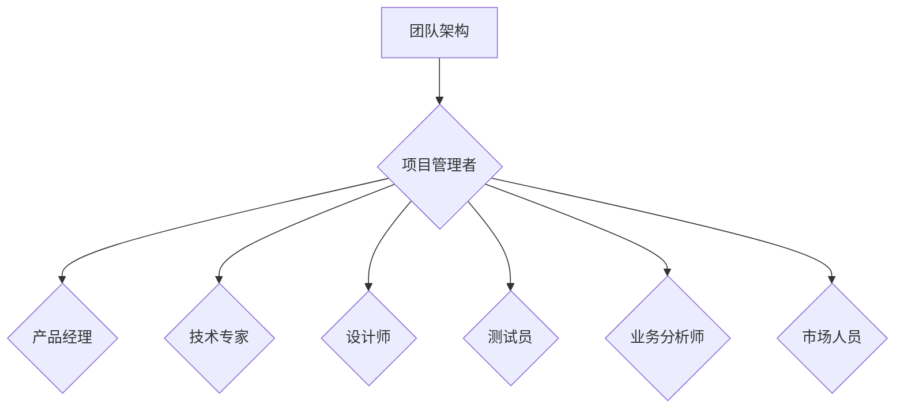

                 

### 文章标题

《打造高效团队：从招聘到培养的全流程》

---

### 关键词

高效团队，招聘策略，培养流程，团队文化，激励机制

---

### 摘要

本文将深入探讨如何打造一个高效团队，从招聘到培养的全流程。我们将通过分析高效团队的定义、团队架构与角色、招聘策略与技巧、新员工培训与培养等多个方面，提供实用的方法与策略，帮助IT领域的企业和组织构建出一支具有高度协作能力和创新精神的高效团队。

---

### 第1章: 打造高效团队：从招聘到培养的全流程

#### 1.1 核心概念与联系

高效团队是一个在目标明确、沟通顺畅、成员分工合理、文化积极、激励机制有效的环境下工作的团队。以下是对高效团队定义中的各个要素的详细分析及其相互关系。

##### 1.1.1 高效团队的定义

高效团队的定义可以从以下五个方面进行理解：

1. **明确的团队目标**：团队成员需要共同确定一个清晰的目标，并为之努力。
2. **高效的沟通机制**：团队成员之间需要建立良好的沟通渠道，确保信息传递的及时性和准确性。
3. **合理的成员分工**：根据每个成员的技能和特长进行合理的分工，确保团队成员能够充分发挥各自的优势。
4. **积极的团队文化**：团队内部应形成一个相互支持、鼓励创新、共同成长的文化氛围。
5. **有效的激励机制**：通过合理的激励机制，激发团队成员的积极性和创造力。

上述五个要素相互关联，共同构成了一个高效团队：

$$
\text{高效团队} = \left\{
\begin{aligned}
    & \text{明确的团队目标} \\
    & \text{高效的沟通机制} \\
    & \text{合理的成员分工} \\
    & \text{积极的团队文化} \\
    & \text{有效的激励机制}
\end{aligned}
\right.
$$

##### 1.1.2 团队架构与角色

为了构建一个高效团队，了解团队架构和成员角色至关重要。以下是典型的团队架构和角色划分：

#### Mermaid 流程图



1. **项目管理者**：负责整个项目的进度、资源和风险管理，确保项目按计划进行。
2. **产品经理**：负责产品的需求分析、规划和设计，确保产品满足市场需求。
3. **技术专家**：负责技术方案的设计和实现，确保技术方案的可行性和高效性。
4. **设计师**：负责产品的视觉设计和用户体验设计，提升产品的竞争力。
5. **测试员**：负责产品的测试和质量保证，确保产品在发布前无重大缺陷。
6. **业务分析师**：负责业务需求的分析和文档编写，确保产品功能满足业务需求。
7. **市场人员**：负责市场调研、推广和销售工作，提升产品的市场占有率。

这些角色在高效团队中相互协作，共同推动项目的成功。项目管理者起到核心协调作用，其他角色则发挥各自的专长，共同为团队目标努力。

#### 1.2 招聘流程

构建高效团队的第一步是招聘合适的人才。以下是招聘流程的详细分析：

##### 1.2.1 招聘策略

招聘策略是确保招聘过程高效和准确的关键。以下是几个核心策略：

1. **明确团队需求**：根据团队的工作内容和目标，明确所需的职位和技能要求。
2. **发布职位描述**：编写详细的职位描述，明确职位职责、技能要求和公司文化。
3. **筛选候选人**：从大量简历中筛选出符合职位要求的候选人。
4. **面试评估**：通过多轮面试评估候选人的专业技能和团队合作能力。
5. **背景调查**：对候选人进行背景调查，核实其教育和工作经历。
6. **决策录用**：综合评估结果，决定是否录用候选人。

以下是招聘策略的伪代码表示：

```python
def 招聘策略(团队需求，职位描述):
    筛选候选人：从简历库中筛选符合职位描述的候选人
    面试评估：对候选人进行多轮面试，评估其技能与团队合作能力
    背景调查：对候选人进行背景调查，核实其教育和工作经历
    决策录用：综合评估，决定是否录用候选人
```

##### 1.2.2 招聘技巧

招聘过程中，一些技巧可以帮助提高招聘效率和准确性：

1. **简历筛选**：通过关键词匹配、技能筛选等方法，快速识别合适的候选人。
2. **面试技巧**：面试过程中，注意观察候选人的沟通能力、解决问题的能力以及团队合作的态度。
3. **背景调查**：对候选人的教育背景、工作经历和职业素养进行深入了解。

以下是简历筛选和面试技巧的伪代码表示：

```python
def 简历筛选(简历库，职位描述):
    筛选条件：根据职位描述构建筛选条件
    筛选流程：从简历库中提取符合筛选条件的简历
    结果评估：对筛选结果进行评估，确定下一步面试名单

def 面试技巧(候选人):
    准备充分：提前了解候选人的背景和简历
    有效沟通：与候选人建立良好的沟通，确保信息的准确传递
    评估实际能力：通过实际问题评估候选人的技能和解决问题的能力
    营造舒适氛围：为候选人创造一个轻松、舒适的面试环境
```

#### 1.3 培养流程

招聘只是第一步，培养员工是确保团队长期高效的关键。以下是培养流程的详细分析：

##### 1.3.1 新员工培训

新员工培训是帮助新员工快速融入团队、熟悉公司文化和工作流程的重要环节。以下是新员工培训的内容和方法：

1. **企业文化培训**：介绍公司的发展历程、愿景、使命和价值观，帮助新员工了解公司的文化和理念。
2. **岗位技能培训**：针对新员工的职位要求，提供相应的技能培训，确保其具备完成工作所需的技能。
3. **团队协作培训**：通过团队建设活动、沟通技巧培训等，提高新员工的团队合作能力。
4. **职业素养培训**：提供职业素养相关的培训，如时间管理、沟通技巧、团队合作等，帮助新员工提升职业素养。

以下是新员工培训内容的伪代码表示：

```python
def 新员工培训(员工，培训内容):
    企业文化培训：介绍公司文化、理念和发展历程
    岗位技能培训：提供岗位技能培训，确保员工具备完成工作所需的技能
    团队协作培训：通过团队建设活动、沟通技巧培训等，提高团队合作能力
    职业素养培训：提供职业素养培训，提升员工的职业素养
```

##### 1.3.2 继续教育

继续教育是帮助员工不断提升自身能力和适应行业变化的重要手段。以下是继续教育的方法：

1. **确定学习目标**：根据员工的岗位和行业发展，确定需要学习的知识和技能。
2. **选择培训课程**：根据学习目标，选择适合的培训课程和资源。
3. **参与学习**：鼓励员工参与线上或线下培训，提升自身能力。
4. **学习成果评估**：对员工的学习成果进行评估，根据评估结果调整培训计划。

以下是继续教育方法的伪代码表示：

```python
def 继续教育(员工，领域):
    确定学习目标：根据员工岗位和行业发展确定学习目标
    选择培训课程：根据学习目标选择适合的培训课程
    参与学习：鼓励员工参与线上或线下培训，提升技能
    学习成果评估：对员工学习成果进行评估，调整培训计划
```

### 第2章: 招聘策略与技巧

#### 2.1 招聘策略

招聘策略是确保招聘过程高效和精准的关键。以下是几种常见的招聘策略：

##### 2.1.1 内部招聘与外部招聘

内部招聘和外部招聘各有优缺点，企业可以根据自身需求和情况选择合适的招聘方式。

1. **内部招聘**：
   - **激励员工发展**：通过内部晋升和调动，激励员工积极提升自身能力。
   - **降低招聘成本**：内部招聘可以节省招聘广告、面试等费用。
   - **提高员工忠诚度**：员工在熟悉的工作环境中晋升，更容易产生归属感。

2. **外部招聘**：
   - **引进新鲜血液**：外部招聘可以带来不同的思维和经验，促进团队创新。
   - **提升团队多样性**：外部招聘可以增加团队多样性，提高团队的整体创新能力。
   - **快速满足需求**：外部招聘可以快速引进符合要求的候选人，满足短期需求。

以下是内部招聘和外部招聘的伪代码表示：

```python
def 内部招聘(团队需求，职位描述):
    筛选候选人：从内部员工中筛选符合职位要求的候选人
    面试评估：对候选人进行面试，评估其技能与团队合作能力
    决策录用：综合评估，决定是否录用候选人

def 外部招聘(团队需求，职位描述):
    发布职位：发布职位描述，吸引外部候选人
    筛选候选人：从外部简历库中筛选符合职位要求的候选人
    面试评估：对候选人进行面试，评估其技能与团队合作能力
    背景调查：对候选人进行背景调查，核实其教育和工作经历
    决策录用：综合评估，决定是否录用候选人
```

##### 2.1.2 招聘渠道选择

选择合适的招聘渠道可以提高招聘效率和准确性。以下是一些常见的招聘渠道：

1. **招聘网站**：如智联招聘、前程无忧等，适用于大量职位招聘。
2. **社交媒体**：如LinkedIn、微博、知乎等，适用于高端职位和特定行业人才。
3. **人才市场**：适用于大量基层职位招聘。
4. **内部推荐**：通过员工推荐，吸引优质候选人。

以下是招聘渠道选择的伪代码表示：

```python
def 选择招聘渠道(职位类型，团队需求):
    如果 职位类型 是 高端职位：
        选择招聘网站 和 社交媒体
    如果 职位类型 是 基层职位：
        选择招聘网站 和 人才市场
    如果 职位类型 是 特定行业人才：
        选择招聘网站 和 社交媒体
    如果 职位类型 是 普通职位：
        选择招聘网站 和 内部推荐
```

#### 2.2 招聘技巧

招聘技巧是确保招聘过程高效和精准的关键。以下是一些实用的招聘技巧：

##### 2.2.1 简历筛选

简历筛选是招聘过程中的第一步，以下是一些简历筛选技巧：

1. **关键词匹配**：根据职位要求，筛选出包含关键词的简历。
2. **技能筛选**：根据职位要求，筛选出具备相关技能的简历。
3. **经验筛选**：根据职位要求，筛选出具备相关工作经验的简历。

以下是简历筛选的伪代码表示：

```python
def 简历筛选(简历库，职位描述):
    筛选条件：根据职位描述构建筛选条件
    筛选流程：从简历库中提取符合筛选条件的简历
    结果评估：对筛选结果进行评估，确定下一步面试名单
```

##### 2.2.2 面试技巧

面试是评估候选人能力的重要环节，以下是一些面试技巧：

1. **准备充分**：提前了解候选人的背景和简历，准备相关的问题。
2. **有效沟通**：与候选人建立良好的沟通，确保信息的准确传递。
3. **评估实际能力**：通过实际问题评估候选人的技能和解决问题的能力。
4. **营造舒适氛围**：为候选人创造一个轻松、舒适的面试环境。

以下是面试技巧的伪代码表示：

```python
def 面试技巧(候选人):
    准备充分：提前了解候选人的背景和简历
    有效沟通：与候选人建立良好的沟通，确保信息的准确传递
    评估实际能力：通过实际问题评估候选人的技能和解决问题的能力
    营造舒适氛围：为候选人创造一个轻松、舒适的面试环境
```

### 第3章: 新员工培训与培养

#### 3.1 新员工培训

新员工培训是帮助新员工快速融入团队、熟悉公司文化和工作流程的重要环节。以下是新员工培训的内容和方法：

##### 3.1.1 培训内容

新员工培训的内容主要包括以下几个方面：

1. **企业文化培训**：介绍公司的发展历程、愿景、使命和价值观，帮助新员工了解公司的文化和理念。
2. **岗位技能培训**：针对新员工的职位要求，提供相应的技能培训，确保其具备完成工作所需的技能。
3. **团队协作培训**：通过团队建设活动、沟通技巧培训等，提高新员工的团队合作能力。
4. **职业素养培训**：提供职业素养相关的培训，如时间管理、沟通技巧、团队合作等，帮助新员工提升职业素养。

以下是新员工培训内容的伪代码表示：

```python
def 新员工培训(员工，培训内容):
    企业文化培训：介绍公司文化、理念和发展历程
    岗位技能培训：提供岗位技能培训，确保员工具备完成工作所需的技能
    团队协作培训：通过团队建设活动、沟通技巧培训等，提高团队合作能力
    职业素养培训：提供职业素养培训，提升员工的职业素养
```

##### 3.1.2 培训方法

新员工培训的方法主要包括以下几个方面：

1. **面授课程**：为员工提供面对面授课培训，确保员工能够深入了解公司文化和工作流程。
2. **线上课程**：提供线上学习资源，方便员工随时学习，提高培训的灵活性和便利性。
3. **实战演练**：组织员工参与实际项目，通过实践提升员工的技能和解决问题的能力。

以下是新员工培训方法的伪代码表示：

```python
def 培训方法(员工，培训内容):
    面授课程：为员工提供面对面授课培训
    线上课程：提供线上学习资源，方便员工随时学习
    实战演练：组织员工参与实际项目，提升实践能力
```

#### 3.2 继续教育

继续教育是帮助员工不断提升自身能力和适应行业变化的重要手段。以下是通过继续教育提升员工能力的方法：

##### 3.2.1 制定学习计划

1. **确定学习目标**：根据员工的岗位和行业发展，确定需要学习的知识和技能。
2. **选择培训课程**：根据学习目标，选择适合的培训课程和资源。
3. **制定学习计划**：根据培训课程安排，制定详细的学习计划。

以下是制定学习计划的伪代码表示：

```python
def 制定学习计划(员工，领域):
    确定学习目标：根据员工岗位和行业发展确定学习目标
    选择培训课程：根据学习目标选择适合的培训课程
    制定学习计划：根据培训课程安排，制定详细的学习计划
```

##### 3.2.2 提供学习资源

1. **线上学习资源**：提供丰富的线上学习资源，如电子书籍、在线课程、培训视频等，方便员工随时学习。
2. **线下培训**：组织线下培训活动，邀请业内专家进行授课，提高员工的专业技能。

以下是提供学习资源的伪代码表示：

```python
def 提供学习资源(员工，领域):
    线上学习资源：提供电子书籍、在线课程、培训视频等线上学习资源
    线下培训：组织线下培训活动，邀请业内专家进行授课
```

##### 3.2.3 评估学习成果

1. **学习成果评估**：对员工的学习成果进行评估，了解员工的学习效果。
2. **反馈调整**：根据评估结果，对学习计划进行调整，确保员工能够不断提升自身能力。

以下是评估学习成果的伪代码表示：

```python
def 评估学习成果(员工，学习计划):
    学习成果评估：对员工的学习成果进行评估
    反馈调整：根据评估结果，对学习计划进行调整
```

### 第4章: 培养高效团队文化的策略

#### 4.1 建立积极向上的团队氛围

一个高效团队需要具备积极向上的团队氛围，这有助于提升团队凝聚力和成员的工作满意度。以下是一些策略：

1. **明确团队目标**：确保每个成员都了解团队的目标，并为之努力。
2. **鼓励创新**：鼓励团队成员提出新的想法和解决方案，营造创新氛围。
3. **提供反馈**：定期对团队成员的工作进行反馈，鼓励成员改进和提高。

#### 4.2 加强团队沟通

团队沟通是确保团队协作顺畅的关键。以下是一些策略：

1. **建立有效的沟通渠道**：确保团队成员之间的沟通渠道畅通，如定期会议、即时通讯工具等。
2. **鼓励开放沟通**：鼓励团队成员在团队内分享观点和意见，提高团队的信息透明度。
3. **解决沟通障碍**：及时发现并解决沟通中的问题，如信息误解、沟通不畅等。

#### 4.3 培养团队合作精神

团队合作精神是高效团队的重要特征。以下是一些策略：

1. **共同承担责任**：明确团队成员的职责，让每个人了解自己的责任，并共同承担责任。
2. **建立信任关系**：通过团队活动、合作项目等方式，增进团队成员之间的信任。
3. **培养团队意识**：强调团队的共同目标，让每个成员都意识到自己在团队中的重要性。

### 第5章: 激励机制的有效运用

#### 5.1 设定明确的激励机制

一个有效的激励机制需要明确奖励的标准和方式。以下是一些策略：

1. **制定绩效指标**：根据团队和个人的目标，制定明确的绩效指标。
2. **设定奖励标准**：明确奖励的标准和条件，确保奖励的公平性和合理性。
3. **奖励多样化**：提供多种奖励形式，如奖金、晋升机会、培训机会等。

#### 5.2 激励机制的个性化

每个团队成员都有不同的激励需求，因此需要根据个人的特点制定个性化的激励机制。以下是一些策略：

1. **了解个人需求**：与团队成员沟通，了解他们的个人需求和激励因素。
2. **制定个性化激励计划**：根据个人需求，制定个性化的激励计划。
3. **实施灵活的激励制度**：根据个人绩效和贡献，灵活调整激励制度。

#### 5.3 激励机制的持续改进

激励机制需要持续改进，以适应团队和员工的变化。以下是一些策略：

1. **定期评估激励机制**：定期评估激励机制的效果，收集反馈意见，发现问题并进行改进。
2. **引入新的激励机制**：根据团队和员工的反馈，引入新的激励机制，提高激励效果。
3. **保持激励机制的创新性**：鼓励创新，不断探索新的激励方式，确保激励机制与时俱进。

### 结论

打造高效团队是一个系统性工程，涉及从招聘到培养的各个环节。通过明确团队目标、建立有效的沟通机制、培养团队合作精神、设定个性化的激励机制等策略，企业可以构建出一支具有高度协作能力和创新精神的高效团队。然而，这需要企业持续关注团队动态，不断优化和调整策略，以适应不断变化的市场和员工需求。

### 最佳实践 Tips

1. **优化招聘流程**：通过数据分析和反馈，不断优化招聘流程，提高招聘效率和准确性。
2. **加强培训体系**：建立完善的培训体系，确保员工在职业生涯的不同阶段都能得到持续成长。
3. **关注员工反馈**：定期收集员工反馈，了解他们的需求和意见，及时调整管理策略。
4. **营造积极文化**：通过团队活动、激励措施等，营造积极向上的团队文化。
5. **持续改进激励机制**：定期评估和改进激励机制，确保其能够激励员工持续提升绩效。

### 注意事项

1. **避免过度竞争**：在激励员工时，要注意避免过度竞争，以免影响团队合作和氛围。
2. **关注员工心理健康**：在高压的工作环境中，要注意关注员工的心理健康，提供必要的心理支持。
3. **确保公平公正**：在招聘、培训、激励等环节中，要确保公平公正，避免因偏见导致的不公现象。
4. **持续跟踪评估**：对于招聘、培训、激励机制等策略，要持续跟踪评估其效果，及时调整。

### 拓展阅读

1. **《团队协作与沟通技巧》**：探讨如何在团队中实现有效协作和沟通。
2. **《激励与员工管理》**：深入探讨激励机制在员工管理中的重要作用。
3. **《企业文化建设》**：介绍企业文化建设的重要性以及如何营造积极向上的团队文化。

作者：AI天才研究院/AI Genius Institute & 禅与计算机程序设计艺术 /Zen And The Art of Computer Programming

