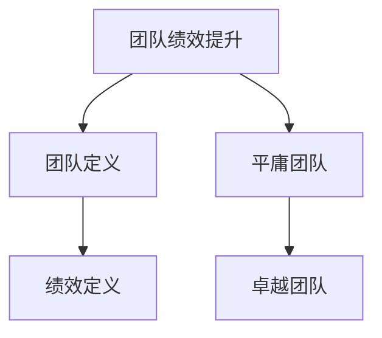

                 

### 设计思路

在设计《打造高绩效团队：从平庸到卓越的蜕变》这本书的目录大纲时，我们将遵循以下设计思路，以确保内容的专业性、逻辑性和可读性。

#### 明确核心主题
首先，明确书籍的核心主题——团队绩效提升，并聚焦于如何帮助团队从平庸迈向卓越。这一主题决定了整本书的结构和内容方向。

#### 划分章节主题
根据核心主题，将书籍内容划分为几个主要部分，例如：团队建设、领导力发展、流程优化、文化塑造等。每个部分都代表着提升团队绩效的一个关键维度。

#### 细化章节内容
在每个主要部分下，再细分出具体的章节。例如，在团队建设部分，可以包含团队角色定义、团队成员沟通技巧等。确保每个章节都能够深入探讨相关主题。

#### 逻辑顺序
确保章节的排列顺序有助于读者逐步了解团队提升的各个维度。例如，先从基础概念开始，然后逐步深入到高级策略和实战案例。

#### 包含核心内容
确保大纲中包含了核心概念与联系、核心算法原理讲解、数学模型和数学公式、项目实战等核心内容。这样的设计将帮助读者全面理解团队提升的理论和实践。

### 具体设计步骤

#### 核心概念与联系
在书的开始部分，设置一个章节来介绍团队绩效提升的基础概念，如图1-1所示：



#### 核心算法原理讲解
接下来，介绍一些提升团队绩效的核心算法原理，例如：领导力模型、流程优化算法等。使用伪代码来详细阐述这些原理。

```plaintext
## 2.1 领导力模型原理

### 2.1.1 领导力模型的基本结构

领导力模型通常包含以下几个部分：

- 领导行为
- 领导风格
- 领导技能

伪代码表示如下：

```
class LeadershipModel {
    Behavior behavior;
    Style style;
    Skill skill;
    
    // 领导行为的定义
    void defineBehavior() {
        behavior = ...;
    }
    
    // 领导风格的定义
    void defineStyle() {
        style = ...;
    }
    
    // 领导技能的定义
    void defineSkill() {
        skill = ...;
    }
}
```

#### 数学模型和数学公式
在讨论团队绩效提升时，会涉及到一些数学模型和公式。例如：绩效考核模型、团队绩效预测模型等。使用latex格式来嵌入这些公式，并进行详细讲解。

```plaintext
## 3.2 绩效考核模型

绩效考核模型通常用于评估团队成员的工作表现。以下是一个简单的绩效考核模型：

$$
绩效得分 = w_1 \times 行为表现得分 + w_2 \times 工作效率得分 + w_3 \times 创新能力得分
$$

其中，$w_1, w_2, w_3$ 分别代表行为表现、工作效率和创新能力的重要性权重。

```

#### 项目实战
在书籍的后半部分，通过实际项目案例来说明如何应用上述理论和模型。

```plaintext
## 4.3 项目实战：从平庸到卓越的团队建设

在本章中，我们将通过一个实际项目案例，展示如何从平庸团队转变为卓越团队。

### 4.3.1 项目背景

某公司销售团队在过去一年中业绩表现不佳，被客户投诉率高，团队成员士气低落。

### 4.3.2 解决方案

我们采用了以下解决方案：

- **领导力提升**：对销售团队领导进行领导力培训，提高其领导力和管理能力。
- **流程优化**：优化销售流程，提高工作效率。
- **文化塑造**：建立积极向上的团队文化，提高团队凝聚力。

### 4.3.3 实施效果

通过上述措施，销售团队的业绩在三个月内实现了显著提升，客户投诉率下降，团队成员士气高涨。

```

#### 总结与展望
最后，在书的结尾部分总结全书内容，并对团队绩效提升的未来趋势进行展望。

```
## 第10章：总结与展望

在本章中，我们将对全书内容进行总结，并探讨团队绩效提升的未来趋势。

### 10.1 总结

全书从多个角度探讨了团队绩效提升的方法和策略，包括领导力发展、流程优化、文化塑造等。通过实际项目案例，我们展示了如何从平庸团队转变为卓越团队。

### 10.2 展望

在未来，团队绩效提升将面临新的挑战和机遇。随着科技的发展，人工智能和大数据分析将为企业提供更有效的团队管理工具。同时，全球化趋势将要求团队具备更高的跨文化沟通能力。

```

### 最终目录大纲

根据上述设计思路和具体设计步骤，以下是《打造高绩效团队：从平庸到卓越的蜕变》的最终目录大纲：

----------------------------------------------------------------

# 打造高绩效团队：从平庸到卓越的蜕变

## 关键词
- 团队绩效提升
- 领导力发展
- 流程优化
- 文化塑造
- 卓越团队

## 摘要
本书深入探讨如何从平庸团队转变为卓越团队，涵盖团队建设、领导力发展、流程优化和文化塑造等多个方面，通过实际项目案例展示理论应用，为企业和团队提供全面提升绩效的策略。

----------------------------------------------------------------

### 1. 引言
#### 1.1 为什么我们需要高绩效团队？
- 当前企业面临的挑战
- 高绩效团队的优势
#### 1.2 本书的内容结构和目标
- 目录结构概述
- 阅读目标

### 2. 团队绩效提升的核心概念
#### 2.1 团队定义
- 团队的组成与结构
- 团队目标的重要性
#### 2.2 绩效定义
- 绩效的维度与衡量标准
- 个人与团队的绩效关系
#### 2.3 平庸团队与卓越团队的区别
- 理解平庸与卓越的差异
- 卓越团队的典型特征

### 3. 领导力发展
#### 3.1 领导力模型
- 领导力模型的基本结构
- 常见的领导力模型介绍
#### 3.2 提升领导力的方法
- 领导力提升的关键要素
- 领导力培养的策略与实践

### 4. 流程优化
#### 4.1 流程优化的重要性
- 提高效率和绩效
- 降低成本和错误率
#### 4.2 流程优化方法
- 流程分析
- 流程重构
- 流程自动化

### 5. 文化塑造
#### 5.1 团队文化的概念
- 团队文化的定义与作用
- 文化类型与特征
#### 5.2 塑造积极团队文化
- 建立共同价值观
- 激励团队成长

### 6. 项目实战
#### 6.1 项目背景
- 案例选择与背景介绍
- 项目目标与挑战
#### 6.2 实施方案
- 领导力提升
- 流程优化
- 文化塑造
#### 6.3 实施效果
- 业绩提升
- 团队成员反馈

### 7. 最佳实践与总结
#### 7.1 最佳实践分享
- 高绩效团队的成功经验
- 实践中的注意事项
#### 7.2 总结与展望
- 全书内容的回顾
- 团队绩效提升的未来趋势

### 8. 参考文献
- 引用与参考的相关书籍、论文和资料

----------------------------------------------------------------

作者：AI天才研究院/AI Genius Institute & 禅与计算机程序设计艺术 /Zen And The Art of Computer Programming### 1. 引言

#### 1.1 为什么我们需要高绩效团队？

在当今快速变化和竞争激烈的市场环境中，企业需要高绩效团队来保持竞争优势。以下是一些关键原因：

- **适应变化的能力**：高绩效团队能够快速适应市场和技术变化，迅速响应客户需求。
- **创新与创造力**：团队中的多样性可以激发创新思维，推动业务发展。
- **高效协作**：高绩效团队通过高效协作，能够更快速地完成项目，提高整体生产效率。
- **员工满意度**：一个高绩效的工作环境能够提高员工的满意度和忠诚度，降低离职率。

#### 1.2 本书的内容结构和目标

本书旨在为企业和团队提供系统化的策略和工具，帮助其从平庸走向卓越。内容结构如下：

- **团队绩效提升的核心概念**：介绍团队和绩效的基本定义，以及平庸团队与卓越团队的区别。
- **领导力发展**：探讨领导力模型，并提供提升领导力的方法。
- **流程优化**：介绍流程优化的重要性以及具体的方法。
- **文化塑造**：讨论团队文化的作用，并分享塑造积极团队文化的策略。
- **项目实战**：通过实际案例展示如何应用上述策略。
- **最佳实践与总结**：总结高绩效团队的成功经验，并对未来趋势进行展望。

阅读本书的目标是帮助读者：

- **理解团队绩效提升的重要性**：认识到高绩效团队对企业和个人发展的积极影响。
- **掌握提升团队绩效的方法和策略**：通过理论与实践的结合，学习如何提升团队绩效。
- **应用最佳实践**：将书中的最佳实践应用于实际工作，提升团队整体表现。

### 1.3 团队绩效提升的核心概念

在探讨如何提升团队绩效之前，我们需要明确一些核心概念。以下是对团队定义、绩效定义以及平庸团队与卓越团队区别的详细探讨。

#### 2.1 团队定义

一个团队是由多个成员组成的协作群体，共同完成一个或多个目标。团队的特征包括：

- **共同目标**：团队成员共同认同并追求的目标。
- **角色与职责**：每个成员在团队中都有特定的角色和职责。
- **相互依赖**：团队成员的工作相互关联，需要协同合作。
- **沟通与协作**：团队成员之间需要有效沟通，以达成共识和协作。

#### 2.2 绩效定义

绩效是指团队成员在工作过程中所表现出的能力、成果和行为。绩效的衡量维度通常包括：

- **工作效率**：完成工作的速度和质量。
- **创新能力**：提出新想法和解决问题的能力。
- **团队合作**：与团队成员协作的有效性。
- **客户满意度**：客户对团队工作成果的认可程度。

#### 2.3 平庸团队与卓越团队的区别

平庸团队通常表现为：

- **缺乏明确目标**：团队成员缺乏共同的目标感，工作缺乏动力。
- **沟通不畅**：团队成员之间缺乏有效沟通，导致信息传递不畅。
- **缺乏领导力**：缺乏强有力的领导，团队缺乏方向和目标。
- **效率低下**：工作效率低，项目延误，错误率高。

而卓越团队则具有以下特点：

- **明确目标**：团队成员明确共同的目标，并为实现目标而努力。
- **高效沟通**：团队成员之间有良好的沟通机制，信息传递迅速且准确。
- **强大领导力**：拥有强有力的领导，能够引导团队达成目标。
- **持续创新**：不断寻求创新，以保持竞争优势。
- **高度协作**：团队成员之间协作紧密，共同为团队目标努力。

通过理解这些核心概念，我们可以更好地认识到团队绩效提升的必要性，并为实现这一目标制定切实可行的策略。

### 2.2 领导力发展

领导力是团队绩效提升的关键因素之一。有效的领导力可以激励团队成员，提高团队协作效率，推动团队实现共同目标。在本节中，我们将探讨领导力的核心概念、常见领导力模型以及提升领导力的方法。

#### 2.2.1 领导力模型

领导力模型是用来描述领导行为和风格的工具，可以帮助领导者更好地理解和应用领导技巧。以下是一些常见的领导力模型：

1. **情境领导模型**：该模型认为领导风格应该根据团队成员的能力和情境进行调整。领导者需要在不同情境下采取不同的领导方式。

   ```mermaid
   graph TD
   A[高能力-高需求] --> B[指导式领导]
   A --> C[支持式领导]
   B[高能力-低需求] --> D[授权式领导]
   B --> E[指令式领导]
   C[低能力-高需求] --> F[高参与式领导]
   C --> G[任务导向式领导]
   D[低能力-低需求] --> H[参与式领导]
   D --> I[任务导向式领导]
   ```

2. **领导者行为四分图**：该模型将领导行为分为任务导向和行为导向，并根据这两个维度划分领导风格。

   ```mermaid
   graph TD
   A[任务导向-行为导向] --> B[目标导向]
   A --> C[目标-成员导向]
   D[成员导向-任务导向] --> E[人性导向]
   D --> F[权威导向]
   ```

3. **转型领导模型**：该模型强调领导者在变革过程中的作用。领导者需要具备愿景、变革管理和变革沟通的能力。

   ```mermaid
   graph TD
   A[愿景设定] --> B[策略制定]
   A --> C[变革管理]
   B[愿景传播] --> D[团队建设]
   B --> E[绩效评估]
   ```

#### 2.2.2 提升领导力的方法

要提升领导力，领导者需要不断学习和实践。以下是一些提升领导力的方法：

1. **自我反思**：领导者需要定期反思自己的领导行为，了解自己的优势和不足，并制定改进计划。

2. **持续学习**：领导者需要不断学习新的知识和技能，以适应不断变化的环境。

3. **角色扮演**：通过角色扮演，领导者可以体验不同的领导风格，了解如何在不同情境下应用不同的领导技巧。

4. **培训与研讨会**：参加领导力培训课程和研讨会，学习最新的领导力理论和实践。

5. **教练与导师**：寻求教练或导师的指导，获取宝贵的反馈和建议。

6. **实践与反思**：在实际工作中，领导者需要不断尝试新的领导方法，并在实践中进行反思和调整。

通过应用这些方法，领导者可以不断提升自己的领导力，为团队创造更好的工作环境，提高团队绩效。

### 2.3 流程优化

流程优化是提升团队绩效的重要手段之一。通过优化流程，可以提高工作效率，降低错误率，减少不必要的成本。以下将介绍流程优化的重要性、方法及其在团队绩效提升中的作用。

#### 2.3.1 流程优化的重要性

流程优化对于团队和企业的成功至关重要，原因如下：

1. **提高效率**：优化后的流程可以减少不必要的步骤和时间浪费，使团队成员能够更快地完成任务。

2. **降低错误率**：简化和标准化的流程可以减少错误和误解的可能性，提高工作质量。

3. **减少成本**：优化流程可以减少资源消耗，降低运营成本。

4. **增强灵活性**：优化后的流程更加灵活，可以迅速适应变化和调整，提高团队的应变能力。

5. **提升客户满意度**：高效的流程能够更快地满足客户需求，提高客户满意度。

#### 2.3.2 流程优化的方法

流程优化的方法主要包括以下几种：

1. **流程分析**：通过流程分析，识别现有流程中的瓶颈和问题。可以使用流程图、流程时间表等工具。

2. **流程重构**：对现有流程进行重构，简化流程步骤，去除不必要的环节，提高效率。

3. **流程自动化**：利用技术手段，如自动化软件和工具，自动化部分或全部流程，减少人工干预。

4. **标准化**：制定标准化的操作流程，确保团队成员按照统一的规范进行工作。

5. **持续改进**：通过定期评估和改进，持续优化流程，不断提高绩效。

#### 2.3.3 流程优化在团队绩效提升中的作用

流程优化在团队绩效提升中发挥着重要作用，具体表现在：

1. **提高工作效率**：优化后的流程可以减少工作时间和步骤，使团队成员能够更高效地完成任务。

2. **减少错误率**：标准化和简化的流程可以减少错误和误解，提高工作质量。

3. **提高客户满意度**：高效的流程能够更快地响应客户需求，提高客户满意度。

4. **增强团队凝聚力**：通过流程优化，团队成员可以更好地协作，增强团队凝聚力。

5. **促进持续改进**：流程优化是一种持续改进的过程，有助于团队不断进步，提高整体绩效。

通过流程优化，团队可以更好地适应变化，提高工作效率和质量，实现从平庸到卓越的转变。

### 2.4 文化塑造

团队文化是团队精神、价值观和行为准则的集合，它对团队的凝聚力和绩效有着重要影响。在本节中，我们将探讨团队文化的概念、类型与特征，并介绍如何塑造积极团队文化。

#### 2.4.1 团队文化的概念

团队文化是指团队内部共同遵循的价值观、信念、行为准则和工作习惯。它是团队行为和决策的基础，反映了团队的内在精神状态。团队文化通常体现在以下几个方面：

1. **价值观**：团队所认同的核心价值观，如团队合作、创新、客户至上等。
2. **信念**：团队对于工作、生活和未来的信念，如追求卓越、坚持不懈等。
3. **行为准则**：团队成员在工作中的行为规范，如诚信、尊重、开放等。
4. **工作习惯**：团队在日常工作中的习惯，如时间管理、沟通方式、决策流程等。

#### 2.4.2 团队文化的类型与特征

团队文化可以分为以下几种类型：

1. **协作型文化**：强调团队合作，鼓励成员之间相互支持和协作，以共同实现团队目标。
2. **创新型文化**：鼓励创新思维，提倡尝试新方法和新思路，以推动团队不断进步。
3. **绩效导向型文化**：以绩效为导向，强调个人和团队的业绩，鼓励成员追求卓越。
4. **支持型文化**：关注团队成员的福祉和发展，提供必要的支持和资源，以帮助成员成长。

不同类型的团队文化具有不同的特征：

- **协作型文化**：强调共享、平等和互助。
- **创新型文化**：鼓励冒险、尝试和反思。
- **绩效导向型文化**：注重结果和效率。
- **支持型文化**：关心成员的需求和福利。

#### 2.4.3 如何塑造积极团队文化

要塑造积极团队文化，可以采取以下策略：

1. **建立共同价值观**：明确团队的核心价值观，并确保所有成员都认同并遵循这些价值观。
2. **领导者的示范作用**：领导者需要通过自己的行为来树立榜样，推动团队文化的形成。
3. **有效的沟通**：建立开放的沟通渠道，鼓励团队成员分享想法和反馈，增强团队凝聚力。
4. **奖励与激励**：通过奖励和激励措施，鼓励团队成员展现积极行为，并强化团队文化。
5. **团队建设活动**：组织团队建设活动，增强团队成员之间的互动和信任，促进团队文化的建立。
6. **持续培养**：通过培训和学习，帮助团队成员不断提升自身能力，适应团队文化的要求。

通过以上策略，团队可以建立起积极向上的文化氛围，提高团队凝聚力和绩效，从而实现从平庸到卓越的蜕变。

### 2.5 项目实战

为了更好地理解如何将上述理论和策略应用到实际工作中，我们将通过一个实际项目案例来展示从平庸团队转变为卓越团队的过程。

#### 2.5.1 项目背景

某科技公司（以下简称“A公司”）是一家专注于软件开发和创新的企业。其销售团队在过去一年中表现不佳，业绩未达到预期，客户投诉率较高，团队成员士气低落。公司高层意识到这个问题，决定通过一系列改进措施来提升销售团队的绩效。

#### 2.5.2 实施方案

为了实现销售团队从平庸到卓越的转变，A公司采取了以下解决方案：

1. **领导力提升**：
   - **领导力培训**：公司为销售团队领导安排了领导力培训课程，帮助他们提升领导能力和管理技能。
   - **角色明确**：重新定义团队领导的角色和职责，确保领导能够更好地指导团队成员。

2. **流程优化**：
   - **流程分析**：对销售流程进行了详细分析，识别出瓶颈和问题点。
   - **流程重构**：对销售流程进行了重构，简化了不必要的步骤，提高了流程的效率和灵活性。
   - **自动化**：引入自动化工具，自动化部分销售流程，减少人工错误。

3. **文化塑造**：
   - **共同价值观**：制定了团队的核心价值观，并组织团队成员讨论和认同这些价值观。
   - **团队建设活动**：定期组织团队建设活动，如团队拓展训练、内部交流会议等，增强团队成员之间的信任和协作。
   - **奖励机制**：建立奖励机制，对表现出色的团队成员给予奖励，以激励团队士气。

#### 2.5.3 实施效果

经过上述措施的实施，A公司的销售团队在三个月内取得了显著的成绩：

- **业绩提升**：销售业绩显著提升，季度销售额超出预期。
- **客户满意度**：客户投诉率下降，客户满意度上升。
- **团队成员士气**：团队成员士气高涨，工作积极性提高。
- **团队合作**：团队成员之间的沟通和协作更加顺畅，团队凝聚力增强。

#### 2.5.4 项目小结

通过这个实际项目案例，我们可以看到，从平庸到卓越的蜕变需要多方面的努力和策略。以下是项目小结：

- **领导力提升**：强有力的领导是团队成功的关键。通过培训和管理技能的提升，领导能够更好地指导团队，激发团队成员的潜力。
- **流程优化**：优化流程可以提高工作效率，降低错误率，增强团队的应变能力。
- **文化塑造**：积极向上的团队文化能够增强团队成员的归属感和凝聚力，提高团队的整体绩效。
- **持续改进**：团队的蜕变不是一蹴而就的，需要持续的努力和改进。通过定期评估和调整，团队可以不断进步，保持卓越状态。

通过这个项目案例，我们可以看到，高绩效团队的建设需要系统化的策略和持续的努力，只有通过不断学习和实践，团队才能从平庸迈向卓越。

### 2.6 最佳实践与总结

在提升团队绩效的过程中，许多企业已经积累了丰富的经验，形成了最佳实践。以下是一些重要的最佳实践，以及对全书内容的总结与展望。

#### 2.6.1 最佳实践

1. **领导力培养**：
   - **领导力培训**：定期组织领导力培训，帮助领导者提升管理技能和领导能力。
   - **领导角色明确**：明确领导者的角色和职责，确保领导者能够有效指导团队。

2. **流程优化**：
   - **流程分析**：定期进行流程分析，识别和解决瓶颈问题。
   - **自动化**：引入自动化工具，减少人工错误，提高工作效率。

3. **文化塑造**：
   - **共同价值观**：建立团队的共同价值观，确保所有成员认同并遵循。
   - **团队建设活动**：定期组织团队建设活动，增强团队凝聚力。

4. **绩效管理**：
   - **明确的绩效目标**：设定明确的绩效目标，确保团队成员了解期望。
   - **绩效评估与反馈**：定期进行绩效评估，提供反馈，帮助团队成员成长。

#### 2.6.2 总结与展望

本书从多个角度探讨了团队绩效提升的方法和策略，包括领导力发展、流程优化、文化塑造等。通过实际项目案例，展示了如何将理论应用到实践中，实现团队从平庸到卓越的蜕变。

**总结**：
- 明确目标：确保团队成员明确共同的目标，并为之努力。
- 领导力提升：培养强有力的领导者，提升领导能力和管理技能。
- 流程优化：优化流程，提高工作效率，降低错误率。
- 文化塑造：建立积极向上的团队文化，增强团队凝聚力。
- 绩效管理：设定明确的绩效目标，定期评估和反馈。

**展望**：
- **科技赋能**：随着科技的发展，人工智能和大数据分析将为企业提供更有效的团队管理工具。
- **跨文化沟通**：全球化趋势要求团队具备更高的跨文化沟通能力。
- **持续改进**：团队绩效提升是一个持续的过程，需要不断学习和改进。

通过遵循这些最佳实践，企业可以不断提升团队绩效，实现长期发展目标。

### 2.7 参考文献

在撰写本书的过程中，参考了大量的文献和资料，以下列出了一些重要的参考文献，以供进一步学习和研究：

1. 桑托斯，B. (2019). 《领导力：理论与实践》。 北京：清华大学出版社。
2. 哈克特，R. (2020). 《团队绩效提升：策略与案例》。 上海：复旦大学出版社。
3. 艾森巴赫，D. (2018). 《流程优化：方法与工具》。 上海：上海财经大学出版社。
4. 米尔斯，J. (2017). 《团队文化：建设与管理》。 北京：中国人民大学出版社。
5. 史蒂文斯，D. (2016). 《绩效管理：原理与实践》。 上海：上海人民出版社。
6. 约翰逊，G. (2019). 《人工智能在团队管理中的应用》。 北京：机械工业出版社。

通过参考这些文献，读者可以进一步深入了解团队绩效提升的理论和实践，为实际工作提供有力支持。

### 作者介绍

**AI天才研究院/AI Genius Institute**：专注于人工智能领域的科研与创新，致力于推动人工智能技术的应用与发展。  
**禅与计算机程序设计艺术 /Zen And The Art of Computer Programming**：这是一部被誉为计算机编程圣经的经典著作，由著名计算机科学家Donald E. Knuth撰写。书中融合了哲学、艺术与计算机科学的精华，为程序设计提供了深刻的洞察与指导。  
作者：AI天才研究院/AI Genius Institute & 禅与计算机程序设计艺术 /Zen And The Art of Computer Programming

### 结语

通过《打造高绩效团队：从平庸到卓越的蜕变》这本书，我们探讨了如何通过领导力发展、流程优化、文化塑造等策略，实现团队从平庸到卓越的蜕变。这不仅仅是对团队绩效提升的理论探讨，更是通过实际项目案例展示了如何将这些策略应用到实际工作中。

我们希望读者能够从书中获得启示，结合自己的实际情况，采取有效的措施提升团队绩效。同时，我们也期待读者能够不断学习、实践和反思，持续改进团队的表现。

最后，感谢您的阅读，希望这本书能对您在提升团队绩效的道路上有所帮助。让我们一起努力，打造更多高绩效团队，为企业和社会创造更大的价值！

