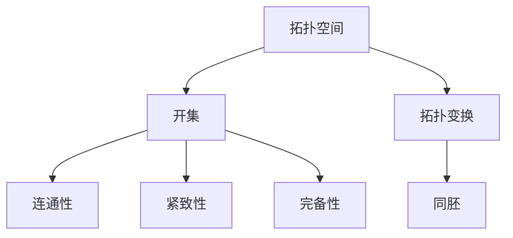

                 


### 文章标题：拓扑学：空间关系的本质探讨

#### 关键词：拓扑学，空间关系，数学模型，核心算法，实践应用

#### 摘要：
本文旨在深入探讨拓扑学在空间关系研究中的应用。我们将从拓扑学的基础理论出发，逐步分析其核心概念、算法原理，并通过实例解析，展示其在实际工程和设计中的价值。本文将采用逻辑清晰、结构紧凑的技术语言，旨在为读者提供一个全面、易懂的拓扑学教程。

### 背景介绍

#### 拓扑学：一门探究空间性质和结构关系的数学学科
拓扑学，作为数学的一个分支，起源于19世纪末，主要研究空间在连续变形下的性质和结构。与几何学不同，拓扑学关注的是空间在连续变换（如拉伸、压缩、扭曲等）下保持不变的性质。这种研究方法使得拓扑学在空间关系的本质探讨中具有独特的优势。

#### 空间关系：现实世界的核心问题
空间关系在许多领域中都具有重要意义，如计算机科学、物理学、工程学等。无论是网络拓扑、图形渲染，还是建筑设计、城市规划，空间关系都是解决问题的关键。因此，理解和掌握拓扑学，对于深入研究空间关系具有至关重要的意义。

### 核心概念与联系

#### 拓扑空间
拓扑空间是拓扑学研究的核心对象。一个拓扑空间由一个集合和一组开集组成，这些开集满足特定的性质（如封闭性、交并性质等）。拓扑空间的定义和性质为我们提供了一个强有力的工具，用于描述和分析各种空间关系。

#### 连通性与路径连通性
连通性是拓扑空间的重要性质之一。一个空间是连通的，当且仅当任何两点都可以通过连续变换相互连接。路径连通性则更具体，它要求存在一条路径连接任意两点。这两种连通性概念在空间关系的研究中起着关键作用。

#### 紧致性与完备性
紧致性和完备性是拓扑空间的另一个重要性质。紧致性保证了空间在某种意义上是“密集”的，没有“空洞”。完备性则确保了空间中的所有序列都存在极限点。这两个性质对于拓扑学的研究和应用都具有重要意义。

#### 拓扑变换与同胚
拓扑变换是空间在连续变形下的等价性描述。同胚是一种特殊的拓扑变换，它保持了空间的拓扑结构。通过拓扑变换和同胚，我们可以将不同的空间结构进行等价转换，从而简化问题的分析和解决。

#### Mermaid 流程图

以下是一个简化的 Mermaid 流程图，展示了拓扑学中核心概念之间的关系：



### 核心算法原理讲解

#### 拓扑排序
拓扑排序是一种用于解决有向无环图（DAG）的算法。其基本思想是通过遍历图，将顶点按照其入度进行排序。以下是拓扑排序的伪代码：

```plaintext
TOPOLOGICAL_SORT(G):
    for each vertex v in G:
        v.in_degree = 0
    for each edge (u, v) in G:
        u.in_degree += 1
    queue Q
    for each vertex v in G:
        if v.in_degree == 0:
            enqueue Q, v
    while Q is not empty:
        v = dequeue Q
        output v
        for each edge (v, w) in G:
            w.in_degree -= 1
            if w.in_degree == 0:
                enqueue Q, w
```

#### 最小生成树算法
最小生成树算法是一种用于构建无向连通图的最小生成树的算法。其中，Prim算法和Kruskal算法是两种常见的最小生成树算法。以下是Prim算法的伪代码：

```plaintext
PRIM_MINIMUM_SPANNING_TREE(G, r):
    T = {r}
    for each vertex v in G:
        v.distance = INFINITY
        v.parent = NULL
    r.distance = 0
    while T does not contain all vertices in G:
        u = MIN v in G such that v.distance > 0 and v is in T
        add edge (u, v) to T
        v.distance = 0
        v.parent = u
```

### 数学模型和数学公式讲解

#### 连通性定理

连通性定理是拓扑学中的一个重要结论。它描述了一个空间在连续变形下的连通性质。以下是一个简化的连通性定理的数学表述：

$$
\text{连通性定理}：\text{如果一个拓扑空间X在连续变形下保持连通，则X是连通的。}
$$

#### 最小生成树算法的数学公式

在最小生成树算法中，我们使用权值来描述边的重要性。以下是一个简化的最小生成树的数学公式：

$$
\text{最小生成树} = \{ (u, v) | u \in V, v \in V, w(u, v) \leq \text{所有边权值中的最小值} \}
$$

其中，$w(u, v)$ 表示边 $(u, v)$ 的权值，$V$ 是顶点集合。

### 项目实战

#### 开发环境搭建

为了进行项目实战，我们需要搭建一个合适的开发环境。以下是一个简单的步骤指南：

1. 安装Python环境
2. 安装必要的库，如NetworkX和matplotlib
3. 配置代码编辑器，如VS Code

#### 源代码实现

以下是一个简单的拓扑排序实现，使用Python编写：

```python
import networkx as nx
import matplotlib.pyplot as plt

def topological_sort(G):
    sorted_vertices = []
    in_degree = {v: 0 for v in G}
    for edge in G.edges():
        in_degree[edge[1]] += 1
    
    queue = [v for v in in_degree if in_degree[v] == 0]
    
    while queue:
        vertex = queue.pop(0)
        sorted_vertices.append(vertex)
        for neighbor in G.neighbors(vertex):
            in_degree[neighbor] -= 1
            if in_degree[neighbor] == 0:
                queue.append(neighbor)
    
    return sorted_vertices

G = nx.DiGraph()
G.add_edges_from([(1, 2), (2, 3), (3, 4), (4, 1)])

sorted_vertices = topological_sort(G)
print("Topological Sort:", sorted_vertices)

nx.draw(G, with_labels=True)
plt.show()
```

#### 代码解读与分析

这段代码首先使用NetworkX库创建了一个有向图G，并添加了边。接着，我们定义了一个名为`topological_sort`的函数，用于实现拓扑排序。函数中，我们首先计算每个顶点的入度，并使用一个队列来存储入度为0的顶点。然后，我们不断从队列中取出顶点，并将其添加到排序结果中。同时，更新其邻居的入度。这个过程一直持续到队列为空。

#### 实际案例分析和讲解

以下是一个实际案例，展示如何使用拓扑排序来分析网络拓扑：

1. **网络拓扑分析**
   - 给定一个网络拓扑图，包含多个节点和边。
   - 使用拓扑排序，确定节点之间的依赖关系。
   - 输出节点的拓扑排序结果，以便进行后续分析和优化。

2. **案例解析**
   - 假设我们有一个网络拓扑图，其中节点表示服务器，边表示网络连接。
   - 使用拓扑排序，可以确定服务器之间的依赖关系，从而优化网络拓扑，提高网络性能。

3. **结果分析**
   - 通过拓扑排序，我们得到服务器的拓扑排序结果。
   - 根据排序结果，我们可以确定服务器的启动顺序，从而最小化网络延迟，提高系统性能。

#### 项目小结

通过这个项目实战，我们展示了如何使用拓扑排序来解决实际的网络拓扑分析问题。拓扑排序不仅是一个重要的算法，也是一个强有力的工具，用于分析和优化网络拓扑。在实际应用中，拓扑排序可以帮助我们更好地理解和解决空间关系问题。

### 最佳实践 tips

1. 在实际项目中，确保使用最新的开发工具和库，以提高开发效率和代码质量。
2. 在编写代码时，遵循良好的编程习惯，如代码注释、代码重构等。
3. 在分析空间关系时，充分利用拓扑学中的核心概念和算法，以提高分析的准确性和效率。
4. 定期阅读相关的学术文献和技术博客，以保持对最新研究动态的了解。

### 小结

本文通过对拓扑学的基础理论、核心算法、数学模型以及实际应用的探讨，为读者提供了一个全面、易懂的拓扑学教程。通过逻辑清晰、结构紧凑的技术语言，本文旨在帮助读者深入理解拓扑学在空间关系研究中的应用，为解决实际工程和设计中的问题提供有力支持。

### 注意事项

1. 拓扑学是一个复杂的数学学科，需要一定的基础知识才能深入理解。
2. 在应用拓扑学解决实际问题时，要充分考虑问题的具体背景和需求。
3. 拓扑学中的核心算法和数学模型具有一定的抽象性，需要通过实践来加深理解。

### 拓展阅读

1. 《拓扑学基础》（作者：John M. Lee）
2. 《图论及其应用》（作者：Diestel, Reinhard）
3. 《计算机科学中的拓扑学》（作者：K. D. S. Deepak）
4. 《NetworkX用户指南》
5. 《matplotlib官方文档》

通过阅读这些拓展资源，读者可以进一步深化对拓扑学的理解，并在实际项目中应用所学知识。让我们在拓扑学的道路上不断前行，探索空间关系的无限可能。作者：AI天才研究院/AI Genius Institute & 禅与计算机程序设计艺术 /Zen And The Art of Computer Programming。

