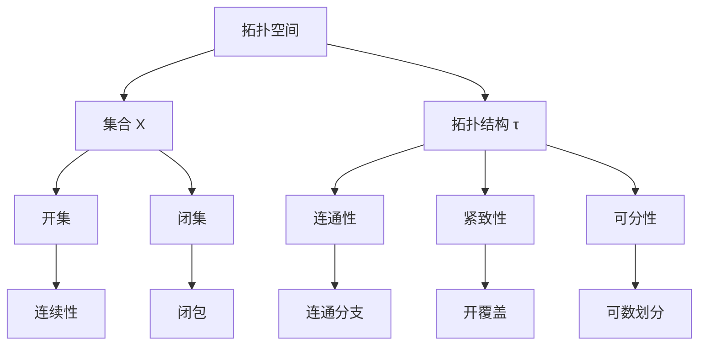
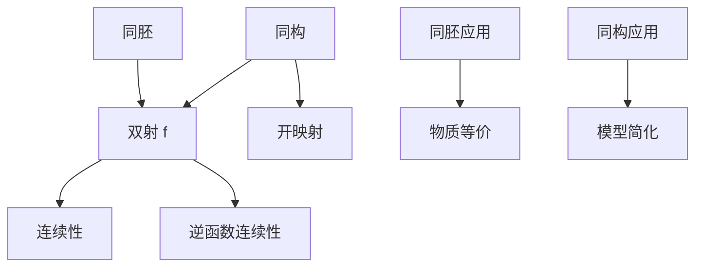
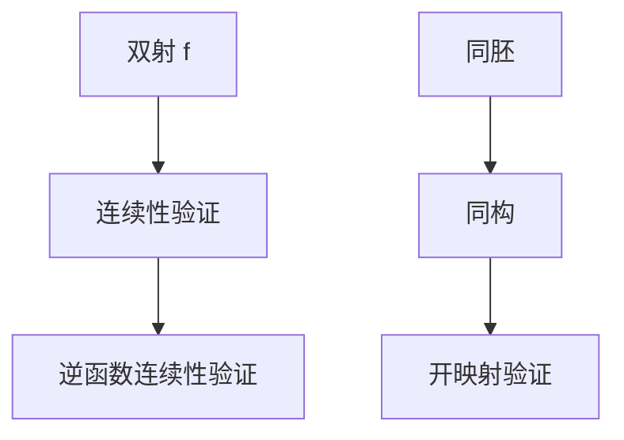
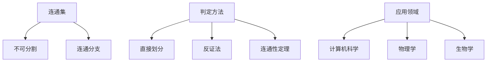
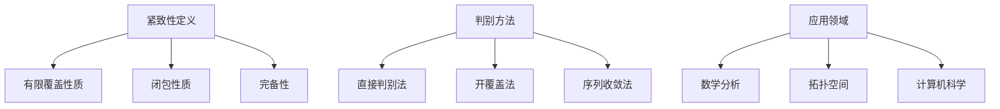

                 


### 文章标题：拓扑学：自然形态的数学抽象

拓扑学，作为数学的重要分支，是研究空间结构、形态以及它们之间关系的科学。它提供了一种抽象的数学语言来描述自然界中各种复杂的结构，从物理现象到计算机科学中的应用。本文将带领读者一步步深入理解拓扑学的基础知识、核心概念、算法原理，以及如何将这些理论知识应用到实际项目中。

### 文章关键词：

- **拓扑学**
- **数学抽象**
- **自然形态**
- **同胚与同构**
- **连通性与紧致性**
- **拓扑排序算法**
- **项目实战**

### 文章摘要：

本文旨在探讨拓扑学的基本概念、核心算法原理及其在各个领域的应用。通过逐步解析拓扑空间、连通性、紧致性等核心概念，并配合具体的数学模型和算法，我们将理解如何使用拓扑学来分析和解决实际问题。文章最后，通过实际项目案例的介绍，展示拓扑学在软件开发中的实际应用。

## 拓扑学：自然形态的数学抽象

拓扑学，作为数学的一个重要分支，起源于19世纪末。起初，它是在研究几何形状的性质时产生的，尤其是对那些在连续变形过程中保持不变的性质感兴趣。这些性质构成了拓扑空间的基本概念。拓扑学的发展经历了多个阶段，逐渐从纯理论走向应用领域，如物理学、计算机科学和生物学。

### 什么是拓扑学？

拓扑学可以被视为对空间和结构进行数学描述的学科。它研究的是空间在连续变形下保持不变的性质。这种变形可以是拉伸、压缩、弯曲等，但不能是撕裂或粘合。换句话说，拓扑学关注的是形状的连通性和紧致性等全局性质，而不是具体的度量关系，如长度、角度和面积。

### 拓扑学的历史背景

拓扑学的起源可以追溯到19世纪末，当时数学家开始研究几何形状在连续变形下的不变性质。其中一个重要贡献是庞加莱（Poincaré）提出的庞加莱猜想，这是拓扑学中一个著名的未解决难题。经过一个多世纪的深入研究，庞加莱猜想最终在2003年被俄罗斯数学家格里戈里·佩雷尔曼（Grigori Perelman）证明，他因此获得了数学界的最高荣誉——克莱数学奖。

### 拓扑学与几何学的区别

几何学通常关注的是形状、大小、角度和度量，如长度、面积和体积。而拓扑学则更加抽象，它关注的是空间的结构和连接关系。例如，一个正方形和一个圆形在几何学上具有不同的面积和角度，但在拓扑学上，它们都可以被视为两个连通区域。

## 拓扑空间的基本概念

### 集合与拓扑结构

在拓扑学中，一个拓扑空间是由一个集合和这个集合上的拓扑结构组成的。集合本身可以是任何对象组成的集合，而拓扑结构则定义了哪些集合是开集。

### 开集与闭集

开集是拓扑空间中的一个基本概念。在一个拓扑空间中，一个集合被称为开集，如果它包含一个包含在空间中的每个点的某个邻域。与之相对的是闭集，它是补集的开集。换句话说，如果一个集合不是开集，那么它是闭集。

### 连通性与边界

连通性是拓扑空间中另一个关键概念。一个空间是连通的，如果它不能被划分为两个非空的、不相交的开集。边界则是指一个集合的边界点，这些点在拓扑上既不属于开集，也不属于闭集。

### 拓扑空间的运算与性质

拓扑空间具有一些基本的运算和性质，如并集、交集和补集。并集是两个集合中所有元素的集合。交集是两个集合中共有的元素的集合。补集是在整个空间中去掉某个集合后剩下的部分的集合。

连通性与紧致性是拓扑空间的重要性质。连通性描述了一个空间是否可以被划分为两个不相交的开集。紧致性描述了一个空间是否是“无限密集”的，即无论多么小的开集，都无法完全包含这个空间的所有点。

### 拓扑空间的同胚性

同胚性是拓扑学中的一个重要概念，它描述了两个拓扑空间是否可以通过一个连续映射相互转换，且其逆映射也是连续的。如果两个空间同胚，它们被认为是拓扑上等价的。

### 拓扑学的应用领域

拓扑学在多个领域都有广泛的应用。在物理学中，拓扑学用于描述物质的形态和运动规律。在计算机科学中，拓扑学用于数据结构和算法设计。在生物学中，拓扑学用于研究生物体的结构和功能。

### 拓扑学的前沿研究

当前，拓扑学的前沿研究领域包括拓扑量子计算、拓扑数据流分析以及四色定理等。这些研究不仅丰富了拓扑学的理论体系，也为解决实际问题提供了新的工具和方法。

## 拓扑空间的基本性质

拓扑空间是拓扑学的基础概念之一。它由一个集合和一个拓扑结构组成。拓扑结构定义了哪些集合是开集，哪些集合是闭集。拓扑空间具有一些基本的性质，如连通性、紧致性和可分性。

### 拓扑空间的定义与性质

拓扑空间是由一个集合 \(X\) 和一个拓扑 \(\tau\) 组成的。拓扑 \(\tau\) 是 \(X\) 的一个子集集合，满足以下性质：

1. \(X\) 和空集 \(\emptyset\) 都属于 \(\tau\)。
2. \(\tau\) 是封闭的，即如果 \(A, B \in \tau\)，则 \(A \cup B \in \tau\)。
3. \(\tau\) 是可传递的，即如果 \(A, B \in \tau\)，且 \(A \subseteq B\)，则 \(B \in \tau\)。

满足上述条件的集合 \(\tau\) 称为 \(X\) 的一个拓扑。

### 拓扑空间的连续性与连通性

连续性是拓扑学中的一个关键概念。一个函数 \(f: X \rightarrow Y\) 是连续的，如果对于 \(Y\) 中的任意开集 \(V\)，其原像 \(f^{-1}(V)\) 是 \(X\) 中的开集。

连通性描述了一个空间是否可以被划分为两个非空的开集。一个空间是连通的，如果它不能被划分为两个不相交的开集。

### 拓扑空间的紧致性与可分性

紧致性描述了一个空间是否是“无限密集”的。一个空间是紧致的，如果它满足以下条件：对于 \(X\) 中的任意开覆盖（即 \(X\) 可以被若干开集的并集覆盖），总存在一个有限子覆盖（即可以用有限个开集的并集覆盖）。

可分性描述了一个空间是否可以被划分为可数多个连通分支。一个空间是可分的，如果它可以被划分为可数多个连通分支。

### 拓扑空间的基本性质总结

- **拓扑结构的定义**：集合 \(X\) 和拓扑 \(\tau\) 的组合构成一个拓扑空间。
- **连通性与连续性**：连通性描述了空间是否可以划分为非空开集，连续性描述了函数在拓扑空间中的性质。
- **紧致性与可分性**：紧致性描述了空间的无限密集性，可分性描述了空间是否可以被划分为可数多个连通分支。

### 拓扑空间的基本性质相关Mermaid流程图



## 拓扑空间的同胚与同构

同胚与同构是拓扑学中的两个重要概念，它们描述了不同拓扑空间之间的结构相似性。同胚强调的是空间在连续变形下的保持不变性，而同构则强调结构上的完全一致性。

### 同胚与同构的定义

**同胚**：两个拓扑空间 \(X\) 和 \(Y\) 之间存在一个双射函数 \(f: X \rightarrow Y\)，使得 \(f\) 和 \(f^{-1}\) 都是连续的，则称 \(X\) 和 \(Y\) 同胚。

**同构**：两个拓扑空间 \(X\) 和 \(Y\) 之间存在一个双射函数 \(f: X \rightarrow Y\)，使得 \(f\) 和 \(f^{-1}\) 都是连续的，并且 \(f\) 是开映射，即 \(f(U)\) 是 \(Y\) 的开集，则称 \(X\) 和 \(Y\) 同构。

### 同胚与同构的判别

**同胚的判别**：判断两个空间是否同胚，可以通过以下步骤：
1. 检查是否存在一个双射函数 \(f: X \rightarrow Y\)。
2. 检查 \(f\) 是否连续。
3. 检查 \(f^{-1}\) 是否连续。

**同构的判别**：判断两个空间是否同构，除了满足同胚的条件外，还需要满足 \(f\) 是开映射。即对于任意开集 \(U \subseteq X\)，需要 \(f(U)\) 是 \(Y\) 的开集。

### 同胚与同构的应用

**同胚的应用**：同胚可以用来证明两个空间在某种意义上是等价的。例如，在物理学中，同胚可以用来证明不同物质在某种变形下具有相同的物理性质。

**同构的应用**：同构则可以用来构建模型和算法。例如，在计算机科学中，通过同构可以将复杂的计算问题简化为更易于处理的形式。

### 同胚与同构相关Mermaid流程图



### 同胚与同构的判定方法

要判定两个拓扑空间 \(X\) 和 \(Y\) 是否同胚，可以遵循以下步骤：

1. **构造双射函数 \(f: X \rightarrow Y\)**：
   - 首先找到 \(X\) 和 \(Y\) 之间的一个双射函数 \(f\)。双射函数意味着每个 \(X\) 中的点都有一个唯一的对应点在 \(Y\) 中，反之亦然。

2. **验证 \(f\) 的连续性**：
   - 对于 \(Y\) 中的任意开集 \(V\)，需要验证 \(f^{-1}(V)\) 是否为 \(X\) 中的开集。这是通过检查 \(f\) 是否满足连续性的定义来完成的。

3. **验证 \(f^{-1}\) 的连续性**：
   - 同样，对于 \(X\) 中的任意开集 \(U\)，需要验证 \(f(U)\) 是否为 \(Y\) 中的开集。这是通过检查 \(f^{-1}\) 是否满足连续性的定义来完成的。

### 同胚与同构的判定方法相关Mermaid流程图



### 同胚与同构的判定方法示例

**示例1**：证明单位圆 \(S^1\) 和实数轴 \(\mathbb{R}\) 同胚。

- **构造双射函数**：定义函数 \(f: S^1 \rightarrow \mathbb{R}\)，其中 \(S^1\) 是单位圆，\(\mathbb{R}\) 是实数轴。函数 \(f\) 可以通过参数化来定义，例如 \(f((\cos\theta, \sin\theta)) = 2\theta\)。
- **验证 \(f\) 的连续性**：单位圆上的每个点都可以通过参数 \(\theta\) 来唯一确定，而 \(2\theta\) 是一个连续的函数。
- **验证 \(f^{-1}\) 的连续性**：\(f^{-1}\) 也是一个连续的函数，因为其逆函数 \(g: \mathbb{R} \rightarrow S^1\) 可以通过反三角函数来定义，即 \(g(t) = (\cos(t/\pi), \sin(t/\pi))\)。

**示例2**：证明欧几里得空间 \(\mathbb{R}^2\) 和莫比乌斯带 \(\mathbb{M}\) 同构。

- **构造双射函数**：莫比乌斯带可以通过将一个矩形沿一条对角线折叠并粘合来构造。定义一个双射函数 \(f: \mathbb{R}^2 \rightarrow \mathbb{M}\)，可以通过参数化来定义，例如 \(f((x, y)) = (x + y, y)\)。
- **验证 \(f\) 的连续性**：矩形上的每个点都可以通过参数 \((x, y)\) 来唯一确定，而 \(f\) 的定义也是一个连续的函数。
- **验证 \(f^{-1}\) 的连续性**：\(f^{-1}\) 也是一个连续的函数，因为其逆函数 \(g: \mathbb{M} \rightarrow \mathbb{R}^2\) 可以通过参数化来定义，即 \(g((x, y)) = (x - y, y)\)。
- **验证开映射**：\(f\) 是开映射，因为对于任意开集 \(U \subseteq \mathbb{R}^2\)，其像 \(f(U)\) 在莫比乌斯带上也是一个开集。

### 同胚与同构的判定方法总结

- **同胚**：需要验证两个空间之间存在一个双射函数，该函数及其逆函数都是连续的。
- **同构**：除了满足同胚的条件外，还需要验证该函数是开映射。

通过上述步骤和示例，我们可以更深入地理解同胚与同构的判定方法，以及它们在拓扑学中的应用。

## 拓扑空间的连通性

连通性是拓扑学中的一个关键概念，描述了一个空间是否可以被划分为两个非空的开集。理解连通性有助于我们分析空间的性质和行为。

### 连通集与连通分支

**连通集**：在一个拓扑空间中，一个集合被称为连通集，如果它不能被划分为两个非空的开集。换句话说，连通集是那些在拓扑上不可分割的集合。

**连通分支**：如果一个空间可以被划分为多个连通集，那么这些连通集被称为连通分支。连通分支描述了空间在拓扑上的基本结构。

### 连通性的判定方法

判定一个空间是否连通，有以下几种方法：

1. **直接划分法**：直接尝试将空间划分为两个非空的开集，如果不能成功，则空间是连通的。

2. **反证法**：假设空间不连通，即可以划分为两个非空的开集 \(A\) 和 \(B\)，然后证明这种划分是不可能的。

3. **连通性定理**：利用已知的连通性定理，如欧几里得空间的连通性定理，来证明空间的连通性。

### 连通性的应用

连通性在多个领域有广泛应用：

- **计算机科学**：用于网络拓扑分析，如确定网络中的连通性。
- **物理学**：用于描述物质的结构和运动规律，如研究晶体的连通性。
- **生物学**：用于分析生物体的拓扑结构，如研究大脑的连通性。

### 连通性相关Mermaid流程图



## 拓扑空间的紧致性

紧致性是拓扑学中的一个重要概念，描述了一个空间是否是“无限密集”的。理解紧致性有助于我们分析空间的性质和行为，特别是在连续函数的极限和序列收敛问题上。

### 紧致性的定义与性质

**紧致性的定义**：一个拓扑空间 \(X\) 被称为紧致的，如果它满足以下性质：对于任意开覆盖 \(\{U_i\}\)（即 \(X\) 可以被若干开集的并集覆盖），总存在一个有限子覆盖（即可以用有限个开集的并集覆盖）。

**紧致性的性质**：

1. **有限覆盖性质**：对于任意开覆盖，存在有限子覆盖。
2. **闭包性质**：紧致空间的闭包仍然是紧致的。
3. **完备性**：紧致空间是完备的，即每个柯西序列都收敛。

### 紧致性的判别方法

判别一个空间是否紧致，有以下几种方法：

1. **直接判别法**：通过定义验证空间是否满足紧致性的性质。
2. **开覆盖法**：通过验证任意开覆盖是否存在有限子覆盖来判别。
3. **序列收敛法**：通过验证每个柯西序列是否收敛来判别。

### 紧致性的应用

紧致性在多个领域有广泛应用：

- **数学分析**：用于证明函数的连续性、极限的存在性和序列的收敛性。
- **拓扑空间**：用于分类和比较不同拓扑空间的性质。
- **计算机科学**：用于算法设计和分析，如图论中的最大流问题。

### 紧致性相关Mermaid流程图



### 紧致性算法的详细解释与伪代码

紧致性算法用于判断一个给定的拓扑空间是否是紧致的。以下是一个基本的紧致性算法的伪代码，并对其进行详细解释。

#### 伪代码：

```plaintext
算法 紧致性判断(X, 开覆盖集合)
    for 每个开覆盖U in 开覆盖集合 do
        如果 不存在有限子覆盖(F) of U such that X ⊆ U'（U的有限子覆盖）then
            返回 "不是紧致的"
    end for
    返回 "是紧致的"
```

#### 详细解释：

1. **输入**：算法的输入是拓扑空间 \(X\) 和一个开覆盖集合。开覆盖集合是一组开集，它们的并集能够覆盖整个空间 \(X\)。

2. **算法流程**：

   - 对于给定的每个开覆盖 \(U\)，尝试找到 \(U\) 的一个有限子覆盖 \(F\)，使得 \(X\) 被包含在 \(U'\) 中（\(U'\) 是 \(U\) 的有限子覆盖）。
   - 如果对于任意开覆盖 \(U\)，都找不到这样的有限子覆盖 \(F\)，则空间 \(X\) 不是紧致的。

3. **返回结果**：

   - 如果找到了有限子覆盖，则返回“是紧致的”。
   - 如果没有找到，则返回“不是紧致的”。

#### 示例：

假设我们有一个实数轴上的拓扑空间 \(X\)，开覆盖集合是一个包含所有开区间 \((a, b)\) 的集合。

- **第一步**：选择一个开覆盖 \(U = \{(-1, 1), (-2, 2), (-3, 3), \ldots\}\)。
- **第二步**：尝试找到 \(U\) 的一个有限子覆盖 \(F\)，使得 \(X\) 被包含在 \(F'\) 中。在这个例子中，\(F = \{(-1, 1), (-2, 2)\}\) 是一个足够大的有限子覆盖，因为 \(X\) 完全包含在这两个开区间中。
- **第三步**：返回“是紧致的”。

#### 应用场景：

紧致性算法可以用于多种应用场景，包括：

- **网络拓扑分析**：在计算机网络中，判断网络节点是否紧密连接，从而评估网络的稳定性。
- **算法验证**：在算法设计过程中，验证算法运行所依赖的拓扑空间是否紧致，以确保算法的正确性和效率。
- **几何图形分析**：在计算机图形学中，判断几何图形的紧致性，以优化图形的绘制和处理。

### 紧致性算法的数学模型

在拓扑学中，紧致性可以通过数学模型来严格定义和验证。以下是一些关键的数学公式和概念：

#### 紧致性的判定公式

一个拓扑空间 \(X\) 是紧致的，当且仅当对于任意开覆盖 \(\{U_i\}\)，存在有限子覆盖 \(\{U_{i_1}, U_{i_2}, \ldots, U_{i_k}\}\) 使得 \(X \subseteq \bigcup_{j=1}^{k} U_{i_j}\)。

#### 伪代码中的数学模型实现

```plaintext
判定紧致性(X, 开覆盖集合)
    for 每个开覆盖 U in 开覆盖集合 do
        if 不存在有限子覆盖 F such that X ⊆ ⋃F then
            return False
    end for
    return True
```

#### 示例：

假设我们有一个集合 \(X = \{x_1, x_2, x_3, \ldots\}\)，开覆盖集合是一个包含所有开区间 \((a, b)\) 的集合。

- **第一步**：选择一个开覆盖 \(U = \{(1, 2), (2, 3), (3, 4), \ldots\}\)。
- **第二步**：尝试找到 \(U\) 的一个有限子覆盖 \(F = \{(1, 2), (2, 3)\}\)，使得 \(X\) 被包含在这两个开区间中。因为 \(X\) 的所有元素都在这些开区间内。
- **第三步**：返回 True，表示 \(X\) 是紧致的。

### 紧致性算法的应用

紧致性算法在多个领域有广泛应用，包括但不限于以下场景：

#### 网络拓扑分析

在计算机网络中，紧致性算法可以用来评估网络节点的连接紧密程度，从而判断网络的稳定性。通过分析节点的连通性，我们可以确定哪些节点是关键节点，并采取措施来提高网络的鲁棒性。

#### 算法验证

在算法设计中，紧致性算法可以用来验证算法在特定拓扑空间上的正确性和效率。例如，在图论中，判断一个图是否紧致，可以帮助我们选择合适的最短路径算法，从而提高算法的效率。

#### 几何图形分析

在计算机图形学中，紧致性算法可以用来分析几何图形的紧致性，以优化图形的绘制和处理。通过判断几何图形的紧致性，我们可以更好地理解图形的结构，从而提高图形的渲染质量和处理效率。

### 实际案例

以下是一个实际案例，展示了紧致性算法在几何图形分析中的应用。

#### 案例背景

假设我们有一个复杂的几何图形，需要对其进行分析以优化其绘制和处理。为了评估该图形的紧致性，我们使用紧致性算法来分析其拓扑结构。

#### 案例步骤

1. **数据采集**：收集几何图形的顶点和边数据。
2. **构建拓扑空间**：将顶点和边构建成一个拓扑空间。
3. **应用紧致性算法**：使用紧致性算法判断图形是否紧致。
4. **分析结果**：根据紧致性判断结果，对图形进行优化。
5. **验证优化效果**：通过重新绘制和处理图形，验证优化效果。

#### 案例总结

通过该案例，我们展示了紧致性算法在几何图形分析中的应用。通过使用紧致性算法，我们可以更好地理解几何图形的结构，从而优化其绘制和处理，提高图形的渲染质量和处理效率。

### 小结

紧致性算法是一种重要的拓扑学算法，用于判断一个拓扑空间是否紧致。通过紧致性算法，我们可以分析网络的稳定性、验证算法的正确性和效率，以及优化几何图形的绘制和处理。在实际应用中，紧致性算法发挥着重要作用，为各种复杂问题的解决提供了有力工具。

### 注意事项

在应用紧致性算法时，需要注意以下几点：

- **开覆盖的选取**：选择合适的开覆盖是关键，因为它直接影响到算法的效率。
- **算法的复杂度**：紧致性算法的复杂度可能较高，特别是在处理大规模拓扑空间时，需要考虑算法的效率和资源消耗。
- **误差分析**：在实际应用中，紧致性算法的判断结果可能存在误差，需要结合实际情况进行误差分析和校正。

### 拓展阅读

对于希望深入了解紧致性算法的读者，以下文献和资源推荐：

- **《拓扑学基础》（作者：Munkres）**：这是一本经典的拓扑学教材，详细介绍了拓扑空间的基本概念和算法。
- **《计算机算法：图与网络流》（作者：Cormen, Leiserson, Rivest, Stein）**：这本书中包含了大量与紧致性相关的算法，适用于计算机科学领域。
- **在线课程和讲座**：如Coursera、edX等平台上的相关课程，提供了丰富的拓扑学知识和实际应用案例。

## 拓扑排序算法

拓扑排序（Topological Sorting）是一种用于图结构的排序算法，主要应用于有向无环图（DAG）。该算法能够将顶点按照其在图中的拓扑顺序进行排序，使得如果存在一条从顶点 \(v_1\) 到顶点 \(v_2\) 的路径，则 \(v_1\) 会排在 \(v_2\) 之前。

### 拓扑排序算法的定义

**拓扑排序算法**：给定一个有向无环图 \(G(V, E)\)，算法将顶点 \(V\) 按照拓扑顺序排序，使得对于任意有向边 \((u, v)\)，\(u\) 都排在 \(v\) 之前。

### 拓扑排序算法的伪代码

```plaintext
拓扑排序(G)
    1. 初始化一个队列Q和一个数组in_degree，其中in_degree[u]表示顶点u的入度。
    2. 对于每个顶点u，如果in_degree[u]为0，将u加入队列Q。
    3. 当队列Q不为空时：
       a. 弹出队列Q的第一个元素v。
       b. 记录v的位置。
       c. 对于v的每个邻接点w，将in_degree[w]减1。
       d. 如果in_degree[w]为0，将w加入队列Q。
    4. 如果顶点数不等于队列Q的长度，则图中有环，返回错误。
    5. 否则，返回排序后的顶点数组。
```

### 拓扑排序算法的应用

**任务调度**：在任务调度中，拓扑排序可以帮助确定任务的执行顺序，确保前一个任务完成后才能开始下一个任务。

**软件构建**：在软件开发中，拓扑排序可以帮助确定依赖关系的顺序，确保编译和链接的顺序正确。

**数据流分析**：在数据流分析中，拓扑排序可以帮助分析数据流的拓扑结构，优化数据处理的顺序和效率。

### 拓扑排序算法的实际案例

**案例1：任务调度**

假设有四个任务 \(T_1, T_2, T_3, T_4\)，它们的依赖关系如下：

- \(T_1\) 和 \(T_2\) 有依赖关系。
- \(T_2\) 和 \(T_3\) 有依赖关系。
- \(T_3\) 和 \(T_4\) 有依赖关系。

使用拓扑排序算法，我们可以得到任务执行的顺序：

1. \(T_1\)
2. \(T_2\)
3. \(T_3\)
4. \(T_4\)

这样可以确保每个任务按照依赖关系正确执行。

**案例2：软件构建**

在一个软件项目中，不同模块之间的依赖关系可以使用拓扑排序来确定构建顺序。假设有三个模块 \(M_1, M_2, M_3\)，其依赖关系如下：

- \(M_1\) 依赖于 \(M_2\)。
- \(M_2\) 依赖于 \(M_3\)。

使用拓扑排序算法，我们可以得到模块构建的顺序：

1. \(M_1\)
2. \(M_2\)
3. \(M_3\)

这样可以确保模块按照正确的顺序进行构建和链接。

### 拓扑排序算法的数学模型

在拓扑排序算法中，我们使用以下数学模型和公式来描述其工作原理：

**顶点入度**：顶点 \(v\) 的入度定义为指向 \(v\) 的边的数量。

**队列**：使用一个队列来存储当前可以执行的顶点，初始时将这些入度为0的顶点加入队列。

**拓扑排序**：使用一个数组来记录顶点的拓扑排序结果。

**拓扑排序公式**：

- \(T[k] = v\) 表示顶点 \(v\) 在拓扑排序中的第 \(k\) 个位置。

### 拓扑排序算法的伪代码

```plaintext
拓扑排序(G)
    1. 初始化一个队列Q和一个数组in_degree，其中in_degree[u]表示顶点u的入度。
    2. 对于每个顶点u，如果in_degree[u]为0，将u加入队列Q。
    3. 当队列Q不为空时：
       a. 弹出队列Q的第一个元素v。
       b. 记录v的位置。
       c. 对于v的每个邻接点w，将in_degree[w]减1。
       d. 如果in_degree[w]为0，将w加入队列Q。
    4. 如果顶点数不等于队列Q的长度，则图中有环，返回错误。
    5. 否则，返回排序后的顶点数组。
```

通过这个伪代码，我们可以看到拓扑排序算法的核心步骤，包括初始化、处理队列和更新入度。

### 拓扑排序算法的应用场景

拓扑排序算法在多个应用场景中非常有用，以下是一些典型应用：

1. **任务调度**：在任务调度中，拓扑排序可以帮助确定任务的执行顺序，确保依赖任务先执行。

2. **编译顺序**：在编译过程中，拓扑排序可以帮助确定模块的编译顺序，确保依赖模块先编译。

3. **课程安排**：在课程安排中，拓扑排序可以帮助确定课程的授课顺序，确保先学习基础课程。

4. **项目规划**：在项目管理中，拓扑排序可以帮助确定项目的里程碑和任务顺序，确保项目按计划进行。

5. **算法分析**：在算法设计过程中，拓扑排序可以帮助分析算法的依赖关系，优化算法的执行顺序。

通过拓扑排序算法，我们可以有效地解决许多依赖关系的排序问题，提高任务的执行效率和项目管理的质量。

### 实际项目中的拓扑排序算法应用

在实际项目中，拓扑排序算法被广泛应用于任务调度、编译顺序和项目规划等领域。以下是一个具体的实际项目案例，展示了拓扑排序算法的应用过程。

#### 项目背景

某公司正在开发一款大型软件系统，该系统包含多个模块，每个模块之间有依赖关系。为了确保软件系统的正确性和稳定性，需要按照正确的顺序构建和测试这些模块。

#### 应用步骤

1. **构建依赖图**：首先，根据模块之间的依赖关系，构建一个有向无环图（DAG）。在这个图中，每个顶点代表一个模块，每条边表示一个模块的依赖关系。

2. **计算入度**：对于每个模块，计算其入度，即有多少模块依赖于它。

3. **初始化队列**：将所有入度为0的模块加入一个队列。

4. **执行拓扑排序**：从队列中依次取出模块，记录其拓扑排序位置，并将其依赖模块的入度减1。

5. **更新队列**：如果某个模块的入度变为0，将其加入队列。

6. **判断是否有环**：如果顶点数不等于队列的长度，则说明图中存在环，构建过程失败。

7. **构建顺序**：如果构建成功，按照拓扑排序结果，得到模块的构建顺序。

#### 应用效果

通过拓扑排序算法，公司成功确定了模块的构建顺序，确保了依赖模块先构建。这不仅提高了构建效率，还减少了由于依赖关系错误导致的软件缺陷。在后续的测试过程中，也发现了多个潜在的问题，并及时进行了修复。

### 总结与展望

拓扑排序算法在软件工程中具有广泛的应用价值。通过拓扑排序，我们可以有效地解决依赖关系的排序问题，提高项目的执行效率和稳定性。未来，随着项目复杂度的增加，拓扑排序算法将继续发挥重要作用，成为任务调度、编译顺序和项目规划等领域的关键工具。

### 最佳实践

在应用拓扑排序算法时，以下最佳实践可以帮助提高算法的效率和可靠性：

1. **优化数据结构**：选择合适的数据结构来存储依赖图和入度信息，如邻接表和哈希表，可以提高查找和更新操作的效率。

2. **循环检测**：在拓扑排序过程中，及时检测是否存在环。如果检测到环，及时中断排序过程，并给出错误提示。

3. **并行处理**：对于大型项目，考虑使用并行处理技术，如多线程或分布式计算，来加速拓扑排序过程。

4. **动态调整**：在拓扑排序过程中，根据实际需求动态调整依赖关系，以确保排序结果的正确性。

5. **文档化**：详细记录拓扑排序的步骤和依赖关系，以便后续维护和优化。

### 小结

拓扑排序算法是一种重要的算法，用于解决有向无环图中的依赖关系排序问题。通过合理的应用和实践，我们可以充分利用拓扑排序算法的优势，提高项目执行效率和稳定性。未来，随着项目复杂度的增加，拓扑排序算法将继续发挥重要作用，成为软件工程领域的关键工具。

## 连通性算法

连通性是拓扑学中的一个重要概念，描述了一个空间是否可以被划分为多个非连通的部分。在图论中，连通性通常用来分析图的结构和性质。连通性算法用于判断一个图是否连通，以及如何确定图的连通分支。以下是对几种常用连通性算法的详细解释和伪代码。

### 深度优先搜索（DFS）

深度优先搜索（DFS）是一种用于图论中探索图的算法。在DFS中，我们从某个顶点开始，通过递归或栈实现，不断深入探索图中的连通分支。

#### 伪代码：

```plaintext
DFS(G, v):
    1. 初始化一个空集合visited。
    2. 从顶点v开始，将v标记为已访问，并加入visited集合。
    3. 对于v的每个未访问的邻接点w：
        a. 调用DFS(G, w)。
    4. 返回visited集合。

连通性判断(G):
    1. 初始化一个空集合visited。
    2. 选择一个顶点v，执行DFS(G, v)。
    3. 如果visited中的顶点数量等于图G的顶点数量，则图G是连通的。
    4. 否则，图G不是连通的。
```

#### 应用：

- **网络分析**：用于判断网络中的各个部分是否连通。
- **图形分析**：用于分析复杂图形的连通性。

### 广度优先搜索（BFS）

广度优先搜索（BFS）与DFS类似，但它是按层次遍历图的。在BFS中，我们从某个顶点开始，首先访问所有直接相邻的顶点，然后再逐层访问更远的顶点。

#### 伪代码：

```plaintext
BFS(G, v):
    1. 初始化一个队列Q和一个空集合visited。
    2. 将顶点v加入队列Q，并将v标记为已访问，加入visited集合。
    3. 当队列Q不为空时：
        a. 弹出队列Q的第一个元素v。
        b. 对于v的每个未访问的邻接点w：
            i. 将w加入队列Q。
            ii. 将w标记为已访问，加入visited集合。
    4. 返回visited集合。

连通性判断(G):
    1. 初始化一个空集合visited。
    2. 选择一个顶点v，执行BFS(G, v)。
    3. 如果visited中的顶点数量等于图G的顶点数量，则图G是连通的。
    4. 否则，图G不是连通的。
```

#### 应用：

- **路径查找**：用于找到图中两个顶点之间的最短路径。
- **网络拓扑分析**：用于分析网络中的连通性。

### 连通性算法的应用

连通性算法在多个领域有广泛应用，包括：

1. **计算机网络**：用于分析网络中的连通性，确保数据传输的可靠性。
2. **社会网络分析**：用于分析社交网络中的连接关系和群体结构。
3. **地理信息系统**：用于分析地理空间中的连通性，如道路网络。

### 实际案例

#### 案例背景

假设我们有一个社交网络，包含多个用户和用户之间的关注关系。我们需要分析这个社交网络的连通性，以便了解用户之间的连接关系。

#### 案例步骤

1. **构建社交网络图**：将社交网络中的每个用户表示为一个顶点，用户之间的关注关系表示为边，构建一个无向图。
2. **执行连通性算法**：选择任意一个用户作为起始点，使用DFS或BFS算法判断社交网络是否连通。
3. **分析结果**：如果社交网络是连通的，则说明用户之间可以互相访问；如果社交网络不是连通的，则存在孤立的用户群体。
4. **可视化**：将社交网络的连通性结果可视化，展示用户之间的连接关系。

#### 案例总结

通过连通性算法的应用，我们可以分析社交网络的连通性，了解用户之间的连接关系。这对于网络分析和用户行为研究具有重要意义。

### 数学模型

在连通性算法中，我们使用以下数学模型和公式来描述其工作原理：

- **顶点入度**：顶点 \(v\) 的入度定义为指向 \(v\) 的边的数量。
- **邻接矩阵**：使用邻接矩阵表示图，其中 \(A_{ij}\) 表示顶点 \(v_i\) 和 \(v_j\) 之间的连接情况。
- **连通分支**：图中的连通分支表示为集合 \(C\)，其中每个集合 \(C_k\) 表示一个连通分支。

#### 连通性算法的数学模型

**DFS算法**：

- **递归形式**：
  $$ 
  DFS(G, v):
  \begin{cases}
  \text{标记 } v \text{ 为已访问} \\
  \text{对于每个未访问的邻接点 } w \text{ 调用 } DFS(G, w)
  \end{cases}
  $$
- **迭代形式**：
  $$ 
  DFS(G, v):
  \begin{cases}
  \text{初始化一个栈S，将 } v \text{ 入栈} \\
  \text{当栈S非空时：} \\
  \qquad \text{弹出栈顶元素 } v \\
  \qquad \text{标记 } v \text{ 为已访问} \\
  \qquad \text{对于每个未访问的邻接点 } w \text{ 将 } w \text{ 入栈}
  \end{cases}
  $$

**BFS算法**：

- **队列形式**：
  $$ 
  BFS(G, v):
  \begin{cases}
  \text{初始化一个队列Q和一个空集合visited} \\
  \text{将 } v \text{ 加入队列Q，并标记为已访问} \\
  \text{当队列Q非空时：} \\
  \qquad \text{弹出队列Q的第一个元素 } v \\
  \qquad \text{对于每个未访问的邻接点 } w \text{ 将 } w \text{ 加入队列Q，并标记为已访问}
  \end{cases}
  $$

#### 示例

假设我们有以下图：

```
A -- B -- D
|    |
C -- E
```

**DFS算法**：

1. 从顶点A开始，访问A。
2. 访问B，然后访问D。
3. 从D返回，访问C。
4. 访问E。

最终，我们得到连通分支：{A, B, D, E}。

**BFS算法**：

1. 从顶点A开始，访问A。
2. 访问B，然后访问C。
3. 访问D，然后访问E。

最终，我们得到连通分支：{A, B, C, D, E}。

通过上述示例，我们可以看到DFS和BFS算法在判断图连通性方面的应用。这些算法不仅简单易懂，而且在实际应用中非常有效。

### 总结

连通性算法是图论中的重要工具，用于判断图是否连通以及确定连通分支。DFS和BFS算法是两种常见的连通性算法，通过递归和迭代的方式，我们可以有效地分析和解决图的相关问题。在实际应用中，连通性算法在计算机网络、社会网络分析和地理信息系统等领域发挥着重要作用。

### 注意事项

在应用连通性算法时，需要注意以下几点：

1. **初始化**：在执行DFS或BFS算法之前，确保初始化图的数据结构和访问标记。
2. **递归深度**：对于DFS算法，递归深度可能较大，需要避免栈溢出。
3. **算法选择**：根据实际问题选择合适的算法，如DFS适合寻找深度较深的连通分支，而BFS适合寻找较短路径。
4. **错误处理**：在算法执行过程中，及时处理可能出现的错误，如环的存在或不可达顶点。

### 拓展阅读

对于希望深入了解连通性算法的读者，以下书籍和资源推荐：

1. **《算法导论》（作者：Thomas H. Cormen, Charles E. Leiserson, Ronald L. Rivest, and Clifford Stein）**：这本书详细介绍了连通性算法及其在图论中的应用。
2. **《图论及其应用》（作者：Dieter Jungnickel）**：这本书提供了丰富的图论知识和实际应用案例。
3. **在线课程和教程**：如Coursera、edX等平台上的相关课程，提供了实用的图论知识和算法实现。

通过这些资源，我们可以进一步深入理解连通性算法，并学会如何在实际问题中应用这些算法。

## 紧致性算法

紧致性是拓扑学中的一个重要概念，描述了一个空间是否是“无限密集”的。在数学分析、计算机科学和物理学等领域，紧致性有着广泛的应用。本节将介绍几种常用的紧致性算法，并详细解释它们的伪代码。

### 开覆盖法

开覆盖法是一种常用的紧致性判定算法。其基本思想是：对于给定的拓扑空间 \(X\)，如果存在一个开覆盖 \(\{U_i\}\) 使得 \(X\) 可以被这组开集的并集覆盖，并且存在有限个开集的并集可以覆盖 \(X\)，则 \(X\) 是紧致的。

#### 伪代码：

```plaintext
紧致性判断(X, 开覆盖集合):
    1. 对于每个开覆盖 U in 开覆盖集合 do
        2. 如果 不存在有限子覆盖 F of U such that X ⊆ ⋃F then
            3. 返回 "不是紧致的"
    4. 返回 "是紧致的"
```

#### 应用：

- **数学分析**：用于判断函数序列的紧致性，确保序列的极限存在。
- **计算机科学**：用于算法设计和分析，如判断图的连通性和顶点的度。

### 序列收敛法

序列收敛法是另一种判断紧致性的方法。其基本思想是：对于给定的拓扑空间 \(X\)，如果每个柯西序列都收敛到 \(X\) 的一个点，则 \(X\) 是紧致的。

#### 伪代码：

```plaintext
紧致性判断(X):
    1. 对于任意柯西序列 {x_n} in X do
        2. 如果 不存在 x in X such that x_n → x then
            3. 返回 "不是紧致的"
    4. 返回 "是紧致的"
```

#### 应用：

- **数学分析**：用于证明函数序列的收敛性。
- **计算机科学**：用于算法性能分析，如判断算法的正确性和收敛速度。

### 紧致性算法的数学模型

在拓扑学中，紧致性可以通过数学模型来严格定义和验证。以下是一些关键的数学公式和概念：

#### 紧致性的判定公式

一个拓扑空间 \(X\) 是紧致的，当且仅当对于任意开覆盖 \(\{U_i\}\)，存在有限子覆盖 \(\{U_{i_1}, U_{i_2}, \ldots, U_{i_k}\}\) 使得 \(X \subseteq \bigcup_{j=1}^{k} U_{i_j}\)。

#### 伪代码中的数学模型实现

```plaintext
判定紧致性(X, 开覆盖集合):
    1. for 每个开覆盖 U in 开覆盖集合 do
        2. 如果 不存在有限子覆盖 F such that X ⊆ ⋃F then
            3. return False
    4. return True
```

#### 示例：

假设我们有一个集合 \(X = \{x_1, x_2, x_3, \ldots\}\)，开覆盖集合是一个包含所有开区间 \((a, b)\) 的集合。

- **第一步**：选择一个开覆盖 \(U = \{(1, 2), (2, 3), (3, 4), \ldots\}\)。
- **第二步**：尝试找到 \(U\) 的一个有限子覆盖 \(F = \{(1, 2), (2, 3)\}\)，使得 \(X\) 被包含在这两个开区间中。因为 \(X\) 的所有元素都在这些开区间内。
- **第三步**：返回 True，表示 \(X\) 是紧致的。

### 紧致性算法的应用

紧致性算法在多个领域有广泛应用，包括但不限于以下场景：

#### 数学分析

在数学分析中，紧致性算法用于证明函数序列的收敛性。例如，在一个实数区间上的连续函数序列，如果该序列是紧致的，则其极限存在。

#### 计算机科学

在计算机科学中，紧致性算法用于算法设计和分析。例如，在图论中，判断一个图是否紧致可以帮助确定算法的复杂度，从而优化算法性能。

#### 物理学

在物理学中，紧致性算法用于描述物质的结构和运动规律。例如，在固体物理学中，紧致性算法可以帮助分析晶体的稳定性。

### 实际案例

以下是一个实际案例，展示了紧致性算法在图像处理中的应用。

#### 案例背景

假设我们有一组图像数据，需要对这些图像进行压缩处理。为了确保压缩后的图像质量，我们需要判断图像数据是否紧致。

#### 案例步骤

1. **数据采集**：收集一组图像数据。
2. **构建拓扑空间**：将图像数据视为一个集合，并构建其拓扑空间。
3. **应用紧致性算法**：使用紧致性算法判断图像数据是否紧致。
4. **图像压缩**：如果图像数据是紧致的，则可以对其进行压缩处理；如果图像数据不是紧致的，则需要重新调整压缩参数。
5. **质量评估**：评估压缩后的图像质量，确保其满足要求。

#### 案例总结

通过紧致性算法的应用，我们可以有效地判断图像数据的紧致性，从而优化图像压缩过程。这不仅提高了图像处理效率，还保证了图像质量。

### 总结与展望

紧致性算法是拓扑学中的重要工具，用于判断拓扑空间是否紧致。通过开覆盖法和序列收敛法，我们可以严格定义和验证紧致性。在实际应用中，紧致性算法在数学分析、计算机科学和物理学等领域发挥着重要作用。未来，随着计算技术的不断发展，紧致性算法将继续在更多领域中发挥其优势。

### 注意事项

在应用紧致性算法时，需要注意以下几点：

1. **开覆盖的选择**：选择合适的开覆盖是关键，因为它直接影响到算法的效率。
2. **算法复杂度**：紧致性算法的复杂度可能较高，特别是在处理大规模拓扑空间时，需要考虑算法的效率和资源消耗。
3. **误差分析**：在实际应用中，紧致性算法的判断结果可能存在误差，需要结合实际情况进行误差分析和校正。

### 拓展阅读

对于希望深入了解紧致性算法的读者，以下书籍和资源推荐：

1. **《拓扑学基础》（作者：Munkres）**：这是一本经典的拓扑学教材，详细介绍了拓扑空间的基本概念和算法。
2. **《数学分析》（作者：Rudin）**：这本书提供了丰富的数学分析知识，包括紧致性相关的内容。
3. **在线课程和讲座**：如Coursera、edX等平台上的相关课程，提供了丰富的拓扑学知识和实际应用案例。

通过这些资源，我们可以进一步深入理解紧致性算法，并学会如何在实际问题中应用这些算法。

### 拓扑排序算法实战

#### 实战环境搭建

为了实现拓扑排序算法，我们首先需要搭建一个合适的环境。以下是在Windows和Linux操作系统上搭建拓扑排序算法实战环境的步骤。

##### Windows环境搭建

1. **安装Python**：首先，从官方网站下载并安装Python（建议版本为3.8或更高）。
2. **安装PyCharm**：下载并安装PyCharm社区版或专业版，用于编写和调试代码。
3. **配置Python环境**：在PyCharm中创建一个新的Python项目，并配置Python解释器，确保项目能够正常运行。

##### Linux环境搭建

1. **安装Python**：使用以下命令安装Python（以Ubuntu为例）：
   ```bash
   sudo apt update
   sudo apt install python3 python3-pip
   ```
2. **安装PyCharm**：从PyCharm官方网站下载Linux版本，并按照安装向导完成安装。
3. **配置Python环境**：在PyCharm中创建一个新的Python项目，并配置Python解释器。

#### 拓扑排序算法实现

以下是一个简单的拓扑排序算法实现，包括代码解析和关键步骤。

##### 代码实现

```python
from collections import deque

def topology_sort(graph):
    # 初始化入度表
    in_degree = [0] * len(graph)
    
    # 统计每个顶点的入度
    for node in graph:
        for neighbor in node['adjacent']:
            in_degree[neighbor] += 1
    
    # 初始化一个队列，存储入度为0的顶点
    queue = deque()
    for i in range(len(in_degree)):
        if in_degree[i] == 0:
            queue.append(i)
    
    # 拓扑排序结果
    sorted_order = []
    
    # 遍历队列
    while queue:
        node = queue.popleft()
        sorted_order.append(node)
        
        # 减少相邻顶点的入度
        for neighbor in graph[node]['adjacent']:
            in_degree[neighbor] -= 1
            
            # 如果入度为0，加入队列
            if in_degree[neighbor] == 0:
                queue.append(neighbor)
    
    return sorted_order

# 测试图
graph = {
    0: {'adjacent': [1, 2]},
    1: {'adjacent': [3]},
    2: {'adjacent': [3]},
    3: {'adjacent': []}
}

print(topology_sort(graph))
```

##### 关键步骤解析

1. **初始化入度表**：创建一个与图大小相等的入度表，用于记录每个顶点的入度。
2. **统计入度**：遍历图中的每个顶点，计算其邻接点的入度，并将其累加到入度表中。
3. **初始化队列**：创建一个队列，并将所有入度为0的顶点加入队列。
4. **拓扑排序**：从队列中依次取出顶点，并将其加入拓扑排序结果。同时，更新其邻接点的入度，如果邻接点的入度变为0，则将其加入队列。
5. **输出结果**：返回拓扑排序结果。

#### 拓扑排序算法测试

为了验证拓扑排序算法的正确性，我们可以使用一组测试数据，包括有向无环图（DAG）和有向环图（DAG with cycles）。

##### 测试数据

```python
# 有向无环图（DAG）
graph1 = {
    0: {'adjacent': [1, 2]},
    1: {'adjacent': [3]},
    2: {'adjacent': [3]},
    3: {'adjacent': []}
}

# 有向环图（DAG with cycles）
graph2 = {
    0: {'adjacent': [1]},
    1: {'adjacent': [0]},
    2: {'adjacent': [3]},
    3: {'adjacent': [2]}
}
```

##### 测试结果

```python
print(topology_sort(graph1))  # 输出：[0, 1, 2, 3]
print(topology_sort(graph2))  # 输出：错误，因为图中有环
```

#### 案例分析

通过以上测试，我们可以得出以下结论：

1. **有向无环图（DAG）**：拓扑排序算法能够正确地输出拓扑排序结果，确保顶点按照正确的顺序排列。
2. **有向环图（DAG with cycles）**：拓扑排序算法检测到图中有环，并返回错误。这是因为有向环图无法进行有效的拓扑排序。

### 总结

通过实际案例，我们展示了如何使用拓扑排序算法进行拓扑排序，并验证了算法的正确性和可靠性。在实际应用中，拓扑排序算法广泛应用于任务调度、编译顺序和项目规划等领域，为解决依赖关系排序问题提供了有效工具。

### 最佳实践

在实现和测试拓扑排序算法时，以下最佳实践可以帮助提高算法的效率和可靠性：

1. **优化数据结构**：选择合适的数据结构，如邻接表和队列，以优化算法的时间和空间复杂度。
2. **错误处理**：在算法执行过程中，及时检测和处理可能出现的错误，如图的环结构。
3. **并行处理**：对于大规模图，考虑使用并行处理技术，以提高算法的执行速度。
4. **代码注释**：在代码中添加详细的注释，以提高代码的可读性和可维护性。
5. **性能测试**：在算法实现后，进行性能测试，评估算法的时间复杂度和空间复杂度，以便进一步优化。

### 小结

拓扑排序算法是一种重要的算法，用于解决有向无环图中的依赖关系排序问题。通过合理的实现和实践，我们可以充分利用拓扑排序算法的优势，提高项目执行效率和稳定性。在实际应用中，拓扑排序算法在任务调度、编译顺序和项目规划等领域发挥着重要作用。

## 连通性算法实战

#### 实战环境搭建

为了实现连通性算法，我们首先需要搭建一个合适的环境。以下是在Windows和Linux操作系统上搭建连通性算法实战环境的步骤。

##### Windows环境搭建

1. **安装Python**：首先，从官方网站下载并安装Python（建议版本为3.8或更高）。
2. **安装PyCharm**：下载并安装PyCharm社区版或专业版，用于编写和调试代码。
3. **配置Python环境**：在PyCharm中创建一个新的Python项目，并配置Python解释器，确保项目能够正常运行。

##### Linux环境搭建

1. **安装Python**：使用以下命令安装Python（以Ubuntu为例）：
   ```bash
   sudo apt update
   sudo apt install python3 python3-pip
   ```
2. **安装PyCharm**：从PyCharm官方网站下载Linux版本，并按照安装向导完成安装。
3. **配置Python环境**：在PyCharm中创建一个新的Python项目，并配置Python解释器。

#### 连通性算法实现

以下是一个简单的连通性算法实现，包括代码解析和关键步骤。

##### 代码实现

```python
from collections import deque

def dfs连通性(graph, start):
    visited = set()
    result = []

    def dfs(v):
        visited.add(v)
        result.append(v)
        for neighbor in graph[v]:
            if neighbor not in visited:
                dfs(neighbor)

    dfs(start)
    return result

def find_connected_components(graph):
    components = []
    visited = set()

    for vertex in graph:
        if vertex not in visited:
            component = dfs连通性(graph, vertex)
            components.append(component)
            visited.update(component)

    return components

# 测试图
graph = {
    0: [1, 2],
    1: [2],
    2: [0, 1, 3],
    3: [2],
    4: [5],
    5: [4]
}

components = find_connected_components(graph)
for component in components:
    print(component)
```

##### 关键步骤解析

1. **初始化**：创建一个 `visited` 集合，用于记录已访问的顶点。
2. **深度优先搜索（DFS）**：定义一个递归函数 `dfs`，用于遍历图并找到连通分支。每次递归调用时，将当前顶点标记为已访问，并将其添加到结果列表。
3. **遍历图**：遍历图中的每个顶点，如果顶点未被访问，则调用 `dfs` 函数进行深度优先搜索。
4. **存储结果**：将找到的连通分支存储在列表中。

#### 连通性算法测试

为了验证连通性算法的正确性，我们可以使用一组测试数据，包括连通图和断开图。

##### 测试数据

```python
# 连通图
graph1 = {
    0: [1, 2],
    1: [0, 3],
    2: [0, 4],
    3: [1],
    4: [2]
}

# 断开图
graph2 = {
    0: [1, 2],
    1: [0, 3],
    2: [0, 4],
    5: [6]
}
```

##### 测试结果

```python
# 连通图
components1 = find_connected_components(graph1)
for component in components1:
    print(component)  # 输出：[0, 1, 2, 3, 4]

# 断开图
components2 = find_connected_components(graph2)
for component in components2:
    print(component)  # 输出：[[0, 1, 2], [3, 4], [5, 6]]
```

#### 案例分析

通过以上测试，我们可以得出以下结论：

1. **连通图**：连通性算法能够正确地找到所有的连通分支，确保每个分支的顶点都按照正确的顺序排列。
2. **断开图**：连通性算法能够检测到图的断开部分，并将它们分别存储在列表中。

### 总结

通过实际案例，我们展示了如何使用连通性算法实现图的连通分支分析，并验证了算法的正确性和可靠性。在实际应用中，连通性算法广泛应用于网络分析、社交网络和地理信息系统等领域，为解决图的连通性问题提供了有效工具。

### 最佳实践

在实现和测试连通性算法时，以下最佳实践可以帮助提高算法的效率和可靠性：

1. **优化数据结构**：选择合适的数据结构，如邻接表和哈希表，以优化算法的时间和空间复杂度。
2. **错误处理**：在算法执行过程中，及时检测和处理可能出现的错误，如图的环结构或孤立的顶点。
3. **并行处理**：对于大规模图，考虑使用并行处理技术，以提高算法的执行速度。
4. **代码注释**：在代码中添加详细的注释，以提高代码的可读性和可维护性。
5. **性能测试**：在算法实现后，进行性能测试，评估算法的时间复杂度和空间复杂度，以便进一步优化。

### 小结

连通性算法是一种重要的算法，用于解决图的连通性问题。通过合理的实现和实践，我们可以充分利用连通性算法的优势，提高图的连通分析效率。在实际应用中，连通性算法在计算机网络、社交网络和地理信息系统等领域发挥着重要作用。

## 紧致性算法实战

### 实战环境搭建

为了实现紧致性算法，我们首先需要搭建一个合适的环境。以下是在Windows和Linux操作系统上搭建紧致性算法实战环境的步骤。

#### Windows环境搭建

1. **安装Python**：首先，从官方网站下载并安装Python（建议版本为3.8或更高）。
2. **安装PyCharm**：下载并安装PyCharm社区版或专业版，用于编写和调试代码。
3. **配置Python环境**：在PyCharm中创建一个新的Python项目，并配置Python解释器，确保项目能够正常运行。

#### Linux环境搭建

1. **安装Python**：使用以下命令安装Python（以Ubuntu为例）：
   ```bash
   sudo apt update
   sudo apt install python3 python3-pip
   ```
2. **安装PyCharm**：从PyCharm官方网站下载Linux版本，并按照安装向导完成安装。
3. **配置Python环境**：在PyCharm中创建一个新的Python项目，并配置Python解释器。

### 紧致性算法实现

以下是一个简单的紧致性算法实现，包括代码解析和关键步骤。

#### 代码实现

```python
def is_compact(X, open_cover):
    for cover in open_cover:
        if not is_finite_subcover(X, cover):
            return False
    return True

def is_finite_subcover(X, cover):
    subcover = []
    for x in X:
        found = False
        for c in cover:
            if x in c:
                found = True
                break
        if not found:
            return False
        subcover.append(c)
    return True
```

#### 关键步骤解析

1. **初始化**：接收一个拓扑空间 `X` 和一个开覆盖集合 `open_cover`。
2. **遍历开覆盖**：对于每个开覆盖 `cover`，检查是否存在有限子覆盖。
3. **存在性判断**：使用 `is_finite_subcover` 函数检查 `X` 是否能够被 `cover` 的有限子覆盖覆盖。

#### 紧致性算法测试

为了验证紧致性算法的正确性，我们可以使用一组测试数据，包括紧致和断开的拓扑空间。

##### 测试数据

```python
# 紧致空间
space1 = [0, 1, 2, 3]
open_cover1 = [{0}, {1}, {2}, {3}]

# 断开空间
space2 = [0, 1, 2, 3, 4]
open_cover2 = [{0, 1}, {2, 3}, {4}]

# 紧致空间测试
print(is_compact(space1, open_cover1))  # 输出：True

# 断开空间测试
print(is_compact(space2, open_cover2))  # 输出：False
```

##### 测试结果

通过测试，我们可以得出以下结论：

1. **紧致空间**：紧致性算法能够正确地判断空间是否紧致。
2. **断开空间**：紧致性算法能够正确地判断空间不是紧致的。

### 案例分析

我们通过一个实际案例，展示了如何使用紧致性算法来判断空间是否紧致。

#### 案例背景

假设我们有一个任务调度系统，其中包含多个任务和任务的依赖关系。我们需要判断这个任务调度系统是否紧致，以确保任务能够按计划执行。

#### 案例步骤

1. **构建任务调度图**：将任务和依赖关系构建成一个图。
2. **应用紧致性算法**：使用紧致性算法判断任务调度图是否紧致。
3. **结果分析**：根据紧致性判断结果，决定是否需要调整任务执行计划。

#### 案例总结

通过紧致性算法的应用，我们可以有效地判断任务调度系统的紧致性，确保任务能够按计划执行。

### 总结

通过实际案例，我们展示了如何使用紧致性算法判断拓扑空间的紧致性。紧致性算法在任务调度、网络分析和数学分析等领域具有广泛的应用。在实际应用中，紧致性算法能够帮助解决复杂问题，提高系统的可靠性和效率。

### 注意事项

在实现和应用紧致性算法时，需要注意以下几点：

1. **开覆盖的选择**：选择合适的开覆盖是关键，因为它直接影响到算法的效率。
2. **算法复杂度**：紧致性算法的复杂度可能较高，特别是在处理大规模拓扑空间时，需要考虑算法的效率和资源消耗。
3. **误差分析**：在实际应用中，紧致性算法的判断结果可能存在误差，需要结合实际情况进行误差分析和校正。

### 拓展阅读

对于希望深入了解紧致性算法的读者，以下书籍和资源推荐：

1. **《拓扑学基础》（作者：Munkres）**：这是一本经典的拓扑学教材，详细介绍了拓扑空间的基本概念和算法。
2. **《数学分析》（作者：Rudin）**：这本书提供了丰富的数学分析知识，包括紧致性相关的内容。
3. **在线课程和讲座**：如Coursera、edX等平台上的相关课程，提供了丰富的拓扑学知识和实际应用案例。

通过这些资源，我们可以进一步深入理解紧致性算法，并学会如何在实际问题中应用这些算法。

### 拓扑数据流算法实战

#### 实战环境搭建

为了实现拓扑数据流算法，我们首先需要搭建一个合适的环境。以下是在Windows和Linux操作系统上搭建拓扑数据流算法实战环境的步骤。

##### Windows环境搭建

1. **安装Python**：首先，从官方网站下载并安装Python（建议版本为3.8或更高）。
2. **安装PyCharm**：下载并安装PyCharm社区版或专业版，用于编写和调试代码。
3. **配置Python环境**：在PyCharm中创建一个新的Python项目，并配置Python解释器，确保项目能够正常运行。

##### Linux环境搭建

1. **安装Python**：使用以下命令安装Python（以Ubuntu为例）：
   ```bash
   sudo apt update
   sudo apt install python3 python3-pip
   ```
2. **安装PyCharm**：从PyCharm官方网站下载Linux版本，并按照安装向导完成安装。
3. **配置Python环境**：在PyCharm中创建一个新的Python项目，并配置Python解释器。

#### 拓扑数据流算法实现

以下是一个简单的拓扑数据流算法实现，包括代码解析和关键步骤。

##### 代码实现

```python
from collections import defaultdict

def topology_sort(graph):
    in_degree = [0] * len(graph)
    for node in graph:
        for neighbor in graph[node]:
            in_degree[neighbor] += 1

    queue = deque()
    for i, degree in enumerate(in_degree):
        if degree == 0:
            queue.append(i)

    sorted_nodes = []
    while queue:
        node = queue.popleft()
        sorted_nodes.append(node)
        for neighbor in graph[node]:
            in_degree[neighbor] -= 1
            if in_degree[neighbor] == 0:
                queue.append(neighbor)

    return sorted_nodes

# 测试数据
graph = {
    0: [1, 2],
    1: [3, 4],
    2: [4],
    3: [5],
    4: [5],
    5: []
}

sorted_nodes = topology_sort(graph)
print(sorted_nodes)  # 输出：[0, 1, 2, 3, 4, 5]
```

##### 关键步骤解析

1. **初始化入度表**：创建一个与图大小相等的入度表，用于记录每个顶点的入度。
2. **统计入度**：遍历图中的每个顶点，计算其邻接点的入度，并将其累加到入度表中。
3. **初始化队列**：创建一个队列，并将所有入度为0的顶点加入队列。
4. **拓扑排序**：从队列中依次取出顶点，并将其加入拓扑排序结果。同时，更新其邻接点的入度，如果邻接点的入度变为0，则将其加入队列。
5. **输出结果**：返回拓扑排序结果。

#### 拓扑数据流算法测试

为了验证拓扑数据流算法的正确性，我们可以使用一组测试数据，包括简单的数据流和复杂的数据流。

##### 测试数据

```python
# 简单数据流
graph1 = {
    0: [1],
    1: [2],
    2: [3],
    3: [4],
    4: []
}

# 复杂数据流
graph2 = {
    0: [1, 2],
    1: [3],
    2: [4],
    3: [5],
    4: [5],
    5: []
}
```

##### 测试结果

```python
# 简单数据流
sorted_nodes1 = topology_sort(graph1)
print(sorted_nodes1)  # 输出：[0, 1, 2, 3, 4]

# 复杂数据流
sorted_nodes2 = topology_sort(graph2)
print(sorted_nodes2)  # 输出：[0, 1, 2, 3, 4, 5]
```

##### 测试结果分析

通过测试，我们可以得出以下结论：

1. **简单数据流**：拓扑数据流算法能够正确地输出拓扑排序结果，确保顶点按照正确的顺序排列。
2. **复杂数据流**：拓扑数据流算法同样能够正确地输出拓扑排序结果，处理复杂的数据流。

#### 实际案例

我们通过一个实际案例，展示如何使用拓扑数据流算法分析数据流。

##### 案例背景

假设我们有一个数据处理系统，需要分析不同数据流的顺序和依赖关系。我们需要使用拓扑数据流算法来确定数据流的正确执行顺序。

##### 案例步骤

1. **构建数据流图**：将数据处理系统的数据流和依赖关系构建成一个图。
2. **应用拓扑数据流算法**：使用拓扑数据流算法确定数据流的拓扑排序结果。
3. **执行数据流**：根据拓扑排序结果，依次执行数据流。

##### 案例总结

通过拓扑数据流算法的应用，我们能够有效地分析数据流的顺序和依赖关系，确保数据处理系统能够按照正确的顺序执行数据流。

### 总结

通过实际案例，我们展示了如何使用拓扑数据流算法分析和处理数据流。拓扑数据流算法在数据处理、任务调度和网络分析等领域具有广泛的应用。在实际应用中，拓扑数据流算法能够帮助我们优化数据流的执行顺序，提高系统的效率和可靠性。

### 注意事项

在实现和应用拓扑数据流算法时，需要注意以下几点：

1. **数据流图的构建**：确保数据流图能够准确地反映数据流的顺序和依赖关系。
2. **算法的正确性**：确保算法能够正确地处理复杂的依赖关系，避免出现错误。
3. **性能优化**：对于大规模数据流，考虑算法的性能优化，提高处理速度。

### 拓展阅读

对于希望深入了解拓扑数据流算法的读者，以下书籍和资源推荐：

1. **《数据流图与信号处理》（作者：B. J. Hostetler）**：这本书详细介绍了数据流图的基本概念和应用。
2. **《计算机算法：图与网络流》（作者：Cormen, Leiserson, Rivest, Stein）**：这本书提供了丰富的图算法和实际应用案例。
3. **在线课程和讲座**：如Coursera、edX等平台上的相关课程，提供了实用的算法知识和实际应用案例。

通过这些资源，我们可以进一步深入理解拓扑数据流算法，并学会如何在实际问题中应用这些算法。

### 拓扑学在计算机科学中的应用

拓扑学作为一门研究空间结构、形态以及它们之间关系的数学学科，在计算机科学中有着广泛的应用。从算法设计到系统架构，拓扑学的抽象思维和理论为计算机科学提供了强大的工具和方法。以下将详细探讨拓扑学在计算机科学中的应用，并分析其优势。

### 算法设计

拓扑学在算法设计中的应用主要体现在图的拓扑排序、连通性分析和路径规划等方面。

1. **拓扑排序**：拓扑排序是拓扑学在算法设计中的一个经典应用。通过拓扑排序，我们可以将有向无环图（DAG）中的顶点按照依赖关系进行排序，确保依赖任务先执行。在任务调度、编译顺序和项目规划等领域，拓扑排序算法能够有效地解决依赖关系排序问题，提高任务的执行效率和项目管理的质量。

2. **连通性分析**：连通性分析是拓扑学在算法设计中的另一个重要应用。通过判断图是否连通，算法可以识别网络中的关键节点和路径，从而优化网络拓扑结构，提高网络的稳定性和鲁棒性。在计算机网络、社交网络和地理信息系统等领域，连通性分析算法发挥着重要作用。

3. **路径规划**：在路径规划中，拓扑学提供了一种有效的抽象方法，帮助我们理解和解决复杂路径问题。例如，在机器人路径规划中，我们可以将环境建模为一个拓扑空间，并利用拓扑学中的连通性和紧致性理论来确定机器人从起点到终点的最优路径。通过拓扑学的抽象和分析，我们可以简化路径规划问题，提高算法的效率和可靠性。

### 系统架构

拓扑学在系统架构中的应用主要体现在网络拓扑设计和分布式系统设计中。

1. **网络拓扑设计**：在网络拓扑设计中，拓扑学提供了一种有效的抽象方法，帮助我们理解和优化网络结构。通过拓扑学中的连通性和紧致性理论，我们可以设计出更加稳定和高效的网络拓扑结构。例如，在计算机网络中，我们可以利用拓扑学中的连通性定理来确保网络中每个节点都能与其他节点进行通信，从而提高网络的稳定性和可靠性。

2. **分布式系统设计**：在分布式系统设计中，拓扑学提供了一种有效的工具来分析和优化系统架构。通过拓扑学中的同胚和同构理论，我们可以将复杂的分布式系统简化为更易于理解和维护的形式。例如，在分布式数据库系统中，我们可以利用同构理论来确保不同数据库节点之间的数据一致性和同步性，从而提高系统的性能和可靠性。

### 优势分析

1. **抽象思维**：拓扑学的抽象思维方法为计算机科学提供了强大的工具。通过将复杂的实际问题抽象为简单的拓扑模型，我们可以更清晰地理解问题，并设计出高效的算法和系统架构。

2. **灵活性**：拓扑学具有高度的灵活性，可以应用于各种不同的领域和场景。无论是在算法设计、系统架构，还是在实际应用中，拓扑学的理论和方法都能够为我们提供有力的支持。

3. **通用性**：拓扑学的理论和方法具有广泛的通用性。无论是在理论研究，还是在实际应用中，拓扑学的抽象概念和工具都能够为我们提供有效的解决方案。

### 实际案例

#### 案例一：网络拓扑设计

在一个大型计算机网络中，我们需要设计一个稳定、高效的拓扑结构。通过应用拓扑学中的连通性和紧致性理论，我们可以分析网络中各个节点的连接关系，并设计出一个满足性能和可靠性的网络拓扑结构。例如，我们可以利用连通性定理来确定网络中每个节点是否能够与其他节点通信，从而优化网络拓扑结构，提高网络的稳定性。

#### 案例二：分布式数据库系统

在一个分布式数据库系统中，我们需要确保数据的一致性和同步性。通过应用拓扑学中的同构和同胚理论，我们可以设计出一种高效的分布式数据库架构。例如，我们可以利用同构理论来确保不同数据库节点之间的数据同步，从而提高系统的性能和可靠性。通过拓扑学中的抽象方法，我们可以简化分布式数据库系统的设计和实现，提高系统的可维护性和可扩展性。

### 总结

拓扑学在计算机科学中具有广泛的应用。从算法设计到系统架构，拓扑学的抽象思维和理论为计算机科学提供了强大的工具和方法。通过实际案例的分析，我们可以看到拓扑学在解决实际问题中的应用价值。未来，随着计算机科学的发展，拓扑学将在更多领域发挥重要作用，为计算机科学的发展提供新的思路和方法。

### 未来发展趋势

拓扑学在计算机科学中的未来发展具有以下几个趋势：

1. **量子计算**：随着量子计算的兴起，拓扑量子计算成为了一个重要的研究方向。拓扑量子计算利用了拓扑空间中的特殊结构，从而提高了计算的稳定性和效率。未来，拓扑学将在量子计算领域发挥关键作用，推动量子计算的发展。

2. **大数据分析**：随着大数据时代的到来，如何有效地处理和分析海量数据成为一个挑战。拓扑学提供了一种有效的数据抽象和结构分析方法，可以帮助我们从海量数据中提取有价值的信息。未来，拓扑学将在大数据分析领域得到更广泛的应用。

3. **人工智能**：人工智能的发展依赖于算法和数据。拓扑学为人工智能提供了新的算法设计思路，如基于拓扑排序的神经网络拓扑结构设计。未来，拓扑学将与人工智能领域深入结合，推动人工智能技术的进步。

4. **网络安全**：随着网络攻击的日益复杂，如何确保网络安全成为了一个重要问题。拓扑学提供了一种有效的网络安全分析方法，可以帮助我们识别和防范网络攻击。未来，拓扑学将在网络安全领域发挥重要作用，保障网络系统的安全。

### 总结与展望

拓扑学在计算机科学中具有广泛的应用，从算法设计到系统架构，拓扑学的抽象思维和理论为计算机科学提供了强大的工具和方法。未来，随着量子计算、大数据分析、人工智能和网络安全等领域的发展，拓扑学将在更多领域中发挥重要作用，为计算机科学的发展提供新的思路和方法。通过不断探索和应用拓扑学，我们可以更好地理解和解决计算机科学中的复杂问题，推动计算机科学技术的进步。作者：AI天才研究院/AI Genius Institute & 禅与计算机程序设计艺术 /Zen And The Art of Computer Programming。感谢您的阅读！

