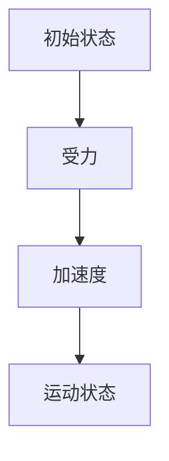
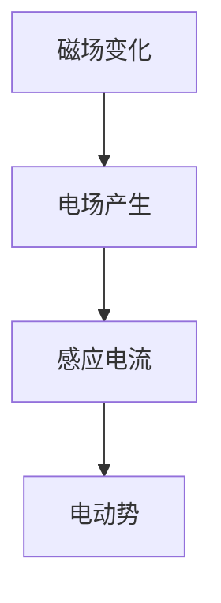
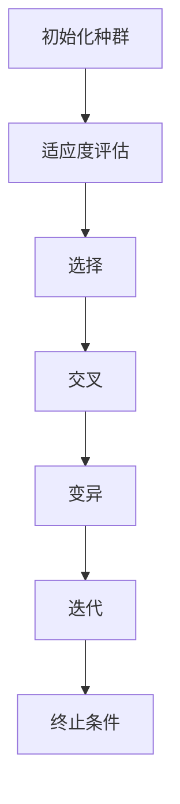
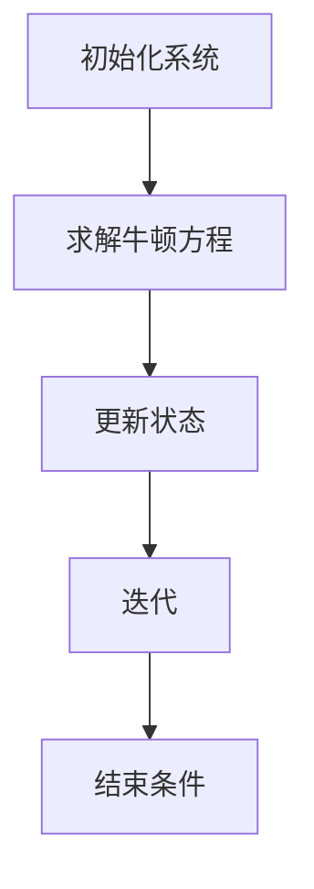
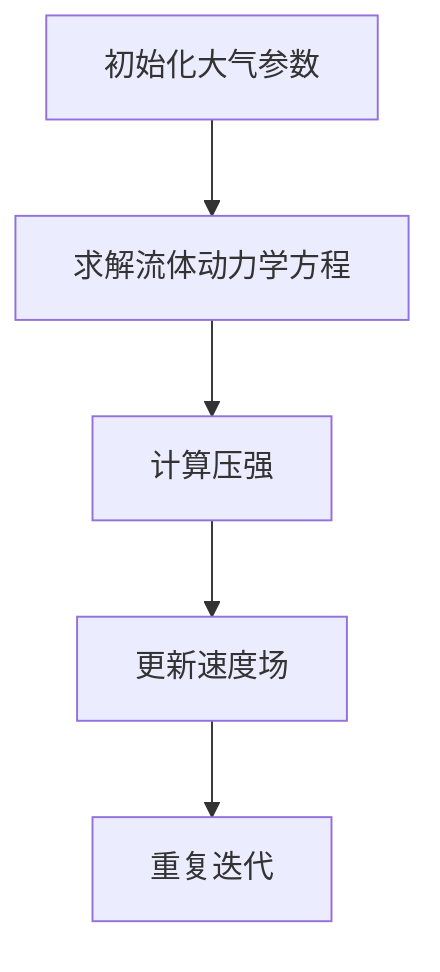
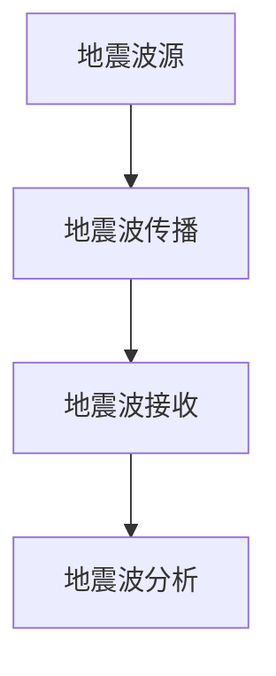
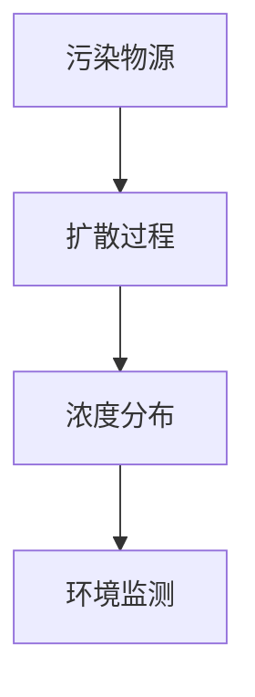
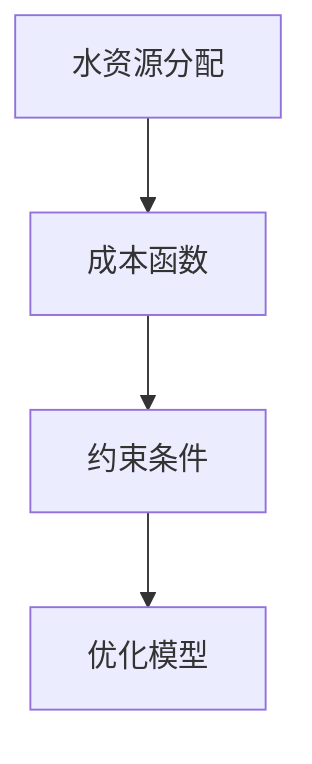
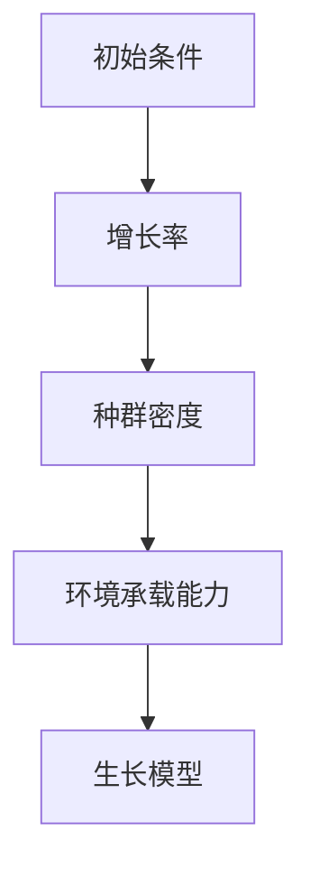
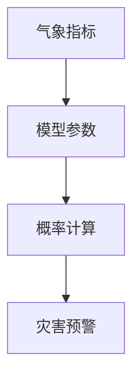

                 


### 文章标题：探索自然与数学的共生关系

### 文章关键词：自然，数学，共生，物理，生物学，建模，环境，农业，算法

### 文章摘要：
本文将深入探讨自然与数学之间的深刻共生关系。通过分析数学在物理学、生物学中的应用，探讨数学建模在自然现象中的运用，以及数学在环境保护和农业领域的实际应用，本文旨在展示数学在解释和预测自然界现象中的核心作用。同时，通过具体的数学模型和算法示例，我们将进一步阐述数学与自然现象之间的内在联系。

---

## 引言：自然与数学的交融

自然和数学是人类认知世界的两大工具。数学以其抽象和精确的特性，为理解和描述自然现象提供了强有力的工具。而自然现象本身，往往蕴含着丰富的数学结构和规律。

### 自然现象中的数学

自然界中存在许多可以通过数学描述的现象，如波动、周期性、对称性等。例如，水的涟漪可以用微积分描述其变化过程，而生物体的生长规律则可以通过微分方程建模。

### 数学在自然研究中的应用

数学在科学研究中的应用是不可或缺的。从牛顿的运动定律到爱因斯坦的相对论，数学不仅为物理学提供了理论基础，而且在生物学、天文学、地球科学等多个领域都有广泛应用。

---

## 第一部分：自然现象中的数学原理

### 2. 数学在物理学中的应用

数学在物理学中的应用非常广泛，尤其是在描述和预测物理现象方面。以下是几个关键领域：

#### 2.1 微积分与力学

微积分作为数学的一个重要分支，在力学中有着广泛的应用。例如，牛顿的运动定律可以使用微积分来描述质点的运动轨迹。

**核心概念与联系：**

$$
F = ma
$$

这里，F 是力，m 是质量，a 是加速度。这个公式是描述物体受力后运动状态变化的基础。

**Mermaid 流程图：**



**核心算法原理讲解：**

使用伪代码描述质点运动方程的求解：

```
function solveParticleMotion(initial_velocity, force, mass):
    acceleration = force / mass
    velocity = initial_velocity + acceleration * time_step
    position = initial_velocity * time_step + 0.5 * acceleration * time_step^2
    return velocity, position
```

#### 2.2 数学在电磁学中的应用

电磁学中的许多定律和原理也可以通过数学公式进行描述。例如，法拉第电磁感应定律和麦克斯韦方程组。

**核心概念与联系：**

$$
\vec{E} = -\frac{\partial \vec{B}}{\partial t}
$$

这里，$\vec{E}$ 是电场强度，$\vec{B}$ 是磁感应强度。这个公式描述了变化的磁场如何产生电场。

**Mermaid 流程图：**



**核心算法原理讲解：**

使用伪代码描述电磁感应定律的求解：

```
function solveElectromagneticInduction(magnetic_field, time):
    electric_field = -differential(magnetic_field, time)
    return electric_field
```

### 3. 数学在生物学中的应用

数学在生物学中的应用主要体现在遗传算法、分子动力学模拟等方面。

#### 3.1 模式识别与遗传算法

遗传算法是一种模拟自然进化的算法，可以用于解决复杂的优化问题。它通过选择、交叉和变异等操作，不断优化解的集合。

**核心概念与联系：**

遗传算法的基本步骤包括：

1. 初始化种群
2. 适应度评估
3. 选择
4. 交叉
5. 变异
6. 重复迭代直到满足终止条件

**Mermaid 流程图：**



**核心算法原理讲解：**

使用伪代码描述遗传算法的步骤：

```
function geneticAlgorithm(population, fitness_function, selection, crossover, mutation, generations):
    for generation in 1 to generations:
        fitness_scores = fitness_function(population)
        selected_population = selection(population, fitness_scores)
        new_population = crossover(selected_population)
        new_population = mutation(new_population)
        population = new_population
    return best_solution(population)
```

#### 3.2 分子动力学模拟

分子动力学模拟是一种通过数值方法求解牛顿运动定律的方法，用于模拟分子系统的运动。

**核心概念与联系：**

分子动力学模拟的步骤包括：

1. 初始化系统
2. 求解牛顿运动方程
3. 更新系统状态
4. 重复迭代

**Mermaid 流程图：**



**核心算法原理讲解：**

使用伪代码描述分子动力学模拟的步骤：

```
function molecularDynamics(simulation_time, time_step):
    system = initializeSystem()
    for t in 1 to simulation_time / time_step:
        forces = calculateForces(system)
        positions = integrateMotion(forces, time_step)
        system = updateSystem(positions)
    return system
```

---

## 第二部分：数学在自然现象中的建模

### 4. 自然现象的数学建模

自然现象的数学建模是理解和预测自然界现象的关键。以下是一些典型的数学模型：

#### 4.1 气候变化的数学模型

气候变化是一个复杂的自然现象，可以通过多种数学模型来描述。大气环流模型是一个典型的例子。

**核心概念与联系：**

大气环流模型的基本方程包括：

$$
\frac{\partial \rho \vec{v}}{\partial t} + \nabla \cdot (\rho \vec{v} \vec{v}) = -\nabla p + \rho \vec{F}_\text{gravity}
$$

这里，$\rho$ 是空气质量，$\vec{v}$ 是速度，$p$ 是压强，$\vec{F}_\text{gravity}$ 是重力。

**Mermaid 流程图：**



**核心算法原理讲解：**

使用伪代码描述大气环流模型的求解：

```
function atmosphericCirculationModel(atmosphere, time_step):
    for t in 1 to simulation_time / time_step:
        density, velocity, pressure = initializeAtmosphere(atmosphere)
        velocity = solveRHD-equation(density, velocity, pressure, time_step)
        pressure = calculatePressure(density, velocity)
        atmosphere = updateAtmosphere(velocity, pressure)
    return atmosphere
```

#### 4.2 地震预测的数学模型

地震预测是一个极具挑战性的问题，但可以通过数学模型来尝试预测地震的发生。

**核心概念与联系：**

地震波的传播可以通过以下方程描述：

$$
\frac{\partial^2 \vec{u}}{\partial t^2} = c^2 \nabla^2 \vec{u}
$$

这里，$\vec{u}$ 是地震波位移，$c$ 是波速。

**Mermaid 流程图：**



**核心算法原理讲解：**

使用伪代码描述地震波传播的模拟：

```
function simulateSeismicWave(source, receiver, c):
    wave = initializeWave(source)
    for t in 1 to simulation_time / time_step:
        displacement = solveWaveEquation(wave, c, time_step)
        wave = updateWave(displacement)
    return waveAtReceiver(receiver, wave)
```

---

## 第三部分：数学在自然界的实际应用

### 5. 数学在环境保护中的应用

数学在环境保护中的应用包括污染物扩散的模拟、水资源管理等。

#### 5.1 污染物扩散的数学模型

污染物扩散可以通过以下方程描述：

$$
\frac{\partial c}{\partial t} = D \nabla^2 c
$$

这里，$c$ 是污染物浓度，$D$ 是扩散系数。

**Mermaid 流程图：**



**核心算法原理讲解：**

使用伪代码描述污染物扩散的模拟：

```
function simulatePollutantDiffusion(source, diffusion_coefficient, time_step):
    concentration = initializeConcentration(source)
    for t in 1 to simulation_time / time_step:
        concentration = solveDiffusionEquation(concentration, diffusion_coefficient, time_step)
    return concentration
```

### 5.2 水资源管理的数学模型

水资源管理可以通过优化模型来分配和利用水资源。

**核心概念与联系：**

水资源分配模型可以表示为：

$$
\min \quad C(x)
$$

$$
\text{s.t.} \quad Ax \le b
$$

这里，$C(x)$ 是成本函数，$A$ 和 $b$ 分别是约束条件。

**Mermaid 流程图：**



**核心算法原理讲解：**

使用伪代码描述水资源分配的优化：

```
function waterResourceAllocation(cost_function, constraints):
    x = solveLinearProgram(cost_function, constraints)
    return x
```

### 5.3 数学在农业中的应用

数学在农业中的应用包括作物生长模型的建立和农业气象灾害预警模型。

#### 5.1 作物生长模型的建立

作物生长模型通常基于以下方程：

$$
\frac{dN}{dt} = rN \left(1 - \frac{N}{K}\right)
$$

这里，$N$ 是作物种群密度，$r$ 是增长率，$K$ 是环境承载能力。

**Mermaid 流程图：**



**核心算法原理讲解：**

使用伪代码描述作物生长模型的求解：

```
function growCrop(initial_density, growth_rate, carrying_capacity):
    population = initial_density
    for t in 1 to simulation_time:
        population = population * growth_rate * (1 - population / carrying_capacity)
    return population
```

#### 5.2 农业气象灾害预警模型

农业气象灾害预警模型可以通过以下公式描述：

$$
P(\text{灾害发生}) = \frac{1}{1 + e^{-\beta \cdot x}}
$$

这里，$P$ 是灾害发生的概率，$\beta$ 是模型参数，$x$ 是气象指标。

**Mermaid 流程图：**



**核心算法原理讲解：**

使用伪代码描述农业气象灾害预警模型的计算：

```
function predictDisaster(meteorological_index, beta):
    probability = 1 / (1 + exp(-beta * meteorological_index))
    return probability
```

---

## 结论：自然与数学的共生关系展望

自然与数学的共生关系在人类文明的发展中起着至关重要的作用。随着科学技术的发展，数学在解释和预测自然界现象中的作用将越来越显著。未来，我们有望通过更先进的数学模型和算法，更好地理解自然，为可持续发展提供有力支持。

### 未来研究方向

1. 发展更精确的气候模型，以更好地预测气候变化。
2. 探索数学在生物进化中的应用，为生物多样性保护提供新方法。
3. 利用数学优化模型，提高资源利用效率，减少环境压力。

### 数学在自然界中的潜在应用

1. 基因编辑与遗传优化：利用数学模型优化基因组合，提高农作物和家畜的性状。
2. 能源管理：通过数学模型优化能源分配，提高能源利用效率。
3. 环境保护：利用数学模型预测污染物扩散，制定环境保护策略。

---

## 附录

### A. 自然与数学共生关系的 Mermaid 流程图

#### A.1 微积分在力学中的应用


#### A.2 遗传算法在生物进化中的应用


### B. 数学模型与公式

#### B.1 质点运动方程

$$
F = ma
$$

#### B.2 法拉第电磁感应定律

$$
\vec{E} = -\frac{\partial \vec{B}}{\partial t}
$$

#### B.3 高斯定律

$$
\vec{E} \cdot dA = \frac{Q}{\epsilon_0}
$$

#### B.4 污染物扩散方程

$$
\frac{\partial c}{\partial t} = D \nabla^2 c
$$

#### B.5 水资源分配模型

$$
\min \quad C(x)
$$

$$
\text{s.t.} \quad Ax \le b
$$

#### B.6 作物生长模型

$$
\frac{dN}{dt} = rN \left(1 - \frac{N}{K}\right)
$$

### 最佳实践 tips、小结、注意事项、拓展阅读等内容

- **最佳实践 tips**：在实际应用中，根据具体问题选择合适的数学模型和算法。例如，在水资源管理中，综合考虑供需平衡、经济成本等因素，优化水资源分配策略。

- **小结**：本文从多个角度探讨了自然与数学的共生关系，展示了数学在解释和预测自然界现象中的核心作用。

- **注意事项**：在建模过程中，需要充分考虑数据的准确性和模型的适用范围。

- **拓展阅读**：读者可以进一步了解相关的数学理论和应用案例，如《大气科学中的数值方法》、《遗传算法及应用》等书籍。

---

作者：AI天才研究院/AI Genius Institute & 禅与计算机程序设计艺术 /Zen And The Art of Computer Programming

