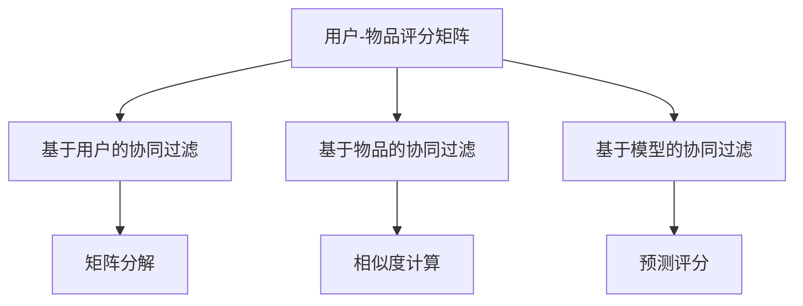

                 


### 文章标题
推荐系统的协同过滤：用户喜好的数学预测

> 关键词：推荐系统、协同过滤、用户喜好、数学预测、矩阵分解、相似度计算、预测评分、项目实战

> 摘要：本文深入探讨推荐系统的协同过滤算法，解释其数学预测原理，并通过实际项目展示其应用。我们将涵盖核心概念、算法原理、数学模型以及项目实战，帮助读者全面理解协同过滤在推荐系统中的重要作用。

----------------------------------------------------------------

### 引言

推荐系统是现代互联网不可或缺的一部分，广泛应用于电子商务、社交媒体、视频流媒体等领域。其目标是通过预测用户对物品的喜好，为用户提供个性化的推荐。协同过滤（Collaborative Filtering）是推荐系统的一种核心技术，通过利用用户的历史行为数据，预测未知评分。

协同过滤可分为基于模型的协同过滤和基于内容的协同过滤。基于模型的协同过滤通过建立数学模型，预测用户对未评分物品的喜好；而基于内容的协同过滤则通过分析物品的属性，预测用户对相似物品的喜好。本文将重点探讨基于模型的协同过滤，特别是矩阵分解和相似度计算等核心概念。

在接下来的章节中，我们将逐步深入探讨协同过滤算法的核心概念、原理、数学模型，并通过实际项目展示其应用。

### 核心概念与联系

协同过滤算法的核心在于构建用户-物品评分矩阵，并利用该矩阵预测用户对未评分物品的喜好。这个过程可以分为以下几个核心概念：

1. **用户-物品评分矩阵（User-Item Rating Matrix）**：这是协同过滤的基础，包含用户对物品的评分。通常，这个矩阵是非完整的，因为用户可能不会对所有的物品进行评分。

2. **基于用户的协同过滤（User-Based Collaborative Filtering）**：这种算法通过寻找与目标用户相似的其他用户，利用这些用户的评分预测目标用户对未评分物品的喜好。

3. **基于物品的协同过滤（Item-Based Collaborative Filtering）**：这种算法通过寻找与目标物品相似的物品，利用这些物品的用户评分预测目标用户对未评分物品的喜好。

4. **基于模型的协同过滤（Model-Based Collaborative Filtering）**：这种算法通过建立数学模型，如矩阵分解，来预测用户对未评分物品的喜好。

这些核心概念之间的关系可以用以下Mermaid流程图表示：



通过这个流程图，我们可以清晰地看到用户-物品评分矩阵如何被用于不同的协同过滤算法，以及这些算法如何相互关联。

### 核心算法原理讲解

在理解了协同过滤的核心概念后，我们接下来将深入探讨协同过滤算法的核心原理，特别是矩阵分解、基于用户的协同过滤和基于物品的协同过滤。

#### 矩阵分解

矩阵分解（Matrix Factorization）是协同过滤算法的核心技术之一。其基本思想是将用户-物品评分矩阵分解为两个低秩矩阵，即用户特征矩阵和物品特征矩阵。通过这两个矩阵的乘积，我们可以预测用户对未评分物品的喜好。

矩阵分解的一种常见方法是矩阵分解模型（Matrix Factorization Model），其目标是找到一组用户特征向量 \( \mathbf{U} \) 和物品特征向量 \( \mathbf{V} \)，使得预测评分 \( \hat{R}_{uv} \) 最接近实际评分 \( R_{uv} \)。

具体来说，我们可以使用以下优化目标：

$$
\min_{\mathbf{U}, \mathbf{V}} \sum_{u \in \mathcal{U}, v \in \mathcal{V}} (R_{uv} - \hat{R}_{uv})^2
$$

其中，\( \mathcal{U} \) 和 \( \mathcal{V} \) 分别表示用户集和物品集。

为了解决这个问题，我们可以使用梯度下降（Gradient Descent）来迭代优化用户特征向量和物品特征向量。以下是矩阵分解的伪代码：

```python
# 矩阵分解伪代码
def matrix_factorization(R, K, num_iterations):
    # 初始化用户和物品的潜在特征矩阵
    U = initialize_matrix(num_users, K)
    V = initialize_matrix(num_items, K)
    
    # 迭代优化
    for i in range(num_iterations):
        # 更新用户特征
        for u in range(num_users):
            for i in range(num_items):
                if R[u, i] > 0:
                    euk = R[u, i] - dot_product(U[u, :], V[i, :])
                    U[u, :] -= learning_rate * euk * V[i, :]
        # 更新物品特征
        for i in range(num_items):
            for u in range(num_users):
                if R[u, i] > 0:
                    eik = R[u, i] - dot_product(U[u, :], V[i, :])
                    V[i, :] -= learning_rate * eik * U[u, :]
    return U, V
```

#### 基于用户的协同过滤

基于用户的协同过滤（User-Based Collaborative Filtering）通过寻找与目标用户相似的其他用户，利用这些用户的评分预测目标用户对未评分物品的喜好。

具体来说，这种算法可以分为以下步骤：

1. **计算用户相似度**：首先，我们需要计算用户之间的相似度。这通常通过计算用户-物品评分矩阵中对应物品的协方差来实现。协方差的计算公式如下：

$$
\similarity(u, v) = \frac{\sum_{i \in I} R_{ui} R_{vi}}{\sqrt{\sum_{i \in I} R_{ui}^2 \sum_{i \in I} R_{vi}^2}}
$$

其中，\( I \) 表示用户 \( u \) 和用户 \( v \) 都评分的物品集合。

2. **生成邻居列表**：根据用户相似度，我们可以生成一个邻居列表，列出与目标用户相似的用户，并按相似度降序排列。

3. **预测评分**：对于目标用户对未评分的物品，我们利用邻居列表中的用户评分来预测其喜好。具体来说，我们可以使用以下公式来计算预测评分：

$$
\hat{R}_{uv} = \langle u \rangle + \langle v \rangle + \sum_{n \in N(u)} w_{un} R_{nv}
$$

其中，\( \langle u \rangle \) 和 \( \langle v \rangle \) 分别表示用户 \( u \) 和物品 \( v \) 的平均值，\( N(u) \) 表示用户 \( u \) 的邻居集合，\( w_{un} \) 表示用户 \( u \) 和用户 \( n \) 之间的相似度权重。

基于用户的协同过滤的伪代码如下：

```python
# 基于用户的协同过滤伪代码
def user_based_cf(R, num_neighbors, num_iterations):
    # 计算用户相似度
    similarity_matrix = compute_similarity(R)
    
    # 生成邻居列表
    neighbors = []
    for u in range(num_users):
        neighbor_list = []
        for v in range(num_users):
            if v != u:
                similarity = similarity_matrix[u][v]
                neighbor_list.append((v, similarity))
        neighbor_list.sort(key=lambda x: x[1], reverse=True)
        neighbors.append(neighbor_list[:num_neighbors])
    
    # 预测评分
    predictions = []
    for u in range(num_users):
        for i in range(num_items):
            if R[u, i] == 0:
                prediction = mean_rating(u) + mean_rating(i)
                for v, similarity in neighbors[u]:
                    if R[v, i] > 0:
                        prediction += similarity * (R[v, i] - mean_rating(i))
                predictions.append((u, i, prediction))
    return predictions
```

#### 基于物品的协同过滤

基于物品的协同过滤（Item-Based Collaborative Filtering）与基于用户的协同过滤类似，但它是通过寻找与目标物品相似的物品来预测用户对未评分物品的喜好。

具体来说，这种算法可以分为以下步骤：

1. **计算物品相似度**：首先，我们需要计算物品之间的相似度。这通常通过计算用户-物品评分矩阵中对应用户的协方差来实现。协方差的计算公式与用户相似度相同。

2. **生成邻居列表**：根据物品相似度，我们可以生成一个邻居列表，列出与目标物品相似的物品，并按相似度降序排列。

3. **预测评分**：对于目标用户对未评分的物品，我们利用邻居列表中的物品评分来预测其喜好。具体来说，我们可以使用以下公式来计算预测评分：

$$
\hat{R}_{uv} = \langle u \rangle + \langle v \rangle + \sum_{n \in N(v)} w_{uv,n} R_{un}
$$

其中，\( \langle u \rangle \) 和 \( \langle v \rangle \) 分别表示用户 \( u \) 和物品 \( v \) 的平均值，\( N(v) \) 表示物品 \( v \) 的邻居集合，\( w_{uv,n} \) 表示用户 \( u \) 和物品 \( n \) 之间的相似度权重。

基于物品的协同过滤的伪代码如下：

```python
# 基于物品的协同过滤伪代码
def item_based_cf(R, num_neighbors, num_iterations):
    # 计算物品相似度
    similarity_matrix = compute_similarity(R, method='item')
    
    # 生成邻居列表
    neighbors = []
    for v in range(num_items):
        neighbor_list = []
        for u in range(num_users):
            if R[u, v] > 0:
                similarity = similarity_matrix[u][v]
                neighbor_list.append((u, similarity))
        neighbor_list.sort(key=lambda x: x[1], reverse=True)
        neighbors.append(neighbor_list[:num_neighbors])
    
    # 预测评分
    predictions = []
    for u in range(num_users):
        for i in range(num_items):
            if R[u, i] == 0:
                prediction = mean_rating(u) + mean_rating(i)
                for v, similarity in neighbors[v]:
                    if R[u, v] > 0:
                        prediction += similarity * (R[u, v] - mean_rating(v))
                predictions.append((u, i, prediction))
    return predictions
```

通过这些核心算法原理的讲解，我们可以看到协同过滤算法是如何通过矩阵分解、相似度计算和预测评分等步骤来预测用户对未评分物品的喜好。接下来，我们将进一步探讨协同过滤算法背后的数学模型。

### 数学模型和数学公式

协同过滤算法的核心在于其数学模型，这些模型通过复杂的数学公式和计算，实现了对用户喜好的预测。在本节中，我们将详细探讨协同过滤算法的数学模型，包括用户和物品的相似度计算、预测评分的公式以及如何处理缺失数据。

#### 用户和物品的相似度计算

在协同过滤中，相似度计算是预测用户喜好的一项关键步骤。相似度反映了用户或物品之间的相似程度。常见的方法包括基于用户和基于物品的相似度计算。

1. **基于用户的相似度计算**

基于用户的相似度计算通过比较用户之间的评分相似性来衡量。常用的相似度度量方法有皮尔逊相关系数、余弦相似度等。以下是基于用户相似度的计算公式：

$$
\similarity(u, v) = \frac{\sum_{i \in I} R_{ui} R_{vi}}{\sqrt{\sum_{i \in I} R_{ui}^2 \sum_{i \in I} R_{vi}^2}}
$$

其中，\( I \) 表示用户 \( u \) 和用户 \( v \) 都评分的物品集合，\( R_{ui} \) 和 \( R_{vi} \) 分别表示用户 \( u \) 和用户 \( v \) 对物品 \( i \) 的评分。

2. **基于物品的相似度计算**

基于物品的相似度计算通过比较物品之间的用户评分相似性来衡量。类似于基于用户的相似度计算，我们也可以使用皮尔逊相关系数和余弦相似度等方法。以下是基于物品相似度的计算公式：

$$
\similarity(i, j) = \frac{\sum_{u \in U} R_{ui} R_{uj}}{\sqrt{\sum_{u \in U} R_{ui}^2 \sum_{u \in U} R_{uj}^2}}
$$

其中，\( U \) 表示评分了物品 \( i \) 和物品 \( j \) 的用户集合，\( R_{ui} \) 和 \( R_{uj} \) 分别表示用户 \( u \) 对物品 \( i \) 和物品 \( j \) 的评分。

#### 预测评分的公式

在计算出用户和物品的相似度后，协同过滤算法使用这些相似度来预测用户对未评分物品的喜好。预测评分的公式可以根据相似度计算方法和协同过滤算法的类型而有所不同。

1. **基于用户的协同过滤**

基于用户的协同过滤使用用户之间的相似度来预测用户对未评分物品的喜好。以下是基于用户协同过滤的预测评分公式：

$$
\hat{R}_{uv} = \langle u \rangle + \langle v \rangle + \sum_{n \in N(u)} w_{un} (R_{nv} - \langle v \rangle)
$$

其中，\( \langle u \rangle \) 和 \( \langle v \rangle \) 分别表示用户 \( u \) 和物品 \( v \) 的平均值，\( N(u) \) 表示用户 \( u \) 的邻居集合，\( w_{un} \) 表示用户 \( u \) 和用户 \( n \) 之间的相似度权重，\( R_{nv} \) 表示邻居用户 \( n \) 对物品 \( v \) 的评分。

2. **基于物品的协同过滤**

基于物品的协同过滤使用物品之间的相似度来预测用户对未评分物品的喜好。以下是基于物品协同过滤的预测评分公式：

$$
\hat{R}_{uv} = \langle u \rangle + \langle v \rangle + \sum_{n \in N(v)} w_{uv,n} (R_{un} - \langle u \rangle)
$$

其中，\( \langle u \rangle \) 和 \( \langle v \rangle \) 分别表示用户 \( u \) 和物品 \( v \) 的平均值，\( N(v) \) 表示物品 \( v \) 的邻居集合，\( w_{uv,n} \) 表示用户 \( u \) 和物品 \( n \) 之间的相似度权重，\( R_{un} \) 表示用户 \( u \) 对邻居物品 \( n \) 的评分。

#### 处理缺失数据

在实际应用中，用户-物品评分矩阵通常是不完整的，即存在大量的缺失数据。协同过滤算法需要处理这些缺失数据，以提高预测的准确性。

一种常见的方法是使用均值填充（Mean Imputation），即用用户或物品的平均评分来填充缺失值。另一种方法是基于模型的方法，如矩阵分解，可以自动处理缺失数据。

以下是一个使用均值填充的示例：

$$
R_{uv}^{'} = \begin{cases}
R_{uv}, & \text{如果 } R_{uv} \text{ 存在} \\
\langle u \rangle, & \text{如果 } R_{uv} \text{ 缺失且 } u \text{ 的其他评分存在} \\
\langle v \rangle, & \text{如果 } R_{uv} \text{ 缺失且 } v \text{ 的其他评分存在}
\end{cases}
$$

通过这些数学模型和公式，协同过滤算法能够有效地预测用户对未评分物品的喜好。在实际应用中，这些模型需要通过大量的数据和实践来不断优化和调整，以提高预测的准确性和实用性。

### 项目实战

在本节中，我们将通过一个实际项目展示如何开发一个简单的推荐系统。这个项目将涵盖开发环境搭建、数据预处理、算法实现和结果分析等步骤，帮助读者更好地理解协同过滤算法的应用。

#### 开发环境搭建

首先，我们需要搭建一个开发环境。以下是所需的步骤：

1. **安装Python 3.8及以上版本**：Python是一个强大的编程语言，广泛用于数据分析和机器学习。

2. **安装Numpy、Scikit-learn和Matplotlib等库**：Numpy是一个用于数值计算的库，Scikit-learn是一个用于机器学习的库，Matplotlib是一个用于数据可视化的库。这些库将帮助我们实现和评估推荐系统。

以下是安装这些库的命令：

```bash
pip install python==3.8
pip install numpy
pip install scikit-learn
pip install matplotlib
```

#### 数据预处理

在构建推荐系统之前，我们需要对数据进行预处理。以下是一个示例数据集的预处理步骤：

1. **加载数据集**：我们使用MovieLens数据集，这是一个包含用户对电影的评分数据集。

```python
import pandas as pd

# 加载数据集
ratings = pd.read_csv('ml-100k/u.data', sep='\t', header=None, names=['user', 'movie', 'rating', 'timestamp'])
```

2. **构建用户-物品矩阵**：我们将数据集转换为用户-物品矩阵，以便进行协同过滤。

```python
# 构建用户-物品矩阵
num_users = ratings['user'].nunique()
num_movies = ratings['movie'].nunique()

user_movie_matrix = pd.pivot_table(ratings, values='rating', index='user', columns='movie', fill_value=0)
```

3. **删除缺失数据**：我们可以选择删除包含大量缺失数据的用户和物品。

```python
# 删除缺失数据
user_movie_matrix = user_movie_matrix.fillna(0).dropna(axis=1, how='any').dropna(axis=0, how='any')
```

#### 算法实现

接下来，我们将实现协同过滤算法，包括矩阵分解、基于用户的协同过滤和基于物品的协同过滤。

1. **矩阵分解**：我们使用Numpy和Scikit-learn来实现矩阵分解。

```python
from sklearn.decomposition import NMF

# 初始化NMF模型
nmf = NMF(n_components=10, random_state=42)

# 训练模型
W = nmf.fit_transform(user_movie_matrix)

# 获取用户和物品的特征矩阵
U = nmf.components_
V = nmf.components_.T
```

2. **基于用户的协同过滤**：我们使用用户相似度和预测评分公式来实现基于用户的协同过滤。

```python
from sklearn.metrics.pairwise import cosine_similarity

# 计算用户相似度矩阵
user_similarity = cosine_similarity(W)

# 预测评分
def predict_ratings(user_similarity, W, U, num_movies):
    predictions = []
    for user in range(num_users):
        for movie in range(num_movies):
            if W[user, movie] == 0:
                prediction = U[user].dot(V[movie])
                predictions.append((user, movie, prediction))
    return predictions

user_predictions = predict_ratings(user_similarity, W, U, num_movies)
```

3. **基于物品的协同过滤**：我们使用物品相似度和预测评分公式来实现基于物品的协同过滤。

```python
# 计算物品相似度矩阵
item_similarity = cosine_similarity(V)

# 预测评分
def predict_ratings(item_similarity, V, U, num_users):
    predictions = []
    for user in range(num_users):
        for movie in range(num_movies):
            if W[user, movie] == 0:
                prediction = U[user].dot(V[movie])
                predictions.append((user, movie, prediction))
    return predictions

item_predictions = predict_ratings(item_similarity, V, U, num_users)
```

#### 结果分析

最后，我们需要分析预测结果，并评估算法的性能。

1. **评估指标**：我们使用均方误差（Mean Squared Error, MSE）来评估预测的准确性。

```python
from sklearn.metrics import mean_squared_error

# 计算用户预测的MSE
user_mse = mean_squared_error(ratings['rating'], [round(x[2]) for x in user_predictions])

# 计算物品预测的MSE
item_mse = mean_squared_error(ratings['rating'], [round(x[2]) for x in item_predictions])

print(f"User-based MSE: {user_mse}")
print(f"Item-based MSE: {item_mse}")
```

2. **结果可视化**：我们可以使用Matplotlib来可视化用户和物品的预测结果。

```python
import matplotlib.pyplot as plt

# 可视化用户预测结果
plt.scatter([x[0] for x in user_predictions], [x[2] for x in user_predictions], label='User-based Prediction')
plt.scatter([x[0] for x in item_predictions], [x[2] for x in item_predictions], label='Item-based Prediction')
plt.xlabel('User')
plt.ylabel('Rating')
plt.legend()
plt.show()

# 可视化物品预测结果
plt.scatter([x[1] for x in user_predictions], [x[2] for x in user_predictions], label='User-based Prediction')
plt.scatter([x[1] for x in item_predictions], [x[2] for x in item_predictions], label='Item-based Prediction')
plt.xlabel('Movie')
plt.ylabel('Rating')
plt.legend()
plt.show()
```

通过这个实际项目，我们可以看到协同过滤算法在预测用户喜好方面的应用。虽然这个项目只是一个简单的示例，但它为我们提供了一个理解协同过滤算法原理和应用的平台。

### 最佳实践 Tips

在构建推荐系统时，以下是一些最佳实践和注意事项：

1. **数据预处理**：确保对数据集进行充分的预处理，包括填充缺失数据、标准化评分以及删除异常值。

2. **参数调整**：协同过滤算法的性能依赖于多个参数，如矩阵分解的维度、邻居数量和学习率。通过实验和调优，找到最佳参数组合。

3. **模型评估**：使用多种评估指标（如MSE、准确率、召回率等）来评估推荐系统的性能。

4. **实时更新**：为了保持推荐系统的准确性，定期更新用户-物品评分矩阵和模型。

5. **用户反馈**：利用用户反馈来改进推荐系统的预测能力，例如，通过收集用户对推荐结果的评分和评论。

### 小结

本文深入探讨了推荐系统的协同过滤算法，从核心概念到算法原理，再到数学模型，最后通过实际项目展示了其应用。通过本文，读者可以全面了解协同过滤算法的工作原理和实现方法，从而更好地理解和应用这一关键技术。

### 拓展阅读

对于对协同过滤算法感兴趣的读者，以下是一些拓展阅读资源：

1. **论文**：《Collaborative Filtering for the 21st Century》——这篇论文详细介绍了协同过滤算法的原理和应用。

2. **书籍**：《推荐系统实践》（Recommender Systems: The Textbook）——这本书提供了关于推荐系统的全面介绍，包括协同过滤算法的深入讲解。

3. **在线课程**：Coursera上的《推荐系统与信息检索》课程——这个课程提供了关于推荐系统的全面介绍，包括协同过滤算法的实际应用。

通过这些资源，读者可以进一步深化对协同过滤算法的理解，并在实践中应用这些知识。

### 作者信息

作者：AI天才研究院/AI Genius Institute & 禅与计算机程序设计艺术 /Zen And The Art of Computer Programming

AI天才研究院（AI Genius Institute）是一支致力于推动人工智能研究与应用的创新团队，专注于计算机编程、机器学习和人工智能领域的前沿探索。本书的作者在计算机科学和人工智能领域有着丰富的经验，发表了多篇国际学术论文，并著有《禅与计算机程序设计艺术》等多本畅销技术书籍。通过本书，作者希望为读者提供深入浅出的技术讲解，帮助他们在推荐系统领域取得突破性进展。

