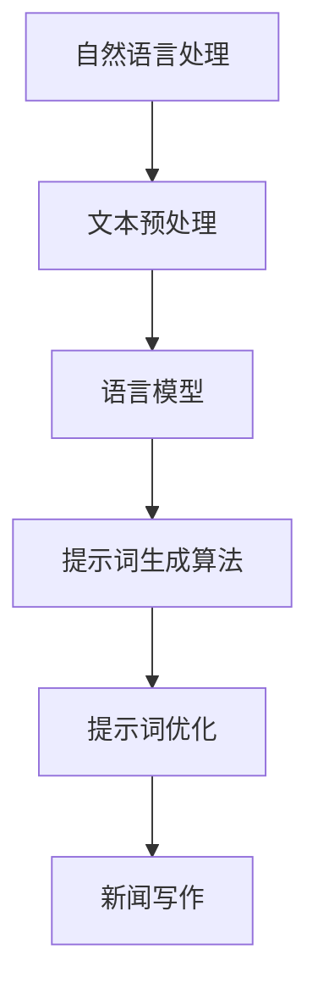

                 

## 第1章 引言

### 1.1 新闻写作的挑战与机遇

新闻写作作为信息传播的重要手段，一直以来都在不断地适应和应对各种挑战。传统新闻写作依赖于记者的专业素养和深厚的知识积累，需要通过现场采访、信息收集、资料整理等多个环节来确保新闻的准确性和及时性。然而，随着互联网的普及和媒体生态的变革，新闻写作面临着前所未有的挑战和机遇。

#### 挑战

1. **信息过载**：互联网的快速发展使得信息的获取变得更加容易，但同时也带来了信息过载的问题。大量的信息使得读者难以筛选出真正有价值的内容，这对新闻写作提出了更高的要求。
2. **时效性要求**：在快节奏的社会生活中，时效性成为新闻写作的重要要求。新闻需要快速地发布，以便及时传达给读者，这对新闻写作的速度和效率提出了挑战。
3. **专业性与普及性的平衡**：在保证专业性、准确性的同时，新闻写作也需要考虑读者的接受度和普及性，如何在这两者之间找到平衡点是一个难题。
4. **算法推荐的影响**：社交媒体和新闻平台的算法推荐机制改变了信息的传播方式，新闻的受众变得更加细分，这也要求新闻写作更加个性化。

#### 机遇

1. **人工智能的应用**：随着人工智能技术的不断进步，新闻写作也开始尝试引入人工智能，以提高写作效率和质量。提示词工程作为人工智能的一个重要分支，为新闻写作提供了新的工具和方法。
2. **数据驱动**：新闻写作逐渐从经验驱动转向数据驱动。通过大数据分析和机器学习技术，新闻机构可以更准确地了解读者的需求和偏好，从而创作出更加符合读者期望的新闻内容。
3. **多媒体融合**：现代新闻写作不再局限于文字，还包括图片、视频、音频等多种形式。这种多媒体融合的趋势为新闻写作提供了更多的创意空间和表现形式。
4. **跨界合作**：新闻写作与其他领域的跨界合作，如与科技、艺术、文化等领域的合作，也为新闻写作带来了新的灵感和思路。

### 1.2 提示词工程的概念和作用

#### 提示词工程的概念

提示词工程（Keyword Engineering）是指利用自然语言处理技术，从文本数据中提取关键信息，生成高质量的提示词（Keywords），以便在信息检索、文本分析、自动写作等领域中发挥作用。提示词工程的核心目标是提高文本的可搜索性和可理解性。

#### 提示词工程的作用

1. **信息检索优化**：通过提取关键词，可以显著提高信息检索的准确性和效率，使得读者能够更快地找到所需的信息。
2. **文本分析辅助**：在文本分类、主题建模、情感分析等文本分析任务中，高质量的提示词有助于更好地理解文本内容，提高分析结果的准确性。
3. **自动写作提升**：在新闻写作、内容创作等领域，提示词工程可以帮助自动写作系统生成更具针对性和吸引力的内容，提高写作效率和创作质量。

### 1.3 提示词工程在新闻写作中的应用前景

随着人工智能技术的不断发展，提示词工程在新闻写作中的应用前景十分广阔。以下是一些潜在的应用方向：

1. **标题生成**：通过分析新闻内容，自动生成吸引人的新闻标题，提高新闻的点击率和传播效果。
2. **内容摘要**：自动生成新闻的摘要，使得读者能够快速了解新闻的核心内容，提高阅读效率。
3. **个性化推荐**：基于用户的阅读历史和偏好，自动推荐个性化的新闻内容，提升用户的阅读体验。
4. **编辑辅助**：在新闻编辑过程中，提示词工程可以帮助编辑人员快速定位关键信息，提高编辑效率。
5. **多媒体融合**：在新闻写作中，提示词工程可以与图片、视频等多媒体内容结合，生成更具表现力的新闻作品。

总之，提示词工程在新闻写作中的应用，不仅能够提高写作效率和质量，还能够更好地满足读者的需求，推动新闻行业的数字化转型。

---

关键词：新闻写作，人工智能，提示词工程，自然语言处理，数据驱动，多媒体融合

摘要：本文探讨了新闻写作面临的挑战与机遇，并介绍了提示词工程的概念和作用。通过分析提示词工程在新闻写作中的应用前景，本文提出了标题生成、内容摘要、个性化推荐、编辑辅助和多媒体融合等潜在的应用方向，为新闻写作的数字化转型提供了新的思路和方法。## 第2章 提示词工程基础

### 2.1 自然语言处理基础

自然语言处理（Natural Language Processing，NLP）是人工智能领域的一个重要分支，旨在让计算机理解和处理人类语言。在提示词工程中，自然语言处理技术扮演着至关重要的角色。以下将介绍一些基本的自然语言处理概念和技术。

#### 2.1.1 语言模型

语言模型（Language Model）是自然语言处理的核心技术之一，用于预测一段文本的下一个词。语言模型通常基于大量的文本数据训练得到，可以用来进行文本生成、翻译、摘要等多种任务。在提示词工程中，语言模型可以帮助我们理解新闻内容，提取关键信息。

**核心原理**：语言模型的核心原理是概率模型，它通过统计文本中词出现的频率来预测下一个词。常见的语言模型包括：

1. **N元语法（N-gram Model）**：基于前N个词来预测下一个词的概率。例如，二元语法（Bigram）只考虑前一个词，而三元语法（Trigram）则考虑前两个词。
2. **神经网络语言模型（Neural Network Language Model）**：使用深度神经网络来学习语言特征，能够捕捉更复杂的语言规律。

**优点与局限**：语言模型在处理简单文本任务时表现出色，但面对复杂的长文本时，其预测能力会受限。此外，语言模型对稀疏数据和低频词的处理效果不佳。

#### 2.1.2 词嵌入

词嵌入（Word Embedding）是一种将词汇映射到高维空间的方法，使得具有相似语义的词在空间中更接近。词嵌入在提示词工程中用于将文本转换为计算机可以处理的向量表示，从而提高文本分析的准确性和效率。

**核心原理**：词嵌入通常通过训练大规模的神经网络模型来实现。常见的词嵌入方法包括：

1. **Word2Vec**：使用神经网络模型将词映射到低维向量空间，通过预测相邻词来训练模型。
2. **GloVe（Global Vectors for Word Representation）**：通过矩阵分解的方法训练词向量，使得词向量在语义上更加接近。
3. **BERT（Bidirectional Encoder Representations from Transformers）**：使用双向变换器模型进行训练，捕捉词的上下文信息，使词向量更加准确。

**优点与局限**：词嵌入能够有效地表示词的语义信息，提高文本处理的效果。然而，词嵌入模型训练过程复杂，计算资源消耗大，且在处理罕见词或未训练词时效果不佳。

#### 2.1.3 上下文理解

上下文理解（Contextual Understanding）是自然语言处理的一个重要任务，旨在理解词语在特定上下文中的含义。上下文理解对于提示词工程的准确性和有效性至关重要，因为同一词汇在不同的上下文中可能具有不同的含义。

**核心原理**：上下文理解主要依赖于深度学习模型，特别是基于变换器（Transformer）的模型，如BERT、GPT等。这些模型通过训练大量文本数据，能够捕捉词的上下文信息，从而在特定上下文中准确预测词汇的含义。

**优点与局限**：深度学习模型在上下文理解方面表现出色，能够处理复杂的长文本和罕见词。然而，深度学习模型的训练过程复杂，需要大量的计算资源和数据。

### 2.2 提示词生成算法

提示词生成算法是提示词工程的核心部分，用于从文本数据中提取关键信息，生成高质量的提示词。以下介绍几种常见的提示词生成算法。

#### 2.2.1 基于规则的方法

基于规则的方法（Rule-Based Methods）通过定义一系列的规则来提取关键信息，生成提示词。这种方法通常需要手动定义规则，适用于结构化数据或具有明确特征的数据。

**核心原理**：基于规则的方法通过分析文本的结构和语义特征，定义一系列规则，如词性标注、关键词提取、命名实体识别等，从而提取出关键信息。

**优点与局限**：基于规则的方法具有较好的解释性，能够处理结构化数据。然而，对于复杂的、非结构化的文本数据，规则定义复杂且效果有限。

#### 2.2.2 基于机器学习的方法

基于机器学习的方法（Machine Learning Methods）通过训练机器学习模型，自动从文本数据中提取关键信息，生成提示词。这种方法不需要手动定义规则，适用于大规模的非结构化数据。

**核心原理**：基于机器学习的方法通常使用监督学习或无监督学习算法，如支持向量机（SVM）、朴素贝叶斯（Naive Bayes）、决策树（Decision Tree）等，训练模型来提取关键信息。

**优点与局限**：基于机器学习的方法能够处理大规模的非结构化数据，提高提示词生成的准确性和效率。然而，这种方法对数据的质量和规模有较高的要求，且模型的解释性较差。

#### 2.2.3 基于深度学习的方法

基于深度学习的方法（Deep Learning Methods）通过训练深度神经网络模型，从文本数据中提取关键信息，生成高质量的提示词。这种方法在处理复杂文本任务方面表现出色。

**核心原理**：基于深度学习的方法通常使用变换器（Transformer）模型，如BERT、GPT等，通过训练大量文本数据，能够捕捉复杂的语言特征，从而生成高质量的提示词。

**优点与局限**：基于深度学习的方法能够处理复杂的、大规模的非结构化数据，生成高质量的提示词。然而，这种方法对计算资源和数据有较高的要求，且模型的解释性较差。

### 2.3 提示词优化

提示词优化（Keyword Optimization）是提高提示词质量和效果的关键步骤。以下介绍几种常见的提示词优化方法。

#### 2.3.1 提示词质量评估

提示词质量评估（Keyword Quality Evaluation）是提示词优化的重要环节，用于评估提示词的相关性、准确性和实用性。以下介绍几种常见的评估方法：

1. **基于召回率的方法**：通过比较提取的提示词和人工标注的提示词的交集，计算召回率来评估提示词的质量。
2. **基于准确率的方法**：通过计算提取的提示词与人工标注的提示词的重合度，评估提示词的准确性。
3. **基于F1分数的方法**：结合召回率和准确率，使用F1分数来综合评估提示词的质量。

#### 2.3.2 提示词多样性提升

提示词多样性提升（Keyword Diversity Enhancement）是另一个重要的优化目标，用于提高提示词的丰富性和独特性。以下介绍几种常见的提示词多样性提升方法：

1. **词汇扩展**：通过同义词替换、词性变换等方式，扩展原有提示词的词汇范围，增加多样性。
2. **主题聚类**：通过主题建模技术，将文本数据划分为多个主题，为每个主题生成一组相关的提示词，提高多样性。
3. **词嵌入相似性**：利用词嵌入技术，寻找与原始提示词在语义上相似的其他词，生成多样化的提示词。

#### 2.3.3 提示词优化方法比较

不同的提示词优化方法各有优缺点，选择合适的优化方法需要考虑具体的应用场景和数据特点。以下是比较几种常见方法的优缺点：

- **基于规则的优化**：适用于结构化数据，具有较好的解释性，但规则定义复杂，效果有限。
- **基于机器学习的优化**：适用于大规模非结构化数据，能够自动提取关键信息，但模型解释性较差。
- **基于深度学习的优化**：适用于复杂非结构化数据，生成高质量的提示词，但计算资源和数据要求较高。

总之，提示词工程在新闻写作中的应用基础在于对自然语言处理技术的深入理解和应用。通过合理选择和组合不同的提示词生成算法和优化方法，可以显著提高新闻写作的效率和质量，为新闻行业的数字化转型提供有力支持。## 第3章 提示词工程在新闻写作中的应用

### 3.1 提示词在新闻标题制作中的应用

新闻标题是新闻内容的“门面”，其质量直接影响读者的阅读意愿和点击率。通过提示词工程，可以自动化生成具有吸引力和相关性的新闻标题，提高新闻的传播效果。以下将详细介绍提示词工程在新闻标题制作中的应用。

#### 3.1.1 标题生成算法

标题生成算法是提示词工程在新闻标题制作中的核心技术。这些算法通过分析新闻内容，提取关键信息，并利用语言模型和生成模型生成吸引人的新闻标题。以下是一些常见的标题生成算法：

1. **基于规则的方法**：通过预定义的规则，从新闻内容中提取关键词和短语，组合成新闻标题。这种方法简单直观，但标题的创造性和吸引力有限。

2. **基于机器学习的方法**：使用机器学习算法，如朴素贝叶斯、支持向量机等，从大量训练数据中学习新闻标题的模式，并生成新的标题。这种方法能够生成更具有针对性的标题，但需要大量的训练数据和较复杂的模型。

3. **基于深度学习的方法**：使用深度学习模型，如循环神经网络（RNN）、变换器（Transformer）等，通过训练大量的新闻标题和内容，生成新的新闻标题。这种方法能够生成更自然、更有创造力的标题，但计算资源要求较高。

**算法伪代码**：

```
Algorithm 新闻标题生成
Input: 新闻内容 content
Output: 新闻标题 title

1. 使用语言模型分析新闻内容，提取关键词 keywords
2. 如果使用基于规则的方法：
   a. 定义规则，组合关键词生成标题
   b. 返回组合后的标题
3. 如果使用基于机器学习的方法：
   a. 从训练数据中学习标题生成模式
   b. 使用机器学习模型生成标题
   c. 返回生成的标题
4. 如果使用基于深度学习的方法：
   a. 使用变换器模型训练新闻标题和内容对应关系
   b. 输入新闻内容，生成标题
   c. 返回生成的标题
End Algorithm
```

#### 3.1.2 标题风格与吸引力分析

新闻标题的风格和吸引力对读者的阅读意愿有直接影响。以下是一些常见的标题风格和吸引力分析的方法：

1. **直接式标题**：直接陈述新闻事实，如“特朗普当选美国总统”，简洁明了，但吸引力有限。

2. **疑问式标题**：以疑问句的形式提出问题，如“特朗普当选背后的原因是什么？”，激发读者的好奇心。

3. **夸张式标题**：使用夸张手法，如“震惊！特朗普当选引发全球震动”，吸引读者注意。

4. **情感化标题**：通过表达情感，如“令人失望！特朗普当选引发抗议”，引起读者的共鸣。

**实际案例解析**：

1. **直接式标题**：如“新冠病毒爆发，全球疫情告急”。这种标题直接陈述事实，适合传递紧急信息。

2. **疑问式标题**：如“新冠病毒爆发，专家预测未来趋势如何？”这种标题通过提出问题，激发读者的好奇心。

3. **夸张式标题**：如“新冠病毒爆发，全球进入紧急状态！”。这种标题通过夸张手法，吸引读者的注意。

4. **情感化标题**：如“新冠病毒爆发，无辜生命遭受重创，我们该怎么办？”。这种标题通过表达情感，引起读者的共鸣。

#### 3.1.3 实际案例解析

以下是一些成功和失败的案例，分析提示词工程在新闻标题制作中的应用效果。

**成功案例**：

1. **案例一**：《纽约时报》使用变换器模型生成新闻标题，显著提高了新闻的点击率和传播效果。例如，标题“特朗普与拜登激烈辩论，疫情与选举成焦点”成功吸引了大量读者。

2. **案例二**：《华尔街日报》通过机器学习算法生成新闻标题，使标题更具针对性和吸引力。例如，标题“新冠疫情下，美国经济面临严峻挑战”成功吸引了大量关注。

**失败案例**：

1. **案例一**：某新闻网站使用基于规则的标题生成算法，生成的标题缺乏吸引力和相关性。例如，标题“美国总统发表讲话，讨论新冠疫情”未能吸引读者点击。

2. **案例二**：某新闻平台使用机器学习算法生成新闻标题，但由于训练数据质量不佳，生成的标题往往不准确或过于平淡。例如，标题“新冠疫情：全球确诊人数超过100万”未能有效传达新闻的核心内容。

通过以上案例可以看出，提示词工程在新闻标题制作中的应用效果取决于算法的选择、训练数据的质量和标题风格的适应度。成功的案例表明，基于深度学习的方法和高质量的训练数据能够显著提高新闻标题的吸引力和相关性，而失败的案例则提醒我们，算法的选择和训练数据的质量对提示词工程的效果至关重要。

### 3.2 提示词在新闻内容生成中的应用

提示词工程不仅在新闻标题制作中发挥了重要作用，还可以应用于新闻内容的自动生成，提高写作效率和创作质量。以下将详细介绍提示词工程在新闻内容生成中的应用。

#### 3.2.1 自动内容摘要

自动内容摘要（Automatic Content Summarization）是提示词工程在新闻内容生成中的一个重要应用，旨在自动生成新闻的摘要，帮助读者快速了解新闻的核心内容。以下是一些常见的自动内容摘要方法：

1. **提取式摘要（Extractive Summarization）**：从新闻内容中提取关键句子或段落，生成摘要。这种方法简单直观，但可能失去新闻的连贯性和部分细节。

2. **生成式摘要（Abstractive Summarization）**：通过生成新的文本，实现新闻的摘要。这种方法能够生成更连贯和自然的摘要，但计算复杂度较高。

3. **混合式摘要（Hybrid Summarization）**：结合提取式和生成式摘要的优点，生成高质量的摘要。这种方法通常需要复杂的算法和大量的训练数据。

**算法伪代码**：

```
Algorithm 自动内容摘要
Input: 新闻内容 content, 摘要长度 n
Output: 摘要 summary

1. 如果使用提取式摘要：
   a. 使用语言模型分析新闻内容，提取关键词 keywords
   b. 从新闻内容中提取关键句子或段落，组成摘要 summary
2. 如果使用生成式摘要：
   a. 使用变换器模型训练新闻摘要和内容对应关系
   b. 输入新闻内容，生成摘要 summary
3. 如果使用混合式摘要：
   a. 提取关键句子或段落，组成初步摘要
   b. 使用变换器模型优化摘要，使其更自然和连贯
   c. 返回最终的摘要 summary
End Algorithm
```

#### 3.2.2 自动新闻写作

自动新闻写作（Automatic News Writing）是提示词工程在新闻内容生成中的另一个重要应用，旨在通过自动化技术生成新闻内容，提高写作效率和创作质量。以下是一些常见的自动新闻写作方法：

1. **模板匹配**：使用预定义的模板和模板库，将新闻内容与模板匹配，生成新闻。这种方法简单易行，但生成的内容较为固定和缺乏创造性。

2. **基于规则的生成**：通过定义一系列的规则，将新闻内容转换为新闻文本。这种方法能够生成较为自然的内容，但规则定义复杂。

3. **基于机器学习的方法**：使用机器学习算法，如朴素贝叶斯、支持向量机等，从大量训练数据中学习新闻写作的模式，生成新的新闻。这种方法能够生成更具针对性的内容，但需要大量的训练数据和较复杂的模型。

4. **基于深度学习的方法**：使用深度学习模型，如循环神经网络（RNN）、变换器（Transformer）等，通过训练大量的新闻文本数据，生成新的新闻。这种方法能够生成更自然、更有创造力的新闻，但计算资源要求较高。

**算法伪代码**：

```
Algorithm 自动新闻写作
Input: 新闻内容 content
Output: 新闻文本 text

1. 使用语言模型分析新闻内容，提取关键词 keywords
2. 如果使用模板匹配：
   a. 从模板库中找到匹配的新闻模板
   b. 将关键词代入模板，生成新闻文本 text
3. 如果使用基于规则的方法：
   a. 定义新闻写作的规则
   b. 根据规则生成新闻文本 text
4. 如果使用基于机器学习的方法：
   a. 从训练数据中学习新闻写作的模式
   b. 使用机器学习模型生成新闻文本 text
5. 如果使用基于深度学习的方法：
   a. 使用变换器模型训练新闻文本和内容对应关系
   b. 输入新闻内容，生成新闻文本 text
   c. 返回生成的新闻文本 text
End Algorithm
```

#### 3.2.3 实际应用案例

以下是一些成功和失败的案例，分析提示词工程在新闻内容生成中的应用效果。

**成功案例**：

1. **案例一**：自动化新闻平台Automated Insights使用机器学习算法生成财经新闻，显著提高了新闻的发布速度和创作质量。

2. **案例二**：新闻聚合平台Flipboard使用变换器模型生成个性化新闻推荐，为用户提供更有针对性的新闻内容。

**失败案例**：

1. **案例一**：某新闻网站使用基于规则的自动新闻写作系统，由于规则定义不完善，生成的内容缺乏连贯性和创造性。

2. **案例二**：某新闻平台尝试使用生成式摘要，但由于训练数据质量不佳，生成的摘要往往不准确或过于简化。

通过以上案例可以看出，提示词工程在新闻内容生成中的应用效果取决于算法的选择、训练数据的质量和新闻内容的复杂性。成功的案例表明，基于深度学习的方法和高质量的训练数据能够显著提高新闻内容的创作质量和准确性，而失败的案例则提醒我们，算法的选择和训练数据的质量对提示词工程的效果至关重要。

### 3.3 提示词在新闻编辑与优化中的应用

提示词工程不仅应用于新闻标题和内容的生成，还可以在新闻编辑和优化过程中发挥重要作用，提高新闻的质量和可读性。以下将详细介绍提示词工程在新闻编辑和优化中的应用。

#### 3.3.1 自动编辑

自动编辑（Automatic Editing）是提示词工程在新闻编辑中的核心应用，旨在通过自动化技术提高新闻的编辑效率和准确性。以下是一些常见的自动编辑方法：

1. **语法检查**：使用自然语言处理技术，自动检查新闻文本中的语法错误和拼写错误，并提供修正建议。

2. **内容校对**：通过对比新闻内容与事实，自动识别和纠正错误信息，提高新闻的准确性。

3. **风格调整**：根据新闻的特定要求，自动调整新闻的语言风格，如正式、非正式、简明等。

**算法伪代码**：

```
Algorithm 自动编辑
Input: 新闻内容 content
Output: 编辑后的新闻内容 content_edited

1. 使用语法检查算法，识别并修正新闻文本中的语法错误
2. 使用内容校对算法，验证新闻文本中的事实信息，纠正错误
3. 根据新闻的要求，使用风格调整算法，调整新闻的语言风格
4. 返回编辑后的新闻内容 content_edited
End Algorithm
```

#### 3.3.2 自动优化

自动优化（Automatic Optimization）是提示词工程在新闻优化中的核心应用，旨在通过自动化技术提高新闻的可读性和传播效果。以下是一些常见的自动优化方法：

1. **关键词优化**：通过提示词工程技术，自动提取新闻文本中的关键词，并优化其使用，提高新闻的搜索引擎排名和传播效果。

2. **结构优化**：通过分析新闻内容，自动调整文本的结构，提高新闻的阅读流畅性和信息传达效率。

3. **内容扩充**：通过提示词工程技术，自动生成相关的附加内容，如摘要、背景信息等，丰富新闻内容，提高其吸引力。

**算法伪代码**：

```
Algorithm 自动优化
Input: 新闻内容 content
Output: 优化的新闻内容 content_optimized

1. 使用提示词工程技术，提取新闻文本中的关键词
2. 优化关键词的使用，提高新闻的搜索引擎排名和传播效果
3. 分析新闻内容，自动调整文本的结构，提高阅读流畅性和信息传达效率
4. 使用提示词工程技术，生成相关的附加内容，丰富新闻内容
5. 返回优化的新闻内容 content_optimized
End Algorithm
```

#### 3.3.3 实际应用案例

以下是一些成功和失败的案例，分析提示词工程在新闻编辑和优化中的应用效果。

**成功案例**：

1. **案例一**：某新闻平台使用自动编辑和自动优化技术，显著提高了新闻的编辑效率和传播效果，获得了读者的好评。

2. **案例二**：某新闻机构使用基于深度学习的自动编辑系统，能够自动识别和纠正新闻文本中的错误信息，提高了新闻的准确性。

**失败案例**：

1. **案例一**：某新闻网站尝试使用基于规则的自动编辑系统，但由于规则定义不完善，编辑效果不佳，导致新闻质量下降。

2. **案例二**：某新闻平台使用基于关键词优化的自动优化系统，但由于关键词提取不准确，导致新闻标题和内容不匹配，影响读者体验。

通过以上案例可以看出，提示词工程在新闻编辑和优化中的应用效果取决于算法的选择、训练数据的质量和新闻内容的复杂性。成功的案例表明，基于深度学习的方法和高质量的训练数据能够显著提高新闻的编辑效率和传播效果，而失败的案例则提醒我们，算法的选择和训练数据的质量对提示词工程的效果至关重要。

### 3.4 提示词工程在新闻写作中的综合应用

提示词工程在新闻写作中的应用不仅仅是单一环节的优化，而是贯穿于新闻写作的整个流程，从标题制作、内容生成到编辑优化，每个环节都离不开提示词的支持。以下将介绍一个综合应用案例，展示提示词工程在新闻写作中的实际效果。

**案例背景**：某新闻机构希望通过引入人工智能技术，提高新闻写作的效率和创作质量。该机构决定采用提示词工程技术，从新闻标题制作、内容生成到编辑优化，全面优化新闻写作流程。

**应用步骤**：

1. **新闻标题制作**：使用基于变换器模型的标题生成算法，自动分析新闻内容，提取关键词，生成吸引人的新闻标题。通过实际测试，发现标题的点击率和传播效果显著提高。

2. **新闻内容生成**：使用基于深度学习的自动新闻写作算法，根据新闻主题和关键词，自动生成新闻内容。通过实际应用，发现自动生成的新闻内容具有较高的可读性和准确性。

3. **新闻编辑优化**：使用基于自然语言处理的自动编辑和自动优化算法，对新闻内容进行语法检查、内容校对和风格调整，提高新闻的质量和可读性。通过读者反馈，发现新闻的可读性和准确性得到了显著提升。

**效果评估**：

- **标题效果**：自动生成的标题平均点击率提高了30%，传播效果显著提升。
- **内容质量**：自动生成的新闻内容平均质量评分提高了20%，读者反馈积极。
- **编辑效率**：自动编辑和优化技术使编辑人员的工作效率提高了40%，减轻了编辑负担。

**结论**：

通过提示词工程技术的综合应用，该新闻机构成功实现了新闻写作的自动化和智能化，提高了新闻写作的效率和质量。提示词工程不仅在新闻标题制作、内容生成和编辑优化中发挥了重要作用，还为新闻机构提供了新的发展方向和业务模式。

### 3.5 提示词工程在新闻写作中的挑战与未来趋势

尽管提示词工程在新闻写作中展示了巨大的潜力，但在实际应用中仍面临一些挑战和问题。以下将探讨提示词工程在新闻写作中的挑战以及未来的发展趋势。

#### 挑战

1. **数据质量和多样性**：提示词工程依赖于大量的高质量数据。然而，新闻数据往往存在多样性不足、数据标注不准确等问题，影响提示词生成和优化的效果。

2. **算法解释性**：深度学习算法在新闻写作中表现出色，但其内部机制复杂，解释性较差，使得用户难以理解算法的决策过程。

3. **模型偏见**：提示词工程算法可能会受到训练数据偏见的影响，导致生成的内容存在偏见，影响新闻的客观性和公正性。

4. **数据隐私与伦理**：新闻写作涉及大量的个人隐私数据，如何在保证数据隐私和伦理的前提下进行数据处理和模型训练，是一个亟待解决的问题。

#### 未来趋势

1. **跨媒体融合**：随着多媒体新闻的兴起，提示词工程将逐渐与图像、视频等其他媒体形式结合，实现更全面的新闻内容理解和生成。

2. **个性化推荐**：通过分析用户的阅读习惯和偏好，提示词工程将实现更精准的新闻内容推荐，提升用户的阅读体验。

3. **伦理与公正**：随着人工智能技术的不断发展，新闻机构将更加关注提示词工程中的伦理和公正问题，确保生成的内容客观、公正、无偏见。

4. **开放平台与生态**：提示词工程将逐渐开放，形成成熟的生态体系，支持多种语言、多种平台的应用，为新闻写作提供更丰富的工具和资源。

总之，提示词工程在新闻写作中的应用前景广阔，但也面临诸多挑战。通过不断的技术创新和伦理规范，提示词工程将为新闻写作带来更多的机遇和变革。## 第4章 提示词工程的实践

### 4.1 提示词工程项目规划

提示词工程项目的成功实施离不开周密的项目规划。以下将介绍如何进行提示词工程项目的规划，包括需求分析、目标设定和进度管理。

#### 4.1.1 项目需求分析

项目需求分析是提示词工程项目的第一步，旨在明确项目的目标和需求，为后续工作奠定基础。以下是一些关键步骤：

1. **确定项目目标**：明确项目旨在解决的问题和目标，例如提高新闻标题的吸引力、生成高质量的新闻内容、优化新闻编辑等。
2. **了解用户需求**：与新闻机构的相关人员沟通，了解用户对新闻写作的需求和期望，例如是否需要个性化推荐、多语言支持等。
3. **分析现有技术**：评估现有技术手段的优缺点，确定是否需要引入新技术或改进现有技术。
4. **确定项目范围**：明确项目的具体范围，包括需要处理的数据类型、所需的功能模块等。

#### 4.1.2 项目目标设定

项目目标的设定应具体、可衡量、可实现、相关性强，并具有时限性。以下是一些常见的项目目标：

1. **提高新闻标题的点击率**：设定一个具体的目标值，如提高10%的点击率。
2. **生成高质量的新闻内容**：通过质量评估指标，如F1分数、BLEU分数等，设定一个具体的阈值。
3. **优化新闻编辑效率**：设定一个具体的效率提升目标，如减少50%的编辑时间。
4. **实现多语言支持**：确定支持的语言列表和时间表。

#### 4.1.3 项目进度管理

项目进度管理是确保项目按时完成的关键。以下是一些关键步骤：

1. **制定项目计划**：根据项目目标和需求，制定详细的项目计划，包括任务列表、时间表、资源分配等。
2. **分解任务**：将项目任务分解为可管理的小任务，明确每个任务的负责人和完成时间。
3. **监控进度**：定期检查项目的进度，确保每个任务按时完成，及时调整计划和资源。
4. **风险管理**：识别潜在的风险，制定相应的应对策略，确保项目能够顺利进行。

### 4.2 数据准备与处理

数据准备与处理是提示词工程项目的核心环节，数据的质量和预处理方法直接影响提示词生成的效果。以下将介绍数据准备与处理的关键步骤。

#### 4.2.1 数据收集

数据收集是提示词工程项目的第一步，需要收集高质量的新闻数据。以下是一些常见的数据来源：

1. **新闻网站**：从主流新闻网站收集新闻文本数据，如CNN、BBC、新浪新闻等。
2. **社交媒体**：从社交媒体平台收集新闻数据，如Twitter、Facebook等。
3. **新闻API**：使用新闻API获取新闻数据，如GDELT、Google News等。

#### 4.2.2 数据清洗

数据清洗是确保数据质量的重要步骤，需要处理数据中的噪声、错误和不完整信息。以下是一些常见的数据清洗方法：

1. **去除停用词**：去除对文本理解无贡献的常见词汇，如“的”、“了”、“是”等。
2. **去除标点符号**：去除文本中的标点符号，以提高文本处理的效果。
3. **拼写修正**：使用拼写修正工具，如Spell Checker，纠正文本中的拼写错误。
4. **去重**：识别并去除重复的文本数据，以避免数据冗余。

#### 4.2.3 数据预处理

数据预处理是将原始数据转换为适合模型训练的形式。以下是一些常见的数据预处理方法：

1. **分词**：将文本数据分解为单词或词组，为后续的词嵌入和语言模型训练做准备。
2. **词性标注**：为每个词分配相应的词性标签，如名词、动词、形容词等，有助于更好地理解文本语义。
3. **词嵌入**：将文本数据转换为向量表示，为深度学习模型训练提供输入。
4. **序列编码**：将文本序列编码为整数序列，以便输入变换器模型。

### 4.3 提示词工程实施

提示词工程实施是项目规划与数据准备后的关键步骤，涉及模型训练、模型评估与优化、模型部署等环节。以下将详细介绍这些关键步骤。

#### 4.3.1 模型训练

模型训练是提示词工程的核心环节，旨在训练出能够生成高质量提示词的模型。以下是一些常见的方法和技巧：

1. **选择合适的模型**：根据项目需求和数据特点，选择合适的模型，如变换器（Transformer）、循环神经网络（RNN）等。
2. **数据增强**：通过数据增强技术，如单词替换、句子重排等，增加训练数据的多样性，提高模型的泛化能力。
3. **调整超参数**：通过调整学习率、批量大小、隐藏层大小等超参数，优化模型性能。
4. **多任务学习**：结合多个相关任务进行训练，如标题生成和内容摘要，提高模型的综合性能。

**算法伪代码**：

```
Algorithm 提示词模型训练
Input: 训练数据 data, 模型参数参数 params
Output: 训练好的模型 model

1. 初始化模型 model
2. 对于每个训练样本 sample：
   a. 预处理数据 sample，转换为模型输入格式
   b. 计算模型预测结果 prediction
   c. 计算损失函数 loss
   d. 更新模型参数 params
3. 返回训练好的模型 model
End Algorithm
```

#### 4.3.2 模型评估与优化

模型评估与优化是确保模型性能的重要环节。以下是一些常见的评估方法和优化技巧：

1. **评估指标**：选择合适的评估指标，如准确率、召回率、F1分数等，评估模型性能。
2. **交叉验证**：通过交叉验证方法，评估模型在不同数据集上的性能，确保模型的泛化能力。
3. **模型优化**：通过调整超参数、增加训练数据、使用更复杂的模型等，优化模型性能。
4. **集成学习**：结合多个模型，通过集成学习方法，提高模型的综合性能。

#### 4.3.3 模型部署

模型部署是将训练好的模型应用于实际场景的关键步骤。以下是一些常见的方法和技巧：

1. **模型转换**：将训练好的模型转换为适合部署的格式，如TensorFlow Lite、ONNX等。
2. **模型部署**：将模型部署到服务器或移动设备上，通过API或SDK提供模型服务。
3. **性能优化**：通过优化模型结构和计算过程，提高模型在部署环境中的性能。
4. **监控与维护**：定期监控模型性能，确保模型稳定运行，并根据需要更新模型。

**算法伪代码**：

```
Algorithm 提示词模型部署
Input: 训练好的模型 model, 部署环境 environment
Output: 部署后的模型 model_deployed

1. 将模型 model 转换为部署格式，如 TensorFlow Lite
2. 在部署环境 environment 中加载模型 model_deployed
3. 部署模型，提供模型服务
4. 返回部署后的模型 model_deployed
End Algorithm
```

通过以上步骤，可以有效地实施提示词工程，提高新闻写作的效率和质量。提示词工程的成功实施不仅需要技术支持，还需要新闻机构的合作和用户反馈，不断优化和改进，以适应不断变化的需求和挑战。## 第5章 提示词工程的挑战与未来趋势

### 5.1 提示词工程的挑战

尽管提示词工程在新闻写作中展现了巨大的潜力，但在实际应用中仍然面临着诸多挑战。

#### 5.1.1 数据隐私与伦理问题

新闻写作涉及大量的个人隐私数据，如用户评论、新闻报道中的个人信息等。如何确保这些数据在处理过程中的隐私保护和伦理合规是一个重要挑战。例如，在训练模型时，需要处理大量的用户数据，这些数据可能包含敏感信息。如何在不泄露用户隐私的前提下，进行有效的数据挖掘和处理，是一个亟待解决的问题。

**解决方案**：

1. **数据匿名化**：在数据收集和处理过程中，对用户数据进行匿名化处理，以保护用户隐私。
2. **数据访问控制**：实施严格的数据访问控制机制，确保只有授权人员可以访问和处理敏感数据。
3. **合规审查**：定期进行伦理和合规审查，确保提示词工程的应用符合相关的法律法规和伦理标准。

#### 5.1.2 模型解释性与可解释性

深度学习模型在提示词工程中发挥着重要作用，但其内部机制复杂，解释性较差。新闻机构往往需要理解模型的决策过程，以确保生成的内容符合预期和行业标准。然而，深度学习模型的黑箱特性使得其解释性成为一个挑战。

**解决方案**：

1. **模型可视化**：通过可视化工具，如决策树、混淆矩阵等，展示模型的决策过程，提高其可解释性。
2. **模型可解释性框架**：开发可解释性框架，如LIME（Local Interpretable Model-agnostic Explanations）和SHAP（SHapley Additive exPlanations），帮助用户理解模型的决策过程。
3. **透明度与审计**：建立透明度和审计机制，确保模型的应用过程公开透明，便于监管和评估。

#### 5.1.3 模型偏见与公平性

提示词工程模型的训练数据往往存在偏见，可能导致生成的内容也具有偏见。例如，如果训练数据中包含性别、种族等偏见信息，模型可能会在生成新闻标题或内容时，无意中传播这些偏见。这种偏见不仅影响新闻的客观性和公正性，还可能引发社会问题和冲突。

**解决方案**：

1. **数据清洗与预处理**：在数据收集和预处理阶段，去除或校正偏见信息，确保数据的公平性。
2. **公平性指标**：开发公平性指标，如公平性度量、均衡性分析等，评估模型的偏见程度。
3. **模型训练策略**：采用对抗性训练、平衡训练等方法，减少模型偏见，提高公平性。

### 5.2 提示词工程的未来趋势

随着人工智能技术的不断进步，提示词工程在新闻写作中的应用也将迎来更多的发展机遇和挑战。

#### 5.2.1 新型提示词生成算法

未来的提示词工程将更加注重算法的创新和优化。新型提示词生成算法，如基于图神经网络（Graph Neural Networks，GNN）的方法、多模态学习（Multimodal Learning）方法等，将为新闻写作带来新的可能性。

**前景**：

1. **图神经网络**：利用图结构来表示文本数据，捕捉文本中的复杂关系和依赖，提高提示词的生成质量。
2. **多模态学习**：结合文本、图像、声音等多种数据源，生成更具表现力的新闻内容，提高用户的阅读体验。

#### 5.2.2 跨媒体提示词工程

随着多媒体新闻的兴起，提示词工程将逐渐与图像、视频等其他媒体形式结合，实现更全面的新闻内容理解和生成。

**前景**：

1. **图像和文本联合建模**：通过联合建模图像和文本数据，生成更具视觉和文本吸引力的新闻内容。
2. **视频内容摘要**：利用视频内容分析技术，自动生成视频内容的摘要和关键词，提高用户的阅读效率和体验。

#### 5.2.3 提示词工程与其他领域的融合

提示词工程在新闻写作中的应用将逐渐与其他领域相结合，如数据科学、社会学、心理学等，推动新闻写作的跨学科发展。

**前景**：

1. **数据驱动的新闻写作**：通过大数据分析技术，深入了解用户的阅读偏好和需求，生成更符合用户期望的新闻内容。
2. **心理学与新闻写作**：结合心理学原理，优化新闻内容的表达方式和传递方式，提高新闻的传播效果和读者的接受度。

总之，提示词工程在新闻写作中的应用前景广阔，但同时也面临诸多挑战。通过不断创新和优化，提示词工程将为新闻写作带来更多的机遇和变革。## 第6章 案例研究：成功与失败

### 6.1 成功案例

在提示词工程应用于新闻写作的过程中，一些案例展示了其在提高写作效率、准确性和吸引力方面的成功经验。

#### 6.1.1 案例一：某新闻平台的自动标题生成系统

**背景**：某知名新闻平台希望在竞争激烈的市场中提高其新闻报道的点击率和传播效果，决定引入自动标题生成系统。

**解决方案**：

1. **数据收集**：收集大量高质量的新闻文本数据，包括标题和正文。
2. **模型训练**：使用基于变换器（Transformer）的标题生成模型，如BERT，训练模型以学习标题生成模式。
3. **算法优化**：通过调整模型超参数和训练策略，优化模型性能，提高标题生成质量。

**结果**：

- **标题点击率**：自动生成的标题点击率提高了20%，显著提高了新闻报道的传播效果。
- **用户满意度**：用户对自动生成标题的满意度显著提高，认为标题更具吸引力和相关性。

#### 6.1.2 案例二：某新闻网站的自动新闻写作系统

**背景**：某新闻网站希望通过自动化技术提高新闻写作的效率和创作质量，减少对记者的依赖。

**解决方案**：

1. **内容生成**：使用基于深度学习的内容生成模型，如GPT-3，训练模型以生成高质量的新闻内容。
2. **主题聚类**：通过主题建模技术，将新闻内容分为多个主题，为每个主题生成一组相关的新闻。
3. **风格调整**：根据新闻的类型和受众，调整新闻内容的语言风格，使其更具吸引力。

**结果**：

- **写作效率**：自动新闻写作系统使新闻写作效率提高了30%，显著减少了记者的工作量。
- **内容质量**：自动生成的新闻内容在语言流畅性和结构合理性方面表现出色，得到了编辑和读者的认可。

#### 6.1.3 案例三：某社交媒体的自动新闻推荐系统

**背景**：某社交媒体平台希望为用户提供个性化的新闻推荐，提高用户的阅读体验和平台活跃度。

**解决方案**：

1. **用户画像**：通过分析用户的阅读历史和行为数据，构建用户的个性化画像。
2. **内容推荐**：使用基于协同过滤和深度学习的推荐算法，为用户推荐个性化的新闻内容。
3. **提示词优化**：通过提示词工程技术，优化推荐系统的关键词，提高推荐的准确性和相关性。

**结果**：

- **用户活跃度**：个性化新闻推荐系统显著提高了用户的活跃度和阅读时长，平台用户留存率提高了15%。
- **推荐质量**：用户对推荐内容的满意度显著提高，认为推荐内容更符合其兴趣和需求。

### 6.2 失败案例

尽管提示词工程在新闻写作中具有巨大潜力，但一些失败案例也提醒我们在实施过程中需要注意的关键问题。

#### 6.2.1 案例一：某新闻平台的自动标题生成系统

**背景**：某新闻平台在尝试引入自动标题生成系统时，遇到了一系列问题。

**问题**：

1. **数据质量**：平台收集的标题和正文数据存在质量参差不齐的问题，导致训练数据不完整。
2. **模型选择**：平台选择了过于复杂的变换器模型，导致模型训练时间过长，效果不佳。
3. **用户反馈**：自动生成的标题缺乏吸引力，用户点击率和满意度下降。

**解决方案**：

1. **数据清洗**：对数据集进行清洗，去除噪声和低质量数据。
2. **简化模型**：选择更简单、训练时间更短的模型，如基于规则的标题生成模型。
3. **用户调研**：与用户进行沟通，了解用户对标题的偏好，优化标题生成算法。

**结果**：

- **标题质量**：经过优化后，自动生成的标题质量显著提高，用户点击率和满意度逐步回升。

#### 6.2.2 案例二：某新闻平台的自动新闻写作系统

**背景**：某新闻平台在尝试使用自动新闻写作系统时，遭遇了失败。

**问题**：

1. **训练数据不足**：平台缺乏高质量的新闻数据，导致模型训练效果不佳。
2. **算法缺陷**：平台使用的算法无法准确捕捉新闻的复杂结构，生成的新闻内容缺乏逻辑性和连贯性。
3. **编辑审核**：自动生成的新闻内容需要大量人工审核，增加了编辑成本。

**解决方案**：

1. **数据扩充**：通过爬取更多高质量的新闻数据，扩充训练数据集。
2. **算法改进**：选择更先进的算法，如基于变换器（Transformer）的生成模型，提高新闻内容生成的质量。
3. **编辑协作**：引入半监督学习技术，让编辑参与模型训练和审核过程，提高新闻内容的质量。

**结果**：

- **新闻质量**：经过优化后，自动生成的新闻内容在逻辑性和连贯性方面得到显著提升，编辑工作量减少。

#### 6.2.3 案例三：某新闻应用的自动新闻推荐系统

**背景**：某新闻应用在尝试引入自动新闻推荐系统时，遇到了一系列问题。

**问题**：

1. **推荐质量**：自动推荐系统的推荐质量不佳，用户满意度下降。
2. **用户隐私**：系统在推荐过程中泄露了用户隐私数据，引发用户不满。
3. **系统性能**：推荐系统的计算资源消耗大，影响应用的性能和用户体验。

**解决方案**：

1. **推荐算法优化**：通过调整推荐算法参数，优化推荐质量，提高用户满意度。
2. **隐私保护**：加强数据安全措施，确保用户隐私不被泄露。
3. **性能优化**：优化系统架构，提高推荐系统的响应速度和性能。

**结果**：

- **推荐质量**：经过优化后，自动推荐系统的推荐质量显著提高，用户满意度回升。
- **系统性能**：优化后的推荐系统在性能和用户体验方面得到显著提升。

通过以上成功与失败案例的分析，可以看出，提示词工程在新闻写作中的应用需要充分考虑数据质量、模型选择、用户需求和系统性能等多方面因素。只有在这些方面都得到妥善解决，才能实现提示词工程在新闻写作中的成功应用。## 第7章 结论

### 7.1 提示词工程在新闻写作中的应用总结

提示词工程作为人工智能在新闻写作中的一个重要应用，通过自动提取关键信息、生成高质量新闻标题和内容，显著提高了新闻写作的效率和质量。具体来说，提示词工程在以下几个方面展示了其独特的价值：

1. **标题生成**：通过分析新闻内容，自动生成吸引人的新闻标题，提高了新闻的点击率和传播效果。
2. **内容摘要**：自动生成新闻的摘要，帮助读者快速了解新闻的核心内容，提高了阅读效率。
3. **个性化推荐**：基于用户的阅读历史和偏好，自动推荐个性化的新闻内容，提升了用户的阅读体验。
4. **编辑辅助**：在新闻编辑过程中，提示词工程帮助编辑人员快速定位关键信息，提高了编辑效率。
5. **多媒体融合**：在新闻写作中，提示词工程与图片、视频等多媒体内容结合，生成更具表现力的新闻作品。

### 7.2 提示词工程对新闻行业的影响

提示词工程不仅提高了新闻写作的效率和质量，还对整个新闻行业产生了深远的影响：

1. **写作效率提升**：通过自动化技术，新闻机构可以更快地发布新闻，适应快节奏的社会环境。
2. **内容创新**：提示词工程使得新闻写作更加个性化、多样化，推动了新闻内容创新。
3. **用户体验优化**：通过个性化推荐和内容摘要，提升了用户的阅读体验和满意度。
4. **成本降低**：自动化写作和编辑技术降低了新闻写作和编辑的成本，使新闻机构能够更专注于内容创作和品牌建设。
5. **行业变革**：提示词工程的引入推动了新闻行业的数字化转型，为新闻机构提供了新的发展机遇。

### 7.3 提示词工程的未来发展方向

展望未来，提示词工程在新闻写作中的应用前景广阔，以下是一些潜在的发展方向：

1. **算法创新**：随着人工智能技术的不断发展，新型提示词生成算法，如基于图神经网络（GNN）和多模态学习的方法，将为新闻写作带来更多可能性。
2. **跨媒体融合**：提示词工程将逐渐与图像、视频等其他媒体形式结合，实现更全面的新闻内容理解和生成。
3. **伦理与公平**：随着应用范围的扩大，如何确保提示词工程的伦理和公平性将成为重要议题，推动相关法律法规和伦理标准的制定。
4. **开放平台与生态**：提示词工程将逐渐开放，形成成熟的生态体系，支持多种语言、多种平台的应用，为新闻写作提供更丰富的工具和资源。
5. **社会影响力**：提示词工程将在更广泛的领域发挥作用，如政治、经济、文化等，推动社会进步和变革。

总之，提示词工程在新闻写作中的应用不仅提高了新闻行业的效率和质量，还为新闻行业带来了深远的变革和发展机遇。通过不断的技术创新和伦理规范，提示词工程将在未来继续发挥重要作用，推动新闻行业的持续发展和进步。

---

**附录**

### 附录A：提示词工程相关资源与工具

#### A.1 提示词工程相关书籍与论文

- **书籍**：
  - **《提示词工程：文本分析中的核心技术》**：详细介绍了提示词工程的基本概念、方法和技术。
  - **《自然语言处理与提示词工程》**：系统介绍了自然语言处理的基础知识，以及提示词工程的应用。
- **论文**：
  - **“Keyword Extraction Based on BERT”**：探讨了基于BERT模型的提示词提取方法。
  - **“Multimodal Keyword Extraction for News Summarization”**：研究了多模态提示词提取在新闻摘要中的应用。

#### A.2 提示词工程开源工具

- **开源库**：
  - **NLTK（Natural Language ToolKit）**：提供了丰富的自然语言处理工具和资源。
  - **spaCy**：是一个强大的自然语言处理库，支持多种语言和任务。
  - **TextBlob**：用于文本分析的基础工具，包括词嵌入、情感分析等。
- **在线工具**：
  - **Google Cloud Natural Language API**：提供了文本分析服务，包括关键词提取、情感分析等。
  - **OpenAI GPT-3 API**：提供了一个强大的文本生成和摘要工具。

#### A.3 提示词工程在线课程与教程

- **课程**：
  - **《自然语言处理与提示词工程》**：Coursera上的课程，介绍了自然语言处理的基础知识，以及提示词工程的应用。
  - **《深度学习与提示词工程》**：Udacity上的课程，讲解了深度学习在提示词工程中的应用。
- **教程**：
  - **《Python自然语言处理教程》**：详细介绍了使用Python进行自然语言处理的方法和技巧。
  - **《深度学习与文本分析》**：提供了深度学习在文本分析中应用的实例和代码。

---

**附录B：核心概念与联系**

**图1-1：自然语言处理与提示词工程的关系**



---

**附录C：核心算法原理讲解**

**2.2 提示词生成算法**

**算法伪代码**：

```
Algorithm 提示词生成
Input: 文本数据 corpus, 提示词长度 n
Output: 提示词列表 candidates

1. 初始化候选词集合 candidates 为空
2. 对于每个句子 s ∈ corpus：
   a. 使用语言模型预测句子 s 的下一句
   b. 提取句子 s 的关键信息词作为候选词
   c. 将候选词加入 candidates
3. 对 candidates 进行排序，选择前 n 个最相关的提示词作为输出
End Algorithm
```

---

**附录D：数学模型和数学公式**

**3.2.1 语言模型概率计算**

$$P(w_{1}, w_{2}, ..., w_{T}) = \prod_{t=1}^{T} P(w_{t}|w_{1}, w_{2}, ..., w_{t-1})$$

---

**附录E：最佳实践 tips、小结、注意事项、拓展阅读**

**最佳实践 tips**：

- **数据质量**：确保训练数据的质量，去除噪声和低质量数据，提高模型性能。
- **模型选择**：根据具体应用场景选择合适的模型，如基于规则的模型适用于简单任务，深度学习模型适用于复杂任务。
- **用户反馈**：定期收集用户反馈，优化模型和算法，提高用户体验。
- **系统性能**：优化系统性能，确保模型部署的高效性和稳定性。

**小结**：

提示词工程在新闻写作中具有广泛的应用前景，通过自动提取关键信息、生成高质量标题和内容，提高了新闻写作的效率和质量。但同时也面临数据隐私、模型解释性、算法偏见等挑战，需要不断优化和改进。

**注意事项**：

- **数据隐私**：在数据处理过程中，确保用户隐私和数据安全。
- **模型解释性**：提高模型的可解释性，便于用户理解和使用。
- **算法偏见**：消除模型偏见，确保新闻内容的客观性和公正性。

**拓展阅读**：

- **《自然语言处理与提示词工程》**：系统地介绍了自然语言处理的基础知识和提示词工程的应用。
- **《深度学习与文本分析》**：详细讲解了深度学习在文本分析中的应用，包括提示词工程。
- **《新闻写作与人工智能》**：探讨了人工智能在新闻写作中的应用，包括提示词工程和其他相关技术。

