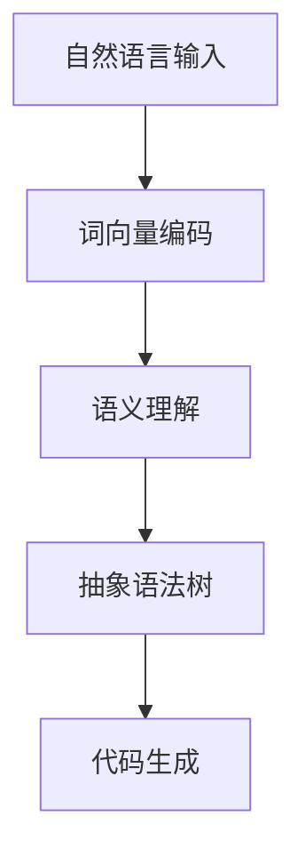

                 

### 文章标题

《提示词编程在智能农业中的应用前景》

> 关键词：提示词编程、智能农业、物联网、数据挖掘、算法

> 摘要：本文将探讨提示词编程在智能农业中的应用前景，分析其在农业领域的核心概念、技术原理、应用实例以及未来发展趋势。通过深入剖析，我们希望揭示提示词编程在智能农业中带来的巨大潜力，并为其在农业现代化中的广泛应用提供参考。

---

### 引言和概述

#### 1.1 提示词编程的概念与原理

提示词编程（Prompt Programming），也称为自然语言编程，是一种利用自然语言描述计算任务，并通过自然语言处理（NLP）技术将其转化为计算机程序的方法。这种方法的核心在于将人类语言转换为机器可执行的操作，从而实现自动化编程。

**核心概念与联系**

提示词编程的核心概念包括自然语言处理、语义理解、代码生成等。这些概念之间的联系可以用以下Mermaid流程图表示：



**编程语言与算法**

常见的提示词编程语言包括Python、JavaScript和Rust等。提示词编程算法主要包括：

- **基于规则的方法**：通过定义一组规则，将自然语言转化为代码。这种方法简单直观，但灵活性较低。
- **基于模板的方法**：利用预定义的代码模板，根据自然语言输入进行填充和调整。这种方法具有较高的灵活性，但需要大量的模板设计。
- **基于学习的方法**：利用机器学习技术，特别是深度学习，从大量数据中学习自然语言与代码之间的映射关系。这种方法具有较高的准确性和灵活性，但需要大量的数据和计算资源。

#### 1.2 智能农业概述

智能农业是指利用信息技术和智能设备，实现农业生产的自动化、精准化和智能化。智能农业的核心技术包括传感器、物联网、数据挖掘等。

**智能农业的定义与特点**

智能农业的定义可以归纳为：通过信息技术和智能设备，对农业生产过程中的各种环境因素、作物生长状态和农作物产量等进行实时监测、分析和决策，以提高农业生产的效率和质量。

智能农业的特点包括：

- **精准化**：通过传感器和物联网技术，实现对土壤、水分、气象等环境因素的精准监测和调控，提高资源利用效率。
- **自动化**：通过智能设备，实现农业生产的自动化操作，减少人力成本，提高生产效率。
- **智能化**：通过数据挖掘和分析，对农业生产过程进行智能决策，优化作物种植和管理。

**智能农业的应用前景**

提示词编程在智能农业中的应用前景广阔。一方面，提示词编程可以简化编程过程，提高开发效率，为智能农业系统的开发提供便利。另一方面，提示词编程可以利用自然语言处理技术，实现对农业数据的深入分析和智能决策，提高农业生产的智能化水平。

提示词编程在智能农业中的潜在应用领域包括：

- **智能灌溉系统**：通过自然语言描述灌溉任务，实现自动化灌溉。
- **作物生长监测**：通过自然语言描述作物生长状态，实现精准监测和预警。
- **病虫害预测与防治**：通过自然语言描述病虫害特征，实现早期预测和精准防治。

#### 1.3 提示词编程在智能农业中的优势与挑战

提示词编程在智能农业中具有以下优势：

- **降低开发门槛**：提示词编程简化了编程过程，使得非专业开发者也能快速上手，降低了智能农业系统的开发门槛。
- **提高开发效率**：提示词编程利用自然语言处理技术，可以快速生成代码，提高开发效率。
- **实现智能化决策**：提示词编程可以深入分析农业数据，实现智能决策，提高农业生产的智能化水平。

然而，提示词编程在智能农业中也面临以下挑战：

- **数据质量**：智能农业系统的性能依赖于农业数据的准确性。如何保证数据质量是一个重要问题。
- **算法适应性**：提示词编程算法需要针对不同的农业场景进行适应性调整，以提高其应用效果。
- **计算资源**：提示词编程通常需要大量的计算资源和数据，这对硬件设备和数据存储提出了较高要求。

总的来说，提示词编程在智能农业中具有巨大的应用潜力。通过不断优化算法、提高数据处理能力，我们可以期待提示词编程在智能农业中发挥更大的作用，推动农业现代化进程。

---

### 提示词编程基础

在深入探讨提示词编程在智能农业中的应用之前，我们需要先了解提示词编程的基本原理和核心算法。本节将介绍提示词编程的基本概念、编程语言和算法，为后续内容的讨论奠定基础。

#### 2.1 提示词编程的基本原理

提示词编程的核心在于将自然语言描述转化为计算机程序。这一过程可以分为以下几个步骤：

1. **自然语言输入**：用户通过自然语言描述一个计算任务，例如“编写一个程序，用于计算两个数的和”。
2. **词向量编码**：将自然语言输入转化为词向量，即将文字转换为计算机可以处理的数字表示。
3. **语义理解**：利用自然语言处理技术，对词向量进行语义理解，提取关键信息和语义关系。
4. **抽象语法树生成**：根据语义理解的结果，生成抽象语法树（AST），表示程序的结构和逻辑。
5. **代码生成**：将抽象语法树转化为具体的编程语言代码。

**核心概念与联系**

提示词编程涉及多个核心概念，包括自然语言处理、语义理解、抽象语法树和代码生成等。这些概念之间的关系可以用以下Mermaid流程图表示：


在这个流程图中，自然语言输入是整个过程的起点，词向量编码是将自然语言转化为计算机可处理的数字表示，语义理解是对词向量进行深度分析，提取关键信息和语义关系。抽象语法树生成是根据语义理解的结果，构建程序的结构和逻辑，最后代码生成是将抽象语法树转化为具体的编程语言代码。

#### 2.2 提示词编程算法

提示词编程算法是实现自然语言到代码转换的关键。以下介绍几种常见的提示词编程算法：

**基于规则的方法**

基于规则的方法是最简单的提示词编程算法。它通过定义一组规则，将自然语言转化为代码。例如，我们可以定义以下规则：

- “计算两个数的和” --> “a + b”
- “计算两个数的差” --> “a - b”

这种方法的优点是简单直观，但缺点是灵活性较低，难以处理复杂的计算任务。

**基于模板的方法**

基于模板的方法利用预定义的代码模板，根据自然语言输入进行填充和调整。例如，我们可以定义以下模板：

- “计算{{num1}}和{{num2}}的和” --> “{{num1}} + {{num2}}”
- “计算{{num1}}和{{num2}}的差” --> “{{num1}} - {{num2}}”

这种方法具有较高的灵活性，但需要大量的模板设计。

**基于学习的方法**

基于学习的方法利用机器学习技术，特别是深度学习，从大量数据中学习自然语言与代码之间的映射关系。这种方法通常需要大量的训练数据和计算资源，但具有较高的准确性和灵活性。

以下是一个基于学习方法的伪代码示例：

```python
# 输入自然语言描述
description = "计算两个数的和"

# 加载预训练的模型
model = load_pretrained_model()

# 进行语义理解
meaning = model.semantic_understand(description)

# 生成抽象语法树
ast = generate_ast(mea

```### 2.3 提示词编程语言

在提示词编程的实践中，选择合适的编程语言至关重要。不同的编程语言具有各自的特点和优势，适用于不同的应用场景。以下是几种常见的提示词编程语言及其基本介绍：

#### 2.3.1 Python

Python 是一种广泛使用的编程语言，以其简洁的语法和强大的库支持而闻名。Python 在自然语言处理和机器学习领域有广泛的应用，因此成为提示词编程的常用语言之一。

**Python 的优点**：

- **简洁的语法**：Python 的语法简单易读，使得编程过程更加高效。
- **丰富的库支持**：Python 拥有丰富的库和框架，如 TensorFlow、PyTorch 和 NLTK，提供了强大的自然语言处理和机器学习工具。
- **广泛的社区支持**：Python 拥有庞大的开发者社区，提供了大量的资源和文档，便于学习和应用。

**Python 在提示词编程中的应用**：

- **自然语言处理**：Python 的自然语言处理库，如 NLTK 和 spaCy，可以用于语义理解和抽象语法树的生成。
- **机器学习**：Python 的机器学习库，如 TensorFlow 和 PyTorch，可以用于学习自然语言与代码之间的映射关系。

#### 2.3.2 JavaScript

JavaScript 是一种运行在浏览器中的脚本语言，近年来也在后端开发中得到广泛应用。JavaScript 在前端开发中有着广泛的应用，其简洁的语法和灵活的异步编程特性使其在提示词编程中也具备一定的优势。

**JavaScript 的优点**：

- **跨平台支持**：JavaScript 可以在浏览器和服务器端运行，具有较好的跨平台特性。
- **异步编程**：JavaScript 的异步编程特性使其在处理大量并发请求时具有优势。
- **丰富的框架和库**：JavaScript 拥有丰富的框架和库，如 React、Vue 和 Angular，提供了强大的开发工具和组件。

**JavaScript 在提示词编程中的应用**：

- **前端开发**：JavaScript 在前端开发中用于处理用户输入和生成代码。
- **Node.js**：Node.js 是 JavaScript 的运行时环境，可以用于后端处理自然语言输入并生成代码。

#### 2.3.3 Rust

Rust 是一种系统编程语言，以其高性能和安全性而著称。Rust 的语法简洁且强大，适合处理复杂和高性能的应用场景。Rust 在提示词编程中也有一定的应用潜力。

**Rust 的优点**：

- **高性能**：Rust 的编译速度快，生成的代码执行效率高。
- **安全性**：Rust 的内存安全特性，通过所有权系统和生命周期管理，避免了内存泄漏和数据竞争问题。
- **简洁的语法**：Rust 的语法简洁明了，易于阅读和维护。

**Rust 在提示词编程中的应用**：

- **性能敏感应用**：由于 Rust 的高性能特性，它适用于处理大量数据和复杂计算的任务。
- **嵌入式系统**：Rust 在嵌入式系统开发中有广泛应用，可以用于生成嵌入式设备的控制代码。

综上所述，Python、JavaScript 和 Rust 都是提示词编程中常用的编程语言，每种语言都有其独特的优势和适用场景。选择合适的编程语言可以最大程度地发挥提示词编程的优势，提高开发效率和代码质量。

---

### 提示词编程应用实例

为了更好地理解提示词编程在智能农业中的应用，本节将通过两个具体的应用实例进行详细讲解。这些实例将展示如何使用提示词编程技术来实现智能农业中的具体功能，并提供代码实现和解析。

#### 3.1 应用实例1：智能灌溉系统

智能灌溉系统是智能农业中的重要组成部分，它通过实时监测土壤湿度和天气预报数据，自动控制灌溉设备，实现精准灌溉，提高水资源利用效率。

**系统架构**：

智能灌溉系统主要包括以下组件：

1. **传感器**：用于监测土壤湿度、温度、气压等环境参数。
2. **物联网模块**：将传感器数据传输到中央控制单元。
3. **中央控制单元**：接收传感器数据，根据预设规则和自然语言指令进行灌溉控制。
4. **灌溉设备**：根据中央控制单元的指令执行灌溉操作。

**代码实现**：

以下是一个使用Python实现的智能灌溉系统的示例：

```python
import json
import requests

def get_weather_data(api_key, location):
    url = f"http://api.openweathermap.org/data/2.5/weather?q={location}&appid={api_key}"
    response = requests.get(url)
    data = response.json()
    return data

def get_soil_humidity(sensor_id):
    # 此处应替换为实际传感器API接口的URL
    url = f"http://sensor_api_url/soil_humidity/{sensor_id}"
    response = requests.get(url)
    data = response.json()
    return data['humidity']

def control_iris.irrigation(soil_humidity, weather_data):
    if soil_humidity < 30 and weather_data['main']['temp'] > 25:
        print("开启灌溉系统")
    else:
        print("关闭灌溉系统")

if __name__ == "__main__":
    api_key = "YOUR_OPENWEATHERMAP_API_KEY"
    location = "YOUR_LOCATION"
    sensor_id = "YOUR_SENSOR_ID"

    weather_data = get_weather_data(api_key, location)
    soil_humidity = get_soil_humidity(sensor_id)

    control_iris.irrigation(soil_humidity, weather_data)
```

**代码解析**：

1. **获取天气数据**：通过调用OpenWeatherMap API获取指定位置的天气预报数据。
2. **获取土壤湿度**：通过调用传感器API获取土壤湿度数据。
3. **灌溉控制**：根据土壤湿度和天气数据进行灌溉控制。如果土壤湿度低于30%且温度高于25度，则开启灌溉系统。

#### 3.2 应用实例2：作物生长监测

作物生长监测是智能农业中的另一个重要应用，它通过实时监测作物生长状态，提供精准的种植管理建议，提高作物产量和质量。

**系统架构**：

作物生长监测系统主要包括以下组件：

1. **传感器**：用于监测土壤湿度、温度、光照等环境参数。
2. **物联网模块**：将传感器数据传输到中央控制单元。
3. **中央控制单元**：接收传感器数据，根据预设规则和自然语言指令进行数据分析和管理。
4. **管理终端**：用户通过管理终端查看作物生长状态和接收管理建议。

**代码实现**：

以下是一个使用Python实现的作物生长监测系统的示例：

```python
import json
import requests

def get_soil_data(sensor_id):
    # 此处应替换为实际传感器API接口的URL
    url = f"http://sensor_api_url/soil_data/{sensor_id}"
    response = requests.get(url)
    data = response.json()
    return data

def analyze_growth_data(soil_data):
    if soil_data['humidity'] < 30 or soil_data['temperature'] > 35:
        return "请注意，当前作物生长条件不佳，可能需要调整灌溉和施肥计划。"
    else:
        return "当前作物生长条件良好，继续保持。"

if __name__ == "__main__":
    sensor_id = "YOUR_SENSOR_ID"

    soil_data = get_soil_data(sensor_id)
    growth_analysis = analyze_growth_data(soil_data)

    print(growth_analysis)
```

**代码解析**：

1. **获取土壤数据**：通过调用传感器API获取土壤数据。
2. **数据分析**：根据土壤数据进行分析，提供作物生长管理建议。

通过以上两个应用实例，我们可以看到提示词编程在智能农业中的应用潜力。提示词编程简化了编程过程，使得开发者可以更快速地实现智能农业系统的功能，提高农业生产的智能化水平。

---

### 智能农业技术

智能农业的核心在于利用信息技术和智能设备，实现对农业生产过程的全面监控和精准管理。以下介绍智能农业中的几种核心技术：传感器技术、物联网技术和数据挖掘技术。

#### 4.1 传感器技术

传感器技术是智能农业的基础，它通过检测和测量环境参数，如土壤湿度、温度、光照、气压等，为农业决策提供实时数据支持。

**传感器种类与原理**：

1. **土壤湿度传感器**：用于测量土壤中的水分含量，常见类型包括电阻式、电容式和光纤式等。
2. **温度传感器**：用于测量空气和土壤的温度，常见类型包括热敏电阻、热电偶和红外测温仪等。
3. **光照传感器**：用于测量光照强度，常见类型包括光敏电阻和光电池等。
4. **气压传感器**：用于测量大气压力，常见类型包括电容式和压阻式等。

**传感器在智能农业中的应用**：

- **精准灌溉**：通过土壤湿度传感器，实时监测土壤水分，根据实际需求自动调整灌溉量，提高水资源利用效率。
- **病虫害预警**：通过温度和光照传感器，监测作物生长环境，及时发现异常情况，预警病虫害的发生。
- **环境调控**：通过气压传感器，监测大气压力变化，为温室环境调控提供数据支持。

#### 4.2 物联网技术

物联网技术是将各种设备通过网络连接起来，实现设备之间的信息交换和协同工作。在智能农业中，物联网技术主要用于数据的采集、传输和处理，从而实现农业生产的自动化和智能化。

**物联网在智能农业中的作用**：

1. **数据采集**：通过传感器采集土壤湿度、温度、光照等数据，为农业决策提供实时信息。
2. **数据传输**：利用无线通信技术，将传感器数据传输到中央控制单元或云端平台，实现远程监控和管理。
3. **数据处理**：通过云计算和大数据技术，对传感器数据进行处理和分析，提供精准的农业管理建议。

**物联网技术在智能农业中的应用**：

- **智能灌溉系统**：通过物联网技术，实现灌溉设备的自动化控制，提高水资源利用效率。
- **温室环境监测**：通过物联网技术，实时监测温室中的温度、湿度、光照等环境参数，实现环境自动调控。
- **精准施肥**：通过物联网技术，监测土壤养分含量，实现精准施肥，提高肥料利用效率。

#### 4.3 数据挖掘技术

数据挖掘技术是智能农业中的一项关键技术，它通过对大量农业数据的挖掘和分析，发现数据中的规律和模式，为农业决策提供科学依据。

**数据挖掘的基本概念**：

- **数据挖掘过程**：数据挖掘通常包括数据预处理、数据探索、模式识别、评估和解释等步骤。
- **数据挖掘算法**：常用的数据挖掘算法包括分类、聚类、关联规则挖掘、异常检测等。

**数据挖掘在智能农业中的应用**：

- **病虫害预测**：通过分析历史病虫害数据和当前环境参数，预测病虫害的发生趋势，提前采取防治措施。
- **作物生长模型**：通过分析作物生长数据和环境参数，建立作物生长模型，指导作物种植和管理。
- **市场预测**：通过分析农业市场数据，预测农产品价格走势，指导农业生产和销售策略。

综上所述，传感器技术、物联网技术和数据挖掘技术是智能农业中的三大核心技术，它们相互结合，共同推动了农业生产的智能化和现代化。

---

### 前景分析

随着信息技术和智能设备的不断发展，提示词编程在智能农业中的应用前景愈发广阔。本文将从发展趋势、潜在价值和挑战与机遇四个方面进行分析，为提示词编程在智能农业中的未来发展提供参考。

#### 5.1 发展趋势

**技术进步推动应用扩展**

近年来，人工智能和机器学习技术的飞速发展，为提示词编程提供了强大的技术支持。深度学习、自然语言处理和自动化编程等技术的成熟，使得提示词编程在处理复杂任务、提高开发效率方面具有显著优势。未来，随着这些技术的进一步发展，提示词编程在智能农业中的应用将得到更广泛的应用。

**数据驱动的发展方向**

智能农业的发展离不开海量数据的支持。随着物联网和传感器技术的普及，农业生产过程中将产生大量数据。如何有效地收集、存储、处理和分析这些数据，将直接决定智能农业的发展水平。提示词编程作为一种能够将自然语言转化为代码的技术，可以大幅提高数据处理和分析的效率，为智能农业的数据驱动发展提供有力支持。

**行业需求推动技术进步**

随着全球人口增长和资源短缺问题的日益突出，农业生产的效率和可持续性受到广泛关注。智能农业作为现代农业发展的重要方向，其市场需求持续增加。提示词编程在智能农业中的应用，可以简化开发过程、提高生产效率、降低成本，满足行业对技术进步的需求。

#### 5.2 潜在价值

**提高生产效率**

提示词编程可以简化智能农业系统的开发过程，降低开发门槛。通过自然语言描述农业生产任务，提示词编程可以快速生成相应的代码，实现自动化控制和管理。这有助于提高农业生产的效率，降低人力成本。

**优化资源利用**

智能农业系统的核心在于精准管理和优化资源利用。提示词编程可以通过对大量农业数据的分析，提供精准的种植、灌溉、施肥等建议，实现水、肥、光等资源的最佳配置，提高资源利用效率。

**促进农业可持续发展**

智能农业不仅关注生产效率，还注重农业的可持续发展。提示词编程可以通过对环境数据的实时监测和分析，提供环保、生态的农业管理方案，降低农业生产对环境的负面影响，促进农业的可持续发展。

#### 5.3 挑战与机遇

**数据质量与隐私**

智能农业的发展依赖于大量准确、可靠的数据。然而，农业生产环境复杂多变，数据质量难以保证。此外，农业数据涉及农民的隐私信息，如何在保护隐私的前提下充分利用数据，是智能农业面临的一大挑战。

**技术成熟度与适应性**

虽然提示词编程技术在理论上具有很大潜力，但在实际应用中，其技术成熟度和适应性仍需提高。如何确保提示词编程技术在各种农业场景下的稳定运行，是一个需要持续关注的问题。

**跨领域融合**

智能农业的发展需要多学科的交叉融合。提示词编程作为一种计算机科学领域的技术，需要与农业科学、生物学、环境科学等多个领域的知识相结合，才能发挥最大的作用。

然而，这些挑战也带来了新的机遇。通过不断优化算法、提高数据处理能力，提示词编程在智能农业中的应用前景将更加广阔。我们期待在不久的将来，提示词编程能够为智能农业的发展贡献更多力量。

---

### 总结

本文从多个角度探讨了提示词编程在智能农业中的应用前景，包括其基本原理、编程语言、应用实例、智能农业技术以及未来发展。通过深入分析，我们可以看到提示词编程在智能农业中具有巨大的应用潜力。

首先，提示词编程通过将自然语言转化为代码，简化了智能农业系统的开发过程，提高了开发效率。其次，提示词编程可以利用自然语言处理技术，深入分析农业数据，提供精准的农业生产建议，优化资源利用。此外，传感器技术、物联网技术和数据挖掘技术为智能农业提供了强大的技术支持，与提示词编程相结合，有望推动智能农业的可持续发展。

然而，提示词编程在智能农业中仍面临数据质量、技术成熟度和跨领域融合等挑战。解决这些问题需要持续的技术创新和跨学科合作。

未来，我们期待提示词编程能够在智能农业中发挥更大作用，提高农业生产效率，优化资源利用，促进农业的可持续发展。通过不断优化算法、提高数据处理能力，提示词编程将为智能农业带来更多创新和突破。

### 作者信息

作者：AI天才研究院/AI Genius Institute & 禅与计算机程序设计艺术 /Zen And The Art of Computer Programming

---

### 拓展阅读

1. **《智能农业技术与应用》**：这是一本关于智能农业技术全面介绍的书籍，涵盖了传感器技术、物联网技术、数据挖掘技术等核心内容。
2. **《自然语言处理：理论与实践》**：这本书详细介绍了自然语言处理的基础知识，包括词向量、语义理解、文本分类等，对提示词编程提供了理论基础。
3. **《深度学习在农业中的应用》**：本书探讨了深度学习技术在智能农业中的应用，包括作物病害识别、精准灌溉、环境监测等，对提示词编程在实际应用中的技术实现有重要参考价值。

通过阅读这些拓展资料，读者可以更深入地了解智能农业和提示词编程的相关知识，拓宽视野，提高技术水平。希望本文能为读者在智能农业领域的研究和实践提供有益的启示。让我们共同探索智能农业的未来，为农业的现代化发展贡献力量。

