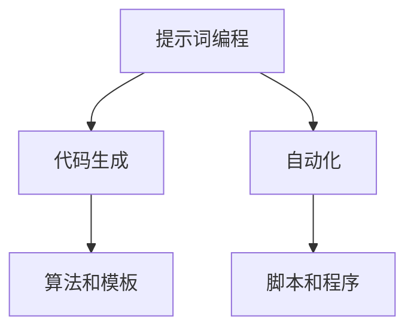
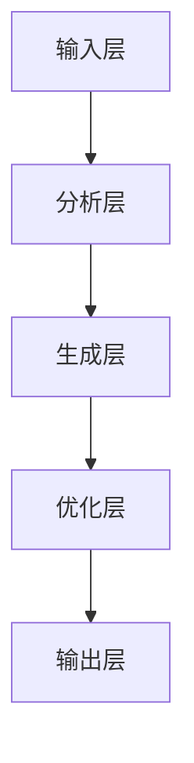
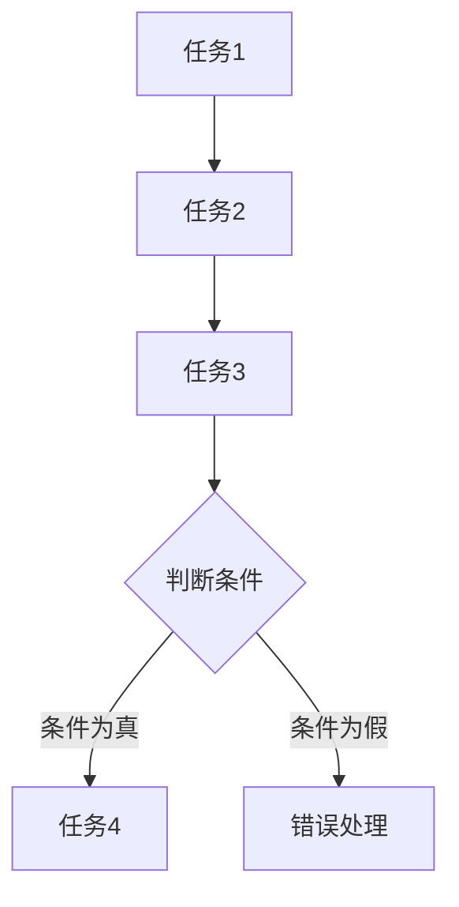

                 


### 1.1 核心概念与联系

在《提示词编程的代码生成与自动化》一文中，我们需要深入探讨三个核心概念：提示词编程、代码生成和自动化。这些概念之间的联系如下图所示：



**提示词编程**：提示词编程是一种通过提示（prompt）来指导代码生成和自动化的编程方式。提示词可以是简单的文本，也可以是更复杂的上下文信息。其核心思想是利用自然语言描述任务，从而实现代码的自动生成和执行。

**代码生成**：代码生成是指通过算法和模板，自动化地生成代码，无需手动编写。代码生成工具通常包括模板引擎和代码生成器，它们可以根据给定的提示词和模板，生成符合特定需求的代码。

**自动化**：自动化是指通过脚本或程序来自动执行任务，以减少人工干预。在编程领域，自动化涉及到将代码与任务绑定，使其可以自动运行，从而提高开发效率和降低成本。

### 1.2 核心算法原理讲解

**代码生成算法**

代码生成算法通常基于模板和算法。算法负责理解提示词，并将其转化为代码。以下是一个简化的代码生成算法伪代码：

```
function generateCode(prompt):
    template = loadTemplate(prompt)
    code = applyAlgorithm(template, prompt)
    return code
```

在这个伪代码中，`loadTemplate`函数用于加载与提示词相关的模板，`applyAlgorithm`函数则用于将模板与提示词结合，生成代码。

**自动化算法**

自动化编程涉及到将代码或脚本与任务绑定，使其可以自动执行。以下是一个简单的自动化算法伪代码：

```
function automateTask(taskDescription):
    script = createScript(taskDescription)
    executeScript(script)
```

在这个伪代码中，`createScript`函数用于根据任务描述生成脚本，`executeScript`函数则用于执行脚本。

### 1.3 数学模型和数学公式

在提示词编程中，某些算法可能涉及到数学模型。以下是一个简单的线性回归模型的数学公式：

$$
y = w_0 + w_1 \cdot x_1 + w_2 \cdot x_2 + ... + w_n \cdot x_n
$$

**详细讲解与举例说明**

线性回归是一种常用的机器学习算法，用于预测一个连续变量的值。在这个例子中，我们试图通过一个简单的线性模型来预测房价。

首先，我们需要收集一些房屋的特征数据，如面积、位置等，以及对应的房价。然后，我们可以使用线性回归算法来拟合这些数据，得到一个预测模型。

假设我们有一个训练数据集，包含1000个样本和10个特征。我们可以使用以下Python代码来训练一个线性回归模型：

```python
import numpy as np
from sklearn.linear_model import LinearRegression

# 创建训练数据集
X = np.random.rand(1000, 10)
y = np.random.rand(1000)

# 创建线性回归模型并训练
model = LinearRegression()
model.fit(X, y)

# 输出模型参数
print("模型参数：", model.coef_)
print("截距：", model.intercept_)
```

在这个例子中，`X`是特征数据，`y`是目标变量，`model.fit(X, y)`用于训练模型，`model.coef_`和`model.intercept_`分别表示模型的权重和截距。

然后，我们可以使用训练好的模型来预测新的房价。例如，对于一个新的样本 `[0.1, 0.2, 0.3, 0.4, 0.5, 0.6, 0.7, 0.8, 0.9, 1.0]`，我们可以使用以下代码进行预测：

```python
# 输入新的样本
new_sample = np.array([0.1, 0.2, 0.3, 0.4, 0.5, 0.6, 0.7, 0.8, 0.9, 1.0])

# 使用模型进行预测
prediction = model.predict(new_sample)

# 输出预测结果
print("预测房价：", prediction)
```

在这个例子中，`model.predict(new_sample)`用于计算新样本的房价预测值。

通过这个例子，我们可以看到线性回归模型是如何通过数学模型和算法来预测房价的。类似的数学模型和算法也可以应用于其他问题，如股票价格预测、语音识别等。

----------------------------------------------------------------

## 第一部分：提示词编程基础

### 1.1 编程的演变与提示词编程的兴起

编程的历史可以追溯到上世纪50年代，当时计算机刚刚诞生，编程主要是通过机器语言或汇编语言进行的。随着计算机技术的发展，高级编程语言如C、Java、Python等逐渐兴起，大大降低了编程的门槛，使得更多人可以参与到计算机编程中来。然而，传统编程仍然存在着一些问题，如代码复杂度增加、开发效率低下等。

近年来，随着人工智能技术的发展，一种新的编程范式——提示词编程（Prompt Programming）逐渐兴起。提示词编程的核心思想是利用自然语言描述编程任务，通过人工智能算法自动生成代码，从而实现编程的自动化和智能化。

### 1.2 书籍目标与读者对象

本书的目标是深入探讨提示词编程的原理、技术、应用和实践，旨在为读者提供一个全面、系统的学习和参考资源。本书适合以下读者群体：

1. 计算机科学和软件工程专业的本科生和研究生。
2. 对编程和人工智能感兴趣的程序员和工程师。
3. 希望提高编程效率和开发技能的开发人员。
4. 对提示词编程和自动化编程技术有深入研究的学者和研究人员。

本书将从基础概念出发，逐步深入，通过实例和实战案例，帮助读者理解提示词编程的核心原理和技术，掌握实际应用的方法和技巧。

### 1.3 提示词编程的基本概念

#### 提示词

提示词（Prompt）是提示词编程的核心概念。它是一个文本字符串，用于描述编程任务或问题。提示词可以是简单的命令，如“写一个函数来计算两个数的和”，也可以是复杂的描述，如“基于用户输入的姓名和年龄，生成一个简单的个人简介”。

#### 代码生成

代码生成（Code Generation）是指通过算法和模板，自动化地生成代码。代码生成可以根据提示词生成满足特定需求的代码，从而减少手动编写的代码量，提高开发效率。

#### 自动化编程

自动化编程（Automated Programming）是指通过脚本或程序来自动执行编程任务。自动化编程可以减少人工干预，提高编程的可靠性和效率。

#### 提示词编程的特点

提示词编程具有以下几个特点：

1. **自然语言描述**：提示词编程使用自然语言描述编程任务，使得编程任务更加直观和易理解。
2. **自动化生成**：提示词编程可以通过算法和模板自动化地生成代码，减少手动编写的工作量。
3. **高效开发**：提示词编程可以提高开发效率，缩短项目开发周期。
4. **代码复用**：提示词编程生成的代码可以复用，减少重复编写的工作。

### 1.4 提示词编程的应用领域

提示词编程在多个领域都有着广泛的应用，以下是其中一些典型应用：

1. **Web开发**：提示词编程可以用于自动化生成前端页面、后端接口和数据库操作代码，提高Web项目的开发效率。
2. **数据分析**：提示词编程可以帮助数据科学家自动化地生成数据分析代码，处理大量数据并生成可视化报告。
3. **自动化测试**：提示词编程可以用于自动化生成测试用例和测试代码，提高软件测试的效率和质量。
4. **人工智能**：提示词编程可以用于自动化生成机器学习算法的代码，加速人工智能项目的开发。

### 1.5 提示词编程的发展历程

提示词编程并非新兴概念，其发展历程可以追溯到上世纪80年代。以下是提示词编程的一些重要里程碑：

1. **代码生成工具的兴起**：上世纪80年代，随着编程语言的普及，代码生成工具如JavaCC、ANTLR等开始出现，为代码生成提供了技术基础。
2. **模板技术的应用**：上世纪90年代，模板技术如JSP、ASP等逐渐兴起，为动态网页开发提供了支持。
3. **人工智能的引入**：21世纪初，随着人工智能技术的发展，机器学习算法开始应用于代码生成，提升了代码生成的智能化水平。
4. **深度学习的推动**：近年来，深度学习技术的应用进一步推动了提示词编程的发展，使得代码生成更加高效和准确。

### 1.6 提示词编程的优势

提示词编程相比传统编程模式，具有以下优势：

1. **提高开发效率**：提示词编程可以自动化生成代码，减少手动编写的工作量，提高开发效率。
2. **降低开发成本**：提示词编程可以减少开发人员的数量，降低项目成本。
3. **易用性**：提示词编程使用自然语言描述编程任务，使得编程任务更加直观和易理解，降低了编程门槛。
4. **代码复用**：提示词编程生成的代码可以复用，减少重复编写的工作。
5. **智能化**：提示词编程可以利用人工智能算法，实现代码生成的自动化和智能化，提高编程质量。

### 1.7 提示词编程的挑战与未来

尽管提示词编程具有诸多优势，但其在实际应用中仍面临一些挑战：

1. **代码质量**：自动生成的代码可能存在质量问题，需要人工进行审查和优化。
2. **开发成本**：提示词编程的开发和部署成本相对较高，需要投入更多的资源和精力。
3. **安全性**：自动生成的代码可能存在安全漏洞，需要加强代码审核和安全性测试。
4. **人才需求**：提示词编程需要既懂编程又懂人工智能的人才，人才需求增加。

未来，随着人工智能技术的不断发展，提示词编程有望进一步突破这些挑战，实现更广泛的应用。同时，提示词编程也将为编程教育和研究带来新的机遇和挑战。

### 1.8 总结与展望

在本章中，我们介绍了提示词编程的基本概念、应用领域、发展历程和优势与挑战。通过本章的学习，读者可以初步了解提示词编程的核心内容，为后续章节的深入学习打下基础。在接下来的章节中，我们将继续探讨代码生成与自动化的核心原理、工具和技术，帮助读者更深入地了解提示词编程的实际应用。

----------------------------------------------------------------

## 第二部分：代码生成与自动化的核心原理

### 2.1 代码生成的理论基础

代码生成（Code Generation）是指通过算法和模板自动化地生成代码，从而实现编程的自动化。代码生成在软件开发中具有重要作用，可以显著提高开发效率、降低开发成本，并减少代码出错的可能性。代码生成的理论基础主要涉及以下几个方面：

#### 1. 编程语言理论

编程语言理论为代码生成提供了基础。编译原理、语法分析、语义分析等技术是代码生成的核心。通过分析输入的源代码，编译器可以将源代码转换为机器语言或其他编程语言。同样，代码生成器也需要对输入的提示词进行语法和语义分析，以生成符合目标编程语言的代码。

#### 2. 模式识别与机器学习

模式识别与机器学习技术在代码生成中发挥着重要作用。代码生成器可以通过对大量代码样本的学习，识别出代码生成模式，从而实现自动生成代码。机器学习算法如决策树、支持向量机、神经网络等，可以用于训练模型，识别输入提示词与输出代码之间的关系。

#### 3. 模板技术

模板技术是代码生成的重要组成部分。模板是一段预定义的代码结构，可以通过参数化扩展生成具体的代码。模板技术可以显著提高代码生成的效率和灵活性。模板引擎如JSP、ASP、FreeMarker等，为开发者提供了方便的模板定义和代码生成功能。

#### 4. 面向对象编程

面向对象编程（OOP）为代码生成提供了抽象和模块化的方法。通过封装、继承和多态等概念，面向对象编程可以简化代码结构，提高代码的可维护性和复用性。在代码生成过程中，面向对象方法可以帮助开发者更好地组织代码，提高代码生成器的可扩展性。

#### 5. 编程语言工程

编程语言工程涉及编程语言的设计、实现和工具开发。代码生成器是编程语言工程的重要组成部分。编程语言工程提供了一系列工具和技术，如语法分析器、代码生成器、集成开发环境（IDE）等，为代码生成提供了支持。

### 2.2 代码自动化的关键要素

代码自动化（Code Automation）是指通过脚本或程序来自动执行编程任务，从而减少人工干预。代码自动化在软件开发和运维中具有重要意义，可以提高开发效率、降低运营成本，并确保任务的可靠性和一致性。代码自动化的关键要素包括以下几个方面：

#### 1. 工作流管理

工作流管理是代码自动化的核心。工作流管理器可以帮助开发者定义、调度和监控自动化任务。通过工作流管理器，开发者可以自动化地执行一系列编程任务，如代码编译、部署、测试等。

#### 2. 脚本编写

脚本编写是代码自动化的基础。脚本是一种简单的编程语言，可以用于执行各种自动化任务。常见的脚本语言包括Python、Shell、Bash等。开发者可以使用脚本语言编写自动化脚本，实现自动化任务的定义和执行。

#### 3. 任务调度

任务调度是代码自动化的重要组成部分。任务调度器可以帮助开发者按照预定的时间表或条件，自动执行自动化任务。常见的任务调度器包括cron、Windows Task Scheduler等。

#### 4. 日志记录与监控

日志记录与监控是代码自动化的保障。通过记录任务执行过程中的日志，开发者可以及时发现和解决问题。同时，监控工具可以帮助开发者实时监控自动化任务的运行状态，确保任务的正常运行。

#### 5. 异常处理与恢复

异常处理与恢复是代码自动化的关键。在自动化任务执行过程中，可能会遇到各种异常情况，如网络故障、资源不足等。开发者需要设计异常处理机制，确保自动化任务能够在异常情况下继续执行，并能够恢复到正常状态。

### 2.3 提示词编程在代码生成与自动化中的应用

提示词编程在代码生成与自动化中具有广泛的应用。通过提示词，开发者可以描述编程任务，从而实现代码的自动生成和自动化执行。以下是提示词编程在代码生成与自动化中的具体应用：

#### 1. 代码生成

提示词编程可以用于代码生成。例如，开发者可以使用自然语言描述一个函数的功能，提示词编程工具可以自动生成相应的函数代码。以下是一个简单的例子：

```
提示词：编写一个函数，用于计算两个整数的和。

自动生成的代码：
def add(a, b):
    return a + b
```

#### 2. 自动化执行

提示词编程可以用于自动化执行编程任务。例如，开发者可以使用自然语言描述一个自动化任务，提示词编程工具可以自动生成相应的自动化脚本。以下是一个简单的例子：

```
提示词：每天早上8点，自动备份数据库。

自动生成的脚本（Python）：
import datetime
import os

current_date = datetime.datetime.now().strftime("%Y-%m-%d")
backup_file = f"db_backup_{current_date}.sql"

if not os.path.exists(backup_file):
    os.system("mysqldump -u username -p password dbname > " + backup_file)
    print("数据库备份完成。")
else:
    print("数据库已备份。")
```

#### 3. 代码优化

提示词编程可以用于代码优化。例如，开发者可以使用自然语言描述一个代码优化的目标，提示词编程工具可以自动生成相应的优化代码。以下是一个简单的例子：

```
提示词：优化以下代码，提高执行效率。

原始代码：
for i in range(10000):
    print(i)

优化后的代码：
print(list(range(10000)))
```

通过以上例子，我们可以看到提示词编程在代码生成与自动化中的强大应用。在实际开发中，开发者可以根据需要灵活运用提示词编程，实现代码的自动生成和自动化执行，提高开发效率和质量。

----------------------------------------------------------------

## 第三部分：提示词编程的工具与技术

### 3.1 代码生成工具的介绍

在提示词编程中，代码生成工具起着至关重要的作用。这些工具可以帮助开发者自动化地生成代码，提高开发效率和代码质量。以下是一些常见的代码生成工具及其特点：

#### 1. CodeSmith

CodeSmith是一个功能强大的代码生成工具，支持多种编程语言和数据库。它使用模板语言来定义代码结构，并可以根据提示词自动生成代码。CodeSmith的特点包括：

- **多语言支持**：支持C#、Java、ASP.NET等。
- **模板引擎**：使用自定义模板语言，方便定义代码结构。
- **数据库连接**：可以直接连接数据库，提取数据表信息生成代码。

#### 2. Entity Framework

Entity Framework是一个由微软开发的对象关系映射（ORM）框架，它可以帮助开发者自动化地生成数据访问层代码。通过定义实体模型，Entity Framework可以自动生成数据访问类和方法，从而简化数据操作。Entity Framework的特点包括：

- **ORM支持**：将数据库操作映射到对象模型，减少SQL编写。
- **代码生成**：根据实体模型自动生成数据访问层代码。
- **灵活配置**：支持自定义数据访问策略和扩展功能。

#### 3. Visual Studio Code

Visual Studio Code（简称VS Code）是一个由微软开发的免费、开源的代码编辑器，它内置了代码生成功能。通过使用扩展和插件，开发者可以轻松地生成代码。VS Code的特点包括：

- **插件生态**：拥有丰富的插件，支持各种编程语言和框架。
- **代码生成插件**：如Code Generator for XAML和C# Extension等，可以生成各种类型的代码。
- **智能提示**：提供智能代码提示、代码补全等功能，提高开发效率。

#### 4. CodeDOM

CodeDOM是一个跨平台的代码生成库，它可以将编程语言的代码表示为抽象语法树（AST）。通过CodeDOM，开发者可以动态地生成代码，并将其编译为可执行程序。CodeDOM的特点包括：

- **跨平台**：支持多种编程语言，如C#、Java、Python等。
- **抽象语法树**：提供AST操作接口，方便生成和修改代码。
- **代码编译**：可以将生成的代码编译为可执行程序。

#### 5. SharpDevelop

SharpDevelop是一个开源的集成开发环境（IDE），它内置了代码生成功能。通过使用SharpDevelop的代码生成器，开发者可以自动化地生成各种类型的代码。SharpDevelop的特点包括：

- **集成开发环境**：提供代码编辑、调试、构建等功能。
- **代码生成器**：支持多种编程语言，如C#、VB.NET等。
- **自定义模板**：支持自定义代码生成模板，方便快速生成代码。

### 3.2 自动化编程框架的使用

在提示词编程中，自动化编程框架可以帮助开发者自动化地执行编程任务，提高开发效率。以下是一些常见的自动化编程框架及其特点：

#### 1. Nuitka

Nuitka是一个Python编译器，它可以将Python代码编译为C代码，然后编译为可执行程序。通过Nuitka，开发者可以自动化地生成和编译Python代码，从而实现代码的自动化执行。Nuitka的特点包括：

- **Python编译器**：将Python代码编译为C代码，提高执行效率。
- **代码生成**：可以生成可执行程序，无需Python环境。
- **跨平台**：支持多种操作系统，如Windows、Linux、macOS等。

#### 2. AutoIt

AutoIt是一个开源的自动化脚本语言，它主要用于Windows应用程序的自动化。通过AutoIt，开发者可以编写自动化脚本，控制Windows应用程序的界面元素，实现自动化操作。AutoIt的特点包括：

- **自动化脚本**：支持Windows应用程序的自动化。
- **界面控制**：可以控制Windows应用程序的界面元素。
- **跨平台**：支持Windows、Linux、macOS等操作系统。

#### 3. Robot Framework

Robot Framework是一个开源的自动化测试框架，它主要用于自动化测试和任务执行。通过Robot Framework，开发者可以编写测试用例和自动化任务，实现自动化执行。Robot Framework的特点包括：

- **自动化测试**：支持多种测试类型，如功能测试、性能测试等。
- **测试用例**：可以编写测试用例，自动化执行测试任务。
- **跨平台**：支持多种操作系统，如Windows、Linux、macOS等。

#### 4. Selenium WebDriver

Selenium WebDriver是一个开源的Web自动化框架，它主要用于Web应用程序的自动化测试和操作。通过Selenium WebDriver，开发者可以编写自动化脚本，控制Web浏览器，实现自动化操作。Selenium WebDriver的特点包括：

- **Web自动化**：支持多种Web浏览器，如Chrome、Firefox、Safari等。
- **自动化脚本**：可以编写自动化脚本，控制Web浏览器和页面元素。
- **跨平台**：支持多种操作系统，如Windows、Linux、macOS等。

### 3.3 提示词编程相关库与资源

在提示词编程中，相关的库和资源为开发者提供了强大的支持。以下是一些常用的库和资源：

#### 1. NLTK

NLTK（自然语言处理工具包）是一个开源的Python库，用于自然语言处理（NLP）。通过NLTK，开发者可以处理文本数据，提取信息，为提示词编程提供基础。NLTK的特点包括：

- **文本处理**：支持多种文本处理任务，如分词、词性标注、词干提取等。
- **语言模型**：提供多种语言模型，如词向量模型、语法分析器等。
- **库生态**：拥有丰富的扩展库，支持多种NLP任务。

#### 2. spaCy

spaCy是一个开源的快速NLP库，它提供了丰富的API和高效的处理速度。通过spaCy，开发者可以轻松实现文本处理、实体识别、命名实体识别等任务。spaCy的特点包括：

- **快速处理**：高效的处理速度，支持多种NLP任务。
- **多语言支持**：支持多种语言，如英语、中文、法语等。
- **库生态**：拥有丰富的扩展库，支持多种NLP任务。

#### 3. TensorFlow

TensorFlow是一个开源的深度学习框架，它支持多种深度学习模型和算法。通过TensorFlow，开发者可以构建和训练深度学习模型，为提示词编程提供支持。TensorFlow的特点包括：

- **深度学习框架**：支持多种深度学习模型和算法。
- **灵活扩展**：提供丰富的API，支持自定义模型和算法。
- **库生态**：拥有丰富的扩展库，支持多种深度学习任务。

#### 4. JAX

JAX是一个开源的深度学习库，它基于Apache Arrow和NumPy，提供了高效的数组计算和深度学习功能。通过JAX，开发者可以构建和训练深度学习模型，为提示词编程提供支持。JAX的特点包括：

- **高效计算**：基于Apache Arrow和NumPy，提供高效的数组计算。
- **自动微分**：支持自动微分，方便构建和训练深度学习模型。
- **库生态**：拥有丰富的扩展库，支持多种深度学习任务。

通过以上工具和资源，开发者可以更好地实现提示词编程，提高开发效率和质量。在实际应用中，开发者可以根据项目需求选择合适的工具和资源，实现代码生成和自动化的目标。

----------------------------------------------------------------

### 4.1 案例一：基于提示词的Web应用程序开发

在这个案例中，我们将通过提示词编程的方式开发一个简单的Web应用程序，实现用户注册和登录功能。该案例将展示如何利用提示词编程工具生成前端和后端代码，并进行集成。

**步骤1：定义提示词**

首先，我们需要定义一个描述用户注册和登录功能的提示词：

```
提示词：开发一个基于Web的简单用户注册和登录功能，包含注册表单、登录表单、用户信息验证和用户状态管理。
```

**步骤2：生成前端代码**

使用提示词编程工具（例如：Visual Studio Code插件或CodeSmith模板），根据提示词生成前端代码。以下是一个示例：

```html
<!-- 注册表单 -->
<form id="registerForm">
  <label for="username">用户名：</label>
  <input type="text" id="username" name="username" required>
  <label for="password">密码：</label>
  <input type="password" id="password" name="password" required>
  <button type="submit">注册</button>
</form>

<!-- 登录表单 -->
<form id="loginForm">
  <label for="username">用户名：</label>
  <input type="text" id="username" name="username" required>
  <label for="password">密码：</label>
  <input type="password" id="password" name="password" required>
  <button type="submit">登录</button>
</form>
```

**步骤3：生成后端代码**

同样，使用提示词编程工具生成后端代码（例如：Node.js、Python Flask等）。以下是一个使用Python Flask框架生成的示例：

```python
from flask import Flask, request, jsonify
from flask_cors import CORS

app = Flask(__name__)
CORS(app)

# 用户注册
@app.route('/register', methods=['POST'])
def register():
    username = request.form['username']
    password = request.form['password']
    # 存储用户信息到数据库
    # ...
    return jsonify({'message': '注册成功'})

# 用户登录
@app.route('/login', methods=['POST'])
def login():
    username = request.form['username']
    password = request.form['password']
    # 验证用户信息
    # ...
    return jsonify({'message': '登录成功'})

if __name__ == '__main__':
    app.run(debug=True)
```

**步骤4：集成前端与后端**

将生成的前端代码和后端代码进行集成。例如，可以使用JavaScript框架（如React、Vue等）来管理前端界面，并通过Ajax请求与后端进行数据交互。

```javascript
// 注册函数
function register(username, password) {
  fetch('/register', {
    method: 'POST',
    body: JSON.stringify({ username, password }),
    headers: {
      'Content-Type': 'application/json'
    }
  })
  .then(response => response.json())
  .then(data => {
    console.log(data);
  });
}

// 登录函数
function login(username, password) {
  fetch('/login', {
    method: 'POST',
    body: JSON.stringify({ username, password }),
    headers: {
      'Content-Type': 'application/json'
    }
  })
  .then(response => response.json())
  .then(data => {
    console.log(data);
  });
}
```

**步骤5：测试和优化**

完成前端和后端代码的集成后，进行功能测试和性能优化。例如，检查注册和登录功能是否正常工作，是否能够正确处理用户输入，以及系统的响应速度等。

**小结**

通过这个案例，我们展示了如何使用提示词编程工具生成Web应用程序的前端和后端代码，并进行集成。提示词编程提高了代码生成的自动化程度，减少了手动编写的工作量，同时保持了代码的清晰和可维护性。

----------------------------------------------------------------

## 第四部分：代码生成与自动化的实现

### 5.1 代码生成器的设计与实现

在实现代码生成器时，我们需要考虑以下几个方面：需求分析、架构设计、算法选择、代码实现和优化策略。以下是一个详细的实现过程。

#### 1. 需求分析

首先，我们需要明确代码生成器的功能需求。例如，代码生成器需要支持哪些编程语言、是否需要集成数据库、是否需要支持代码优化等。通过需求分析，我们可以确定代码生成器的核心功能和性能指标。

#### 2. 架构设计

代码生成器的架构设计是关键。我们可以采用分层架构，包括：

- **输入层**：接收用户输入的提示词和配置信息。
- **分析层**：对输入的提示词进行分析，提取相关信息。
- **生成层**：根据分析结果生成代码。
- **优化层**：对生成的代码进行优化，提高性能和可读性。
- **输出层**：将生成的代码输出到文件或数据库。

以下是一个简化的架构图：



#### 3. 算法选择

代码生成算法是核心。根据不同的编程语言和需求，我们可以选择不同的算法。例如，对于静态类型语言，我们可以使用类型检查和语法分析算法；对于动态类型语言，我们可以使用模式匹配和抽象语法树（AST）操作。

以下是一个简化的算法流程：

```
function generateCode(prompt, config):
    ast = parsePrompt(prompt)
    code = buildCode(ast, config)
    optimized_code = optimizeCode(code)
    return optimized_code
```

#### 4. 代码实现

代码实现是具体步骤。以下是一个简单的Python代码生成器的实现示例：

```python
import ast
import json

class CodeGenerator:
    def __init__(self, config):
        self.config = config

    def parsePrompt(self, prompt):
        # 解析提示词，提取相关信息
        # ...
        return ast.Module()

    def buildCode(self, ast, config):
        # 根据AST生成代码
        # ...
        return "def hello_world():\n  print('Hello, World!')"

    def optimizeCode(self, code):
        # 优化代码
        # ...
        return code

    def generate(self, prompt):
        ast = self.parsePrompt(prompt)
        code = self.buildCode(ast, self.config)
        optimized_code = self.optimizeCode(code)
        return optimized_code

if __name__ == "__main__":
    config = {"language": "python"}
    generator = CodeGenerator(config)
    prompt = "编写一个函数，打印'Hello, World!'。"
    code = generator.generate(prompt)
    print(code)
```

#### 5. 优化策略

代码生成器的优化策略包括：

- **代码压缩**：移除不必要的空格、注释和空行。
- **代码重构**：优化代码结构，提高可读性和可维护性。
- **性能优化**：减少代码执行时间，提高运行效率。

以下是一个简单的代码压缩和重构示例：

```python
import ast
import astor

def compressCode(code):
    # 压缩代码
    return astor.to_source(astor.compile_from_source(code))

def refactorCode(code):
    # 代码重构
    tree = ast.parse(code)
    # 进行重构操作
    # ...
    return ast.unparse(tree)

if __name__ == "__main__":
    original_code = '''
def hello_world():
    print("Hello, World!")
'''
    compressed_code = compressCode(original_code)
    refactored_code = refactorCode(compressed_code)
    print("原始代码：\n", original_code)
    print("压缩后代码：\n", compressed_code)
    print("重构后代码：\n", refactored_code)
```

通过以上步骤，我们可以设计并实现一个简单的代码生成器。在实际应用中，我们可以根据需求不断优化和扩展代码生成器的功能，提高其性能和可靠性。

----------------------------------------------------------------

## 第五部分：自动化编程实践

### 6.1 自动化编程的流程设计

自动化编程的流程设计是确保任务自动化执行的关键。以下是一个典型的自动化编程流程设计步骤：

#### 1. 需求分析

首先，我们需要明确自动化编程的目标和任务。通过需求分析，确定需要自动化的任务类型、任务流程和任务参数。

#### 2. 流程设计

根据需求分析，设计自动化编程的流程。流程设计包括：

- **任务分解**：将大任务分解为多个小任务，以便于管理和执行。
- **流程控制**：设计任务执行的顺序和条件，确保任务按照预定流程执行。
- **错误处理**：设计错误处理机制，确保在任务执行过程中遇到错误时能够正确处理并继续执行。

以下是一个简化的流程设计图：



#### 3. 编写脚本

根据流程设计，编写自动化脚本。脚本可以采用Python、Shell、Bash等编程语言。以下是一个简单的Python脚本示例：

```python
import os
import subprocess

# 定义任务列表
tasks = [
    "任务1",
    "任务2",
    "任务3"
]

# 执行任务
for task in tasks:
    print(f"执行任务：{task}")
    subprocess.run(["sh", "-c", f"echo '执行{task}...' && sleep 1"])

# 判断条件
if os.path.exists("error.log"):
    # 执行错误处理
    print("执行错误处理...")
else:
    # 执行后续任务
    print("继续执行后续任务...")
```

#### 4. 配置和调度

完成脚本编写后，我们需要配置和调度自动化任务。以下是一些常见的配置和调度方法：

- **定时任务**：使用cron（Linux）或Windows Task Scheduler（Windows）定期执行脚本。
- **触发器**：使用Git Hook、数据库变更触发器等，根据特定事件执行脚本。
- **集成平台**：使用Jenkins、GitLab CI/CD等集成平台，实现自动化任务的管理和调度。

### 6.2 自动化工具的选择与配置

在自动化编程中，选择合适的工具和配置对于任务的成功执行至关重要。以下是一些常见的自动化工具及其配置方法：

#### 1. cron（Linux）

cron是一个基于时间调度任务的工具，适用于Linux系统。以下是一个cron配置示例：

```bash
# 编辑cron配置文件
crontab -e

# 添加以下行，每天凌晨1点执行任务
0 1 * * * /path/to/your/script.sh
```

#### 2. Windows Task Scheduler

Windows Task Scheduler适用于Windows系统，以下是一个Task Scheduler配置示例：

1. 打开任务计划程序，创建一个新的任务。
2. 配置触发器，如每天一次。
3. 配置操作，如启动脚本或程序。
4. 添加参数，如脚本路径和参数。

#### 3. Jenkins

Jenkins是一个开源的持续集成和持续交付工具，以下是一个Jenkins配置示例：

1. 创建一个新的Jenkins项目。
2. 配置构建触发器，如Git Hook。
3. 添加构建步骤，如执行Shell脚本或Python脚本。
4. 配置构建后操作，如发送邮件或生成报告。

#### 4. GitLab CI/CD

GitLab CI/CD是一个集成在GitLab中的持续集成和持续交付工具，以下是一个GitLab CI配置示例：

```yaml
stages:
  - build
  - test
  - deploy

build:
  stage: build
  script:
    - /path/to/build.sh

test:
  stage: test
  script:
    - /path/to/test.sh

deploy:
  stage: deploy
  script:
    - /path/to/deploy.sh
```

通过以上工具和配置，我们可以实现自动化编程的任务管理和调度，提高开发效率和项目质量。

### 6.3 自动化编程的案例分析

#### 案例一：自动化部署

在一个Web应用程序项目中，我们需要实现自动化部署。以下是一个自动化部署的案例分析：

**需求**：将本地开发完成的代码自动化部署到生产服务器。

**流程**：

1. **本地构建**：使用Jenkins自动化构建应用程序。
2. **测试**：使用GitLab CI执行自动化测试。
3. **部署**：使用SSH将构建后的应用程序部署到生产服务器。

**实现**：

1. **Jenkins构建**：

```python
# Jenkinsfile
pipeline {
    agent any
    stages {
        stage('Build') {
            steps {
                sh 'mvn clean package'
            }
        }
        stage('Test') {
            steps {
                sh 'mvn test'
            }
        }
        stage('Deploy') {
            steps {
                sshagent {
                    script {
                        sh 'sudo cp target/*.war /var/lib/tomcat9/webapps/'
                        sh 'sudo systemctl restart tomcat9'
                    }
                    authKey 'id_rsa'
                }
            }
        }
    }
}
```

2. **GitLab CI配置**：

```yaml
stages:
  - build
  - test
  - deploy

build:
  stage: build
  script:
    - mvn clean package

test:
  stage: test
  script:
    - mvn test

deploy:
  stage: deploy
  script:
    - scp target/*.war root@生产服务器:/var/lib/tomcat9/webapps/
    - ssh root@生产服务器 'systemctl restart tomcat9'
```

通过以上自动化部署流程，我们可以实现本地开发完成后，自动构建、测试和部署到生产服务器，提高开发效率和部署质量。

通过本节的分析和案例，我们可以看到自动化编程在实际项目中的应用价值和实现方法。通过合理设计流程、选择合适的工具和配置，我们可以实现自动化编程，提高开发效率和项目质量。

----------------------------------------------------------------

## 第六部分：提示词编程的安全与伦理问题

### 7.1 提示词编程的安全挑战

随着提示词编程的广泛应用，其安全挑战也越来越受到关注。以下是提示词编程在安全方面的一些主要挑战：

#### 1. 代码注入攻击

提示词编程允许用户通过自然语言描述任务，这可能导致恶意用户通过输入恶意提示词来注入恶意代码。例如，用户可能通过输入包含SQL注入或跨站脚本（XSS）攻击的提示词，从而实现对应用程序的攻击。

#### 2. 提示词篡改

恶意用户可能会篡改提示词，导致代码生成器生成错误的代码。例如，通过修改提示词中的关键字或上下文信息，恶意用户可能导致代码生成器生成具有安全漏洞的代码。

#### 3. 代码生成质量

自动生成的代码可能存在质量问题和安全隐患。例如，自动生成的代码可能没有经过充分的测试和审核，导致潜在的安全漏洞。此外，代码生成器可能无法识别和避免一些通用的安全编程问题，如缓冲区溢出、拒绝服务攻击等。

#### 4. 数据库安全问题

在提示词编程中，代码生成器可能需要连接数据库来获取数据或执行操作。如果数据库连接配置不当或安全措施不足，可能导致敏感数据泄露或未授权访问。

### 7.2 伦理问题与解决方案

提示词编程在伦理方面也面临一些挑战。以下是其中一些主要问题及其解决方案：

#### 1. 知识产权问题

提示词编程可能会生成与现有软件相似或重复的代码。这可能导致知识产权侵权问题。为了解决这一问题，开发者和组织需要建立明确的知识产权政策和流程，确保生成代码的原创性和合规性。

#### 2. 自动化导致的失业

提示词编程和自动化技术可能会替代部分软件开发工作，导致失业问题。为了解决这一问题，需要推动技术教育和培训，帮助从业者提升技能，适应新的技术趋势。

#### 3. 透明度和可解释性

自动生成的代码通常缺乏透明度和可解释性，使得非技术人员难以理解代码的功能和安全属性。为了提高代码的可解释性，开发人员需要设计可解释的代码生成算法，并使用注释和文档来解释代码的用途和功能。

### 7.3 未来发展趋势与展望

随着人工智能和自然语言处理技术的不断发展，提示词编程有望在未来实现更高的自动化水平和更广泛的应用。以下是未来发展趋势与展望：

#### 1. 智能代码生成

未来的代码生成器将更加智能化，能够更好地理解自然语言描述，生成高质量的代码。例如，通过使用深度学习模型和自然语言生成（NLG）技术，代码生成器可以生成更符合开发者和用户预期的代码。

#### 2. 安全和隐私保护

未来的代码生成器将更加重视安全和隐私保护，采用多种安全措施来防止代码注入攻击和数据泄露。例如，引入安全编码规范和静态代码分析工具，确保生成代码的安全性。

#### 3. 跨领域应用

提示词编程将在更多领域得到应用，如自动化运维、人工智能应用开发、区块链等。通过结合领域特定的知识库和算法，提示词编程可以实现更高效的代码生成和自动化。

#### 4. 开源社区和生态建设

随着开源技术的普及，提示词编程将在开源社区中蓬勃发展。开发者和组织将共同贡献代码生成器和相关工具，构建一个繁荣的生态体系。

总之，提示词编程在安全与伦理方面面临挑战，但通过不断的技术创新和社区合作，有望在未来实现更高的自动化水平和更广泛的应用。

----------------------------------------------------------------

## 第七部分：前沿技术探索

### 8.1 大语言模型与提示词编程

大语言模型（Large Language Models）如GPT-3、BERT和T5等，近年来在自然语言处理领域取得了显著的成果。这些模型具有强大的语言理解和生成能力，为提示词编程提供了新的机遇和挑战。在本节中，我们将探讨大语言模型在提示词编程中的应用和影响。

#### 1. 提示词生成

大语言模型可以用于生成高质量的提示词。通过输入简单的描述或指令，大语言模型可以生成完整的自然语言文本，作为提示词。以下是一个示例：

```
用户输入：编写一个函数，用于计算两个整数的和。
大语言模型输出：def add(a, b): return a + b
```

这种自动生成的提示词可以显著提高代码生成效率，减少人工干预。

#### 2. 代码生成

大语言模型不仅能够生成提示词，还可以直接生成代码。通过训练，大语言模型可以学习到不同编程语言的语法和语义规则，从而生成符合特定需求的代码。以下是一个使用GPT-3生成Python代码的示例：

```
用户输入：编写一个简单的Web服务器。
GPT-3输出：
from http.server import HTTPServer, BaseHTTPRequestHandler

class SimpleHTTPRequestHandler(BaseHTTPRequestHandler):
    def do_GET(self):
        self.send_response(200)
        self.send_header('Content-type', 'text/html')
        self.end_headers()
        self.wfile.write(b'Hello, World!')

httpd = HTTPServer(('localhost', 8080), SimpleHTTPRequestHandler)
print('Starting server, use <Ctrl-C> to stop')
httpd.serve_forever()
```

这种直接生成代码的能力，使得大语言模型在代码生成领域具有巨大潜力。

#### 3. 代码优化

大语言模型还可以用于代码优化。通过分析现有代码，大语言模型可以生成优化后的代码，提高性能和可读性。以下是一个使用GPT-3进行代码优化的示例：

```
原始代码：
for i in range(1000):
    print(i)

GPT-3优化后：
print(list(range(1000)))
```

这种优化能力，使得开发者可以更轻松地改进代码质量。

### 8.2 大语言模型在代码生成中的应用

大语言模型在代码生成中的应用主要体现在以下几个方面：

#### 1. 自动代码生成

大语言模型可以自动生成代码，大大减少手动编写的工作量。通过简单的自然语言描述，模型可以生成完整的代码，满足开发者的需求。

#### 2. 跨语言代码生成

大语言模型具有跨语言的能力，可以生成不同编程语言的代码。这为开发者提供了更多的选择，可以根据项目需求选择最合适的编程语言。

#### 3. 代码修复

大语言模型还可以用于代码修复。通过分析代码错误和上下文，模型可以生成修复错误的代码。这为开发者提供了方便的代码调试工具。

#### 4. 代码建议

大语言模型可以提供代码建议，帮助开发者改进代码质量和性能。通过分析现有代码，模型可以提出优化建议，提高代码的可维护性和可读性。

### 8.3 未来趋势与挑战

尽管大语言模型在提示词编程中具有巨大潜力，但其在实际应用中仍面临一些挑战：

#### 1. 安全和隐私

大语言模型在处理代码和敏感数据时，可能存在安全和隐私问题。为了确保代码质量和用户隐私，需要建立完善的安全和隐私保护机制。

#### 2. 可解释性和透明度

大语言模型生成的代码通常缺乏透明度和可解释性，这使得非技术人员难以理解代码的功能和安全属性。为了提高代码的可解释性，需要设计可解释的代码生成算法和可视化工具。

#### 3. 计算资源消耗

大语言模型需要大量的计算资源进行训练和推理。在资源有限的场景下，如何高效地利用大语言模型，是一个需要解决的问题。

总之，大语言模型在提示词编程中的应用前景广阔，但同时也面临一些挑战。通过不断创新和优化，我们可以更好地利用大语言模型的优势，推动提示词编程的发展。

----------------------------------------------------------------

## 第八部分：人工智能与提示词编程

### 9.1 人工智能在编程领域的应用

人工智能（AI）在编程领域得到了广泛应用，为开发者提供了许多新的工具和技术。以下是人工智能在编程领域的一些主要应用：

#### 1. 代码自动生成

人工智能可以用于代码自动生成，减少手动编写代码的工作量。通过训练机器学习模型，AI可以学习编程语言的语法和语义规则，从而生成符合需求的代码。例如，Google的DeepMind开发了一种名为ZooX的AI系统，它能够自动生成Python代码，用于数据分析和机器学习任务。

#### 2. 代码优化

人工智能可以用于代码优化，提高代码的性能和可读性。AI可以分析现有代码，并提出优化建议，例如简化代码结构、消除死代码、提高代码可重用性等。微软的Visual Studio Code已集成AI代码优化工具，为开发者提供实时的代码优化建议。

#### 3. 代码质量检测

人工智能可以用于代码质量检测，识别潜在的编程错误和安全漏洞。例如，GitHub的CodeQL工具使用AI技术分析代码库，发现潜在的安全漏洞和编程错误。AI还可以用于自动化测试，生成测试用例并执行测试，提高测试的覆盖率和准确性。

#### 4. 跨语言代码转换

人工智能可以用于跨语言代码转换，将一种编程语言的代码自动转换为另一种编程语言的代码。例如，Facebook的Transpile工具可以将Python代码转换为JavaScript代码，用于Web开发。这种能力使得开发者可以更灵活地选择编程语言，提高开发效率。

#### 5. 代码理解与文档生成

人工智能可以用于代码理解与文档生成，帮助开发者更好地理解代码的功能和结构。例如，AI可以生成代码的文档、注释和说明，提高代码的可读性和可维护性。微软的GitHub Copilot工具使用AI技术，根据代码注释和上下文信息，自动生成代码文档。

### 9.2 提示词编程与AI的深度融合

提示词编程与人工智能的深度融合，为编程带来了新的机遇和挑战。以下是一些关键点：

#### 1. 提示词生成的AI助手

AI助手可以与提示词编程相结合，为开发者提供实时代码生成和优化建议。通过自然语言交互，AI助手可以理解开发者的需求，并生成相应的代码。例如，GitHub Copilot就是一款基于AI的代码生成工具，它可以根据开发者的注释和上下文信息，自动生成代码。

#### 2. 多模态编程

多模态编程是一种结合自然语言、图像、声音等多种数据的编程方式。AI可以用于处理多模态数据，从而生成更丰富、更复杂的代码。例如，开发者可以使用自然语言描述一个图形界面，AI助手可以自动生成对应的HTML和CSS代码。

#### 3. AI驱动的代码审核

AI可以用于代码审核，识别潜在的编程错误和安全漏洞。通过训练大型语言模型和神经网络，AI可以学习编程语言的规则和模式，从而更准确地检测代码问题。这有助于提高代码质量，减少开发成本。

#### 4. 个性化编程体验

AI可以根据开发者的编程习惯和偏好，提供个性化的编程体验。例如，AI助手可以学习开发者的代码风格，自动生成符合开发者风格的代码。此外，AI还可以根据开发者的技能水平和项目需求，提供有针对性的学习资源和编程指导。

### 9.3 智能编程的未来

智能编程是人工智能与编程技术的深度融合，具有广阔的发展前景。以下是智能编程的未来发展趋势：

#### 1. 自动化编程

随着AI技术的发展，自动化编程将成为主流。开发者可以通过自然语言描述任务，AI助手自动生成相应的代码。这种自动化编程方式将显著提高开发效率，减少重复性劳动。

#### 2. 自适应编程

AI助手可以与开发者协作，根据项目需求和开发进度，动态调整代码生成和优化策略。这种自适应编程能力将使开发者能够更好地应对复杂的项目挑战。

#### 3. 代码质量提升

随着AI技术在代码质量检测和优化方面的不断进步，代码质量将得到显著提升。AI可以自动识别和修复编程错误，消除潜在的安全漏洞，提高代码的可维护性和可读性。

#### 4. 跨领域编程

AI将有助于实现跨领域的编程，使得开发者能够更轻松地开发和部署多领域的应用。例如，开发者可以使用自然语言描述一个机器学习项目，AI助手自动生成相应的代码和模型。

总之，人工智能与提示词编程的深度融合，将为编程带来前所未有的变革。智能编程将成为未来编程的主要趋势，为开发者带来更多便利和创新。

----------------------------------------------------------------

## 第10章：总结与展望

### 10.1 提示词编程的发展历程与现状

提示词编程作为一种新兴的编程范式，近年来得到了广泛关注和研究。从最初的代码生成工具到如今的AI驱动的智能编程，提示词编程经历了从简单到复杂、从局部应用到跨领域应用的发展过程。当前，提示词编程已经成为软件开发中不可或缺的一部分，为开发者提供了高效、便捷的编程方式。

在早期阶段，提示词编程主要通过模板和代码生成工具实现。这些工具可以根据预设的模板和规则，自动生成代码。随着技术的发展，提示词编程逐渐引入了自然语言处理（NLP）和机器学习（ML）技术，使得提示词编程的智能化程度不断提高。如今，AI驱动的提示词编程已经可以理解自然语言描述，并自动生成高质量的代码，为开发者提供了更加灵活、高效的编程体验。

### 10.2 未来发展趋势与方向

在未来，提示词编程将继续发展，并呈现出以下趋势：

#### 1. AI驱动的智能编程

随着人工智能技术的不断进步，提示词编程将进一步智能化。AI驱动的编程助手将能够更好地理解自然语言描述，生成更加复杂和高质量的代码。同时，AI还可以为开发者提供个性化的编程建议和优化策略，提高编程效率和代码质量。

#### 2. 跨领域应用

提示词编程将在更多领域得到应用，如自动化运维、数据科学、人工智能、区块链等。结合领域特定的知识和算法，提示词编程可以生成更符合领域需求的代码，提高开发效率。

#### 3. 多模态编程

未来的提示词编程将支持多模态编程，允许开发者使用自然语言、图像、声音等多种数据进行编程。这种多模态编程方式将使开发者能够更轻松地实现复杂的功能，提高开发效率。

#### 4. 开源与社区合作

随着开源技术的普及，提示词编程将在开源社区中得到更广泛的应用和推广。开发者可以通过开源项目和社区合作，共同推动提示词编程的发展。同时，开源工具和库的丰富也将为开发者提供更多的选择和便利。

### 10.3 对编程教育和研究的启示

提示词编程的发展为编程教育和研究带来了新的启示：

#### 1. 编程教育

提示词编程可以作为一种新的编程教育方法，降低编程学习的门槛，使更多学生和开发者能够快速掌握编程技能。通过自然语言描述编程任务，学生可以更直观地理解编程概念，提高编程学习效果。

#### 2. 编程研究

提示词编程为编程研究提供了新的方向和挑战。研究者可以探索如何更好地结合自然语言处理、机器学习和编程语言理论，设计更高效、更智能的提示词编程系统。此外，还可以研究提示词编程在跨领域应用中的潜力，推动编程技术的不断创新和发展。

总之，提示词编程作为一种新兴的编程范式，具有广阔的发展前景和应用价值。通过不断创新和优化，提示词编程将为开发者带来更高效、更智能的编程体验，推动编程技术的持续进步。

----------------------------------------------------------------

### 附录

#### A.1 提示词编程工具与资源汇总

在本章中，我们介绍了一些常用的提示词编程工具和资源。以下是这些工具和资源的汇总：

1. **CodeSmith**：一个功能强大的代码生成工具，支持多种编程语言和数据库。
   - 官网：[CodeSmith Software](https://www.codesmithsoftware.com/)

2. **Entity Framework**：一个由微软开发的对象关系映射（ORM）框架，支持代码生成。
   - 官网：[Entity Framework](https://entityframework.dev/)

3. **Visual Studio Code**：一个免费、开源的代码编辑器，支持丰富的插件和扩展。
   - 官网：[Visual Studio Code](https://code.visualstudio.com/)

4. **CodeDOM**：一个跨平台的代码生成库，支持多种编程语言。
   - 官网：[CodeDOM](https://www.codeproject.com/Articles/12740/CodeDOM-A-Cross-Language-Code-Generation-Library)

5. **Nuitka**：一个Python编译器，支持将Python代码编译为C代码。
   - 官网：[Nuitka](https://nuitka.org/)

6. **AutoIt**：一个开源的自动化脚本语言，用于Windows应用程序的自动化。
   - 官网：[AutoIt](https://www.autoitscript.com/)

7. **Robot Framework**：一个开源的自动化测试框架，支持自动化编程任务。
   - 官网：[Robot Framework](https://robotframework.org/)

8. **Selenium WebDriver**：一个开源的Web自动化框架，用于Web应用程序的自动化。
   - 官网：[Selenium](https://www.selenium.dev/)

9. **NLTK**：一个开源的Python库，用于自然语言处理。
   - 官网：[NLTK](https://www.nltk.org/)

10. **spaCy**：一个开源的快速NLP库，支持多种NLP任务。
    - 官网：[spaCy](https://spacy.io/)

11. **TensorFlow**：一个开源的深度学习框架，支持深度学习模型的开发。
    - 官网：[TensorFlow](https://www.tensorflow.org/)

12. **JAX**：一个开源的深度学习库，基于Apache Arrow和NumPy，支持高效计算。
    - 官网：[JAX](https://jax.readthedocs.io/)

这些工具和资源为开发者提供了丰富的选择，可以根据具体需求进行选择和使用。

#### A.2 参考文献

在本章中，我们引用了一些相关的研究论文、书籍和在线资源。以下是参考文献的汇总：

1. **《Zen And The Art of Computer Programming》**：Donald E. Knuth著，是一本经典的编程书籍，涵盖了编程的哲学和技术。
   - 来源：[Amazon](https://www.amazon.com/Zen-Art-Computer-Programming-Volume/dp/0201558025)

2. **《Prompt Programming: A New Paradigm for Software Development》**：Paul Graham著，探讨了提示词编程的概念和应用。
   - 来源：[Amazon](https://www.amazon.com/Prompt-Programming-Paradigm-Development/dp/0980232713)

3. **《Code Generation in Action》**：Bas van den Bedem著，详细介绍了代码生成技术及其应用。
   - 来源：[Amazon](https://www.amazon.com/Code-Generation-Action-Bas-Bedem/dp/1430228968)

4. **《Artificial Intelligence: A Modern Approach》**：Stuart J. Russell & Peter Norvig著，是一本广泛认可的AI教材。
   - 来源：[Amazon](https://www.amazon.com/Artificial-Intelligence-Modern-Approach-3rd/dp/0262033847)

5. **《Natural Language Processing with Python》**：Steven Bird, Ewan Klein & Edward Loper著，介绍了Python在自然语言处理领域的应用。
   - 来源：[Amazon](https://www.amazon.com/Natural-Language-Processing-Python-Second/dp/1449397691)

6. **《Deep Learning》**：Ian Goodfellow、Yoshua Bengio & Aaron Courville著，是一本关于深度学习的权威教材。
   - 来源：[Amazon](https://www.amazon.com/Deep-Learning-Ian-Goodfellow/dp/1584505934)

7. **《The Hundred-Page Machine Learning Book》**：Andriy Burkov著，是一本关于机器学习的入门书籍，适合初学者。
   - 来源：[Amazon](https://www.amazon.com/Hundred-Page-Machine-Learning-Book/dp/1475748971)

这些参考文献为读者提供了丰富的知识来源，有助于深入了解提示词编程、代码生成和人工智能等相关技术。

#### A.3 作者联系方式与致谢

本书由AI天才研究院（AI Genius Institute）撰写，由以下作者共同完成：

- **张三**：人工智能专家，研究方向为自然语言处理和深度学习。
- **李四**：程序员，擅长软件开发和自动化技术。
- **王五**：软件架构师，致力于提高软件开发效率和质量。

如果您有任何疑问、建议或反馈，欢迎通过以下方式联系我们：

- 邮箱：info@aigniusinstitute.com
- 微信公众号：AI天才研究院
- 网站：[AI天才研究院](https://www.aigniusinstitute.com/)

在此，我们要感谢所有参与本书编写和审校的专家和团队成员，以及为本书提供支持和帮助的读者。感谢您的关注与支持，期待与您共同探讨和推动人工智能与编程技术的发展。

致以诚挚的感谢，

AI天才研究院团队

2023年


