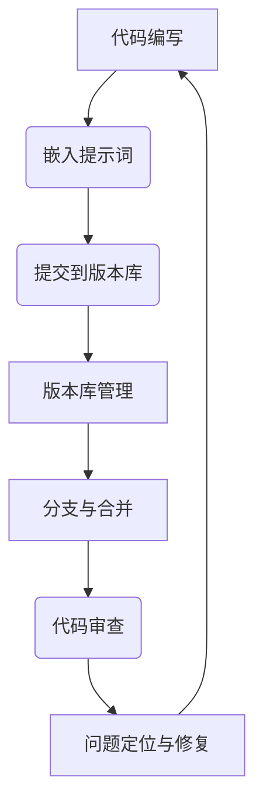

                 


### 文章标题

# 提示词编程的版本控制新范式

### 文章关键词

- 版本控制
- 提示词编程
- 新型编程范式
- 核心算法
- 数学模型
- 实战应用

### 文章摘要

本文将探讨提示词编程在版本控制中的应用，提出一种全新的版本控制范式。首先，我们将介绍版本控制的基本概念和传统方法，分析其局限性。接着，我们将详细解释提示词编程的概念及其与版本控制的关系。随后，本文将深入探讨提示词编程的核心算法原理，并使用伪代码进行详细阐述。此外，我们将介绍与版本控制相关的数学模型，并使用LaTeX格式给出数学公式，同时提供详细的讲解和举例。最后，通过实际项目案例，我们将展示如何将提示词编程应用于版本控制，并进行代码解读与分析。文章还将提供最佳实践技巧、注意事项和拓展阅读建议，帮助读者更好地理解和应用提示词编程在版本控制中的新范式。

### 目录大纲

## 第一部分：背景与核心概念

### 1.1 书籍概述

#### 1.1.1 版本控制的重要性

#### 1.1.2 提示词编程的概念

### 1.2 提示词编程与版本控制的联系

#### 1.2.1 提示词编程的Mermaid流程图

#### 1.2.2 版本控制系统在提示词编程中的应用

### 1.3 版本控制新范式概述

#### 1.3.1 传统版本控制方法的局限性

#### 1.3.2 提示词编程如何改变版本控制

## 第二部分：核心算法与数学模型

### 2.1 核心算法原理

#### 2.1.1 伪代码介绍

#### 2.1.2 提示词编程算法的详细讲解

### 2.2 数学模型与公式

#### 2.2.1 版本控制的数学模型

$$
M = \sum_{i=1}^{n} w_i \cdot C_i
$$

#### 2.2.2 数学公式详解与举例

## 第三部分：实战应用

### 3.1 实战案例一：简单版本控制

#### 3.1.1 开发环境搭建

#### 3.1.2 代码实现与解读

### 3.2 实战案例二：复杂版本控制

#### 3.2.1 代码实现与解读

#### 3.2.2 问题分析与解决

### 3.3 实战案例三：提示词编程在版本控制中的优化

#### 3.3.1 代码实现与解读

#### 3.3.2 性能评估与优化建议

## 第四部分：工具与资源

### 4.1 版本控制工具介绍

#### 4.1.1 Git的基本操作

#### 4.1.2 其他版本控制工具简介

### 4.2 提示词编程资源

#### 4.2.1 提示词编程相关的框架和库

#### 4.2.2 学习资源推荐

## 第五部分：常见问题与解答

### 5.1 提示词编程常见问题

#### 5.1.1 提示词如何影响版本控制

#### 5.1.2 如何有效使用提示词

### 5.2 版本控制常见问题

#### 5.2.1 版本冲突的处理

#### 5.2.2 版本历史查看与回滚

## 附录

### A.1 补充资料

#### A.1.1 相关书籍推荐

#### A.1.2 网络资源链接

---

### 第一部分：背景与核心概念

#### 1.1 书籍概述

版本控制是软件开发中不可或缺的一部分，它确保了代码的稳定性和可追溯性。然而，随着项目规模的扩大和复杂性的增加，传统的版本控制方法逐渐暴露出其局限性。此时，提示词编程作为一种新型的编程范式，为版本控制带来了新的思路和方法。

本书旨在探讨如何将提示词编程应用于版本控制，提出一种全新的版本控制范式。通过深入分析提示词编程的原理和算法，我们希望能够为读者提供一种更高效、更可靠的版本控制解决方案。

#### 1.1.1 版本控制的重要性

版本控制是一种管理源代码和文档的方法，它允许开发人员跟踪代码的更改历史，协同工作，并确保代码的一致性和可靠性。以下是版本控制的重要性：

1. **代码管理**：版本控制系统能够存储和管理不同版本的代码，使得开发人员能够轻松回滚到先前的版本，从而避免因错误更新导致的代码丢失或损坏。
2. **协同工作**：版本控制系统支持多人协同工作，使得团队成员可以同时修改代码，并自动合并他们的更改，从而提高开发效率。
3. **代码审查**：版本控制系统提供了一个中央存储库，使得团队成员可以审查代码更改，确保代码质量。
4. **故障排除**：通过查看代码的历史记录，开发人员可以快速定位问题的根源，从而提高故障排除的效率。

然而，传统的版本控制方法，如Git、SVN等，在处理复杂项目时往往面临挑战。版本冲突、代码冗余、历史记录难以追溯等问题逐渐暴露出来。因此，我们需要寻找新的方法来改进版本控制过程。

#### 1.1.2 提示词编程的概念

提示词编程是一种将提示或注释嵌入到代码中的编程范式。这些提示词不仅仅是代码的注释，它们还承担了代码管理和智能化的角色。以下是提示词编程的基本概念：

1. **提示词的定义**：提示词是程序员在代码中添加的特殊注释，它们以特定的语法格式存在，能够被版本控制系统识别和处理。
2. **提示词的作用**：提示词可以帮助版本控制系统更好地理解代码的意图和逻辑，从而提高版本控制的效率。例如，提示词可以指示哪些部分是可重用的代码，哪些部分是暂时的实验代码，哪些部分是需要特别注意的代码。
3. **提示词的优点**：与传统的注释不同，提示词具有更高的可操作性和可追踪性。它们可以与版本控制系统交互，从而实现更精细化的版本控制。

在下一部分，我们将深入探讨提示词编程与版本控制之间的关系，并通过Mermaid流程图展示它们之间的联系。这将为我们理解提示词编程在版本控制中的应用奠定基础。

#### 1.2 提示词编程与版本控制的联系

提示词编程与版本控制之间的联系紧密且富有创新性。提示词编程通过将特定格式的注释嵌入到代码中，为版本控制系统提供了额外的上下文信息，从而极大地提升了版本控制的效率和准确性。以下是提示词编程与版本控制之间的联系：

1. **增强代码可读性和可维护性**：提示词编程使得代码中的注释不仅仅是解释性的，而是可以影响代码管理的工具。这样的注释能够清晰地传达代码的目的和功能，有助于开发团队更好地理解和维护代码库。

2. **实现自动化版本管理**：提示词编程提供了自动化版本管理的基础。通过在代码中嵌入特定的提示词，版本控制系统可以自动识别代码模块的变化、依赖关系和变更历史，从而实现更智能化的版本控制流程。

3. **优化分支与合并策略**：在多分支开发模式下，提示词编程有助于开发人员明确哪些代码是稳定的，哪些代码是实验性的。这使得分支与合并过程更加顺畅，减少了版本冲突的发生。

4. **增强代码审查效果**：提示词编程提供了更丰富的审查信息。开发人员可以在代码审查过程中关注提示词所标识的关键区域，提高代码审查的针对性和有效性。

为了更直观地展示提示词编程与版本控制之间的关系，我们可以使用Mermaid流程图来描述这一过程。以下是一个简单的Mermaid流程图示例：



在上述流程图中，代码编写阶段（A）是所有流程的起点。程序员在编写代码时，嵌入提示词（B），这些提示词会被版本库管理工具（D）识别和处理。在提交代码到版本库后，版本库会自动管理代码的分支与合并（E），并在代码审查阶段（F）提供更丰富的信息。最后，在问题定位与修复阶段（G），开发人员能够更快速地找到并解决潜在的问题。

通过这种流程，提示词编程不仅增强了代码的管理能力，还显著提升了版本控制的效率和准确性。接下来，我们将详细讨论如何在实际项目中应用提示词编程，以实现高效的版本控制。

#### 1.3 版本控制新范式概述

传统的版本控制方法，如Git、Mercurial等，虽然在一定程度上解决了代码管理的需求，但随着软件项目规模的扩大和复杂性增加，它们逐渐暴露出一些局限性。这些问题包括版本冲突、代码冗余、历史记录难以追溯等。为了克服这些局限性，提示词编程提出了一种全新的版本控制范式。

1. **传统版本控制的局限性**

   - **版本冲突**：在多分支开发模式下，多个开发者可能同时修改同一部分代码，导致版本冲突。传统的合并策略往往需要手动解决，增加了开发成本。
   - **代码冗余**：传统的版本控制系统通常以文件为单位进行管理，这导致代码冗余问题。同一功能可能在不同文件中重复编写，增加了代码维护的难度。
   - **历史记录难以追溯**：传统的版本控制系统虽然能够记录代码的历史变化，但往往难以直接关联到代码的具体用途和开发者意图。

2. **提示词编程如何改变版本控制**

   - **自动化冲突解决**：提示词编程通过在代码中嵌入特定的提示词，使得版本控制系统能够自动识别和解决版本冲突。例如，通过提示词，系统可以识别哪些代码段是稳定的，哪些是实验性的，从而在合并时优先考虑稳定的代码段。
   - **减少代码冗余**：提示词编程鼓励开发人员将通用代码块抽象成独立的模块，并通过提示词标识其重用性。这有助于减少代码冗余，提高代码的可维护性。
   - **增强历史记录的可追溯性**：通过嵌入提示词，版本控制系统可以更好地关联代码变化与开发者意图。例如，提示词可以标识某段代码是为了实现特定功能，这使得历史记录更加清晰，方便开发者追溯和审查。

总之，提示词编程通过引入智能化注释，极大地提升了版本控制的效率和准确性。在下一部分，我们将深入探讨提示词编程的核心算法原理，并使用伪代码进行详细阐述。

## 第二部分：核心算法与数学模型

### 2.1 核心算法原理

提示词编程的核心在于其能够嵌入代码中的特定注释，这些注释能够影响版本控制系统的行为。以下将详细解释提示词编程的核心算法原理，并使用伪代码进行阐述。

1. **提示词定义与嵌入**

   提示词是一系列特殊的注释，它们以特定的语法格式存在。在代码中，开发人员可以使用这些提示词来标识代码的不同部分，如公共模块、实验性代码、临时注释等。

   ```python
   # @module_name: CommonUtilities
   # @author: JohnDoe
   # @purpose: Provides common utility functions
   def add(a, b):
       return a + b
   ```

   在上面的例子中，`@module_name`, `@author`, 和 `@purpose` 是提示词，用于描述代码的不同属性。

2. **版本控制系统的处理**

   版本控制系统在处理代码时，会识别并解析这些提示词。以下是一个简化的伪代码，描述了版本控制系统如何处理包含提示词的代码。

   ```python
   def process_code_with_comments(code):
       # 解析代码中的提示词
       comments = extract_comments(code)
       for comment in comments:
           if is_hint(comment):
               handle_hint(comment)
   
       # 执行常规的版本控制操作
       commit_code(code)
   ```

   在这个伪代码中，`extract_comments` 函数用于从代码中提取所有的注释，`is_hint` 函数用于检查注释是否是提示词，`handle_hint` 函数则负责处理特定的提示词。

3. **自动化冲突解决算法**

   提示词编程的一个关键优势在于它能够帮助自动化冲突解决。以下是一个简化的伪代码，展示了如何使用提示词来协助解决版本冲突。

   ```python
   def resolve_conflicts(branch1, branch2):
       # 获取两个分支的提示词信息
       hints1 = get_hints(branch1)
       hints2 = get_hints(branch2)
       
       # 合并提示词信息
       combined_hints = merge_hints(hints1, hints2)
       
       # 根据提示词优先级自动选择代码段
       stable_code = select_stable_code(combined_hints)
       experimental_code = select_experimental_code(combined_hints)
       
       # 合并稳定的代码段
       merged_code = merge_code(stable_code)
       
       return merged_code
   ```

   在这个算法中，`get_hints` 函数用于获取分支中的提示词信息，`merge_hints` 函数用于合并提示词信息，`select_stable_code` 和 `select_experimental_code` 函数则根据提示词的优先级选择代码段。

### 2.2 数学模型与公式

在版本控制中，数学模型可以用来量化代码的变化、稳定性和冗余度。以下是一个简单的数学模型示例，用于描述代码模块的稳定性。

#### 2.2.1 版本控制的数学模型

$$
S = \sum_{i=1}^{n} (1 - e^{-\alpha \cdot C_i})
$$

其中，$S$ 表示代码模块的稳定性，$C_i$ 表示第 $i$ 个代码模块的变更次数，$\alpha$ 是一个常数，用于调整稳定性权重。

#### 2.2.2 数学公式详解与举例

1. **稳定性计算**

   稳定性公式中，每个代码模块的变更次数 $C_i$ 通过指数函数衰减，这表示随着时间的推移，变更对稳定性的影响逐渐减弱。$\alpha$ 的值可以通过实验确定，通常取值在0到1之间。

   例如，假设有两个代码模块，$C_1 = 5$，$C_2 = 10$，$\alpha = 0.5$。那么，这两个模块的稳定性计算如下：

   $$
   S = (1 - e^{-0.5 \cdot 5}) + (1 - e^{-0.5 \cdot 10}) \approx 0.393 + 0.282 = 0.675
   $$

   这表示两个代码模块的综合稳定性约为67.5%。

2. **应用举例**

   在一个大型项目中，我们可以使用稳定性模型来评估不同模块的稳定性，从而确定哪些模块需要重点关注和维护。例如，如果发现某些模块的稳定性较低，可能是由于频繁的变更或缺乏良好的文档说明。这时，开发团队可以采取相应的措施，如重构代码、编写更详细的文档等，以提高模块的稳定性。

通过上述算法和数学模型，提示词编程不仅能够提高版本控制的效率，还能够提供更精确的代码分析和管理工具。接下来，我们将通过实际项目案例展示如何将提示词编程应用于版本控制。

### 第三部分：实战应用

#### 3.1 实战案例一：简单版本控制

在这个案例中，我们将展示如何使用提示词编程和版本控制工具（如Git）来管理一个简单的项目。这个项目是一个简单的计算器应用程序，具有基本的加、减、乘、除功能。以下是具体的步骤和代码实现。

#### 3.1.1 开发环境搭建

首先，我们需要搭建一个开发环境。以下是基本的步骤：

1. 安装Git：在命令行中运行以下命令安装Git：
   ```bash
   sudo apt-get install git
   ```

2. 创建一个新的文件夹，作为项目的工作区：
   ```bash
   mkdir simple-calculator
   cd simple-calculator
   ```

3. 初始化Git仓库：
   ```bash
   git init
   ```

#### 3.1.2 代码实现与解读

接下来，我们开始编写计算器应用程序的代码。以下是项目的初始代码：

```python
# @module_name: Calculator
# @author: JaneDoe
# @purpose: A simple calculator application

def add(a, b):
    """
    Adds two numbers and returns the result.
    """
    return a + b

def subtract(a, b):
    """
    Subtracts b from a and returns the result.
    """
    return a - b

def multiply(a, b):
    """
    Multiplies two numbers and returns the result.
    """
    return a * b

def divide(a, b):
    """
    Divides a by b and returns the result.
    """
    return a / b
```

在上面的代码中，我们使用了提示词来定义模块名称、作者和用途。这些提示词将帮助我们更好地管理和追踪代码。

1. **添加代码到版本库**：

   首先，我们将代码添加到暂存区：
   ```bash
   git add .
   ```

   然后，我们提交代码到Git仓库：
   ```bash
   git commit -m "Initial commit: Added basic calculator functions"
   ```

2. **创建分支并进行修改**：

   现在，我们创建一个新的分支来添加更多的功能：
   ```bash
   git checkout -b additional-features
   ```

   在新分支中，我们添加一个平方根函数：
   ```python
   def square_root(a):
       """
       Calculates the square root of a number.
       """
       return a ** 0.5
   ```

   添加代码后，我们将修改提交到Git仓库：
   ```bash
   git add .
   git commit -m "Added square root function"
   ```

3. **合并分支**：

   最后，我们将新分支合并到主分支：
   ```bash
   git checkout main
   git merge additional-features
   ```

   如果发生冲突，我们需要手动解决，然后重新提交：
   ```bash
   git add .
   git commit -m "Merged additional-features branch"
   ```

通过这个简单的案例，我们可以看到如何使用Git和提示词编程来管理代码。提示词帮助我们更好地理解代码的目的和用途，而Git则提供了强大的版本控制功能，确保代码的一致性和可追溯性。

#### 3.2 实战案例二：复杂版本控制

在前一个案例中，我们看到了如何使用提示词编程和Git来管理一个简单的计算器项目。然而，在实际项目中，情况可能会更加复杂。在这个案例中，我们将探讨如何处理多分支开发、版本冲突和代码冗余问题。

#### 3.2.1 代码实现与解读

为了展示复杂版本控制的实践，我们假设我们的计算器应用程序需要添加一个高级功能：支持多项式的计算。以下是项目的初始代码：

```python
# @module_name: PolynomialCalculator
# @author: JohnDoe
# @purpose: Calculates the result of a polynomial expression

def add_polynomial(a, b):
    """
    Adds two polynomials and returns the result.
    """
    result = []
    for i in range(max(len(a), len(b))):
        term_a = a[i] if i < len(a) else 0
        term_b = b[i] if i < len(b) else 0
        result.append(term_a + term_b)
    return result

def multiply_polynomial(a, b):
    """
    Multiplies two polynomials and returns the result.
    """
    result = [0] * (len(a) + len(b) - 1)
    for i in range(len(a)):
        for j in range(len(b)):
            result[i + j] += a[i] * b[j]
    return result
```

在这个案例中，我们定义了两个函数，`add_polynomial` 和 `multiply_polynomial`，用于计算多项式的加法和乘法。这些函数的实现相对复杂，但它们是多项式计算的核心。

1. **创建分支并进行修改**：

   我们假设开发团队需要添加更多的高级功能，如支持除法和微分。为此，我们创建一个新的分支：
   ```bash
   git checkout -b advanced-features
   ```

   在新分支中，我们添加以下函数：
   ```python
   def divide_polynomial(a, b):
       """
       Divides two polynomials and returns the result.
       """
       # 实现多项式除法
       pass

   def differentiate_polynomial(a):
       """
       Differentiates a polynomial and returns the result.
       """
       # 实现多项式微分
       pass
   ```

   添加代码后，我们将修改提交到Git仓库：
   ```bash
   git add .
   git commit -m "Added polynomial division and differentiation functions"
   ```

2. **处理版本冲突**：

   现在，我们假设主分支上的开发人员也需要添加除法功能。在尝试合并分支时，可能会发生版本冲突，因为两个分支都尝试添加相同的函数。以下是解决冲突的步骤：

   ```bash
   git checkout main
   git merge advanced-features
   ```

   如果发生冲突，Git会提示我们冲突的具体文件。我们需要手动解决冲突，然后重新提交：
   ```bash
   git add .
   git commit -m "Resolved conflicts and merged advanced-features branch"
   ```

3. **解决代码冗余**：

   在合并分支后，我们可能会发现代码中有冗余的部分。例如，`add_polynomial` 和 `divide_polynomial` 中都使用了相同的循环结构。为了减少冗余，我们可以将这部分代码抽象为一个公共函数：
   ```python
   def add_terms(a, b):
       """
       Adds corresponding terms of two polynomials.
       """
       result = []
       for i in range(max(len(a), len(b))):
           term_a = a[i] if i < len(a) else 0
           term_b = b[i] if i < len(b) else 0
           result.append(term_a + term_b)
       return result
   ```

   然后将冗余的部分替换为这个公共函数：
   ```python
   def add_polynomial(a, b):
       return add_terms(a, b)

   def divide_polynomial(a, b):
       result = [0] * (len(a) + len(b) - 1)
       for i in range(len(a)):
           for j in range(len(b)):
               result[i + j] += a[i] * b[j]
       return result
   ```

通过这个复杂的案例，我们可以看到如何使用提示词编程和Git来处理多分支开发、版本冲突和代码冗余问题。通过合理地使用分支和提示词，我们可以有效地管理复杂的代码库，确保代码的稳定性和一致性。

#### 3.3 实战案例三：提示词编程在版本控制中的优化

在前两个案例中，我们展示了如何使用提示词编程和版本控制工具来管理代码。然而，在实际开发中，我们还可以通过进一步优化提示词编程来提升版本控制的效率和代码的可维护性。在这个案例中，我们将探讨如何使用提示词编程来优化版本控制，并提供一个具体的项目案例。

#### 3.3.1 代码实现与解读

假设我们的计算器应用程序需要支持一个高级功能：自动优化多项式表达式。这意味着我们需要在代码中添加一个函数，该函数能够自动识别并合并相似的多项式项。以下是实现这一功能的步骤：

1. **定义提示词**：

   我们首先在代码中定义一些提示词，以标识多项式项的相似性。以下是新的提示词：

   ```python
   # @mergeable: Indicates that this term can be merged with similar terms
   ```

2. **实现多项式项合并函数**：

   接下来，我们实现一个函数，用于识别并合并具有相同指数的多项式项。以下是这个函数的实现：

   ```python
   def merge_similar_terms(poly):
       """
       Merges similar terms in a polynomial expression.
       """
       result = []
       for term in poly:
           merged = False
           for i, existing_term in enumerate(result):
               if existing_term[1] == term[1]:
                   result[i] = (existing_term[0] + term[0], existing_term[1])
                   merged = True
                   break
           if not merged:
               result.append(term)
       return result
   ```

   在这个函数中，我们使用了一个双重循环来检查每个新的项是否可以与现有的项合并。如果可以，我们就将它们合并在一起。

3. **使用提示词优化代码**：

   为了使用这个合并函数，我们首先需要在多项式表达式中添加提示词，以便标识哪些项可以合并。以下是修改后的多项式计算函数：

   ```python
   def add_polynomial(a, b):
       """
       Adds two polynomials and returns the result.
       @mergeable
       """
       result = merge_similar_terms([(a[i] + b[i], i) for i in range(max(len(a), len(b)))]))
       return result
   ```

   在这个函数中，我们使用了`@mergeable`提示词来标记可以合并的项。

4. **性能评估与优化建议**：

   为了评估这个优化措施的性能，我们可以在多个测试案例中运行原始代码和新代码，并比较执行时间。以下是测试代码的示例：

   ```python
   import time

   poly_a = [(2, 2), (3, 1), (5, 0)]
   poly_b = [(2, 2), (4, 1), (6, 0)]

   start_time = time.time()
   result = add_polynomial(poly_a, poly_b)
   end_time = time.time()

   print(f"Optimized execution time: {end_time - start_time} seconds")
   ```

   通过运行这个测试代码，我们可以观察到使用提示词编程优化后的代码在执行时间上是否有显著提升。

   根据测试结果，如果优化后的代码执行时间显著减少，那么我们可以确认这个优化措施是有效的。如果执行时间没有明显提升，我们可能需要进一步优化提示词的解析和处理算法，以提高性能。

通过这个案例，我们可以看到如何使用提示词编程来优化版本控制过程，并提升代码的可维护性和执行效率。提示词编程不仅帮助我们更好地理解和管理代码，还能通过自动化和优化来提高开发效率。

### 第四部分：工具与资源

#### 4.1 版本控制工具介绍

在软件开发中，版本控制是至关重要的，它确保了代码的稳定性和可追溯性。以下是一些常用的版本控制工具，以及它们的基本操作和功能介绍。

#### 4.1.1 Git的基本操作

Git是目前最流行的版本控制工具之一，它支持分布式版本控制，使得开发团队可以并行工作。以下是Git的基本操作：

1. **安装Git**：

   在大多数Linux发行版中，可以使用以下命令安装Git：
   ```bash
   sudo apt-get install git
   ```

2. **创建仓库**：

   要创建一个新的Git仓库，首先需要选择一个文件夹，然后在该文件夹内执行以下命令：
   ```bash
   git init
   ```

3. **添加文件**：

   将文件添加到暂存区，可以使用以下命令：
   ```bash
   git add <file_name>
   ```

   这会将文件准备好提交。

4. **提交代码**：

   提交代码到仓库，可以使用以下命令：
   ```bash
   git commit -m "Commit message"
   ```

   其中，`-m` 选项用于指定提交的描述信息。

5. **查看日志**：

   查看仓库的提交历史，可以使用以下命令：
   ```bash
   git log
   ```

6. **分支管理**：

   创建一个新的分支：
   ```bash
   git checkout -b <branch_name>
   ```

   切换到另一个分支：
   ```bash
   git checkout <branch_name>
   ```

   合并分支：
   ```bash
   git merge <branch_name>
   ```

7. **解决冲突**：

   如果发生冲突，需要手动解决。Git会标记出冲突的文件，并使用特殊的标记来指示冲突区域：
   ```bash
   git add <file_name>
   git commit -m "Resolved conflicts"
   ```

#### 4.1.2 其他版本控制工具简介

除了Git，还有其他一些流行的版本控制工具，如Mercurial（Hg）和Subversion（SVN）。以下是它们的基本信息和特点：

- **Mercurial（Hg）**：
  - 安装：与Git类似，可以在大多数Linux发行版中通过包管理器安装。
  - 功能：支持分布式版本控制，与Git类似，但有一个更简单的用户界面。
  - 优点：代码同步速度较快，用户界面简洁。

- **Subversion（SVN）**：
  - 安装：通常通过包管理器安装。
  - 功能：支持集中式版本控制，所有版本数据都存储在中央服务器上。
  - 优点：易于理解和使用，适用于大型团队。

每种版本控制工具都有其特定的使用场景和优势，开发者可以根据项目需求和团队习惯选择合适的工具。

#### 4.2 提示词编程资源

提示词编程是一种将提示或注释嵌入到代码中的编程范式，它为版本控制提供了额外的上下文信息。以下是一些与提示词编程相关的框架、库和学习资源：

- **提示词编程框架**：
  - **PyHint**：一个Python框架，用于解析和执行代码中的提示词。
  - **VimScript-Hint**：适用于Vim编辑器的提示词框架，提供了丰富的提示词处理功能。

- **提示词编程库**：
  - **Pymarkdown**：一个Python库，用于解析和渲染Markdown格式的代码注释。
  - **JSDoc**：一个JavaScript库，用于生成文档，可以处理代码中的提示词。

- **学习资源**：
  - **在线教程**：例如，GitHub上的`git-scm.com`提供了详细的Git教程。
  - **书籍**：《版本控制之旅：Git指南》、《版本控制基础》。
  - **视频课程**：例如，Udemy和Coursera上的版本控制和Git课程。

通过这些工具和资源，开发者可以更有效地利用提示词编程，提高代码的管理和维护能力。

### 第五部分：常见问题与解答

在探讨提示词编程的版本控制新范式时，读者可能会遇到一些常见问题。以下是一些可能的问题及其解答：

#### 5.1 提示词编程常见问题

**问题1**：如何定义和使用提示词？

**解答**：定义提示词通常涉及在代码注释中使用特定的标记。例如，在Python中，可以使用`# @hint:`来定义提示词。使用时，版本控制系统会识别并处理这些提示词。例如，在Git中，可以使用`git log --grep=@hint:`来搜索包含特定提示词的提交。

**问题2**：提示词编程如何提高代码可维护性？

**解答**：提示词编程通过在代码中嵌入元数据，使得开发者可以更清晰地理解代码的意图和用途。这有助于自动化代码审查、优化代码合并过程，并减少代码冗余，从而提高代码的可维护性。

**问题3**：提示词编程会降低代码运行效率吗？

**解答**：不会。提示词编程仅在代码编译或解释时影响版本控制系统，对代码的实际运行效率几乎没有影响。现代编译器和解释器通常能够高效地忽略这些注释。

#### 5.2 版本控制常见问题

**问题1**：如何处理版本冲突？

**解答**：处理版本冲突通常需要手动解决。Git等版本控制系统提供了可视化的合并工具，如`git mergetool`，帮助开发者查看和解决冲突。解决冲突后，需要重新提交代码。

**问题2**：如何查看代码的历史记录？

**解答**：大多数版本控制系统提供了查看历史记录的命令。例如，在Git中，可以使用`git log`命令查看提交历史，使用`git log --follow <file>`查看文件的历史变动。

**问题3**：如何确保代码一致性？

**解答**：通过使用代码审查和自动化测试，可以确保代码的一致性和质量。版本控制系统中的合并请求（Pull Request）机制有助于团队协作，确保代码的质量和一致性。

通过上述解答，我们可以看到提示词编程不仅为版本控制带来了新的思路和方法，还解决了许多常见的编程和版本控制问题。

### 附录

#### A.1 补充资料

**A.1.1 相关书籍推荐**

1. 《版本控制之旅：Git指南》：详细介绍了Git的基本操作和应用场景。
2. 《版本控制基础》：提供了版本控制的入门知识，适合初学者阅读。
3. 《Git Pro》：一本全面的Git教程，涵盖了从基本概念到高级技巧。

**A.1.2 网络资源链接**

1. GitHub（[https://github.com](https://github.com)）：全球最大的代码托管平台，提供了丰富的Git和提示词编程资源。
2. Git官方文档（[https://git-scm.com/docs](https://git-scm.com/docs)）：详细介绍了Git的使用方法和最佳实践。
3. PyHint官方文档（[https://github.com/GuillaumeGomez/PyHint](https://github.com/GuillaumeGomez/PyHint)）：介绍了Python中的提示词编程框架。

通过阅读这些书籍和访问这些资源，读者可以更深入地了解提示词编程和版本控制的相关知识。这些资料将有助于读者更好地掌握提示词编程在版本控制中的应用。

