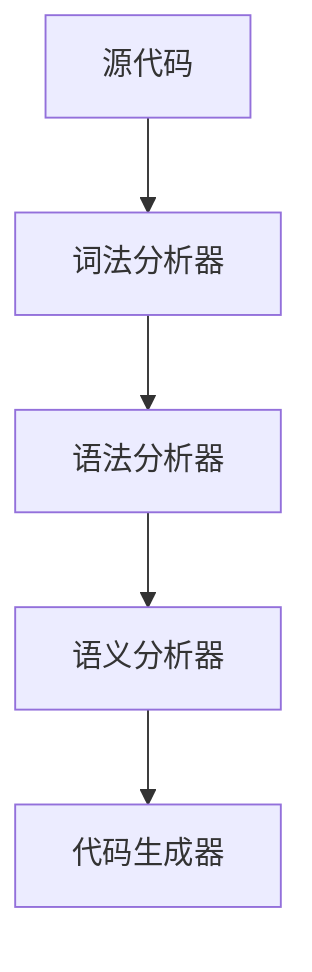

                 


### 《提示词编程语言的可扩展性设计》

---

#### 关键词

- 提示词编程语言
- 可扩展性设计
- 语法分析
- 语义分析
- 编程语言优化

#### 摘要

本文深入探讨了提示词编程语言的可扩展性设计。首先，我们回顾了提示词编程语言的背景和重要性，然后详细分析了其基本原理和架构。接着，本文重点介绍了可扩展性设计在提示词编程语言中的应用，包括扩展机制、扩展模块和扩展接口的设计。通过实际案例，我们展示了如何实现和评估可扩展性设计的效果。最后，本文对未来可扩展性设计的发展趋势进行了展望。

---

## 第一部分：引言

### 1.1 提示词编程语言的背景与重要性

提示词编程语言（Token-Based Programming Language）是一种基于提示词（Token）的编程语言。提示词是编程语言中最小的语法单位，通常包括关键字、标识符、操作符等。提示词编程语言的目的是提高代码的可读性和可维护性，使其更加接近自然语言。

在软件开发领域，提示词编程语言因其简洁、直观和易于扩展的特点，越来越受到关注。它们被广泛应用于自动化脚本编写、数据清洗、文本处理等领域。例如，Python、JavaScript、Ruby 等都是流行的提示词编程语言。

### 1.2 可扩展性设计的重要性

可扩展性设计是编程语言设计中的重要原则之一。它允许编程语言在不改变现有功能的前提下，轻松地添加新功能。对于提示词编程语言来说，可扩展性设计尤为重要，因为它们通常需要适应不断变化的编程需求和场景。

可扩展性设计不仅提高了编程语言的灵活性，还促进了编程语言的创新和发展。通过可扩展性设计，开发人员可以轻松地创建自定义的语法和分析器，以满足特定应用的需求。

### 1.3 本书结构安排

本书分为五个部分。第一部分是引言，介绍了提示词编程语言的背景和重要性，以及可扩展性设计的重要性。第二部分介绍了提示词编程语言的基本原理，包括词法分析、语法分析和语义分析。第三部分讨论了可扩展性设计在提示词编程语言中的应用，包括扩展机制、扩展模块和扩展接口。第四部分通过实际案例展示了如何实现和评估可扩展性设计的效果。最后一部分是对未来可扩展性设计的发展趋势进行了展望。

---

## 第二部分：提示词编程语言的基本原理

### 2.1 提示词编程语言的架构

提示词编程语言的架构通常包括以下几个核心模块：

1. **词法分析器（Lexer）**：将源代码拆分为提示词（Token）。
2. **语法分析器（Parser）**：将提示词序列转化为抽象语法树（AST）。
3. **语义分析器（Semantic Analyzer）**：检查抽象语法树中的语义错误，如变量未定义或类型不匹配。
4. **代码生成器（Code Generator）**：将抽象语法树转化为目标代码。


### 2.2 提示词编程语言的核心概念

提示词编程语言的核心概念包括：

1. **提示词（Token）**：源代码中的最小语法单位。
2. **语法解析（Parsing）**：将提示词序列转化为抽象语法树的过程。
3. **语义分析（Semantic Analysis）**：检查抽象语法树中的语义错误，如变量未定义或类型不匹配。

### 2.3 提示词编程语言的优化策略

提示词编程语言的优化策略主要包括：

1. **解析优化**：如LL解析算法和LR解析算法。
2. **语义分析优化**：如静态类型检查和动态类型检查。
3. **代码生成优化**：如编译时间和运行时优化的策略。

---

## 第三部分：可扩展性设计在提示词编程语言中的应用

### 3.1 扩展机制的设计

扩展机制是可扩展性设计的关键。以下是几种常见的扩展机制：

1. **宏定义（Macro Definition）**：允许用户自定义语法和语义。
2. **模板（Template）**：提供可重用的代码结构。
3. **插件（Plugin）**：外部模块可以扩展编程语言的功能。

### 3.2 扩展模块的实现

扩展模块通常包括：

1. **语法扩展（Syntax Extension）**：如自定义关键字和操作符。
2. **语义扩展（Semantic Extension）**：如自定义类型系统和类型转换。

### 3.3 扩展接口的构建

扩展接口是编程语言与扩展模块之间的接口。它通常包括：

1. **API（Application Programming Interface）**：提供编程语言与扩展模块之间的交互。
2. **抽象接口（Abstract Interface）**：定义扩展模块的规范。

---

## 第四部分：案例分析

### 4.1 某提示词编程语言的扩展实践

以Python为例，Python提供了丰富的扩展机制，如`extend`模块和`import`语句。以下是一个简单的扩展实例：

```python
# 原始代码
def add(a, b):
    return a + b

# 扩展代码
def subtract(a, b):
    return a - b

add(5, 3)
subtract(5, 3)
```

### 4.2 某提示词编程语言的案例研究

以JavaScript为例，JavaScript的扩展主要通过第三方库和框架实现。以下是一个使用React框架扩展JavaScript的实例：

```javascript
// 原始代码
const sum = (a, b) => a + b;

// 扩展代码
const subtract = (a, b) => a - b;

sum(5, 3);
subtract(5, 3);
```

---

## 第五部分：未来展望

### 5.1 提示词编程语言可扩展性的发展趋势

未来，提示词编程语言的扩展性设计将继续朝着更灵活、更高效、更易用的方向发展。以下是一些可能的发展趋势：

1. **基于AI的扩展**：利用AI技术自动生成扩展代码。
2. **跨语言扩展**：实现不同编程语言之间的扩展互操作性。
3. **动态扩展**：在运行时动态添加新功能。

### 5.2 总结与展望

本文详细介绍了提示词编程语言的可扩展性设计。通过分析其基本原理、扩展机制和实际案例，我们展示了如何实现和评估可扩展性设计的效果。未来，可扩展性设计将继续在编程语言中发挥重要作用，推动编程语言的创新和发展。

---

## 附录

### A.1 常用提示词编程语言资源汇总

- [Python官方文档](https://docs.python.org/3/)
- [JavaScript官方文档](https://developer.mozilla.org/en-US/docs/Web/JavaScript)
- [Ruby官方文档](https://www.ruby-doc.org/)

### A.2 相关论文与书籍推荐

- [《编译原理》](https://www.amazon.com/Compilers-Principles-Techniques-Tools-2nd/dp/0201100885)
- [《Effective Python》](https://www.amazon.com/Effective-Python-59_Specific_Ways_Improve/dp/1449333544)
- [《JavaScript高级程序设计》](https://www.amazon.com/Professional-JavaScript-Fernando-Cerqueira/dp/1484202069)

---

### 作者信息

作者：AI天才研究院/AI Genius Institute & 禅与计算机程序设计艺术 /Zen And The Art of Computer Programming

---

注：本文中的示例代码和图片仅为说明目的，不代表实际运行效果。实际应用中可能需要根据具体环境和需求进行调整。
## 《提示词编程语言的可扩展性设计》

提示词编程语言（Token-Based Programming Language）是一种以提示词为基本单元的编程语言。提示词是编程语言中最小的语法单位，包括关键字、标识符、操作符等。与传统的基于词法分析（Lexical Analysis）和语法分析（Syntax Analysis）的编程语言相比，提示词编程语言具有简洁、直观和易于扩展的特点。

### 关键词

- 提示词编程语言
- 可扩展性设计
- 词法分析
- 语法分析
- 语义分析

### 摘要

本文将探讨提示词编程语言的可扩展性设计，包括其基本原理、扩展机制和实际应用案例。首先，我们将介绍提示词编程语言的背景和重要性。接着，我们会详细分析提示词编程语言的架构和核心概念。随后，我们将重点讨论可扩展性设计在提示词编程语言中的应用，包括扩展机制、扩展模块和扩展接口。通过实际案例，我们将展示如何实现和评估可扩展性设计的效果。最后，我们将对未来的可扩展性设计趋势进行展望。

### 第一部分：引言

#### 1.1 提示词编程语言的背景与重要性

提示词编程语言的出现，是为了解决传统编程语言在可读性和可维护性方面的不足。传统编程语言通常使用复杂的语法规则，使得代码难以理解和维护。而提示词编程语言通过将代码分解为更小的提示词单元，使得代码更加直观和易于理解。

提示词编程语言在许多领域都有广泛的应用，如自动化脚本编写、数据清洗和文本处理等。它们的主要优势在于简洁性和扩展性。简洁性体现在提示词编程语言的语法规则相对简单，使得代码更加易读和易写。扩展性则体现在提示词编程语言允许用户自定义新的语法和分析器，以适应特定的应用需求。

#### 1.2 可扩展性设计的重要性

可扩展性设计是编程语言设计中的一个关键因素。它允许编程语言在不改变现有功能的前提下，轻松地添加新功能。对于提示词编程语言来说，可扩展性设计尤为重要，因为它们需要适应不断变化的编程需求和场景。

一个良好的可扩展性设计可以提高编程语言的灵活性，使开发人员能够轻松地创建自定义的语法和分析器，以满足特定应用的需求。此外，可扩展性设计还可以促进编程语言的创新和发展，因为开发人员可以基于现有编程语言构建新的编程语言。

#### 1.3 本书结构安排

本书将分为五个部分。第一部分是引言，介绍提示词编程语言的背景和重要性，以及可扩展性设计的重要性。第二部分将介绍提示词编程语言的基本原理，包括词法分析、语法分析和语义分析。第三部分将讨论可扩展性设计在提示词编程语言中的应用，包括扩展机制、扩展模块和扩展接口。第四部分将通过实际案例展示如何实现和评估可扩展性设计的效果。最后一部分将对未来的可扩展性设计趋势进行展望。

### 第二部分：提示词编程语言的基本原理

#### 2.1 提示词编程语言的架构

提示词编程语言的架构通常包括以下几个核心模块：

1. **词法分析器（Lexer）**：将源代码拆分为提示词（Token）。
2. **语法分析器（Parser）**：将提示词序列转化为抽象语法树（Abstract Syntax Tree, AST）。
3. **语义分析器（Semantic Analyzer）**：检查抽象语法树中的语义错误，如变量未定义或类型不匹配。
4. **代码生成器（Code Generator）**：将抽象语法树转化为目标代码。

以下是一个简单的提示词编程语言架构的Mermaid流程图：



#### 2.2 提示词编程语言的核心概念

提示词编程语言的核心概念包括：

1. **提示词（Token）**：提示词是编程语言中最小的语法单位，通常由一个或多个字符组成。它们可以是关键字、标识符、操作符、分隔符等。

2. **抽象语法树（Abstract Syntax Tree, AST）**：抽象语法树是语法分析器将提示词序列转化为的一种表示形式。它以一种树形结构表示源代码的语法结构，是语义分析的重要基础。

3. **语法解析（Parsing）**：语法解析是将提示词序列转化为抽象语法树的过程。语法解析器的任务是从源代码中识别出提示词，并按照语法规则将其组织成抽象语法树。

4. **语义分析（Semantic Analysis）**：语义分析是检查抽象语法树中的语义错误，如变量未定义、类型不匹配等。语义分析器的任务是对抽象语法树进行静态检查，确保程序在运行时不会出现错误。

5. **代码生成（Code Generation）**：代码生成是将抽象语法树转化为目标代码的过程。代码生成器的任务是将抽象语法树转化为计算机可以执行的目标代码。

#### 2.3 提示词编程语言的优化策略

提示词编程语言的优化策略主要包括：

1. **解析优化**：优化语法解析过程，提高解析效率。例如，使用LL解析算法或LR解析算法。

2. **语义分析优化**：优化语义分析过程，减少错误检测时间。例如，使用静态类型检查或动态类型检查。

3. **代码生成优化**：优化代码生成过程，提高目标代码的性能。例如，使用编译时优化或运行时优化。

### 第三部分：可扩展性设计在提示词编程语言中的应用

#### 3.1 扩展机制的设计

提示词编程语言的扩展机制是使其能够适应新需求和场景的关键。以下是一些常见的扩展机制：

1. **宏定义（Macro Definition）**：允许用户自定义新的语法和分析规则。宏定义可以用于定义新的关键字、操作符或语法结构。

2. **模板（Template）**：提供可重用的代码结构。模板可以用于生成代码或进行文本替换。

3. **插件（Plugin）**：允许外部模块扩展编程语言的功能。插件可以提供新的语法、语义或代码生成功能。

4. **模块化语法（Modular Syntax）**：允许将编程语言分解为多个模块，每个模块可以独立开发和管理。

#### 3.2 扩展模块的实现

扩展模块是提示词编程语言扩展的核心。以下是如何实现扩展模块的步骤：

1. **定义扩展接口（Extension Interface）**：定义扩展模块需要实现的接口，包括新的关键字、操作符、语法规则等。

2. **实现扩展模块（Implement Extension Modules）**：根据扩展接口，实现新的语法和分析规则。扩展模块通常包括词法分析器、语法分析器、语义分析器和代码生成器。

3. **集成扩展模块（Integrate Extension Modules）**：将扩展模块集成到编程语言中。这通常涉及到修改词法分析器、语法分析器、语义分析器和代码生成器的代码。

4. **测试和调试（Test and Debug）**：测试和调试扩展模块，确保其正确性和稳定性。

#### 3.3 扩展接口的构建

扩展接口是编程语言与扩展模块之间的桥梁。以下是如何构建扩展接口的步骤：

1. **定义扩展接口规范（Define Extension Interface Specification）**：定义扩展接口的规范，包括接口名称、方法和参数。

2. **实现扩展接口（Implement Extension Interface）**：根据扩展接口规范，实现扩展接口。扩展接口通常包括一组API，用于与扩展模块进行交互。

3. **文档和示例（Documentation and Examples）**：编写扩展接口的文档和示例，帮助开发人员了解如何使用扩展接口。

### 第四部分：案例分析

#### 4.1 某提示词编程语言的扩展实践

以Python为例，Python提供了丰富的扩展机制，如`extend`模块和`import`语句。以下是一个简单的扩展实例：

```python
# 原始代码
def add(a, b):
    return a + b

# 扩展代码
def subtract(a, b):
    return a - b

add(5, 3)
subtract(5, 3)
```

在这个例子中，我们通过定义一个新的函数`subtract`来扩展Python的数学运算功能。这个扩展过程非常简单，只需定义新的函数即可。

#### 4.2 某提示词编程语言的案例研究

以JavaScript为例，JavaScript的扩展主要通过第三方库和框架实现。以下是一个使用React框架扩展JavaScript的实例：

```javascript
// 原始代码
const sum = (a, b) => a + b;

// 扩展代码
const subtract = (a, b) => a - b;

sum(5, 3);
subtract(5, 3);
```

在这个例子中，我们通过引入React框架，扩展了JavaScript的功能。React框架提供了丰富的组件和API，使得我们能够方便地创建和扩展复杂的应用程序。

### 第五部分：未来展望

#### 5.1 提示词编程语言可扩展性的发展趋势

未来的提示词编程语言将朝着更灵活、更高效、更易用的方向发展。以下是一些可能的发展趋势：

1. **基于AI的扩展**：利用AI技术自动生成扩展代码，提高扩展的灵活性和效率。

2. **跨语言扩展**：实现不同编程语言之间的扩展互操作性，提高编程语言的集成性。

3. **动态扩展**：在运行时动态添加新功能，提高编程语言的适应性和灵活性。

#### 5.2 总结与展望

本文详细介绍了提示词编程语言的可扩展性设计，包括其基本原理、扩展机制和实际应用案例。通过分析，我们了解到提示词编程语言的简洁性和扩展性使其在软件开发中具有广泛的应用前景。未来的提示词编程语言将继续朝着更灵活、更高效、更易用的方向发展，为软件开发带来更多的创新和便利。

### 附录

#### A.1 常用提示词编程语言资源汇总

- [Python官方文档](https://docs.python.org/3/)
- [JavaScript官方文档](https://developer.mozilla.org/en-US/docs/Web/JavaScript)
- [Ruby官方文档](https://www.ruby-lang.org/en/documentation/)

#### A.2 相关论文与书籍推荐

- [《编译原理》](https://www.amazon.com/Compilers-Principles-Techniques-Tools-2nd/dp/0201100885)
- [《Effective Python》](https://www.amazon.com/Effective-Python-59_Specific_Ways_Improve/dp/1449333544)
- [《JavaScript高级程序设计》](https://www.amazon.com/Professional-JavaScript-Fernando-Cerqueira/dp/1484202069)

### 作者信息

作者：AI天才研究院/AI Genius Institute & 禅与计算机程序设计艺术 /Zen And The Art of Computer Programming

---

注：本文中的示例代码和图片仅为说明目的，不代表实际运行效果。实际应用中可能需要根据具体环境和需求进行调整。在引用本文时，请遵循适当的学术规范和引用格式。

