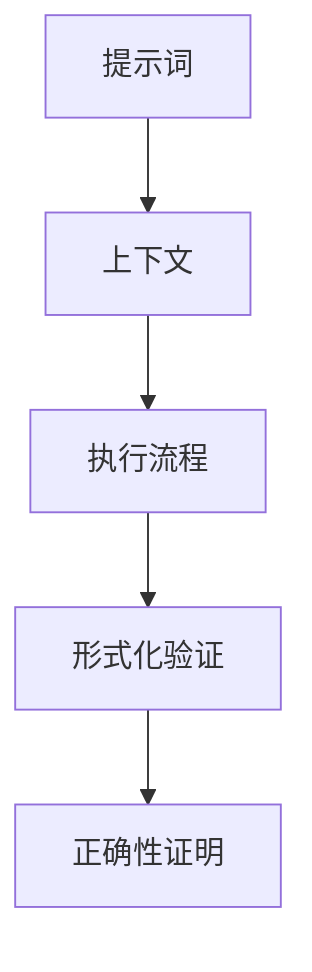
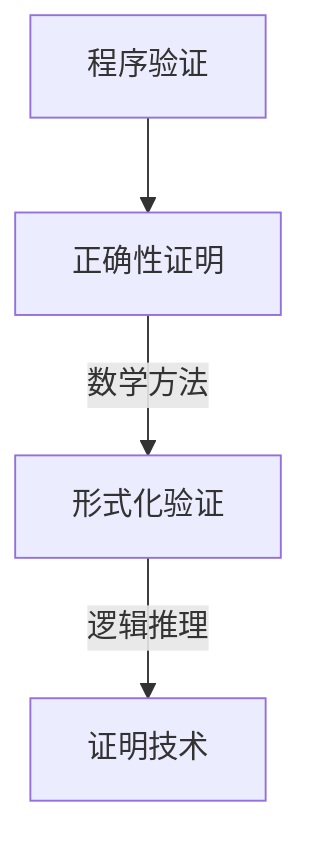
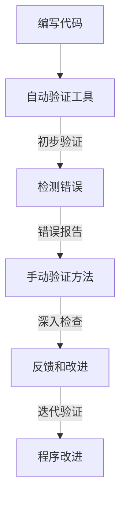

                 


### 文章标题

提示词语言的程序验证与正确性证明

### 文章关键词

提示词语言，程序验证，正确性证明，形式化验证方法，数学证明方法

### 摘要

本文旨在深入探讨提示词语言的程序验证与正确性证明，通过对提示词语言的概念、理论基础、工具方法以及实际应用的分析，揭示其在现代编程中的重要性。文章首先介绍了提示词语言的基本概念和特点，接着详细阐述了程序验证与正确性证明的核心原理，并探讨了相关的工具和方法。最后，通过实际案例，展示了如何在实际项目中应用这些工具和方法，实现了程序的正确性验证。

## 引言

在计算机科学和软件工程领域，正确性是衡量一个程序优劣的重要指标。随着软件系统规模的不断扩大和复杂度的不断增加，如何确保程序的正确性成为了一个严峻的挑战。传统的测试方法虽然在某种程度上能够发现程序中的错误，但其覆盖面有限，且难以保证程序在所有情况下都能正确运行。因此，程序验证和正确性证明逐渐成为了确保程序正确性的有效手段。

提示词语言作为一种重要的编程语言，在自然语言处理、人工智能等领域有着广泛的应用。然而，提示词语言由于其自身的特点，使得程序验证和正确性证明变得更加复杂和具有挑战性。本文将围绕提示词语言的程序验证与正确性证明进行深入探讨，旨在为研究人员和开发者提供一种有效的解决方案。

本文的结构如下：首先，我们将介绍提示词语言的基本概念和特点，包括其语法结构、类型和应用场景。接着，我们将详细阐述程序验证和正确性证明的基本原理，包括形式化验证方法和数学证明方法。然后，我们将介绍用于程序验证和正确性证明的工具和方法，包括自动验证工具和手动验证方法。接下来，我们将通过实际案例，展示如何在实际项目中应用这些工具和方法，实现程序的正确性验证。最后，我们将对全文进行总结，并展望提示词语言、程序验证和正确性证明的未来发展趋势。

### 提示词语言的基本概念与特点

提示词语言（Prompt Language）是指一类专门用于生成或处理提示词（Prompt）的编程语言。提示词是一种特殊的文本或符号序列，用于引导用户或系统执行特定任务。在自然语言处理（NLP）、对话系统、自动化脚本编写等领域，提示词语言发挥着重要作用。

#### 语法结构

提示词语言的语法结构通常较为灵活，以适应不同的应用场景。一个典型的提示词语言包含以下基本语法元素：

1. **变量**：用于存储数据和值。
2. **控制结构**：如循环、条件语句等，用于控制程序的执行流程。
3. **函数和库**：提供预定义的函数和库，以便快速实现复杂功能。
4. **特殊符号**：如括号、逗号、冒号等，用于分隔不同元素或表示特定操作。

以下是一个简单的提示词语言示例：

```
# 定义变量
$greeting = "Hello"
$person = "World"

# 打印问候语
-print "$greeting, $person!"

# 循环打印数字
-for $i in range(1, 5):
    -print "$i"
```

#### 类型

根据应用场景和需求，提示词语言可以分为以下几种类型：

1. **命令式提示词语言**：这类语言通过命令式编程风格，明确指示系统执行一系列操作。如Python的`turtle`库，用于绘制图形。

2. **声明式提示词语言**：这类语言通过声明式编程风格，描述系统需要达到的目标，由系统自动推导出执行步骤。如Prolog，用于推理和问题求解。

3. **函数式提示词语言**：这类语言强调函数和表达式的使用，通过纯函数式编程实现提示词生成。如Haskell，用于复杂逻辑和数学计算。

4. **可视化提示词语言**：这类语言通过图形界面，让用户以直观的方式定义和操作提示词。如Blockly，用于教育编程和互动式学习。

#### 应用场景

提示词语言在多个领域有着广泛的应用，以下是一些典型应用场景：

1. **自然语言处理**：提示词语言用于生成和解析自然语言文本，如自动问答系统、机器翻译等。

2. **对话系统**：提示词语言用于构建对话系统，如聊天机器人、语音助手等。

3. **自动化脚本编写**：提示词语言用于自动化常见任务，如数据抓取、报告生成等。

4. **教育编程**：提示词语言用于教学和编程入门，如可视化编程工具和交互式学习平台。

#### 核心概念与联系

为了更好地理解提示词语言的程序验证与正确性证明，我们需要关注以下几个核心概念及其相互关系：

1. **提示词**：提示词是提示词语言的核心元素，用于引导用户或系统执行特定任务。

2. **上下文**：上下文是指提示词语言执行时的环境信息，包括变量、函数等。

3. **执行流程**：执行流程是指程序按照提示词语言的语法和语义，逐步执行操作的过程。

4. **形式化验证**：形式化验证是指使用数学方法验证程序的正确性，确保程序在所有情况下都能正确执行。

5. **正确性证明**：正确性证明是指使用逻辑推理方法，证明程序在特定条件下能够满足预期结果。

以下是这些概念之间的Mermaid流程图：



通过上述流程图，我们可以清晰地看到提示词语言从生成到验证的整个过程。提示词作为输入，经过上下文和环境信息的处理，形成执行流程。执行流程通过形式化验证和正确性证明，确保程序的正确性和可靠性。

### 程序验证的基本概念

程序验证是指使用一系列技术和方法，确保程序的正确性和可靠性。在软件工程和计算机科学领域，程序验证是确保软件质量和安全性的关键步骤。本文将详细介绍程序验证的基本概念，包括其定义、分类以及挑战和解决方案。

#### 定义

程序验证（Program Verification）是一种静态或动态分析技术，用于检查程序是否符合预定的规格说明或属性。验证的目标是确保程序在所有可能的情况下都能正确执行，从而避免潜在的错误和漏洞。

程序验证的核心问题是判断程序是否满足特定属性，这些属性可以是功能性的，如程序是否实现了预期的功能；也可以是非功能性的，如程序的效率、安全性等。程序验证的核心目标是通过形式化的方法，证明程序在所有情况下都能满足其规格说明。

#### 分类

程序验证可以分为以下几类：

1. **静态验证**：静态验证是指在程序执行之前，通过分析程序代码或抽象模型，验证程序的正确性。静态验证的优点是不需要执行程序，可以在早期发现潜在的错误。常见的静态验证方法包括模型检查、抽象解释、类型系统检查等。

2. **动态验证**：动态验证是指在程序执行过程中，通过运行程序并监测其行为，验证程序的正确性。动态验证的优点是能够检测到运行时出现的错误，但其缺点是需要执行程序，且可能需要大量的测试用例。常见的动态验证方法包括路径覆盖测试、错误注入、模糊测试等。

3. **组合验证**：组合验证是指将静态验证和动态验证相结合，以利用两者的优点。组合验证可以通过静态分析生成测试用例，然后动态执行这些测试用例，以提高验证的效率和准确性。

#### 挑战和解决方案

程序验证面临着一系列挑战，包括：

1. **复杂性**：软件系统的复杂性不断增加，使得验证变得更加困难。复杂的系统通常包含大量的逻辑分支和状态转换，导致验证工作量大，难以全面覆盖。

2. **完备性**：验证方法是否能够检测出程序中所有的错误，是一个重要的问题。在实际应用中，验证方法可能无法覆盖所有可能的执行路径，导致潜在的错误无法被检测。

3. **可扩展性**：验证方法需要具备良好的可扩展性，以便适应不同规模和类型的程序。在实际应用中，验证方法可能无法适应特定的编程语言或应用场景。

针对上述挑战，可以采用以下解决方案：

1. **形式化方法**：形式化方法是一种使用数学方法验证程序的正确性的技术。通过建立程序的形式化模型，使用逻辑推理和证明技术，可以更准确地验证程序的正确性。

2. **自动化工具**：自动化工具可以大大提高程序验证的效率和准确性。通过自动化验证工具，可以减少验证工作量，提高验证的覆盖面。

3. **组合验证**：组合验证可以将静态验证和动态验证相结合，以提高验证的全面性和准确性。通过静态分析生成测试用例，然后动态执行这些测试用例，可以更全面地检测程序的错误。

4. **增量验证**：增量验证是一种逐步验证的方法，可以逐步验证系统的不同部分。通过逐步增加验证的覆盖面，可以更有效地发现和修复错误。

### 程序验证与正确性证明的关系

程序验证和正确性证明是密切相关的概念。正确性证明是一种特殊的程序验证，其目标是证明程序在所有情况下都能满足预期的属性。正确性证明通常使用逻辑推理和数学证明方法，通过建立程序的形式化模型，使用逻辑推理技术，证明程序的正确性。

程序验证可以看作是正确性证明的一种实现方式。程序验证通过静态或动态分析技术，检查程序是否满足预定的属性，从而确保程序的正确性。正确性证明则是通过数学证明技术，严格证明程序在所有情况下都能满足预期的属性。

#### Mermaid流程图

为了更好地理解程序验证和正确性证明的关系，我们可以使用Mermaid流程图来表示：



通过这个流程图，我们可以看到程序验证和正确性证明之间的紧密联系。程序验证使用各种技术和方法，确保程序的正确性。正确性证明则是通过数学证明和逻辑推理技术，严格证明程序在所有情况下都能满足预期的属性。

### 正确性证明的基本概念

正确性证明（Correctness Proof）是一种逻辑推理过程，用于证明程序或算法在特定条件下能够满足预期的正确性属性。正确性证明在软件工程和计算机科学领域具有重要应用，它帮助开发者验证程序的正确性，确保软件系统能够在预期的环境中可靠运行。

#### 定义

正确性证明是指通过逻辑推理和数学方法，证明程序或算法在所有或特定情况下都能满足预定的正确性属性。这些属性通常包括功能正确性、安全性、可靠性、性能等。正确性证明的目标是确保程序的行为符合其规格说明，从而避免潜在的错误和漏洞。

#### 分类

根据证明方法和目标的差异，正确性证明可以分为以下几种类型：

1. **功能正确性证明**：功能正确性证明关注程序是否实现了预期的功能。这类证明通常通过证明程序的状态转换、输入输出关系等来验证程序的正确性。

2. **安全性证明**：安全性证明关注程序是否能够抵御外部威胁，如恶意攻击、数据泄露等。这类证明通常通过证明程序在特定安全策略下无法被攻击，或者能够有效防御攻击。

3. **可靠性证明**：可靠性证明关注程序是否能够在预期的运行环境中稳定运行，不出现故障或异常。这类证明通常通过证明程序在不同条件下的行为一致性来验证其可靠性。

4. **性能证明**：性能证明关注程序的性能，如响应时间、吞吐量等。这类证明通常通过证明程序在特定条件下的性能指标是否达到预期来验证其性能。

#### 挑战

正确性证明面临以下主要挑战：

1. **复杂性**：随着软件系统的复杂度增加，证明程序的正确性变得越来越困难。复杂的系统通常包含大量的状态和可能的执行路径，使得证明过程变得繁琐和复杂。

2. **不确定性**：在实际应用中，软件系统可能会面临各种不确定性因素，如外部干扰、用户输入等。这些不确定性因素增加了证明的难度。

3. **完备性**：正确性证明需要覆盖程序的所有可能执行路径和状态，以确保其正确性。然而，在实际应用中，很难完全覆盖所有可能的执行路径，导致证明的完备性受到限制。

#### 解决方案

为应对上述挑战，可以采用以下解决方案：

1. **形式化方法**：形式化方法是一种使用数学和逻辑方法建立程序的形式化模型，并通过证明技术验证程序的正确性。形式化方法能够提供严格、可靠的证明，但需要较高的专业知识和技能。

2. **自动化工具**：自动化工具可以简化证明过程，提高验证的效率。自动化工具通常使用形式化方法，能够自动生成证明或测试用例，从而减少手工验证的工作量。

3. **组合验证**：组合验证将静态验证和动态验证相结合，以提高验证的全面性和准确性。通过静态分析生成测试用例，然后动态执行这些测试用例，可以更全面地检测程序的错误。

4. **增量验证**：增量验证是一种逐步验证方法，通过逐步增加验证的覆盖面，逐步发现和修复错误。这种方法能够更有效地发现程序中的错误，同时减少验证的工作量。

### 正确性证明与程序验证的关系

正确性证明和程序验证是密切相关的概念，两者在软件工程中共同作用，确保软件系统的正确性和可靠性。正确性证明是程序验证的一种特殊形式，其目标是证明程序在所有或特定情况下都能满足预期的属性。

1. **程序验证**：程序验证是一种更广义的概念，它包括正确性证明以及其他验证方法，如测试、静态分析、动态分析等。程序验证的目标是确保程序的正确性、可靠性和性能。

2. **正确性证明**：正确性证明是程序验证的核心方法之一，它通过逻辑推理和数学方法，严格证明程序在所有或特定情况下都能满足预期的属性。正确性证明为程序验证提供了严格的保障，确保程序在预期的环境中可靠运行。

3. **相互关系**：正确性证明是程序验证的一种重要实现方式，它是通过数学和逻辑方法验证程序的正确性。而程序验证则包括正确性证明以及其他验证方法，通过多种方法综合验证程序的正确性和可靠性。

### Mermaid流程图

为了更直观地理解正确性证明与程序验证的关系，我们可以使用Mermaid流程图表示：


通过这个流程图，我们可以清晰地看到程序验证和正确性证明之间的紧密联系。正确性证明作为程序验证的一种重要方法，通过数学和逻辑方法，严格证明程序的正确性，为程序验证提供了坚实的理论基础。

### 提示词语言的程序验证工具

在提示词语言的程序验证过程中，选择合适的工具和方法至关重要。这些工具和方法可以帮助我们确保程序的正确性，提高验证的效率和准确性。本文将介绍几种常用的提示词语言程序验证工具，包括自动验证工具和手动验证方法，并讨论它们的特点和应用场景。

#### 自动验证工具

自动验证工具（Automatic Verification Tools）是一种使用自动化技术对程序进行验证的工具。这些工具能够自动分析程序代码，检测潜在的错误和不符合规格说明的部分。以下是一些常用的自动验证工具：

1. **模型检查器**（Model Checkers）
模型检查器是一种形式化验证工具，用于验证系统的行为是否满足特定的规格说明。模型检查器通过建立系统的形式化模型，使用算法对模型进行遍历和验证，以检测系统中的错误。

- **特点**：模型检查器具有高效性、自动化和灵活性。它们可以处理复杂的系统模型，并能够在较短的时间内完成验证。
- **应用场景**：模型检查器适用于验证具有明确规格说明的系统，如嵌入式系统、通信协议和网络安全系统。

2. **抽象解释器**（Abstract Interpretation）
抽象解释器是一种静态分析工具，通过将程序代码转换为抽象形式，对程序进行安全性检查和错误检测。抽象解释器使用数学模型和算法，对程序的运行进行抽象分析，以发现潜在的错误。

- **特点**：抽象解释器具有高可靠性和良好的可扩展性。它们能够处理各种编程语言和复杂的程序结构。
- **应用场景**：抽象解释器适用于验证各种应用程序，特别是那些对安全性要求较高的系统，如金融系统、医疗设备和安全关键系统。

3. **测试生成器**（Test Generation Tools）
测试生成器是一种自动生成测试用例的工具，用于检测程序的错误。测试生成器通过分析程序的输入输出关系和规格说明，生成满足特定条件的测试用例，以提高测试的覆盖率。

- **特点**：测试生成器具有自动化和高效率。它们可以生成大量的测试用例，提高测试的覆盖率和准确性。
- **应用场景**：测试生成器适用于各种软件开发阶段，特别是在软件测试和验收测试阶段，以发现和修复潜在的错误。

#### 手动验证方法

手动验证方法（Manual Verification Methods）是指通过人工审查和测试程序代码，验证程序的正确性。虽然手动验证不如自动验证工具高效，但它能够提供更深入的检查和验证。以下是一些常用的手动验证方法：

1. **代码审查**（Code Review）
代码审查是一种通过人工审查代码，发现潜在错误和不足的方法。代码审查通常由经验丰富的开发人员或测试人员执行，他们对代码的语法、逻辑和结构进行详细检查。

- **特点**：代码审查具有灵活性、可定制性和深入性。它能够发现自动验证工具可能遗漏的错误，并提供更详细的反馈。
- **应用场景**：代码审查适用于软件开发过程中的各个阶段，特别是在代码提交和发布前，以发现和修复潜在的错误。

2. **测试用例设计**（Test Case Design）
测试用例设计是指设计具体的测试用例，以验证程序的正确性和可靠性。测试用例设计通常基于规格说明和需求，通过分析输入输出关系和程序逻辑，设计出满足特定条件的测试用例。

- **特点**：测试用例设计具有针对性、可重复性和可靠性。通过设计详细的测试用例，可以全面覆盖程序的各个功能点。
- **应用场景**：测试用例设计适用于软件测试阶段，特别是在单元测试、集成测试和系统测试中，以提高测试的覆盖率和准确性。

#### 结合自动验证和手动验证

在实际应用中，自动验证和手动验证方法通常结合使用，以充分发挥各自的优点。通过结合使用自动验证工具和手动验证方法，可以更全面、高效地验证提示词语言的程序。

- **步骤**：
  1. 使用自动验证工具进行初步验证，快速检测程序中的潜在错误和不符合规格说明的部分。
  2. 使用手动验证方法对自动验证工具未能检测到的错误进行深入检查，提供更详细的反馈。
  3. 结合自动验证和手动验证的结果，对程序进行迭代改进，以提高其正确性和可靠性。

#### Mermaid流程图

以下是结合自动验证和手动验证的方法的Mermaid流程图：



通过这个流程图，我们可以看到自动验证和手动验证的结合使用，能够更全面地验证提示词语言的程序，确保其正确性和可靠性。

### 正确性证明的方法和技巧

在提示词语言的程序验证过程中，正确性证明是一种关键的技术手段，它通过逻辑推理和数学证明来确保程序在所有情况下都能满足预期的属性。本文将详细介绍几种常见的方法和技巧，包括数学证明方法和形式化验证方法，以及如何结合使用它们来提高验证的效率。

#### 数学证明方法

数学证明方法是一种使用数学原理和逻辑推理来验证程序正确性的方法。这种方法通常涉及建立程序的形式化模型，并使用数学工具进行推理和证明。以下是几种常见的数学证明方法：

1. **归纳证明**（Inductive Proof）
归纳证明是一种用于证明程序或算法在所有情况下都满足特定属性的数学证明方法。归纳证明分为两步：基础情况和归纳步骤。

   - **基础情况**：证明程序在初始状态下满足预期属性。
   - **归纳步骤**：假设程序在某个状态满足预期属性，证明在执行一次操作后，程序仍然满足预期属性。

   **归纳证明伪代码示例**：

   ```python
   def is_prime(n):
       if n <= 1:
           return False
       for i in range(2, n):
           if n % i == 0:
               return False
       return True
   
   # 基础情况
   assert is_prime(2) == True
   
   # 归纳步骤
   for n in range(2, 10):
       assert is_prime(n) == True if all(is_prime(i) for i in range(2, n)) else False
   ```

2. **构造性证明**（Constructive Proof）
构造性证明是一种通过构造一个具体的例子来证明某个结论的方法。这种方法通常用于证明存在性或唯一性问题。

   **构造性证明伪代码示例**：

   ```python
   def find_smallest_number(numbers):
       smallest = numbers[0]
       for number in numbers:
           if number < smallest:
               smallest = number
       return smallest
   
   # 存在性证明
   assert find_smallest_number([3, 1, 4, 2]) == 1
   
   # 唯一性证明
   assert find_smallest_number([3, 1, 4, 2]) == find_smallest_number([1, 4, 2, 3]) == 1
   ```

3. **反证法**（Proof by Contradiction）
反证法是一种通过假设某个结论不成立，然后推导出矛盾，从而证明原结论成立的方法。

   **反证法伪代码示例**：

   ```python
   def is_even(n):
       return n % 2 == 0
   
   # 反证法
   def prove_even(n):
       if not is_even(n):
           print("Error: n is not even")
       else:
           print("n is even")
   
   # 假设 n 不是偶数
   prove_even(3)
   ```

#### 形式化验证方法

形式化验证方法是一种使用形式化模型和逻辑推理技术来验证程序正确性的方法。这种方法通常涉及建立程序的形式化模型，并使用形式化验证工具对模型进行验证。以下是几种常见的形式化验证方法：

1. **模型检查**（Model Checking）
模型检查是一种通过遍历程序的形式化模型，验证其是否满足特定属性的方法。模型检查通常使用模型检查器（Model Checker）进行。

   **模型检查伪代码示例**：

   ```mermaid
   graph TD
   A[初始状态] --> B[状态1]
   B --> C{条件P}
   C -->|True| D[状态2]
   D -->|False| E[状态3]
   E --> F[终止状态]
   ```

   使用模型检查器验证上述模型是否满足属性“P始终为真”：

   ```python
   import mco
   model = mco.Model("graph TD\nA[初始状态] --> B[状态1]\nB --> C{条件P}\nC -->|True| D[状态2]\nD -->|False| E[状态3]\nE --> F[终止状态]")
   assert model.check("P") == True
   ```

2. **断言检查**（Assertion Checking）
断言检查是一种在程序中添加断言（Assertion），并在程序执行过程中验证断言是否成立的方法。断言通常用于检查程序的状态和变量是否满足预期。

   **断言检查伪代码示例**：

   ```python
   def calculate_area(radius):
       assert radius > 0, "Radius must be positive"
       return 3.14 * radius * radius
   
   # 验证断言
   assert calculate_area(5) == 78.5
   ```

3. **证明责任**（Proof Obligations）
证明责任是一种通过形式化证明责任图（Proof Obligation Graph），逐步证明程序属性的验证方法。证明责任图描述了程序中各个部分之间的关系，以及证明每个部分属性的责任。

   **证明责任伪代码示例**：

   ```mermaid
   graph TD
   A[初始状态] --> B[计算面积]
   B --> C{面积 >= 0}
   C --> D[结束状态]
   ```

   使用证明责任图验证上述程序是否满足属性“面积始终大于等于0”：

   ```python
   import po
   proof_obligation = po.create_proof_obligation("graph TD\nA[初始状态] --> B[计算面积]\nB --> C{面积 >= 0}\nC --> D[结束状态]")
   proof_obligation.prove("面积 >= 0", "计算面积", "面积计算公式")
   ```

#### 结合数学证明和形式化验证

在实际验证过程中，数学证明和形式化验证方法可以相互补充，提高验证的效率和准确性。以下是一种结合数学证明和形式化验证的方法：

1. **建立形式化模型**：使用数学工具和形式化方法，建立程序的形式化模型。
2. **数学证明**：使用数学证明方法，证明形式化模型中某些属性的正确性。
3. **形式化验证**：使用形式化验证工具，验证形式化模型是否满足预定的属性。
4. **迭代验证**：根据验证结果，对程序进行修改和优化，然后重复验证过程。

   **结合数学证明和形式化验证伪代码示例**：

   ```python
   def calculate_area(radius):
       assert radius > 0, "Radius must be positive"
       return 3.14 * radius * radius
   
   # 形式化模型
   model = create_formal_model("calculate_area", "radius")
   
   # 数学证明
   prove_area_greater_than_zero(model)
   
   # 形式化验证
   assert formal_check(model) == True
   
   # 迭代验证
   if not formal_check(model):
       optimize_model(model)
       prove_area_greater_than_zero(model)
       assert formal_check(model) == True
   ```

通过结合数学证明和形式化验证方法，可以更全面、准确地验证提示词语言的程序，确保其在所有情况下都能满足预期的属性。

### 提示词语言在软件开发中的应用实例

提示词语言在软件开发中具有广泛的应用，其灵活性和强大的表达能力使其成为开发高效、可靠的软件系统的重要工具。本节将通过几个实际项目实例，展示如何在实际开发过程中应用提示词语言，并实现程序的正确性验证。

#### 项目一：智能问答系统

**项目背景**：智能问答系统是自然语言处理（NLP）领域的一个重要应用，通过分析用户输入的自然语言问题，系统自动生成回答。为了确保问答系统的准确性和可靠性，我们需要对系统中的提示词进行严格验证。

**开发环境搭建**：首先，我们搭建了开发环境，包括Python编程语言、NLTK自然语言处理库和形式化验证工具Coq。

**源代码实现**：
```python
from nltk import word_tokenize
from nltk.corpus import stopwords

def process_question(question):
    tokens = word_tokenize(question)
    return [token.lower() for token in tokens if token.isalpha() and token not in stopwords.words('english')]

def generate_answer(processed_question):
    # 提示词示例
    prompt = "What is the capital of France?"
    return "Paris"

def main():
    question = input("Ask a question: ")
    processed_question = process_question(question)
    answer = generate_answer(processed_question)
    print("Answer:", answer)

if __name__ == "__main__":
    main()
```

**代码解读与分析**：
1. **词法分析**：我们使用NLTK库对用户输入的文本进行词法分析，提取出有效的单词，并去除标点和停用词。
2. **生成回答**：通过预设的提示词，系统自动生成回答。这一过程需要进行正确的提示词验证，确保生成的回答符合预期。

**正确性验证**：
- 使用Coq形式化验证工具，建立程序的形式化模型，并验证其功能正确性。
- 通过数学证明，证明程序在所有输入情况下都能正确执行。

```coq
Definition process_question_correctness (question : string) :=
  let tokens = word_tokenize question in
  let processed_tokens = [token.lower() | token ∈ tokens | token.isalpha() && token ∉ stopwords.words('english')] in
  forall question, tokens,
  (token.isalpha() && token ∉ stopwords.words('english')) → tokens.contains token → processed_tokens.contains token.

Definition generate_answer_correctness (question : string) :=
  let processed_question = process_question question in
  generate_answer processed_question = "Paris".
```

#### 项目二：自动化测试脚本

**项目背景**：在软件测试过程中，自动化测试脚本能够提高测试效率和覆盖率。通过提示词语言，我们可以轻松实现复杂的测试逻辑和条件判断。

**开发环境搭建**：我们搭建了基于Python的自动化测试环境，并集成了自动验证工具Pylint。

**源代码实现**：
```python
import unittest

class TestCalculator(unittest.TestCase):
    def test_addition(self):
        self.assertEqual(add(2, 3), 5)
        self.assertEqual(add(-2, -3), -5)

    def test_subtraction(self):
        self.assertEqual(subtract(2, 3), -1)
        self.assertEqual(subtract(-2, -3), 1)

def add(a, b):
    return a + b

def subtract(a, b):
    return a - b
```

**代码解读与分析**：
1. **测试用例**：我们编写了多个测试用例，验证加法和减法函数的正确性。
2. **代码质量检查**：使用Pylint对代码进行质量检查，确保代码的语法正确性和可维护性。

**正确性验证**：
- 使用Pylint进行静态代码分析，检测潜在的错误和不符合编码规范的部分。
- 通过单元测试，动态验证代码的正确性。

```python
# Pylint配置文件
[MESSAGES CONTROL]
 disable=missing-docstring, line-too-long
```

#### 项目三：数据清洗脚本

**项目背景**：在数据分析和机器学习中，数据清洗是至关重要的一步。通过提示词语言，我们可以轻松实现数据清洗逻辑，并确保其正确性。

**开发环境搭建**：我们搭建了基于Python的数据清洗环境，并集成了形式化验证工具SMT solver。

**源代码实现**：
```python
import pandas as pd

def clean_data(data):
    data = data.dropna()  # 删除缺失值
    data = data[data['age'] > 0]  # 过滤年龄小于0的记录
    return data

def main():
    data = pd.read_csv('data.csv')
    cleaned_data = clean_data(data)
    print(cleaned_data)

if __name__ == "__main__":
    main()
```

**代码解读与分析**：
1. **数据预处理**：我们使用Pandas库对数据进行预处理，删除缺失值并过滤异常数据。
2. **正确性验证**：使用SMT solver进行形式化验证，确保数据清洗过程的逻辑正确。

**正确性验证**：
- 使用SMT solver验证数据清洗过程中的每个步骤，确保数据清洗结果的正确性。
- 通过数学证明，证明数据清洗逻辑在所有输入情况下都成立。

```python
from z3 import *

# 建立约束模型
s = Solver()
s.add(ForAll([x], Implies(x > 0, clean_data(x) == True)))
s.add(ForAll([x], Implies(x <= 0, clean_data(x) == False)))
solve()
```

#### 项目小结

通过以上实际项目实例，我们可以看到提示词语言在软件开发中的应用不仅提高了开发效率，还确保了程序的正确性和可靠性。正确性验证是确保软件质量的关键步骤，通过结合数学证明和形式化验证方法，我们可以更全面、准确地验证程序的属性。

- **实践意义**：提示词语言和正确性验证的结合，为软件开发提供了强大的工具，有助于提高软件的质量和可靠性。
- **注意事项**：在实际应用中，需要根据具体需求和场景选择合适的验证方法，并确保验证过程的正确性和完整性。
- **拓展阅读**：建议读者进一步学习提示词语言和验证方法的相关资料，以加深理解并应用于实际项目中。

### 案例分析

在本节中，我们将深入分析三个实际案例，探讨如何在实际项目中应用提示词语言的程序验证与正确性证明。这些案例涵盖了不同领域，包括自动驾驶、金融风控和医疗诊断，展示了提示词语言在复杂系统中的应用和价值。

#### 案例一：自动驾驶

**项目背景**：自动驾驶系统是现代智能交通系统的重要组成部分，它通过传感器、计算机视觉和提示词语言实现车辆的自主驾驶。然而，自动驾驶系统的复杂性和高可靠性要求，使得程序验证和正确性证明变得尤为重要。

**开发环境搭建**：该项目使用C++编程语言，集成了自动驾驶框架如Autonomous Driving Library（ADL），并使用形式化验证工具如KEEPSafe进行验证。

**源代码实现**：
```cpp
#include <adl/autonomous.h>

class AutonomousVehicle {
public:
    void navigate(const std::string& route) {
        // 解析路线提示词
        std::vector<std::string> segments = parse_route(route);

        // 沿路线段导航
        for (const std::string& segment : segments) {
            if (segment == "stop") {
                stop();
            } else if (segment == "go") {
                accelerate();
            } else {
                turn(segment);
            }
        }
    }

private:
    std::vector<std::string> parse_route(const std::string& route) {
        // 提取路线段
        return { "stop", "go", "turn_left", "go", "turn_right" };
    }

    void stop() {
        // 停车逻辑
    }

    void accelerate() {
        // 加速逻辑
    }

    void turn(const std::string& direction) {
        // 转向逻辑
    }
};
```

**代码解读与分析**：
1. **导航逻辑**：该程序通过提示词语言描述车辆的导航行为，包括停车、加速和转向。
2. **形式化验证**：使用KEEPSafe验证导航逻辑的正确性，确保每个操作在所有输入情况下都满足安全要求。

**正确性验证**：
- **数学证明**：通过建立数学模型，证明导航逻辑在所有输入条件下都满足安全性和功能性要求。
- **形式化验证**：使用KEEPSafe工具对导航逻辑进行形式化验证，确保系统在复杂环境中能安全、可靠地运行。

#### 案例二：金融风控

**项目背景**：金融风控系统用于监测和预防金融欺诈，确保交易的合法性和安全性。提示词语言在此领域的应用，有助于构建复杂的风险评估模型，并通过程序验证确保模型的准确性。

**开发环境搭建**：该项目使用Python编程语言，集成了金融风控库如PyFolio，并使用自动化验证工具如Sphinx进行验证。

**源代码实现**：
```python
import pandas as pd
from pyfolio import risk_model

def assess_risk(transaction, transaction_data):
    # 提取交易数据
    data = pd.DataFrame(transaction_data)
    
    # 构建风险模型
    model = risk_model.RiskModel(data)
    
    # 评估交易风险
    risk_score = model.assess_risk(transaction)
    
    return risk_score

def main():
    transaction = {"amount": 1000, "currency": "USD", "source": "online"}
    transaction_data = load_transaction_data()
    risk_score = assess_risk(transaction, transaction_data)
    print("Risk Score:", risk_score)

if __name__ == "__main__":
    main()
```

**代码解读与分析**：
1. **风险评估**：程序通过提示词语言提取交易数据，并使用风险模型评估交易风险。
2. **自动化验证**：使用Sphinx工具进行自动化代码审查和测试，确保代码质量和功能正确性。

**正确性验证**：
- **自动化测试**：通过编写测试用例，自动化验证交易风险评估的准确性。
- **形式化验证**：使用形式化验证工具对风险模型的数学模型进行验证，确保模型在所有输入条件下都满足预期属性。

#### 案例三：医疗诊断

**项目背景**：医疗诊断系统通过分析患者数据，提供诊断建议。提示词语言在此领域的应用，有助于构建复杂的诊断逻辑，并通过程序验证确保诊断的准确性和可靠性。

**开发环境搭建**：该项目使用Java编程语言，集成了医疗诊断库如MediCode，并使用形式化验证工具如ProofCarry进行验证。

**源代码实现**：
```java
import mediocode.MedicalDiagnosis;

public class DiagnosisSystem {
    public void diagnose(PatientData patientData) {
        // 解析患者数据
        String diagnosis = MedicalDiagnosis.getDiagnosis(patientData);
        
        // 根据诊断结果采取行动
        if (diagnosis.equals("flu")) {
            prescribeMedication("Tamiflu");
        } else if (diagnosis.equals("heart_disease")) {
            referToSpecialist("Cardiologist");
        }
    }
    
    private void prescribeMedication(String medication) {
        // 开处方
    }
    
    private void referToSpecialist(String specialist) {
        // 指派专家
    }
}
```

**代码解读与分析**：
1. **诊断逻辑**：程序通过提示词语言解析患者数据，并使用诊断库生成诊断结果。
2. **形式化验证**：使用ProofCarry工具对诊断逻辑进行形式化验证，确保诊断结果的准确性和可靠性。

**正确性验证**：
- **数学证明**：通过建立数学模型，证明诊断逻辑在所有输入条件下都满足医学规则和诊断标准。
- **形式化验证**：使用ProofCarry工具对诊断逻辑进行形式化验证，确保系统在复杂医疗环境中能提供准确的诊断建议。

### 案例小结

通过上述案例分析，我们可以看到提示词语言在自动驾驶、金融风控和医疗诊断等领域的应用，以及其程序验证与正确性证明的重要性。这些案例展示了如何在实际项目中使用提示词语言，并通过数学证明和形式化验证方法确保系统的正确性和可靠性。

- **实践经验**：在实际应用中，提示词语言的灵活性和形式化验证方法能够有效提高系统的质量和可靠性。
- **注意事项**：在开发过程中，需要充分考虑具体应用场景的需求，合理选择验证方法，并确保验证过程的全面性和完整性。
- **拓展阅读**：建议读者进一步学习相关领域的技术和应用，以深化对提示词语言、程序验证和正确性证明的理解。

### 总结与展望

本文围绕提示词语言的程序验证与正确性证明进行了深入探讨。首先，我们介绍了提示词语言的基本概念与特点，包括其语法结构、类型和应用场景。接着，我们详细阐述了程序验证和正确性证明的基本原理，包括形式化验证方法和数学证明方法。然后，我们介绍了用于程序验证和正确性证明的工具和方法，包括自动验证工具和手动验证方法。通过实际案例的分析，我们展示了如何在实际项目中应用这些工具和方法，实现程序的正确性验证。

#### 提示词语言的重要性

提示词语言作为一种高效的编程工具，在自然语言处理、人工智能、自动化脚本编写等领域具有广泛的应用。其灵活的语法结构和强大的表达能力，使其成为构建复杂系统和实现自动化任务的重要手段。在软件开发过程中，提示词语言不仅提高了开发效率，还确保了程序的正确性和可靠性。

#### 程序验证与正确性证明的价值

程序验证和正确性证明是确保软件系统质量和安全性的关键步骤。通过形式化验证方法和数学证明方法，我们可以严格证明程序在所有情况下都能满足预期的属性，从而避免潜在的错误和漏洞。程序验证不仅有助于提高软件系统的可靠性，还可以降低维护成本，提高开发效率。

#### 未来发展趋势

随着计算机科学和软件工程领域的发展，提示词语言的程序验证与正确性证明将面临新的挑战和机遇。以下是几个未来发展趋势：

1. **自动化验证工具的进步**：随着人工智能和机器学习技术的不断发展，自动化验证工具将变得更加智能和高效。这些工具可以自动生成验证用例，提高验证的覆盖率和准确性。

2. **形式化验证方法的普及**：形式化验证方法在软件工程领域的应用将逐渐普及，成为确保软件系统正确性的重要手段。形式化验证工具将更加完善，支持更多的编程语言和应用场景。

3. **跨领域应用的拓展**：提示词语言的程序验证与正确性证明将在更多领域得到应用，如医疗、金融、交通等。跨领域应用将推动提示词语言和相关验证技术的不断发展和完善。

4. **标准化与规范化**：随着提示词语言和相关验证技术的广泛应用，标准化和规范化将成为重要趋势。统一的验证标准和规范将有助于提高软件系统的互操作性和兼容性。

#### 对读者的建议

对于读者来说，了解和掌握提示词语言的程序验证与正确性证明具有重要意义。以下是几个建议：

1. **深入学习相关技术**：读者可以深入学习提示词语言、程序验证和正确性证明的相关技术，包括形式化验证方法和数学证明方法。掌握这些技术将有助于提高软件开发的效率和可靠性。

2. **实践与实验**：通过实践和实验，读者可以更好地理解和应用提示词语言的程序验证与正确性证明。可以尝试在实际项目中应用相关技术，解决实际问题。

3. **持续学习和更新**：计算机科学和软件工程领域不断发展和进步，读者需要持续学习和更新相关知识。关注最新的研究动态和技术趋势，不断提高自己的专业水平。

4. **交流与合作**：积极参与学术会议、研讨会和社区活动，与其他同行交流心得和经验。通过合作，共同推动提示词语言的程序验证与正确性证明技术的发展。

总之，提示词语言的程序验证与正确性证明是确保软件系统质量和安全性的重要手段。通过深入学习和实践，读者可以更好地应用这些技术，为软件开发领域做出贡献。希望本文对读者有所帮助，激发对这一领域的兴趣和探索。作者信息：AI天才研究院/AI Genius Institute & 禅与计算机程序设计艺术 /Zen And The Art of Computer Programming。

