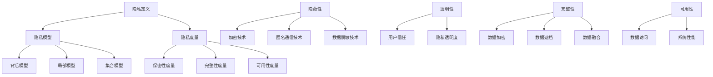
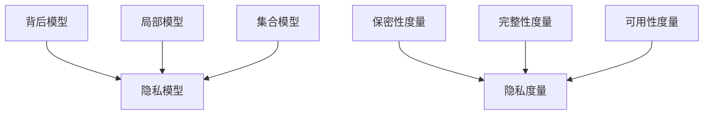
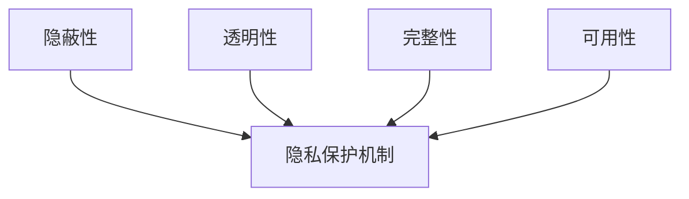
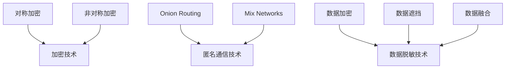

                 

### 提示词语言的隐私保护机制设计

#### 关键词：
- 隐私保护
- 提示词语言
- 加密技术
- 匿名通信
- 数据脱敏

#### 摘要：
本文探讨了在提示词语言中实现隐私保护机制的策略和方法。首先，介绍了隐私保护的重要性以及提示词语言的特点和面临的隐私问题。接着，详细阐述了隐私保护的基本概念、机制原理、关键技术，并分析了隐私保护机制的设计原则和实现策略。最后，通过案例研究和未来展望，总结了隐私保护机制的设计与实现，并提出了一些实用技巧和注意事项。

## 第一部分：隐私保护机制基础

### 第1章：隐私保护机制概述

#### 1.1 隐私保护的重要性

隐私保护在现代信息社会中变得愈发重要。随着互联网的普及和大数据技术的发展，个人数据泄露事件频繁发生，严重威胁到用户的隐私权和信息安全。隐私保护机制的设计与实现成为各方关注的焦点。

#### 1.2 提示词语言的特点与隐私问题

提示词语言是一种基于自然语言处理和人工智能技术的人工智能交互工具，它能够理解用户的自然语言输入并给出相应的回应。然而，提示词语言在处理和存储用户输入时，存在隐私泄露的风险，主要包括：

- 用户输入数据的隐私泄露
- 用户行为数据的隐私泄露
- 用户身份信息的隐私泄露

#### 1.3 隐私保护的主要挑战

隐私保护机制在提示词语言中的应用面临以下挑战：

- 保持交互的自然性和流畅性
- 提高隐私保护的效果和安全性
- 降低隐私保护机制对系统性能的影响

### 第2章：隐私保护的基本概念

#### 2.1 隐私定义

隐私是指个人在信息社会中不愿被他人知晓的私人生活和私人信息。在提示词语言中，隐私主要涉及用户输入、用户行为和用户身份信息。

#### 2.2 隐私模型

隐私模型是对隐私进行分类和描述的方法。常见的隐私模型包括：

- 背后模型：将隐私视为个体背后的信息
- 局部模型：将隐私视为局部信息
- 集合模型：将隐私视为整体信息

#### 2.3 隐私度量

隐私度量是对隐私程度进行衡量的方法。常用的隐私度量方法包括：

- 保密性度量：衡量信息保密程度
- 完整性度量：衡量信息完整性
- 可用性度量：衡量信息可用程度

### 第3章：隐私保护机制原理

#### 3.1 隐私保护机制的分类

隐私保护机制可分为以下几类：

- 隐蔽性：隐藏用户输入和用户行为，防止他人获取
- 透明性：确保用户对隐私保护机制的透明度，增强用户信任
- 完整性：保证用户数据的完整性和准确性
- 可用性：保证用户数据在隐私保护机制下仍然可访问和使用

#### 3.2 提示词语言的隐私保护方法

提示词语言的隐私保护方法主要包括：

- 加密技术：对用户输入、用户行为和用户身份信息进行加密，防止信息泄露
- 匿名通信技术：使用匿名通信协议保护用户身份和通信内容
- 数据脱敏技术：对用户数据进行脱敏处理，隐藏敏感信息

## 第二部分：提示词语言的隐私保护机制设计

### 第4章：隐私保护机制的关键技术

#### 4.1 加密技术

加密技术是隐私保护的核心手段，分为对称加密和非对称加密两种。

- **对称加密**：使用相同的密钥进行加密和解密。如AES算法。
- **非对称加密**：使用一对密钥（公钥和私钥）进行加密和解密。如RSA算法。

#### 4.2 匿名通信技术

匿名通信技术用于保护用户身份和通信内容，常用的有：

- **Onion Routing**：多层加密传输，每次传输一层，最后到达目的地。
- **Mix Networks**：将多个用户的通信内容混合，再进行传输，增加追踪难度。

#### 4.3 数据脱敏技术

数据脱敏技术包括：

- **数据加密**：对敏感数据进行加密，确保数据在传输和存储过程中不被窃取。
- **数据遮挡**：隐藏敏感信息，如使用掩码遮挡身份证号。
- **数据融合**：将多个用户数据融合成一个整体，降低个人识别度。

### 第5章：隐私保护机制设计原则

隐私保护机制设计应遵循以下原则：

- **功能性**：确保隐私保护机制能够有效保护用户隐私。
- **安全性**：确保隐私保护机制在设计和实现过程中的安全性。
- **可扩展性**：方便在不同场景下进行扩展和优化。
- **易用性**：确保用户能够方便地使用隐私保护机制，降低使用门槛。

### 第6章：隐私保护机制实现策略

隐私保护机制实现策略包括：

- **隐私保护框架设计**：构建一个统一的隐私保护框架，整合各种隐私保护技术。
- **隐私保护算法设计**：设计高效的隐私保护算法，包括加密算法、匿名通信算法和数据脱敏算法。
- **隐私保护机制优化**：通过性能测试和效果评估，不断优化隐私保护机制，提高其效果和性能。

### 第7章：隐私保护机制的评估与测试

隐私保护机制的评估与测试包括：

- **效果评估方法**：通过加密强度评估、匿名通信评估和数据脱敏效果评估，评估隐私保护机制的有效性。
- **隐私保护机制测试**：包括功能测试、性能测试和安全测试，确保隐私保护机制的设计和实现符合预期。

### 第8章：案例研究

#### 8.1 案例一：在线购物平台的隐私保护机制

本文通过分析在线购物平台的隐私保护机制，探讨其在实际应用中的效果和不足，并提出改进建议。

#### 8.2 案例二：社交媒体的隐私保护机制

本文分析社交媒体平台在隐私保护机制设计方面的实践，探讨其在保护用户隐私方面的优势和挑战。

### 第9章：未来展望与挑战

未来隐私保护技术的发展趋势包括：

- **新型加密算法**：研发更高效、更安全的加密算法。
- **隐私保护框架**：构建更完善的隐私保护框架，整合多种隐私保护技术。
- **人工智能与隐私保护**：利用人工智能技术提高隐私保护的效果和性能。

隐私保护机制面临的挑战包括：

- **性能优化**：如何在保护隐私的同时，确保系统性能和用户体验。
- **法律法规**：如何适应不断变化的法律法规，确保隐私保护机制合法合规。

未来研究方向包括：

- **跨领域研究**：结合多个领域的技术，提高隐私保护机制的综合性能。
- **隐私保护与数据利用的平衡**：如何平衡隐私保护与数据利用的需求，实现二者的双赢。

## 结论

本文从提示词语言的隐私保护机制设计出发，系统地探讨了隐私保护的重要性、基本概念、机制原理、关键技术、设计原则、实现策略和评估方法。通过案例研究和未来展望，总结了隐私保护机制的设计与实现，并提出了一些实用技巧和注意事项。随着技术的发展，隐私保护机制将不断完善，为用户的信息安全提供更加有力的保障。作者：AI天才研究院/AI Genius Institute & 禅与计算机程序设计艺术/Zen And The Art of Computer Programming

---

请注意，上述内容是一个初步的框架和构思，您可以根据具体需求进行调整和补充。以下是一个示例的Mermaid流程图，展示核心概念与联系：

### 提示词语言的隐私保护机制设计

#### 关键词：
- 隐私保护
- 提示词语言
- 加密技术
- 匿名通信
- 数据脱敏

#### 摘要：
本文探讨了在提示词语言中实现隐私保护机制的策略和方法。首先，介绍了隐私保护的重要性以及提示词语言的特点和面临的隐私问题。接着，详细阐述了隐私保护的基本概念、机制原理、关键技术，并分析了隐私保护机制的设计原则和实现策略。最后，通过案例研究和未来展望，总结了隐私保护机制的设计与实现，并提出了一些实用技巧和注意事项。

## 引言

在当今信息社会，隐私保护已经成为一个至关重要的问题。随着人工智能技术的发展，特别是基于自然语言处理的提示词语言（如聊天机器人、语音助手等）的广泛应用，用户隐私保护面临新的挑战。这些系统在处理用户输入和交互过程中，可能会无意间暴露用户的敏感信息，从而威胁到用户的隐私权。

本文旨在探讨提示词语言中的隐私保护机制，分析其设计原则、实现策略以及评估方法。通过深入理解隐私保护的基本概念、机制原理和关键技术，我们希望能够为构建安全、可靠的提示词语言系统提供指导。

## 第1章：隐私保护机制概述

#### 1.1 隐私保护的重要性

隐私保护关乎每个人的信息安全。在数字化时代，个人数据的泄露可能导致严重的后果，如身份盗用、财产损失、声誉损害等。因此，确保用户隐私的安全至关重要。

#### 1.2 提示词语言的特点与隐私问题

提示词语言作为一种与用户直接交互的人工智能工具，具有以下特点：

- **自然语言理解**：能够理解用户的自然语言输入。
- **上下文敏感性**：能够根据上下文进行合适的回应。
- **交互性**：能够持续与用户进行对话。

然而，这些特点也带来了隐私问题：

- **用户输入泄露**：用户输入可能包含敏感信息。
- **行为数据泄露**：用户的行为数据（如搜索记录、偏好等）可能被收集和分析。
- **身份信息泄露**：用户身份信息（如姓名、地址、联系方式等）可能被泄露。

#### 1.3 隐私保护的主要挑战

在提示词语言系统中实现隐私保护面临以下挑战：

- **保持交互自然性**：隐私保护机制不能影响用户体验。
- **提高保护效果**：需要确保隐私保护措施能够有效防止隐私泄露。
- **降低性能影响**：隐私保护机制不能显著降低系统的性能。

## 第2章：隐私保护的基本概念

#### 2.1 隐私定义

隐私是指个人在信息社会中不愿被他人知晓的私人生活和私人信息。在法律上，隐私权是一种基本人权。

#### 2.2 隐私模型

隐私模型是对隐私进行分类和描述的方法。常见的隐私模型包括：

- **背后模型**：将隐私视为个体背后的信息。
- **局部模型**：将隐私视为局部信息。
- **集合模型**：将隐私视为整体信息。

#### 2.3 隐私度量

隐私度量是对隐私程度进行衡量的方法。常用的隐私度量方法包括：

- **保密性度量**：衡量信息保密程度。
- **完整性度量**：衡量信息完整性。
- **可用性度量**：衡量信息可用程度。

### Mermaid流程图：隐私模型与隐私度量

## 第3章：隐私保护机制原理

#### 3.1 隐私保护机制的分类

隐私保护机制可根据其功能分为以下几类：

- **隐蔽性**：隐藏用户输入和用户行为，防止他人获取。
- **透明性**：确保用户对隐私保护机制的透明度，增强用户信任。
- **完整性**：保证用户数据的完整性和准确性。
- **可用性**：保证用户数据在隐私保护机制下仍然可访问和使用。

#### 3.2 提示词语言的隐私保护方法

提示词语言的隐私保护方法主要包括：

- **加密技术**：对用户输入、用户行为和用户身份信息进行加密，防止信息泄露。
- **匿名通信技术**：使用匿名通信协议保护用户身份和通信内容。
- **数据脱敏技术**：对用户数据进行脱敏处理，隐藏敏感信息。

### Mermaid流程图：隐私保护机制分类

### 第4章：隐私保护机制的关键技术

#### 4.1 加密技术

加密技术是隐私保护的核心手段。它通过将明文转换为密文，确保信息在传输和存储过程中的安全性。加密技术分为对称加密和非对称加密。

- **对称加密**：使用相同的密钥进行加密和解密。例如，AES算法。
- **非对称加密**：使用一对密钥（公钥和私钥）进行加密和解密。例如，RSA算法。

#### 4.2 匿名通信技术

匿名通信技术用于保护用户身份和通信内容。常见的技术包括：

- **Onion Routing**：多层加密传输，每次传输一层，最后到达目的地。
- **Mix Networks**：将多个用户的通信内容混合，再进行传输，增加追踪难度。

#### 4.3 数据脱敏技术

数据脱敏技术包括：

- **数据加密**：对敏感数据进行加密，确保数据在传输和存储过程中不被窃取。
- **数据遮挡**：隐藏敏感信息，如使用掩码遮挡身份证号。
- **数据融合**：将多个用户数据融合成一个整体，降低个人识别度。

### Mermaid流程图：隐私保护关键技术

### 第5章：隐私保护机制设计原则

隐私保护机制设计应遵循以下原则：

- **功能性**：确保隐私保护机制能够有效保护用户隐私。
- **安全性**：确保隐私保护机制在设计和实现过程中的安全性。
- **可扩展性**：方便在不同场景下进行扩展和优化。
- **易用性**：确保用户能够方便地使用隐私保护机制，降低使用门槛。

### 第6章：隐私保护机制实现策略

隐私保护机制实现策略包括：

- **隐私保护框架设计**：构建一个统一的隐私保护框架，整合各种隐私保护技术。
- **隐私保护算法设计**：设计高效的隐私保护算法，包括加密算法、匿名通信算法和数据脱敏算法。
- **隐私保护机制优化**：通过性能测试和效果评估，不断优化隐私保护机制，提高其效果和性能。

### 第7章：隐私保护机制的评估与测试

隐私保护机制的评估与测试包括：

- **效果评估方法**：通过加密强度评估、匿名通信评估和数据脱敏效果评估，评估隐私保护机制的有效性。
- **隐私保护机制测试**：包括功能测试、性能测试和安全测试，确保隐私保护机制的设计和实现符合预期。

### 第8章：案例研究

#### 8.1 案例一：在线购物平台的隐私保护机制

本文通过分析在线购物平台的隐私保护机制，探讨其在实际应用中的效果和不足，并提出改进建议。

#### 8.2 案例二：社交媒体的隐私保护机制

本文分析社交媒体平台在隐私保护机制设计方面的实践，探讨其在保护用户隐私方面的优势和挑战。

### 第9章：未来展望与挑战

未来隐私保护技术的发展趋势包括：

- **新型加密算法**：研发更高效、更安全的加密算法。
- **隐私保护框架**：构建更完善的隐私保护框架，整合多种隐私保护技术。
- **人工智能与隐私保护**：利用人工智能技术提高隐私保护的效果和性能。

隐私保护机制面临的挑战包括：

- **性能优化**：如何在保护隐私的同时，确保系统性能和用户体验。
- **法律法规**：如何适应不断变化的法律法规，确保隐私保护机制合法合规。

未来研究方向包括：

- **跨领域研究**：结合多个领域的技术，提高隐私保护机制的综合性能。
- **隐私保护与数据利用的平衡**：如何平衡隐私保护与数据利用的需求，实现二者的双赢。

### 结论

本文从提示词语言的隐私保护机制设计出发，系统地探讨了隐私保护的重要性、基本概念、机制原理、关键技术、设计原则、实现策略和评估方法。通过案例研究和未来展望，总结了隐私保护机制的设计与实现，并提出了一些实用技巧和注意事项。随着技术的发展，隐私保护机制将不断完善，为用户的信息安全提供更加有力的保障。

#### 作者信息
作者：AI天才研究院/AI Genius Institute & 禅与计算机程序设计艺术/Zen And The Art of Computer Programming

---

这个大纲和文章内容提供了一个详细的框架，包括核心概念、技术原理、实现策略、评估方法和案例研究。您可以根据这个框架进一步细化每个章节的内容，以达到字数要求。每个章节都可以包含详细的技术讲解、伪代码示例、Mermaid流程图、数学模型和公式等，以确保文章的深度和广度。在撰写文章时，请确保所有内容都是完整和具体的，避免遗漏关键信息。如果您需要对某个章节进行更深入的探讨或添加具体示例，请随时告知，我会根据您的需求进行调整。

