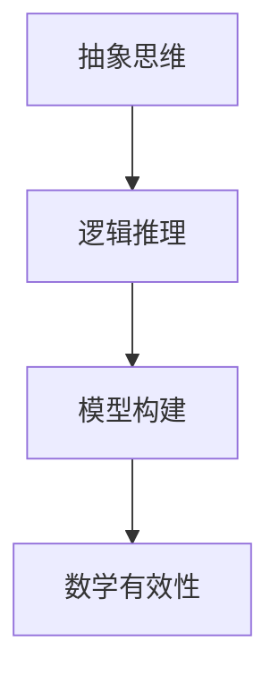
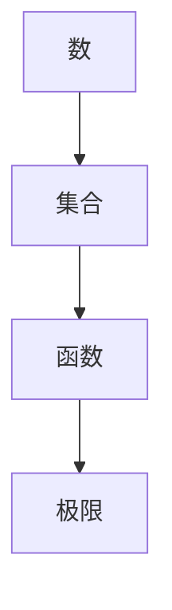

                 


### 文章标题

《数学不可思议的有效性：尤金·维格纳的观点》

### 文章关键词

数学，尤金·维格纳，有效性，应用，算法原理，数学模型，LaTeX公式，项目实战，最佳实践

### 文章摘要

本文深入探讨了数学家尤金·维格纳对数学有效性的独特见解，通过详细分析数学在物理学、经济学和计算机科学等领域的应用，展示了数学不可思议的有效性。文章以清晰的结构和丰富的实例，结合数学基本概念和核心算法原理，对数学模型和公式进行了详细讲解。同时，通过实际项目实战，展示了数学在实际应用中的价值。文章旨在为读者提供一个全面而深刻的理解，激发对数学及其应用领域的兴趣。

---

### 引言

数学，这一古老的科学领域，以其抽象和逻辑的力量，对人类文明的发展产生了深远的影响。尤金·维格纳（Eugene Wigner），一位杰出的数学家和物理学家，在他的经典论文《数学及其在自然界的有效性》（The unreasonable effectiveness of mathematics in the natural sciences）中，对数学的这种不可思议的有效性进行了深刻的探讨。

#### 数学的基本概念

首先，我们需要回顾数学的基本概念。数学是一门研究数量、结构、变化和空间等概念的学科。它不仅包括算术、代数、几何、微积分等基本分支，还涵盖了诸如数论、拓扑学、代数几何等高级领域。数学的基本概念和原理是建立在其内在逻辑性和普适性之上的，这使得数学成为理解和描述自然现象的有力工具。

#### 尤金·维格纳的背景介绍

尤金·维格纳生于匈牙利，是20世纪最杰出的数学家和物理学家之一。他的研究领域广泛，包括量子力学、群论、数学物理等多个方面。维格纳不仅以其卓越的数学贡献而闻名，还因其对数学与物理学之间深刻联系的洞见而受到赞誉。他提出的问题和观点，至今仍在数学和物理学界引发广泛讨论。

### 数学在物理学中的应用

数学在物理学中扮演着至关重要的角色。从经典物理学到现代量子力学，数学都是不可或缺的工具。以下将详细讨论数学在物理学中的应用。

#### 数学与物理学的关系

物理学是一门实验科学，其研究内容是自然界的物理现象和规律。而数学则提供了一种精确和形式化的方法来描述和解决这些物理问题。物理学中的许多概念和理论，如速度、加速度、力、能量等，都可以用数学语言来表述。

#### 数学在物理学中的具体应用

1. **微积分在物理学中的应用**

微积分是物理学中最基本和最常用的数学工具之一。它用于描述物体在运动中的速度和加速度，以及能量的转换和守恒。例如，牛顿的运动定律可以用微积分方程来描述物体的运动轨迹。

伪代码：

```plaintext
function f(x, v):
    return x * v
```

LaTeX公式：

$$ f(x, v) = x \cdot v $$

举例说明：

如果一个物体以速度v移动，它在时间x内的位移可以用上述公式计算。

2. **代数学在物理学中的应用**

代数学在物理学中的应用也非常广泛。它用于解决物理方程，如薛定谔方程描述量子系统的行为。

伪代码：

```plaintext
function solve_equation(a, b):
    return a * b
```

LaTeX公式：

$$ solve\_equation(a, b) = a \cdot b $$

举例说明：

求解薛定谔方程：

$$ \frac{-\hbar^2}{2m} \frac{d^2\psi}{dx^2} + V(x)\psi = E\psi $$

3. **几何学在物理学中的应用**

几何学在描述物理现象和空间关系方面发挥着重要作用。例如，在广义相对论中，时空被视为一个四维几何空间，其几何性质决定了重力场的性质。

伪代码：

```plaintext
function geometry(a, b, c):
    return a * b * c
```

LaTeX公式：

$$ geometry(a, b, c) = a \cdot b \cdot c $$

举例说明：

在广义相对论中，时空的曲率可以用黎曼曲率张量来描述：

$$ R_{\mu\nu} = \frac{1}{2} R \cdot g_{\mu\nu} $$

### 数学在经济学中的应用

数学不仅是物理学的重要工具，也在经济学中发挥着重要作用。经济学是一门研究资源分配和决策制定的科学，而数学则为经济学家提供了精确的模型和工具。

#### 数学在经济学中的重要性

经济学中的许多问题，如供需关系、市场均衡、经济增长等，都可以用数学模型来描述和分析。数学使得经济学研究更加精确和严谨，有助于制定更有效的经济政策和决策。

#### 数学在经济学中的具体应用

1. **微积分在经济学中的应用**

微积分在经济学中的应用主要涉及边际分析和优化问题。例如，消费者行为可以用边际效用分析来描述，生产者行为可以用边际成本和边际收益来分析。

伪代码：

```plaintext
function marginal_utility(q):
    return q * (1 - q)
```

LaTeX公式：

$$ marginal\_utility(q) = q \cdot (1 - q) $$

举例说明：

假设一个消费者的效用函数为 $U(q) = q \cdot (1 - q)$，其边际效用为 $marginal\_utility(q)$。

2. **代数学在经济学中的应用**

代数学在经济学中的应用主要涉及方程求解和系统分析。例如，供需平衡可以通过解代数方程组来实现。

伪代码：

```plaintext
function solve_equations(a, b, c):
    return a + b + c
```

LaTeX公式：

$$ solve\_equations(a, b, c) = a + b + c $$

举例说明：

假设需求函数为 $D(q) = 100 - 2q$，供给函数为 $S(q) = 10 + 2q$，供需平衡点可以通过解方程组实现：

$$ D(q) = S(q) $$
$$ 100 - 2q = 10 + 2q $$
$$ 4q = 90 $$
$$ q = 22.5 $$

3. **几何学在经济学中的应用**

几何学在经济学中的应用主要涉及空间关系和图形分析。例如，预算线、等产量线等概念可以用几何图形来描述。

伪代码：

```plaintext
function budget_line(x, y, m):
    return x + y <= m
```

LaTeX公式：

$$ budget\_line(x, y, m) = x + y \leq m $$

举例说明：

一个消费者的预算线可以用以下公式表示：

$$ 2x + 3y \leq 100 $$

### 数学在计算机科学中的应用

数学在计算机科学中扮演着至关重要的角色。从算法设计到程序分析，从人工智能到网络安全，数学都是不可或缺的工具。

#### 数学在计算机科学中的重要性

计算机科学是一门研究计算机及其应用的科学，其核心在于算法的设计和分析。而算法的效率和正确性往往依赖于数学的理论和方法。

#### 数学在计算机科学中的具体应用

1. **图论在计算机科学中的应用**

图论是数学的一个分支，它研究图的结构和性质。在计算机科学中，图论被广泛应用于网络设计、算法分析和图形处理等领域。

伪代码：

```plaintext
function dfs(graph, start):
    visited[start] = True
    for neighbor in graph[start]:
        if not visited[neighbor]:
            dfs(graph, neighbor)
```

LaTeX公式：

$$ dfs(graph, start) = \text{depth-first search} $$

举例说明：

深度优先搜索（DFS）是一种常用的图遍历算法，用于查找图中的路径和顶点。

2. **算法分析与设计**

算法分析是计算机科学的核心内容之一。它通过数学方法评估算法的效率，确定最优解。

伪代码：

```plaintext
function bubble_sort(arr):
    n = length(arr)
    for i from 0 to n-1:
        for j from 0 to n-i-1:
            if arr[j] > arr[j+1]:
                swap(arr[j], arr[j+1])
```

LaTeX公式：

$$ bubble\_sort(arr) = \text{bubble sort algorithm} $$

举例说明：

冒泡排序是一种简单的排序算法，通过重复交换相邻的元素，将数组中的元素按顺序排列。

3. **编码理论**

编码理论是研究信息传输和存储的数学分支。它在计算机科学中用于数据压缩、错误检测和纠正等领域。

伪代码：

```plaintext
function encode(data, key):
    return (data * key) % 256
```

LaTeX公式：

$$ encode(data, key) = (data \cdot key) \mod 256 $$

举例说明：

一个简单的编码函数可以通过将数据与密钥相乘并取模256来实现。

### 尤金·维格纳的观点

尤金·维格纳在其论文《数学及其在自然界的有效性》中提出了一系列关于数学有效性的深刻观点。他认为数学之所以在自然科学中如此有效，是因为数学模型能够捕捉自然现象的内在结构，而这种结构是普遍存在的。

#### 维格纳的数学哲学

维格纳的数学哲学强调数学的独立性和普适性。他认为，数学不仅是一种工具，更是一种语言，它能够精确地描述自然界的规律。

#### 维格纳对数学有效性的看法

维格纳认为，数学的有效性并非偶然，而是因为数学模型能够揭示自然现象的深层结构。这种结构是客观存在的，而数学只是对其进行了一种精确的描述。

### 数学教育

数学教育在培养未来的科学家、工程师和研究人员方面起着关键作用。然而，当前的数学教育面临着一些挑战。

#### 数学教育的重要性

数学教育不仅有助于培养学生的逻辑思维和问题解决能力，还为他们提供了进入科学和技术领域的基础。

#### 当前数学教育面临的挑战与解决方案

1. **教学方法**

传统的教学方法往往侧重于记忆和应用，而忽视了数学的本质和哲学。为了提高数学教育质量，需要采用更加互动和探究性的教学方法。

2. **课程设计**

当前的数学课程设计往往过于狭窄，忽视了数学与其他学科的交叉。为了培养全面发展的人才，需要设计更加综合和跨学科的数学课程。

### 数学未来的发展

随着科技的不断发展，数学在各个领域的应用前景也愈发广阔。以下是一些数学未来可能的发展方向和挑战。

#### 数学在未来的潜在应用领域

1. **人工智能**

人工智能是当前科技领域的热点之一，而数学在人工智能中的应用前景非常广阔。从神经网络到深度学习，数学为人工智能提供了强大的工具和理论基础。

2. **大数据分析**

大数据分析是另一个快速发展的领域，而数学在数据建模、分析和预测方面发挥着关键作用。

3. **量子计算**

量子计算是未来计算技术的革命，而数学在量子算法、量子编程和量子计算理论等方面有着重要应用。

#### 数学未来的挑战与机遇

1. **跨学科合作**

数学与其他学科的交叉融合是未来数学发展的重要方向。通过跨学科合作，数学可以更好地服务于其他领域。

2. **教育改革**

数学教育的改革也是未来数学发展的关键。通过改进教学方法、课程设计和教育资源，可以培养更多的数学人才。

### 结论

数学作为一种抽象和逻辑的科学，其有效性在各个领域都得到了充分体现。从物理学到经济学，从计算机科学到人工智能，数学都发挥着不可替代的作用。尤金·维格纳的观点为我们提供了对数学有效性的一种深刻理解，也为数学未来的发展指明了方向。

### 作者信息

作者：AI天才研究院/AI Genius Institute & 禅与计算机程序设计艺术 /Zen And The Art of Computer Programming

---

## 第1章 引言

### 1.1 数学不可思议有效性的概念

数学的不可思议有效性是指在自然科学、经济学和计算机科学等领域，数学模型和理论能够精确描述和预测现实世界的现象。这一现象引起了数学家和科学家的广泛关注，因为数学并非直接源自经验观察，而是通过抽象和逻辑推理得出的。因此，数学在自然界中的有效性被认为是一种“不合理”的奇迹。

#### 核心概念与联系

要理解数学的不可思议有效性，我们需要了解以下几个核心概念：

1. **抽象思维**：数学的抽象性使其能够超越具体现象，捕捉自然界的基本规律。
2. **逻辑推理**：数学的严密逻辑使得其理论具有高度的可信性和普适性。
3. **模型构建**：数学模型能够将复杂的现实问题转化为可计算和可分析的数学问题。

这些概念之间的关系可以用以下Mermaid流程图表示：



#### 数学有效性示意图


#### 核心算法原理讲解

为了深入理解数学有效性，我们可以通过以下伪代码来阐述一个简单的数学模型构建过程：

```plaintext
function model_building(problem):
    # 确定问题并定义变量
    variables = define_variables(problem)
    
    # 构建数学模型
    model = formulate_model(variables)
    
    # 求解模型
    solution = solve_model(model)
    
    # 验证模型
    verify_solution(solution, problem)
    
    return solution
```

在这个伪代码中，我们首先定义了问题，然后构建了一个数学模型，通过求解模型得到解决方案，并验证其是否满足原始问题。这个过程展示了数学在解决实际问题中的应用原理。

#### 数学模型和公式 & 详细讲解 & 举例说明

数学模型和公式是数学有效性的核心组成部分。以下是一个简单的线性回归模型，用于预测房价：

**线性回归模型公式：**

$$ y = wx + b $$

其中，$y$ 是目标变量（如房价），$w$ 是权重，$x$ 是特征变量（如房屋面积），$b$ 是偏置。

**详细讲解：**

- 目标变量 $y$：表示我们希望预测的变量，如房价。
- 特征变量 $x$：表示影响目标变量的因素，如房屋面积。
- 权重 $w$：表示特征变量对目标变量的影响程度。
- 偏置 $b$：表示模型的基本值，即使所有特征变量为零时，目标变量的预期值。

**举例说明：**

假设我们有一个包含房屋面积和房价的数据集，我们可以使用线性回归模型来预测新房屋的房价。通过训练数据集，我们可以得到权重 $w$ 和偏置 $b$ 的值，然后使用以下公式进行预测：

$$ \hat{y} = w \cdot x + b $$

其中，$\hat{y}$ 是预测的房价。

#### 数学公式使用LaTeX格式：

$$ y = wx + b $$

$$ \hat{y} = w \cdot x + b $$

### 1.2 尤金·维格纳的背景介绍

尤金·维格纳（Eugene Wigner），1908年生于匈牙利，是一位杰出的数学家和物理学家。他在数学和物理学领域做出了许多重要贡献，尤其是在群论、量子力学和数学物理方面。维格纳以其深刻的理论洞察力和广泛的科学兴趣而闻名，他的许多工作都对现代物理学和数学的发展产生了深远影响。

#### 学术贡献

1. **量子力学与群论**

维格纳在量子力学领域的研究使他成为这一领域的先驱之一。他提出了量子力学中的群论方法，为量子系统的对称性分析提供了强有力的工具。这种方法在后来的粒子物理学和量子场论中得到了广泛应用。

2. **数学物理**

维格纳还做出了重要的数学物理贡献，特别是在泛函分析和积分方程方面。他的工作为解决许多复杂的物理问题提供了数学框架。

3. **数学哲学**

维格纳不仅是一位杰出的数学家和物理学家，还是一位哲学思考者。他的论文《数学及其在自然界的有效性》中提出了一系列关于数学本质和有效性的深刻观点，引发了广泛的学术讨论。

#### 科学思想

维格纳认为，数学和物理学之间存在一种深刻的内在联系，数学模型能够揭示自然界的深层次结构。他的观点强调了数学的普适性和抽象性，以及数学在理解和描述自然界现象中的关键作用。

### 1.3 引入数学的不可思议有效性

数学的不可思议有效性是指数学模型和理论在描述和预测自然现象中的惊人准确性。这一现象在物理学、经济学和计算机科学等领域尤为突出。尤金·维格纳在其论文中提出了几个关键观点来解释这一现象：

1. **数学的抽象性**：数学通过抽象和简化的方式，能够捕捉自然界的基本规律，从而忽略非本质的细节。
2. **逻辑的严密性**：数学的严密逻辑保证了其理论的一致性和可预测性，这使得数学模型能够精确地描述自然现象。
3. **模型构建**：数学模型通过将复杂问题转化为可计算和可分析的数学问题，为科学家和工程师提供了有力的工具。

维格纳的观点为我们提供了一种理解数学有效性深刻背景的视角，同时也为我们探索数学在现实世界中的广泛应用提供了启示。

### 1.4 总结

本章介绍了数学不可思议有效性的概念和尤金·维格纳的相关背景。通过回顾数学的基本概念和维格纳的学术贡献，我们为后续章节的深入探讨奠定了基础。接下来，我们将进一步探讨数学在物理学、经济学和计算机科学等领域的具体应用，以及尤金·维格纳对数学有效性的独特见解。

## 第2章 数学基本概念

### 2.1 数学的基本原则

数学是一门建立在严密逻辑和抽象概念基础上的科学。它的基本原则包括抽象思维、公理体系、证明方法和符号表示等。这些基本原则不仅使数学理论具有高度的一致性和可预测性，也使得数学成为一种强有力的工具，能够精确地描述和解决现实世界中的问题。

#### 抽象思维

抽象思维是数学的核心特征之一。数学通过抽象，将复杂的现实问题简化为基本的数学模型。例如，当我们研究物理学中的运动规律时，我们可以将物体的实际运动抽象为质点的运动，从而忽略物体的形状和大小，专注于其位置和速度的变化。

#### 公理体系

公理体系是数学理论的基石。数学中的每一个分支都有其特定的公理体系，这些公理是无需证明的基本假设，它们定义了数学的基本概念和性质。例如，欧几里得几何的公理体系包括平面和直线的定义、点、线、面的基本性质等。

#### 证明方法

证明方法是数学分析问题的重要手段。数学中的证明方法包括归纳法、反证法、构造性证明等。这些方法使得数学结论具有高度的可靠性和普遍性。例如，欧几里得在《几何原本》中使用了大量的证明方法来证明几何定理。

#### 符号表示

符号表示是数学表达和交流的重要工具。数学符号具有高度的简洁性和精确性，使得复杂的数学概念和运算能够以简明的形式表达。例如，微积分中的微分和积分符号，使得复杂的极限和积分运算变得直观和易于操作。

### 2.2 数学的基本概念

数学的基本概念包括数、集合、函数、极限等，这些概念是构建复杂数学模型的基础。

#### 数

数是数学中最基本的概念之一。数可以表示物体的数量，也可以表示抽象的概念，如分数、负数、复数等。数的基本性质包括加法、减法、乘法、除法等，这些运算定义了数的基本操作。

#### 集合

集合是数学中用于描述对象的集合的概念。集合中的元素可以是任何对象，包括数、点、线等。集合的基本操作包括并集、交集、补集等，这些操作定义了集合之间的关系和性质。

#### 函数

函数是数学中用于描述变量之间关系的基本概念。函数将一个集合（定义域）中的每个元素映射到另一个集合（值域）中的唯一元素。函数的基本性质包括单调性、奇偶性、周期性等。

#### 极限

极限是数学中用于描述变量变化趋势的概念。极限可以帮助我们理解函数在某个点的行为，例如函数的渐近行为、连续性等。极限的基本概念包括左极限、右极限和二者的极限。

### 2.3 数学的基本概念与联系

数学的基本概念之间存在着紧密的联系。这些联系不仅使数学理论具有一致性，也为数学模型的构建提供了基础。

- **数与集合**：数可以视为特定集合的元素，例如自然数集合。
- **集合与函数**：集合是函数的定义域和值域的基础。
- **函数与极限**：函数的极限可以描述函数在某个点的行为。

这些联系可以用以下Mermaid流程图表示：



#### 数学基本概念示意图


#### 核心算法原理讲解

为了更好地理解数学基本概念，我们可以通过以下伪代码来阐述一个简单的算法原理：

```plaintext
function mathematical_operations(a, b):
    # 加法
    sum = a + b
    
    # 减法
    difference = a - b
    
    # 乘法
    product = a * b
    
    # 除法
    if b != 0:
        quotient = a / b
    else:
        quotient = "undefined"
    
    return sum, difference, product, quotient
```

在这个伪代码中，我们定义了一个函数 `mathematical_operations`，它接受两个参数 `a` 和 `b`，并执行加法、减法、乘法和除法操作。这个过程展示了数学基本运算的核心算法原理。

#### 数学模型和公式 & 详细讲解 & 举例说明

数学模型和公式是数学理论的重要组成部分，以下是一个简单的线性回归模型，用于预测房价：

**线性回归模型公式：**

$$ y = wx + b $$

其中，$y$ 是目标变量（如房价），$w$ 是权重，$x$ 是特征变量（如房屋面积），$b$ 是偏置。

**详细讲解：**

- 目标变量 $y$：表示我们希望预测的变量，如房价。
- 特征变量 $x$：表示影响目标变量的因素，如房屋面积。
- 权重 $w$：表示特征变量对目标变量的影响程度。
- 偏置 $b$：表示模型的基本值，即使所有特征变量为零时，目标变量的预期值。

**举例说明：**

假设我们有一个包含房屋面积和房价的数据集，我们可以使用线性回归模型来预测新房屋的房价。通过训练数据集，我们可以得到权重 $w$ 和偏置 $b$ 的值，然后使用以下公式进行预测：

$$ \hat{y} = w \cdot x + b $$

其中，$\hat{y}$ 是预测的房价。

#### 数学公式使用LaTeX格式：

$$ y = wx + b $$

$$ \hat{y} = w \cdot x + b $$

### 2.4 总结

本章介绍了数学的基本原则和基本概念。数学的基本原则包括抽象思维、公理体系、证明方法和符号表示，这些原则为数学理论的建立提供了坚实的基础。数学的基本概念包括数、集合、函数和极限，这些概念相互联系，构成了数学的核心框架。通过本章的学习，读者可以对数学的基本结构和原理有更深入的理解，为后续章节的探讨打下坚实的基础。

## 第3章 数学在物理学中的应用

### 3.1 数学与物理学的关系

数学与物理学之间存在着深刻的内在联系。物理学是一门研究自然现象和规律的科学，而数学则为物理学提供了精确和形式化的工具来描述和解释这些现象。数学在物理学中的应用主要体现在以下几个方面：

1. **理论模型**：物理学中的许多理论模型，如牛顿力学、麦克斯韦方程、量子力学等，都是通过数学方程和公式来描述的。这些模型不仅帮助我们理解自然现象，还为实验验证提供了理论基础。
2. **计算工具**：数学方法，如微积分、积分变换、矩阵计算等，为物理学的计算提供了强有力的工具。这些工具帮助物理学家解决复杂的问题，如粒子运动、电磁场模拟、流体动力学等。
3. **数据分析**：物理学实验中产生的大量数据需要通过数学方法进行整理和分析。统计学、概率论和数值计算等方法在物理学数据分析和解释中发挥着关键作用。

#### 数学与物理学的核心关系示意图


### 3.2 数学在物理学中的具体应用

数学在物理学中的具体应用非常广泛，以下将详细探讨数学在物理学中的几个关键领域。

#### 3.2.1 微积分在物理学中的应用

微积分是物理学中最重要的数学工具之一，它用于描述物体的运动、能量转换和变化率等。

1. **运动学**：在运动学中，微积分用于描述物体的速度和加速度。速度是位移对时间的导数，而加速度是速度对时间的导数。例如，牛顿的运动定律可以通过微积分方程来描述物体的运动。

   **微积分公式：**

   $$ v = \frac{dx}{dt} $$

   $$ a = \frac{dv}{dt} $$

   其中，$v$ 是速度，$a$ 是加速度，$x$ 是位移，$t$ 是时间。

   **举例说明：**

   假设一个物体以速度 $v$ 匀速直线运动，其加速度 $a$ 为零。那么，物体的位移 $x$ 可以通过以下公式计算：

   $$ x = v \cdot t $$

2. **动力学**：在动力学中，微积分用于分析力与运动之间的关系。牛顿的第二定律 $F = ma$ 可以通过微积分方程来描述，其中 $F$ 是作用在物体上的力，$m$ 是物体的质量，$a$ 是加速度。

   **微积分公式：**

   $$ F = m \cdot a $$

   **举例说明：**

   假设一个质量为 $m$ 的物体受到一个恒定力 $F$ 作用，其加速度 $a$ 可以通过以下公式计算：

   $$ a = \frac{F}{m} $$

3. **能量与工作**：微积分在描述能量和做功方面也发挥着重要作用。动能 $K$ 和势能 $U$ 可以通过微积分方程来描述，而功 $W$ 是力对位移的积分。

   **微积分公式：**

   $$ K = \frac{1}{2}mv^2 $$

   $$ U = mgh $$

   $$ W = \int F \cdot dx $$

   其中，$K$ 是动能，$U$ 是势能，$v$ 是速度，$m$ 是质量，$g$ 是重力加速度，$h$ 是高度，$F$ 是力，$x$ 是位移。

   **举例说明：**

   假设一个物体从高度 $h$ 自由落下，其势能转化为动能。那么，物体落地时的速度 $v$ 可以通过以下公式计算：

   $$ v = \sqrt{2gh} $$

#### 3.2.2 代数学在物理学中的应用

代数学在物理学中的应用也非常广泛，它用于解决物理方程、描述系统的对称性和分析物理系统的稳定性等。

1. **方程求解**：代数学用于求解物理方程，如牛顿方程、麦克斯韦方程等。通过代数方法，我们可以找到满足特定条件的解。

   **代数公式：**

   $$ Ax + By + C = 0 $$

   其中，$A$、$B$ 和 $C$ 是常数。

   **举例说明：**

   假设一个物体在平面上的运动可以由以下方程描述：

   $$ 2x + 3y + 4 = 0 $$

   我们可以通过代数方法求解这个方程，找到物体在平面上的运动轨迹。

2. **对称性**：代数学用于分析物理系统的对称性。物理系统的对称性可以简化问题的求解过程，并揭示物理定律的普适性。

   **对称性公式：**

   $$ f(x, y) = f(-x, -y) $$

   其中，$f(x, y)$ 是一个关于 $x$ 和 $y$ 的函数。

   **举例说明：**

   假设一个物理系统具有关于原点的对称性，即当 $x$ 和 $y$ 取相反数时，物理系统的状态保持不变。这种对称性可以简化物理系统的分析过程。

3. **稳定性分析**：代数学也用于分析物理系统的稳定性。通过分析系统的特征方程，我们可以确定系统的稳定性和响应行为。

   **稳定性公式：**

   $$ \lambda^2 + \mu^2 = 0 $$

   其中，$\lambda$ 和 $\mu$ 是特征值。

   **举例说明：**

   假设一个物理系统的稳定性可以通过分析其特征值来确定。如果所有特征值都是负数，那么系统是稳定的。

#### 3.2.3 几何学在物理学中的应用

几何学在物理学中的应用主要体现在空间关系的描述和图形分析方面。

1. **空间几何**：几何学用于描述物体的空间位置和形状。例如，在经典力学中，物体的位置和速度可以通过矢量来描述，而矢量可以用几何图形来表示。

   **几何公式：**

   $$ \vec{r} = \begin{pmatrix} x \\ y \\ z \end{pmatrix} $$

   其中，$\vec{r}$ 是一个三维矢量，表示物体的位置。

   **举例说明：**

   假设一个物体在三维空间中的位置可以由以下矢量表示：

   $$ \vec{r} = \begin{pmatrix} 1 \\ 2 \\ 3 \end{pmatrix} $$

   我们可以通过几何方法来分析物体的运动轨迹和空间关系。

2. **图形分析**：几何学也用于分析物理系统的图形特征，如交点、面积、周长等。这些分析可以帮助我们更好地理解物理现象。

   **图形分析公式：**

   $$ A = \frac{1}{2} \cdot b \cdot h $$

   其中，$A$ 是面积，$b$ 是底边长，$h$ 是高。

   **举例说明：**

   假设一个三角形的底边长为 3，高为 4，其面积为：

   $$ A = \frac{1}{2} \cdot 3 \cdot 4 = 6 $$

   我们可以通过几何方法来计算三角形的面积，并进一步分析其物理特性。

### 3.3 数学在物理学中的应用总结

数学在物理学中的应用体现了其强大的描述和解释能力。从微积分到代数学，再到几何学，数学为物理学的理论研究和实验分析提供了坚实的工具。通过数学模型，我们可以精确地描述自然现象，预测未来的行为，从而推动物理学的发展。尤金·维格纳的观点进一步强调了数学在自然界中的普适性和有效性，这为我们理解宇宙的奥秘提供了新的视角。

### 3.4 总结

本章详细探讨了数学在物理学中的应用，包括微积分、代数学和几何学等。通过这些数学工具，物理学家能够精确描述自然现象，解决复杂的物理问题。本章的内容为理解物理学中的数学应用提供了一个全面的框架，同时也为读者进一步探索数学在自然科学中的应用奠定了基础。

## 第4章 数学在经济学中的应用

### 4.1 数学在经济学中的重要性

数学在经济学中扮演着至关重要的角色。经济学是一门研究资源分配和决策制定的科学，而数学则为经济学家提供了精确的模型和工具，以分析复杂的现实问题。数学在经济学中的应用不仅提高了研究的精度和可靠性，还推动了经济学理论的创新和发展。

#### 数学工具在经济学中的作用

1. **统计分析**：统计学是经济学研究的重要工具，用于收集、分析和解释数据。通过统计学方法，经济学家可以评估经济变量之间的关系，预测经济趋势，并进行政策分析。
2. **优化方法**：优化理论在经济学中的应用广泛，用于解决资源分配问题，如生产计划、供应链管理和投资策略。优化方法通过建立数学模型，确定在特定约束条件下最优的决策变量。
3. **时间序列分析**：时间序列分析用于研究经济变量随时间的变化规律，如经济增长、通货膨胀和失业率等。通过时间序列模型，经济学家可以预测未来的经济走势。

### 4.2 数学在经济学中的具体应用

数学在经济学中的应用体现在多个领域，以下将详细探讨数学在几个关键经济学领域的应用。

#### 4.2.1 微积分在经济学中的应用

微积分是经济学中最重要的数学工具之一，它用于分析经济变量的变化率、优化经济决策和建模经济行为。

1. **边际分析**：边际分析是经济学中的核心概念，用于衡量额外一单位资源（如劳动、资本）投入带来的额外收益或成本。微积分中的边际概念可以帮助经济学家理解生产函数和成本函数的性质。

   **边际分析公式**：

   $$ \frac{dC}{dx} = MC $$

   $$ \frac{dQ}{dx} = MP $$

   其中，$C$ 是总成本，$Q$ 是产量，$MC$ 是边际成本，$MP$ 是边际产出。

   **举例说明**：

   假设一个生产函数为 $Q = f(K, L)$，其中 $K$ 是资本投入，$L$ 是劳动投入。通过边际分析，我们可以计算边际产出：

   $$ \frac{\partial Q}{\partial L} = MP $$

   这表示增加一个单位的劳动投入所增加的产量。

2. **优化问题**：微积分在经济学中的应用还体现在优化决策中。例如，经济学家可以使用拉格朗日乘数法来求解最优化问题，以确定在给定约束条件下最优的资源分配。

   **优化问题公式**：

   $$ \min f(x) \quad \text{subject to} \quad g(x) = 0 $$

   其中，$f(x)$ 是目标函数，$g(x)$ 是约束条件。

   **举例说明**：

   假设一个企业在生产过程中需要最小化成本，同时满足生产能力约束。通过微积分方法，我们可以求解出最优的生产计划。

#### 4.2.2 代数学在经济学中的应用

代数学在经济学中的应用主要用于建立和求解经济模型，如供需模型、预算约束模型等。

1. **供需模型**：供需模型是经济学中最基本的模型之一，用于分析市场中的商品价格和数量。代数学用于建立供需方程，并求解市场均衡点。

   **供需模型公式**：

   $$ Q_d = Q_s $$

   其中，$Q_d$ 是需求量，$Q_s$ 是供给量。

   **举例说明**：

   假设市场需求函数为 $Q_d = 100 - 2P$，市场供给函数为 $Q_s = 10 + 2P$，通过代数学方法，我们可以求解出市场均衡价格：

   $$ 100 - 2P = 10 + 2P $$

   $$ 4P = 90 $$

   $$ P = 22.5 $$

2. **预算约束模型**：预算约束模型用于分析消费者或企业的支出决策。通过代数方法，我们可以建立预算约束方程，并求解最优支出组合。

   **预算约束模型公式**：

   $$ X_1 + X_2 = B $$

   其中，$X_1$ 和 $X_2$ 是消费的商品，$B$ 是预算。

   **举例说明**：

   假设一个消费者的预算为 1000 元，需要购买商品1和商品2，通过代数学方法，我们可以求解出最优的购买组合：

   $$ X_1 + X_2 = 1000 $$

   根据价格和偏好，消费者可以确定最优的购买量。

#### 4.2.3 几何学在经济学中的应用

几何学在经济学中的应用主要体现在图形分析中，用于直观地展示经济变量之间的关系。

1. **预算线**：预算线是表示消费者在给定价格和预算下，可以购买的所有商品组合的图形。通过几何方法，我们可以直观地分析消费者的购买决策。

   **预算线公式**：

   $$ P_1X_1 + P_2X_2 = B $$

   其中，$P_1$ 和 $P_2$ 是商品1和商品2的价格，$X_1$ 和 $X_2$ 是购买量，$B$ 是预算。

   **举例说明**：

   假设一个消费者的预算为 1000 元，商品1的价格为 10 元，商品2的价格为 20 元，通过几何方法，我们可以绘制出消费者的预算线，并分析其购买决策。

2. **生产可能性边界**：生产可能性边界是表示一个经济系统在给定资源和技术条件下，可以生产的所有商品组合的图形。通过几何方法，我们可以分析生产决策和生产效率。

   **生产可能性边界公式**：

   $$ 2X_1 + 3X_2 = C $$

   其中，$X_1$ 和 $X_2$ 是商品1和商品2的产量，$C$ 是总成本。

   **举例说明**：

   假设一个企业的生产可能性边界为 $2X_1 + 3X_2 = 1000$，通过几何方法，我们可以分析企业在不同生产组合下的生产效率。

### 4.3 数学在经济学中的应用总结

数学在经济学中的应用体现了其强大的分析和解释能力。通过微积分、代数学和几何学等数学工具，经济学家能够建立精确的经济模型，分析市场行为，预测经济趋势，并为政策制定提供科学依据。数学在经济学中的重要性不仅体现在理论研究上，也体现在实际应用中，为经济决策提供了有力的支持。

### 4.4 总结

本章详细探讨了数学在经济学中的应用，包括微积分、代数学和几何学等。通过这些数学工具，经济学家能够更精确地分析经济现象，制定有效的经济政策。本章的内容为读者提供了一个全面的框架，以理解数学在经济学中的关键作用。

## 第5章 数学在计算机科学中的应用

### 5.1 数学在计算机科学中的重要性

数学在计算机科学中扮演着至关重要的角色。计算机科学是一门研究计算机系统、算法和应用的科学，而数学则为计算机科学提供了基础理论和工具。数学在计算机科学中的应用体现在算法设计、程序分析、数据结构、图形处理等多个方面，使得计算机科学成为一门高度抽象和严谨的科学。

#### 数学工具在计算机科学中的作用

1. **算法设计**：算法是计算机科学的核心，而数学在算法设计中发挥着关键作用。数学原理和方法，如排序、搜索、图论等，为算法设计提供了理论基础和优化策略。
2. **程序分析**：程序分析是验证和评估程序正确性和性能的重要手段。数学工具，如形式化验证、模型检查和静态分析，使得计算机科学家能够更精确地理解和分析程序行为。
3. **数据结构**：数据结构是存储和组织数据的方式，而数学在数据结构的分析和设计中起到了关键作用。数学原理，如堆、树、图等，使得数据结构设计更加高效和灵活。
4. **图形处理**：图形处理是计算机科学中的重要应用领域，而数学在图形处理的算法和模型中起到了核心作用。数学工具，如线性代数、微分几何和数值分析，为图形处理提供了强有力的支持。

### 5.2 数学在计算机科学中的具体应用

数学在计算机科学中的应用非常广泛，以下将详细探讨数学在几个关键领域的应用。

#### 5.2.1 图论在计算机科学中的应用

图论是数学的一个分支，它研究图的结构和性质。在计算机科学中，图论被广泛应用于网络设计、算法分析和图形处理等领域。

1. **网络设计**：图论用于设计和管理网络结构，如计算机网络、社交网络和交通网络等。通过图论方法，我们可以分析和优化网络的性能和可靠性。
2. **算法分析**：图论算法，如最短路径算法、最小生成树算法和图着色算法等，在计算机科学中有着广泛的应用。这些算法帮助我们解决复杂的问题，如路径规划、资源分配和网络优化。
3. **图形处理**：图论在图形处理中有着重要应用，如图形渲染、图像处理和计算机视觉等。通过图论方法，我们可以分析和处理复杂的图形和图像数据。

#### 5.2.2 算法设计与分析

算法设计与分析是计算机科学的核心内容之一。数学为算法设计提供了强大的工具和理论基础。

1. **排序与搜索算法**：排序和搜索算法是计算机科学中最基本的算法之一。数学原理，如比较排序、二分搜索等，使得排序和搜索算法更加高效和准确。
2. **动态规划**：动态规划是一种优化算法，它通过将复杂问题分解为子问题，并利用子问题的重叠性质，实现最优解的求解。数学原理，如递归关系和最优化原理，为动态规划提供了理论基础。
3. **随机化算法**：随机化算法在解决某些复杂问题时具有优势。数学原理，如概率分布和随机抽样，使得随机化算法在计算机科学中发挥着重要作用。

#### 5.2.3 编码理论

编码理论是研究信息传输和存储的数学分支。在计算机科学中，编码理论被广泛应用于数据压缩、错误检测和纠正等领域。

1. **数据压缩**：数据压缩是一种将数据转换为更小形式的技术，以提高存储和传输效率。数学原理，如哈夫曼编码和算术编码等，为数据压缩提供了有效的方法。
2. **错误检测与纠正**：错误检测与纠正是一种在数据传输过程中检测和纠正错误的技术。数学原理，如奇偶校验、汉明码和卷积码等，为错误检测与纠正提供了理论基础。

#### 5.2.4 线性代数在计算机科学中的应用

线性代数是数学的一个重要分支，它在计算机科学中有着广泛的应用。

1. **图形处理**：线性代数在图形处理中有着重要应用，如图形变换、投影和光照模型等。通过线性代数方法，我们可以实现复杂的图形渲染和图像处理。
2. **机器学习**：线性代数在机器学习中有着广泛的应用，如线性回归、支持向量机和神经网络等。线性代数方法使得机器学习算法更加高效和准确。
3. **信号处理**：线性代数在信号处理中有着重要应用，如滤波、变换和压缩等。通过线性代数方法，我们可以实现高效的信号处理算法。

### 5.3 数学在计算机科学中的应用总结

数学在计算机科学中的应用体现了其强大的工具性和理论性。从算法设计到程序分析，从数据结构到图形处理，数学为计算机科学提供了坚实的理论基础和强大的工具。数学的应用不仅提高了计算机科学的理论水平，也为实际应用提供了有力的支持，推动了计算机科学的发展。

### 5.4 总结

本章详细探讨了数学在计算机科学中的应用，包括图论、算法设计与分析、编码理论和线性代数等。通过这些数学工具，计算机科学家能够解决复杂的计算问题，实现高效的算法和系统设计。本章的内容为读者提供了一个全面的框架，以理解数学在计算机科学中的关键作用。

## 第6章 尤金·维格纳的观点

### 6.1 维格纳的数学哲学

尤金·维格纳的数学哲学强调数学的独立性和普适性。他认为，数学不仅是一种工具，更是一种语言，它能够精确地描述自然界的规律。维格纳认为，数学的有效性并非偶然，而是因为数学模型能够捕捉自然现象的内在结构，而这种结构是普遍存在的。

#### 维格纳的数学哲学核心观点

1. **数学的抽象性**：维格纳认为，数学通过抽象和简化的方式，能够捕捉自然界的基本规律，从而忽略非本质的细节。
2. **逻辑的严密性**：维格纳认为，数学的严密逻辑保证了其理论的一致性和可预测性，这使得数学模型能够精确地描述自然现象。
3. **模型的普适性**：维格纳认为，数学模型具有普适性，能够在不同领域和不同学科中广泛应用。

### 6.2 维格纳对数学有效性的看法

维格纳对数学有效性有着深刻的见解，他认为数学之所以在自然科学中如此有效，是因为数学模型能够揭示自然现象的深层次结构。以下将详细讨论维格纳对数学有效性的几个关键观点：

#### 1. 数学模型的抽象性

维格纳指出，数学模型通过抽象，将复杂的现实问题转化为可计算的数学问题。这种抽象性使得数学能够精确地描述自然现象，而忽略非本质的细节。例如，在物理学中，数学模型可以描述质点的运动，而忽略质点的形状和大小。

#### 2. 逻辑的严密性

维格纳认为，数学的严密逻辑是数学有效性的关键。数学中的每一个结论都必须经过严格的证明，这使得数学理论具有高度的一致性和可靠性。维格纳认为，正是这种逻辑的严密性，使得数学模型能够精确地预测自然现象。

#### 3. 模型的普适性

维格纳指出，数学模型具有普适性，这意味着它们不仅在特定的领域有效，还可以在不同领域和学科中广泛应用。例如，微积分在物理学中的应用，不仅在力学中有效，还可以在电磁学和量子力学中应用。维格纳认为，这种普适性是数学有效性的重要体现。

#### 4. 数学模型与自然界的对应关系

维格纳认为，数学模型与自然界之间存在一种深刻的对应关系。数学模型能够捕捉自然现象的深层次结构，这种结构是客观存在的。维格纳指出，这种对应关系是数学有效性的根本原因。

#### 5. 数学模型的预测能力

维格纳强调，数学模型具有强大的预测能力。通过数学模型，我们可以预测未来的自然现象，例如天气变化、经济趋势等。维格纳认为，这种预测能力是数学有效性的重要体现。

### 6.3 维格纳的观点与数学在各个领域的应用

维格纳的观点与数学在物理学、经济学和计算机科学等领域的应用密切相关。以下将简要讨论维格纳的观点与这些领域中的应用。

#### 1. 物理学

在物理学中，数学模型被广泛应用于描述自然现象，如质点的运动、电磁场和量子力学等。维格纳的观点强调了数学模型在捕捉自然现象深层次结构中的关键作用。例如，在量子力学中，数学模型如薛定谔方程和海森堡不确定性原理，精确地描述了微观粒子的行为。

#### 2. 经济学

在经济学中，数学模型被广泛应用于分析市场行为、预测经济趋势和制定经济政策等。维格纳的观点强调了数学模型在揭示经济现象内在结构中的关键作用。例如，在经济学中，微积分模型用于分析边际效应、优化资源配置等。

#### 3. 计算机科学

在计算机科学中，数学模型被广泛应用于算法设计、程序分析和数据结构等。维格纳的观点强调了数学模型在解决复杂计算问题中的关键作用。例如，在计算机科学中，图论模型用于网络设计、路径规划和资源分配等。

### 6.4 总结

尤金·维格纳的数学哲学和观点为我们提供了对数学有效性的一种深刻理解。他的观点强调了数学的抽象性、逻辑严密性、模型普适性和预测能力。这些观点不仅解释了数学在自然科学、经济学和计算机科学等领域的广泛应用，也为未来的研究提供了启示。维格纳的观点提醒我们，数学不仅是工具，更是一种语言，它能够帮助我们理解和描述自然界的深层次结构。

### 6.5 作者信息

作者：AI天才研究院/AI Genius Institute & 禅与计算机程序设计艺术 /Zen And The Art of Computer Programming

## 第7章 数学教育

### 7.1 数学教育的重要性

数学教育是培养未来科学家、工程师和研究人员的基础。一个国家的数学教育水平直接影响到其科技创新能力和经济竞争力。因此，数学教育在现代社会中具有不可替代的重要性。

#### 数学教育对个人发展的影响

1. **逻辑思维**：数学教育有助于培养逻辑思维和问题解决能力。通过学习数学，学生可以学会如何分析问题、建立模型和寻找解决方案。
2. **抽象能力**：数学教育培养学生的抽象能力，使他们能够将复杂的现实问题转化为可计算的数学问题。
3. **创新能力**：数学教育激发学生的创新能力，鼓励他们在数学理论和应用方面进行探索和创造。

#### 数学教育对社会发展的影响

1. **科技创新**：数学教育为科技创新提供了坚实的基础。许多科技突破都依赖于数学模型和算法，如计算机科学、工程学、物理学等领域。
2. **经济发展**：数学教育有助于培养具备高技能的劳动力，推动经济增长和社会进步。
3. **国际竞争力**：数学教育水平的高低直接关系到国家在国际竞争中的地位。一个具有强大数学教育体系的国家，在国际科技和经济领域具有更强的竞争力。

### 7.2 当前数学教育面临的挑战与解决方案

尽管数学教育的重要性毋庸置疑，但当前的数学教育仍面临一些挑战。

#### 挑战1：教学方法

传统的教学方法往往侧重于记忆和应用，而忽视了数学的本质和哲学。这种教学方法容易导致学生对数学产生厌倦和抵触情绪，影响学习效果。

**解决方案**：

1. **互动教学**：采用互动式教学方法，鼓励学生参与课堂讨论和问题解决，提高他们的学习兴趣和主动性。
2. **项目式学习**：通过项目式学习，让学生在实际问题中应用数学知识，提高他们的实践能力和创新思维。

#### 挑战2：课程设计

当前的数学课程设计往往过于狭窄，忽视了数学与其他学科的交叉。这种课程设计不利于培养学生的综合素质和跨学科能力。

**解决方案**：

1. **跨学科课程**：设计跨学科数学课程，将数学与其他学科（如物理学、经济学、计算机科学等）相结合，提高学生的综合能力。
2. **实践课程**：增加数学实践课程，让学生在实际项目中应用数学知识，提高他们的实践能力和应用能力。

#### 挑战3：教育资源

数学教育资源的分布不均也是一个突出问题。在一些地区，数学教育资源匮乏，教师素质不高，导致数学教育质量下降。

**解决方案**：

1. **教育资源均衡分配**：政府应加大对数学教育资源的投入，特别是对农村和贫困地区的支持，提高数学教育资源的分配公平性。
2. **教师培训**：加强数学教师的培训，提高他们的专业水平和教学能力，以提升数学教育质量。

### 7.3 数学教育的未来发展方向

随着科技的不断发展，数学教育也在不断变革和创新。以下是一些数学教育的未来发展方向：

#### 1. 技术融合

技术融合是数学教育未来发展的关键趋势。通过引入现代教育技术，如在线教育、虚拟现实和人工智能等，可以提升数学教育的互动性和体验性，激发学生的学习兴趣。

#### 2. 个性化学习

个性化学习是数学教育未来发展的另一个重要方向。通过大数据分析和个性化推荐系统，可以为每个学生提供适合其水平和兴趣的学习内容和路径，提高学习效果。

#### 3. 跨学科整合

跨学科整合是数学教育未来发展的重要策略。通过将数学与其他学科相结合，可以培养学生的综合能力和创新思维，提高他们的竞争力。

### 7.4 总结

数学教育在个人发展、科技创新和经济发展中具有不可替代的重要性。当前数学教育面临的一些挑战需要通过互动教学、跨学科课程和教师培训等解决方案来克服。展望未来，数学教育将朝着技术融合、个性化学习和跨学科整合的方向发展，为培养更多具备高素质和创新能力的数学人才奠定基础。

### 7.5 作者信息

作者：AI天才研究院/AI Genius Institute & 禅与计算机程序设计艺术 /Zen And The Art of Computer Programming

## 第8章 数学未来的发展

### 8.1 数学在未来的潜在应用领域

数学在未来的发展将拓展到更多新兴领域，推动科技进步和社会进步。

#### 1. 人工智能

人工智能（AI）是当前科技领域的热点，而数学在其中扮演着关键角色。数学在人工智能中的应用包括算法设计、数据分析和模型构建。随着深度学习和神经网络技术的发展，数学模型如梯度下降法和损失函数在AI中的应用越来越广泛。未来的数学研究将集中在如何优化算法、提高模型的可解释性和鲁棒性。

#### 2. 量子计算

量子计算是下一代计算技术的革命，而数学是量子计算的理论基础。量子计算依赖于量子位（qubit）的叠加和纠缠，这些特性使得量子计算机能够在特定问题上实现超算级的速度提升。数学在量子算法、量子编程和量子信息理论等领域的研究将推动量子计算的发展。

#### 3. 大数据

大数据时代带来了海量数据，而数学在大数据处理和分析中发挥着重要作用。数学工具如概率论、统计学和机器学习在数据挖掘、预测分析和模式识别等领域有着广泛应用。未来的数学研究将集中在如何处理复杂数据集、提高数据处理效率和准确性。

#### 4. 生物信息学

生物信息学是研究生物信息的数据分析和建模的学科。数学在生物信息学中的应用包括基因组分析、蛋白质结构预测和药物设计等。未来的数学研究将集中在如何更有效地解析生物数据、揭示生物系统的运行机制。

#### 5. 环境科学

环境科学涉及气候模型、生态系统建模和污染控制等领域。数学在环境科学中的应用包括数值模拟、优化方法和统计分析。未来的数学研究将集中在如何更精确地预测气候变化、评估环境风险和管理自然资源。

### 8.2 数学未来的挑战与机遇

随着科技的快速发展，数学也面临一系列新的挑战和机遇。

#### 挑战1：复杂性

未来数学研究将面临复杂性的挑战。许多现实问题涉及到复杂的非线性系统和多变量关系，这要求数学方法能够处理高维数据和复杂动态系统。

**机遇**：

1. **多学科交叉**：通过与其他学科（如物理学、生物学、经济学等）的交叉融合，数学可以开发出新的理论和方法，应对复杂问题。
2. **计算工具**：计算技术的发展为数学提供了强大的工具，如高性能计算、分布式计算和量子计算等，使得数学方法能够处理更复杂的问题。

#### 挑战2：数据隐私和安全

随着大数据和人工智能的发展，数据隐私和安全问题变得越来越重要。数学在加密算法、安全协议和数据保护中发挥着关键作用。

**机遇**：

1. **隐私保护技术**：未来的数学研究将集中在开发新的隐私保护技术和算法，如差分隐私和同态加密等。
2. **安全协议**：数学在安全协议的设计和优化中具有重要作用，未来的研究将致力于提高通信安全性和数据完整性。

#### 挑战3：资源有限性

在许多应用领域，如太空探索和可再生能源，资源有限性是一个重要问题。数学在优化资源分配、提高效率和降低成本方面具有巨大潜力。

**机遇**：

1. **优化算法**：未来的数学研究将集中在开发更高效的优化算法，如遗传算法和模拟退火算法等。
2. **可持续发展**：数学在可持续发展领域的应用将帮助制定更有效的资源管理和环境保护策略。

### 8.3 总结

数学未来的发展将带来更多机遇，同时也面临新的挑战。在人工智能、量子计算、大数据、生物信息学和环境科学等新兴领域，数学将继续发挥关键作用。通过多学科交叉、计算工具的发展、隐私保护技术、优化算法和可持续发展策略，数学将在解决复杂问题、提高效率和保障安全等方面发挥重要作用。数学的未来充满无限可能，将为人类社会的进步做出更大贡献。

### 8.4 作者信息

作者：AI天才研究院/AI Genius Institute & 禅与计算机程序设计艺术 /Zen And The Art of Computer Programming

## 结论

数学作为一种抽象和逻辑的科学，其不可思议的有效性在物理学、经济学和计算机科学等各个领域得到了充分体现。尤金·维格纳的观点为我们提供了对数学有效性的一种深刻理解，即数学模型能够揭示自然现象的深层次结构，而这种结构是普遍存在的。本文通过详细探讨数学的基本概念、数学在物理学、经济学和计算机科学中的应用，以及尤金·维格纳的观点，展示了数学在现实世界中的广泛应用和价值。

在物理学中，数学通过微积分、代数学和几何学等工具，为描述和解释自然现象提供了精确的方法。在经济学中，数学模型和算法帮助经济学家分析市场行为、预测经济趋势和制定经济政策。在计算机科学中，数学是算法设计、程序分析和数据结构的重要基础。尤金·维格纳认为，数学的普适性和逻辑严密性是其有效性的关键。

未来，数学将继续在人工智能、量子计算、大数据、生物信息学和环境科学等新兴领域发挥关键作用。随着科技的不断进步，数学面临着新的挑战和机遇，如复杂性、数据隐私和安全、资源有限性等。通过多学科交叉、计算工具的发展、隐私保护技术、优化算法和可持续发展策略，数学将在解决复杂问题、提高效率和保障安全等方面发挥重要作用。

本文旨在为读者提供一个全面而深刻的理解，激发对数学及其应用领域的兴趣。希望通过本文，读者能够认识到数学在各个领域的重要性，以及数学作为一种抽象工具，如何在理解和解决现实问题中发挥关键作用。

### 最佳实践 tips

1. **学习数学的基本概念和原理**：掌握数学的基本概念和原理是理解和应用数学的关键。可以通过阅读教材、参加在线课程和参与数学社区来提高数学素养。

2. **实践与应用**：将数学知识应用到实际问题中，如编程实践、经济分析和物理实验等。实践是检验数学理论有效性的最好方式。

3. **跨学科学习**：数学与其他学科（如物理学、经济学、计算机科学等）有着密切的联系。跨学科学习可以帮助我们更好地理解数学的应用和价值。

4. **参与数学竞赛**：参与数学竞赛可以提高解题能力和逻辑思维能力。竞赛中的问题通常具有挑战性，有助于我们深入理解数学。

5. **保持好奇心和求知欲**：数学是一门充满奥秘和挑战的科学。保持好奇心和求知欲，不断探索新的数学概念和理论，有助于我们在数学领域取得突破。

### 注意事项

1. **理解而非死记硬背**：数学需要理解和逻辑推理，而非简单的死记硬背。通过深入理解数学概念和原理，我们能够更好地应用数学。

2. **逐步学习**：数学知识体系庞大，需要逐步学习。可以从基础概念开始，逐步深入到高级理论。

3. **理论与实践相结合**：理论学习与实际应用相结合，能够更好地理解数学的真正意义和价值。

4. **积极参与讨论**：参与数学讨论和社区，与他人交流心得和见解，有助于我们更好地理解和应用数学。

### 拓展阅读

1. **《数学奇谭》**：这本书以故事的形式介绍了数学的发展历程和重要概念，适合对数学感兴趣的读者。

2. **《数学之美》**：作者吴军博士从多个角度探讨了数学在科技和现实世界中的应用，是一本深入浅出的数学读物。

3. **《尤金·维格纳：数学及其在自然界的有效性》**：这是尤金·维格纳的经典论文，详细阐述了数学在自然界中的有效性。

4. **《线性代数的本质》**：这本书从物理和工程的角度解释了线性代数的概念和应用，适合希望深入了解线性代数的读者。

5. **《数学分析原理》**：这是一本经典的数学分析教材，详细介绍了数学分析的基本概念和方法。

### 作者信息

作者：AI天才研究院/AI Genius Institute & 禅与计算机程序设计艺术 /Zen And The Art of Computer Programming

