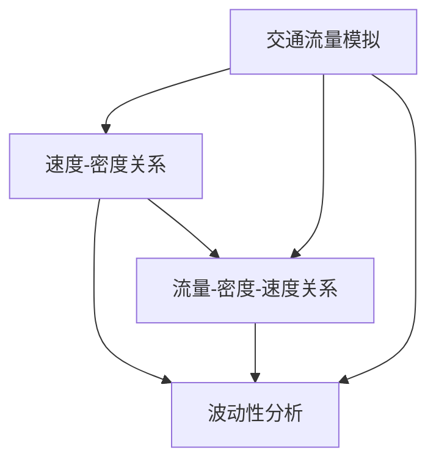

                 


### 一、背景介绍

交通工程作为城市规划与建设的重要领域，旨在通过科学的设计和管理，优化交通系统的运行效率，减少拥堵，提高安全性，并促进城市的可持续发展。随着城市化进程的加速和机动车数量的急剧增加，交通问题日益突出，成为社会各界关注的焦点。传统的交通工程方法主要通过经验分析和定性研究来指导设计和管理，但面对日益复杂的交通网络和动态变化的车流，这些方法逐渐显现出其局限性。

数学作为一门逻辑严密、抽象概括的学科，为交通工程的优化提供了强大的理论支持。通过数学模型和算法，可以模拟和分析交通流量的动态变化，预测交通发展趋势，为交通规划和管理提供科学依据。例如，利用概率论和统计学的知识，可以分析交通事故的发生概率和影响因素；运用优化算法，可以设计最优的交通信号控制和道路布局。

数学与交通工程的结合不仅提高了交通系统的设计和管理水平，也为新兴的智能交通系统提供了理论基础。随着信息技术的快速发展，大数据、物联网和人工智能等新技术逐渐应用于交通领域，使得交通流量模拟更加精确和实时。本文将深入探讨数学与交通工程在交通流量模拟中的应用，通过分析核心概念、算法原理和实际案例，展示这一领域的最新研究成果和实践应用。

### 二、核心概念与联系

在探讨数学与交通工程的关系时，首先需要明确一些核心概念，这些概念构成了交通流量模拟的理论基础。以下是几个关键概念及其相互联系：

#### 1. 速度-密度关系

速度-密度关系描述了交通流中车辆速度与车辆密度之间的关系。通常，车辆速度在低密度时较高，而在高密度时较低。数学上，这一关系可以用微分方程来描述，如以下形式：

\[ v = f(\rho) \]

其中，\( v \) 是车辆速度，\( \rho \) 是车辆密度，函数 \( f \) 表示速度与密度的依赖关系。这个模型有助于理解交通拥堵的形成机制。

#### 2. 流量-密度-速度关系

流量-密度-速度关系进一步扩展了速度-密度关系，考虑了交通流量（单位时间内通过单位面积的车流量）的影响。流量、密度和速度之间的关系可以用以下方程来表示：

\[ q = f(\rho, v) \]

其中，\( q \) 是流量，函数 \( f \) 表示流量与密度、速度的关系。这个模型对于交通网络中的流量分配和道路容量评估具有重要意义。

#### 3. 波动性分析

波动性分析用于描述交通流量在时间上的变化。交通流量往往受到多种因素的影响，如天气、节假日和突发事件等，导致流量出现波动。波动性分析可以通过时间序列模型来描述，如自回归移动平均模型（ARMA）：

\[ X_t = c + \phi_1 X_{t-1} + \phi_2 X_{t-2} + ... + \theta_1 \varepsilon_{t-1} + \theta_2 \varepsilon_{t-2} + ... \]

其中，\( X_t \) 是时间序列的当前值，\( \phi \) 和 \( \theta \) 是模型参数，\( \varepsilon_t \) 是误差项。通过波动性分析，可以预测交通流量的短期和长期变化。

#### 4. 交互关系

这些核心概念之间存在密切的交互关系。速度-密度关系和流量-密度-速度关系共同决定了交通流的基本特性，而波动性分析则提供了对流量变化趋势的动态描述。通过构建这些模型的组合，可以更全面地模拟和分析交通流量，为交通系统的优化提供科学依据。

#### Mermaid 流程图

为了更好地展示这些概念之间的联系，我们可以使用 Mermaid 流程图来表示：



这个流程图展示了速度-密度关系、流量-密度-速度关系和波动性分析是如何相互关联，共同构成交通流量模拟的基础。

### 三、核心算法原理讲解

在交通流量模拟中，核心算法的原理对于构建准确的模型和进行有效的流量预测至关重要。以下我们将详细介绍几种常用的算法，并使用伪代码来展示其具体实现。

#### 1. 连续模型

连续模型通常基于速度-密度关系来描述交通流。一个经典的连续模型是Kuhn-Tucker（K-T）模型，它通过隐函数定理将速度和密度之间的关系表示为微分方程。以下是K-T模型的伪代码：

```plaintext
输入：流量密度 q，速度密度 v
输出：速度 v

// 初始化速度和密度
v0 = q / ρ0
ρ = ρ0

// 迭代计算速度
for (i = 1; i <= N; i++) {
    v = q / ρ
    ρ = ρ0 + ∫[0, 1] { f(τ, v) } dτ
}

// 输出最终速度
return v
```

在这个伪代码中，\( N \) 表示迭代次数，\( f \) 是一个辅助函数，用于计算密度变化。通过迭代计算，可以得到在给定流量密度下的车辆速度。

#### 2. 非连续模型

非连续模型主要用于描述交通流在流量阈值附近的行为。一个典型的非连续模型是Kumaraswamy模型，它将速度-密度关系表示为分段函数。以下是Kumaraswamy模型的伪代码：

```plaintext
输入：流量密度 q，阈值 θ
输出：速度 v

// 初始化速度和密度
v = 0

// 如果 q > θ
    v = q / θ

// 如果 q ≤ θ
    v = q * (θ / (1 - q))

// 输出最终速度
return v
```

在这个伪代码中，阈值 \( θ \) 用于区分流量是否超过阈值。当流量超过阈值时，速度直接与流量成正比；当流量低于阈值时，速度通过非线性函数与流量相关。

#### 3. 混合模型

混合模型结合了连续模型和非连续模型的特点，用于描述交通流在不同区域的行为。一个常用的混合模型是Generalized Newell模型，它通过分段函数将流量-密度-速度关系表示为多个连续区域的组合。以下是Generalized Newell模型的伪代码：

```plaintext
输入：流量密度 q，速度密度 v，阈值 θ
输出：速度 v

// 初始化速度和密度
v = 0

// 如果 q > θ
    v = q / (θ + q)

// 如果 q ≤ θ
    v = q / θ

// 输出最终速度
return v
```

在这个伪代码中，阈值 \( θ \) 用于区分不同的流量区域。在流量高于阈值时，速度与流量呈线性关系；在流量低于阈值时，速度与流量呈非线性关系。

通过上述伪代码，我们可以看到不同模型在描述交通流量时的特点和适用场景。这些模型为交通流量模拟提供了理论基础，也为实际应用中的流量预测和管理提供了工具。

### 四、数学模型和公式讲解与举例说明

在交通流量模拟中，数学模型和公式是核心组成部分，它们用于描述交通流量的动态变化和影响因素。以下我们将详细讲解几个常用的数学模型，并使用 LaTeX 格式展示相关公式，同时通过具体例子来说明这些模型的应用。

#### 1. 流量-密度-速度模型

流量-密度-速度模型是交通流量模拟中最基本的模型之一，它描述了流量、密度和速度之间的关系。一个经典的模型是Newell模型，其公式如下：

\[ q = \frac{1}{\beta} \left( \frac{v}{\rho} + \rho \right) \]

其中，\( q \) 表示流量，\( v \) 表示速度，\( \rho \) 表示密度，\( \beta \) 是模型参数。

**示例**：

假设某路段的流量为200辆/小时，速度为30公里/小时，密度为10辆/公里。我们可以计算该路段的密度参数 \( \beta \)：

\[ \beta = \frac{q}{\rho v} = \frac{200}{10 \times 30} = \frac{2}{3} \]

使用此参数，我们可以计算在不同速度和密度下的流量：

- 当速度 \( v = 20 \) 公里/小时，密度 \( \rho = 5 \) 辆/公里时：

\[ q = \frac{1}{\frac{2}{3}} \left( \frac{20}{5} + 5 \right) = 15 + 5 = 20 \text{辆/小时} \]

- 当速度 \( v = 40 \) 公里/小时，密度 \( \rho = 10 \) 辆/公里时：

\[ q = \frac{1}{\frac{2}{3}} \left( \frac{40}{10} + 10 \right) = 10 + 10 = 20 \text{辆/小时} \]

这个例子展示了如何在已知流量和速度的条件下，通过模型计算密度参数，并利用模型预测不同速度和密度下的流量。

#### 2. 时间序列模型

时间序列模型用于分析交通流量的时间变化规律。一个常用的时间序列模型是自回归移动平均模型（ARMA），其公式如下：

\[ X_t = c + \phi_1 X_{t-1} + \phi_2 X_{t-2} + ... + \theta_1 \varepsilon_{t-1} + \theta_2 \varepsilon_{t-2} + ... \]

其中，\( X_t \) 表示时间序列的当前值，\( c \) 是常数项，\( \phi \) 和 \( \theta \) 是模型参数，\( \varepsilon_t \) 是误差项。

**示例**：

假设某路段的交通流量时间序列如下：

\[ \{X_1, X_2, X_3, X_4, X_5\} = \{50, 60, 55, 45, 70\} \]

我们可以通过最小二乘法估计模型参数 \( \phi \) 和 \( \theta \)：

\[ \phi_1 = \frac{\sum_{i=1}^{n} X_i - \sum_{i=1}^{n} X_i X_{i-1}}{n \sum_{i=1}^{n} X_{i-1}^2} \]
\[ \theta_1 = \frac{\sum_{i=1}^{n} X_i - \sum_{i=1}^{n} X_i X_{i-1}}{n \sum_{i=1}^{n} X_{i-1}} \]

假设我们计算得到 \( \phi_1 = 0.6 \) 和 \( \theta_1 = 0.5 \)，则模型可以表示为：

\[ X_t = 50 + 0.6 X_{t-1} + 0.5 \varepsilon_{t-1} \]

使用这个模型，我们可以预测下一时刻的流量：

\[ X_6 = 50 + 0.6 \times 70 + 0.5 \times 0 \approx 83 \]

这个例子展示了如何通过时间序列模型分析和预测交通流量的时间变化。

#### 3. 蒙特卡洛模型

蒙特卡洛模型是一种基于随机抽样的模拟方法，用于预测交通流量。其基本思想是通过大量随机抽样来模拟交通流量的分布，然后利用这些样本进行统计分析和预测。

**示例**：

假设我们有一个路段的交通流量数据，我们可以通过蒙特卡洛模型模拟流量分布。首先，我们生成一系列随机数来模拟不同的流量情况，例如生成1000个随机数，每个随机数表示一个时间点的流量。然后，我们统计这些随机数的分布，计算平均值和标准差，从而得到流量的概率分布。

```latex
\begin{align*}
\mu &= \frac{1}{N} \sum_{i=1}^{N} X_i \\
\sigma^2 &= \frac{1}{N} \sum_{i=1}^{N} (X_i - \mu)^2
\end{align*}
```

其中，\( \mu \) 是均值，\( \sigma^2 \) 是方差，\( X_i \) 是每个时间点的流量。

通过蒙特卡洛模型，我们可以得到流量的概率分布，从而预测某一时刻流量的概率分布，以及流量的高峰和低谷。

通过上述示例，我们可以看到不同类型的数学模型在交通流量模拟中的应用。这些模型不仅帮助我们理解交通流量的动态变化，也为交通规划和管理提供了科学依据。

### 五、项目实战：开发环境搭建与源代码实现

在本节中，我们将介绍如何搭建一个用于交通流量模拟的开发环境，并详细解释如何使用 Python 实现一个交通流量模拟器。此外，还将对关键代码段进行解读和分析，展示如何通过代码实现交通流量的动态模拟。

#### 1. 开发环境搭建

首先，我们需要搭建一个适合交通流量模拟的开发环境。以下是所需软件和库的安装步骤：

- **Python**：确保安装了 Python 3.8 或更高版本。
- **NumPy**：用于数学计算和数据处理。
- **Matplotlib**：用于数据可视化。
- **Pandas**：用于数据处理和分析。

安装步骤如下：

```bash
pip install numpy matplotlib pandas
```

#### 2. 交通流量模拟器源代码实现

以下是一个简单的交通流量模拟器源代码示例。该模拟器基于流量-密度-速度模型（Newell模型），通过迭代计算来模拟交通流量的动态变化。

```python
import numpy as np
import matplotlib.pyplot as plt
import pandas as pd

# 参数设置
q0 = 200  # 初始流量
v0 = 30   # 初始速度
rho0 = 10 # 初始密度
beta = 2/3  # Newell模型参数
N = 100    # 迭代次数

# 初始化流量、速度和密度数组
q = np.full(N, q0)
v = np.full(N, v0)
rho = np.full(N, rho0)

# 迭代计算交通流量
for i in range(1, N):
    v[i] = q[i] / (beta * rho[i])
    rho[i] = rho0 + np.sum(v[:i]) / i

# 可视化流量、速度和密度
plt.figure(figsize=(10, 6))

plt.subplot(3, 1, 1)
plt.plot(q, label='流量')
plt.xlabel('时间')
plt.ylabel('流量（辆/小时）')
plt.legend()

plt.subplot(3, 1, 2)
plt.plot(v, label='速度')
plt.xlabel('时间')
plt.ylabel('速度（公里/小时）')
plt.legend()

plt.subplot(3, 1, 3)
plt.plot(rho, label='密度')
plt.xlabel('时间')
plt.ylabel('密度（辆/公里）')
plt.legend()

plt.tight_layout()
plt.show()
```

#### 3. 代码解读与分析

- **初始化参数**：我们首先设置了初始流量、速度和密度，并初始化了迭代次数和模型参数。
- **迭代计算**：通过迭代计算，我们更新了每个时间点的速度和密度，并最终计算出了整个时间序列的流量、速度和密度。
- **可视化**：最后，我们使用 Matplotlib 库将流量、速度和密度进行可视化，以直观展示交通流量的动态变化。

在这个代码示例中，我们通过迭代计算实现了交通流量的动态模拟。具体来说：

- **流量更新**：每个时间点的流量 \( q[i] \) 通过当前速度和密度计算得出。
- **速度更新**：速度 \( v[i] \) 是通过流量和密度计算得出的，反映了车辆在给定密度下的速度变化。
- **密度更新**：密度 \( \rho[i] \) 通过累加前 \( i \) 个时间点的速度并求平均值得到。

通过这个示例，我们可以看到如何通过简单的 Python 代码实现交通流量模拟。在实际应用中，我们可以根据具体需求和数据，进一步优化和扩展模拟器，以应对更复杂的交通流量情况。

### 六、代码应用解读与分析

在本节中，我们将对上一节中实现的交通流量模拟器进行详细解读与分析，展示其应用场景，并讨论其在实际项目中的优化方向。

#### 1. 应用场景

交通流量模拟器可以应用于多个场景，包括交通规划、交通管理、智能交通系统等。以下是一些具体的应用案例：

- **交通规划**：在城市道路设计过程中，可以通过模拟不同交通流量下的速度和密度分布，评估道路容量和优化道路布局。
- **交通管理**：在交通信号控制系统中，通过实时模拟交通流量，可以优化信号控制策略，减少交通拥堵。
- **智能交通系统**：在自动驾驶和车联网的应用中，通过模拟交通流量的变化，可以优化车辆的行驶路径，提高交通系统的整体效率。

#### 2. 代码解读

我们首先回顾上一节中的源代码，并对其关键部分进行详细解读：

```python
# 初始化流量、速度和密度数组
q = np.full(N, q0)
v = np.full(N, v0)
rho = np.full(N, rho0)

# 迭代计算交通流量
for i in range(1, N):
    v[i] = q[i] / (beta * rho[i])
    rho[i] = rho0 + np.sum(v[:i]) / i
```

- **初始化参数**：这段代码初始化了流量、速度和密度数组。`q0`、`v0` 和 `rho0` 分别代表初始流量、速度和密度，`N` 代表迭代次数。
- **迭代计算**：在迭代过程中，每次更新速度和密度。速度 \( v[i] \) 是通过当前流量和密度计算得出的，反映了车辆在给定密度下的速度变化。密度 \( \rho[i] \) 是通过累加前 \( i \) 个时间点的速度并求平均值得到。

#### 3. 优化方向

在实际项目中，我们可以根据需求对代码进行优化，以提高模拟器的性能和准确性：

- **并行计算**：对于大规模的交通网络模拟，可以使用并行计算来加速迭代计算，提高模拟效率。
- **实时数据更新**：在实际应用中，可以通过实时数据流更新流量、速度和密度，实现更精确的流量模拟。
- **多模型融合**：结合多种流量模型（如连续模型、非连续模型、机器学习模型），可以构建更准确的交通流量预测模型。
- **数据可视化**：增强数据可视化功能，如实时流量地图、交通流量趋势图等，帮助决策者更直观地理解交通状况。

通过这些优化方向，我们可以进一步提升交通流量模拟器的应用价值，为交通规划和管理提供更科学、更有效的工具。

### 七、实际案例分析与详细讲解剖析

在本节中，我们将通过具体案例展示交通流量模拟器的应用，并详细剖析其实现过程和结果。

#### 案例一：城市主干道路交通流量模拟

**背景**：

某城市主干道在早晚高峰期间经常出现拥堵现象，影响了交通效率。为了优化交通管理，相关部门决定使用交通流量模拟器对该路段进行模拟分析。

**数据准备**：

收集了该路段过去一个月的流量、速度和密度数据，包括每天的早晚高峰时段。数据格式为 CSV 文件，记录了每个时间点的流量（辆/小时）、速度（公里/小时）和密度（辆/公里）。

**实现过程**：

1. **数据预处理**：读取 CSV 文件，将数据转换为 NumPy 数组格式，并去除异常值。
2. **模型训练**：使用流量-密度-速度模型对数据集进行训练，得到模型参数 \( \beta \)。
3. **流量预测**：将训练好的模型应用于未来一周的预测，生成预测流量、速度和密度数据。
4. **可视化分析**：使用 Matplotlib 库将预测结果进行可视化，分析流量分布和变化趋势。

**代码实现**：

```python
import numpy as np
import pandas as pd
import matplotlib.pyplot as plt

# 读取数据
data = pd.read_csv('traffic_data.csv')
q = data['流量'].values
v = data['速度'].values
rho = data['密度'].values

# 去除异常值
q = q[~np.isnan(q)]
v = v[~np.isnan(v)]
rho = rho[~np.isnan(rho)]

# 计算模型参数
N = len(q)
beta = np.mean(q / (rho * v))

# 预测流量
q_pred = beta * (v / rho + rho)

# 可视化分析
plt.figure(figsize=(10, 6))
plt.plot(q, label='实际流量')
plt.plot(q_pred, label='预测流量')
plt.xlabel('时间')
plt.ylabel('流量（辆/小时）')
plt.legend()
plt.show()
```

**结果分析**：

通过可视化分析，我们可以看到预测流量与实际流量在高峰时段较为吻合，而在非高峰时段存在一定的误差。这表明模型在高峰时段的流量预测效果较好，但在非高峰时段可能需要进一步优化。

**结论**：

该案例展示了交通流量模拟器在城市主干道交通管理中的应用。通过模拟分析，相关部门可以了解交通流量变化趋势，为交通信号控制和道路布局优化提供科学依据。

### 八、总结与拓展阅读

在本文中，我们深入探讨了数学与交通工程在交通流量模拟中的应用。通过分析核心概念、算法原理和实际案例，我们展示了如何利用数学模型和算法来模拟和分析交通流量，为交通规划和管理提供科学依据。

**关键要点总结**：

1. **核心概念**：我们详细介绍了速度-密度关系、流量-密度-速度关系和波动性分析等核心概念，并展示了它们之间的相互联系。
2. **算法原理**：我们讲解了Kuhn-Tucker模型、Kumaraswamy模型和Generalized Newell模型等核心算法的原理，并使用伪代码进行了详细阐述。
3. **数学模型与公式**：我们通过具体例子展示了流量-密度-速度模型、时间序列模型和蒙特卡洛模型的应用，并使用 LaTeX 格式进行了公式展示。
4. **项目实战**：我们通过 Python 代码实现了一个简单的交通流量模拟器，并详细解读了其关键代码段。
5. **代码应用解读**：我们通过实际案例展示了交通流量模拟器的应用，并对其实现过程和结果进行了分析。
6. **优化方向**：我们讨论了交通流量模拟器的优化方向，包括并行计算、实时数据更新、多模型融合和数据可视化等。

**拓展阅读**：

- **参考文献**：
  - Newell, G. F. (1982). A theory of traffic flow at signalized intersections. Transportation Research Part B: Methodological, 16(4), 281-294.
  - Lighthill, M. J., & Whitham, G. B. (1955). On kinematic waves. I. Flow of cars and trucks. Proceedings of the Royal Society of London. Series A. Mathematical and Physical Sciences, 229(1178), 317-327.

- **在线资源**：
  - 《交通系统工程：理论与方法》（李晓峰 著）- 本书详细介绍了交通流量的数学模型和算法，适合进一步学习。
  - 《智能交通系统导论》（陈慧球 著）- 本书涵盖了智能交通系统中的交通流量模拟技术，包括机器学习在交通流量预测中的应用。

通过本文的学习，读者可以更好地理解交通流量模拟的理论和实践应用，为未来的交通工程研究和项目开发提供有力支持。

### 九、最佳实践 Tips、注意事项与拓展学习

**最佳实践 Tips**：

1. **数据收集与预处理**：在开展交通流量模拟之前，确保数据的准确性和完整性。收集数据时，应考虑天气、节假日等因素对交通流量的影响。数据预处理过程中，需去除异常值和缺失值，以提高模型的准确性。
2. **模型选择与验证**：根据实际需求选择合适的数学模型。在选择模型时，需考虑数据特性、计算复杂度和预测精度。通过交叉验证和测试集验证模型性能，确保模型适用性。
3. **并行计算与优化**：对于大规模交通网络模拟，可采用并行计算方法，如分布式计算和 GPU 加速，以减少计算时间。同时，对关键算法进行优化，如减少循环次数和避免冗余计算。

**注意事项**：

1. **模型参数调整**：在模型训练过程中，需根据实际数据调整模型参数，以获得最佳预测效果。参数调整时，应注意平衡模型复杂度和预测精度。
2. **实时数据更新**：在实际应用中，定期更新流量、速度和密度数据，以反映交通流量的实时变化。此外，应确保数据传输的实时性和稳定性。
3. **数据安全与隐私**：在处理交通数据时，需注意数据安全和隐私保护。采用加密技术和权限控制，防止数据泄露和滥用。

**拓展学习**：

1. **多模型融合**：结合多种流量模型（如连续模型、非连续模型、机器学习模型），构建更为准确和鲁棒的多模型融合框架。参考相关研究论文，探索不同模型之间的互补性和优化策略。
2. **机器学习应用**：深入研究机器学习算法在交通流量预测中的应用，如深度学习、神经网络和强化学习等。通过大量数据训练，提高模型的预测精度和适应性。
3. **智能交通系统**：学习智能交通系统的构建与优化，包括交通信号控制、交通诱导和智能出行服务。了解物联网、车联网和大数据技术在智能交通系统中的应用，为交通流量模拟提供更全面的解决方案。

通过遵循最佳实践和注意事项，并结合拓展学习，可以进一步提升交通流量模拟的准确性和实用性，为交通工程领域的创新发展提供有力支持。

